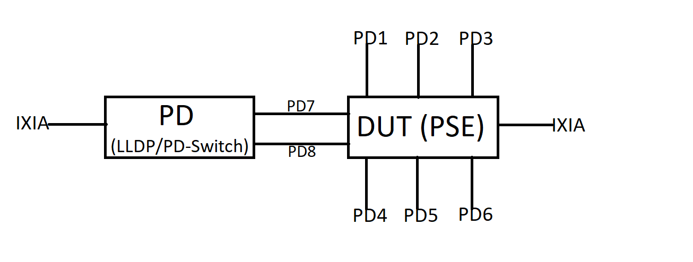

#  SQA Test Plan
#  Power Over Ethernet - PoE/PoE+/802.3bt
#  SONiC 3.2.2 Release 

[TOC]

# Test Plan Revision History
| Rev  |    Date    |        Author                  |      Change Description      |
| :--: | :--------: | :----------------------------: | :--------------------------: |
| 0.1  | 6/14/2021  | Mohan Sai Vara Prasad Pedavala |      Initial version         |
| 0.2  | 6/17/2021  | Mohan Sai Vara Prasad Pedavala |      Addressed review comments by Sukanya Kalluri|
| 0.3  | 6/21/2021  | Mohan Sai Vara Prasad Pedavala |      Addressed review comments by Ramakrishna Koduri|

# List of Reviewers
| Function  |         Name         |
| :------:  | :------------------: |
| Dev | V.S.Rama Krishna Nemani |
| Dev | Ramakrishna Koduri |
| QA  | Kalyan Vadlamani |
| QA  | Kiran Obulampalli |

# List of Approvers
| Function  |           Name         | Date Approved |
| :-------: | :--------------------: | :-----------: |
| Dev | V.S.Rama Krishna Nemani |
| Dev | Ramakrishna Koduri |
| QA  | Kalyan Vadlamani |
| QA  | Kiran Obulampalli |

# Definition/Abbreviation
| **Term** | **Meaning**                                                |
| -------- | ---------------------------------------------------------- |
| CLI      | Command-Line Interface                                     |
| HLD      | High Level Design Document                                 |
| PoE      | High-Power Mode                                            |
| PoE+     | Power Over Ethernet                                        |
| PSE      | Power Sourcing Equipment                                   |
| PD       | Powered Device                                             |
| Dot3af   | IEEE 802.3af Specification (PoE)                           |
| Dot3at   | IEEE 802.3at Specification (PoE+, High Power Mode)         |
| Dot3bt   | IEEE 802.3bt Specification (Standardized High Power Mode)  |
| LLDP     | Link Layer Discovery Protocol                              |

### Objective 
The main objective of this document is to cover the test cases that will be executed to verify the complete PoE (PoE/PoE+/802.3bt) functionality.
Topologies and test cases  for testing the feature will be discussed as part of this document.

PoE feature going to be supported in the SONiC 3.2.2 release.

### Scope
This test plan will cover the PoE (PoE/PoE+/802.3bt) functionality in different combinations. 

# Feature Overview
Power over Ethernet technology allows IP telephones, wireless LAN Access Points, Web-Cameras and many other appliances to receive power as well as data over existing LAN cabling, without needing to modify the existing Ethernet infrastructure.

# 1 Test Focus Areas
## 1.1 Functional Testing 
   - Max power delivery based on the configured PoE high power mode.
   - Validating the different PoE power management modes with all PoE high power modes.
   - Power negotiation using LLDP with all PoE high power modes by using applicable PD types.
   - Data traffic validation with connected PD while delivering power.
   - Validating different detection types with all PoE high power modes by using applicable PD types.

## 1.2 Functional Interaction
  - PoE interaction with STP/RSTP, Static and Dynamic LAG's.

## 1.3 Scale and Performance Testing
  - PoE port priority validation with default and non-default Threshold values by drawing maximum available power.

## 1.4 REST
  - PoE configuration using REST commands.

## 1.5 GNMI
  - Validation of GNMI Operations for PoE.

## 1.6 Warm Boot 
  - Uninterrupted power delivery during warm boot.

## 1.7 Serviceability
  - Validation of syslog messages for different PoE events.

## 1.8 Negative Testing  
 - PD's are not powered up when PoE admin mode is disabled and vice versa.

## 1.9 Docker Testing
  - PoE configuration persisting after docker restart

# 2 Topologies
## 2.1 Topology

# 3 Test  Case and Objectives
## 3.1 Functional
### 3.1.1 Verify that PSE port is delivering power up to 15.4W in dot3af and legacy high power modes.
| **Test ID**    | **PoE_Functional_001**                                |
| -------------- | :----------------------------------------------------------- |
| **Test Name**  | **Verify that PSE port is delivering power up to 15.4W in dot3af and legacy high power modes** |
| **Test Setup** | **Topology**                                                |
| **Type**       | **Functional**                                               |
| **Steps**      | 1) Connect PD1 & PD2 and configure high power mode on PD connected ports as dot3af and legacy   2) Using PD1 and PD2 request 15.4W from class-3   3) Verify that PSE ports are delivering min 13W (15.4 PSE)   4) Verify that PSE ports move to the 'Overload' state when PD's are requesting more than 15.4W   | 

### 3.1.2 Verify that PSE port is delivering power up to 30W in dot3at and pre-dot3at high power modes.
| **Test ID**    | **PoE_Functional_002**                                |
| -------------- | :----------------------------------------------------------- |
| **Test Name**  | **Verify that PSE port is delivering power up to 30W in dot3at and pre-dot3at high power modes** |
| **Test Setup** | **Topology**                                                |
| **Type**       | **Functional**                                               |
| **Steps**      | 1) Connect PD1 & PD2 and configure high power mode on PD connected ports as dot3at and pre-dot3at   2) Using PD1 and PD2 request 30W from class-4   3) Verify that PSE ports are delivering min 25W (30W PSE   4) Verify that PSE ports move to the 'Overload' state when PD's are requesting more than 30W   | 

### 3.1.3 Verify that PSE port is delivering power up to 60W in pre-dot3bt high power mode.
| **Test ID**    | **PoE_Functional_003**                                |
| -------------- | :----------------------------------------------------------- |
| **Test Name**  | **Verify that PSE port is delivering power up to 60W in pre-dot3bt high power mode** |
| **Test Setup** | **Topology**                                                |
| **Type**       | **Functional**                                               |
| **Steps**      | 1) Connect PD1 & PD2 and configure high power mode on PD connected ports as pre-dot3bt   2) Using PD1 and PD2 request 60W from class-4   3) Verify that PSE ports are delivering min 51W (60W PSE)   4) Verify that PSE ports move to the 'Overload' state when PD's are requesting more than 60W   |

### 3.1.4 Verify that PSE port is delivering power up to 60W in dot3bt-type3 high power mode.
| **Test ID**    | **PoE_Functional_004**                                |
| -------------- | :----------------------------------------------------------- |
| **Test Name**  | **Verify that PSE port is delivering power up to 60W in dot3bt-type3 high power mode** |
| **Test Setup** | **Topology**                                                |
| **Type**       | **Functional**                                               |
| **Steps**      | 1) Connect PD1 & PD2 and configure high power mode on PD connected ports as dot3bt-type3   2) Using PD1 and PD2 request 60W from class-6   3) Verify that PSE ports are delivering min 51W (60W PSE)   4) Verify that PSE ports move to the 'Overload' state when PD's are requesting more than 60W   |

### 3.1.5 Verify that PSE port is delivering power up to 90W in dot3bt high power mode.
| **Test ID**    | **PoE_Functional_005**                                |
| -------------- | :----------------------------------------------------------- |
| **Test Name**  | **Verify that PSE port is delivering power up to 90W in dot3bt high power mode** |
| **Test Setup** | **Topology**                                                |
| **Type**       | **Functional**                                               |
| **Steps**      | 1) Connect PD1 & PD2 and configure high power mode on PD connected ports as dot3bt   2) Using PD1 and PD2 request 90W from class-8   3) Verify that PSE ports are delivering min 71.3 (90W PSE   4) Verify that PSE ports move to the 'Overload' state when PD's are requesting more than 90W   |

### 3.1.6 Verify the Static and Dynamic modes in dot3af and legacy high power modes with class-based power limit type.
| **Test ID**    | **PoE_Functional_006**                                |
| -------------- | :----------------------------------------------------------- |
| **Test Name**  | **Verify the Static and Dynamic modes in dot3af and legacy high power modes with class-based power limit type** |
| **Test Setup** | **Topology**                                                |
| **Type**       | **Functional**                                               |
| **Steps**      | 1) Connect PD1 & PD2 and configure high power mode on PD connected ports as dot3af and legacy   2) Configure power management type as Static and power limit type as class-based on PD connected ports   3) Using PD1 and PD2 request class range power from class-0 to class-3   4) Verify that PSE reserves corresponding max class power even though PD's may not use the allocated power   5) Verify that PSE ports move to the 'Overload' state when PD's are requesting more than max class power   6) Change the power management type to Dynamic   7) Repeat Step-3   8) Verify that PSE is delivering only the PD's requested power for the corresponding classes   9) Repeat Step-5   |

### 3.1.7 Verify the Static and Dynamic modes in dot3at and pre-dot3at high power modes with class-based power limit type.
| **Test ID**    | **PoE_Functional_007**                                |
| -------------- | :----------------------------------------------------------- |
| **Test Name**  | **Verify the Static and Dynamic modes in dot3at and pre-dot3at high power modes with class-based power limit type** |
| **Test Setup** | **Topology**                                                |
| **Type**       | **Functional**                                               |
| **Steps**      | 1) Connect PD1 & PD2 and configure high power mode on PD connected ports as dot3at and pre-dot3at   2) Configure power management type as Static and power limit type as class-based on PD connected ports   3) Using PD1 and PD2 request class range power from class-0 to class-4   4) Verify that PSE reserves corresponding max class power even though PD's may not use the allocated power   5) Verify that PSE ports move to the 'Overload' state when PD's are requesting more than max class power   6) Change the power management type to Dynamic   7) Repeat Step-3   8) Verify that PSE is delivering only the PD's requested power for the corresponding classes   9) Repeat Step-5   |

### 3.1.8 Verify the Static and Dynamic modes in pre-dot3bt high power mode with class-based power limit type.
| **Test ID**    | **PoE_Functional_008**                                |
| -------------- | :----------------------------------------------------------- |
| **Test Name**  | **Verify the Static and Dynamic modes in pre-dot3bt high power mode with class-based power limit type.** |
| **Test Setup** | **Topology**                                                |
| **Type**       | **Functional**                                               |
| **Steps**      | 1) Connect PD1 & PD2 and configure high power mode on PD connected ports as pre-dot3bt   2) Configure power management type as Static and power limit type as class-based on PD connected ports   3) Using PD1 and PD2 request class range power from class-0 to class-4   4) Verify that PSE reserves corresponding max class power even though PD's may not use the allocated power   5) Verify that PSE ports move to the 'Overload' state when PD's are requesting more than max class power   6) Change the power management type to Dynamic   7) Repeat Step-3   8) Verify that PSE is delivering only the PD's requested power for the corresponding classes   9) Repeat Step-5   |

### 3.1.9 Verify the Static and Dynamic modes in dot3bt-type3 high power mode with class-based power limit type.
| **Test ID**    | **PoE_Functional_009**                                |
| -------------- | :----------------------------------------------------------- |
| **Test Name**  | **Verify the Static and Dynamic modes in dot3bt-type3 high power mode with class-based power limit type** |
| **Test Setup** | **Topology**                                                |
| **Type**       | **Functional**                                               |
| **Steps**      | 1) Connect PD1 & PD2 and configure high power mode on PD connected ports as dot3bt-type3   2) Configure power management type as Static and power limit type as class-based on PD connected ports   3) Using PD1 and PD2 request class range power from class-0 to class-6   4) Verify that PSE reserves corresponding max class power even though PD's may not use the allocated power   5) Verify that PSE ports move to the 'Overload' state when PD's are requesting more than max class power   6) Change the power management type to Dynamic   7) Repeat Step-3   8) Verify that PSE is delivering only the PD's requested power for the corresponding classes   9) Repeat Step-5   |

### 3.1.10 Verify the Static and Dynamic modes in dot3bt high power mode with class-based power limit type.
| **Test ID**    | **PoE_Functional_010**                                |
| -------------- | :----------------------------------------------------------- |
| **Test Name**  | **Verify the Static and Dynamic modes in dot3bt high power mode with class-based power limit type** |
| **Test Setup** | **Topology**                                                |
| **Type**       | **Functional**                                               |
| **Steps**      | 1) Connect PD1 & PD2 and configure high power mode on PD connected ports as dot3bt   2) Configure power management type as Static and power limit type as class-based on PD connected ports   3) Using PD1 and PD2 request class range power from class-0 to class-8   4) Verify that PSE reserves corresponding max class power even though PD's may not use the allocated power   5) Verify that PSE ports move to the 'Overload' state when PD's are requesting more than max class power   6) Change the power management type to Dynamic   7) Repeat Step-3   8) Verify that PSE is delivering only the PD's requested power for the corresponding classes   9) Repeat Step-5   |

### 3.1.11 Verify the Static and Dynamic modes in dot3af and legacy high power modes with user-defined power limit type.
| **Test ID**    | **PoE_Functional_011**                                |
| -------------- | :----------------------------------------------------------- |
| **Test Name**  | **Verify the Static and Dynamic modes in dot3af and legacy high power modes with user-defined power limit type** |
| **Test Setup** | **Topology**                                                |
| **Type**       | **Functional**                                               |
| **Steps**      | 1) Connect PD1 & PD2 and configure high power mode on PD connected ports as dot3af and legacy   2) Configure power management type as Static and power limit type as user-defined with non-default power value (Eg:18W) on PD connected ports   3) Using PD1 and PD2 request class range power from class-0 to class-3   4) Verify that PSE reserves power as per the user-defined power (Eg:18W) for the ports irrespective of the power delivery and the requested class   5) Verify that PSE ports move to the 'Overload' state when PD's are requesting more than user-defined power (Eg:18W)   6) Change the power management type to Dynamic   7) Repeat Step-3   8) Verify that PSE is delivering only the PD's requested power   9) Repeat Step-5   |

### 3.1.12 Verify the Static and Dynamic modes in dot3at and pre-dot3at high power modes with user-defined power limit type.
| **Test ID**    | **PoE_Functional_012**                                |
| -------------- | :----------------------------------------------------------- |
| **Test Name**  | **Verify the Static and Dynamic modes in dot3at and pre-dot3at high power modes with user-defined power limit type** |
| **Test Setup** | **Topology**                                                |
| **Type**       | **Functional**                                               |
| **Steps**      | 1) Connect PD1 & PD2 and configure high power mode on PD connected ports as dot3at and pre-dot3at   2) Configure power management type as Static and power limit type as user-defined with non-default power value (Eg:32W) on PD connected ports   3) Using PD1 and PD2 request class range power from class-0 to class-4   4) Verify that PSE reserves power as per the user-defined power (Eg:32W) for the ports irrespective of the power delivery and the requested class   5) Verify that PSE ports move to the 'Overload' state when PD's are requesting more than user-defined power (Eg:32W)   6) Change the power management type to Dynamic   7) Repeat Step-3   8) Verify that PSE is delivering only the PD's requested power   9) Repeat Step-5   |

### 3.1.13 Verify the Static and Dynamic modes in pre-dot3bt high power mode with user-defined power limit type.
| **Test ID**    | **PoE_Functional_013**                                |
| -------------- | :----------------------------------------------------------- |
| **Test Name**  | **Verify the Static and Dynamic modes in pre-dot3bt high power mode with user-defined power limit type** |
| **Test Setup** | **Topology**                                                |
| **Type**       | **Functional**                                               |
| **Steps**      | 11) Connect PD1 & PD2 and configure high power mode on PD connected ports as pre-dot3bt   2) Configure power management type as Static and power limit type as user-defined with non-default power value (Eg:60W) on PD connected ports   3) Using PD1 and PD2 request class range power from class-0 to class-4   4) Verify that PSE reserves power as per the user-defined power (Eg:60W) for the ports irrespective of the power delivery and the requested class   5) Verify that PSE ports move to the 'Overload' state when PD's are requesting more than user-defined power (Eg:60W)   6) Change the power management type to Dynamic   7) Repeat Step-3   8) Verify that PSE is delivering only the PD's requested power   9) Repeat Step-5   |

### 3.1.14 Verify the Static and Dynamic modes in dot3bt-type3 high power mode with user-defined power limit type.
| **Test ID**    | **PoE_Functional_014**                                |
| -------------- | :----------------------------------------------------------- |
| **Test Name**  | **Verify the Static and Dynamic modes in dot3bt-type3 high power mode with user-defined power limit type** |
| **Test Setup** | **Topology**                                                |
| **Type**       | **Functional**                                               |
| **Steps**      | 1) Connect PD1 & PD2 and configure high power mode on PD connected ports as dot3bt-type3   2) Configure power management type as Static and power limit type as user-defined with non-default power value (Eg:60W) on PD connected ports   3) Using PD1 and PD2 request class range power from class-0 to class-6   4) Verify that PSE reserves power as per the user-defined power (Eg:60W) for the ports irrespective of the power delivery and the requested class   5) Verify that PSE ports move to the 'Overload' state when PD's are requesting more than user-defined power (Eg:60W)   6) Change the power management type to Dynamic   7) Repeat Step-3   8) Verify that PSE is delivering only the PD's requested power   9) Repeat Step-5   |

### 3.1.15 Verify the Static and Dynamic modes in dot3bt high power mode with user-defined power limit type.
| **Test ID**    | **PoE_Functional_015**                                |
| -------------- | :----------------------------------------------------------- |
| **Test Name**  | **Verify the Static and Dynamic modes in dot3bt high power mode with user-defined power limit type** |
| **Test Setup** | **Topology**                                                |
| **Type**       | **Functional**                                               |
| **Steps**      | 1) Connect PD1 & PD2 and configure high power mode on PD connected ports as dot3bt   2) Configure power management type as Static and power limit type as user-defined with non-default power value (Eg:90W) on PD connected ports   3) Using PD1 and PD2 request class range power from class-0 to class-8   4) Verify that PSE reserves power as per the user-defined power (Eg:90W) for the ports irrespective of the power delivery and the requested class   5) Verify that PSE ports move to the 'Overload' state when PD's are requesting more than user-defined power (Eg:90W)   6) Change the power management type to Dynamic   7) Repeat Step-3   8) Verify that PSE is delivering only the PD's requested power   9) Repeat Step-5   |

### 3.1.16 Verify the Static and Dynamic modes in dot3af and legacy high power modes with none power limit type.
| **Test ID**    | **PoE_Functional_016**                                |
| -------------- | :----------------------------------------------------------- |
| **Test Name**  | **Verify the Static and Dynamic modes in dot3af and legacy high power modes with none power limit type** |
| **Test Setup** | **Topology**                                                |
| **Type**       | **Functional**                                               |
| **Steps**      | 1) Connect PD1 & PD2 and configure high power mode on PD connected ports as dot3af and legacy   2) Configure power management type as Static and power limit type as none on PD connected ports   3) Using PD1 and PD2 request class range power from class-0 to class-3   4) Verify that PSE reserves max power as per the high power mode (dot3af or legacy) for the ports irrespective of the power delivery and the requested class   5) Verify that PSE ports move to 'Overload' state when PD's are requesting more tha   6) Change the power management type to Dynamic   7) Repeat Step-3   8) Verify that PSE is delivering only the PD's requested power   9) Repeat Step-5   |

### 3.1.17 Verify the Static and Dynamic modes in dot3at and pre-dot3at high power modes with none power limit type.
| **Test ID**    | **PoE_Functional_017**                                |
| -------------- | :----------------------------------------------------------- |
| **Test Name**  | **Verify the Static and Dynamic modes in dot3at and pre-dot3at high power modes with none power limit type  ** |
| **Test Setup** | **Topology**                                                |
| **Type**       | **Functional**                                               |
| **Steps**      | 1) Connect PD1 & PD2 and configure high power mode on PD connected ports as dot3at and pre-dot3at   2) Configure power management type as Static and power limit type as none on PD connected ports   3) Using PD1 and PD2 request class range power from class-0 to class-4   4) Verify that PSE reserves max power as per the high power mode (dot3at or pre-dot3at) for the ports irrespective of the power delivery and the requested class   5) Verify that PSE ports move to the 'Overload' state when PD's are requesting more than high mode (dot3at or pre-dot3at) power   6) Change the power management type to Dynamic   7) Repeat Step-3   8) Verify that PSE is delivering only the PD's requested power   9) Repeat Step-5   |

### 3.1.18 Verify the Static and Dynamic modes in pre-dot3bt high power mode with none power limit type.
| **Test ID**    | **PoE_Functional_018**                                |
| -------------- | :----------------------------------------------------------- |
| **Test Name**  | **Verify the Static and Dynamic modes in pre-dot3bt high power mode with none power limit type** |
| **Test Setup** | **Topology**                                                |
| **Type**       | **Functional**                                               |
| **Steps**      | 1) Connect PD1 & PD2 and configure high power mode on PD connected ports as pre-dot3bt   2) Configure power management type as Static and power limit type as none on PD connected ports   3) Using PD1 and PD2 request class range power from class-0 to class-4   4) Verify that PSE reserves max power as per the high mode (pre-dot3bt) for the ports irrespective of the power delivery and the requested class   5) Verify that PSE ports move to the 'Overload' state when PD's are requesting more than high mode (pre-dot3bt) power   6) Change the power management type to Dynamic   7) Repeat Step-3   8) Verify that PSE is delivering only the PD's requested power   9) Repeat Step-5   |

### 3.1.19 Verify the Static and Dynamic modes in dot3bt-type3 high power mode with none power limit type.
| **Test ID**    | **PoE_Functional_019**                                |
| -------------- | :----------------------------------------------------------- |
| **Test Name**  | **Verify the Static and Dynamic modes in dot3bt-type3 high power mode with none power limit type** |
| **Test Setup** | **Topology**                                                |
| **Type**       | **Functional**                                               |
| **Steps**      | 1) Connect PD1 & PD2 and configure high power mode on PD connected ports as dot3bt-type3   2) Configure power management type as Static and power limit type as none on PD connected ports   3) Using PD1 and PD2 request class range power from class-0 to class-6   4) Verify that PSE reserves max power as per the high mode (dot3bt-type3) for the ports irrespective of the power delivery and the requested class   5) Verify that PSE ports move to the 'Overload' state when PD's are requesting more than high mode (pre-dot3bt) power   6) Change the power management type to Dynamic   7) Repeat Step-3   8) Verify that PSE is delivering only the PD's requested power   9) Repeat Step-5   |

### 3.1.20 Verify the Static and Dynamic modes in dot3bt high power mode with none power limit type.
| **Test ID**    | **PoE_Functional_020**                                |
| -------------- | :----------------------------------------------------------- |
| **Test Name**  | **Verify the Static and Dynamic modes in dot3bt high power mode with none power limit type** |
| **Test Setup** | **Topology**                                                |
| **Type**       | **Functional**                                               |
| **Steps**      | 1) Connect PD1 & PD2 and configure high power mode on PD connected ports as dot3bt   2) Configure power management type as Static and power limit type as none on PD connected ports   3) Using PD1 and PD2 request class range power from class-0 to class-8   4) Verify that PSE reserves max power as per the high power mode (dot3bt) for the ports irrespective of the power delivery and the requested class   5) Verify that PSE ports move to the 'Overload' state when PD's are requesting more than high mode (dot3bt) power   6) Change the power management type to Dynamic   7) Repeat Step-3   8) Verify that PSE is delivering only the PD's requested power   9) Repeat Step-5   |

### 3.1.21 Verify the different detection modes with Type-1 to Type-4 and legacy PD's.
| **Test ID**    | **PoE_Functional_021**                                |
| -------------- | :----------------------------------------------------------- |
| **Test Name**  | **Verify the different detection modes with Type-1 to Type-4 and legacy PD's** |
| **Test Setup** | **Topology**                                                |
| **Type**       | **Functional**                                               |
| **Steps**      | 1) Configure detection type as ‘4ptdot3af’ and connect Type1/Type2   2) Verify that Type1/Type2 PD is detected and assigned power based on its class value   3) Configure detection type as ‘4ptdot3af+legacy’ and connect Type1/Type2/Legacy PD   4) Verify that Type1/Type2/Legacy PD is detected and assigned power based on its class value   5) Configure detection type as ‘legacy’ and connect Legacy PD   6) Verify that Legacy PD only is detected and assigned power based on its class value   7) Configure detection type as ‘auto’ and connect Type1/Type2/Legacy PD   8) Verify that Type1/Type2/	Legacy PD is detected and assigned power based on its class value   9) Repeat the test with different high power modes   10) Verify the applicable types of PD's are detected and powered up corresponding to the configured high power modes   |

### 3.1.22 Verify that PoE reset is working properly with all supported high power modes.
| **Test ID**    | **PoE_Functional_022**                                |
| -------------- | :----------------------------------------------------------- |
| **Test Name**  | **Verify that PoE reset is working properly with all supported high power modes** |
| **Test Setup** | **Topology**                                                |
| **Type**       | **Functional**                                               |
| **Steps**      | 1) Connect PD1 and PD2 and request power within the high power mode range and verify DUT is delivering power to the PD's   2) Perform PoE reset. Verify reset is successful and power delivery is resumed properly after reset for PD's   3) Change the class to any class other than the previous class and request the power invalid range using PD's.   4) Verify that DUT is delivering PD's requested power range   5) Request for power greater than the max limit in class. And re-change the power value with an invalid range   6) Verify that DUT is not delivering power to PD's as the requested power is not in valid range and the port is going to Fault state   7) Perform PoE reset. Verify that reset is successful and DUT is delivering power to PD's after reset   8) Repeat the test with different high power modes and verify that PoE rest functionality is working fine   |

### 3.1.23 Verify that PD is able to carry line-rate data traffic without any loss while delivering power.
| **Test ID**    | **PoE_Functional_023**                                |
| -------------- | :----------------------------------------------------------- |
| **Test Name**  | **Verify that PD is able to carry line-rate data traffic without any loss while delivering power** |
| **Test Setup** | **Topology**                                                |
| **Type**       | **Functional**                                               |
| **Steps**      | 1) Connect PD1 and request power within the high power mode range and verify DUT is delivering power to the PD1   2) Connect one IXIA to PD (Load box) and another to PSE. Initiate line-rate traffic between IXIA'   3) Verify that no traffic loss at both ends and PD delivering power continuously while traffic is going on.   4) Repeat the test with different high power modes and verify PD able to carry line-rate data traffic without any loss while delivering power   |

### 3.1.24 Verify that PD's able to negotiate the required power using LLDP.
| **Test ID**    | **PoE_Functional_024**                                |
| -------------- | :----------------------------------------------------------- |
| **Test Name**  | **Verify that PD's able to negotiate the required power using LLDP** |
| **Test Setup** | **Topology**                                                |
| **Type**       | **Functional**                                               |
| **Steps**      | 1) Connect IXIA, Type-1, Type-2, Type-3, Type-4 PD's to DUT and request corresponding high power mode max power using LLDP   2) Verify that PSE ports delivering requested power using LLDP and verify the PoE power negotiation by capturing LLDP packets using IXIA   3) Repeat the test with different high power modes and verify PD's able to negotiate the required power using LLDP in all applicable modes   |

### 3.1.25 Verify that PSE ports resumes power delivery to connected PD's after shutdown/no-shutdown on PSE ports.
| **Test ID**    | **PoE_Functional_025**                                |
| -------------- | :----------------------------------------------------------- |
| **Test Name**  | **Verify that PSE ports resumes power delivery to connected PD's after shutdown/no-shutdown on PSE ports** |
| **Test Setup** | **Topology**                                                |
| **Type**       | **Functional**                                               |
| **Steps**      | 1) Connect Type-1, Type-2, Type-3, Type-4 PD's to DUT   2) Configure high power mode on PD connected ports as dot3bt   3) Request corresponding max power (15.4W, 30W, 60W & 90W) from the connected PD's   4) Verify that PSE ports are delivering requested power accordingly for all PD's   5) Perform shutdown on PoE ports   6) Verify that PSE ports stops transferring power to the connect PD's   7) Perform no-shutdown on PoE ports   8) Verify that PSE ports resumes power delivery to connected PD's   9) Repeat the test with different high power modes and verify that PSE ports resumes power delivery to connected PD's after shutdown/no-shutdown on PoE ports   |

### 3.1.26 Verify the PoE behavior  after PD/PD-Switch reboot.
| **Test ID**    | **PoE_Functional_026**                                |
| -------------- | :----------------------------------------------------------- |
| **Test Name**  | **Verify the PoE behavior  after PD/PD-Switch reboot** |
| **Test Setup** | **Topology**                                                |
| **Type**       | **Functional**                                               |
| **Steps**      | 1) Connect PD7 and PD8 and request power within the high power mode range and verify DUT is delivering power to the PD's   2) Reboot the PD-switch and verify that PSE ports stops transferring power to the connect PD's   3) Verify that PSE ports resumes power delivery to connected PD's after PD-switch reboot   4) Repeat the test with different high power modes and verify that PSE ports resumes power delivery to connected PD's after PD-switch reboot   |

### 3.1.27 Verify that DUT is delivering power to PD ports irrespective of PD port speeds and duplex settings..
| **Test ID**    | **PoE_Functional_027**                                |
| -------------- | :----------------------------------------------------------- |
| **Test Name**  | **Verify that DUT is delivering power to PD ports irrespective of PD port speeds and duplex settings** |
| **Test Setup** | **Topology**                                                |
| **Type**       | **Functional**                                               |
| **Steps**      | 1) Connect PD7 and PD8 and request power within the high power mode range and verify DUT is delivering power to the PD's   2) Change PD's connected port speeds to any supported speed and duplex   3) Verify that DUT is delivering power to PD ports irrespective of PD port speeds and duplex settings   4) Repeat the test with and without auto negotiation   |

### 3.1.28 Verify that PSE ports delivering power to the PD's after cable plug-out and plug-in.
| **Test ID**    | **PoE_Functional_028**                                |
| -------------- | :----------------------------------------------------------- |
| **Test Name**  | **Verify that PSE ports delivering power to the PD's after cable plug-out and plug-in** |
| **Test Setup** | **Topology**                                                |
| **Type**       | **Functional**                                               |
| **Steps**      | 1) Connect PD1 and PD2 and request power within the high power mode range and verify DUT is delivering power to the PD's   2) Perform cable plug-out and plug-in on PD connected ports on PSE and PD side   3) Verify that after plug-out PSE ports status is updated appropriately and PSE ports should deliver power to the PD's after plug-in   4) Connect one more PD to the PSE and request power within the high power mode range and verify DUT is delivering power to the PD's   |

### 3.1.29 Verify the PoE behavior when connected PD's moved to other ports of the DUT.
| **Test ID**    | **PoE_Functional_029**                                |
| -------------- | :----------------------------------------------------------- |
| **Test Name**  | **Verify the PoE behavior when connected PD's moved to other ports of the DUT** |
| **Test Setup** | **Topology**                                                |
| **Type**       | **Functional**                                               |
| **Steps**      | 1) Connect PD1 and PD2 and request power within the high power mode range and verify DUT is delivering power to the PD's   2) Remove the connected PD's and connect to different ports   3) Verify that after removing PSE ports status is updated appropriately and PSE ports should deliver power to the PD's when connected to different ports   |

## 3.2 Functional Interaction
### 3.2.1 Verify that PoE functionality is working fine on Static/Dynamic LAG member ports.
| **Test ID**    | **PoE_Functional_Interaction_001**                                |
| -------------- | :----------------------------------------------------------- |
| **Test Name**  | **Verify that PoE functionality is working fine on Static/Dynamic LAG member ports** |
| **Test Setup** | **Topology**                                                |
| **Type**       | **Functional Interaction**                                               |
| **Steps**      | 1) Connect one IXIA to PD and another to PSE   2) Connect PD1 and PD2 and request power within the high power mode range and verify DUT is delivering power to the PD's   3) Configure a static LAG between PSE and PD with two links (PD's) and verify that static LAG is formed between PSE and PD   4) Initiate bi-directional L2 traffic from connected IXIA's with source/destination IP increments to share the traffic among all links connected in lag   5) Verify that there is no traffic loss at both ends and PD's are delivering with power continuously while traffic is going on and traffic should be shared among all the links in a lag   6) Repeat the test by forming dynamic lag and verify the result is the same as static lag   7) Repeat the test with different high power modes and verify that PD's are delivering appropriate power without any traffic in all modes   |

### 3.2.2 Verify that PoE interaction is working fine with STP/RSTP.
| **Test ID**    | **PoE_Functional_Interaction_002**                                |
| -------------- | :----------------------------------------------------------- |
| **Test Name**  | **Verify that PoE interaction is working fine with STP/RSTP** |
| **Test Setup** | **Topology**                                                |
| **Type**       | **Functional Interaction**                                               |
| **Steps**      | 1) Disable high power mode on PD-connected interfaces   2) Connect one IXIA to PD and another to PSE   3) Connect PD1 and PD2 and request power within configured high power mode range and verify DUT is delivering power to the PD's   4) Configure STP/RSTP on PSE and PD and make PSE the root bridge   5) Verify that STP is converged between PSE and PD and there will be power delivery from blocked ports as well as forwarding ports   6) Initiate bi-directional L2 traffic from IXIA. Verify there is no traffic loss at both ends and PD's are delivering power continuously while traffic is going on   7) Perform shutdown/no-shutdown on one of the PD(Discarding link)   8) Verify that existing link is delivering power with any traffic loss   9) Repeat the test with different high power modes and verify that PD's are delivering appropriate power without any traffic in all modes   |

### 3.2.3 Verify that PoE+ functionality on a probe port of monitor session.
| **Test ID**    | **PoE_Functional_Interaction_003**                                |
| -------------- | :----------------------------------------------------------- |
| **Test Name**  | **Verify that PoE+ functionality on a probe port of monitor session** |
| **Test Setup** | **Topology**                                                |
| **Type**       | **Functional Interaction**                                               |
| **Steps**      | 1) Connect PD (LLDP supported PD) and request power within the high power mode range and verify DUT is delivering power to the PD   2) Configure monitor session with PD as probe port   3) Verify that verify DUT is delivering power to the PD   4) Using the connected PD request power using LLDP   5) Verify that DUT is not processing LLDP packets and if PD is detected with any class then corresponding max class power is delivered by PSE, without any class PSE can deliver up to 7W (This behavior depends on PD)   |

## 3.3 Scale and Performance
### 3.3.1 Verify that port priority is working fine with default and non-default Threshold values.
| **Test ID**    | **PoE_Scale_001**                                |
| -------------- | :----------------------------------------------------------- |
| **Test Name**  | **Verify that port priority is working fine with default and non-default Threshold values** |
| **Test Setup** | **Topology**                                                |
| **Type**       | **Scalability**                                               |
| **Steps**      | 11) Connect PDs (No. of PD's depends on Max PSU power) to DUT starting from port1 to draw maximum power and verify that DUT is delivering max available power   2) Connect another PD and request power. Verify DUT is not delivering power to this port as power is not available   3) Change the priority of the newly connected port to High   4) Verify that DUT is giving power to High priority port by interrupting the port with less priority. If all ports are with equal priority, then DUT will consider the least numbered port as high priority ports.   5) Repeat the test with a non-default threshold value and verify the result is the same for default and non-default threshold scenarios   6) Repeat the test with different high power modes and verify the port priority is working fine for all high power modes   |

## 3.4 REST
### 3.4.1 Verify that PoE configuration can be performed using REST commands.
| **Test ID**    | **PoE_REST_001**                                |
| -------------- | :----------------------------------------------------------- |
| **Test Name**  | **Verify that PoE configuration can be performed using REST commands** |
| **Test Setup** | **Topology**                                                |
| **Type**       | **REST**                                               |
| **Steps**      | 1) Perform PoE configuration using REST commands   	(a) PoE Admin Mode (Global/Interface Level   	(b) PoE Detection with all possible type   	(c) PoE High Power mode with all possible mode   	(d) PoE Power Limit with all possible type   	(e) PoE Power Management Mode with all possible mode   	(f) PoE Priority with all possible level   	(g) PoE Usage Threshold range with different value   2) Verify that above configuration reflected on the DUT using REST commands   |

## 3.5 GNMI
### 3.5.1 Verify all gNMI Operations are successful for PoE.
| **Test ID**    | **PoE_GNMI_001**                                |
| -------------- | :----------------------------------------------------------- |
| **Test Name**  | **Verify all gNMI Operations are successful for PoE** |
| **Test Setup** | **Topology**                                                |
| **Type**       | **GNMI**                                               |
| **Steps**      | Verify that all the below gNMI operations are successful for PoE   a) Verify gNMI get Operation is successful   b) Verify gNMI Set Operation is successful   c) Verify gNMI Subscribe POLL Operation is successful   d) Verify gNMI Subscribe ONCE Operation is successful   e) Verify gNMI Subscribe STREAM Operation is successful   f) Verify gNMI Subscribe Multiple queries Operation is successful   |

## 3.6 Warm Boot
### 3.6.1 Verify that PD's continue to draw power when DUT undergoes a warm reboot.
| **Test ID**    | **PoE_Warm_Boot_001**                                |
| -------------- | :----------------------------------------------------------- |
| **Test Name**  | **Verify that PD's continue to draw power when DUT undergoes a warm reboot** |
| **Test Setup** | **Topology**                                                |
| **Type**       | **Warm Boot**                                               |
| **Steps**      | 1) Connect Type-1, Type-2, Type-3, Type-4 PD's to DUT   2) Configure high power mode on PD connected ports as dot3bt   3) Request corresponding max power (15.4W, 30W, 60W & 90W) from the connected PD's   4) Verify that PSE ports are delivering requested power accordingly for all PD's   5) Perform a warm reboot   6) Verify that power is continuously delivering to PD's during warm reboot   7) Repeat the test with different high power modes and verify that PD's continue to draw power when DUT undergoes a warm reboot   |

### 3.6.2 Verify that PD's connected during warm reboot are getting powered up only warm reboot is completed.
| **Test ID**    | **PoE_Warm_Boot_002**                                |
| -------------- | :----------------------------------------------------------- |
| **Test Name**  | **Verify that PD's connected during warm reboot are getting powered up only warm reboot is completed** |
| **Test Setup** | **Topology**                                                |
| **Type**       | **Warm Boot**                                               |
| **Steps**      | 1) Configure high power mode as dot3bt on all PoE interfaces   2) Perform a warm reboot   3) Connect Type-1, Type-2, Type-3, Type-4 PD's to DUT during warm reboot   4) Request corresponding max power (15.4W, 30W, 60W & 90W) from the connected PD'   5) Verify that none of the PD's are not powered up   6) Verify that PD's are powered up once the warm reboot is completed and drawing applicable power (15.4W, 30W, 60W & 90W) from the PSE   7) Repeat the test with different high power modes and verify that PD's connected during warm reboot are getting powered up only warm reboot is completed   |

## 3.7 Serviceability
### 3.7.1 Verify that proper Syslog messages are generated for PoE.
| **Test ID**    | **PoE_Serviceability_001**                                |
| -------------- | :----------------------------------------------------------- |
| **Test Name**  | **Verify that proper Syslog messages are generated for PoE** |
| **Test Setup** | **Topology**                                                |
| **Type**       | **Serviceability**                                               |
| **Step**       | 1) Configure high power mode as dot3bt and Connect Type-1, Type-2, Type-3, Type-4 PD's to DUT   2) Request corresponding max power (15.4W, 30W, 60W & 90W) from the connected PD's   3) Verify that PSE ports are delivering requested power accordingly for all PD's   4) Perform below operation   	(a) PoE Res   	(b) Change PoE Usuage Threshol   	(c) Disable/Enable Po   	(d) Overload conditio   	(e) Max PoE conditio   5) Verify that appropriate log messages are generated   |

## 3.8 Negative
### 3.8.1 Verify that PD's are powered off when PoE admin mode is disabled and vice versa.
| **Test ID**    | **PoE_Negative_001**                                |
| -------------- | :----------------------------------------------------------- |
| **Test Name**  | **Verify that PD's are powered off when PoE admin mode is disabled and vice versa** |
| **Test Setup** | **Topology**                                                |
| **Type**       | **Negative**                                               |
| **Steps**      | 1) Connect Type-1, Type-2, Type-3, Type-4 PD's to DUT   2) Configure high power mode on PD connected ports as dot3bt   3) Request corresponding max power (15.4W, 30W, 60W & 90W) from the connected PD's   4) Verify that PSE ports are delivering requested power accordingly for all PD's   5) Disable PoE globally/interface level and verify that none of the PD's are powered up   6) Enable PoE globally/interface level and verify that all PD's are powered up   |

### 3.8.2 Verify the PoE behavior when LLDP is Disabled/Enabled on PSE ports when PD negotiate the required power using LLDP.
| **Test ID**    | **PoE_Negative_002**                                |
| -------------- | :----------------------------------------------------------- |
| **Test Name**  | **Verify the PoE behavior when LLDP is Disabled/Enabled on PSE ports when PD negotiate the required power using LLDP** |
| **Test Setup** | **Topology**                                                |
| **Type**       | **Negative**                                               |
| **Steps**      | 1) Connect PD (LLDP supported PD) to DUT and request max power corresponding to high power mode using LLDP   2) Verify that PSE ports delivering requested power using LLDP and verify the PoE power negotiation by capturing LLDP packets using IXIA   3) Disable LLDP on PSE port. 4) Verify that if PD is detected with any class then corresponding max class power is delivered by PSE, without any class PSE can deliver up to 7W (This behavior depends on PD)   5) Enable LLDP on PSE port and verify that PSE ports delivering requested power using LLDP   |

## 3.9 Reboot/Reload/Upgrade
### 3.9.1 Verify that PoE configuration persisting after save and reload.
| **Test ID**    | **PoE_Docker_001**                                |
| -------------- | :----------------------------------------------------------- |
| **Test Name**  | **Verify that PoE configuration persisting after save and reload** |
| **Test Setup** | **Topology**                                                |
| **Type**       | **Functional**                                               |
| **Steps**      | 1) Perform all the possible PoE configurations on global as well on the interface level   2) Perform save and reload   3) Verify that all the PoE configurations persist after save and reload   |

### 3.9.2 Verify the PoE functionality after PSE cold reboot.
| **Test ID**    | **PoE_Docker_002**                                |
| -------------- | :----------------------------------------------------------- |
| **Test Name**  | **Verify the PoE functionality after PSE cold reboot** |
| **Test Setup** | **Topology**                                                |
| **Type**       | **Functional**                                               |
| **Steps**      | 1) Connect Type-1, Type-2, Type-3, Type-4 PD's to DUT   2) Configure high power mode on PD connected ports as dot3bt   3) Request corresponding max power (15.4W, 30W, 60W & 90W) from the connected PD's   4) Verify that PSE ports are delivering requested power accordingly for all PD's   5) Save the configuration and perform cold reboot   6) Verify that PSE ports stops transferring power to the connect PD's   7) Verify that PSE ports resumes power delivery to connected PD's after cold reboot   8) Repeat the test with different high power modes and verify that PSE ports resumes power delivery to connected PD's after cold reboot   |

## 4 Reference Links
HLD document --> https://github.com/BRCM-SONIC/sonic_doc_private/pull/192