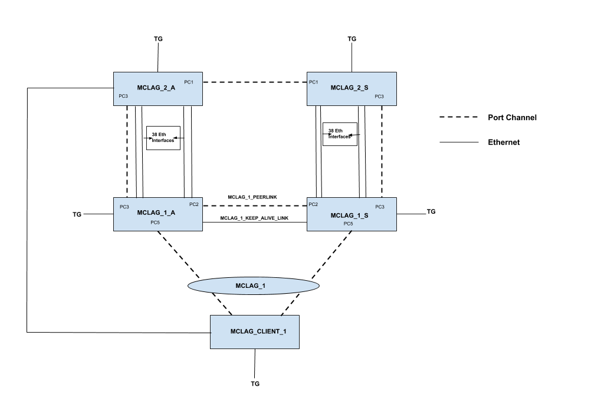

# RPVST+MCLAG SCALING TEST PLAN

# RPVST_MCLAG_SCALE_TESTS

# SONiC 3.1 Project and Buzznik_plus Release

[TOC]

# Test Plan Revision History

| Rev  |    Date    |        Author        | Change Description |
| :--: | :--------: | :------------------: | :----------------: |
| 0.1  | 10/10/2019 | Rakesh Kumar Vooturi |  Initial version   |

# List of Reviewers

| Function |         Name         |
| :------: | :------------------: |
|   Dev    |      Ramakanth       |
|    QA    | Anil Kumar Kolkaleti |
|    QA    |   Giri Babu Sajja    |

# List of Approvers

| Function |         Name         | Date Approved |
| :------: | :------------------: | :-----------: |
|   Dev    |      Ramakanth       |               |
|    QA    | Anil Kumar Kolkaleti |               |
|    QA    |   Giri Babu Sajja    |               |

# 1 Topologies

## 1.1 Topology

####  

# 2 Functional

### 2.1.1 Verify STP convergence is happening fine with 10K vlan*ports in the RPVST+MCLAG scale topology.

| **Test ID**    | **Tescase1**                                          |
| -------------- | :----------------------------------------------------------- |
| **Test Name**  | **Veify STP convergence is happening fine with 10k vlanports  in the RPVST+MCLAG scale topology.** |
| **Test Setup** | **Topology**                                                 |
| **Type**       | **Functional**                                               |
| **Steps**      | **Procedure: 1) Configure port channels(Po1, Po2, Po3, Po5), vlans (255 vlans). 2)  Configure MCLAG peers MCLAG_1_A and MCLAG_1_S. MCLAG_1_A as active and MCLAG_1_S as standby. 3) Enable RPVST on all the devices. 4)  Configure bridge priority such that MCLAG_1_A and MCLAG_1_S are roots in all the 253 vlans and designated roots in the remaining 2 vlans. 5)Configure MCLAG_2_A and MCLAG_CLIENT as root in the remaining 2 vlans. 6) Configure North to south traffic between MCLAG_2_S(mac : 0x01) and MCLAG_CLIENT(mac : 0x02) and East to west traffic between MCLAG_1_A(mac : 0x03) and MCLAG_1_S(mac : 0x04)) 7)Check STP convergence in any 3 vlans. Expected Result: 1)Verify that port channels(Po1, Po2, Po3, Po5), vlans (255 vlans) are created successfully. 2) Verify that MCLAG peers are configured properly and peers are formed successfully. 3) Verify that RPVST is enabled on all the devices. 4)  Verify that MCLAG_1_A and MCLAG_1_S are roots in 253 vlan instances. 5)Verify that MCLAG_2_A and MCLAG_CLIENT are root in the remaining 2 vlans 6)Verify that traffic is properly configured on the TGEN. 7) Verify that STP is converged properly in any 3 vlans** |

### 2.1.2 Verify North to South and East to West traffic is flowing fine in the RPVST+MCLAG scale topology

| **Test ID**    | **Tesctase2**                                          |
| -------------- | :----------------------------------------------------------- |
| **Test Name**  | **Verify North to South and East to West traffic is flowing fine in the RPVST+MCLAG scale topology** |
| **Test Setup** | **Topology**                                                 |
| **Type**       | **Functional**                                               |
| **Steps**      | **Procedure: 1)Configure port channels(Po1, Po2, Po3, Po5), vlans (255 vlans). 2)  Configure MCLAG peers MCLAG_1_A and MCLAG_1_S. MCLAG_1_A as active and MCLAG_1_S as standby. 3)Enable RPVST on all the devices. 4)Configure bridge priority such that MCLAG_1_A and MCLAG_1_S are roots in all the 253 vlans and designated roots in the remaining 2 vlans 5) Configure MCLAG_2_A and MCLAG_CLIENT as root in the remaining 2 vlans. 6)Configure North to south traffic between MCLAG_2_S(mac : 0x01) and MCLAG_CLIENT(mac : 0x02) and East to west traffic between MCLAG_1_A(mac : 0x03) and MCLAG_1_S(mac : 0x04). 7) Check STP convergence in any 3 vlans. 8)Send North to South and East to West traffic Expected Result: 1) Verify that port channels(Po1, Po2, Po3, Po5), vlans (255 vlans) are created successfully. 2)Verify that MCLAG peers are configured properly and peers are formed successfully. 3) Verify that RPVST is enabled on all the devices. 4)Verify that MCLAG_1_A and MCLAG_1_S are roots in 253 vlan instances. 5) Verify that MCLAG_2_A and MCLAG_CLIENT are root in the remaining 2 vlans. 6)  Verify that traffic is properly configured on the TGEN. 7)Verify that STP is converged properly in any 3 vlans. 8) Verify that North to South and East to West traffic is flowing without any loss.** |

### 2.1.3  Verify STP convergence when MCLAG interface is shutdown and no shutdown in the RPVST+MCLAG scale topology.

| **Test ID**    | **Tesctase3**                                          |
| -------------- | :----------------------------------------------------------- |
| **Test Name**  | **Verify STP convergence when MCLAG interface is shutdown and no shutdown in the RPVST+MCLAG scale topology.** |
| **Test Setup** | **Topology**                                                 |
| **Type**       | **Functional**                                               |
| **Steps**      | **Procedure: 1)Configure port channels(Po1, Po2, Po3, Po5), vlans (255 vlans). 2)  Configure MCLAG peers MCLAG_1_A and MCLAG_1_S. MCLAG_1_A as active and MCLAG_1_S as standby. 3)Enable RPVST on all the devices. 4)Configure bridge priority such that MCLAG_1_A and MCLAG_1_S are roots in all the 253 vlans and designated roots in the remaining 2 vlans 5) Configure MCLAG_2_A and MCLAG_CLIENT as root in the remaining 2 vlans. 6)Configure North to south traffic between MCLAG_2_S(mac : 0x01) and MCLAG_CLIENT(mac : 0x02) and East to west traffic between MCLAG_1_A(mac : 0x03) and MCLAG_1_S(mac : 0x04). 7) Check STP convergence in any 3 vlans. 8)Send North to South and East to West traffic Expected Result: 1) Verify that port channels(Po1, Po2, Po3, Po5), vlans (255 vlans) are created successfully. 2)Verify that MCLAG peers are configured properly and peers are formed successfully. 3) Verify that RPVST is enabled on all the devices. 4)Verify that MCLAG_1_A and MCLAG_1_S are roots in 253 vlan instances. 5) Verify that MCLAG_2_A and MCLAG_CLIENT are root in the remaining 2 vlans. 6)  Verify that traffic is properly configured on the TGEN. 7)Verify that STP is converged properly in any 3 vlans. 8) Verify that North to South and East to West traffic is flowing without any loss.** |

### 2.1.4 Verify STP convergence when STP protocol is disabled and enabled in the RPVST+MCLAG scale topology.
| **Test ID**    | **Tesctase4**                                          |
| -------------- | :----------------------------------------------------------- |
| **Test Name**  | **Verify STP convergence when STP protocol is disabled and enabled in the RPVST+MCLAG scale topology.** |
| **Test Setup** | **Topology**                                                 |
| **Type**       | **Functional**                                               |
| **Steps**      | **Procedure: 1)Configure port channels(Po1, Po2, Po3, Po5), vlans (255 vlans). 2)  Configure MCLAG peers MCLAG_1_A and MCLAG_1_S. MCLAG_1_A as active and MCLAG_1_S as standby. 3)Enable RPVST on all the devices. 4)Configure bridge priority such that MCLAG_1_A and MCLAG_1_S are roots in all the 253 vlans and designated roots in the remaining 2 vlans 5) Configure MCLAG_2_A and MCLAG_CLIENT as root in the remaining 2 vlans. 6)Configure North to south traffic between MCLAG_2_S(mac : 0x01) and MCLAG_CLIENT(mac : 0x02) and East to west traffic between MCLAG_1_A(mac : 0x03) and MCLAG_1_S(mac : 0x04). 7) Check STP convergence in any 3 vlans. 8) Disable and enable RPVST on all the duts Expected Result: 1) Verify that port channels(Po1, Po2, Po3, Po5), vlans (255 vlans) are created successfully. 2)Verify that MCLAG peers are configured properly and peers are formed successfully. 3) Verify that RPVST is enabled on all the devices. 4)Verify that MCLAG_1_A and MCLAG_1_S are roots in 253 vlan instances. 5) Verify that MCLAG_2_A and MCLAG_CLIENT are root in the remaining 2 vlans. 6)  Verify that traffic is properly configured on the TGEN. 7)Verify that STP is converged properly in any 3 vlans. 8) Verify that STP converges properly even after disable and enable of the protocol.** |

### 2.1.5 Verify STP convergence in MCLAG Active device failover case in the RPVST+MCLAG scale topology. 
| **Test ID**    | **Tesctase5**                                          |
| -------------- | :----------------------------------------------------------- |
| **Test Name**  | **Verify STP convergence in MCLAG Active device failover case in the RPVST+MCLAG scale topology.** |
| **Test Setup** | **Topology**                                                 |
| **Type**       | **Functional**                                               |
| **Steps**      | **Procedure: 1)Configure port channels(Po1, Po2, Po3, Po5), vlans (255 vlans). 2)  Configure MCLAG peers MCLAG_1_A and MCLAG_1_S. MCLAG_1_A as active and MCLAG_1_S as standby. 3)Enable RPVST on all the devices. 4)Configure bridge priority such that MCLAG_1_A and MCLAG_1_S are roots in all the 253 vlans and designated roots in the remaining 2 vlans 5) Configure MCLAG_2_A and MCLAG_CLIENT as root in the remaining 2 vlans. 6)Configure North to south traffic between MCLAG_2_S(mac : 0x01) and MCLAG_CLIENT(mac : 0x02) and East to west traffic between MCLAG_1_A(mac : 0x03) and MCLAG_1_S(mac : 0x04). 7) Check STP convergence in any 3 vlans. 8)  Reload the MCLAG_1_A device 9)Check STP convergence in any 3 vlans. Expected Result: 1) Verify that port channels(Po1, Po2, Po3, Po5), vlans (255 vlans) are created successfully. 2)Verify that MCLAG peers are configured properly and peers are formed successfully. 3) Verify that RPVST is enabled on all the devices. 4)Verify that MCLAG_1_A and MCLAG_1_S are roots in 253 vlan instances. 5) Verify that MCLAG_2_A and MCLAG_CLIENT are root in the remaining 2 vlans. 6)  Verify that traffic is properly configured on the TGEN. 7)Verify that STP is converged properly in any 3 vlans. 8) Verify MCLAG_1_A comes up properly after reboot. 9)Verify that STP is converged properly in any 3 vlans.** |

### 2.1.6 Verify STP convergence in MCLAG Standby device failover case in the RPVST+MCLAG scale topology.
| **Test ID**    | **Tesctase6**                                          |
| -------------- | :----------------------------------------------------------- |
| **Test Name**  | **Verify STP convergence in MCLAG Standby device failover case in the RPVST+MCLAG scale topology** |
| **Test Setup** | **Topology**                                                 |
| **Type**       | **Functional**                                               |
| **Steps**      | **Procedure: 1)Configure port channels(Po1, Po2, Po3, Po5), vlans (255 vlans). 2)  Configure MCLAG peers MCLAG_1_A and MCLAG_1_S. MCLAG_1_A as active and MCLAG_1_S as standby. 3)Enable RPVST on all the devices. 4)Configure bridge priority such that MCLAG_1_A and MCLAG_1_S are roots in all the 253 vlans and designated roots in the remaining 2 vlans 5) Configure MCLAG_2_A and MCLAG_CLIENT as root in the remaining 2 vlans. 6)Configure North to south traffic between MCLAG_2_S(mac : 0x01) and MCLAG_CLIENT(mac : 0x02) and East to west traffic between MCLAG_1_A(mac : 0x03) and MCLAG_1_S(mac : 0x04). 7) Check STP convergence in any 3 vlans. 8)  Reload the MCLAG_1_S device 9)Check STP convergence in any 3 vlans. Expected Result: 1) Verify that port channels(Po1, Po2, Po3, Po5), vlans (255 vlans) are created successfully. 2)Verify that MCLAG peers are configured properly and peers are formed successfully. 3) Verify that RPVST is enabled on all the devices. 4)Verify that MCLAG_1_A and MCLAG_1_S are roots in 253 vlan instances. 5) Verify that MCLAG_2_A and MCLAG_CLIENT are root in the remaining 2 vlans. 6)  Verify that traffic is properly configured on the TGEN. 7)Verify that STP is converged properly in any 3 vlans. 8) Verify MCLAG_1_s comes up properly after reboot. 9)Verify that STP is converged properly in any 3 vlans.** |

### 2.1.7 Verify STP convergence in MCLAG Active+Standby device failover case in the RPVST+MCLAG scale topology.
| **Test ID**    | **Tesctase7**                                          |
| -------------- | :----------------------------------------------------------- |
| **Test Name**  | **Verify STP convergence in MCLAG Active+Standby device failover case in the RPVST+MCLAG scale topology.** |
| **Test Setup** | **Topology**                                                 |
| **Type**       | **Functional**                                               |
| **Steps**      | **Procedure: 1)Configure port channels(Po1, Po2, Po3, Po5), vlans (255 vlans). 2)  Configure MCLAG peers MCLAG_1_A and MCLAG_1_S. MCLAG_1_A as active and MCLAG_1_S as standby. 3)Enable RPVST on all the devices. 4)Configure bridge priority such that MCLAG_1_A and MCLAG_1_S are roots in all the 253 vlans and designated roots in the remaining 2 vlans 5) Configure MCLAG_2_A and MCLAG_CLIENT as root in the remaining 2 vlans. 6)Configure North to south traffic between MCLAG_2_S(mac : 0x01) and MCLAG_CLIENT(mac : 0x02) and East to west traffic between MCLAG_1_A(mac : 0x03) and MCLAG_1_S(mac : 0x04). 7) Check STP convergence in any 3 vlans. 8)  Reload the  MCLAG_1_A and MCLAG_1_S device simultaneously 9)Check STP convergence in any 3 vlans. Expected Result: 1) Verify that port channels(Po1, Po2, Po3, Po5), vlans (255 vlans) are created successfully. 2)Verify that MCLAG peers are configured properly and peers are formed successfully. 3) Verify that RPVST is enabled on all the devices. 4)Verify that MCLAG_1_A and MCLAG_1_S are roots in 253 vlan instances. 5) Verify that MCLAG_2_A and MCLAG_CLIENT are root in the remaining 2 vlans. 6)  Verify that traffic is properly configured on the TGEN. 7)Verify that STP is converged properly in any 3 vlans. 8) Verify MCLAG_1_A and MCLAG_1_s comes up properly after reboot. 9)Verify that STP is converged properly in any 3 vlans.** |

### 2.1.8 Verify STP convergence when MCLAG peers are config reloaded in the RPVST+MCLAG scale topology.
| **Test ID**    | **Tesctase8**                                          |
| -------------- | :----------------------------------------------------------- |
| **Test Name**  | **Verify STP convergence when MCLAG peers are config reloaded in the RPVST+MCLAG scale topology.** |
| **Test Setup** | **Topology**                                                 |
| **Type**       | **Functional**                                               |
| **Steps**      | **Procedure: 1)Configure port channels(Po1, Po2, Po3, Po5), vlans (255 vlans). 2)  Configure MCLAG peers MCLAG_1_A and MCLAG_1_S. MCLAG_1_A as active and MCLAG_1_S as standby. 3)Enable RPVST on all the devices. 4)Configure bridge priority such that MCLAG_1_A and MCLAG_1_S are roots in all the 253 vlans and designated roots in the remaining 2 vlans 5) Configure MCLAG_2_A and MCLAG_CLIENT as root in the remaining 2 vlans. 6)Configure North to south traffic between MCLAG_2_S(mac : 0x01) and MCLAG_CLIENT(mac : 0x02) and East to west traffic between MCLAG_1_A(mac : 0x03) and MCLAG_1_S(mac : 0x04). 7) Check STP convergence in any 3 vlans. 8)  Reload the  MCLAG_1_A and MCLAG_1_S device simultaneously 9)Check STP convergence in any 3 vlans. Expected Result: 1) Verify that port channels(Po1, Po2, Po3, Po5), vlans (255 vlans) are created successfully. 2)Verify that MCLAG peers are configured properly and peers are formed successfully. 3) Verify that RPVST is enabled on all the devices. 4)Verify that MCLAG_1_A and MCLAG_1_S are roots in 253 vlan instances. 5) Verify that MCLAG_2_A and MCLAG_CLIENT are root in the remaining 2 vlans. 6)  Verify that traffic is properly configured on the TGEN. 7)Verify that STP is converged properly in any 3 vlans. 8) Verify MCLAG_1_A and MCLAG_1_s comes up properly after reboot. 9)Verify that STP is converged properly in any 3 vlans.** |

### 2.1.9 Verify STP convergence when all interfaces are shut and no shut on a random dut in the RPVST+MCLAG scale topology.
| **Test ID**    | **Tesctase9**                                          |
| -------------- | :----------------------------------------------------------- |
| **Test Name**  | **Verify STP convergence when all interfaces are shut and no shut on a random dut in the RPVST+MCLAG scale topology.** |
| **Test Setup** | **Topology**                                                 |
| **Type**       | **Functional**                                               |
| **Steps**      | **Procedure: 1)Configure port channels(Po1, Po2, Po3, Po5), vlans (255 vlans). 2)  Configure MCLAG peers MCLAG_1_A and MCLAG_1_S. MCLAG_1_A as active and MCLAG_1_S as standby. 3)Enable RPVST on all the devices. 4)Configure bridge priority such that MCLAG_1_A and MCLAG_1_S are roots in all the 253 vlans and designated roots in the remaining 2 vlans 5) Configure MCLAG_2_A and MCLAG_CLIENT as root in the remaining 2 vlans. 6)Configure North to south traffic between MCLAG_2_S(mac : 0x01) and MCLAG_CLIENT(mac : 0x02) and East to west traffic between MCLAG_1_A(mac : 0x03) and MCLAG_1_S(mac : 0x04). 7) Check STP convergence in any 3 vlans. 8)  Shutdown and no shutdown all the interfaces on a random dut in the topology 9)Check STP convergence in any 3 vlans. Expected Result: 1) Verify that port channels(Po1, Po2, Po3, Po5), vlans (255 vlans) are created successfully. 2)Verify that MCLAG peers are configured properly and peers are formed successfully. 3) Verify that RPVST is enabled on all the devices. 4)Verify that MCLAG_1_A and MCLAG_1_S are roots in 253 vlan instances. 5) Verify that MCLAG_2_A and MCLAG_CLIENT are root in the remaining 2 vlans. 6)  Verify that traffic is properly configured on the TGEN. 7)Verify that STP is converged properly in any 3 vlans. 8)  Verify that all interfaces are admin down and then admin up state. 9)Verify that STP is converged properly in any 3 vlans.** |

### 2.1.10 Verify STP convergence when vlan participation is removed and added back for all interfaces on a random dut in the RPVST+MCLAG scale topology.
| **Test ID**    | **Tesctase9**                                          |
| -------------- | :----------------------------------------------------------- |
| **Test Name**  | **Verify STP convergence when vlan participation is removed and added back for all interfaces on a random dut in the RPVST+MCLAG scale topology.** |
| **Test Setup** | **Topology**                                                 |
| **Type**       | **Functional**                                               |
| **Steps**      | **Procedure: 1)Configure port channels(Po1, Po2, Po3, Po5), vlans (255 vlans). 2)  Configure MCLAG peers MCLAG_1_A and MCLAG_1_S. MCLAG_1_A as active and MCLAG_1_S as standby. 3)Enable RPVST on all the devices. 4)Configure bridge priority such that MCLAG_1_A and MCLAG_1_S are roots in all the 253 vlans and designated roots in the remaining 2 vlans 5) Configure MCLAG_2_A and MCLAG_CLIENT as root in the remaining 2 vlans. 6)Configure North to south traffic between MCLAG_2_S(mac : 0x01) and MCLAG_CLIENT(mac : 0x02) and East to west traffic between MCLAG_1_A(mac : 0x03) and MCLAG_1_S(mac : 0x04). 7) Check STP convergence in any 3 vlans. 8)   Remove and add vlan participation of all interfaces on a random dut for multiple times. 9)Check STP convergence in any 3 vlans. Expected Result: 1) Verify that port channels(Po1, Po2, Po3, Po5), vlans (255 vlans) are created successfully. 2)Verify that MCLAG peers are configured properly and peers are formed successfully. 3) Verify that RPVST is enabled on all the devices. 4)Verify that MCLAG_1_A and MCLAG_1_S are roots in 253 vlan instances. 5) Verify that MCLAG_2_A and MCLAG_CLIENT are root in the remaining 2 vlans. 6)  Verify that traffic is properly configured on the TGEN. 7)Verify that STP is converged properly in any 3 vlans. 8)Verify that vlan participation is fine after multiple removal and addition of participation on the random dut. 9)Verify that STP is converged properly in any 3 vlans.** |

