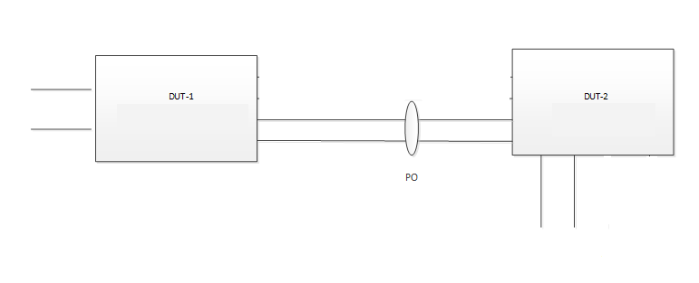

#  SQA Test Plan
#  SONIC Switchport Trunk allowed vlan new options
#  SONiC 3.2.0 Release
[TOC]

## Test Plan Revision History

| Rev  | Date       | Author          | Change Description |
| ---- | ---------- | --------------- | ------------------ |
| 0.1  | 27/01/2021 | Kesava Swamy K  | Initial Version    |
| 0.2  |            |                 |                    |

## List of Reviewers

| Function | Name |
| :------: | :--: |
|    QA      |   Chandra Bhushan Singh   |
|    DEV     |   Haemanthi Sree K R |
|    DEV     |   Tejaswi Goel   |

## List of Approvers

| Function | Name | Date Approved |
| :------: | :--: | :-----------: |
|          |      |               |

## Definition/Abbreviation

| **Term** | **Meaning**                |
| -------- | -------------------------- |
| VLAN  | Virtual Local Area Network       |

## Feature Overview

  Provide ability to configure allowed VLANs on trunk port using options "all", "except", "none" or vlan-list.

## 1 Test Focus Areas

  - This Test plan covers the validation of port/portchannel vlan participation and traffic forwarding with the new options provided for "switchport trunk allowed vlan" command.

### 1.1 CLI Testing 

  - Validate the new CLI options "all", "none", "except" options for "switchport trunk allowed vlan" command. 

### 1.2 Functional Testing

  - Verify that "switchport trunk allowed vlan all" adds all the existing vlans to the port and also adds any vlan that is created later and traffic related to that vlans is forwarded successfully.
  - Verify that "switchport trunk allowed vlan except <vid1-vid2>" adds all the existing vlan to the port except the vlans mentioned in the list (vid1-vid2), also should not add these vlans (in the list) to ports if they are a created later.
  - Verify that "switchport trunk allowed vlan none" removes all the trunk vlan configuration on the port and any vlans that are created later should not be added to this port.
  - Verify that a non-existing vlan can be added as access vlan, and takes effect when it is created, check the traffic forwarding.
  - Verify that "switchport access vlan <vid1>" takes effect/precedence over "switchport trucnk allowed vlan all" and "switchport trunk allowed except <vid1>".
  - Verify that "no switchport access vlan", leaves the port in the trunk vlan participation as per earlier config "switchport trunk vlan allowed vlan <vid1-vid2>".
  - Verify vlan participation and traffic forwarding, as per execution order of "switchport trunk allowed vlan all" followed by "switchport trunk allowed vlan except <vid1>,<vid2-vid3>".
  - Verify vlan participation and traffic forwarding, as per execution order of "switchport trunk allowed vlan add <vid1>" followed by "switchport trunk allowed vlan except <vid1>".
  - Verify vlan participation and traffic forwarding, as per execution order of "switchport trunk allowed vlan all>" followed by "switchport trunk allowed vlan <vid1-vid2>".
  - Verify vlan participation and traffic forwarding, as per execution order of "switchport trunk allowed vlan except <vid1-vidn>" followed by "switchport trunk allowed vlan add <vid1>".
  - Verify vlan participation and traffic forwarding, as per execution order of "switchport trunk allowed vlan all" followed by "switchport trunk allowed vlan remove <vid1-vid2>".
  - Verify that "switchport trunk allowed vlan all", "switchport trunk allowed vlan none" and "switchport trunk allowed vlan except <vid1-vid2>" retained across save & reboot.
  - Verify that switchport commands are retained across image upgrade from previous release to this release.
  - Verify "switchport trunk allowed vlan {options}" with different options using REST.
  

## 2 Topologies

 

#### 								Topology 1 

## 3 Test Case and objectives

### 3.1 CLI Test Cases

#### 3.1.1 Validate the new CLI options "all", "none", "except" options for "switchport trunk allowed vlan" command. 

| **Test ID**    | **FtOpSwVlOpCli001**                                               |
| -------------- | :----------------------------------------------------------- |
| **Test Name**  | **Validate the new CLI options "all", "none", "except" options for "switchport trunk allowed vlan" command.**      |
| **Test Setup** | **Topology 1**                                               |
| **Type**       | **CLI**                                               |
| **Steps**      | 1. For the command "switchport trunk allowed vlan" command check the options "all", "none" and "except" are available as per HLD. 2. Also check the help provided is correct or not.|

### 3.2 Functional Test Cases

#### 3.2.1 Verify that "switchport trunk allowed vlan all" adds all the existing vlans to the port and also adds any vlan that is created later and traffic related to that vlans is forwarded successfully.  

| **Test ID**    | **FtOpSwVlOpFn001**                                               |
| -------------- | :----------------------------------------------------------- |
| **Test Name**  | **Verify that "switchport trunk allowed vlan all" adds all the existing vlans to the port and also adds any vlan that is created later and traffic related to that vlans is forwarded successfully.** |
| **Test Setup** | **Topology 1**                                               |
| **Type**       | **Functional**                                               |
| **Steps**      | 1. In both the DUTs create vlans 2-10 and check they are created successfully.  2. In both DUTs configure "switchport trunk allowed vlan all" on the TG connected port and the portchannel connecting the DUTs, check the running-config updated properly for these ports. 3. Check that these ports are now associated to vlans 2-10.  4. Send the learned vlan 3 tagged traffic from TG3 to TG1.  5. Check that traffic is forwarded successfully.  6. Create a new vlan 11.  7. Check that now the ports are associated to this new vlan 11 successfully.  8.Send the learned vlan 11 tagged traffic from TG3 to TG1.  9. Check that traffic is forwarded successfully. |

#### 3.2.2 Verify that "switchport trunk allowed vlan except <vid1-vid2>" adds all the existing vlan to the port except the vlans mentioned in the list (vid1-vid2), also should not add these vlans (in the list) to ports if they are a created later.  

| **Test ID**    | **FtOpSwVlOpFn002**                                               |
| -------------- | :----------------------------------------------------------- |
| **Test Name**  | **Verify that "switchport trunk allowed vlan except <vid1-vid2>" adds all the existing vlan to the port except the vlans mentioned in the list (vid1-vid2), also should not add these vlans (in the list) to ports if they are a created later.** |
| **Test Setup** | **Topology 1**                                               |
| **Type**       | **Functional**                                               |
| **Steps**      | 1. In both the DUTs create vlans 9-20 and check they are created successfully.  2. In both DUTs configure "switchport trunk allowed vlan except 2-11" on the TG connected port and the portchannel connecting the DUTs, check the running-config updated properly for these ports.  3. Check that these ports are now associated to vlans 12-20.  4. Send the learned vlan 11 tagged traffic from TG3 to TG1.  5. Check that traffic is not forwarded as port is not participated in vlan 11.  6. Create a new vlan 2.  7. Check that the ports are not associated to this new vlan 2 as except list is 2-11.  8.Send the learned vlan 2 tagged traffic from TG3 to TG1.  9. Check that traffic is not forwarded. |

#### 3.2.3 Verify that "switchport trunk allowed vlan none" removes all the trunk vlan configuration on the port and any vlans that are created later should not be added to this port.

| **Test ID**    | **FtOpSwVlOpFn003**                                               |
| -------------- | :----------------------------------------------------------- |
| **Test Name**  | **Verify that "switchport trunk allowed vlan none" removes all the trunk vlan configuration on the port and any vlans that are created later should not be added to this port.** |
| **Test Setup** | **Topology 1**                                               |
| **Type**       | **Functional**                                               |
| **Steps**      | 1. In continuation to above test case.  2. Configure "switchport trunk allowed vlan none" on the ports, check the running-config updated properly for these ports.  3. Check that now the ports are not participating any of the vlans.  4. Create a new vlan 3.  5. Check that the ports are not part of this new vlan also. |

#### 3.2.4 Verify that a non-existing vlan can be added as access vlan, and takes effect when it is created, check the traffic forwarding.

| **Test ID**    | **FtOpSwVlOpFn004**                                               |
| -------------- | :----------------------------------------------------------- |
| **Test Name**  | **Verify that a non-existing vlan can be added as access vlan, and takes effect when it is created, check the traffic forwarding.** |
| **Test Setup** | **Topology 1**                                               |
| **Type**       | **Functional**                                               |
| **Steps**      | 1. In both the DUTs configure a non existing vlan (21) as "switchport access vlan 21".  2. Check that vlan is inactive.  3. Create that vlan 21 now on both the DUTs.  4. Check the vlan 21 participation.  5. Send untagged traffic from TG port, check that it is forwarded to other DUT and the corresponding TG port as per vlan 21 participation  .6. Remove the "switchport access vlan 21" configuration. |

#### 3.2.5 Verify that "switchport access vlan <vid1>" takes effect/precedence over "switchport trucnk allowed vlan all" and "switchport trunk allowed except <vid1>".

| **Test ID**    | **FtOpSwVlOpFn005**                                               |
| -------------- | :----------------------------------------------------------- |
| **Test Name**  | **Verify  that "switchport access vlan <vid1>" takes effect/precedence over "switchport trunk allowed vlan all" and "switchport trunk allowed except <vid1>".** |
| **Test Setup** | **Topology 1**                                               |
| **Type**       | **Functional**                                               |
| **Steps**      | 1. Configure "switchport trunk allowed vlan all" on the ports.  2. Check that ports are participating in exiting vlans 9-21.   3. Configure "switchport trunk allowed except 21" on the ports.  4. check the ports are removed from vlan 21.  5. Configure "switchport access vlan 21" on the ports, check the running-config updated properly for these ports.  6. Check that now ports are participating in vlan 21 with untagged.  7. Send untagged traffic from TG port, check that it is forwarded to other DUT and the corresponding TG port as per vlan 21 participation.  8. Remove the configurations done and vlans created. |

#### 3.2.6 Verify that "no switchport access vlan", leaves the port in the trunk vlan participation as per earlier config "switchport trunk vlan allowed vlan <vid1-vid2>".

| **Test ID**    | **FtOpSwVlOpFn006**                                               |
| -------------- | :----------------------------------------------------------- |
| **Test Name**  | **Verify that "no switchport access vlan", leaves the port in the trunk vlan participation as per earlier config "switchport trunk vlan allowed vlan <vidn>, <vid1-vid2>".** |
| **Test Setup** | **Topology 1**                                               |
| **Type**       | **Functional**                                               |
| **Steps**      | 1. In both the DUTs configure "switchport trunk vlan allowed vlan 201, 300-320"  on the ports (TG connected) and on portchannel (between DUTs).  2. Create the vlans 201,300-320.  3. Check the ports are participated in vlans 201, 300-320 in trunk mode.  4. Now configure "switchport access vlan 300" on the ports.  5. Check that now ports have untagged vlan participation for vlan 300.  6.configure "no switchport access vlan" on the ports.  6. Check that ports are having tagged vlan participation for vlan 300-320 as previous.  7. Send vlan 300 tagged traffic from TG port connected to DUT2, check that traffic is forwarded to TG port connected to DUT1 successfully.  8. Remove all the configurations done. |

#### 3.2.7 Verify vlan participation and traffic forwarding, as per execution order of "switchport trunk allowed vlan all" followed by "switchport trunk allowed vlan except <vid1>,<vid2-vid3>".

| **Test ID**    | **FtOpSwVlOpFn007**                                               |
| -------------- | :----------------------------------------------------------- |
| **Test Name**  | **Verify vlan participation and traffic forwarding, as per execution order of "switchport trunk allowed vlan all" followed by "switchport trunk allowed vlan except <vid1>,<vid2-vid3>".** |
| **Test Setup** | **Topology 1**                                               |
| **Type**       | **Functional**                                               |
| **Steps**      | 1. In both the DUTs configure "switchport trunk vlan allowed vlan all"  on the ports (TG connected) and on portchannel (between DUTs).  2. Create the vlans 1200-1220.  3. Check the ports are participated in vlans 1200-1220 in trunk mode.  4. Now configure "switchport trunk allowed vlan except 1200, 1218-1220" on the ports, check the running-config updated properly for these ports.  5. Check that now ports have no vlan participation for vlan 1200 and 1218-1220.  6.configure "switchport trunk allowed vlan all" on the ports.  6. Check that ports are having tagged vlan participation for vlan 1200-1220 as previous.  7. Send vlan 1218 tagged traffic from TG port connected to DUT1, check that traffic is forwarded to TG port connected to DUT2 successfully.  8. Remove all the configurations done. |

#### 3.2.8 Verify vlan participation and traffic forwarding, as per execution order of "switchport trunk allowed vlan add <vid1>" followed by "switchport trunk allowed vlan except <vid1>" and vice versa.

| **Test ID**    | **FtOpSwVlOpFn008**                                               |
| -------------- | :----------------------------------------------------------- |
| **Test Name**  | **Verify vlan participation and traffic forwarding, as per execution order of "switchport trunk allowed vlan add <vid1>" followed by "switchport trunk allowed vlan except <vid1>".**                    |
| **Test Setup** | **Topology 1**                                               |
| **Type**       | **Functional**                                               |
| **Steps**      | 1. In both the DUTs create vlan 200.  2. On the ports (TG connected) and on portchannel (between DUTs) configure "switchport trunk allowed vlan add <vid1>" .  3. Check the ports are participated in vlan 200 in tagged mode.  4. Now configure "switchport trunk allowed vlan except 200" on the ports.  5. Check that now ports have no vlan participation for vlan 200.  6.configure "switchport trunk allowed vlan add 200" on the ports.  6. Check that ports are having tagged vlan participation for vlan 200.  7. Send vlan 200 tagged traffic from TG port connected to DUT1, check that traffic is forwarded to TG port connected to DUT2 successfully.  8. Remove all the configurations done. |

#### 3.2.9 Verify vlan participation and traffic forwarding, as per execution order of "switchport trunk allowed vlan all>" followed by "switchport trunk allowed vlan <vid1-vid2>".

| **Test ID**    | **FtOpSwVlOpFn009**                                               |
| -------------- | :----------------------------------------------------------- |
| **Test Name**  | **Verify vlan participation and traffic forwarding, as per execution order of "switchport trunk allowed vlan all>" followed by "switchport trunk allowed vlan <vid1-vid2>".** |
| **Test Setup** | **Topology 1**                                               |
| **Type**       | **Functional**                                               |
| **Steps**      |1. In both the DUTs create vlans 40-64 on the ports (TG connected) and on portchannel (between DUTs).  2. Configure "switchport trunk allowed vlan all" .  3. Check the ports are participated in all vlans in tagged mode.  4. Now configure "switchport trunk allowed vlan add 42-44" on the ports, check the running-config updated properly for these ports.  5. Check that now ports have now vlan participation for only vlan 42-44.  6.Configure "switchport trunk allowed vlan all" on the ports again.  6. Check that ports are having tagged vlan participation for all vlans.  7.Configure "switchport trunk allowed vlan remove 42-44". Check that now ports are part of all vlans except 42-44.   8. Send vlan 42 tagged traffic from TG port connected to DUT1, check that traffic is dropped.  8. Remove all the configurations done. |

#### 3.2.10 Verify vlan participation and traffic forwarding, as per execution order of "switchport trunk allowed vlan except <vid1-vidn>" followed by "switchport trunk allowed vlan add <vid1>".

| **Test ID**    | **FtOpSwVlOpFn010**                                               |
| -------------- | ------------------------------------------------------------ |
| **Test Name**  | **Verify vlan participation and traffic forwarding, as per execution order of "switchport trunk allowed vlan except <vid1-vidn>" followed by "switchport trunk allowed vlan add <vid1>,<vid2-vid4>".** |
| **Test Setup** | **Topology 1**                                               |
| **Type**       | **Functional**                                               |
| **Steps**      |1. In both the DUTs configure "switchport trunk allowed vlan except 2-20 on the ports (TG connected) and on portchannel (between DUTs)" .  2. Create Vlans 2-30 in both DUTs. Check the ports are participated in vlans (21-30) in tagged mode.  3. Now configure "switchport trunk allowed vlan add 15,18-20" on the ports.  4. Check that now ports have now vlan participation for 15,18-30.  5. Send vlan 20 tagged traffic, check that traffic is forwarded.  6.Configure "switchport trunk allowed vlan except 2-20" on the ports again.  6. Check that ports are having tagged vlan participation for all vlans except 2-20.  7. Send vlan 20 tagged traffic, check that traffic is dropped.  8. Remove all the configurations done. |

#### 3.2.11 Verify vlan participation and traffic forwarding, as per execution order of "switchport trunk allowed vlan all" followed by "switchport trunk allowed vlan remove <vid1-vid2>".

| **Test ID**    | **FtOpSwVlOpFn011**                                              |
| -------------- | ------------------------------------------------------------ |
| **Test Name**  | **Verify vlan participation when "switchport trunk allowed vlan all" is configured first and then "switchport trunk allowed vlan remove <vid1-vid2>".** |
| **Test Setup** | **Topology 1**                                               |
| **Type**       | **Functional**                                               |
| **Steps**      | 1. In both the DUTs configure "switchport trunk allowed vlan all" on the ports (TG connected) and on portchannel (between DUTs)" .  2. Create Vlans 2-30 in both DUTs. Check the ports are participated in vlans (2-30) in tagged mode.  3. Now configure "switchport trunk allowed vlan remove 21-30" on the ports.  4. Check that now ports have now vlan participation for 2-20.  5. Send vlan 21 tagged traffic, check that traffic is dropped.  6.Configure "switchport trunk allowed vlan add 21" on the ports again, check the running-config updated properly for these ports.  6. Check that ports are having tagged vlan participation for all vlans except 22-30.  7. Send vlan 20 tagged traffic, check that traffic is forwarded.  8. Remove all the configurations done. |

### 3.3 Reboot/Reload/Upgrade Test Cases

#### 3.3.1 Verify that "switchport trunk allowed vlan all", "switchport trunk allowed vlan none" and "switchport trunk allowed vlan except <vid1-vid2>" retained across save & reboot.

| **Test ID**    | **FtOpSwVlOpFn012**                                               |
| -------------- | ------------------------------------------------------------ |
| **Test Name**  | **Verify that "switchport trunk allowed vlan all", "switchport trunk allowed vlan none" and "switchport trunk allowed vlan except <vid1-vid2>" retained across save & reboot.**    |
| **Test Setup** | **Topology 1**                                               |
| **Type**       | **Functional**                                               |
| **Steps**      | 1. Configure "switchport trunk allowed vlan {options}" with different options on different ports/portchannel.  2. Check the vlans participations as per the configuration.  3. Do save the configuration and reboot.  4. After DUT comes UP, check that all configuration on different ports related to "switchport trunk allowed vlan {options}"  is retained or not. |

#### 3.3.2 Verify that switchport commands are retained across image upgrade from previous release to this release.

| **Test ID**    | **FtOpSwVlOpFn013**                                               |
| -------------- | ------------------------------------------------------------ |
| **Test Name**  | **Verify that switchport commands are retained across image upgrade from previous release to this release.**   |
| **Test Setup** | **Topology 1**                                               |
| **Type**       | **Functional**                                               |
| **Steps**      | 1. DUT with previous image, configure different switchport vlan commands on different ports.  2. Save the config and do upgrade to current release image.  3. After DUT comes UP check that all switchport vlan commands under ports are retained successfully. |

### 3.4 Management

#### 3.4.1 REST

##### 3.4.1.1 Verify "switchport trunk allowed vlan {options}" with different options using REST.

| **Test ID**    | **FtOpSwVlOpFn014**                                              |
| -------------- | ------------------------------------------------------------ |
| **Test Name**  | **Verify "switchport trunk allowed vlan {options}" with different options using REST.** |
| **Test Setup** | **Topology 1**                                               |
| **Type**       | **Functional**                                               |
| **Steps**      | This test case will be covered implicitly in REST run.  1. Through REST API, configure switchport trunk allowed vlan "all", "except", "none" or vlan-list and check configuration is successful or not.|

## Reference Links

https://github.com/project-arlo/SONiC/blob/7e9880f4b8fc2ac1e571b4962d98b18b32d7ca0a/doc/vlan/SONiC_VLAN_trunk_all_except_none_HLD.md

