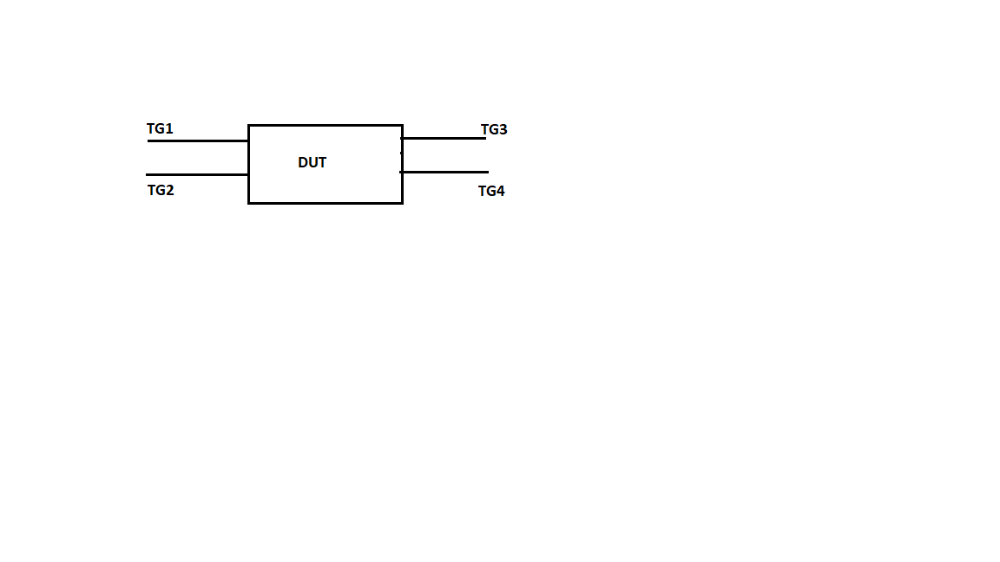
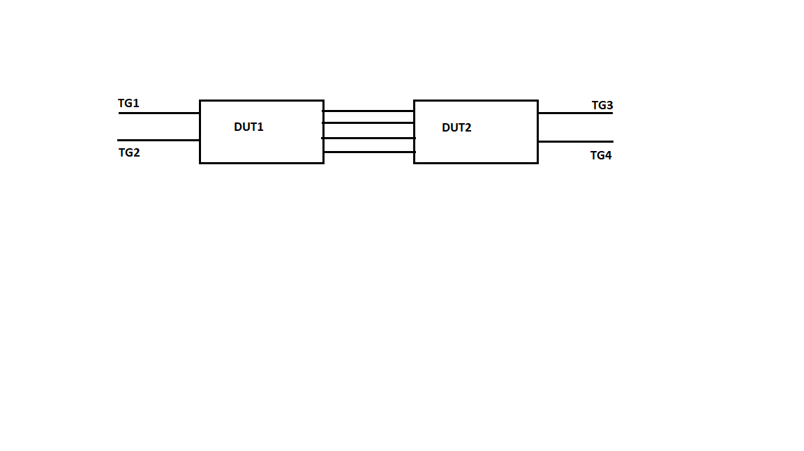
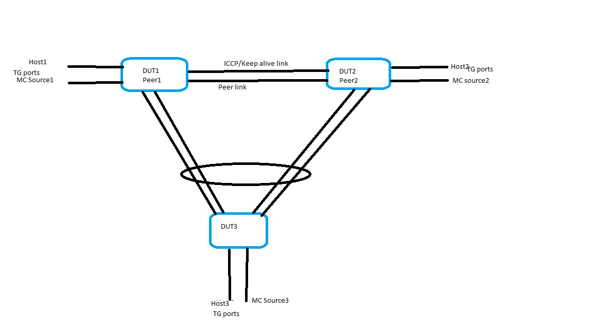

# SQA Test Plan

# IGMP Snooping

# SONiC 3.0 Project and Buzznik Release

[TOC]

# Test Plan Revision History

| Rev  |    Date    |     Author          | Change Description |
| :--: | :--------: | :-----------------: | ------------------ |
| 0.1  | 09/10/2019 | Chaitanya Arava     | Initial version    |
| 0.2  | 23/10/2019 | Keava Swamy Karelda | Addressed the review comments from DEV team|

# List of Reviewers

| Function |        Name        |
| :------: | :----------------: |
|   Dev    | Ashok Krishnegowda |
|   Dev    |    Benzeer Bava    |
|   Dev    |  Ramakant Jangid   |
|    QA    |  Kalyan Vadlamani  |
|    QA    |  Giri Babu Sajja   |

# List of Approvers

| Function |        Name        | Date Approved |
| :------: | :----------------: | :-----------: |
|   Dev    | Ashok Krishnegowda |               |
|   Dev    |    Benzeer Bava    |               |
|   Dev    |  Ramakant Jangid   |               |
|    QA    |  Kalyan Vadlamani  |               |
|    QA    |  Giri Babu Sajja   |               |

# Definition/Abbreviation

| **Term** | **Meaning**                          |
| -------- | ------------------------------------ |
| IGMP     | Internet Group Management Protocol   |
| PIM      | Protocol Independent Multicast       |
| L2MC     | Layer-2 Multicast                    |
| Mrouter  | Multicast router                     |
| MCLAG    | Multi-Chassis Link Aggregation Group |

# Feature Overview

The forwarding of multicast control packets and data through a Layer 2 device configured with VLANs is most easily achieved by the Layer 2 forwarding of received multicast packets on all the member ports of the VLAN interfaces. However, this simple approach is not bandwidth efficient, because only a subset of member ports may be connected to devices interested in receiving those multicast packets. In a worst-case scenario, the data would get forwarded to all port members of a VLAN with a large number of member ports, even if only a single VLAN member is interested in receiving the data. Such scenarios can lead to loss of throughput for a device that gets hit by a high rate of multicast data traffic.
Internet Group Management Protocol (IGMP) snooping is a mechanism by which a Layer 2 device can effectively address this issue of inefficient multicast forwarding to VLAN port members. Snooping involves "learning" forwarding states for multicast data traffic on VLAN port members from the IGMP control (join/leave) packets received on them.
When snooping is enabled on a VLAN, switch examines IGMP packets between hosts connected to network switches and multicast routers. Switch builds member list based on what it learns from the report and mrouter port based on IGMP queries or PIM hello packet from multicast router, the switch then forwards multicast traffic to those interfaces in the VLAN where interested receivers are present instead of flooding the traffic to all member ports of the VLAN. In an MCLAG Enabled node, IGMP Source can be at MCLAG member port or Orphan Port. MCLAG peers communicates and synchronizes states using Inter-Chassis Communication Protocol. IGMP Query, report and leave received on MCLAG port or orphan port are synced among MCLAG peers using ICCP.

# Test Approach

######  What will be part of module config?
IGMP Snooping and IGMP Snooping with MLAG will be different modules.
IGMP Snooping:
1. Configuring of port channel between duts so that both physical and portchannel are covered.
2. Configuring IGMP snooping,querier and different versions of IGMP on DUT.
3. Configuring TG streams for different IGMP versions packets(Report,Query,Leave)

IGMP Snooping with MLAG:
1. Configuring the L2 MCLAG(MLAG peers) and partner.
2. Configuring IGMP snooping,querier and different versions of IGMP on DUT.
3. Configuring TG streams for different IGMP versions packets(Report,Query,Leave)

###### What tests will be covered / clubbed together?
IGMP Snooping:
1. IGMP v1/v2/v3 Query/Report/Leave by clubbing scenarios together using differnet vlans.
2. Trigger scenarios: shut/no shut, disabling/enabling IGMP snooping, remove/add back from interface from a vlan.
3. Multicast data is forwarded to the corresponding MC interfaces registered for the group.
4. IGMP snooping query/response intervals.

IGMP Snooping with MLAG:
1. MLAG peers are in sync when Query/Report/Leave are received on MCLAG/Orphan port.
2. Trigger scenarios: shut/no shut of MLAG/Orphan/Peerlink ports
3. Multicast data is forwarded to the corresponding MC interfaces registered for the group.

###### What 3rd party tools to be tested for?
​None.

###### In which area’s common warm-boot, cold boot , fast-boot file, corresponding test of the given feature gets covered?
Section 3.2 and 3.9 of the Test Plan covers test scenarios related to warm-reboot, cold reboot, fast-reboot, config-reload. All these will be tested under 'test_system_fast_reboot.py', 'test_system_save_reboot.py', 'test_system_warm_reboot.py' test functions.

###### List of tests which can not be automated and why?
None.

###### What is the plan for covering secondary UI (Ex:- gNMI / KLISH / REST) and how much?
configuration through gNMI, REST, KLISH will be taken care by SpyTest infra team.

###### Reuse of any existing scripts / modules 
NA

# 1 Test Focus Areas
## 1.1 Functional Testing 
  - IGMP Snooping for IGMP Version1 (IGMPv1), IGMPv2, IGMPv3.
  - IPv4 based forwarding.
  - IGMP fast leave.
  - IGMP querier functionality.
  - static and dynamic multicast router list.
  - Aging of dynamic mrouter ports will be supported. Static mrouter ports will not timed out, they have to be un-configured explicitly.
  -  Static multicast group configuration. Static l2mc entries will not timed out, they have to be un-configured explicitly.
  -  Trapping IGMP and PIM Hello control packets to CPU.
  -  Link-layer topology changes (due to STP) and generate queries on all non-mrouter ports for faster convergence. 
 
## 1.2 Functional Interaction 
 - IGMP Snooping with MLAG
	 - ICCP sync between MCLAG peers for IGMP query/report/leave received on MCLAG/Orphan port.
	 - MC interface verification for local MC LAG down scenario
	 - MC interface verification for local MC LAG UP scenario
     - Peer link down resulting in split brain scenario triggers ICCP links to be cleared from Groups
	 - MC interface verification for orphan port up/down
     - Mrouter port is added to MC interface list 

## 1.3 Scale and Performance Testing
  - Snooping on maximum of 512 VLANs.
  - Maximum of 512 L2MC entries.

## 1.4 Warm Boot Testing

## 1.5 Serviceability

# 2 Topologies

## 2.1 Topology-1

####  

## 2.2 Topology-2

####  

## 2.3 Topology-3

####  

# 3 Test  Case and Objectives

## 3.1 CLI
NA. UI Testcases will be covered in Automation infra.

## 3.2 Cold Boot

### 3.2.1 Verify the IGMP Snooping functionality works fine before and after cold boot with active multicast traffic forwarding to the igmp snooping static-group interfaces.

| **Test ID**    | **FtOpSoSwIgCb001**                                          |
| -------------- | :----------------------------------------------------------- |
| **Test Name**  | **Verify the IGMP Snooping functionality works fine before and after cold boot with active multicast traffic forwarding to the igmp snooping static-group interfaces.** |
| **Test Setup** | **Topology**                                                 |
| **Type**       | **Cold Boot**                                                |
| **Steps**      | **Procedure: 1. Create a vlan and enable snooping on the vlan 2.Make the ports part of the VLAN. 3. Configure "ip igmp snooping static-group interface" for the ports participating that vlan with specific multicast group. 4. From one of the TG port(TG3) connected to DUT2 Send multiple IGMP Query. 5. From other TG port(TG2) on DUT1 send Multicast data for a multicast group. 6. Save config and Perform cold boot. Expected Result: 1. Verify that VLAN is configured fine and snooping is enabled for that VLAN. 2. Verify that VLAN participation is successful. 3. Verify that static entry group config is successful in DUT1. 4. Verify that entries for the query sent is added fine in DUT2. 5. Verify that Multicast traffic is forwarded to TG1 on DUT1 and TG3 on DUT2. 6 a. Verify that system is stable after cold boot. b. Verify that static group entry config is intact. c. Verify that traffic is forwarded fine after the DUT is UP** |

### 3.2.2 Verify the IGMP Snooping functionality (with IGMPv2) works fine before and after cold boot with active multicast traffic forwarding to the max supported registered hosts. 
| **Test ID**    | **FtOpSoSwIgCb002**                                          |
| -------------- | :----------------------------------------------------------- |
| **Test Name**  | **Verify the IGMP Snooping functionality (with IGMPv2) works fine before and after cold boot with active multicast traffic forwarding to the max supported registered hosts.** |
| **Test Setup** | **Topology**                                                 |
| **Type**       | **Cold Boot**                                                |
| **Steps**      | **Procedure: 1. Create a vlan and enable snooping on the vlan 2.Make the ports part of the VLAN. 3. From one of the TG connected port(TG1) of DUT1 send multiple IGMP version2 Reports(max supported). 4. From one of the TG port(TG3) connected to DUT2 Send multiple IGMP version2 Query(max supported). 5. From other TG port(TG2) on DUT1 send Multicast data. 6. Save config and Perform cold boot. Expected Result: 1. Verify that VLAN is configured fine and snooping is enabled for that VLAN. 2. Verify that VLAN participation is successful. 3. Verify that entries  for the report sent is added fine in DUT1. 4. Verify that entries for the query sent is added fine in DUT2. 5. Verify that Multicast traffic is forwarded to TG1 on DUT1 and TG3 on DUT2 and  TG4 on DUT2 should not receive any traffic. 6. a. Verify that system is stable after cold boot. b. Verify that all the mcast entries are re-learnt intact. c. Verify that traffic is forwarded fine after the DUT is UP** |

### 3.2.3 Verify the IGMP Snooping functionality (with IGMPv3) works fine before and after cold boot with active multicast traffic forwarding to the max supported registered hosts. 

| **Test ID**    | **FtOpSoSwIgCb003**                                          |
| -------------- | :----------------------------------------------------------- |
| **Test Name**  | **Verify the IGMP Snooping functionality (with IGMPv3) works fine before and after cold boot with active multicast traffic forwarding to the max supported registered hosts.** |
| **Test Setup** | **Topology**                                                 |
| **Type**       | **Cold Boot**                                                |
| **Steps**      | **Procedure: 1. Create a vlan and enable snooping on the vlan 2.Make the ports part of the VLAN. 3. From one of the TG connected port(TG1) of DUT1 send multiple IGMP version3 Reports(max supported). 4. From one of the TG port(TG3) connected to DUT2 Send multiple IGMP version3 Query(max supported). 5. From other TG port(TG2) on DUT1 send Multicast data. 6. Save config and Perform cold boot Expected Result: 1. Verify that VLAN is configured fine and snooping is enabled for that VLAN. 2. Verify that VLAN participation is successful. 3. Verify that entries  for the report sent is added fine in DUT1. 4. Verify that entries for the query sent is added fine in DUT2. 5. Verify that Multicast traffic is forwarded to TG1 on DUT1 and TG3 on DUT2 and  TG4 on DUT2 should not receive any traffic. 6 a. Verify that system is stable after cold boot. b. Verify that all the mcast entries are re-learnt intact. c. Verify that traffic is forwarded fine after the DUT is UP** |

## 3.3 Functional Interaction

### 3.3.1 Verify that IGMP snooping functionality works over port channel interfaces with IGMPv2 messages.  
| **Test ID**    | **FtOpSoSwIgFi001**                                          |
| -------------- | :----------------------------------------------------------- |
| **Test Name**  | **Verify that IGMP snooping functionality works over port channel interfaces with IGMPv2 messages.** |
| **Test Setup** | **Topology**                                                 |
| **Type**       | **Functional Interaction**                                   |
| **Steps**      | **Procedure: 1. Configure port channel on b ack to back links of DUT and partner.  2. Observe that dynamic Port Channel is UP with ports. 3. configure all ports in a vlan on both DUT and partner. 4. Enable IGMP on vlan on both DUTS. 5. on partner DUT enable querier on vlan with address 1.1.1.1 . 6. Observe that on main DUT port channel will be added as a mrouter port. 7. send join from main DUT and data from partner. 8.Observe that Port Channel and join received port joined in group. and partner Port Channel also joined in this group. Expected Results: 1. Verify that port channel config is successful. 2. Verify that por channel is UP. 3. Verify that vlan participation is successful. 4. Verify that IGMP snooping is enabled and version is configured as 2. 5. Verify that querier config is successful on partner. 6. Verify that DUT port channel is added as mrouter port. 7,8. Verify that mcast entries are shown fine in both DUTs. Verify that mcast data is forwarded fine.** |

### 3.3.2 Verify that IGMP snooping functionality works over portchannel interfaces with IGMPv3 messages. 
| **Test ID**    | **FtOpSoSwIgFi002**                                          |
| -------------- | :----------------------------------------------------------- |
| **Test Name**  | **Verify that IGMP snooping functionality works over port channel interfaces with IGMPv3 messages.** |
| **Test Setup** | **Topology**                                                 |
| **Type**       | **Functional Interaction**                                   |
| **Steps**      | **Procedure: 1. Configure port channel on back to back links of DUT and partner.  2. Observe that dynamic Port Channel is up with ports. 3. configure all ports in a vlan on both DUT and partner. 4. Enable IGMP on vlan on both DUTS and configure version as 3. 5. on partner DUT enable querier on vlan with address 1.1.1.1 . 6. Observe that on main DUT port channel will be added as a mrouter port. 7. send IGMPv3 join from main DUT and data from partner. 8.Observe that Port Channel and join received port joined in (s,g) group. and partner Port Channel also joined in this group. 9. Shutdown the Port channel member ports. 10. No shutdown the Port channel member ports, resend the join and mcast data traffic. Expected Results: 1. Verify that port channel config is successful. 2. Verify that port channel is UP. 3. Verify that vlan participation is successful. 4. Verify that IGMP snooping is enabled and version is configured as 3. 5. Verify that querier config is successful on partner. 6. Verify that DUT port channel is added as mrouter port. 7,8. Verify that mcast (s,g) entries are updated properly in both DUTs. Verify that mcast data is forwarded fine. 9. Verify that Port channel is down, and corresponding snooping entries are removed from table. 10. Verify that Port channel is UP, snooping (s,g) entries are updated correctly and mcast data traffic forwarded.** |

### 3.3.3 Verify that, in case of redundant links with STP enabled, the igmp snooping functionality switches to next active path when current active path is down

| **Test ID**    | **FtOpSoSwIgFi003**                                          |
| -------------- | :----------------------------------------------------------- |
| **Test Name**  | **Verify that, in case of redundant links with STP enabled, the igmp snooping functionality switches to next active path when current active path is down** |
| **Test Setup** | **Topology**                                                 |
| **Type**       | **Functional Interaction**                                   |
| **Steps**      | **Procedure: 1)    Bring up the DUT with default configuration 2)    Create the vlan 10 and add the participation pvid as 10 on all the test ports. 3)    Verify the IGMP Snooping on vlan 10. 4)    Connect multiple links between router and switch. And all the ports in a same vlan routing interface in router side. 5)    Enable spanning tree on DUT and router. 6)    Now shutdown the forwarding port of the router. 7)  Unshut the previously shut port. Expected Results: 1)    Verify that the DUT should come up with the default configuration. 2)    Verify that vlan is created and all the test ports participation and pvid is added as 10. 3)    Verify that IGMP snooping is enabled on vlan 10 4)    Verify that links are up between switch and router. 5)    Verify that spanning tree is enabled on DUT and only one interface should be in forwarding state out of multiple links .The traffic is flowing though that link. 6)    Verify that another port will be in forwarding state and the traffic is now forwarded to the new link. 7) Verify that the initially used back to back link will be used for traffic forwarding.** |

### 3.3.4 Verify that sync of different queries(general, group specific, group and source) to MLAG remote peer when a igmpv1/v2/v3 query is received on port"Any (Orphan port or MLAG port)" 
| **Test ID**    | **FtOpSoSwIgFi008**         |
| -------------- | :----------------------------------------------------------- |
| **Test Name**  | **Verify that sync of different queries(general, group specific, group and source) to MLAG remote peer when a igmpv1 query is received on port"Any (Orphan port or MLAG port)" ** |
| **Test Setup** | **Topology**                                                 |
| **Type**       | **Functional**                                               |
| **Steps**      | **Procedure: 1)Bringup the mlag setup as shown in the setup diagram. 2) Configure IGMP Snooping on all the devices in the setup. 3)Create and transmit a IGMPv1 membership query on TG connected to D3 (MLAG Port) 4) Create and transmit a IGMPv2 general query on TG connected to D3 (MLAG Port) 5)Create and transmit a IGMPv3 group specific query on TG connected to D3 (MLAG Port) 6) Create and transmit a IGMPv3 group and source specific query on TG connected to D3 (MLAG Port) 7) Repeat the steps 3-6 on TG connected to D2 (Orphan port). Expected Result: 1) Veify that MLAG configuration is successfull and running fine. 2) Veify that IGMP configuration is successfull and running fine. 3) Verify that query is sent over  peer-link and successfully synced to both MLAG Peers 4) Verify that query is sent over  peer-link and successfully synced to both MLAG Peers 5) Verify that query is sent over  peer-link and successfully synced to both MLAG Peers 6) Verify that query is sent over  peer-link and successfully synced to both MLAG Peers  7) Verify that query is sent over  peer-link and successfully synced to both MLAG Peers. Note:For query received on MCLAG port, verify that MC interface is local LAG port at both peers, For query received on Orphan port, MC Interface is Orphan Port and ICCP Port respectively at the node and remote peer.Verify that mrouter port is not learnt on the peer link **  |

### 3.3.5 Verify that ICCP sync of report to MLAG remote peer,MC interface is local LAG port at both peers when a igmpv1/v2/v3 report is received on port"MLAG port" 
| **Test ID**    | **FtOpSoSwIgFi009**                                              |
| -------------- | :----------------------------------------------------------- |
| **Test Name**  | **Verify that ICCP sync of report to MLAG remote peer,MC interface is local LAG port at both peers when a igmpv1/v2/v3 report is received on port"MLAG port"** |
| **Test Setup** | **Topology**                                                 |
| **Type**       | **Functional**                                               |
| **Steps**      | **Procedure: 1)Brinup the mlag setup as shown in the setup diagram. 2) Configure IGMP Snooping on all the devices in the setup. 3)Create and transmit a IGMPv1 report on TG connected to D3 (MLAG Port) 4)Create and transmit a IGMPv2 report on TG connected to D3 (MLAG Port) 5) Create and transmit a IGMPv3 group specific report on TG connected to D3 (MLAG Port) 6)Create and transmit a IGMPv3 group and source specific report on TG connected to D3 (MLAG Port) Expected Result: 1)Veify that MLAG configuration is successfull and running fine. 2) Veify that IGMP configuration is successfull and running fine. 3) Verify that MC interface is local lag port on D1 and D2 (MLAG PEERS). 4) Verify that MC interface is local lag port on D1 and D2 (MLAG PEERS). 5) Verify that MC interface is local lag port on D1 and D2 (MLAG PEERS). 6) Verify that MC interface is local lag port on D1 and D2 (MLAG PEERS).**  |

### 3.3.6  Verify that ICCP sync of report to MLAG remote peer,MC Interface is Orphan Port and ICCP Port respectively at the node and remote peer when a igmpv1/v2/v3 report is received on port"Orphan port"

| **Test ID**    | **FtOpSoSwIgFi010**                              |
| -------------- | :----------------------------------------------------------- |
| **Test Name**  | **Verify that ICCP sync of report to MLAG remote peer,MC Interface is Orphan Port and ICCP Port respectively at the node and remote peer when a igmpv1/v2/v3 report is received on port"Orphan port"** |
| **Test Setup** | **Topology**                                                 |
| **Type**       | **Functional**                                               |
| **Steps**      | **Procedure: 1)Brinup the mlag setup as shown in the setup diagram. 2)Configure IGMP Snooping on all the devices in the setup. 3)Create and transmit a IGMPv1 report on TG connected to D2 (ORPHAN Port) 4)Create and transmit a IGMPv2 report on TG connected to D2 (ORPHAN Port) 5)Create and transmit a IGMPv3 group specific report on TG connected to D2 (ORPHAN Port) 6)Create and transmit a IGMPv3 group and source specific report on TG connected to D2 (ORPHAN Port). 7) shut and no shut  orphan portExpected Result: 1)Veify that MLAG configuration is successfull and running fine. 2)Veify that IGMP configuration is successfull and running fine. 3)Verify that MC interface is orphan port and ICCP port on D2 and MC interface is remote peer interface on D1. 4)Verify that MC interface is orphan port and ICCP port on D2 and MC interface is remote peer interface on D1. 5)Verify that MC interface is orphan port and ICCP port on D2 and MC interface is remote peer interface on D1. 6)Verify that MC interface is orphan port and ICCP port on D2 and MC interface is remote peer interface on D1. 7)Verify that orphan port is removed from MC interface list when it is shut and added it is added back after the port is unshut** |

### 3.3.7 Verify that ICCP sync of igmpv2 and igmpv3(report with include groups as zero) leave to MLAG remote peer clears MC interface at both peers when leave is received on port" Any (Orphan port or MLAG port)"  

| **Test ID**    | **FtOpSoSwIgFi011**                                               |
| -------------- | :----------------------------------------------------------- |
| **Test Name**  | **Verify that ICCP sync of igmpv2 and igmpv3(report with include groups as zero) leave to MLAG remote peer clears MC interface at both peers when leave is received on port" Any (Orphan port or MLAG port)".** |
| **Test Setup** | **Topology**                                                 |
| **Type**       | **Functional**                                               |
| **Steps**      | **Procedure: 1)Brinup the mlag setup as shown in the setup diagram. 2)Configure IGMP Snooping on all the devices in the setup. 3)Create and transmit a IGMPv2 leave on TG connected to D3 (MLAG PORT). 4)Create and transmit a IGMPv3 leave (report with include groups as zero) on TG connected to D3 (MLAG PORT). 5)Repeat steps 3-4 on TG connected to D2 (ORPHAN PORT) Expected Result: 1) Veify that MLAG configuration is successfull and running fine. 2) Veify that IGMP configuration is successfull and running fine. 3)Verify that MC interface is cleared at both the peers D1 and D2. 4)Verify that MC interface is cleared at both the peers D1 and D2. 5)Verify that MC interface is cleared at both the peers D1 and D2.** |

### 3.3.8 Verify that MC Interface is changed from ICCP link to MLAG link for all igmpv2 groups when local MLAG port gets up

| **Test ID**    | **FtOpSoSwIgFi012**            |
| -------------- | :----------------------------------------------------------- |
| **Test Name**  | **Verify that MC Interface is changed from ICCP link to MLAG link for all igmpv2 groups when local MLAG port gets up.** |
| **Test Setup** | **Topology**                                                 |
| **Type**       | **Functional**                                               |
| **Steps**      | **Procedure: 1)Brinup the mlag setup as shown in the setup diagram. 2) Configure IGMP Snooping on all the devices in the setup. 3)Create and transmit a IGMPv2 report on TG connected to D3 (MLAG PORT). 4)Shutdown the link between D1 and D3. 5) Startup the link between D1 and D3. Expected Result: 1) Veify that MLAG configuration is successfull and running fine. 2) Veify that IGMP configuration is successfull and running fine. 3) Verify that MC interface is MLAG port on D1 and D2 (MLAG PEERS). 4) Verify that MC interface is changed from MLAG link to ICCP link. 5) Verify that MC interface is changed back to MLAG link from ICCP link.** |

### 3.3.9 Verify that MC Interface is changed from MLAG port to ICCP link for all igmpv1 groups when local MLAG port gets down.  

| **Test ID**    | **FtOpSoSwIgFi013**            |
| -------------- | :----------------------------------------------------------- |
| **Test Name**  | **Verify that MC Interface is changed from MLAG port to ICCP link for all igmpv1 groups when local MLAG port gets down.** |
| **Test Setup** | **Topology**                                                 |
| **Type**       | **Functional**                                               |
| **Steps**      | **Procedure: 1)Brinup the mlag setup as shown in the setup diagram. 2) Configure IGMP Snooping on all the devices in the setup. 3) Create and transmit a IGMPv1 report on TG connected to D3 (MLAG PORT). 4) Shutdown the link between D1 and D3. Expected Result: 1) Veify that MLAG configuration is successfull and running fine. 2) Veify that IGMP configuration is successfull and running fine. 3) Verify that MC interface is MLAG port on D1 and D2 (MLAG PEERS). 4) Verify that MC interface is changed from MLAG link to ICCP link.** |

### 3.3.10  Verify that the split brain scenario triggers ICCP links to be cleared from all igmpv3 groups when peer link gets down.

| **Test ID**    | **FtOpSoSwIgFi014**                                               |
| -------------- | :----------------------------------------------------------- |
| **Test Name**  | **Verify that the split brain scenario triggers ICCP links to be cleared from all igmpv3 groups when peer link gets down.** |
| **Test Setup** | **Topology**                                                 |
| **Type**       | **Functional**                                               |
| **Steps**      | **Procedure: 1)Brinup the mlag setup as shown in the setup diagram. 2) Configure IGMP Snooping on all the devices in the setup. 3) Create and transmit a IGMPv3 report on TG connected to D3 (MLAG PORT). 4) Shutdown the peer link between D1 and D2. 5) unshut the peer link Expected Result: 1) Veify that MLAG configuration is successfull and running fine. 2) Veify that IGMP configuration is successfull and running fine. 3) Verify that MC interface is MLAG port on D1 and D2 (MLAG PEERS). 4) Verify that ICCP link is cleared from the MC group interface list. 5) Verify that split brain is not present and the ICCP link is added to the MC group inerface list** |

## 3.4 Functional

### 3.4.1 Verify that a snooping switch will add entries to the MFDB as it receives the appropriate IGMP messages (of Version 1). 
| **Test ID**    | **FtOpSoSwIgFn001**                                          |
| -------------- | :----------------------------------------------------------- |
| **Test Name**  | **Verify that a snooping switch will add entries to the MFDB as it receives the appropriate IGMP messages (of Version 1)** |
| **Test Setup** | **Topology**                                                 |
| **Type**       | **Functional**                                               |
| **Steps**      | **Procedure: 1. Create a VLAN and enable snooping for that VLAN 2. Make the ports part of the VLAN as tagged/untagged. 3. From one of the TG connected port(TG1) of DUT1 send IGMP version1 Report. 4. From one of the TG port(TG3) connected to DUT2 Send IGMP version1 Query. 5. From other TG port(TG2) on DUT1 send Multicast data. Expected Result: 1. Verify that VLAN is configured fine and snooping is enabled for that VLAN. 2. Verify that VLAN participation is successful with vlan tagged or untagged. 3. Verify that entry for the report sent is added fine in DUT1. 4. Verify that entry for the query sent is added fine in DUT2. 5. Verify that Multicast traffic is forwarded to TG1 on DUT1 and TG3 on DUT2 and  TG4 on DUT2 should not receive any traffic.** |

### 3.4.2 Verify that a multicast switch will discard IGMP packets with IP header checksum errors.  
| **Test ID**    | **FtOpSoSwIgFn002**                                          |
| -------------- | :----------------------------------------------------------- |
| **Test Name**  | **Verify that a multicast switch will discard IGMP packets with IP header checksum errors** |
| **Test Setup** | **Topology**                                                 |
| **Type**       | **Functional**                                               |
| **Steps**      | **Procedure: 1. Create a VLAN and enable snooping for that VLAN 2. Make the ports part of the VLAN. 3. From one of the TG connected port(TG1) of DUT1 send IGMP version1 Report. 4. From one of the TG port(TG3) connected to DUT2 Send IGMP version1 Query. 5. From other TG port(TG2) on DUT1 send Multicast data. 6. From TG4 on DUT2 send IGMPv1 report with invalid IP checksum. Expected Result: 1. Verify that VLAN is configured fine and snooping is enabled for that VLAN. 2. Verify that VLAN participation is successful. 3. Verify that entry for the report sent is added fine in DUT1. 4. Verify that entry for the query sent is added fine in DUT2. 5. Verify that Multicast traffic is forwarded to TG1 on DUT1 and TG3 on DUT2 and  TG4 on DUT2 should not receive any traffic. 6. Verify that entry for DUT2 port connected to TG2 port is not added in DUT2 as the packet sent sent as invalid checksum.** |

### 3.4.3 Verify that the data is correctly forwarded when statically configured mrouter and dynamically mrouter entries are present. 
| **Test ID**    | **FtOpSoSwIgFn003**                                          |
| -------------- | :----------------------------------------------------------- |
| **Test Name**  | **Verify that the data is correctly forwarded when statically configured mrouter and dynamically mrouter entries are present.** |
| **Test Setup** | **Topology**                                                 |
| **Type**       | **Functional**                                               |
| **Steps**      | **Procedure: 1. Create a VLAN and enable snooping for that VLAN 2. Make the ports part of the VLAN. 3. From one of the TG connected port(TG1) of DUT1 send IGMP version1 Report. 4. Configure the DUT2 port connected to TG3 as static mrouter port using "ip igmp snooping mrouter interface <interface-name>" 5. From other TG port(TG2) on DUT1 send Multicast data. 6. Send IGMp query from TG4 connected to DUT2. 7. From TG port(TG2) on DUT1 send Multicast data. Expected Result: 1. Verify that VLAN is configured fine and snooping is enabled for that VLAN. 2. Verify that VLAN participation is successful. 3. Verify that entry for the report sent is added fine in DUT1. 4. Verify that DUT2 port connected to TG3 port is configured as static mrouter port. 5. Verify that Multicast traffic is forwarded to TG1 on DUT1 and TG3 on DUT2 and TG4 connected to DUT2 does not receive any traffic. 6. Verify that now DUT2 has both static and dynamic mrouter interfaces 7. Verify that traffic if now forwarded to Tg2 in DUT1 and TG3 and TG4 in DUT2.** |

### 3.4.4 Verify that the snooping entries are removed and added again on disabling and enabling igmp snooping. 
| **Test ID**    | **FtOpSoSwIgFn004**                                          |
| -------------- | :----------------------------------------------------------- |
| **Test Name**  | **Verify that the snooping entries are removed and added again on disabling and enabling igmp snooping.** |
| **Test Setup** | **Topology**                                                 |
| **Type**       | **Functional**                                               |
| **Steps**      | **Procedure: 1. Create a VLAN and enable snooping for that VLAN 2. Make the ports part of the VLAN. 3. From one of the TG connected port(TG1) of DUT1 send IGMP version1 Report. 4. From one of the TG port(TG3) connected to DUT2 Send IGMP version1 Query. 5. From other TG port(TG2) on DUT1 send Multicast data. 6. Disable snooping on DUT2 for the VLAN. 7. Enable snooping on DUT2. 8.Check the same behaviour once after performing the config reload on the device Expected Result: 1. Verify that VLAN is configured fine and snooping is enabled for that VLAN. 2. Verify that VLAN participation is successful. 3. Verify that entry for the report sent is added fine in DUT1. 4. Verify that entry for the query sent is added fine in DUT2. 5. Verify that Multicast traffic is forwarded to TG1 on DUT1 and TG3 on DUT2 and  TG4 on DUT2 should not receive any traffic. 6. verrify that all the snooping entries learnt on the VLAN are removed. 7. Verify that snooping is enabled and traffic is forwarded fine.8. Verify that the functionality is working fine even after config reload** |

### 3.4.5 Verify that the snooping entries are removed and added again on removing an interface from vlan and adding it back. 
| **Test ID**    | **FtOpSoSwIgFn005**                                          |
| -------------- | :----------------------------------------------------------- |
| **Test Name**  | **Verify that the snooping entries are removed and added again on removing an interface from vlan and adding it back** |
| **Test Setup** | **Topology**                                                 |
| **Type**       | **Functional**                                               |
| **Steps**      | **Procedure: 1. Create a VLAN and enable snooping for that VLAN 2. Make the ports part of the VLAN. 3. From one of the TG connected port(TG1) of DUT1 send IGMP version1 Report. 4. From one of the TG port(TG3) connected to DUT2 Send IGMP version1 Query. 5. From other TG port(TG2) on DUT1 send Multicast data. 6. Remove TG3 connected port on DUT2 from vlan. 7. Add TG3 connected port on DUT2 to vlan. Expected Result: 1. Verify that VLAN is configured fine and snooping is enabled for that VLAN. 2. Verify that VLAN participation is successful. 3. Verify that entry for the report sent is added fine in DUT1. 4. Verify that entry for the query sent is added fine in DUT2. 5. Verify that Multicast traffic is forwarded to TG1 on DUT1 and TG3 on DUT2 and  TG4 on DUT2 should not receive any traffic. 6. verify that all the snooping entries learnt on the port for that VLAN are removed. 7. Verify that snooping entry is learnt on that interface and traffic is forwarded fine.** |

### 3.4.6 Verify that a snooping switch will add entries to the MFDB as it receives the appropriate IGMP messages (of Version 2). 
| **Test ID**    | **FtOpSoSwIgFn006**                                          |
| -------------- | :----------------------------------------------------------- |
| **Test Name**  | **Verify that a snooping switch will add entries to the MFDB as it receives the appropriate IGMP messages (of Version 2).** |
| **Test Setup** | **Topology**                                                 |
| **Type**       | **Functional**                                               |
| **Steps**      | **Procedure: 1. Create a VLAN and enable snooping for that VLAN 2. Make the ports part of the VLAN. 2.a configure snooping version as 2. 3. From one of the TG connected port(TG1) of DUT1 send IGMP version2 Report. 4. From one of the TG port(TG3) connected to DUT2 Send IGMP version2 Query. 5. From other TG port(TG2) on DUT1 send Multicast data. Expected Result: 1. Verify that VLAN is configured fine and snooping is enabled for that VLAN. 2. Verify that VLAN participation is successful. 2.a verify that IGMP version config is successful. 3. Verify that entry for the report sent is added fine in DUT1. 4. Verify that entry for the query sent is added fine in DUT2. 5. Verify that Multicast traffic is forwarded to TG1 on DUT1 and TG3 on DUT2 and  TG4 on DUT2 should not receive any traffic.** |

### 3.4.7 Verify that igmp snooping can be configured with the fast leave option and obeys the fast leave algorithm when a leave is sent to a port that has a multicast group registered  
| **Test ID**    | **FtOpSoSwIgFn007**                                          |
| -------------- | :----------------------------------------------------------- |
| **Test Name**  | **Verify that igmp snooping can be configured with the fast leave option and obeys the fast leave algorithm when a leave is sent to a port that has a multicast group registered** |
| **Test Setup** | **Topology**                                                 |
| **Type**       | **Functional**                                               |
| **Steps**      | **Procedure: 1. Create a VLAN and enable snooping for that VLAN 2. Make the ports part of the VLAN. 2.a configure snooping version as 2 2.b. Configure fast leave for the vlan. 3. From one of the TG connected port(TG1) of DUT1 send IGMP version2 Report. 4. From one of the TG port(TG3) connected to DUT2 Send IGMP version2 Query. 5. From other TG port(TG2) on DUT1 send Multicast data.6. From TG1 port send IGMP message with leave option. Expected Result: 1. Verify that VLAN is configured fine and snooping is enabled for that VLAN. 2. Verify that VLAN participation is successful. 2.a verify that IGMP version config is successful. 2.b Verify that fast leave is configured. 3. Verify that entry for the report sent is added fine in DUT1. 4. Verify that entry for the query sent is added fine in DUT2. 5. Verify that Multicast traffic is forwarded to TG1 on DUT1 and TG3 on DUT2 and  TG4 on DUT2 should not receive any traffic. 6. Verify that DUT1 on receiving leave option, entry for that vlan is removed immediately.** |

### 3.4.8 Verify that the Snooping Switch sends Group Specific Queries when the switch receives an IGMPv2 Leave message.  
| **Test ID**    | **FtOpSoSwIgFn008**                                          |
| -------------- | :----------------------------------------------------------- |
| **Test Name**  | **Verify that the Snooping Switch sends Group Specific Queries when the switch receives an IGMPv2 Leave message.** |
| **Test Setup** | **Topology**                                                 |
| **Type**       | **Functional**                                               |
| **Steps**      | **Procedure: 1. Create a VLAN and enable snooping for that VLAN 2. Make the ports part of the VLAN. 2.a configure snooping versison as 2. 3. From one of the TG connected port(TG1) of DUT1 send IGMP version2 Report. 4. From one of the TG port(TG3) connected to DUT2 Send IGMP version2 Query. 5. From other TG port(TG2) on DUT1 send Multicast data. 6. Send IGMPv2 leave from TG1. Expected Result: 1. Verify that VLAN is configured fine and snooping is enabled for that VLAN. 2. Verify that VLAN participation is successful. 2.a verify that IGMP version config is successful. 3. Verify that entry for the report sent is added fine in DUT1. 4. Verify that entry for the query sent is added fine in DUT2. 5. Verify that Multicast traffic is forwarded to TG1 on DUT1 and TG3 on DUT2 and  TG4 on DUT2 should not receive any traffic. 6. Verify that the MFDB entry is removed and that a group specific query message with multicast group address 0.0.0.0 is sent out on the interface on which leave message is received.** |

### 3.4.9 Verify that IGMP leaves do not have any effect on the mcast forwarding table (MFDB) for static entries.
| **Test ID**    | **FtOpSoSwIgFn009**                                          |
| -------------- | :----------------------------------------------------------- |
| **Test Name**  | **Verify that IGMP leaves do not have any effect on the mcast forwarding table (MFDB) for static entries** |
| **Test Setup** | **Topology**                                                 |
| **Type**       | **Functional**                                               |
| **Steps**      | **Procedure: 1)    Create a vlan and set the test ports participation. 2)    Enable the IGMP snooping on vlan . 3)    Set the mrouter port on vlan by sending the queries from one of the test port. 4)    Create the static multicast entry for a multicast group on another port. 5)    Send the igmp leave message for the same group from the same port used in step4. Expected Results: 1)    Verify that configuration is successful. 2)    Verify that IGMP snooping is enabled for vlan.. 3)    verify that Mrouter is updated. 4)    Verify that multicast entry is updated in the MFDB table. 5)    Verify that leave message should not affect the current static entry..** |

### 3.4.10 Verify that the operational Snooping Querier sends out periodic General Queries on all member ports of the VLAN for which it is enabled 
| **Test ID**    | **FtOpSoSwIgFn010**                                          |
| -------------- | :----------------------------------------------------------- |
| **Test Name**  | **Verify that the operational Snooping Querier sends out periodic General Queries on all member ports of the VLAN for which it is enabled** |
| **Test Setup** | **Topology**                                                 |
| **Type**       | **Functional**                                               |
| **Steps**      | **Procedure:  1.    Enable IGMP Snooping Querier vlan  and enable IGMP Snooping on the vlan. 2.    Capture traffic on all the TG ports. 3. Disable IGMp snooping for the vlan. 4.  Change the query interval to a non default value. Expected Result:  1.    Verify that the configuration is successful using show commands. 2.    Verify that the DUT is sending out general IGMP queries at an interval of the default Querier Query interval) out of all  ports  in vlan. 3.    Verify that the DUT is not  sending out general IGMP queries at an interval of the default Querier Query interval) out of all  ports  in vlan. 4. Verify that the DUT is sending out general IGMP queries at an interval of the configured Querier (Query interval) out of all  ports  in vlan.** |

### 3.4.11 Verify IGMP Querier election mechanism is working fine. 
| **Test ID**    | **FtOpSoSwIgFn011**                                          |
| -------------- | :----------------------------------------------------------- |
| **Test Name**  | **Verify IGMP Querier election mechanism is working fine**  |
| **Test Setup** | **Topology**                                                 |
| **Type**       | **Functional**                                               |
| **Steps**      | **Procedure: 1. Enable vlan and participate ports in vlan.  2.   Configure the Snooping Querier Address as 1.1.1.2  and IGMP querier version as 2. Enable Querier Election. 3.    Start transmitting General Queries of with source ip lower than 1.1.1.2 , say 1.1.1.1  from one of TG port. 4. Start transmitting General Queries of with source iphigherr than 1.1.1.2 , say 1.1.1.5  from one of TG port. Expected Result:  1.    Verify that the configuration is successful using show commands. 2. Verify that the DUT is in Querier state and is sending out Queries every Querier Query interval . Also verify that the Elected Querier field has value 1.1.1.2 . 3.    Verify that the DUT transitions from Querier to non-Querier state and stops sending out Queries at Querier Query intervals. Also verify that the Elected Querier field has value 1.1.1.1 4.   Verify that the DUT transitions from Querier to non-Querier state and  sends out Queries at Querier Query intervals. Also verify that the Elected Querier field has value 1.1.1.5. Query is forwarded to other TG port.(TG port from which query is sent should not receive the query)** |

### 3.4.12 Verify that traffic is forwarded fine after shut and no shut of interface on which igmp v2 snooping entries are learnt. 
| **Test ID**    | **FtOpSoSwIgFn012**                                          |
| -------------- | :----------------------------------------------------------- |
| **Test Name**  | **Verify that traffic is forwarded fine after shut and no shut of interface on which igmp v2 snooping entries are learnt** |
| **Test Setup** | **Topology**                                                 |
| **Type**       | **Functional**                                               |
| **Steps**      | **Procedure: 1. Create a VLAN and enable snooping for that VLAN 2. Make the ports part of the VLAN. 3. From one of the TG connected port(TG1) of DUT1 send IGMP version2 Report. 4. From one of the TG port(TG3) connected to DUT2 Send IGMP version2 Query. 5. From other TG port(TG2) on DUT1 send Multicast data. 6. shut DUT2 port connected to TG3 7. unshut DUT2 port connected to TG3 Expected Result: 1. Verify that VLAN is configured fine and snooping is enabled for that VLAN. 2. Verify that VLAN participation is successful. 3. Verify that entry for the report sent is added fine in DUT1. 4. Verify that entry for the query sent is added fine in DUT2. 5. Verify that Multicast traffic is forwarded to TG1 on DUT1 and TG3 on DUT2 and  TG4 on DUT2 should not receive any traffic. 6. Verify that DUT2 port connected to TG3 is down and TG3 port does not receive any traffic. 7.  Verify that DUT2 port connected to TG3 is UP and TG3 port starts receiving traffic.** |

### 3.4.13 Verify Querier delete join entry when Multicast membership timer exceeds. 
| **Test ID**    | **FtOpSoSwIgFn013**                                          |
| -------------- | :----------------------------------------------------------- |
| **Test Name**  | **Verify Querier delete join entry when Multicast membership timer exceeds** |
| **Test Setup** | **Topology**                                                 |
| **Type**       | **Functional**                                               |
| **Steps**      | **Procedure: 1. Bring up the DUT with factory defaults. 2. Create a VLAN and include the ports which are connected with TG into that VLAN. 3. Enable IGMP Snooping on the DUT for the vlan. 4. Now Send Querier and Join packets from the IXIA's and check whether the entries are formed in MFDB table by sending the UDP data from other ixia. 5. Now wait for qurey interval seconds and then again send the UDP data from the same ixia. 6. Now send udp data from another IXIA's and check the entry in the MFDB table Expected Results: 1. Bringing up the DUT with factory defaults should be successful. 2. Creating the VLAN and participating the ports into that VLAN should be successful. 3. IGMP Snooping should be enabled successfully. 4. UDP data sent should be forwarded only to Querier and membership report and not to other ixia which is not a member of that multicast group. 5. After query interval time expiry, the UDP data sent should be flooded to all the ports as the Qurier will remove the Join entry from the MFDB table. 6. Verify that all the entries should be available in the databse and they should be removed from the table based on the last entry end timer but not before** |

### 3.4.14 When a switch receives an older version (IGMPv2 or IGMPv1) report on an interface on a given VLAN, all the previously gathered IGMPv3 source filtering information for that group on the given VLAN is ignored. 

| **Test ID**    | **FtOpSoSwIgFn014**                                          |
| -------------- | :----------------------------------------------------------- |
| **Test Name**  | **When a switch receives an older version (IGMPv2 or IGMPv1) report on an interface on a given VLAN, all the previously gathered IGMPv3 source filtering information for that group on the given VLAN is ignored** |
| **Test Setup** | **Topology**                                                 |
| **Type**       | **Functional**                                               |
| **Steps**      | **Procedure: 1. Enable IGMP snooping/SSM on the snooping switch at the global config mode and on VLAN 1. 2. Send IGMPv3 General Query from the TG connected to the port P1. 3. Send IGMPv3 IS_INCLUDE join for the group 232.1.2.3 with source list 192.168.10.1,192.168.20.1 from TG connected to the port P2. 4. Send IGMPv2 join for the group 232.1.2.3 from the TG connected to the port P2. 5. Send IGMPv3 join for the group 232.1.2.3 from the TG connected to the port P2. Result: 1. Verify that the Snooping Configuration is successful. 2. Verify that the mrouter status is enabled on the vlan 1. 3. Verify that the show igmp snooping ssm entries output displays the IGMPv3 and source list information. 4. Verify that step 3 output is not displayed and the show ip igmp snooping groups output displays the IGMPv2 membership information. 5. Verify that all IGMPv3 membership reports received on the given interface for that group on the given VLAN are ignored until IGMPv2/IGMPv1 group timers expired.** |

### 3.4.15 Verify that traffic is forwarded to the newly added mrouter port to that group. 
| **Test ID**    | **FtOpSoSwIgFn015**                                          |
| -------------- | :----------------------------------------------------------- |
| **Test Name**  | **Verify that traffic is forwarded to the newly added mrouter port to that group** |
| **Test Setup** | **Topology**                                                 |
| **Type**       | **Functional**                                               |
| **Steps**      | **Procedure: 1. Create a VLAN and enable snooping for that VLAN 2. Make the ports part of the VLAN. 3. From one of the TG connected port(TG1) of DUT1 send IGMP Report. 4. From one of the TG port(TG3) connected to DUT1 Send IGMP Query. 5. From other TG port(TG2) on DUT1 send Multicast data. 6. From TG port(TG4) connected to DUT1 Send IGMP Query Expected Result: 1. Verify that VLAN is configured fine and snooping is enabled for that VLAN. 2. Verify that VLAN participation is successful. 3. Verify that entry for the report sent is added fine in DUT1. 4. Verify that entry for the query sent is added. 5. Verify that Multicast traffic is forwarded to TG1 on DUT1 and TG3 and TG4 should not receive any traffic. 6. Verify that DUT1 port connected to TG4 is now added to that group, and multicast traffic should be forwarded to TG4 now.** |

### 3.4.16 Verify that Static mrouter ports will not be timedout
| **Test ID**    | **FtOpSoSwIgFn016**                                          |
| -------------- | :----------------------------------------------------------- |
| **Test Name**  | **Verify that Static mrouter ports will not be timedout**    |
| **Test Setup** | **Topology**                                                 |
| **Type**       | **Functional**                                               |
| **Steps**      | **Procedure: 1.    Enable IGMP Snooping on device and on ports 0/1, 0/3, 0/5, 0/7. Configure TG1 as a static mcast router. Configure the IGMP Multicast Router Expiration time On interfaces TG2 and TG3 send in a membership report for 225.0.10.10 2.    Send in data destined for the mcast address 225.0.10.10 from port TG4. 3.    Send in an IGMP Leave for 225.0.10.10 from port TG2. Expected Result 1.   Verify that the membership report is correctly forwarded to all ports on the DUT 2.    Verify that the data is forwarded to ports Tg1,TG2 and TG3. 3.   Verify that the data is not forwarded to port TG2 approximately 10 seconds after the leave is sent. Verify that data is still forwarded to port TG1 and TG3** |

### 3.4.17 Verify that igmp snooping static-group interface configuration is supported and are not timedout 
| **Test ID**    | **FtOpSoSwIgFn017**                                          |
| -------------- | :----------------------------------------------------------- |
| **Test Name**  | **Verify that static multicast group configuration is supported and are not timedout** |
| **Test Setup** | **Topology**                                                 |
| **Type**       | **Functional**                                               |
| **Steps**      | **Procedure: 1. Configure a Port channel between DUTs. 2. Configure a vlan and enable IGMP Snooping. 2. Configure static-group interface configuration with TG1 and port channel connected ports for specific groups. 3. Configure TG2 connected port as mrouter port. 4. Send mcast data destined for a multicast group from TG3 connected to DUT2. 5. Remove and Re add the static group entry for Port channel. Expected Result: 1. Verify that configuration is successful. 2.    Verify that IGMP snooping entries table/data updated properly. 3. Verify that mrouter config is successful. 4. Verify that the data is forwarded to port TG1 and TG2. 5. Verify that after remove and re add data is  forwarded to ports TG1 and TG2 successfully.** |

### 3.3.18 Verify that on receiving the PIM helo message, port should be updated as mrouter port. 
| **Test ID**    | **FtOpSoSwIgFn018**                                          |
| -------------- | :----------------------------------------------------------- |
| **Test Name**  | **Verify that on receiving the PIM helo message, port should be updated as mrouter port.** |
| **Test Setup** | **Topology**                                                 |
| **Type**       | **Functional Interaction**                                   |
| **Steps**      | **Procedure: 1. Configure a Vlan on both DUTs and participate the ports connecting the DUTs in the vlan.  2. Enable IGMP snooping on the vlan in DUT1. 3. Configure vlan routing inteface in Partner DUT and enable PIM, such that it sends PIM Helo messages. 4. send join from main DUT and data from partner. Expected Results: 1. Verify that vlan config is successful. 2. Verify that configuration is successful. 3. Verify that upon receiving the PIM Helo message, that port in DUT is updated as mrouter port. 4. Verify that IGMP snooping entry is updated with mrouter port and join received port for that particular group.** |

### 3.3.19 Verify last member query interval functionality. 
| **Test ID**    | **FtOpSoSwIgFn019**                                          |
| -------------- | :----------------------------------------------------------- |
| **Test Name**  | **Verify last member query interval functionality.** |
| **Test Setup** | **Topology**                                                 |
| **Type**       | **Functional**                                   |
| **Steps**      | **Procedure: 1. Create a VLAN and enable snooping for that VLAN, configure a non default last member query interval 2. Make the ports part of the VLAN. 3. From one of the TG connected ports(TG1, TG2) of DUT1 send IGMP Reports. 4. From one of the TG port(TG4) connected to DUT2 Send IGMP Query. 5. From other TG port(TG3) on DUT2 send Multicast data. 6. From TG port(TG1) connected to DUT1 Send IGMP Leave 7. Send Report from TG1 again. Expected Result: 1. Verify that VLAN is configured fine and snooping is enabled for that VLAN. 2. Verify that VLAN participation is successful. 3. Verify that entry for the report sent is added fine in DUT1. 4. Verify that entry for the query sent is added. 5. Verify that Multicast traffic is forwarded to TG1 and TG2 and TG4. 6. Verify that DUT2 send a set of group-specific queries at a configured interval on to TG2, TG4 ports and removes the group state and stops forwarding multicast traffic to TG1, and traffic forwarding to TG2 should not be disturbed. 7. Verify that TG1 port added to the group state and traffic is resumed** |

### 3.3.20 Verify max response interval functionality. 
| **Test ID**    | **FtOpSoSwIgFn020**                                          |
| -------------- | :----------------------------------------------------------- |
| **Test Name**  | **Verify max response interval functionality.** |
| **Test Setup** | **Topology**                                                 |
| **Type**       | **Functional**                                   |
| **Steps**      | **Procedure: 1. Create a VLAN and enable snooping for that VLAN, configure a non default max response interval 2. Make the ports part of the VLAN. 3. From one of the TG connected ports(TG1, TG2) of DUT1 send IGMP Reports. 4. From one of the TG port(TG4) connected to DUT2 Send IGMP Query. 5. From other TG port(TG3) on DUT2 send Multicast data. 6. From TG port(TG1) connected to DUT1 Send IGMP Leave 7. Send Report from TG1 again. Expected Result: 1. Verify that VLAN is configured fine and snooping is enabled for that VLAN. 2. Verify that VLAN participation is successful. 3. Verify that entry for the report sent is added fine in DUT1. 4. Verify that entry for the query sent is added. 5. Verify that Multicast traffic is forwarded to TG1 and TG2 and TG4. 6. Verify that DUT2 send a set of queries (with configured max response interval value, in terms of 1/10 sec) on to TG2, TG4 ports and waits for the configured max response intreval time to remove the group state and stops forwarding multicast traffic to TG1, and traffic forwarding to TG2 should not be disturbed. 7. Verify that TG1 port added to the group state and traffic is resumed** |

### 3.3.21 Verify CPU rate limiting for IGMP packets. 
| **Test ID**    | **FtOpSoSwIgFn021**                                          |
| -------------- | :----------------------------------------------------------- |
| **Test Name**  | **Verify CPU rate limiting for IGMP packets.** |
| **Test Setup** | **Topology**                                                 |
| **Type**       | **Functional**                                   |
| **Steps**      | **Procedure: 1. Create a VLAN and enable snooping for that VLAN 2. Make the ports part of the VLAN. 3. From one of the TG connected ports(TG1) of DUT send IGMP Report/leave/query message at a rate more than supported rate limitting on CPU. Expected Result: 1. Verify that VLAN is configured fine and snooping is enabled for that VLAN. 2. Verify that VLAN participation is successful. 3. Verify that the packets are forwarded to CPU learning at a default rate (600 sec), and DUT should be stable.** |

### 3.3.22 Verify IGMPv3 joins with zero source ip address must be learned in the IGMP snooping table. 
| **Test ID**    | **FtOpSoSwIgFn022**                                          |
| -------------- | :----------------------------------------------------------- |
| **Test Name**  | **Verify IGMPv3 joins with zero source ip address must be learned in the IGMP snooping table.** |
| **Test Setup** | **Topology**                                                 |
| **Type**       | **Functional**                                   |
| **Steps**      | **Procedure: 1. Create a VLAN and enable snooping for that VLAN, configure IGMPv3 version as v3 2. Make the ports part of the VLAN. 3. From one of the TG connected ports(TG1, TG2) of DUT1 send IGMPv3 Reports with source ip and with source ip as 0.0.0.0 respectively. 4. From one of the TG port(TG4) connected to DUT2 Send IGMP Query. 5. From other TG port(TG3) on DUT2 send Multicast data. Expected Result: 1. Verify that VLAN is configured fine and snooping is enabled for that VLAN. 2. Verify that VLAN participation is successful. 3. Verify that entry for the report sent is added fine in DUT1. 4. Verify that entry for the query sent is added. 5. Verify that Multicast traffic is forwarded to TG1 and TG2 and TG4.** |

## 3.5 GNMI

### 3.5.1 Verify all  gNMI Operation is successful for IGMP snooping
| **Test ID**    | **FtOpSoSwIggNMI001**                                        |
| -------------- | :----------------------------------------------------------- |
| **Test Name**  | **Verify all gNMI Operation is successful for IGMP snooping** |
| **Test Setup** | **Topology**                                                 |
| **Type**       | **GNMI**                                                     |
| **Steps**      | **Verify that all the below gNMI operations are succssful for IGMP snooping. a) Verify gNMI get Operation is successful b)Verify gNMI Set Operation is successful c)Verify gNMI Subscribe POLL Operation is successful d)Verify gNMI Subscribe ONCE Operation is successful e)Verify gNMI Subscribe STREAM Operation is successful f) Verify gNMI Subscribe Multiple queries Operation is successful** |

## 3.6 REST

### 3.6.1 Verify IGMP snooping is working fine when configured with REST
| **Test ID**    | **FtOpSoSwIgUiRest001**                                      |
| -------------- | :----------------------------------------------------------- |
| **Test Name**  | **Verify IGMP snooping is working fine when configured with REST** |
| **Test Setup** | **Topology**                                                 |
| **Type**       | **REST**                                                     |
| **Steps**      | **Procedure : 1. Configure IGMP snooping on a vlan using REST commands. 2. Configure the DUT as IGMP querier using REST commands 3. Configure non default query interval using REST commands 4. Check the config using REST commands. Expected Results: 1. Verify that IGMP snooping is enabled fine. 2. Verify that DUT is configured as querier. 3. Verify that config is successful. 4. Verify that all the config is reflected fine.** |

## 3.7 Scalability

### 3.7.1 Verify that IGMP snooping enabled successfully on max supported vlans

| **Test ID**    | **FtOpSoSwIgSc001**                                          |
| -------------- | :----------------------------------------------------------- |
| **Test Name**  | **Verify that IGMP snooping enabled successfully on max supported vlans** |
| **Test Setup** | **Topology**                                                 |
| **Type**       | **Scalability**                                              |
| **Steps**      | **Procedure: 1. Create max supported vlans with snooping and enable snooping on all the vlans 2.Make the ports part of the VLAN. 3. From one of the TG connected port(TG1) of DUT1 send IGMP version1 Report for all the vlans. 4. From one of the TG port(TG3) connected to DUT2 Send IGMP version1 Query for all vlans. 5. From other TG port(TG2) on DUT1 send Multicast data. Expected Result: 1.Verify that VLAN is configured fine and snooping is enabled for that VLAN. 2. Verify that VLAN participation is successful. 3. Verify that entries  for the report sent is added fine in DUT1. 4. Verify that entries for the query sent is added fine in DUT2. 5. Verify that Multicast traffic is forwarded to TG1 on DUT1 and TG3 on DUT2 and  TG4 on DUT2 should not receive any traffic** |

### 3.7.2 Verify the Max supported IGMP snooping entries gets installed successfully (with IGMPv1/v2). 
| **Test ID**    | **FtOpSoSwIgSc003**                                          |
| -------------- | :----------------------------------------------------------- |
| **Test Name**  | **Verify the Max supported IGMP snooping entries gets installed successfully (with IGMPv1/v2)** |
| **Test Setup** | **Topology**                                                 |
| **Type**       | **Scalability**                                              |
| **Steps**      | **Procedure: 1. Create a vlan and enable snooping on the vlan. 2.Make the ports part of the VLAN. 3. From one of the TG connected port(TG1) of DUT1 send multiple IGMP version1/2 Reports(max supported). 4. From one of the TG port(TG3) connected to DUT2 Send multiple IGMP version2 Query(max supported). 5. From other TG port(TG2) on DUT1 send Multicast data. Expected Result: 1. Verify that VLAN is configured fine and snooping is enabled for that VLAN. 2. Verify that VLAN participation is successful. 3. Verify that entries  for the report sent is added fine in DUT1. 4. Verify that entries for the query sent is added fine in DUT2. 5. Verify that Multicast traffic is forwarded to TG1 on DUT1 and TG3 on DUT2 and  TG4 on DUT2 should not receive any traffic** |

### 3.7.3 Verify the Max supported IGMP snooping entries gets installed successfully (with IGMPv3)
| **Test ID**    | **FtOpSoSwIgSc004**                                          |
| -------------- | :----------------------------------------------------------- |
| **Test Name**  | **Verify the Max supported IGMP snooping entries gets installed successfully (with IGMPv3)** |
| **Test Setup** | **Topology**                                                 |
| **Type**       | **Scalability**                                              |
| **Steps**      | **Procedure: 1. Create a vlan and enable snooping on the vlan. 2.Make the ports part of the VLAN. 3. From one of the TG connected port(TG1) of DUT1 send multiple IGMP version3 Reports(max supported). 4. From one of the TG port(TG3) connected to DUT2 Send multiple IGMP version3 Query(max supported). 5. From other TG port(TG2) on DUT1 send Multicast data. Expected Result: 1. Verify that VLAN is configured fine and snooping is enabled for that VLAN. 2. Verify that VLAN participation is successful. 3. Verify that entries  for the report sent is added fine in DUT1. 4. Verify that entries for the query sent is added fine in DUT2. 5. Verify that Multicast traffic is forwarded to TG1 on DUT1 and TG3 on DUT2 and  TG4 on DUT2 should not receive any traffic .** |

## 3.8 Serviceability

### 3.8.1 Verify that proper syslog messages are generated for IGMP snooping.
| **Test ID**    | **FtOpSoSwIgSv001**                                          |
| -------------- | :----------------------------------------------------------- |
| **Test Name**  | **Verify that proper syslog messages are generated for IGMP snooping** |
| **Test Setup** | **Topology**                                                 |
| **Type**       | **Serviceability**                                           |
| **Steps**      | **Test Procedure : 1. Bring up the DUT with default configuration. 2. Configure IGMP on VLAN. 3. Send IGMPv1/v2/v3 Membership Report packet which contains invalid router alert ID (options and padding) Expected Behavior : 1. Verify that DUT is up with default configuration. 2. Verify that configuration is successful. 3.  Verify that DUT thows an appropriate log message** |

## 3.9 Warm boot

### 3.9.1 Verify the IGMP Snooping functionality works fine during and after warm boot with active multicast traffic forwarding to the max supported L2MC hosts(dynamic+static). 
| **Test ID**    | **FtOpSoSwIgWb002**                                          |
| -------------- | :----------------------------------------------------------- |
| **Test Name**  | **Verify the IGMP Snooping functionality works fine during and after warm boot with active multicast traffic forwarding to the max supported L2MC hosts(dynamic+static).** |
| **Test Setup** | **Topology**                                                 |
| **Type**       | **Warmboot**                                                 |
| **Steps**      | **Procedure: 1. Create a vlan and enable snooping on the vlan. 2.Make the ports part of the VLAN. 3. Configure some (n number) static multicast groups  with TG1, TG2 as outing going interfaces and from TG1, TG2 send multiple IGMP version1/2/v3 Reports(max-n), such that total max supported L2MC entries are present in DUT. 4. From one of the TG port(TG3) connected to DUT2 Send IGMP Query. 5. From other TG port(TG4) on DUT1 send Multicast data. 6. Perform warm boot. Expected Result: 1. Verify that VLAN is configured fine and snooping is enabled for that VLAN. 2. Verify that VLAN participation is successful 3. Verify that entries  for the report sent is added fine in DUT1. 4. Verify that entries for the query sent is added fine in DUT2. 5. Verify that Multicast traffic is forwarded to TG1, TG2 and TG3 a. 6.  a. Verify that system is stable after warm boot. b. Verify that all the mcast entries are intact. c. Verify that traffic is not disrupted.** |

# Reference Links

###  HLD spec - http://gerrit-lvn-07.lvn.broadcom.net:8083/plugins/gitiles/sonic/documents/+/refs/changes/06/12506/6/L2/IGMP_Snooping/IGMP_Snooping_HLD.md