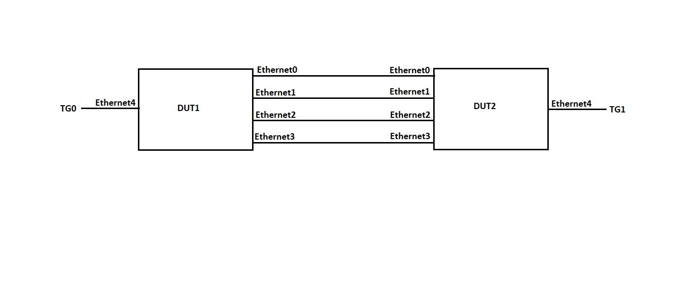

#  SQA Test Plan
#  SONiC LACP Fallback
#  SONiC 3.0 Project and BuzznikPlus Release
[TOC]
# Test Plan Revision History
| Rev  | Date       | Author                 | Change Description         |
| ---- | ---------- | ---------------------- | -------------------------- |
| 0.1  | 25/02/2020 | Jagadish Chatrasi   |      Initial version       |

# List of Reviewers
| Function |         Name         |
| :------: | :------------------: |
|   Dev    |     Madhukar Kamarapu       |
|   Dev    |     Daniel V    |
|   QA     | Anil Kumar Kolkaleti |
|   QA     |   Giri Babu Sajja    |
|   Auto-infra     |   Kalyan     |

# List of Approvers
| Function  |           Name         | Date Approved |
| :-------: | :--------------------: | :-----------: |
|   Dev     |     Madhukar Kamarapu         |               |
|   Dev     |     Daniel V      |               |
|   QA      |  Anil Kumar Kolkaleti  |               |
|   QA      |  Giri Babu Sajja       |               |

# Definition/Abbreviation
| **Term** | **Meaning**                                           |
| -------- | ----------------------------------------------------- |
| LAG      | Link Aggregation Group       |
| LACP     | Link Aggregation Control Protocol|

# Feature Overview
The LACP Fallback Feature allows an active LACP interface to establish a Link Aggregation (LAG) before it receives LACP PDUs from its peer.

This feature is useful in environments where customers have Preboot Execution Environment (PXE) Servers connected with a LACP Port Channel to the switch. Since PXE images are very small, many operating systems are unable to leverage LACP during the preboot process. The server’s NICs do not have the capability to run LACP without the assistance of a fully functional OS; during the PXE process, they are unaware of the other NIC and don't have a method to form a LACP connection. Both the NIC's on the server will be active and are sourcing frames from their respective MAC addresses during the initial boot process. Simply keeping both ports in the LAG active will not solve the problem because packets sourced from the MAC address of NIC-1 can be returned to the port on which NIC-2 is attached, which will cause NIC-2 to drop the packets (due to MAC mismatch).

With the LACP fallback feature, the switch allows the server to bring up the LAG (before receiving any LACP PDUs from the server) and keeps a single port active until it receives the LACP PDUs from the server. This allows the PXE boot server to establish a connection over one Ethernet port, download its boot image and then continue the booting process. When the server boot process is complete, the server fully forms an LACP port-channel.

# Test Approach 
- Module prolog constitutes VLAN creation, Dynamic Port Channel with Fallback mode creation and TG streams can be configured in module config this will reduce the run time.
- Tests covered FtOpSoSwFnLaFb005, FtOpSoSwFnLaFb006, FtOpSoSwFnLaFb007, FtOpSoSwFnLaFb008, FtOpSoSwLaFbNt001, FtOpSoSwLaFbNt002, FtOpSoSwLaFbLr001, FtOpSoSwLaFbLr002, FtOpSoSwLaFbLr003, FtOpSoSwLaFbLr004

# 1 Test Focus Areas
## 1.1 Functional Testing 
- LACP Fallback functionality with peer links as a part of Dynamic LAG and free from Dynamic LAG along with traffic test.
- LACP Fallback functionality with few peer links as part of dynamic LAG along with traffic test.
- LACP Fallback functionality with tagged traffic.
- LACP Fallback functionality with untagged traffic.

## 1.2 Negative Testing 
- LACP Fallback LAG member port selection with shutdown no-shutdown operation on the LAG all member ports.
- Traffic hashing through the LACP Fallback active member ports after shutdown and no-shutdown operation. 

## 1.3 Reboot/Config Testing  
- Warm reboot
- Config save and reload
- Fast-boot
- Cold-boot

# 2 Topologies
## 2.1 Topology 1

# 3 Test  Case and Objectives

## 3.1 Functional

### 3.1.1 Verify that only one port(least index port) will be selected as LAG member in LACP Fallback mode with peer links not part of LAG.
| **Test ID**    | **FtOpSoSwFnLaFb004**                                              |
| -------------- | :----------------------------------------------------------- |
| **Test Name**  | **Verify that only one port(least index port) will be selected as LAG member in LACP Fallback mode with peer links not part of LAG.** |
| **Test Setup** | **Topology**                                                 |
| **Type**       | **Functional**    
| **Steps**      | **<u>Procedure:</u> 1. Create a dynamic LAG with Fallback mode enabled in DUT1. 2. Add all interconnect ports as members to the LAG in DUT1  <u>Expected Result:</u> 1.Verify that dynamic LAG is created successfully with Fallback mode enabled in DUT1. 2.Verify that all interconnected ports are added as members to LAG successfully but only one member port which is having least index is shown as active member.(As per our topology diagram only Ethernet0 will be the active member) ** |

### 3.1.2 Verify that tagged traffic hashed through the LAG member ports which is having Fallback enabled.
| **Test ID**    | **FtOpSoSwFnLaFb005**                                              |
| -------------- | :----------------------------------------------------------- |
| **Test Name**  | **Verify that tagged traffic hashed through the LAG member ports which is having Fallback enabled.** |
| **Test Setup** | **Topology**                                                 |
| **Type**       | **Functional**    
| **Steps**      | **<u>Procedure:</u> 1. Create a dynamic LAG with Fallback mode enabled in DUT1. 2. Add all interconnect ports as members to the LAG in DUT1. 3. Create random VLAN let's say 10 in both the DUTs. 4. Add the LAG and the port which is connected to TG as tagged members to the configured VLAN in DUT1. 5. Add the DUT2's port which is the peer port of DUT1's LAG's active port (The port of DUT1 that became active in step-2) and the port which is connected to TG as tagged members to the configured VLAN in DUT2. 6. Now send tagged hashed traffic from the TG port which is connected to DUT1.   <u>Expected Result:</u> 1. Verify that dynamic LAG is created successfully with Fallback mode enabled in DUT1. 2. Verify that all interconnected ports are added as members to LAG in DUT1 successfully but only one member port which is having least index is shown as active member.(As per our topology diagram only Ethernet0 will be the active member)  3. Verify that the VLAN is created successfully in both the DUTs. 4. Verify that TG connected port and the LAG are added as tagged members of configured VLAN successfully in DUT1. 5. Verify that TG connected port and the DUT2's port which is the peer port of DUT1's LAG's active port (The port of DUT1 that became active in step-2) i.e. Ethernet0 are added as tagged members of configured VLAN successfully in DUT2. 6. Verify that traffic is sent through Ethernet0 only.  ** |

### 3.1.3 Verify that untagged traffic hashed through the LAG member ports which is having Fallback enabled.
| **Test ID**    | **FtOpSoSwFnLaFb006**                                              |
| -------------- | :----------------------------------------------------------- |
| **Test Name**  | **Verify that untagged traffic hashed through the LAG member ports which is having Fallback enabled.** |
| **Test Setup** | **Topology**                                                 |
| **Type**       | **Functional**    
| **Steps**      | **<u>Procedure:</u> 1. Create a dynamic LAG with Fallback mode enabled in DUT1. 2. Add all interconnect ports as members to the LAG in DUT1. 3. Create random VLAN let's say 10 in both the DUTs. 4. Add the LAG and the port which is connected to TG as untagged members to the configured VLAN in DUT1. 5. Add the DUT2's port which is the peer port of DUT1's LAG's active port (The port of DUT1 that became active in step-2) and the port which is connected to TG as untagged members to the configured VLAN in DUT2. 6. Now send untagged hashed traffic from the TG port which is connected to DUT1.   <u>Expected Result:</u> 1. Verify that dynamic LAG is created successfully with Fallback mode enabled in DUT1. 2. Verify that all interconnected ports are added as members to LAG in DUT1 successfully but only one member port which is having least index is shown as active member.(As per our topology diagram only Ethernet0 will be the active member)  3. Verify that the VLAN is created successfully in both the DUTs. 4. Verify that TG connected port and the LAG are added as untagged members of configured VLAN successfully in DUT1. 5. Verify that TG connected port and the DUT2's port which is the peer port of DUT1's LAG's active port (The port of DUT1 that became active in step-2) i.e. Ethernet0 are added as untagged members of configured VLAN successfully in DUT2. 6. Verify that traffic is sent through Ethernet0 only.  ** |

### 3.1.4 Verify LACP Fallback functionality with few peer links as a part of Dynamic LAG and free from Dynamic LAG along with traffic test.
| **Test ID**    | **FtOpSoSwFnLaFb007**                                              |
| -------------- | :----------------------------------------------------------- |
| **Test Name**  | **Verify LACP Fallback functionality with peer links as a part of Dynamic LAG and free from Dynamic LAG along with traffic test.** |
| **Test Setup** | **Topology**                                                 |
| **Type**       | **Functional**    
| **Steps**      | **<u>Procedure:</u> 1. Create a dynamic LAG with Fallback mode enabled in DUT1. 2. Create a dynamic LAG (without Fallback mode) in DUT2(Do not add any ports into the LAG on DUT2). 3. Add all interconnect ports as members to the LAG in DUT1. 4. Create random VLAN let's say 10 in both the DUTs. 5. Add the LAG and the port which is connected to TG as tagged members to the configured VLAN in DUT1. 6. Add the DUT2's port which is the peer port of DUT1's LAG's active port (The port of DUT1 that became active in step-3) and the port which is connected to TG as tagged members to the configured VLAN in DUT2. 7. Now send tagged hashed traffic from the TG port which is connected to DUT1. 8. Now remove the DUT2's port which is the peer port of DUT1's LAG's active port(The port of DUT1 that became active in step-3) from the VLAN. 9. Now add a random interconnected port let's say Ethernet1 as member to LAG in DUT2. 10. Now add the LAG and TG connected DUT port of DUT2 as tagged members of the configured VLAN. 11. Now send tagged hashed traffic from the TG port which is connected to DUT1. 12. Now remove the port Ethernet1 from LAG in DUT2. 13. Now add another random interconnected port let's say Ethernet0 as member to LAG in DUT2. 14. Now send tagged hashed traffic from the TG port which is connected to DUT1. 15. Now add previously removed port i.e. Ethernet1 to LAG in DUT2. 16. Now send tagged hashed traffic from the TG port which is connected to DUT1.  <u>Expected Result:</u> 1. Verify that dynamic LAG is created successfully with Fallback mode enabled in DUT1. 2. Verify that dynamic LAG is created successfully with out Fallback mode enabled in DUT2. 3. Verify that all interconnected ports are added as members to LAG in DUT1 successfully but only one member port which is having least index is shown as active member.(As per our topology diagram only Ethernet0 will be the active member) 4. Verify that the VLAN is created successfully in both the DUTs 5. Verify that TG connected port and the LAG are added as tagged members of configured VLAN successfully. 6. Verify that TG connected port and the DUT2's port which is the peer port of DUT1's LAG's active port (The port of DUT1 that became active in step-3) i.e. Ethernet0 are added as tagged members of configured VLAN successfully in DUT2. 7. Verify that traffic is forwarded only through the active member of the LAG i.e. Ethernet0 in DUT1 8. Verify that the DUT2's port which is the peer port of DUT1's LAG's active port(The port of DUT1 that became active in step-3) is removed from configured VLAN. 9. Verify that Ethernet1 is added as member to LAG in DUT2, Ethernet1(only) is active member of the LAG in DUT1 and DUT2. 10. Verify that LAG and TG connected DUT port of DUT2 are added as tagged members of  configured VLAN. 11. Verify that traffic is forwarded only through the active member of the LAG i.e. Ethernet1 in DUT1 12. Verify that Ethernet1 is removed from LAG in DUT2 and least index port Ethenret0 will be the only active member of LAG in DUT1. 13. Verify that Ethernet0 is added as member to LAG in DUT2, Ethernet0(only) is active member of the LAG in DUT1 and DUT2. 14. Verify that traffic is forwarded only through the active member of the LAG i.e. Ethernet0 in DUT1. 15. Verify that both the ports Ethernet0 and Ethernet1 are added and shown as active members of LAG in both the DUTs. 16. Verify that traffic is hashed on both the ports Ethernet0 and Ethernet1. ** |

### 3.1.5 Verify LACP Fallback functionality with L3 traffic.
| **Test ID**    | **FtOpSoSwFnLaFb008**                                              |
| -------------- | :----------------------------------------------------------- |
| **Test Name**  | **Verify LACP Fallback functionality with L3 traffic.** |
| **Test Setup** | **Topology**                                                 |
| **Type**       | **Functional**    
| **Steps**      | **<u>Procedure:</u> 1. Create a dynamic LAG with Fallback mode enabled in DUT1. 2. Add all interconnect ports as members to the LAG in DUT1. 3. Configure IP address on the LAG in DUT1 and the DUT2's port which is the peer port of DUT1's LAG's active port (The port of DUT1 that became active in step-2) in the same subnet let's say 30.0.0.0/8. 4. Configure IP address on the TG connected port in both the DUTs. 5. Now send L3 traffic from TG which is connected to DUT-1 to TG port which is connected to DUT-2.   <u>Expected Result:</u> 1. Verify that dynamic LAG is created successfully with Fallback mode enabled in DUT1. 2.Verify that all interconnected ports are added as members to LAG successfully but only one member port which is having least index is shown as active member.(As per our topology diagram only Ethernet0 will be the active member) 3. Verify that the IP addresses are configured successfully on the LAG in DUT1 and on the the DUT2's port which is the peer port of DUT1's LAG's active port (The port of DUT1 that became active in step-2). 4. Verify that TG connected DUT ports are configured with IP addresses properly. 5. Verify that traffic is hashed through Ethernet0 only.  <u>Note:</u> Configure the necessary static routes to route the traffic from DUT-1 t0 DUT-2 ** |

## 3.2 Negative
### 3.2.1 Verify Fallback LAG member port selection with shutdown no-shutdown operation on the LAG all member ports.
| **Test ID**    | **FtOpSoSwLaFbNt001**                                              |
| -------------- | :----------------------------------------------------------- |
| **Test Name**  | **Verify Fallback LAG member port selection with shutdown no-shutdown operation on the LAG all member ports.** |
| **Test Setup** | **Topology**                                                 |
| **Type**       | **Functional**    
| **Steps**      | **<u>Procedure:</u> 1.Create a dynamic LAG with Fallback mode enabled in DUT1. 2.Add members to the LAG in DUT1. 3. Shutdown all the LAG member ports 4. Now do no-shutdown the member port which is having the highest index i.e. Ethernet3. 5. Now do no-shutdown the member port Ethernet2  6. Now do no-shutdown the member port Ethernet1  7. Now do no-shutdown the member port Ethernet0   <u>Expected Result:</u> 1.Verify that dynamic LAG is created successfully with Fallback mode enabled in DUT1. 2.Verify that members are added to LAG successfully but only one member port which is having lowest index is shown as active member.(As per our topology diagram only Ethernet0 will be the active member) 3. Verify that all the member ports are in down state and the LAG also in down state. 4. Verify that Ethernet3 is active member(only) of the LAG. 5. Verify that Ethernet2 is active member(only) of the LAG. 6. Verify that Ethernet1 is active member(only) of the LAG. 7. Verify that Ethernet0 is active member(only) of the LAG. ** |

### 3.2.2 Verify Fallback LAG member port selection with remove and add the least index port.
| **Test ID**    | **FtOpSoSwLaFbNt002**                                              |
| -------------- | :----------------------------------------------------------- |
| **Test Name**  | **Verify Fallback LAG member port selection with remove and add the least index port.** |
| **Test Setup** | **Topology**                                                 |
| **Type**       | **Functional**  
| **Steps**      | **<u>Procedure:</u> 1. Create a dynamic LAG with Fallback mode enabled in DUT1. 2. Add all interconnect ports as members to the LAG in DUT1 3. Remove the active member of the LAG from it(least index port) i.e. Ethernet0 in DUT1 4. Add the LAG and the port which is connected to TG as tagged members to the configured VLAN in DUT1. 5. Add the DUT2's port which is the peer port of DUT1's LAG's active port (The port of DUT1 that became active in step-3) and the port which is connected to TG as tagged members to the configured VLAN in DUT2. 6. Now send tagged hashed traffic from the TG port which is connected to DUT1. 7. Now add the previously removed active member to LAG in DUT1 i.e.Ethernet0. 8. Add the DUT2's port which is the peer port of DUT1's LAG's active port (The port of DUT1 that became active in step-7) as tagged member to the configured VLAN in DUT2. 9. Now send tagged hashed traffic from the TG port which is connected to DUT1.  <u>Expected Result:</u> 1.Verify that dynamic LAG is created successfully with Fallback mode enabled in DUT1. 2. Verify that all interconnected ports are added as members to LAG successfully but only one member port which is having least index is shown as active member.(As per our topology diagram only Ethernet0 will be the active member) 3. Verify that next least index port i.e. Ethernet1 will be the active member of the LAG(only) in DUT1. 4. Verify that TG connected port and the LAG are added as tagged members of configured VLAN successfully in DUT1. 5. Verify that TG connected port and the the DUT2's port which is the peer port of DUT1's LAG's active port (The port of DUT1 that became active in step-3) i.e. Ethernet1 are added as tagged members of configured VLAN successfully in DUT2. 6. Verify that traffic is sent through Ethernet1 only. 7. Verify that Ethernet0 will be selected as active member(only) of LAG in DUT1. 8. Verify that the DUT2's port which is the peer port of DUT1's LAG's active port (The port of DUT1 that became active in step-7) i.e. Ethernet0 is added as tagged member of configured VLAN successfully in DUT2. 9. Verify that traffic is sent through Ethernet0 only. **|

### 3.2.3 Verify the traffic hashed properly through the LAG Fallback active member ports after shutdown and no-shutdown operation.
| **Test ID**    | **FtOpSoSwLaFbNt003**                                              |
| -------------- | :----------------------------------------------------------- |
| **Test Name**  | **Verify the traffic hashed properly through the LAG fall-back active member ports after shutdown and no-shutdown operation.** |
| **Test Setup** | **Topology**                                                 |
| **Type**       | **Functional**    
| **Steps**      | **<u>Procedure:</u> 1. Create a dynamic LAG with Fallback mode enabled in DUT1. 2. Create a dynamic LAG (without Fallback mode) in DUT2 3. Add members to the LAG in DUT1 and DUT2. 4. Create random VLAN let's say 10 in both the DUTs. 5. Add the LAG and the port which is connected to TG as tagged members to the configured VLAN in both the DUTs. 6. Now do shutdown and no-shutdown operation on the LAG member ports for multiple times. 7. Now send tagged hashed traffic from the TG port which is connected to DUT1.   <u>Expected Result:</u> 1.Verify that dynamic LAG is created successfully with Fallback mode enabled in DUT1. 2. Verify that dynamic LAG is created successfully in DUT2. 3.Verify that members are added to LAG successfully in both the DUTs and all member ports are shown as active in both the DUTs.  4. Verify that the VLAN is created successfully in both the DUTs 5. Verify that TG connected port and the LAG are added as tagged members of configured VLAN successfully. 6. Verify that all member ports are shown as active in both the DUTs after shutdown and no-shutdown operation. 7. Verify that traffic is hashed through the LAG member ports as per expectation.  ** |

## 3.3 Reboot/Reload Test Cases
### 3.3.1 Verify LACP Fallback functionality after cold reboot.
| **Test ID**    | **FtOpSoSwLaFbLr001**                                              |
| -------------- | :----------------------------------------------------------- |
| **Test Name**  | **Verify LACP Fallback functionality after cold reboot.** |
| **Test Setup** | **Topology**                                                 |
| **Type**       | **Functional**    
| **Steps**      | **<u>Procedure:</u> 1. Create a dynamic LAG with Fallback mode enabled in DUT1. 2. Add all interconnect ports as members to the LAG in DUT1. 3. Create random VLAN let's say 10 in both the DUTs. 4. Add the LAG and the port which is connected to TG as tagged members to the configured VLAN in DUT1. 5. Add the DUT2's port which is the peer port of DUT1's LAG's active port(The port of DUT1 that became active in step-2) and the port which is connected to TG as tagged members to the configured VLAN in DUT2. 6. Save the configuration and cold reboot the configuration. 7. Now send tagged hashed traffic from the TG port which is connected to DUT1.  <u>Expected Result:</u> 1. Verify that dynamic LAG is created successfully with Fallback mode enabled in DUT1. 2.Verify that all interconnected ports are added as members to LAG successfully but only one member port which is having least index is shown as active member.(As per our topology diagram only Ethernet0 will be the active member) 3. Verify that the VLAN is created successfully in both the DUTs 4. Verify that TG connected port and the LAG are added as tagged members of configured VLAN successfully in DUT1. 5. Verify that TG connected port and the DUT2's port which is the peer port of DUT1's LAG's active port (The port of DUT1 that became active in step-2) i.e. Ethernet0 are added as tagged members of configured VLAN successfully in DUT2. 6. Verify that device is up after save and cold-reboot successfully. 7. Verify that traffic is sent through Ethernet0 only. ** |

### 3.3.2 Verify LACP Fallback functionality after config save and reload.
| **Test ID**    | **FtOpSoSwLaFbLr002**                                              |
| -------------- | :----------------------------------------------------------- |
| **Test Name**  | **Verify LACP Fallback functionality after config save and reload.** |
| **Test Setup** | **Topology**                                                 |
| **Type**       | **Functional**    
| **Steps**      | **<u>Procedure:</u> 1. Create a dynamic LAG with Fallback mode enabled in DUT1. 2. Add all interconnect ports as members to the LAG in DUT1. 3. Create random VLAN let's say 10 in both the DUTs. 4. Add the LAG and the port which is connected to TG as tagged members to the configured VLAN in DUT1. 5. Add the DUT2's port which is the peer port of DUT1's LAG's active port(The port of DUT1 that became active in step-2) and the port which is connected to TG as tagged members to the configured VLAN in DUT2. 6. Save the configuration and reload the configuration. 7. Now send tagged hashed traffic from the TG port which is connected to DUT1.  <u>Expected Result:</u> 1. Verify that dynamic LAG is created successfully with Fallback mode enabled in DUT1. 2.Verify that all interconnected ports are added as members to LAG successfully but only one member port which is having least index is shown as active member.(As per our topology diagram only Ethernet0 will be the active member) 3. Verify that the VLAN is created successfully in both the DUTs 4. Verify that TG connected port and the LAG are added as tagged members of configured VLAN successfully in DUT1. 5. Verify that TG connected port and the DUT2's port which is the peer port of DUT1's LAG's active port (The port of DUT1 that became active in step-2) i.e. Ethernet0 are added as tagged members of configured VLAN successfully in DUT2. 6. Verify that device is up after save and reload successfully. 7. Verify that traffic is sent through Ethernet0 only. ** |

### 3.3.3 Verify LACP Fallback functionality with fast reboot.
| **Test ID**    | **FtOpSoSwLaFbLr003**                                              |
| -------------- | :----------------------------------------------------------- |
| **Test Name**  | **Verify LACP Fallback functionality with fast reboot.** |
| **Test Setup** | **Topology**                                                 |
| **Type**       | **Functional**    
| **Steps**      | **<u>Procedure:</u> 1. Create a dynamic LAG with Fallback mode enabled in DUT1. 2. Add all interconnect ports as members to the LAG in DUT1. 3. Create random VLAN let's say 10 in both the DUTs. 4. Add the LAG and the port which is connected to TG as tagged members to the configured VLAN in DUT1. 5. Add the DUT2's port which is the peer port of DUT1's LAG's active port (The port of DUT1 that became active in step-2) and the port which is connected to TG as tagged members to the configured VLAN in DUT2. 6. Now send tagged hashed traffic continuously from the TG port which is connected to DUT1. 7. Warm-reboot the device.  <u>Expected Result:</u> 1. Verify that dynamic LAG is created successfully with Fallback mode enabled in DUT1. 2.Verify that all interconnected ports are added as members to LAG successfully but only one member port which is having least index is shown as active member.(As per our topology diagram only Ethernet0 will be the active member) 3. Verify that the VLAN is created successfully in both the DUTs 4. Verify that TG connected port and the LAG are added as tagged members of configured VLAN successfully in DUT1. 5. Verify that TG connected port and the DUT2's port which is the peer port of DUT1's LAG's active port (The port of DUT1 that became active in step-2) i.e. Ethernet0 are added as tagged members of configured VLAN successfully in DUT2. 6. Verify that traffic is sent through Ethernet0 only.  7. Verify that device is up after warm reboot successfully and the traffic is not interrupted more than 90 seconds. ** |

### 3.3.4 Verify LACP Fallback functionality with warm reboot.
| **Test ID**    | **FtOpSoSwLaFbLr004**                                              |
| -------------- | :----------------------------------------------------------- |
| **Test Name**  | **Verify LACP Fallback functionality with warm reboot.** |
| **Test Setup** | **Topology**                                                 |
| **Type**       | **Functional**    
| **Steps**      | **<u>Procedure:</u> 1. Create a dynamic LAG with Fallback mode enabled in DUT1. 2. Add all interconnect ports as members to the LAG in DUT1. 3. Create random VLAN let's say 10 in both the DUTs. 4. Add the LAG and the port which is connected to TG as tagged members to the configured VLAN in DUT1. 5. Add the DUT2's port which is the peer port of DUT1's LAG's active port (The port of DUT1 that became active in step-2) and the port which is connected to TG as tagged members to the configured VLAN in DUT2. 6. Now send tagged hashed traffic continuously from the TG port which is connected to DUT1. 7. Warm-reboot the device.  <u>Expected Result:</u> 1. Verify that dynamic LAG is created successfully with Fallback mode enabled in DUT1. 2.Verify that all interconnected ports are added as members to LAG successfully but only one member port which is having least index is shown as active member.(As per our topology diagram only Ethernet0 will be the active member) 3. Verify that the VLAN is created successfully in both the DUTs 4. Verify that TG connected port and the LAG are added as tagged members of configured VLAN successfully in DUT1. 5. Verify that TG connected port and the DUT2's port which is the peer port of DUT1's LAG's active port (The port of DUT1 that became active in step-2) i.e. Ethernet0 are added as tagged members of configured VLAN successfully in DUT2. 6. Verify that traffic is sent through Ethernet0 only. 7. Verify that device is up after warm reboot successfully and the traffic is not interrupted more than 25 seconds. ** |

## 3.4 UI
N/A UI tests will be covered as part of spytest infra.

## 3.5 Reference Links
LACP Fallback Feature HLD @ <https://github.com/Azure/SONiC/blob/master/doc/lag/LACP%20Fallback%20Feature%20for%20SONiC_v0.5.md>