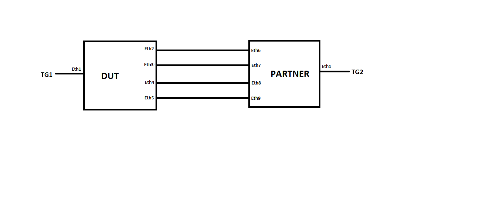

#  SQA Test Plan
#  LACP Helper
#  SONiC 3.1.1 Project and Buzznik Plus MR Release
[TOC]
# Test Plan Revision History
|Rev  | Date       | Author                 | Change Description      |
|:---:|:----------:|:----------------------:|:-----------------------:|
| 0.1 | 13/10/2020 | Jagadish Ch            | Initial version         |

# List of Reviewers
| Function |         Name         |
| :------: | :------------------: |
|   Dev    | Daniel Varagunasingh |
|   Dev    |  Madhukar Kamarapu   |
|   QA     | Anil Kumar Kolkaleti |
|   QA     |   Giri Babu Sajja    |

# List of Approvers
| Function |         Name         | Date Approved |
| :------: | :------------------: | :-----------: |
|   Dev    | Daniel Varagunasingh |               |
|   Dev    |  Madhukar Kamarapu   |               |
|   QA     | Anil Kumar Kolkaleti |               |
|   QA     |   Giri Babu Sajja    |               |

# Definition/Abbreviation
| Term   | Meaning                                |
|--------|----------------------------------------|
| LAG    | Link Aggregation Group                 |
| LACP   | Link Aggregation Control Protocol      |
| LACPDU | LACP Data Unit                         |

# Feature Overview
As mentioned in the previous section, there might be a delay for the portchannel member port netdevice to become operational (netdevice creation and link UP in the kernel) post warm boot. If the time gap between the moment last LACPDU is transmitted before system going down (due to warm boot) and the 1st LACPDU transmitted after the system is ready is larger than the LACP timeout (90 seconds), the partner LACP device resets the LACP states and the portchannel on the partner would go DOWN operationally. This results in traffic forwarding failure through the portchannel during warm boot operation.

To handle this issue, starting SONiC 3.1.1, post warm boot the LACP helper script reads the saved tx LACPDU on a given port and transmit an LACPDU using KNET transmit path per each member port of the portchannel. Only one LACPDU is transmitted using the KNET transmit path. The LACPDU transmitted from the LACP helper resets the LACP timeout to 90-seconds on the partner LAG device. Once the system is ready (post warm boot) and the portchannel member port netdevices become operational (member port netdevice is created and link UP in the kernel), the teamd process transmits the LACPDUs as part of its regular LACP state machine operations; the LACPDU transmission happens using a raw socket per the portchannel member port netdevice.

Note: Even though LACP helper script transmits an LACPDU before the member port netdevice is operational (in the kernel), if there is a delay in the member port netdevice to become operational in the kernel (link UP), the portchannel on the partner device will become operationally down (due to LACP timeout) and traffic on that portchannel is dropped.

# Test Approach
- Module prolog constitutes required TG streams creation, LAG creation and adding members to it.
- Test function specific configurations will be handled in the test function itself.
- Functionality tests are covered.

# 1 Test Focus Areas
## 1.1 Functional Testing 
  - LACPDU transmission using KNET after warm-boot.

# 2 Topologies
## 2.1 Topology 1

# 3 Test  Case and Objectives

## 3.1 Functional

### 3.1.47 Verify that LACP PDUs are sent from a warm-boot device after warm-boot triggered within 90 seconds.
| **Test ID**    | **FtOpSoSwLagFn047**                                                                                 |
| -------------- | :--------------------------------------------------------------------------------------------------- |
| **Test Name**  | **Verify that LACP PDUs are sent from warm-boot device after warm-boot triggered within 90 seconds.**|
| **Test Setup** | **Topology**                                                                                         |
| **Type**       | **Functional**                                                                                       |
| **Steps**      | **<u>Procedure:</u> 1) Configure LAG in both DUT and Partner. 2) Add interconnected ports as members of that LAG in both devices. 3) Warm-boot the device. <u>Expected Result:</u> 1) Verify that LAG is successfully configured in both DUT and partner. 2) Verify that LAG is up with all the member ports as selected. 3) Verify that LACPDU packet is transmitted from DUT once the warm-boot is triggered after 90 seconds.** |

### 3.1.48 Verify that LACP PDUs are sent from only selected members of LAG after warm-boot triggered within 90 seconds.
| **Test ID**    | **FtOpSoSwLagFn048**                                                                                              |
| -------------- | :---------------------------------------------------------------------------------------------------------------- |
| **Test Name**  | **Verify that LACP PDUs are sent from only selected members of LAG after warm-boot triggered within 90 seconds.** |
| **Test Setup** | **Topology**                                                                                                      |
| **Type**       | **Functional**                                                                                                    |
| **Steps**      | **<u>Procedure:</u> 1) Configure LAG in both DUT and Partner. 2) Add all interconnected ports(Eth2, Eth3, Eth4, Eth5) as members of that LAG in DUT and few ports(Eth6, Eth9) as members of the LAG in partner. 3) Warm-boot the device. <u>Expected Result:</u> 1) Verify that LAG is successfully configured in both DUT and partner. 2) Verify that LAG is up only with the members ports Eth2, Eth5 as selected in DUT and Eth6, Eth9 as selected in partner. 3) Verify that LACPDU packet is transmitted from DUT only through the ports(Eth2, Eth5) once the warm-boot is triggered after 90 seconds.** |

### 3.1.49 Verify that LACP PDUs are sent from warm-boot device after warm-boot triggered within 90 seconds with bidirectional traffic sent with MAX VLANs.
| **Test ID**    | **FtOpSoSwLagFn049**                                                                                 |
| -------------- | :--------------------------------------------------------------------------------------------------- |
| **Test Name**  | **Verify that LACP PDUs are sent from warm-boot device after warm-boot triggered within 90 seconds with bidirectional traffic sent with MAX VLANs.** |
| **Test Setup** | **Topology**                                                                                         |
| **Type**       | **Functional**                                                                                       |
| **Steps**      | **<u>Procedure:</u> 1) Configure LAG in both DUT and Partner. 2) Add interconnected ports as members of that LAG in both devices. 3) Configure 2k VLANs in both the devices. 4) Configure TG connected port and the LAG as tagged members of all the VLANs in both the devices. 5) Send continuous hashed bidirectional traffic with all VLANs. 6) Warm-boot the device. <u>Expected Result:</u> 1) Verify that LAG is successfully configured in both DUT and partner. 2) Verify that LAG is up with all the member ports as selected. 3) Verify that VLANs are created successfully in both the devices. 4) Verify that LAG and TG connected port are added as tagged members of the VLANs successfully. 5) Verify that traffic is hashed as per expectation. 6) Verify that LACPDU packet is transmitted from DUT once the warm-boot is triggered after 90 seconds.** |

### 3.1.50 Verify that LACP PDUs are sent from warm-boot device after warm-boot triggered within 90 seconds with bidirectional traffic sent with more static routes which causes the warm-boot time more than 90 seconds.
| **Test ID**    | **FtOpSoSwLagFn050**                                                                                 |
| -------------- | :--------------------------------------------------------------------------------------------------- |
| **Test Name**  | **Verify that LACP PDUs are sent from warm-boot device after warm-boot triggered within 90 seconds with bidirectional traffic sent with more static routes which causes the warm-boot time more than 90 seconds.** |
| **Test Setup** | **Topology**                                                                                         |
| **Type**       | **Functional**                                                                                       |
| **Steps**      | **<u>Procedure:</u> 1) Configure LAG in both DUT and Partner. 2) Add interconnected ports as members of that LAG in both devices. 3) Configure number of static routes which will cause delay the warm-boot more than 90 seconds. 4) Do the L3 configuration on the TG connected ports and LAGs. 5) Send continuous hashed bidirectional L3 traffic. 6) Warm-boot the device. <u>Expected Result:</u> 1) Verify that LAG is successfully configured in both DUT and partner. 2) Verify that LAG is up with all the member ports as selected. 3) Verify that static routes are created successfully in both the devices. 4) Verify that L3 configuration is successful on LAG and TG connected ports. 5) Verify that traffic is hashed as per expectation. 6) Verify that LACPDU packet is transmitted from DUT once the warm-boot is triggered after 90 seconds.** |

# 4 Reference Links
SONIC 3.1.1 'LACP Helper' HLD @ https://github.com/BRCM-SONIC/sonic_doc_private/blob/2310484c0674870064d062295dd3912b6b5febd2/L2/PortChannel/Portchannel_Enhancements.md#7-warm-boot-support