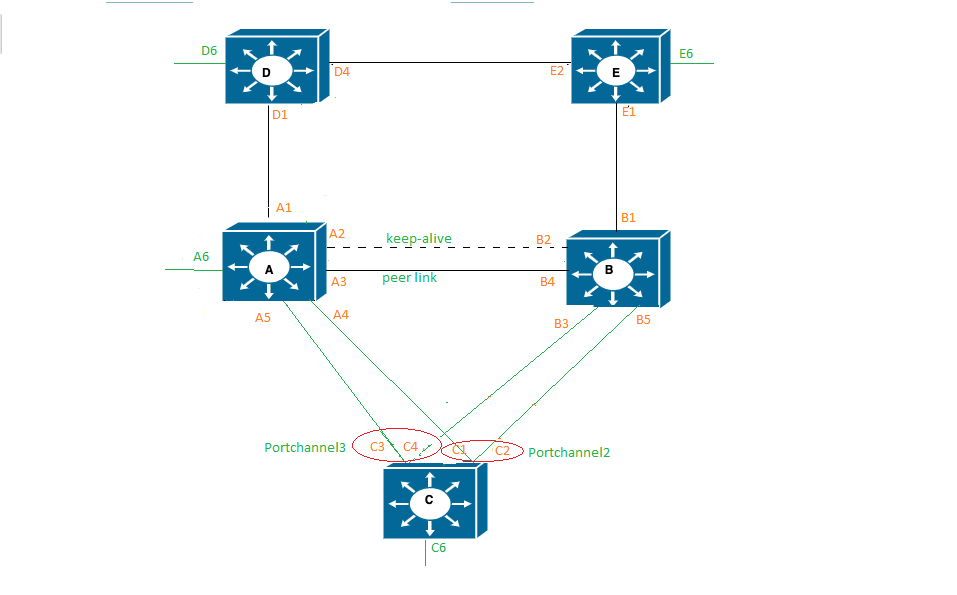
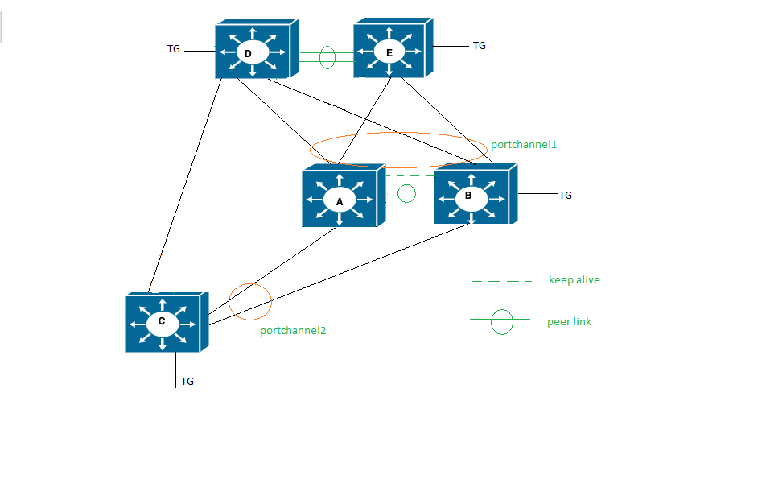

#  SQA Test Plan
# PVST IS_CLI, BPDU filter and MLAG
#  SONiC 3.0 Project and Buzznik Release
[TOC]
# List of Reviewers

| Function |             Name             |
| :------: | :--------------------------: |
|    QA    |        Anil Kolkaleti        |
|    QA    |       Giri Babu Sajja        |
|   Dev    |       Sandeep Kulambi        |
|   Dev    |  Divya Kumaran Chandralekha  |
|   Dev    | Praveen Hoskote Madhusudhana |
|          |                              |

# List of Approvers

| Function |      Name       | Approved on |
| :------: | :-------------: | ----------- |
|   Dev    | Sandeep Kulambi |             |
|    QA    | Giri Babu Sajja |             |

# Definition/Abbreviation

| **Term** | **Meaning**                       |
| -------- | --------------------------------- |
|IS-CLI    |Industry standard command line interface|
| CIST     | Common and internal spanning tree |
| CST      | Common spanning tree              |
| IST      | Internal spanning tree            |
| MSTI     | Multiple spanning tree instance   |
| MSTP     | Multiple spanning tree protocol   |
| PVST     | Per VLAN spanning tree protocol   |
| REST     | Representational state transfer   |
| STP      | Spanning tree protocol            |

# 
# Feature Overview
 Per-VLAN Spanning Tree (PVST) operates a separate instance of Spanning Tree Protocol (STP) for each individual VLAN. A separate instance of Spanning Tree Protocol (STP) for each VLAN helps VLAN to be configured independently and also can perform better. 
BPDU filtering, MLAG and IS-CLI is added to PVST feature in Buzznik 3.0.
BPDU Filter prevents specified ports from sending or receiving BPDUs. Again, there are two methods to configure this feature: globally (spanning-tree edge-port bpdufilter default) and per interface (spanning-tree bpdufilter enable). The interface configuration filters both incoming and outgoing BPDUs unconditionally – independent of the operational Port Fast state or access/trunk mode.
MLAG takes the benefits of link aggregation and spreads them across a pair of switches to deliver system level redundancy as well network level resiliency.
 MLAG, BPDU filtering will be tested on PVST.

# Test Approach

######  What will be part of module config?

1. Configuring of MLAG between all the duts.
2. Configuring of vlans(equal to no of duts in topology) on all the duts.
3. Configuring of PVST on all the duts and ports in the topology.
4. Configuring of bridge priorities in such a way that 1 dut is root in 1 vlan instance.
5. Wait for stp convergence.
6. Check for dut and port stp states and return once the convergence is completed.

###### What tests will be covered / clubbed together?

1. MLAG partner failover and non failover convergence tests will be covered in single test.
###### What 3rd party tools to be tested for?

​	None

###### In which area’s common warm-boot, cold boot , fast-boot file, corresponding test of the given feature gets covered?

PVST doesn't support warmreboot. Cold boot and fast boot will be covered as part of existing common 	files "test_switching_fast_reboot.py, test_switching_save_reboot.py.

###### List of tests which can not be automated and why?

None

###### What is the plan for covering secondary UI (Ex:- gNMI / KLISH / REST) and how much?

​	KLISH testing will be covered as part of PVST-MLAG functional testing

​    gNMI/REST tests are covered as part of Automation infrastrure testing.

# 1 Test Focus Areas

## 1.1 IS-CLI
KLISH testing will be covered as part of PVST-MLAG functional testing

## 1.2 Functional Testing 
  - PVST with BPDU filtering

## 1.3 Functional Interaction 
  - PVST over MLAG
## 1.4 REST

REST tests are covered as part of Automation infrastrure testing.

## 1.5 gNMI

gNMI tests are covered as part of Automation infrastrure testing.

# 2 Topologies
## 2.1 Topology 1

 

## 2.1 Topology 2
 
## 2.1 Topology 3
 

# 3 Test  Case and Objectives

## 3.1 IS-CLI

**KLISH testing will be covered as part of PVST-MLAG functional testing**

## 3.2 Functionality

#### 3.2.1 Verify that BPDU filter lost its ability when configured globally, if edge port receives BPDUS.

| **Test ID**    | **ft_pvst_bpdu_filter_edgeport**                             |
| -------------- | :----------------------------------------------------------- |
| **Test Name**  | **Verify that BPDU filter lost its ability when configured globally, if edge port receives BPDUS.** |
| **Test Setup** | **Topology1**                                                |
| **Type**       | **Functionality**                                            |
| **Steps**      | **Procedure:         1.  Bring up the setup and enable pvst on S1 and S2.        2.  Disable pvst on S2 and enable BPDU filtering on S1        3.  Enable pvst on S2.      Expected Result:         1.  Verify that pvst is set and root bridge is selected.        2.  Verify that BPDU filter will be enabled globally and ports send 10 bpdus              before bpdu filter enabled on ports. (since pvst disabled on S2              all ports will  become  edge ports as they don't receive any BPDUs from S2)        3.  Verify that  back to back connected ports to S2 loses their edge port            ability and hence BPDU filter ability will also removed.        4. Verify that all operational edge port still have bpdu filter ability.      ** |

#### 3.2.2 Verify that BPDU filter is working fine when DUT is working in spanning tree  PVST mode.

| **Test ID**    | **ft_pvst_bpdu_filter_pvst_mode**                            |
| -------------- | :----------------------------------------------------------- |
| **Test Name**  | **Verify that BPDU filter is working fine when DUT is working on spanning tree  PVST mode.** |
| **Test Setup** | **Topology1**                                                |
| **Type**       | **Functionality**                                            |
| **Steps**      | **Procedure:         1. Boot the DUT with default configuration.         2. Create VLAN 10 on S1 and S2.         3. Enable spanning tree on S1 and S2.         4.  Set spanning tree mode as PVST globally for VLAN 10 and on interfaces.         5.  Make S1 as root bridge.         6.  Disable pvst on S2          7.  Enable BPDU filter on  port e1 on S1           8.  Enable PVST on S2 and configure low switch priority on S2 than S1.         9. Disable BPDU filter on port e1 of switch S1          Expected Behavior:         1. S1 and S2 is up with default configuration.         2. VLAN is created on both the switches.         3. Verify that spanning tree is enabled.         4. Verify that spanning tree is set as PVST.         5. Verify that S1 is root bridge.         6. PVST is disabled on S2           7. Verify that BPDU filter is enabled on port.         8. Verify that S2 try to send BPDUs with saying it as root bridge to S1             but port e1 on S1 drops them as BPDU filter is enabled on             S1 connected port         9. Verify that port e1 on switch send and receives BPDU and S2 becomes              root bridge               ** |
#### 3.2.3 BPDU Filtering when enabled in Global mode and disabled in interface mode.

| **Test ID**    | **ft_pvst_bpdu_filter_Global_mode_enable**                   |
| -------------- | :----------------------------------------------------------- |
| **Test Name**  | **BPDU Filtering when enabled in Global mode and disabled in interface mode.** |
| **Test Setup** | **Topology1**                                                |
| **Type**       | **Functionality**                                            |
| **Steps**      | **Procedure:         1.    Bring up the setup with back to back connection between S1 and S2 .                And make sure that Switch S1 is the root bridge and verify the states                in S1 and S2 device.         2.    Disable PVST on S2 and enable bpdu filtering globally on S1.          3.    Disable BPDU filter on the port e1 of S1 and enable PVST on S2         4.    Disable PVST on S2 and remove BPDU filter configuration on e1 of S1.          5.   Enable PVST on S2 Expected Results:         1.    Verify that boxes are up and S1 is root Bridge. Port on S2 device                which is connected to S1 is having STP state as 'Root/Forwarding'.          2.   Verify that the global config enables bpdu filter on all the edge                 ports. If there is no edge port then BPDU filter will not work.          3.    i) Verify that BPDU filter is disabled on port even though globally                  enabled.                  ii) Verify that port send and receive BPDUs.          4.   Verify that BPDU filter configuration is removed from the port and                  Global BPDU configuration is applied on port.           5.   Verify BPDU filter will not be effective on port as the port will                  not be in portfast mode.** |

#### 3.2.4 BPDU Filtering when disabled in Global mode and enabled in interface mode.

| **Test ID**    | **ft_pvst_bpdu_filter_intf_mode_enable**                     |
| -------------- | :----------------------------------------------------------- |
| **Test Name**  | **BPDU Filtering when disabled in Global mode and enabled in interface mode.** |
| **Test Setup** | **Topology1**                                                |
| **Type**       | **Functionality**                                            |
| **Steps**      | **Procedure:         1.    Bring up the setup with back to back connection between S1 and S2 .                And make sure that switch S1 is the root bridge and verify the states                in S1 and S2 device.         2.    Disable PVST on S2 and disable bpdu filtering globally on switch S1.          3.    Enable BPDU filter on the port e1 of S1          4.    Disable BPDU filter on the port e1 of S1  Expected Results:         1.    Verify that boxes are up and S1 is root Bridge. Port on S2 device                which is connected to S1 is having STP state as 'Root/Forwarding'.         2.    Verify that the bpdu filter is disabled globally on s1         3.    Verify that BPDU filter is enabled on e1 and port doesn't send                 and receive any BPDUs         4.    Verify that BPDU filter is disabled and port send and receive BPDUs.                                 ** |
## 3.3 Functional Interaction

#### 3.3.1 Verify  the PVST convergence in MLAG topology for different PVST instances.

| **Test ID**    | **ft_pvst_fi_mlag_rootbridge_multi_instances**               |
| -------------- | :----------------------------------------------------------- |
| **Test Name**  | **Verify  the PVST convergence in MLAG topology for different PVST instances.** |
| **Test Setup** | **Topology2**                                                |
| **Type**       | **Functional_interaction**                                   |
| **Steps**      | **Procedure:      1.    Configure MLAG on switches A and B.      2.    Change priority to make mlag peers as root bridge      3.    Create portchannel1, portchannel2 and portchannel3             Create VlanX and VlanY and add ports as per the topology diagram;      4.    Enable  PVST on all DUTs A,B,C,D and E.      5.    Check the convergence for PVST instance VLAN X.      6.    Check the convergence for PVST instance VLAN Y.      7.    Check the  PVST port roles and states on  A,B,C,D and E.      8.    Send traffic from ixia port connected to D to C from VlanX              9.    Send traffic from ixia port connected to E to C  from vlanY         EXPECTED BEHAVIOR:      1. Verify that mlag is enabled in both the devices      2. Verify that mlag peers will become root bridge      3. Verify that vlans are created and ports are added as per the test case           requirement      4. Verify that  PVST is enabled in all the devices.       5. Verify the port roles for instance vlanX       6. Verify the port roles for instance vlanY       7. Verify the other port roles in the setup       8. Verify that VlanX  traffic received at C       9. Verify that VlanY traffic received at C.        ** |

#### 3.3.2 Verify the PVST convergence in MLAG topology while failover happens on standby switch.

| **Test ID**    | **ft_pvst_mlag_rootbridge_standby_failover**                 |
| -------------- | :----------------------------------------------------------- |
| **Test Name**  | **Verify the PVST convergence in MLAG topology while failover happens on standby switch.** |
| **Test Setup** | **Topology2**                                                |
| **Type**       | **Functional_interaction**                                   |
| **Steps**      | **Procedure:      1.    Configure MLAG on switches A and B.      2.    Change priority to make mlag peers as root bridge      3.    Create portchannel1, portchannel2 and portchannel3              Create VlanX and VlanY and add ports as per the topology diagram;      4.    Enable  PVST on all DUTs A,B,C,D and E.      5.    Send traffic from ixia port connected to D to C  from vlanX              6.    Send traffic from ixia port connected to E to C  from vlanY              7.    Save the configuration and Reload the switch acting as a standby to             check the changes on topology during the failover       8.   Check the pvst convergence when the failover switch comes back. EXPECTED BEHAVIOR:      1. Verify that mlag is enabled in both the devices      2. Verify that mlag peers will become root bridge      3. Verify the other port roles in the setup       4.  Verify pvst convergence and port roles during the failover       5.  Verify the traffic loss between the switches connected to failover switch           till pvst convergence. Verify that traffic is forwarded fine.      6.  Verify pvst convergence and port roles changes after switch comes back.       7. Verify that traffic is forwarded fine   ** |

#### 3.3.3 Verify the PVST convergence in MLAG topology while failover happens on a active mlag.

| **Test ID**    | **ft_pvst_mlag_rootbridge_active_failover**                  |
| -------------- | :----------------------------------------------------------- |
| **Test Name**  | **Verify the PVST convergence in MLAG topology while failover happens on a active mlag.** |
| **Test Setup** | **Topology2**                                                |
| **Type**       | **Functional_interaction**                                   |
| **Steps**      | ** Procedure:      1.    Configure MLAG on switches A and B.      2.    Change priority to make mlag peers as root bridge      3.    Create portchannel1, portchannel2 and portchannel3             Create VlanX and VlanY and add ports as per the topology diagram;      4.    Enable  PVST on all DUTs A,B,C,D and E.      5.    Send traffic from ixia port connected to D to C  from vlanX              6.    Send traffic from ixia port connected to E to C  from vlanY              7.    Save the configuration and Reload the switch acting as a active to             check the changes on topology during the failover       8.   Check the pvst convergence when the failover switch comes back. EXPECTED BEHAVIOR:      1. Verify that mlag is enabled in both the devices      2. Verify that mlag peers will become root bridge      3. Verify the other port roles in the setup       4.  Verify pvst convergence and port roles during the failover       5.  Verify the traffic loss between the switches connected to failover             switch till pvst convergence, traffic resumes after port state changes      6.  Verify pvst convergence and port roles changes after switch comes            back     ** |

#### 3.3.4 Verify the PVST convergence in MLAG topology while non-mlag device as root bridge.

| **Test ID**    | **ft_pvst_non-mlag_switch_root**                             |
| -------------- | :----------------------------------------------------------- |
| **Test Name**  | **Verify the PVST convergence in MLAG topology while non-mlag device as root bridge.** |
| **Test Setup** | **Topology2**                                                |
| **Type**       | **Functional_interaction**                                   |
| **Steps**      | ** Procedure:      1.    Configure MLAG on switches A and B.      2.    Change priority to make non-mlag switch D as root bridge      3.    Create portchannel1, portchannel2 and portchannel3             Create VlanX and VlanY and add ports as per the topology diagram;      4.    Enable  PVST on all DUTs A,B,C,D and E.      5.    Check the convergence for PVST instance VLAN X.      6.    Check the convergence for PVST instance VLAN Y.      7.    Check the  PVST port roles and states on  A,B,C,D and E.      8.    Send traffic from D to C                     EXPECTED BEHAVIOR:      1. Verify that mlag is enabled in both the devices      2. Verify that non-mlag device will become root bridge      3. Verify that vlans are created and ports are added       4. Verify that  PVST is enabled in all the devices.       5. Verify the port roles for instance vlanX       6. Verify the port roles for instance vlanX       7. Verify the other port roles in the topology           8. Verify that  traffic is received at C** |
#### 3.3.5 Verify the PVST convergence in MLAG topology while mlag partner device as root bridge.

| **Test ID**    | **ft_pvst_mlag_partner_switch_root**                         |
| -------------- | :----------------------------------------------------------- |
| **Test Name**  | **Verify the PVST convergence in MLAG topology while mlag partner device as root bridge.** |
| **Test Setup** | **Topology2**                                                |
| **Type**       | **Functional_interaction**                                   |
| **Steps**      | ** Procedure:      1.    Configure MLAG on switches A and B.      2.    Change priority to make mlag partner device C as root bridge      3.    Create portchannel1, portchannel2 and portchannel3             Create VlanX and VlanY and add ports as per the topology diagram;      4.    Enable  PVST on all DUTs A,B,C,D and E.      5.    Check the convergence for PVST instance VLAN X.      6.    Check the convergence for PVST instance VLAN Y.      7.    Check the  PVST port roles and states on  A,B,C,D and E.      8.    Send traffic from D to C         EXPECTED BEHAVIOR:      1. Verify that mlag is enabled in both the devices      2. Verify that mlag partner device will become root bridge      3. Verify that vlans are created and ports are added       4. Verify that  PVST is enabled in all the devices.       5. Verify the port roles for instance vlanX       6. Verify the port roles for instance vlanX       7. Verify the other port roles in the topology           8. Verify that  traffic is received at C** |

#### 3.3.6 Verify the traffic in east to west scenario between mlag peers in PVST topology.

| **Test ID**    | **ft_pvst_mlag_east_west_traffic**                           |
| -------------- | :----------------------------------------------------------- |
| **Test Name**  | **Verify the traffic in east to west scenario between mlag peers in PVST topology.** |
| **Test Setup** | **Topology2**                                                |
| **Type**       | **Functional_interaction**                                   |
| **Steps**      | ** Procedure:      1.    Configure MLAG on switches A and B.      2.    Change priority to make mlag partner device C as root bridge      3.    Create portchannel1, portchannel2 and portchannel3              Create Vlan and add ports as per the topology diagram;      4.    Enable  PVST on all DUTs A,B,C,D and E.      5.    Send east west traffic between A and B using orphan ports                6.    Shut down the port connected to peer link       7.   Bring up the peer link between A and B   EXPECTED BEHAVIOR:      1. Verify that mlag is enabled in both the devices      2. Verify that mlag partner device will become root bridge      3. Verify that vlan is created and ports are added       4. Verify that  PVST is enabled in all the devices.       5. Verify that traffic goes through peer link       6. Verify that traffic dropped       7. Verify that traffic resumes between mlag switches ** |

#### 3.3.7 Verify PVST convergence when separate links are used for keep alive and peer link.

| **Test ID**    | **ft_pvst_mlag_keepalive_peerlink_separate**                 |
| -------------- | :----------------------------------------------------------- |
| **Test Name**  | **Verify PVST convergence when separate links are used for keep alive and peerlink.** |
| **Test Setup** | **Topology2**                                                |
| **Type**       | **Functional_interaction**                                   |
| **Steps**      | ** Procedure:      1.    Connect 2 links between MLAG switches A and B and configure one             link as keep alive for stp and other link as peer link between two             mlag switches      2.    Shutdown the keep alive connected ports.      3.    shutdown the peer link ports   EXPECTED BEHAVIOR:      1. a)Verify that configuration is successful           b) Verify that when STP-ICCP is operational , peer link will not            participate in STP topology      2. a)Both devices become Active and revert to using their local System           MAC as the bridge Identifier.           b)Verify that STP-ICCP is not operational, peer link will participate           in STP topology      3. Verify that peer devices do not notice any change in the pvst topology            and will continue to function normally       ** |

#### 3.3.8 Verify the PVST convergence when peer link goes down between mlag devices.

| **Test ID**    | **ft_pvst_mlag_peerlink_down**                               |
| -------------- | :----------------------------------------------------------- |
| **Test Name**  | **Verify the PVST convergence when peer link goes down between mlag devices.** |
| **Test Setup** | **Topology2**                                                |
| **Type**       | **Functional_interaction**                                   |
| **Steps**      | ** Procedure:      1.    Connect a peerlink between MLAG switches A and B and configure             keep alive and as peerlink on the same link      2.    Shutdown the peerlink.      3.   Bring up the peerlink.   EXPECTED BEHAVIOR:      1. Verify that configuration is successful       2. Both devices become Active and revert to using their local System           MAC as the bridge Identifier.       3. Verify that keep alive sent between peer devices again and bridge            identifier is chosen again     ** |

#### 3.3.9 Verify the PVST convergence when mlag partner port goes down while traffic is forwarding.

| **Test ID**    | **ft_pvst_fi_mlag_traffic_partner_down**                     |
| -------------- | :----------------------------------------------------------- |
| **Test Name**  | **Verify the PVST convergence when mlag partner port goes down while traffic is forwarding.** |
| **Test Setup** | **Topology2**                                                |
| **Type**       | **Functional_interaction**                                   |
| **Steps**      | **Procedure:      1.    Configure MLAG on switches A and B.      2.    Change priority to make mlag peers as root bridge       3.   Create portchannel1, portchannel2 and portchannel3             Create VlanX and VlanY and add ports as per the topology diagram;      4.    Enable  PVST on all DUTs A,B,C,D and E.      5.    Send traffic between D and C      6.    Shutdown the port on C where traffic is received EXPECTED BEHAVIOR:      1. Verify that mlag is enabled in both the devices      2. Verify that mlag peer switches will become root bridge      3. Verify that vlans are created and ports are added as per the test case           requirement      4. Verify that  PVST is enabled in all the devices.       5. Verify that traffic reaches from A and B       6. Verify that link goes down on the port and traffic diverted via peer link.             ** |

#### 3.3.10 Verify the port states when bridge priority is changed to elect the new root bridge on existing mlag setup.

| **Test ID**    | **ft_pvst_mlag_bridge_priority_change**                      |
| -------------- | :----------------------------------------------------------- |
| **Test Name**  | **Verify the port states when bridge priority is changed to elect the new root bridge on existing mlag setup.** |
| **Test Setup** | **Topology2**                                                |
| **Type**       | **Functional_interaction**                                   |
| **Steps**      | **Procedure:      1.    Configure MLAG on switches A and B.      2.    Change priority to make mlag peers as root bridge       3.   Create portchannel1, portchannel2 and portchannel3             Create VlanX and VlanY and add ports as per the topology diagram;      4.    Enable  PVST on all DUTs A,B,C,D and E.      5.    Send traffic between D and C      6.    Change the bridge priority on device D to make it root bridge EXPECTED BEHAVIOR:      1. Verify that mlag is enabled in both the devices      2. Verify that mlag peer switches will become root bridge      3. Verify that vlans are created and ports are added as per the test case           requirement       4. Verify that vlans are configured       5. Verify the port states on the all devices.       6. Verify that D become root bridge, port states change accordingly             ** |

#### 3.3.11 Verify the PVST convergence when orphan ports link goes down/up.

| **Test ID**    | **ft_pvst_mlag_orphan_port_down**                            |
| -------------- | :----------------------------------------------------------- |
| **Test Name**  | **Verify the PVST convergence when orphan ports link goes down/up.** |
| **Test Setup** | **Topology2**                                                |
| **Type**       | **Functional_interaction**                                   |
| **Steps**      | ** Procedure:      1.    Configure MLAG on switches A and B.      2.    Change priority to make mlag peers as root bridge      3.   Create portchannel1, portchannel2 and portchannel3             Create VlanX and VlanY and add ports as per the topology diagram;      4.    Enable  PVST on all DUTs A,B,C,D and E.      5.    Shutdown the orphan port which is in forwarding state         EXPECTED BEHAVIOR:      1. Verify that mlag is enabled in both the devices      2. Verify that mlag peer switches will become root bridge      3. Verify that vlans are created and ports are added as per the test case           requirement      4. Verify the port state changes in the topology       5. Verify the pvst convergence in the topology          ** |

#### 3.3.12 Verify the TCN Handling between MLAG peers.

| **Test ID**    | **ft_pvst_mlag_tcn_handling**                                |
| -------------- | :----------------------------------------------------------- |
| **Test Name**  | **Verify the TC Handling between MLAG peers.**               |
| **Test Setup** | **Topology2**                                                |
| **Type**       | **Functional_interaction**                                   |
| **Steps**      | ** Procedure:      1.    Configure MLAG on switches A and B.      2.    Check the update on mlag after receiving TCN when peers              acting as root bridge      3.   Check the update on mlag after receiving TCN when peers              acting as non-root bridge   EXPECTED BEHAVIOR:      1. Verify that mlag is enabled in both the devices      2. a) Respond with the TC ACK bit set in the config BPDU on the               received port           b) Initiate fast-ageing for the STP instance           c) Transmit config BPDU with TC bit set on all the designated ports            d) Notify the MC-LAG peer node about the TC via STP-ICCP TLV.MC-LAG               peer node on receiving the TC notification takes the action               mentioned above in step b) and c)      3.  a) If the MC-LAG node has the root port , transmit the TCN via that                root port and respond with the TC ACK bit set in the config BPDU                on the  received port               (Or) If the MC-LAG node doesn't have the root port, respond with the                TC ACK bit set in the config BPDU on the received port and informs                the peer node about the rx TCN via TLV . On reception of this TLV ,                peer node transmit the TCN via its root port.                         ** |

#### 3.3.13 Verify  the PVST convergence when new links added and path cost increased scenarios.

| **Test ID**    | **ft_pvst_fi_mlag_path_cost                                  |
| -------------- | :----------------------------------------------------------- |
| **Test Name**  | **Verify  the PVST convergence when new links added and path cost increased scenarios.** |
| **Test Setup** | **Topology2**                                                |
| **Type**       | **Functional_interaction**                                   |
| **Steps**      | **Procedure:      1.    Configure MLAG on switches A and B.      2.    Change priority to make mlag peers as root bridge      3.    Create portchannel1, portchannel2 and portchannel3             Create VlanX and VlanY and add ports as per the topology diagram;      4.    Enable  PVST on all DUTs A,B,C,D and E.      5.    Check the convergence for PVST instance VLAN X.      6.    Check the convergence for PVST instance VLAN Y.      7.    Connect a link between two non mlag switches(D and E) and add              these ports to existing vlan and check the pvst convergence       8.    Connect a link between mlag partner and one of the mlag peer             switches and add these ports to existing vlan and check the             pvst convergence        9.  Increase path cost for one of the forwarding ports and check for            PVST convergence EXPECTED BEHAVIOR:      1. Verify that mlag is enabled in both the devices      2. Verify that mlag peers will become root bridge      3. Verify that vlans are created and ports are added as per the test case           requirement      4. Verify that  PVST is enabled in all the devices.       5. Verify the port roles for instance vlanX       6. Verify the port roles for instance vlanX       7. Verify the PVST convergence and port states       8. Verify the PVST convergence and port states      9. Verify the PVST convergence and port states            ** |

#### 3.3.14 Verify  the PVST convergence in 2 pair MLAG topology .

| **Test ID**    | **ft_pvst_fi_mlag_two_pair_topology**                        |
| -------------- | :----------------------------------------------------------- |
| **Test Name**  | **Verify  the PVST convergence in 2 pair MLAG topology.**    |
| **Test Setup** | **Topology2**                                                |
| **Type**       | **Functional_interaction**                                   |
| **Steps**      | **Procedure:      1.    Configure MLAG on switches A and B.      2.    Configure MLAG on switches A and B.      3.    Create portchannel1, portchannel2 and portchannel3             Create VlanX and VlanY and add ports as per the topology diagram;      4.    Enable  PVST on all devices and make D and E mlag  peers as root              bridge.       5.    Check the port states in the topology        6.  Send traffic from C to E       7.   Disable the traffic forwarding port(s) from C to E such that traffic             is diverted through peer link between A and B      8.   Check the pvst convergence if device A failover when it is active of mlag peers A and B      9.    Check the convergence after failover device A comes back      10.    Check the orphan port traffic non-mlag port from D to C          EXPECTED BEHAVIOR:      1. Verify that mlag is enabled in both the devices      2. Verify that mlag peers will become root bridge      3. Verify that vlans are created and ports are added as per the test case           requirement      4. Verify that  PVST is enabled in all the devices and mlag peers D and           E become root bridge       5. Verify the port states in the topology      6. Verify that traffic goes fine      7. Verify the traffic is diverted from through peer link       8. Verify the PVST convergence and traffic flow      9.  Verify the PVST convergence and traffic flow      10.  Verify the traffic is forwarded if non mlag link ports are in forward states.                   ** |
#### 

## 3.4 REST
| **Test ID**    | **ft_pvst_REST_mode**                                       |
| -------------- | :----------------------------------------------------------- |
| **Test Name**  | **Validate PVST related REST commands..**                   |
| **Test Setup** | **Topology1**                                                |
| **Type**       | **Management**                                               |
| **Steps**      | **Test Step Procedure ===================  1.    Perform a GET operation on PVST using REST 2.    Modify the value of the PVST parameter using a POST operation using REST followed by a GET operation 3.    Perform UPDATE and DELETE operations followed by GET operation  Expected Results ================  1.    Verify that GET operation is successful, shows HTTP response 200 and DUT returns correct values for the REST call. 2.    Verify that POST operation is successful, show HTTP response 200 and DUT returns correct configured values for the REST call. 3.    Verify that UPDATE, DELETE operations are successful, shows HTTP response 200 and update and delete functionality worked fine.** |

## 3.5 gNMI
| **Test ID**    | **ft_pvst_gNMI_mode**                                       |
| -------------- | :----------------------------------------------------------- |
| **Test Name**  | **Validate PVST is working fine with gNMI interface.**      |
| **Test Setup** | **Topology1**                                                |
| **Type**       | **Management**                                               |
| **Steps**      | **Procedure ========= 1) Go to telemetry docker by issuing below command "docker exec -it telemetry bash" 2) Perform gNMI get operation for PVST on <YANG module> using YANG objects. 3) Perform gNMI set operation for PVST on <YANG module> using YANG objects. 4) Perform gNMI POLL operation for PVST on <YANG module> using YANG objects. 5) Perform gNMI Subscribe ONCE  operation for PVST on <YANG module> using YANG objects. 6) Perform gNMI Subscribe STREAM for PVST operation on <YANG module> using YANG objects.   Expected Result =============== 1) Verify that operation is successful and command gets executed successfully.  2) Verify that operation is successful and displays correct output. 3) Verify that operation is successful and displays correct output. 4) Verify that operation is successful and displays correct output. 5) Verify that operation is successful and displays correct output. 6) Verify that operation is successful and displays correct output.** |

# 4 Reference Links

http://gerrit-lvn-07.lvn.broadcom.net:8083/c/sonic/documents/+/12535/5/L2/STP/SONiC+PVST+FDS.md#680 	