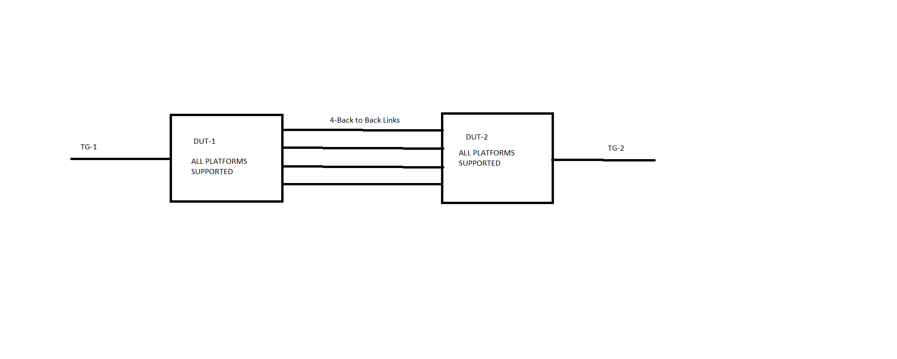

#  SQA Test Plan
#  SONiC Static Lag
#  SONiC 3.0 Project and Buzznik Release
[TOC]
# Test Plan Revision History
| Rev  | Date       | Author                 | Change Description         |
| ---- | ---------- | ---------------------- | -------------------------- |
| 0.2  | 11/05/2019 | Nagarjuna Suravarapu   |      Initial version       |

# List of Reviewers
| Function |         Name         |
| :------: | :------------------: |
|   Dev    |     Amitabha Sen       |
|   Dev    |     Daniel V    |
|   QA     | Anil Kumar Kolkaleti |
|   QA     |   Giri Babu Sajja    |
|   Auto-infra     |   Kalyan     |

# List of Approvers
| Function  |           Name         | Date Approved |
| :-------: | :--------------------: | :-----------: |
|   Dev     |     Amitabha Sen         |               |
|   Dev     |     Daniel V      |               |
|   QA      |  Anil Kumar Kolkaleti  |               |
|   QA      |  Giri Babu Sajja       |               |

# Definition/Abbreviation
| **Term** | **Meaning**                                           |
| -------- | ----------------------------------------------------- |
| LAG      | Link Aggregation Group       |

# Feature Overview
A Port Channel bundles individual ports into a group to provide increased bandwidth, load balancing and redundancy. A Port Channel can be either Static or Dynamic. A Dynamic Port Channel runs Link Aggregation Signaling protocols like LACP to mark the links active for traffic. A Static Port Channel has its member ports always available for traffic.

Static Port Channel uses the loadbalance Runner which hashes CPU sourced or CPU forwarded traffic among the member ports. Traffic forwarded in hardware on the Port Channel uses the silicon specific traffic hashing algorithm.

# Test Approach 
###### What will be part of module config?
1. As part of automation  Vlan creation, Static Port Channel creation and Ixia streams can be configured in module config this will reduce the run time.
 
2. Tests covered
FtOpSoSwStLagFn001,FtOpSoSwStLagFn002,FtOpSoSwStLagFn003,FtOpSoSwStLagFn004,FtOpSoSwStLagFn005,FtOpSoSwStLagFn006,FtOpSoSwStLagFn007,FtOpSoSwStLagFn008,FtOpSoSwStLagFn009,FtOpSoSwStLagFn010,FtOpSoSwStLagFn011,FtOpSoSwStLagNt001,FtOpSoSwStLagNt002,FtOpSoSwStLagNt003,FtOpSoSwStLagNt004,FtOpSoSwStLagNt005,FtOpSoSwStLagNt006,FtOpSoSwStLagNt007,FtOpSoSwStLagSc001,FtOpSoSwStLagSc002

###### What 3rd party tools to be tested for?
NA

# 1 Test Focus Areas
## 1.1 Functional Testing 
  - Static LAG functionality covers on vlan routing, l2 traffic, l3 traffic hashing.
  - changing the MTU for the portchannel.

## 1.2 Negative Testing 
  - Deleting the portchannel while having ip address/member ports/vlan routing.
  - Adding member ports with different speeds to static portchannel.
  - Adding a member port already part of a port-channel shouldn't be allowed to  add it to another port-channel.
  - Fallback cannot be configured on a static Port Channel.

## 1.3 Reboot/Config Testing  
  - Warm reboot
  - Config save and reload
  - Fast-boot

## 1.4 Scalability
  - Max no of static portchannel created.
  - Max no of member ports added to single static portchannel.

# 2 Topologies
## 2.1 Topology 1

# 3 Test  Case and Objectives

## 3.1 Functional

### 3.1.1 Verify that a Static Port Channel can be created.
| **Test ID**    | **FtOpSoSwStLagFn001**                                              |
| -------------- | :----------------------------------------------------------- |
| **Test Name**  | **Verify that a Static Port Channel can be created.** |
| **Test Setup** | **Topology**                                                 |
| **Type**       | **Functional**    
| **Steps**      | **Procedure: 1.Create a static  Port Channel. 2.Add members to the Port Channel. 3.Delete member ports from a Static Port Channel. 4.Delete a Static Port Channel with no member ports. Expected Result: 1.Verify that static Port Channel is created. 2.Verify that members  are added. 3.Verify that members  are deleted. 4.Verify that static port channel is deleted.** |

### 3.1.2 Verify that l2 traffic is forwarded Through the  Static Port Channel.

| **Test ID**    | **FtOpSoSwStLagFn002**                                              |
| -------------- | :----------------------------------------------------------- |
| **Test Name**  | **Verify that l2 traffic is forwarded Through the  Static Port Channel.** |
| **Test Setup** | **Topology**                                                 |
| **Type**       | **Functional**                                               |
| **Steps**      | **Procedure: 1. Configure a port channel and add 4 member ports into the Port Channel on both the DUTs. 2. Configure a Vlan V1 and participate the Port channel and the TG connected ports into this vlan with tagging enabled on both the DUTs. 3. Configure a Stream in TG1, with SMAC='00:00:01:00:00:01' with increment value 1 and repeat count 100 and DMAC = '00:00:02:00:00:01' with increment value 1 and repeat count 100. Configure a Stream in TG1, with SMAC='00:00:02:00:00:01' with increment value 1 and repeat count 100 and DMAC = '00:00:01:00:00:01' with increment value 1 and repeat count 100. 4. Initiate the bidrectional traffic from TG1 and TG2 with line rate. Expected Result: 1. Verify that Port Channel is UP. 2. Verify that vlan created and ports are successfully participated into that vlan. 3. No specific check in DUT, as it is TG configuration. 4. Verify that in both the DUTs<ol type='a'><li>all MAC (200) addressess are succesfully learned on the corresponding vlan and port/port channel in MAC table.<li>Traffic should be successfully forwarded without any loss.<li>Traffic should be hashed to all the ports in LAG.</ol>** |
 

### 3.1.3 Verify that L3 LAG hashing functionality working fine with Static Port Channel.

| **Test ID**    | **FtOpSoSwStLagFn003**                                              |
| -------------- | :----------------------------------------------------------- |
| **Test Name**  | **Verify that L3 LAG hashing functionality working fine with Static Port Channel.** |
| **Test Setup** | **Topology**                                                 |
| **Type**       | **Functional**                                               |
| **Steps**      | **Procedure: 1.Configure a port-channel on both DUT and partner switch, include the links connecting DUT and partner switch in the port-channel. 2.Configure one Ip address to Port-channel. Check ping should work between DUT and Partner. 3.Assign Ip address both ixia-1 and DUT connected port in same subnet. Assign Ip address both ixia-2 and partner connected port in same subnet. 4.Add static route of ixi-2 at DUT and add staic roue of ixia-1 at Partner. 5.Now send line rate L3 traffic from ixia-1 to Ixia-2 and vice versa. Check the traffic flow over LAG. 6. At ixia-1 modify the ixia stream as source IP as incremental IP.Send the traffic and check the traffic flow over 'LAG'. 7. At ixia-1 modify the ixia stream as destination Ip as incremental Ip. Send the traffic and check the traffic flow over LAG. 8. At ixia-1 modify the below parameter and verify the hashing functionality. <ol type="a"><li> Configure incremental L4 source port only at ixia-1.Send traffic.<li>Configure incremental l4 destination port only  at ixia-1. Send traffic.<li>Configure incremental IP protocol number only  at ixia-1. send traffic.<li>Now edit the stream with incremental L4 source port incremental l4 destination port and incremental IP protocol number Validate traffic flow over LAG.</ol>Expected Result:<ol type="1"><li>verify that Port-channel is Up and running.verify that IP configuration success. Ping is working fine.<li>verify result same like setp-2.<li>verify static route added successfully.<li>Verify that no traffic loss seen.<li>Verify that traffic is passing over one port i.e highest port number.<li>Verify that no traffic loss seen.<li>Verify that traffic should hash over two ports , ports which are part of LAG.<li>Verify that result same like above.<li>verify result same like above.</ol>** |

 
### 3.1.4 Verify that mtu value is configured and enable/disable the portchannel.

| **Test ID**    | **FtOpSoSwStLagFn007**                                              |
| -------------- | :----------------------------------------------------------- |
| **Test Name**  | **Verify that mtu value is configured and enable/disable the portchannel.** |
| **Test Setup** | **Topology**                                                 |
| **Type**       | **Functional**                                               |
| **Steps**      | **Procedure: 1.Configure a PortChannel and add ports in it. 2.Configure the MTU vlaue to the portchannel. 3.Try to delete MTU vlaue from the portchannel. 4.Enable the portchannel using the command "config interface startup <portchannel_name>". 5.Disable the portchannel using the command "config interface shutdown <portchannel_name>". Expected Result: 1.Verify Portchannel is configured and ports are added. 2.Verify that MTU value is configured. 3.Verify that MTU value is removed. 4.Verify that Portchannel is enabled successfully. 5.Verify that Portchannel is disabled successfully.** |
 
### 3.1.5 Verify that traffic flow is fine through LAG after LAG member shut/no-shut.

| **Test ID**    | **FtOpSoSwStLagFn008**                                              |
| -------------- | :----------------------------------------------------------- |
| **Test Name**  | **Verify that traffic flow is fine through LAG after LAG member shut/no-shut.** |
| **Test Setup** | **Topology**                                                 |
| **Type**       | **Functional**                                               |
| **Steps**      | **Procedure: 1.configure a static LAG in the above setup. Start bi-directional traffic ( by incrementing SRC MAC in a loop such that loop count is less than supported FDB size ) between IXIA_1 and IXIA_2. 2.Stop the traffic. Clear all counters on IXIA and DUT. Restart the traffic. Do shut on member-1 of the LAG. wait for 30 sec. Stop the traffic. 3.Clear all counters on IXIA and DUT. Restart the traffic. Now, do no shut on member-1.  Stop the traffic. 4.Now, change the LAG from static to dynamic. Start the traffic and wait for 30 sec and stop the traffic. 5.verify the both portchannel counters and port counters. 6.Clear all counters on IXIA and DUT. Restart the traffic. Do shut on member-2 of the LAG. Stop the traffic. 7.Clear all counters on IXIA and DUT. Restart the traffic. Now, do no shut on member-2. Stop the traffic. Expected Result:<ol type="1"><li>Verify that traffic gets load balanced on both the members ( by checking the interface TX counters of the member links of the LAG on DUT).<li>Verify that traffic gets forwarded via member-2 of the LAG after shut operation ( by checking the interface TX counters of the member links of the LAG  on DUT). Also, verify that traffic loss duration ( =  ( TX_pkts_IXIA_1 - RX_pkts_IXIA_2 ) / IXIA_1_TX_pkt_rate_in_pkts_per_sec ) is < 1 sec.<li>Verify that traffic gets load balanced on both the members  after no shut operation ( by checking the interface TX counters of the member links of the LAG  on DUT). Also, verify that traffic loss duration ( =  ( TX_pkts_IXIA_1 - RX_pkts_IXIA_2 ) / IXIA_1_TX_pkt_rate_in_pkts_per_sec ) is < 1 sec.<li>Verify that traffic gets load balanced on both the members  ( by checking the interface TX counters of the member links of the LAG  on DUT).<li>Verify the portchannel counters and port counters are incremented and no traffic loss should be there.<li>Verify that traffic gets forwarded via member-1 of the LAG after shut operation  ( by checking the interface TX counters of the member links of the LAG  on DUT). Also, verify that traffic loss duration ( =  ( TX_pkts_IXIA_1 - RX_pkts_IXIA_2 ) / IXIA_1_TX_pkt_rate_in_pkts_per_sec ) is < 1 sec.<li>Verify that traffic gets load balanced on both the members after no shut operation ( by checking the interface TX counters of the member links of the LAG  on DUT). Also, verify that traffic loss duration ( =  ( TX_pkts_IXIA_1 - RX_pkts_IXIA_2 ) / IXIA_1_TX_pkt_rate_in_pkts_per_sec ) is < 1 sec.** |
 

### 3.1.6 Verify that LAG can forward traffic when participating in VLAN Routing.

| **Test ID**    | **FtOpSoSwStLagFn009**                                              |
| -------------- | :----------------------------------------------------------- |
| **Test Name**  | **Verify that LAG can forward traffic when participating in VLAN Routing.** |
| **Test Setup** | **Topology**                                                 |
| **Type**       | **Functional**                                               |
| **Steps**      | **Procedure: 1.Configure a port-channel on both DUT and partner switch, include the links connecting DUT and partner switch in the port-channel. 2.configure one vlan add that vlan to the port channel. 3.Configure one Ip address to created vlan. Check ping should work between DUT and Partner. 4.Assign Ip address both ixia-1 and DUT connected port in same subnet. Assign Ip address both ixia-2 and partner connected port in same subnet. 5.Add static route of ixi-2 at DUT and add staic route of ixia-1 at Partner. 6.Now send line rate L3 traffic from ixia-1 to Ixia-2 and vice versa. Check the traffic flow over LAG. 7. At ixia-1 modify the ixia stream as source IP as incremental IP.Send the traffic and check the traffic flow over LAG. 8. At ixia-1 modify the ixia stream as destination Ip as incremental Ip. Send the traffic and check the traffic flow over LAG. 9. At ixia-1 modify the below parameter and verify the hashing functionality.<ol type="a"><li>Configure incremental L4 source port only at ixia-1.Send traffic.<li>Configure incremental l4 destination port only  at ixia-1. Send traffic.<li>Configure incremental IP protocl number only  at ixia-1. send traffic.<li>Now edit the stream with incremental L4 source port incremental l4 destination port and incremental IP protocol number Validate trffic flow over LAG.</ol> Expected Result: 1.verify that Port-channel is Up and running. 2.verify that vlan created and it to added to port channel. 3.verify that IP configuration success. Ping is working fine.   4.verify result same like setp-2. 5.verify static route added successfully. 6.Verify that no traffic loss seen. Verify that traffic is passing over one port i.e highest port number. 7.Verify that no traffic loss seen. Verify that traffic should hash over two ports , ports which are part of LAG. 8.Verify that result same like above. 9.verify result same like above.** |

### 3.1.7 Verify that the static LAG in main DUT is UP with lag configured with active members when LAG is not created at partner DUT.

| **Test ID**    | **FtOpSoSwStLagFn010**                                              |
| -------------- | :----------------------------------------------------------- |
| **Test Name**  | **Verify that the static LAG in main DUT is UP with lag configured with active members when LAG is not created at partner DUT.** |
| **Test Setup** | **Topology**                                                 |
| **Type**       | **Functional**                                               |
| **Steps**      | **Procedure: 1.Configure a static Port Channel on both DUTs. 2.Add members to the static Port Channel in one of the DUT. 3.Observe that lag status should be up, As it is static lag. Expected Result: 1.Verify that static Port Channel is created on both DUTs. 2.verify that ports are added to Static Port Channel. 3.Verify that lag status is up or not.** |

### 3.1.8 Verify that the status of the Port Channel is Up as long as at least one of its member ports is in Link Up state.

| **Test ID**    | **FtOpSoSwStLagFn011**                                              |
| -------------- | :----------------------------------------------------------- |
| **Test Name**  | **Verify that the status of the Port Channel is Up as long as at least one of its member ports is in Link Up state.** |
| **Test Setup** | **Topology**                                                 |
| **Type**       | **Functional**                                               |
| **Steps**      | **Procedure: 1.configure a static port channel on  both the DUTs. 2.Add atleast one linkup member port to the static port channel. 3.check the static portchannel status.  Expected Result: 1.Verify that static Port Channel is created on both DUTs. 2.verify that ports are added to Static Port Channel. 3.Verify that lag status is up or not.** |

## 3.2 Negative
### 3.2.1 Verify that deletion of a Static Port Channel which is member of  vlan with an IP address is assigned on it is not Successful.

| **Test ID**    | **FtOpSoSwStLagNt004**                                              |
| -------------- | :----------------------------------------------------------- |
| **Test Name**  | **Verify that deletion of a Static Port Channel which is member of  vlan with an IP address is assigned on it is not Successful.** |
| **Test Setup** | **Topology**                                                 |
| **Type**       | **Negative**                                                 |
| **Steps**      | **Procedure: 1.Create a static  Port Channel. 2.configure one vlan add that vlan to the port channel.  3.Assign  an IP address to the vlan created. 4.Delete a Static Port Channel  which is member of  vlan with an IP address is assigned on it. Expected Result: 1.Verify that static Port Channel is created. 2.Verify that vlan created and added to port channel. 3.Verify that ip is assigned to that vlan. 4.Verify that static port channel is not deleted.** |

### 3.2.2 Verify that deletion of a Static Port Channel with IP address is assigned on it is not Successful. 

| **Test ID**    | **FtOpSoSwStLagNt003**                                              |
| -------------- | :----------------------------------------------------------- |
| **Test Name**  | **Verify that deletion of a Static Port Channel with IP address is assigned on it is not Successful.** |
| **Test Setup** | **Topology**                                                 |
| **Type**       | **Negative**                                                 |
| **Steps**      | **Procedure: 1.Create a static  Port Channel. 2.Assign  an IP address to the port channel. 3.Delete a Static Port Channel with IP address is assigned on it. Expected Result: 1.Verify that static Port Channel is created. 2.Verify that ip address is assigned. 3.Verify that static port channel is not deleted.** |

### 3.2.3 Verify that deletion of a Static Port Channel with member ports Present is not Successful. 

| **Test ID**    | **FtOpSoSwStLagNt002**                                              |
| -------------- | :----------------------------------------------------------- |
| **Test Name**  | **Verify that deletion of a Static Port Channel with member ports Present is not Successful.** |
| **Test Setup** | **Topology**                                                 |
| **Type**       | **Negative**                                                 |
| **Steps**      | **Procedure: 1.Create a static  Port Channel. 2.Add members to the Port Channel. 3.Delete a Static Port Channel with nmember ports is present. Expected Result: 1.Verify that static Port Channel is created. 2.Verify that members are added. 3.Verify that static port channel is not deleted.** |

### 3.2.4 Verify that adding  member ports with different speeds to a Static Port Channel is Successful or not. 

| **Test ID**    | **FtOpSoSwStLagNt001**                                              |
| -------------- | :----------------------------------------------------------- |
| **Test Name**  | **Verify that adding  member ports with different speeds to a Static Port Channel is Successful or not.** |
| **Test Setup** | **Topology**                                                 |
| **Type**       | **Negative**                                                 |
| **Steps**      | **Procedure: 1.configure a static Port Channel. 2.Try to add member ports with different speeds to a Static Port Channel. 3.Delete all the added member ports from a Static Port Channel. 4.Delete that created static port channel. Expected Result: 1.Verify that static Port Channel is created. 2.verify that ports with different speeds are not added in the Static Port Channel. 3.Verify that members  are deleted. 4.Verify that static port channel is not deleted.** |

### 3.2.5 A member port already part of a port-channel shouldn't be allowed to add it to another port-channel. 

| **Test ID**    | **FtOpSoSwStLagNt005**                                              |
| -------------- | :----------------------------------------------------------- |
| **Test Name**  | **A member port already part of a port-channel shouldn't be allowed to add it to another port-channel.** |
| **Test Setup** | **Topology**                                                 |
| **Type**       | **Negative**                                                 |
| **Steps**      | **Procedure: 1.configure a static Port Channel-01 in DUT-1 and DUT-2. 2.Add members to the Port Channel in DUT-1 and DUT-2. 3.configure a another static Port Channel-02 in DUT-1 and DUT-2. 4.Add a member port to Port Channel-02 which is already part of Port Channel-01. Expected Result: 1.Verify that static Port Channel is created. 2.verify that ports are added to Static Port Channel. 3.Verify that static Port Channel is created. 4.Verify that member port is added to Port Channel-02.** |

### 3.2.6 Verify that "fallback" cannot be configured on a static Port Channel. 

| **Test ID**    | **FtOpSoSwStLagNt006**                                              |
| -------------- | :----------------------------------------------------------- |
| **Test Name**  | **Verify that "fallback" cannot be configured on a static Port Channel.** |
| **Test Setup** | **Topology**                                                 |
| **Type**       | **Negative**                                                 |
| **Steps**      | **Procedure: 1.configure a static Port channel. 2.Add port to the static port channel. 3.configure fallback on the created portchannel. Expected Result: 1.Verify that static Port Channel is created. 2.verify that ports are added to Static Port Channel. 3.verify that fallback is configured on static portchannel.** |

### 3.2.7 Modify a existing Dynamic port channel to Static and verify the behavior. 

| **Test ID**    | **FtOpSoSwStLagNt007**                                              |
| -------------- | :----------------------------------------------------------- |
| **Test Name**  | **Modify a existing Dynamic port channel to Static and verify the behavior.** |
| **Test Setup** | **Topology**                                                 |
| **Type**       | **Negative**                                                 |
| **Steps**      | **Procedure: 1.Configure a dynamic portchannel and member ports to it. 2.Check the portchannel status. 3.Send traffic. 4.Now modify that dynamic portchannel to static. 5.Check the portchannel status. 6.Again send traffic. Expected Result: 1.Verify that dynamic portchannel created and members are added in it.2.Verify the status is up or not. 3.Verify that no traffic loss is observed. 4.Verify that dynamic portchannel is changed to static. 5.Verify that status is up or not. 6.Verify that no traffic loss is observed.** |

## 3.3 Reboot/Reload Test Cases
### 3.3.1 Verify that the Static LAG configuration should be retained after save and reboot.

| **Test ID**    | **FtOpSoSwStLagFn004**                                              |
| -------------- | :----------------------------------------------------------- |
| **Test Name**  | **Verify that the Static LAG configuration should be retained after save and reboot.** |
| **Test Setup** | **Topology**                                                 |
| **Type**       | **Reboot**                                                   |
| **Steps**      | **Procedure: 1.Bring up the DUT with the default configuration. 2.Establish the static LAG between DUT and partner with the 4 ports. 3.Save the config. 4.Send the traffic and Reboot the device. Expected Result: 1.Verify that the DUT is having the default configuration. 2.Verify that the LAG is up. 3 & 4.Verfiy that LAG is up and no traffic loss observe after save and reboot.** |

### 3.3.2 Verify that port-channel is up and no traffic loss is observed during and after warm reboot.

| **Test ID**    | **FtOpSoSwStLagFn005**                                              |
| -------------- | :----------------------------------------------------------- |
| **Test Name**  | **Verify that port-channel is up and no traffic loss is observed during and after warm reboot.** |
| **Test Setup** | **Topology**                                                 |
| **Type**       | **Reboot**                                                   |
| **Steps**      | **Procedure: 1. Configure a port channel and add 4 member ports into the Port Channel on both the DUTs. 2. Create a vlan and participate the Port channel and the TG connected ports into this vlan with tagging enabled on both the DUTs. 3. Configure a Stream in TG1, with SMAC='00:00:01:00:00:01' with increment value 1 and repeat count 1000 and DMAC = '00:00:02:00:00:02' with increment value 1 and repeat count 1000. 4. Initiate the traffic from TG1 to TG2 with line rate. 5. Peform warm Reboot. Expected Result: 1. Verify that Port Channel is UP. 2. Verify that vlan created and ports are successfully participated into that vlan. 3. No specifi check in DUT, as it is TG configuration. 4 & 5. Verify that there is no traffic loss.**|

### 3.3.3 Verify that portchannel configuration is retained after save and fast-reboot.

| **Test ID**    | **FtOpSoSwStLagFn006**                                              |
| -------------- | :----------------------------------------------------------- |
| **Test Name**  | **Verify that portchannel configuration is retained after save and fast-reboot.** |
| **Test Setup** | **Topology**                                                 |
| **Type**       | **Reboot**                                                   |
| **Steps**      | **Procedure: 1.Bring up the DUT with the default configuration. 2.Establish the static LAG between DUT and partner with the 4 ports. 3.Save the config. 4.Perform fast-reboot. Expected Result: 1.Verify that the DUT is having the default configuration. 2.Verify that the LAG is up. 3 & 4.Verfiy that LAG is up after save and fast-reboot.** |

## 3.4 Scalability
### 3.4.1  Verify the max number of Static Port Channels configurable per system.

| **Test ID**    | **FtOpSoSwStLagSc001**                                              |
| -------------- | :----------------------------------------------------------- |
| **Test Name**  | **Verify the max number of Static Port Channels configurable per system.**|
| **Test Setup** | **Topology**                                                 |
| **Type**       | **Scalability**                                              |
| **Steps**      | **Procedure: 1.configure the max no of static portchannels. 2.Try to add some ports to randomly to some created port channel. 3.Delete the added member ports. 4.Delete the max no of configure portchannels. Expected Result: 1.Verfy that max no of static portchannels are created. 2.verify that ports are added to repective portchannel. 3.verify that members ports are deleted. 4.Verfiy that max no of static portchannels are deleted.** |

### 3.4.2  Verify the max number of member ports configurable per Static Port Channel.

| **Test ID**    | **FtOpSoSwStLagSc002**                                              |
| -------------- | :----------------------------------------------------------- |
| **Test Name**  | **Verify the max number of member ports configurable per Static Port Channel.**|
| **Test Setup** | **Topology**                                                 |
| **Type**       | **Scalability**                                              |
| **Steps**      | **Procedure: 1.configure a static Port Channel. 2.Add max no of member ports configurable per created Static Port Channel. 3.Delete all the added member ports from a Static Port Channel. 4.Delete that created static port channel. Expected Result: 1.Verify that static Port Channel is created. 2.Verify that members  are added. 3.Verify that members  are deleted. 4.Verify that static port channel is deleted.** |

## 3.5 UI
N/A UI's will be covered as part of spytest infra.

## 4 Reference Links
<http://gerrit-lvn-07.lvn.broadcom.net:8083/plugins/gitiles/sonic/documents/+/refs/changes/09/13509/2/L2/PortChannel/static_port_channel.md>