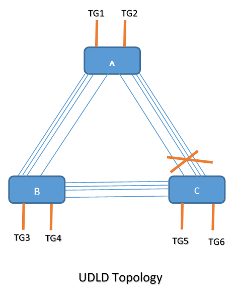
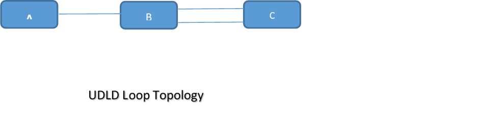

#  SQA Test Plan
# Uni-Directional Link Detection Protocol(UDLD)
#  SONiC 3.0 Project and Buzznik Release
# Table of Contents
[TOC]
# Test Plan Revision History
| Rev | Date | Author | Change Description |
|:---:|:-----------:|:------------------:|-----------------------------|
| 0.1 | 11/10/2019 | Chandra Sekhar Reddy | Initial version |

# List of Reviewers
|  Function | Name |
|:---:|:-----------:|
|  |   |

# List of Approvers
|  Function | Name | Date Approved|
|:---:|:-----------:|:------------------:|
|  |   |  |

# Definition/Abbreviation
| **Term** | **Meaning**                     |
| -------- | ------------------------------- |
| UDLD     | Uni-Directional Link Detection  |
| BPDU     | Bridge protocol data unit       |
| PVST     | Per VLAN spanning tree protocol |
| RPVST     | Rapid Per VLAN spanning tree protocol |
| REST     | Representational state transfer |
| STP      | Spanning tree protocol          |

# Feature Overview
The below has a topology where spanning-tree is being run to break the loop in the network, the link connecting Switch A and Switch C is blocked on Switch C side. As long as Switch C receives the BPDUs from Switch A, the port will continue to be in blocking state. In case there is a uni-directional failure from Switch A towards Switch C, then Switch C will stop receiving the BPDUs resulting in STP timers expiring on Switch C and moving the port from blocking to forwarding state, this results in a loop in the network. To avoid this loop UDLD can be used to monitor the links and in the event of a uni-directional failure the link can be shutdown to avoid the loops.

# 1 Test Focus Areas
## 1.1 Functional Testing 
  - All CLI and debug commands
  - UDLD with PVST
  - UDLD with RPVST
  - UDLD without PVST/RPVST
## 1.2 Negative Testing 
  -	Link flaps
  -	Warm reboot
  -	Fast reboot
  -	Config reload
  -	Cold Reboot

# 2 Topologies
## 2.1 Topology 1

## 2.2 Topology 2

# 3 Test  Case and Objectives

## 3.1 Functional
### 3.1.1 Verify  UDLD with various values of message-time and multipliers in normal mode with PVST
| **Test ID**    | **iTAS Test Case Manager ID**                                |
| -------------- | :----------------------------------------------------------- |
| **Test Name**  | **Verify UDLD with various values of message-time and multipliers in normal mode with PVST** |
| **Test Setup** | **Topology1**                                                |
| **Type**       | **Functional**                                               |
| **Steps**      | 1) Configure the PVST on Node A,B and C as per the topology on Physical ports in vlan 10 and all port-channels in vlan 20 2) Make sure Node A is root for both the PVST instances and forwarding path should be A<->B<->C 3) send Bi-Directional traffic from all traffic ports 4) Enable UDLD global and interfaces level in Normal mode with default message-time, 1 sec and multiplier, 3 5) Check the UDLD hellos should come every 1 sec with tcpdump, which is default time. 6) verify the traffic  rate should be as expected rate 7) verify the below show commands  - Verify global show udld command, for Admin state, UDLD Mode, Message Time and   Multiplier - Verify show udld neighbor command, for Device Name, Device ID, Port ID and Neighbor State - Verify show udld interface command, for to verify all the local and remote node details - Verify show udld counters command, for to verify the UDLD stats, TX/RX/errors - Verify clear udld counters command, for to verify the counters are cleared 8) Simulate that the UDLD packets should not come in direction A to C(with ACLs) and verify after 3 sec, the link will not be shut down and moved to undetermined state 9) Remove the ACL config and do UDLD reset, the link A to C moved to Bi-directional state and UDLD hello's received. 10) Configure message-time and multiplier other than default, and check the UDLD hellos should send after configured value 11) verify the traffic  rate should be as expected rate 12) verify the below show commands - Verify global show udld command, for Admin state, UDLD Mode, Message Time and Multiplier - Verify show udld neighbor command, for Device Name, Device ID, Port ID and Neighbor State - Verify show udld interface command, for to verify all the local and remote node details 13) Make sure the UDLD should be in Bi-directional state between A and C 14) Simulate that the UDLD packets should not come in direction A to C(with ACLs) and verify after configured message time and multiplier time, the link will not go down 15) Remove the UDLD blocking config and the UDLD packets coming the UDLD state moved to bi-directional 16) verify the traffic  rate should be as expected rate  |

### 3.1.2 Verify UDLD with various values of message-time and multipliers in Aggressive mode with PVST

| **Test ID**    | **iTAS Test Case Manager ID**                                |
| -------------- | :----------------------------------------------------------- |
| **Test Name**  | **Verify UDLD with various values of message-time and multipliers in Aggressive mode with PVST** |
| **Test Setup** | **Topology1**                                                |
| **Type**       | **Functional**                                               |
| **Steps**      | 1) Configure the PVST on Node A,B and C as per the topology on Physical ports in vlan 10 and all port-channels in vlan 20 2) Make sure Node A is root for both the PVST instances and forwarding path should be A<->B<->C 3) send Bi-Directional traffic from all traffic ports 4) Enable UDLD global and interfaces level in Aggressive mode with default message-time, 1 sec and multiplier, 3 5) Check the UDLD hellos should come every 1 sec with tcpdump, which is default time. 6) verify the traffic  rate should be as expected rate 7) verify the below show commands  - Verify global show udld command, for Admin state, UDLD Mode, Message Time and   Multiplier - Verify show udld neighbor command, for Device Name, Device ID, Port ID and Neighbor State - Verify show udld interface command, for to verify all the local and remote node details - Verify show udld counters command, for to verify the UDLD stats, TX/RX/errors - Verify clear udld counters command, for to verify the counters are cleared 8) Simulate that the UDLD packets should not come in direction A to C(with ACLs) and verify after 3 sec, UDLD state will be shut down 9) Remove the ACL config and do UDLD reset, the link A to C up and UDLD hello's received and UDLD state moved to bi-directional. 10) Configure message-time and multiplier other than default, and check the UDLD hellos should send after configured value 11) verify the traffic  rate should be as expected rate 12) verify the below show commands - Verify global show udld command, for Admin state, UDLD Mode, Message Time and Multiplier - Verify show udld neighbor command, for Device Name, Device ID, Port ID and Neighbor State - Verify show udld interface command, for to verify all the local and remote node details 13) Make sure the UDLD should be in Bi-directional state between A and C 14) Simulate that the UDLD packets should not come in direction A to C(with ACLs) and verify after 3 sec, the state moved to shutdown 15) Remove the ACL config and Do shut and no shut, the UDLD state moved to Bi-Directional 16) Interface flap between A to C, the UDLD moved to bi-directional state after the port comes up 17) verify the traffic  rate should be as expected rate  |

### 3.1.3 Verify UDLD operation with one end in normal mode and other end in aggressive mode with PVST

| **Test ID**    | **iTAS Test Case Manager ID**                                |
| -------------- | :----------------------------------------------------------- |
| **Test Name**  | **Verify UDLD operation with one end in normal mode and other end in aggressive mode with PVST** |
| **Test Setup** | **Topology1**                                                |
| **Type**       | **Functional**                                               |
| **Steps**      | 1) Configure the PVST on Node A,B and C as per the topology on Physical ports in vlan 10 and all port-channels in vlan 20 2) Make sure Node A is root for both the PVST instances and forwarding path should be A<->B<->C 3) send Bi-Directional traffic from all traffic ports 4) Enable UDLD global and interfaces level (Aggressive mode on Node A and Normal Mode on Node C. 5)  verify the traffic  rate should be as expected rate 6) Make sure the UDLD should be in Bi-directional state between A and C 7) Simulate that the UDLD packets should not come in direction A to C(with ACLs) and verify before timer expires on Node A, the UDLD will be in undetermined state and after timer expires on Node A, the state will be moved to shutdown 8) unblock the UDLD packets from A to C 9) Verify  the UDLD comes to Bi-directional state 10) Simulate that the UDLD packets should not come in direction C to A(with ACLs) and verify after 3 sec, the link will  go down and the state will be shutdown 11)  Do udld reset, the port should come up after unblock the UDLD packets from C to A 12) Verify techsupport has UDLD log files and debug command output collected |

### 3.1.4 Verify  UDLD with various values of message-time and multipliers in normal mode with RPVST

| **Test ID**    | **iTAS Test Case Manager ID**                                |
| -------------- | :----------------------------------------------------------- |
| **Test Name**  | **Verify UDLD with various values of message-time and multipliers in normal mode with RPVST** |
| **Test Setup** | **Topology1**                                                |
| **Type**       | **Functional**                                               |
| **Steps**      | 1) Configure the RPVST on Node A,B and C as per the topology on Physical ports in vlan 10 and all port-channels in vlan 20 2) Make sure Node A is root for both the RPVST instances and forwarding path should be A<->B<->C 3) send Bi-Directional traffic from all traffic ports 4) Enable UDLD global and interfaces level in Normal mode with default message-time, 1 sec and multiplier, 3 5) Check the UDLD hellos should come every 1 sec with tcpdump, which is default time. 6) verify the traffic  rate should be as expected rate 7) verify the below show commands  - Verify global show udld command, for Admin state, UDLD Mode, Message Time and   Multiplier - Verify show udld neighbor command, for Device Name, Device ID, Port ID and Neighbor State - Verify show udld interface command, for to verify all the local and remote node details - Verify show udld counters command, for to verify the UDLD stats, TX/RX/errors - Verify clear udld counters command, for to verify the counters are cleared 8) Simulate that the UDLD packets should not come in direction A to C(with ACLs) and verify after 3 sec, the UDLD state will be not be shut down 9) Remove the ACL config and do UDLD reset, the link A to C up and UDLD hello's received. 10) Configure message-time and multiplier other than default, and check the UDLD hellos should send after configured value 11) verify the traffic  rate should be as expected rate 12) verify the below show commands - Verify global show udld command, for Admin state, UDLD Mode, Message Time and Multiplier - Verify show udld neighbor command, for Device Name, Device ID, Port ID and Neighbor State - Verify show udld interface command, for to verify all the local and remote node details 13) Make sure the UDLD should be in Bi-directional state between A and C 14) Simulate that the UDLD packets should not come in direction A to C(with ACLs) and verify after Configured timers, the link will not go down and the state moved to shutdown 15) Do shut and no shut, the UDLD state moved to bi-directional after the port comes up 16) verify the traffic  rate should be as expected rate  |

### 3.1.5 Verify UDLD with various values of message-time and multipliers in Aggressive mode with RPVST

| **Test ID**    | **iTAS Test Case Manager ID**                                |
| -------------- | :----------------------------------------------------------- |
| **Test Name**  | **Verify UDLD with various values of message-time and multipliers in Aggressive mode with RPVST** |
| **Test Setup** | **Topology1**                                                |
| **Type**       | **Functional**                                               |
| **Steps**      | 1) Configure the RPVST on Node A,B and C as per the topology on Physical ports in vlan 10 and all port-channels in vlan 20 2) Make sure Node A is root for both the RPVST instances and forwarding path should be A<->B<->C 3) send Bi-Directional traffic from all traffic ports 4) Enable UDLD global and interfaces level in Aggressive mode with default message-time, 1 sec and multiplier, 3 5) Check the UDLD hellos should come every 1 sec with tcpdump, which is default time. 6) verify the traffic  rate should be as expected rate 7) verify the below show commands  - Verify global show udld command, for Admin state, UDLD Mode, Message Time and   Multiplier - Verify show udld neighbor command, for Device Name, Device ID, Port ID and Neighbor State - Verify show udld interface command, for to verify all the local and remote node details - Verify show udld counters command, for to verify the UDLD stats, TX/RX/errors - Verify clear udld counters command, for to verify the counters are cleared 8) Simulate that the UDLD packets should not come in direction A to C(with ACLs) and verify after 3 sec, the link will be shut down and the state will be shutdown 9) Remove the ACL config and do UDLD reset, the link A to C up and UDLD hello's received. 10) Configure message-time and multiplier other than default, and check the UDLD hellos should send after configured value 11) verify the traffic  rate should be as expected rate 12) verify the below show commands - Verify global show udld command, for Admin state, UDLD Mode, Message Time and Multiplier - Verify show udld neighbor command, for Device Name, Device ID, Port ID and Neighbor State - Verify show udld interface command, for to verify all the local and remote node details 13) Make sure the UDLD should be in Bi-directional state between A and C 14) Simulate that the UDLD packets should not come in direction A to C(with ACLs) and verify after configured timers, the link will  go down and state will be shutdown 15) Do shut and no shut, the UDLD is operational after the port comes up 16) Again do shut and no shut, the UDLD is in bi-directional state after the port comes up 17) verify the traffic  rate should be as expected rate  |

### 3.1.6 Verify UDLD operation with one end in normal mode and other end in aggressive mode with RPVST

| **Test ID**    | **iTAS Test Case Manager ID**                                |
| -------------- | :----------------------------------------------------------- |
| **Test Name**  | **Verify UDLD operation with one end in normal mode and other end in aggressive mode with RPVST** |
| **Test Setup** | **Topology1**                                                |
| **Type**       | **Functional**                                               |
| **Steps**      | 1) Configure the RPVST on Node A,B and C as per the topology on Physical ports in vlan 10 and all port-channels in vlan 20 2) Make sure Node A is root for both the RPVST instances and forwarding path should be A<->B<->C 3) send Bi-Directional traffic from all traffic ports 4) Enable UDLD global and interfaces level (Aggressive mode on Node A and Normal Mode on Node C. 5)  verify the traffic  rate should be as expected rate 6) Make sure the UDLD should be in Bi-directional state between A and C 7) Simulate that the UDLD packets should not come in direction A to C(with ACLs) and verify before timer expires on Node A, the UDLD will be in undetermined state and after timer expires on Node A, the state will be moved to shutdown 8) unblock the UDLD packets from A to C 9) Verify  the UDLD comes to Bi-directional state 10) Simulate that the UDLD packets should not come in direction C to A(with ACLs) and verify after 3 sec, the link will  go down and the state will be shutdown 11)  Do udld reset, the port should come up after unblock the UDLD packets from C to A 12) Verify techsupport has UDLD log files and debug command output collected |

### 3.1.7 Verify the PVST convergence with UDLD with Default values of message-time and multipliers in Aggressive mode 

| **Test ID**    | **iTAS Test Case Manager ID**                                |
| -------------- | :----------------------------------------------------------- |
| **Test Name**  | **Verify the PVST convergence with UDLD with Default values of message-time and multipliers in Aggressive mode** |
| **Test Setup** | **Topology1**                                                |
| **Type**       | **Functional**                                               |
| **Steps**      | 1) Configure the PVST on Node A,B and C as per the topology on Physical ports in vlan 10 and all port-channels in vlan 20 2) Make sure Node A is root for both the PVST instances and forwarding path should be A<->B<->C 3) send Bi-Directional traffic from all traffic ports 4) Enable UDLD global and interfaces level in Aggressive mode with default message-time, 1 sec and multiplier, 3 5) verify the traffic  rate should be as expected rate 6) Simulate that the UDLD packets should not come in direction A to B(with ACLs) and verify after 3 sec, UDLD state will be shut down 7)After 3 sec the PVST converges to path A<->C<->B, it should not wait till 50 Sec of PVST convergence time(2*FW delay+ Max Age => 2X15 + 20 => 50)  |

### 3.1.8 Verify the RPVST convergence with UDLD with Default values of message-time and multipliers in Aggressive mode 

| **Test ID**    | **iTAS Test Case Manager ID**                                |
| -------------- | :----------------------------------------------------------- |
| **Test Name**  | **Verify the RPVST convergence with UDLD with Default values of message-time and multipliers in Aggressive mode** |
| **Test Setup** | **Topology1**                                                |
| **Type**       | **Functional**                                               |
| **Steps**      | 1) Configure the RPVST on Node A,B and C as per the topology on Physical ports in vlan 10 and all port-channels in vlan 20 2) Make sure Node A is root for both the RPVST instances and forwarding path should be A<->B<->C 3) send Bi-Directional traffic from all traffic ports 4) Enable UDLD global and interfaces level in Aggressive mode with default message-time, 1 sec and multiplier, 3 5) verify the traffic  rate should be as expected rate 6) Simulate that the UDLD packets should not come in direction A to B(with ACLs) and verify after 3 sec, UDLD state will be shut down 7)After 3 sec the PVST converges to path A<->C<->B, it should not wait till 6 Sec of RPVST convergence time(6 sec => 2*3 here 2sec is hello)  |
### 3.1.9 Verify  UDLD Tx/Rx loops in normal mode with out PVST/RPVST

| **Test ID**    | **iTAS Test Case Manager ID**                                |
| -------------- | :----------------------------------------------------------- |
| **Test Name**  | **Verify  UDLD Tx/Rx loops in normal mode with out PVST/RPVST** |
| **Test Setup** | **Topology2**                                                |
| **Type**       | **Functional**                                               |
| **Steps**      | 1) Configure the Node A to Node B and Two link between Node B to Node C in untagged vlan 10 2) Enable UDLD global and interfaces level in Normal mode with default message-time, 1 sec and multiplier, 3 in Node A and Node B 3) Unconfigure the UDLD packets trap to CPU on Node B to forward packets from B to C and back to C to B to A so that UDLD packets are looped . 4) Verify the link between A to B will go down and UDLD state will be Shutdown immediately and should not wait for 3 sec 5) Do warm reboot of the node A and check the UDLD state is intact 6) Do UDLD reset after enable the UDLD packets trap to CPU on Node B and verify the UDLD state is Bi-Directional |
### 3.1.10 Verify  UDLD Tx/Rx loops in Aggressive mode with out PVST/RPVST

| **Test ID**    | **iTAS Test Case Manager ID**                                |
| -------------- | :----------------------------------------------------------- |
| **Test Name**  | **Verify  UDLD Tx/Rx loops in Agressive mode with out PVST/RPVST** |
| **Test Setup** | **Topology2**                                                |
| **Type**       | **Functional**                                               |
| **Steps**      | 1) Configure the Node A to Node B and Two link between Node B to Node C in untagged vlan 10 2) Enable UDLD global and interfaces level in Aggressive mode with default message-time, 1 sec and multiplier, 3 in Node A and Node B 3) Unconfigure the UDLD packets trap to CPU on Node B to forward packets from B to C and back to C to B to A so that UDLD packets are looped . 4) Verify the link between A to B will go down and UDLD state will be Shutdown immediately and should not wait for 3 sec 5) Do warm reboot of the node A and check the UDLD state is intact 6) Do UDLD reset after enable the UDLD packets trap to CPU on Node B and verify the UDLD state is Bi-Directional |

## 3.2 Reboot/Reload/Upgrade Test Cases
#### 3.2.1 Cold Reboot

### 3.2.1.1 verify Cold reboot with normal mode with PVST

| **Test ID**    | **iTAS Test Case Manager ID**                                |
| -------------- | :----------------------------------------------------------- |
| **Test Name**  | **verify Cold reboot with normal mode with PVST**            |
| **Test Setup** | **Topology1**                                                |
| **Type**       | **Functional**                                               |
| **Steps**      | 1) After bringing the testbed as per the test case 3.1.1 with traffic running 2) Bring the UDLD for Physical and port channel ports at the below states on Node A   -Physical link between A to C in UDLD Shutdown state -Port channel ports are in undetermined state between A to C  - Port Channel and physical link ports between A to B in Bi-directional state 3)  Do Cold reboot on Node A and check first all ports comes up and then UDLD will check the failure condition and move the UDLD states accordingly. 4)  Do udld reset and all ports on node A should be Bi-directional |

### 3.2.1.2 verify Cold reboot with Aggressive mode with PVST

| **Test ID**    | **iTAS Test Case Manager ID**                                |
| -------------- | :----------------------------------------------------------- |
| **Test Name**  | **verify Cold reboot with Aggressive mode with PVST**        |
| **Test Setup** | **Topology1**                                                |
| **Type**       | **Functional**                                               |
| **Steps**      | 1) After bringing the testbed as per the test case 3.1.2 with traffic running 2) Bring the UDLD for Physical and port channel ports at the below states on Node A  -Physical link between A to C in UDLD Shutdown state -Port channel ports are in undetermined state between A to C - Port Channel and physical link ports between A to B in Bi-directional state 3)  Do Cold reboot on Node A and check first all ports comes up and then UDLD will check the failure condition and move the UDLD states accordingly. 4)  Do udld reset and all ports on node A should be Bi-directional  |

### 3.2.1.3 verify Cold reboot with normal mode with RPVST

| **Test ID**    | **iTAS Test Case Manager ID**                                |
| -------------- | :----------------------------------------------------------- |
| **Test Name**  | **verify Cold reboot with normal mode with RPVST**           |
| **Test Setup** | **Topology1**                                                |
| **Type**       | **Functional**                                               |
| **Steps**      | 1) After bringing the testbed as per the test case 3.1.4 with traffic running 2) Bring the UDLD for Physical and port channel ports at the below states on Node A  -Physical link between A to C in UDLD Shutdown state -Port channel ports are in undetermined state between A to C - Port Channel and physical link ports between A to B in Bi-directional state 3)  Do Cold reboot on Node A and check first all ports comes up and then UDLD will check the failure condition and move the UDLD states accordingly. 4)  Do udld reset and all ports on node A should be Bi-directional  |

### 3.2.1.4 verify Cold reboot with Aggressive mode with RPVST

| **Test ID**    | **iTAS Test Case Manager ID**                                |
| -------------- | :----------------------------------------------------------- |
| **Test Name**  | **verify Cold reboot with Aggressive mode with RPVST**       |
| **Test Setup** | **Topology1**                                                |
| **Type**       | **Functional**                                               |
| **Steps**      | 1) After bringing the testbed as per the test case 3.1.5 with traffic running 2) Bring the UDLD for Physical and port channel ports at the below states on Node A  -Physical link between A to C in UDLD Shutdown state -Port channel ports are in undetermined state between A to C - Port Channel and physical link ports between A to B in Bi-directional state 3)  Do Cold reboot on Node A and check first all ports comes up and then UDLD will check the failure condition and move the UDLD states accordingly. 4)  Do udld reset and all ports on node A should be Bi-directional  |

#### 3.2.2 Fast Reboot
### 3.2.2.1 verify Fast reboot with normal mode with PVST

| **Test ID**    | **iTAS Test Case Manager ID**                                |
| -------------- | :----------------------------------------------------------- |
| **Test Name**  | **verify Fast reboot with normal mode with PVST**            |
| **Test Setup** | **Topology1**                                                |
| **Type**       | **Functional**                                               |
| **Steps**      | 1) After bringing the testbed as per the test case 3.1.1 with traffic running 2) Bring the UDLD for Physical and port channel ports at the below states on Node A   -Physical link between A to C in UDLD Shutdown state -Port channel ports are in undetermined state between A to C  - Port Channel and physical link ports between A to B in Bi-directional state 3)  Do Fast reboot on Node A and check all UDLD states are intact. 4)  Do udld reset and all ports on node A should be Bi-directional |

### 3.2.2.2 verify Fast reboot with Aggressive mode with PVST

| **Test ID**    | **iTAS Test Case Manager ID**                                |
| -------------- | :----------------------------------------------------------- |
| **Test Name**  | **verify Fast reboot with Aggressive mode with PVST**        |
| **Test Setup** | **Topology1**                                                |
| **Type**       | **Functional**                                               |
| **Steps**      | 1) After bringing the testbed as per the test case 3.1.2 with traffic running 2) Bring the UDLD for Physical and port channel ports at the below states on Node A  -Physical link between A to C in UDLD Shutdown state -Port channel ports are in undetermined state between A to C - Port Channel and physical link ports between A to B in Bi-directional state 3)  Do Fast reboot on Node A and check all UDLD states are intact. 4)  Do udld reset and all ports on node A should be Bi-directional  |

### 3.2.2.3 verify Fast reboot with normal mode with RPVST

| **Test ID**    | **iTAS Test Case Manager ID**                                |
| -------------- | :----------------------------------------------------------- |
| **Test Name**  | **verify Fast reboot with normal mode with RPVST**           |
| **Test Setup** | **Topology1**                                                |
| **Type**       | **Functional**                                               |
| **Steps**      | 1) After bringing the testbed as per the test case 3.1.4 with traffic running 2) Bring the UDLD for Physical and port channel ports at the below states on Node A  -Physical link between A to C in UDLD Shutdown state -Port channel ports are in undetermined state between A to C - Port Channel and physical link ports between A to B in Bi-directional state 3)  Do Fast reboot on Node A and check all UDLD states are intact. 4)  Do udld reset and all ports on node A should be Bi-directional  |

### 3.2.2.4 verify Fast reboot with Aggressive mode with RPVST

| **Test ID**    | **iTAS Test Case Manager ID**                                |
| -------------- | :----------------------------------------------------------- |
| **Test Name**  | **verify Fast reboot with Aggressive mode with RPVST**       |
| **Test Setup** | **Topology1**                                                |
| **Type**       | **Functional**                                               |
| **Steps**      | 1) After bringing the testbed as per the test case 3.1.5 with traffic running 2) Bring the UDLD for Physical and port channel ports at the below states on Node A  -Physical link between A to C in UDLD Shutdown state -Port channel ports are in undetermined state between A to C - Port Channel and physical link ports between A to B in Bi-directional state 3)  Do Fast reboot on Node A and check all UDLD states are intact. 4)  Do udld reset and all ports on node A should be Bi-directional  |

#### 3.2.3 Config reload
### 3.2.3.1 verify Save and Config reload with normal mode with PVST

| **Test ID**    | **iTAS Test Case Manager ID**                                |
| -------------- | :----------------------------------------------------------- |
| **Test Name**  | **verify Save and Config reload with normal mode with PVST**            |
| **Test Setup** | **Topology1**                                                |
| **Type**       | **Functional**                                               |
| **Steps**      | 1) After bringing the testbed as per the test case 3.1.1 with traffic running 2) Bring the UDLD for Physical and port channel ports at the below states on Node A   -Physical link between A to C in UDLD Shutdown state -Port channel ports are in undetermined state between A to C  - Port Channel and physical link ports between A to B in Bi-directional state 3)  Save config and do Config reload on Node A and check all UDLD states are intact. 4)  Do udld reset and all ports on node A should be Bi-directional |

### 3.2.3.2 verify Save and Config reload with Aggressive mode with PVST

| **Test ID**    | **iTAS Test Case Manager ID**                                |
| -------------- | :----------------------------------------------------------- |
| **Test Name**  | **verify Save and Config reload with Aggressive mode with PVST**        |
| **Test Setup** | **Topology1**                                                |
| **Type**       | **Functional**                                               |
| **Steps**      | 1) After bringing the testbed as per the test case 3.1.2 with traffic running 2) Bring the UDLD for Physical and port channel ports at the below states on Node A  -Physical link between A to C in UDLD Shutdown state -Port channel ports are in undetermined state between A to C - Port Channel and physical link ports between A to B in Bi-directional state 3)  Save config and do Config reload on Node A and check all UDLD states are intact. 4)  Do udld reset and all ports on node A should be Bi-directional  |

### 3.2.3.3 verify Save and Config reload with normal mode with RPVST

| **Test ID**    | **iTAS Test Case Manager ID**                                |
| -------------- | :----------------------------------------------------------- |
| **Test Name**  | **verify Save and Config reload with normal mode with RPVST**           |
| **Test Setup** | **Topology1**                                                |
| **Type**       | **Functional**                                               |
| **Steps**      | 1) After bringing the testbed as per the test case 3.1.4 with traffic running 2) Bring the UDLD for Physical and port channel ports at the below states on Node A  -Physical link between A to C in UDLD Shutdown state -Port channel ports are in undetermined state between A to C - Port Channel and physical link ports between A to B in Bi-directional state 3)  Save config and do Config reload on Node A and check all UDLD states are intact. 4)  Do udld reset and all ports on node A should be Bi-directional  |

### 3.2.3.4 verify Save and Config reload with Aggressive mode with RPVST

| **Test ID**    | **iTAS Test Case Manager ID**                                |
| -------------- | :----------------------------------------------------------- |
| **Test Name**  | **verify Save and Config reload with Aggressive mode with RPVST**       |
| **Test Setup** | **Topology1**                                                |
| **Type**       | **Functional**                                               |
| **Steps**      | 1) After bringing the testbed as per the test case 3.1.5 with traffic running 2) Bring the UDLD for Physical and port channel ports at the below states on Node A  -Physical link between A to C in UDLD Shutdown state -Port channel ports are in undetermined state between A to C - Port Channel and physical link ports between A to B in Bi-directional state 3)  Save config and do Config reload on Node A and check all UDLD states are intact. 4)  Do udld reset and all ports on node A should be Bi-directional  |

#### 3.2.4  Docker restart
### 3.2.4.1 verify UDLD docker restartwith normal mode with PVST

| **Test ID**    | **iTAS Test Case Manager ID**                                |
| -------------- | :----------------------------------------------------------- |
| **Test Name**  | **verify UDLD docker restart with normal mode with PVST**            |
| **Test Setup** | **Topology1**                                                |
| **Type**       | **Functional**                                               |
| **Steps**      | 1) After bringing the testbed as per the test case 3.1.1 with traffic running 2) Bring the UDLD for Physical and port channel ports at the below states on Node A   -Physical link between A to C in UDLD Shutdown state -Port channel ports are in undetermined state between A to C  - Port Channel and physical link ports between A to B in Bi-directional state 3)  Restart the UDLD docker on Node A and check first all ports comes up and then UDLD will check the failure condition and move the UDLD states accordingly. 4)  Do udld reset and all ports on node A should be Bi-directional |

### 3.2.4.2 verify UDLD docker restart with Aggressive mode with PVST

| **Test ID**    | **iTAS Test Case Manager ID**                                |
| -------------- | :----------------------------------------------------------- |
| **Test Name**  | **verify UDLD docker restart with Aggressive mode with PVST**        |
| **Test Setup** | **Topology1**                                                |
| **Type**       | **Functional**                                               |
| **Steps**      | 1) After bringing the testbed as per the test case 3.1.2 with traffic running 2) Bring the UDLD for Physical and port channel ports at the below states on Node A  -Physical link between A to C in UDLD Shutdown state -Port channel ports are in undetermined state between A to C - Port Channel and physical link ports between A to B in Bi-directional state 3)  Restart the UDLD docker on Node A and check first all ports comes up and then UDLD will check the failure condition and move the UDLD states accordingly. 4)  Do udld reset and all ports on node A should be Bi-directional  |

### 3.2.4.3 verify UDLD docker restart with normal mode with RPVST

| **Test ID**    | **iTAS Test Case Manager ID**                                |
| -------------- | :----------------------------------------------------------- |
| **Test Name**  | **verify UDLD docker restart with normal mode with RPVST**   |
| **Test Setup** | **Topology1**                                                |
| **Type**       | **Functional**                                               |
| **Steps**      | 1) After bringing the testbed as per the test case 3.1.4 with traffic running 2) Bring the UDLD for Physical and port channel ports at the below states on Node A  -Physical link between A to C in UDLD Shutdown state -Port channel ports are in undetermined state between A to C - Port Channel and physical link ports between A to B in Bi-directional state 3)  Restart the UDLD docker on Node A and check first all ports comes up and then UDLD will check the failure condition and move the UDLD states accordingly. 4)  Do udld reset and all ports on node A should be Bi-directional  |

### 3.2.4.4 verify UDLD docker restart with Aggressive mode with RPVST

| **Test ID**    | **iTAS Test Case Manager ID**                                |
| -------------- | :----------------------------------------------------------- |
| **Test Name**  | **verify UDLD docker restart reload with Aggressive mode with RPVST** |
| **Test Setup** | **Topology1**                                                |
| **Type**       | **Functional**                                               |
| **Steps**      | 1) After bringing the testbed as per the test case 3.1.5 with traffic running 2) Bring the UDLD for Physical and port channel ports at the below states on Node A  -Physical link between A to C in UDLD Shutdown state -Port channel ports are in undetermined state between A to C - Port Channel and physical link ports between A to B in Bi-directional state 3)  Restart the UDLD docker on Node A and check first all ports comes up and then UDLD will check the failure condition and move the UDLD states accordingly. 4)  Do udld reset and all ports on node A should be Bi-directional  |

## 3.3 Management
#### 3.3.1 REST API

# 4 Reference Links

http://gerrit-lvn-07.lvn.broadcom.net:8083/c/sonic/documents/+/13034/8/L2/UDLD/SONiC_UDLD_FDS.md

