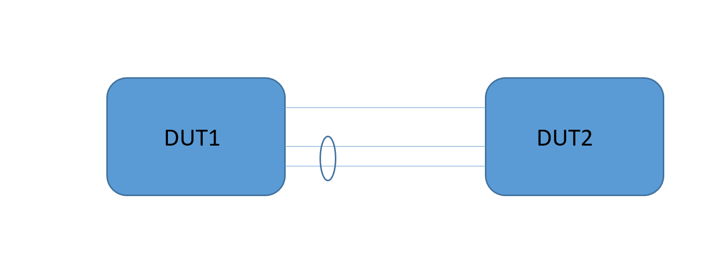

SQA Test Plan

# Vlan AutoState
#  SONiC 3.3.0 Release

Rev 1.9

[TOC]

## Test Plan Revision History

| Rev  | Date       | Author                        | Change Description                                    |
| ---- | ---------- | ----------------------------- | ----------------------------------------------------- |
| 1    | 05/05/2021 | Sooriya Gajendrababu | Initial Version                                       |
|     |            |            |                    |
|      |            |            |                    |
|      |            |            |                    |
|      |            |            |                    |
|      |            |            |                    |

## List of Reviewers

| Function | Name |
| :------: | :--: |
|          |      |

## List of Approvers

| Function | Name | Date Approved |
| :------: | :--: | :-----------: |
|          |      |               |

## Definition/Abbreviation

| **Term** | **Meaning**                    |
| -------- | ------------------------------ |
| VRF      | Virtual routing and forwarding |
| RIF      | Router interface               |
|          |                                |
## Introduction

### Objective 

The main objective of this document is to cover the test cases that will be executed for Vlan AutoState.  Topologies and test cases  for testing the feature will be discussed as part of this document.

### Scope

- Only Vlan level disable/enable of Autostate is covered

### Out of scope

- No support for system level setting of autostate.
- No support autostate exclude command to exclude ports from contributing to the operational state of a VLAN.

## Feature Overview

The operstatus of a VLAN is currently controlled by the operational status of its physical port, portchannel members.

VLAN Operup is required for VXLAN tunnel to get established. There are deployment scenarios which require that the VLAN be declared operationally up irrespective of the operational status of its members. An example is the border leaf where there may be no physical ports/LAG as VLAN members but a VXLAN tunnel is still expected to be established.

This feature supports such deployment scenarios and provides configurability per VLAN to control this behavior.

## 1 Test Focus Areas

### 1.1 Functional Requirements

- Autostate enable shall be supported per VLAN. When autostate is enabled the VLAN operstatus shall be declared as operationally up when there is atleast 1 member of type physical port or LAG which is operationally up, otherwise it shall be declared operationally down.
- Autostate disable shall be supported per VLAN. When autostate is disabled, the VLAN operstatus shall be declared operationally up when the setting is made.
- It shall be possible to switch between the two modes without having to delete the VLAN. The VLAN operstatus shall be according to the new value of the autostate setting.
- The operstatus shall be accessible from one of the Redis DBs.
- The operstatus shall also be reflected in the vlan kernel device.
- By default the VLAN shall be in Autostate enable mode.

## 2 Topologies

## 3 Test Case and objectives

### **3.1 CLI Test Cases**

### 3.1.1 Verify autostate enable/disable config/show CLIs per vlan and check running config

| **Test ID**    | **FtSwVlanAutoCli001**                                       |
| -------------- | :----------------------------------------------------------- |
| **Test Name**  | **Verify autostate enable/disable config/show CLIs per vlan and check running config** |
| **Test Setup** | **Topology1**                                                |
| **Type**       | **CLI**                                                      |
| **Steps**      | 1. Configure vlans100,200 2. Verify CLI to enable/disable vlan autostate works in both klish and click 3.Verify  "show vlan" displays the autostate field as per the configuration 4.Verify running-config displays the autostate config  |

### 3.1.2 Verify all the vlan autostate CLIs using OCI Yang/Rest api's.

| **Test ID**    | **FtSwVlanAutoCli002**                                       |
| -------------- | :----------------------------------------------------------- |
| **Test Name**  | **Verify all the vlan autostate CLIs using OCI Yang/Rest api's.** |
| **Test Setup** | **Topology1**                                                |
| **Type**       | **CLI**                                                      |
| **Steps**      | Verify Vlan autostate enable Rest ocyang URIs.  Verify Vlan autostate status using OCYANG GET URIs Verify Vlan autostate config removal with DELETE URIs  |

### **3.2 Functional Test Cases**

### 3.2.1 To Verify Vlan add/del from physical port with autostate disabled/enabled

| **Test ID**    | **FtSwVlanAutoFunc001**                                      |
| -------------- | :----------------------------------------------------------- |
| **Test Name**  | **To Verify Vlan add/del from physical port with autostate disabled/enabled** |
| **Test Setup** | **Topology1**                                                |
| **Type**       | **Functional**                                               |
| **Steps**      | 1. Configure Vlan100-110 on D1 and add it as member port to physical port 2. Verify all Vlans have autostate enabled by default and vlan state shows Active 3. Remove vlan membership from physical port and verify Vlans go to Inactive state with autostate enabled 4. Disable autostate for all the Vlans and verify Vlans becomes Active  |

### 3.2.2  To Verify Vlan add/del from Portchannel with autostate disabled/enabled

| **Test ID**    | **FtSwVlanAutoFunc002**                                      |
| -------------- | :----------------------------------------------------------- |
| **Test Name**  | **To Verify Vlan add/del from Portchannel with autostate disabled/enabled** |
| **Test Setup** | **Topology1**                                                |
| **Type**       | **Functional**                                               |
<<<<<<< HEAD
| **Steps**      | 1. Configure Vlan100-110 on D1 and add it as member to portchannel port 2. Verify all Vlans have autostate enabled by default and vlan state shows Active
3. Remove vlan membership from physical port and verify Vlans go to Inactive state with autostate enabled
4. Disable autostate for all the Vlans and verify Vlans becomes Active |
=======
| **Steps**      | 1. Configure Vlan100-110 on D1 and add it as member to portchannel port 2. Verify all Vlans have autostate enabled by default and vlan state shows Active 3. Remove vlan membership from physical port and verify Vlans go to Inactive state with autostate enabled 4. Disable autostate for all the Vlans and verify Vlans becomes Active  |
>>>>>>> 07de985... Vlan Autostate Testplan

### 3.2.3  To Verify autostate enable/disable  for range of vlans

| **Test ID**    | **FtSwVlanAutoFunc003**                                      |
| -------------- | :----------------------------------------------------------- |
| **Test Name**  | **To Verify autostate enable/disable  for range of vlans**   |
| **Test Setup** | **Topology1**                                                |
| **Type**       | **Functional5**                                              |
| **Steps**      | 1. Configure range of vlans 200-210 on D1 2.Disable Autostate for all the vlans using range command 3.Verify Autostate gets enabled for all Vlans in the specified range and Vlan is in Active state 4.Verify Vlan not specified in the range has autostate enabled 5.Re-enable Autostate for the all the Vlans using range command and verify Autostate gets enabled and Vlans goes to Inactive state  |

### 3.2.4  To Verify Vlan is Active with Autostate disabled after physical/Portchannel port shutdown

| **Test ID**    | **FtSwVlanAutoFunc004**                                      |
| -------------- | :----------------------------------------------------------- |
| **Test Name**  | **To Verify Vlan is Active with Autostate disabled after physical/Portchannel port shutdown** |
| **Test Setup** | **Topology1**                                                |
| **Type**       | **Functional**                                               |
| **Steps**      | 1. Configure Vlan100-105 on D1 and add it as member of physical port 2.Configure Vlan106-110 on D1  and add it as member of Portchannel port 3. Verify all Vlans have autostate enabled by default and vlan state shows Active 4. Disable Autostate for all the vlans  5.Shutdown physical/Portchannel port and verify Vlans are still Active 6. Enable autostate for all the Vlans and verify Vlans becomes InActive 7.Noshut the physical and Portchannel ports and verify Vlans become Active  |

### 3.2.5  To Verify vlan operational state with ip/ipv6 address configured

| **Test ID**    | **FtSwVlanAutoFunc005**                                      |
| -------------- | :----------------------------------------------------------- |
| **Test Name**  | **To Verify vlan operational state with ip/ipv6 address configured** |
| **Test Setup** | **Topology1**                                                |
| **Type**       | **Functional**                                               |
| **Steps**      | 1. Configure Vlan100 and add it to D1D2P1 and Vlan200 and add it to Portchannel 10 on both duts 2.Configure ip address 12.12.1.1/24 and 12.12.1.2/24 on D1 and D2 respectively on Vlan 100 3.COnfigure ipv6 address 1212::1/64 and 1212::2/64 on D1 and D2 respectively on Vlan 100 4.Configure ip address 12.12.2.1/24 and 12.12.2.2/24 on D1 and D2 respectively on Vlan 200 5.COnfigure ipv6 address 1222::1/64 and 1222::2/64 on D1 and D2 respectively on Vlan 200 6.Verify Vlan operational state "Up"  under "show ip/ipv6 interface" output 7.Disable Vlan Autostate for the Vlans and remove the vlan membership from both physical and Portchannel port 8.Verify Vlan operational state still "Up" under "show ip/ipv6 interface" output with autostate disabled 9.Verify Vlan is in Active state with L3 configs applied  |

### 3.2.6  To Verify routing table and static ARP table with autostate disabled

| **Test ID**    | **FtSwVlanAutoFunc006**                                      |
| -------------- | :----------------------------------------------------------- |
| **Test Name**  | **To Verify routing table and static ARP table with autostate disabled** |
| **Test Setup** | **Topology1**                                                |
| **Type**       | **Functional**                                               |
| **Steps**      | 1. Configure Vlan100 and add it to D1D2P1 and Vlan200 and add it to Portchannel 10 on both duts 2.Configure ip address 12.12.1.1/24 and 1212::1/64 on Vlan 100 3.Configure ip address 12.12.2.1/24 and 1222::1/64 on D1  on Vlan 200 4.Configure static ARP entry for 12.12.1.3 and 1212::3 on VLan 100. 7. Disable Vlan autostate and remove Vlan membership on D1 8.Verify Vlan connected routes are still programmed in routing table and static ARP entries are intact since Vlan interface is operationally UP. 9.Re-enable Autostate feature and verify routes and arp entries are removed 10.Re-add Vlan ports to the ports and verify routes and arp entries relearnt |

### 3.2.7  To Verify disable/enable autostate for a particular vlan does not impact other Vlans

| **Test ID**    | **FtSwVlanAutoFunc007**                                      |
| -------------- | :----------------------------------------------------------- |
| **Test Name**  | **To Verify disable/enable autostate for a particular vlan does not impact other Vlans** |
| **Test Setup** | **Topology1**                                                |
| **Type**       | **Functional**                                               |
| **Steps**      | 1. Configure Vlans 100-110 and disable autostate for all the vlans 2.Verify all the VLans are in Active state 3. Re-enable autostate only for vlan 110 and verify only Vlan 110 becomes Inactive 4.Disable autostate on Vlan 100 and verify VLan 110 becomes Active and it does not impact vlans 100-109 |

### **3.3 Reboot Test Cases**

### 3.3.1 To verify Vlan autostate with config reload  ###

| **Test ID**    | **FtSwVlanAutoReload001**                                    |
| -------------- | :----------------------------------------------------------- |
| **Test Name**  | **To verify Vlan autostate with config reload**              |
| **Test Setup** | **Topology1**                                                |
| **Type**       | **Functional**                                               |
| **Steps**      | 1. Configure Vlan 1001-1110  2.Disbale Autostate for Vlans1001-1005 3.Verify Vlans 1001-1005 in Active state and other vlans in Inactive state 4.Perform config save and do config reload 5.Verify Vlans 1001-1005 in Active state and other vlans in Inactive state after config reload  |

### 3.3.2 To verify Vlan autostate with coldboot

| **Test ID**    | **FtSwVlanAutoReload002**                                    |
| -------------- | :----------------------------------------------------------- |
| **Test Name**  | **To verify Vlan autostate with coldboot**                   |
| **Test Setup** | **Topology1**                                                |
| **Type**       | **Functional**                                               |
| **Steps**      | 1. Configure Vlan 1001-1110  2.Disbale Autostate for Vlans1001-1005 3.Verify Vlans 1001-1005 in Active state and other vlans in Inactive state 4.Perform config save and do coldboot 5.Verify Vlans 1001-1005 in Active state and other vlans in Inactive state after coldboot  |

### 3.3.3 To verify Vlan autostate with swss container restart

| **Test ID**    | **FtSwVlanAutoReload003**                                    |
| -------------- | :----------------------------------------------------------- |
| **Test Name**  | **To verify Vlan autostate with swss container restart**     |
| **Test Setup** | **Topology1**                                                |
| **Type**       | **Functional**                                               |
| **Steps**      | 1. Configure Vlan 1001-1110  2.Disbale Autostate for Vlans1001-1005 3.Verify Vlans 1001-1005 in Active state and other vlans in Inactive state 4.Perform config save and do SWSS container restart 5.Verify Vlans 1001-1005 in Active state and other vlans in Inactive state after SWSS container restart  |

### 3.3.4 To verify Vlan autostate with warmboot

| **Test ID**    | **FtSwVlanAutoReload004**                                    |
| -------------- | :----------------------------------------------------------- |
| **Test Name**  | **To verify Vlan autostate with warmboot**                   |
| **Test Setup** | **Topology1**                                                |
| **Type**       | **Functional**                                               |
| **Steps**      | 1. Configure Vlan 1001-1110  2.Disbale Autostate for Vlans1001-1005 3.Verify Vlans 1001-1005 in Active state and other vlans in Inactive state 4.Perform config save and do warmboot 5.Verify Vlans 1001-1005 in Active state and other vlans in Inactive state after warmboot  |

## **Reference Links**

https://github.com/BRCM-SONIC/sonic_doc_private/blob/f041d90f0ee857f89d07a9d392d78602ae19658d/L2/VLAN/VLANAutoState.md

