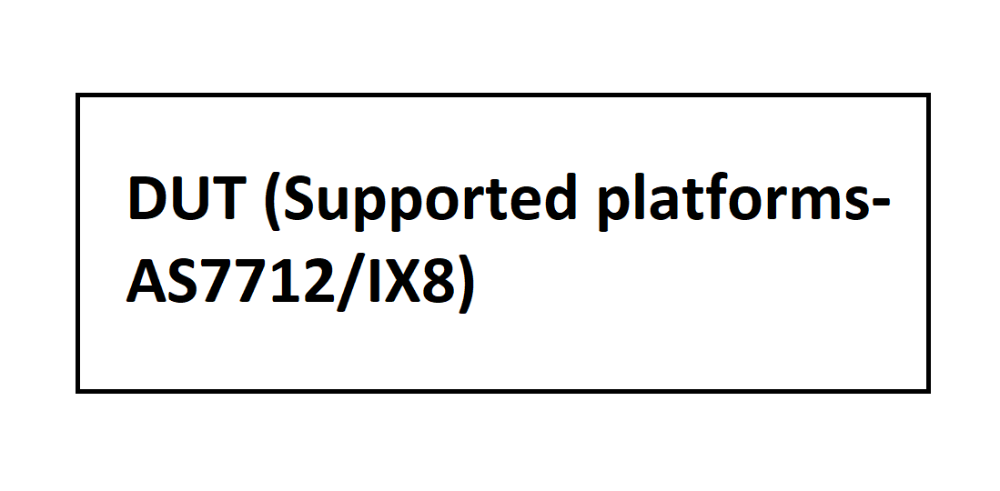

#  SQA Test Plan
# Platform Driver Development Framework (PDDF/PDDF BMC)
#  SONiC 3.0 - Buzznik Release
[TOC]
# Test Plan Revision History
| Rev | Date        | Author                  | Change Description          |
|:---:|:-----------:|:-----------------------:|:---------------------------:|
| 0.1 | 10/21/2019  | Surendra Kumar Vella    | Initial version             |
| 0.2 | 19/11/2019  | Surendra Kumar Vella    | Added PDDF-BMC Support      | 

# List of Reviewers
|  Function 		  | Name  							 |
|:-------------------:|:--------------------------------:|
|	Management		  |	 Giri Babu Sajja				 |
|   Management		  |  Babu Rajaram					 |
|   QA				  |  Anil Kumar Kolkaleti, Chaitanya Kumar Vella		 |
|   Dev				  |  Fuzail, Precy  				 |

# List of Approvers
|  Function    | Name            | Date Approved      |
|:------------:|:---------------:|:------------------:|
| Management   |  Giri Babu Sajja|                    |                  
| Management   |  Babu Rajaram   |                    |

# Definition/Abbreviation
| **Term** | **Meaning**                          |
|:--------:|:-------------------------------------|
| PDDF     | Platform Driver Development Framework|

# Feature Overview
PDDF feature supports Open Config Platform data models in SONiC for the following components:  
SYSEEPROM - base_mac_addr, mac_addr_num, manufacture_date, manufacturer, platform_name, onie_version 
FAN - status, speed, speed_rear, direction 
PSU - status, model, serial, mfr_id, output_voltage, output_current, output_power 
SFP - SFP presence, Vendor Name, Vendor PN, Vendor SN, Length Cable Assembly 

# Test Approach 
###### What will be part of module config?
1. Enabling and disabling PDDF mode.

###### What tests will be covered / clubbed together?
1. Multiple scenarios in checking FAN, PSUs, SFP, LED and thermals via CLI commands are clubbed.

###### What 3rd party tools to be tested for?
NA 

###### In which area’s common warm-boot, cold boot , fast-boot file, corresponding test of the given feature gets covered?
NA

###### List of tests which can not be automated and why?
1. Verify that proper logs with correct FAN ID are showing in syslog and rsyslogs when FAN unit is removed and re-inserted. - Manual intervention needed hence cannot be automated. 
2. Verify that proper logs with correct PSU unit ID is showing in syslog and rsyslog when PSU unit is removed and re-inserted. - Manual intervention needed hence cannot be automated. 

###### What is the plan for covering secondary UI (Ex:- gNMI / KLISH / REST) and how much?
N/A - UI's will be taken care by Spytest Infra.

# 1 Test Focus Areas
  ## 1.1 Functional Testing 
  - CLI 
   
  ## 1.2 Negative Testing 
  -	NA
  
  ## 1.3 Scale and Performance Testing
  - NA

# 2 Topologies
## 2.1 Topology 1

# 3 Test  Case and Objectives
## 3.1 Functional
### 3.2.1 Verify the output of 'show platform syseeprom' command. 
| **Test ID**    | **FtOpSoSyBsOc001**                                         |
| -------------- | :-----------------------------------------------------------|
| **Test Name**  | **Verify the output of 'show platform syseeprom' command.** |
| **Test Setup** | **Topology**                                                |
| **Type**       | **Functional**                                              |
| **Steps**      | **Setup: Standalone DUT Procedure: 1) Set pddf mode using below. "/usr/local/bin/pddf_util.py switch-pddf" 2) Issue the command "show platform syseeprom". 3) If platform supports BMC, issue the same command and verify the output. Expected Behavior: 1) Verify that setting pddf mode is succesful. 2) Verify that "show platform syseeprom" output should be shown with below attributes. base_mac_addr : base mac address from syseeprom mac_addr_num : mac address numbers from syseeprom manufacture_date : manufacture date from syseeprom manufacturer : manufacturer from syseeprom platform_name : platform name from syseeprom onie_version : onie version from syseeprom 3) Verify that output should be same as step-2 but internal command will be called using ipmitool. Note: Check Device HW Spec for the number of FAN, PSU units that are supported for that specific platform. ** |

### 3.2.2 Verify the output of 'show platform fanstatus' command.  
| **Test ID**    | **FtOpSoSyBsOc002**                                          |
| -------------- | :----------------------------------------------------------- |
| **Test Name**  | **Verify the output of 'show platform fanstatus' command.**  |
| **Test Setup** | **Topology**                                                 |
| **Type**       | **Functional**                                               |
| **Steps**      | **Setup: Standalone DUT Procedure: 1) Set pddf mode using below. "/usr/local/bin/pddf_util.py switch-pddf" 2) Issue the command "show platform fanstatus". 3) If platform supports BMC, issue the same command and verify the output. Expected Behavior: 1) Verify that setting pddf mode is succesful. 2) Verify that setting pddf mode is succesful. FAN : Name of the fan status : Operational state of Fan Front Speed : Fan speed in RPM Rear Speed : Rear Fan speed in RPM direction : Fan Airflow direction (Intake/Exhaust) 3) Verify that output should be same as step-2 but internal command will be called using ipmitool. ** |

### 3.2.3 Verify that proper logs with correct FAN ID are showing in syslog and rsyslogs when FAN unit is removed and re-inserted.  
| **Test ID**    | **FtOpSoSyBsOc003**                                          |
| -------------- | :----------------------------------------------------------- |
| **Test Name**  | **Verify that proper logs with correct FAN ID are showing in syslog and rsyslogs when FAN unit is removed and re-inserted.** |
| **Test Setup** | **Topology**                                                 |
| **Type**       | **Functional**                                               |
| **Steps**      | **Setup: Standalone DUT Procedure: 1) Set pddf mode using below. "/usr/local/bin/pddf_util.py switch-pddf" 2) Configure syslog server IP using below command. 'config syslog server add 10.52.45.40' Also, set :514;RSYSLOG_SyslogProtocol23Format in rsyslog file present in /usr/share/sonic/templates/rsyslog.conf.j2  3) Remove the fan unit from the device.  4) If platform supports BMC, issue the same command and verify the output. Expected Behavior: 1) Verify that setting pddf mode is succesful. 2) Verify that configuring syslog server is successful.  3) Verify that the particular fan unit status should be shown as "NOT PRESENT" / "OK".   Verify that proper logs are showing in "show logging" output with correct unit ID.  Also, verify that proper logs are showing in rsyslog with correct unit ID.  4) Verify that output should be same as step-3 but internal command will be called using ipmitool. ** 

### 3.2.4 Verify the output of "psuutil" command.
| **Test ID**    | **FtOpSoSyBsOc004**                                          |
| -------------- | :----------------------------------------------------------- |
| **Test Name**  | **Verify the output of "psuutil" command.** |
| **Test Setup** | **Topology**                                                 |
| **Type**       | **Functional**                                               |
| **Steps**      | **Setup: Standalone DUT Procedure: 1) Set pddf mode using below. "/usr/local/bin/pddf_util.py switch-pddf" 2) Check the output of "psuutil numpsus" command.  3) Check the output of "psuutil status" command.  4) Check the output of "psuutil version" command.  5) If platform supports BMC, issue the same commands and verify the output. Expected Behavior: 1) Verify that setting pddf mode is succesful. 2) Verify that proper output should be returned.  3) Verify that proper output should be returned.  4) Verify that proper output should be returned.  5) Verify that output should be same as step-2,3,4 but internal commands will be called using ipmitool. ** 

### 3.2.5 Verify the output of 'show platform psusummary' command.    
| **Test ID**    | **FtOpSoSyBsOc005**                                          |
| -------------- | :----------------------------------------------------------- |
| **Test Name**  | **Verify the output of 'show platform psusummary' command.** |
| **Test Setup** | **Topology**                                                 |
| **Type**       | **Functional**                                               |
| **Steps**      | **Setup: Standalone DUT Procedure: 1) Set pddf mode using below. "/usr/local/bin/pddf_util.py switch-pddf" 2) Issue the command "show platform psusummary" 3) If platform supports BMC, issue the same command and verify the output. Expected Behavior: 1) Verify that setting pddf mode is succesful. 2) Verify that output should show all psu's details as below: status : Operational state of PSU model : PSU model name serial : PSU serial number mfr_id : Manufacturer Id of PSU output_voltage : Output voltage in mV output_current : Output current in mA output_power : Output power in mW fan_speed : Fan speed in RPM fan_direction : Fan Airflow direction (Intake/Exhaust) 3) Verify that output should be same as step-2 but internal command will be called using ipmitool. ** |

### 3.2.6 Verify that proper logs with correct PSU unit ID is showing in syslog and rsyslog when PSU unit is removed and re-inserted.     
| **Test ID**    | **FtOpSoSyBsOc006**                                          |
| -------------- | :----------------------------------------------------------- |
| **Test Name**  | **Verify that proper logs with correct PSU unit ID is showing in syslog and rsyslog when PSU unit is removed and re-inserted.** |
| **Test Setup** | **Topology**                                                 |
| **Type**       | **Functional**                                               |
| **Steps**      | **Setup: Standalone DUT Procedure: 1) Set pddf mode using below. "/usr/local/bin/pddf_util.py switch-pddf" 2) Configure syslog server IP using below command. 'config syslog server add 10.52.45.40' Also, set :514;RSYSLOG_SyslogProtocol23Format in rsyslog file present in /usr/share/sonic/templates/rsyslog.conf.j2  3) Remove the PSU unit from the device. 4) If platform supports BMC, issue the same command and verify the output. Expected Behavior: 1) Verify that setting pddf mode is succesful. 2) Verify that configuring syslog server is successful.  3) Verify that the particular PSU unit status should be shown as "NOT OK" in "show platform psusummary".  Verify that proper logs are showing in "show logging" output with correct PSU unit ID.  Verify that proper logs are showing in rsyslog with correct PSU unit ID.  4) Verify that output should be same as step-3 but internal command will be called using ipmitool. ** |

### 3.2.7 Verify the output of "decode-syseeprom" command. 
| **Test ID**    | **FtOpSoSyBsOc007**                                         |
| -------------- | :-----------------------------------------------------------|
| **Test Name**  | **Verify the output of "decode-syseeprom" command.** |
| **Test Setup** | **Topology**                                                |
| **Type**       | **Functional**                                              |
| **Steps**      | **Setup: Standalone DUT Procedure: 1) Set pddf mode using below. "/usr/local/bin/pddf_util.py switch-pddf" 2) Issue the command "decode-syseeprom" and check the output.  3) If platform supports BMC, issue the same command and verify the output. Expected Behavior: 1) Verify that setting pddf mode is succesful. 2) Verify that all the attributes showing in "show platform syseeprom" command output should be shown as below. base_mac_addr : base mac address from syseeprom mac_addr_num : mac address numbers from syseeprom manufacture_date : manufacture date from syseeprom manufacturer : manufacturer from syseeprom platform_name : platform name from syseeprom onie_version : onie version from syseeprom  3) Verify that output should be same as step-2 but internal command will be called using ipmitool. ** |

### 3.2.8 Verify the output of "sfputil" command. 
| **Test ID**    | **FtOpSoSyBsOc008**                                         |
| -------------- | :-----------------------------------------------------------|
| **Test Name**  | **Verify the output of "sfputil" command.** |
| **Test Setup** | **Topology**                                                |
| **Type**       | **Functional**                                              |
| **Steps**      | **Setup: Standalone DUT Procedure: 1) Set pddf mode using below. "/usr/local/bin/pddf_util.py switch-pddf" 2) Enable the lpmode on the interface using "sfputil lpmode on Ethernet0". 3) Disable the lpmode on the interface using "sfputil lpmode off Ethernet0". 4) Reset the SFP on the interface using "sfputil reset" command. 5) Check the output of "sfputil show eeprom" command. 6) Check the output of "sfputil show presence" command. 7) Check the output of "sfputil version" command. Expected Behavior: 1) Verify that setting pddf mode is succesful. 2) Verify that lpmode on the interface is enabled using "sfputil show lpmode" command. 3) Verify that lpmode on the interface is disabled using "sfputil show lpmode" command. 4) Verify that reseting SFP transceiver is succesful. 5) Verify that proper output should be returned. 6) Verify that proper output should be returned. 7) Verify that proper output should be returned. ** |

### 3.2.9 Verify the output of "show interface transceiver eeprom" command.
| **Test ID**    | **FtOpSoSyBsOc009**                                         |
| -------------- | :-----------------------------------------------------------|
| **Test Name**  | **Verify the output of "show interface transceiver eeprom" command.** |
| **Test Setup** | **Topology**                                                |
| **Type**       | **Functional**                                              |
| **Steps**      | **Setup: Standalone DUT Procedure: 1) Set pddf mode using below. "/usr/local/bin/pddf_util.py switch-pddf" 2) Check the output of "show interface transceiver eeprom" command. Expected Behavior: 1) Verify that setting pddf mode is succesful. 2) Verify that EEPROM should be detected on the transceiver connected interfaces. Also, verify that attributes such as Length Cable Assembly(m), Vendor Name, Vendor PN, Vendor REV, Vendor SN etc will be shown in the output. ** |

### 3.2.10 Verify the output of "show interface transceiver presence" command.
| **Test ID**    | **FtOpSoSyBsOc010**                                         |
| -------------- | :-----------------------------------------------------------|
| **Test Name**  | **Verify the output of "show interface transceiver presence" command.** |
| **Test Setup** | **Topology**                                                |
| **Type**       | **Functional**                                              |
| **Steps**      | **Setup: Standalone DUT Procedure: 1) Set pddf mode using below. "/usr/local/bin/pddf_util.py switch-pddf" 2) Check the output of "show interface transceiver presence" command. Expected Behavior: 1) Verify that setting pddf mode is succesful. 2) Verify that on transceiver connected interface, it should be shown as "present". ** |

### 3.2.11 Verify the output of "show reboot-cause" command.
| **Test ID**    | **FtOpSoSyBsOc011**                                         |
| -------------- | :-----------------------------------------------------------|
| **Test Name**  | **Verify the output of "show reboot-cause" command.** |
| **Test Setup** | **Topology**                                                |
| **Type**       | **Functional**                                              |
| **Steps**      | **Setup: Standalone DUT Procedure: 1) Set pddf mode using below. "/usr/local/bin/pddf_util.py switch-pddf" 2) Reboot/fast-reboot/warm-reboot the device and check the output of "show reboot-cause". 3) Power cycle the device and check the output of "show reboot-cause". 4) If platform supports BMC, issue the same command and verify the output. Expected Behavior: 1) Verify that setting pddf mode is succesful. 2) Verify that output should show that user issued "Reboot/fast-reboot/warm-reboot" as below format. User issued 'reboot' command [User: admin, Time: Thu Oct 31 06:47:56 UTC 2019] 3) Verify that output should be "Unexpected reboot". 4) Verify that output should be same as step-3 but internal command will be called using ipmitool. ** |

### 3.2.12 Verify the output of "show environment" command.
| **Test ID**    | **FtOpSoSyBsOc012**                                         |
| -------------- | :-----------------------------------------------------------|
| **Test Name**  | **Verify the output of "show environment" command.** |
| **Test Setup** | **Topology**                                                |
| **Type**       | **Functional**                                              |
| **Steps**      | **Setup: Standalone DUT Procedure: 1) Set pddf mode using below. "/usr/local/bin/pddf_util.py switch-pddf" 2) Issue the command "show environment" and check the output. 3) If platform supports BMC, issue the same command and verify the output. Expected Behavior: 1) Verify that setting pddf mode is succesful. 2) Verify that proper output should be returned. 3) Verify that output should be same as step-2 but internal command will be called using ipmitool. Note: "show environment" output will differ from platform to platform as it deals with different sensors which differs from platform to platform. This output will be different between pddf and non-pddf modes. ** |

### 3.2.13 Verify the output of "pddf_psuutil" command.
| **Test ID**    | **FtOpSoSyBsOc013**                                         |
| -------------- | :-----------------------------------------------------------|
| **Test Name**  | **Verify the output of "pddf_psuutil" command.** |
| **Test Setup** | **Topology**                                                |
| **Type**       | **Functional**                                              |
| **Steps**      | **Setup: Standalone DUT Procedure: 1) Set pddf mode using below. "/usr/local/bin/pddf_util.py switch-pddf" 2) Check the output of "pddf_psuutil numpsus" command. 3) Check the output of "pddf_psuutil status" command. 4) Check the output of "pddf_psuutil mfrinfo" command. 5) Check the output of "pddf_psuutil seninfo" command. 6) Check the output of "pddf_psuutil version" command. 7) If platform supports BMC, issue the same commands and verify the output. Expected Behavior: 1) Verify that setting pddf mode is succesful. 2) Verify that correct number of PSU units present in the DUT should be shown. 3) Verify that one or more PSU units status should be "OK". 4) Verify that correct manufacturer info should be returned. 5) Verify that proper output should be returned. 6) Verify that proper output should be returned. 7) Verify that output should be same as step-2,3,4,5,6 but internal commands will be called using ipmitool.** |

### 3.2.14 Verify the output of "pddf_fanutil" command.
| **Test ID**    | **FtOpSoSyBsOc014**                                         |
| -------------- | :-----------------------------------------------------------|
| **Test Name**  | **Verify the output of "pddf_fanutil" command.** |
| **Test Setup** | **Topology**                                                |
| **Type**       | **Functional**                                              |
| **Steps**      | **Setup: Standalone DUT Procedure: 1) Set pddf mode using below. "/usr/local/bin/pddf_util.py switch-pddf" 2) Check the output of "pddf_fanutil direction" command. 3) Check the output of "pddf_fanutil getspeed" command. 4) Check the output of "pddf_fanutil numfans" command. 5) Check the output of "pddf_fanutil setspeed" command. 6) Check the output of "pddf_fanutil status" command. 7) Check the output of "pddf_fanutil version" command.  8) If platform supports BMC, issue the same commands and verify the output. Expected Behavior: 1) Verify that setting pddf mode is succesful. 2) Verify that fans direction should be correct. 3) Verify that proper output should be returned. 4) Verify that total number of fans present should be returned. 5) Verify that set fan speed should be returned in "pddf_fanutil getspeed" command. 6) Verify that proper output should be returned. 7) Verify that proper output should be returned.  8) Verify that output should be same as step-2,3,4,5,6,7 but internal commands will be called using ipmitool. ** |

### 3.2.15 Verify the output of "pddf_ledutil" command.
| **Test ID**    | **FtOpSoSyBsOc015**                                         |
| -------------- | :-----------------------------------------------------------|
| **Test Name**  | **Verify the output of "pddf_ledutil" command.** |
| **Test Setup** | **Topology**                                                |
| **Type**       | **Functional**                                              |
| **Steps**      | **Setup: Standalone DUT Procedure: 1) Set pddf mode using below. "/usr/local/bin/pddf_util.py switch-pddf" 2) Check the output of "pddf_ledutil getstatusled" command. 3) Check the output of "pddf_ledutil setstatusled" command. 4) Check the output of "pddf_ledutil version" command. Expected Behavior: 1) Verify that setting pddf mode is succesful. 2) Verify that proper output should be returned. 3) Verify that proper output should be returned. 4) Verify that proper output should be returned. ** |

### 3.2.16 Verify the output of "pddf_thermalutil" command.
| **Test ID**    | **FtOpSoSyBsOc016**                                         |
| -------------- | :-----------------------------------------------------------|
| **Test Name**  | **Verify the output of "pddf_thermalutil" command.** |
| **Test Setup** | **Topology**                                                |
| **Type**       | **Functional**                                              |
| **Steps**      | **Setup: Standalone DUT Procedure: 1) Set pddf mode using below. "/usr/local/bin/pddf_util.py switch-pddf" 2) Check the output of "pddf_thermalutil gettemp" command. 3) Check the output of "pddf_thermalutil numthermals" command. 4) Check the output of "pddf_thermalutil version" command. 5) If platform supports BMC, issue the same commands and verify the output. Expected Behavior: 1) Verify that setting pddf mode is succesful. 2) Verify that proper output should be returned. 3) Verify that proper output should be returned. 4) Verify that proper output should be returned.  5) Verify that output should be same as step-2,3,4 but internal commands will be called using ipmitool.** |

### 3.2.17 Verify that system should be stable after executing all PDDF debug commands.
| **Test ID**    | **FtOpSoSyBsOc017**                                         |
| -------------- | :-----------------------------------------------------------|
| **Test Name**  | **Verify that system should be stable after executing all PDDF debug commands.** |
| **Test Setup** | **Topology**                                                |
| **Type**       | **Functional**                                              |
| **Steps**      | **Setup: Standalone DUT Procedure: 1) Set pddf mode using below. "/usr/local/bin/pddf_util.py switch-pddf" 2) Execute all PDDF debug commands listed below. lsmod l grep -i pddf systemctl l grep -i pddf pddf_fanutil debug dump_sysfs pddf_psuutil debug dump_sysfs pddf_ledutil debug dump_sysfs pddf_sfputil debug dump_sysfs pddf_eepromutil debug dump_sysfs Expected Behavior: 1) Verify that setting pddf mode is succesful. 2) Verify that system should stable and no unwanted logs (or) crash should be observed after executing all PDDF debug commands. ** |

## 3.3 Negative
NA

#### 3.4.2  Cold reboot
NA

#### 3.4.3 Config reload
NA

#### 3.4.4  Docker restart
NA

#### 3.4.5  Upgrade
NA

## 3.5 Management

N/A - UI's will be taken care by Spytest Infra.

#### 3.5.3 REST API
NA

#### 3.5.4 KLISH CLI
NA

#### 3.5.5 IS-CLI
NA

## 3.6 Stress,Scale and Performance
NA

## 4 Reference Links
http://gerrit-lvn-07.lvn.broadcom.net:8083/plugins/gitiles/sonic/documents/+/refs/changes/56/12656/11/platforms/pddf/brcm_pal_pddf.md 
http://gerrit-lvn-07.lvn.broadcom.net:8083/c/sonic/documents/+/10626/3/platforms/open_config_platform_support_sonic.md 