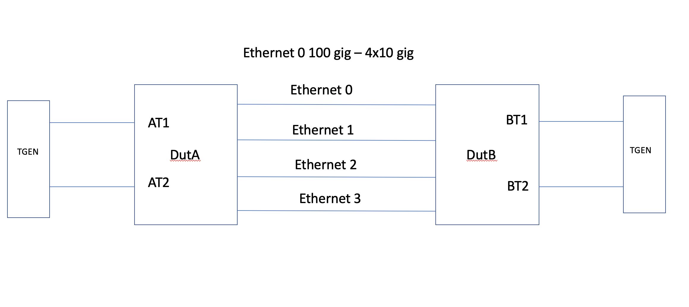

SQA Test Plan

# Dynamic Port Breakout
#  SONiC 3.1.0 Project and Buzznik-Plus Release

Rev 1.9

[TOC]

## Test Plan Revision History

| Rev  | Date       | Author                        | Change Description                                    |
| ---- | ---------- | ----------------------------- | ----------------------------------------------------- |
| 1    | 05/15/2020 | Naveen Nag     | Initial Version                                       |
|     |            |            |                    |
|      |            |            |                    |
|      |            |            |                    |
|      |            |            |                    |
|      |            |            |                    |

## List of Reviewers

| Function | Name |
| :------: | :--: |
|          |      |

## List of Approvers

| Function | Name | Date Approved |
| :------: | :--: | :-----------: |
|          |      |               |

## Definition/Abbreviation

| **Term** | **Meaning**                                         |
| -------- | ----------------------------------------------------|
| DPB      | Dynamic Port Breakout                               |
|CONFIG_DB | SONiC configuration database in Redis               |

## Introduction

### Objective 

The main objective of this document is to cover the test cases that will focus on running various routing protocols before and after breaking the ports. To make sure the QOS policies are same after breaking the port and no traffic drop should be seen.

### Scope

Only generic DPB test cases will be covered in this test plan.

### Out of scope

* This test plan does not cover all the legacy protocols. 
* Test cases in regression will be run after breakout to make sure all the legacy features are working fine 
* Only Klish based CLI is supported in this release.

## Feature Overview

Ports can be broken out to different sub-ports and speeds with subset of lanes in most HW today. Currently in SONiC, the port breakouts are only made possible by hard-coding the HW profiles that are loaded at boot-up time. If a different port breakout config is desired, a new image must be loaded, or at least services need to be restarted which impacts the traffic on the box (and on irrelevant ports). The DPB will address these issues, ie

- No system or config reload required,

- No traffic impact on other ports which are not subject to DPB configuration, and

- Users have option to choose a different break out mode

A high-level view of the operation:

1. DPB is initiated through certain management interface (SONiC management framework CLI,  REST)

2. Management framework infrastructure derives port dependencies from the OC YANG model, and updates the CONFIG DB. (e.g. VLAN member removal followed by port delete, and followed by new port addition on impacted ports).

3. Based on the CONFIG_DB update (ports delete followed by create), back-end deletes ports and all its dependencies (configurations and dynamic dependencies). Back-end will then create new ports in default state. Here, "back-end" primarily refers to SWSS and syncd components (orchagent, SAI etc). System has other dependency as well like protocols, platform services like xvrd, led, pmon, etc. For some of the components these DB triggers are "no op".

This document is complementary to the community DPB HLD. Link to the community HLD is [here](https://github.com/Azure/SONiC/blob/439944c120d59edf7f62ed28a902b1a3c07a35f8/doc/dynamic-port-breakout/sonic-dynamic-port-breakout-HLD.md). 

## 1 Test Focus Areas

### 1.1 Functional Requirements

- Only allow valid break-out modes. This is achieved by a platform-specific file called "platform.json" that spells out port and lane capabilities and constraints.  
- Users should be able to migrate from a previous Broadcom sonic release. Migration scripts allow for this seamless transition. 
- If a given platform does not have the platform.json file, the DPB CLI shall error out. The system falls back to previous release behavior.
- All of the configuration dependency checking logic for a deleted port is implemented in the SONiC Management Framework. In order for this logic work correctly, the following must be true.
	- All of the affected configuration is in the CONFIG_DB.
	- A matching OC YANG file is available.
	- Where necessary (complex cases only), custom override functions are provided to delete the configuration.
- DPB interface (REST, CLI command) is supported in platform open-config YANG. On the YANG model it is update request.
- DPB operation result in port deletion and creation events. The ports must be shutdown before deletion. New ports created as part of "create" operation will be in the default state and configuration. The user need to take care of new desired configuration and any topology changes. 
- DBP configuration dependency checking is implemented in the SONiC Management Framework in broadcom-sonic builds. Community builds have a separate mechanism that is not used in Broadcom builds. However both methods depend upon SONiC YANG files, and this is required to be common between the two approaches. 
- "config reload" functionality shall remain available to users. Users shall be able to apply port breakout configuration directly in config DB and issue "config reload" (without issuing DPB CLI). It is not dynamic, existing configuration gets cleared and services get restarted.

## 2 Topologies

Topology

## 3 Test Case and objectives

### **3.1 CLI Test Cases**

### 3.1.1 Verify the invalid interface name and speeds are rejected 

| **Test ID**    | **FtOpSoRoDpb311**                                |
| -------------- | :----------------------------------------------------------- |
| **Test Name**  | **Verify the invalid interface name and speeds are rejected ** |
| **Test Setup** | **Topology1**                                                |
| **Type**       | **CLI**                                                      |
| **Steps**      | 1) Using the breakout cli try breaking an invalid port.   2) Error should be thrown since the port is invalid  Similarly try breaking for an invalid speed, it should be rejected   Try breaking the port with the same speed again and again  No error should be shown since the speed is same   Try breaking the port from 1x100 to 4x10 to 4x25, the command should be success  User should be able to break the port if the port and speeds are valid |

### 3.1.2 Verify  the breakout  CLIs using OCI Yang/Rest api's.

| **Test ID**    | **FtOpSoRoDpb312**                                |
| -------------- | :----------------------------------------------------------- |
| **Test Name**  | **Verify all the DPB CLIs using OCI Yang/Rest api's.**       |
| **Test Setup** | **Topology1**                                                |
| **Type**       | **CLI**                                                      |
| **Steps**      | Similar to the previous test case verify all combination using rest api.   Similar to the cli, suitable error should be thrown if the interface or speed is invalid   |

### **3.2 Functional Test Cases**

### **3.2.1 Verifying DPB with various features before and after breaking the port** ###

### 3.2.1.1 To verify the Vlan flooding before and after the breakout 

| **Test ID**    | FtOpSoRoDpb3211                                              |
| -------------- | :----------------------------------------------------------- |
| **Test Name**  | To verify the Vlan flooding before and after the breakout    |
| **Test Setup** | **Topology1**                                                |
| **Type**       | **Functional**                                               |
| **Steps**      | 1) Configure vlan 100 and assign the 2 100 gig ports between the duts, make sure the ports are assigned to vlan 100  2) From H1, send a traffic with vlan 100  3) Verify the traffic is being flooded on both 100 gig links and getting looped   4) With the traffic going on, break the first 100 gig into 4x10 dynamically   5) Make sure the ports are broken out as expected but traffic is getting flooded only on the first port since the config is erased from the first port   6)Now assign all the 2 ports from both the nodes as part of vlan and verify the traffic is getting looped again   7) Verify the traffic is getting flooded over these broken ports as well    8) Similarly unbreak the port to 100 gig and verify the vlan flooding is working as before   9) Once both the 100G native ports are broken out and traffic is getting looped, enable PVST and make sure the traffic loop stops and spanning tree states are as expected.  |

### 3.2.1.2 To verify the Vlan switching before and after the breakout 

| **Test ID**    | **FtOpSoRoDpb3212**                                |
| -------------- | :----------------------------------------------------------- |
| **Test Name**  | To verify the Vlan switching before and after the breakout            |
| **Test Setup** | **Topology1**                                                |
| **Type**       | **Functional**                                               |
| **Steps**      | 1) Configure vlan 100 and assign the 2 100 gig ports between the duts, make sure the ports are assigned to vlan 100  2) From H1, send a traffic with vlan 100  3) Verify the traffic is being flooded on both 100 gig links   4) Start the traffic on H2 as well, now the mac should be learnt and traffic should start switching insteading of flooding on the first port   6) With the traffic going on, break the first 100 gig into 4x10 dynamically   5) Make sure the ports are broken out as expected and verify the ifindex of the interfaces, it should be different for all the broken out interfaces   7) verify the traffic is flooded again since the port on which the mac was learnt is not part of vlan   8) Now assign the 2 ports from both the nodes as part of vlan.   9) Verify the traffic is getting switched again due to bi-directional traffic    10) Similarly unbreak the port to 100 gig and verify the vlan switching is working as before. |

### 3.2.1.3 To verify the static Mac and LLDP before and after the breakout 

| **Test ID**    | **FtOpSoRoDpb3213**                                |
| -------------- | :----------------------------------------------------------- |
| **Test Name**  | To verify the static Mac and LLDP before and after the breakout            |
| **Test Setup** | **Topology1**                                                |
| **Type**       | **Functional**                                               |
| **Steps**      | 1) Configure vlan 100 and assign the 2 100 gig ports between the duts, make sure the ports are assigned to vlan 100, verify the lldp neighbors , 2 entries should be present for the native 100 gig ports   2) From H1, send a traffic with vlan 100  3) Verify the traffic is being flooded on both 100 gig links   4) Add a static mac pointing to the port on the node-1 and verify the traffic now shouldn't get flooded on both the ports   5)  Start the traffic on H2 as well, now the mac should be learnt and traffic should start switching insteading of flooding on the first port   6) With the traffic going on, disable LLDP on the port and break the first 100 gig into 4x10 dynamically on both the nodes  5) Make sure the ports are broken out as expected   7) Verify the static mac entry should be erased    8) Verify the lldp neighbor, there should be 4 entries after the breakout, lldp should be enabled on the breakout port   9) Verify the traffic is getting flooded since the static mac is missing   10) Add back the static mac entry and verify the traffic is being switched   11) Similarly unbreak the port to 100 gig and verify the mac entry and lldp neighbor table. |

### 3.2.1.4 To verify the IP routing through Static route and ping is working before and after the breakout 

| **Test ID**    | **FtOpSoRoDpb3214**                                |
| -------------- | :----------------------------------------------------------- |
| **Test Name**  | To verify the IP routing through Static route and ping is working before and after the breakout |
| **Test Setup** | **Topology1**                                                |
| **Type**       | **Functional**                                               |
| **Steps**      | 1) Configure port-channel(LACP) and add the 2 native 100 gig ports part of it between the nodes  2) Assign an /31 ip address on both the nodes   3) Similarly configure IP address on H1 & H2 as well   4) Add a static route on both the nodes such that both nodes should be able to reach H1 & H2   6) Have a continous Ping from H1 to H2 and make sure the ping is working fine   5) Now break the 100 gig port into 4x10 or 4x25   7) Verify the config's will be erased on these ports   8) Assign the ip address back after assigning the breakout ports to the port-channel   9) Verify the ping is working fine now once the reachability is present and also execute show interface output to make sure the speed is set right   10) Similarly break the ports to 4x25 and back to 1x100 and verify the ping should work fine, also verify the show running config, it should display the right speed along with the interface speed 11) Now change the LACP to static LAG make sure the interface is up and do the breakout and unbreakout of the port and make sure the ping works fine after bringup the interface|

### 3.2.1.5 To verify the IPV6 routing through Static route and ping is working before and after the breakout 

| **Test ID**    | **FtOpSoRoDpb3215**                                |
| -------------- | :----------------------------------------------------------- |
| **Test Name**  | To verify the IPV6 routing through Static route and ping is working before and after the breakout |
| **Test Setup** | **Topology1**                                                |
| **Type**       | **Functional**                                               |
| **Steps**      | 1) Configure port-channel and add the native 100 gig ports part of it between the nodes  2) Assign an /127 ip address on both the nodes   3) Similarly configure IPV6 address on H1 & H2 as well   4) Add a static route on both the nodes such that both nodes should be able to reach H1 & H2   6) Have a continous Ping from H1 to H2 and make sure the ping is working fine   5) Now break the 100 gig port into 4x10 or 4x25   7) Verify the config's will be erased on these ports   8) Assign the ip address back after assigning the breakout ports to the port-channel   9) Verify the ping is working fine now once the reachability is present    10) Similarly break the ports to 4x25 and back to 1x100 and verify the ping should work fine. |

### 3.2.1.6 To verify the IP Unummbered using OSPF  before and after the breakout 

| **Test ID**    | **FtOpSoRoDpb3216**                                |
| -------------- | :----------------------------------------------------------- |
| **Test Name**  | To verify the IP Unummbered using OSPF  before and after the breakout  |
| **Test Setup** | **Topology1**                                                |
| **Type**       | **Functional**                                               |
| **Steps**      | 1) Configure a loop back inteface on both the nodes and borrow the ip address to the physical interface between the nodes   2) Configure OSPF session and make sure the session comes up     3) Advertise the routes such that both nodes should be able to reach H1 & H2   4) Start the traffic from H1 to H2 and make sure the ping is working fine   5) Now break the 100 gig port into 4x10 or 4x25   6) Verify the config's will be erased on these ports and also verify the interface counters will be reset after the breakout   7) Assign the unnumbered address back on the breakout ports   8) Verify the ping is working fine  and traffic is being received as expected   9) Similarly break the ports to 4x25 and back to 1x100 and verify the ping & traffic should work fine. |

### 3.2.1.7 To verify the BGP 5549 session  before and after the breakout 

| **Test ID**    | **FtOpSoRoDpb3217**                                |
| -------------- | :----------------------------------------------------------- |
| **Test Name**  | To verify the BGP 5549 session  before and after the breakout  |
| **Test Setup** | **Topology1**                                                |
| **Type**       | **Functional**                                               |
| **Steps**      | 1) Configure the interface between the nodes to use link-local address    2) Configure BGP session and make sure the session comes up using link local address(5549)    3) Advertise the routes such that both nodes should be able to reach H1 & H2   4) Start the traffic from H1 to H2 and make sure the ping is working fine   5) Now break the 100 gig port into 4x10 or 4x25   6) Verify the config's will be erased on these ports   7) Configure use-linklocal address back on the breakout ports   8) Verify the ping is working fine  and traffic is being received as expected   9) Similarly break the ports to 4x25 and back to 1x100 and verify the ping & traffic should work fine. |

### 3.2.1.8 To verify the BGP with BFD with route leaking from user vrf  before and after the breakout 

| **Test ID**    | **FtOpSoRoDpb3218**                                |
| -------------- | :----------------------------------------------------------- |
| **Test Name**  |  To verify the BGP with BFD with route leaking from user vrf  before and after the breakout   |
| **Test Setup** | **Topology1**                                                |
| **Type**       | **Functional**                                               |
| **Steps**      | 1) Configure the Ipv4 interface between the nodes on a native 100 gig ports   2) Configure BGP session & enable BFD on top of it   3) Advertise the routes such that both nodes should be able to reach H1 & H2   4) Start the traffic from H1 to H2 and make sure the ping is working fine   5) On the second native interface, break the port and assign the interface as part of Vrf red.   6) Leak the routes from Vrf red to default vrf in the BGP and make sure ping is working fine   7)  Now break the 100 gig port into 4x10 or 4x25   6) Verify the config's will be erased on these ports   7) Configure the IP address back and make sure the BGP session is up and also BFD protocol   8) Routes should be leaked from vrf red and verify the ping is working fine  and traffic is being received as expected   9) Unbreak the second port which was part of Vrf red, the routes should be erased since configs are gone.  10)Assign back the interface to vrf red and make sure the route leaking is working fine by checking the ping |

### 3.2.1.9 To verify the BGP Evpn and Vxlan tunnel comes up before and after the breakout 

| **Test ID**    | **FtOpSoRoDpb3219**                                |
| -------------- | :----------------------------------------------------------- |
| **Test Name**  |  To verify the BGP Evpn and Vxlan tunnel comes up before and after the breakout   |
| **Test Setup** | **Topology1**                                                |
| **Type**       | **Functional**                                               |
| **Steps**      | 1) Configure the Ipv4 interface between the nodes on a native 100 gig ports   2) Configure BGP session & enable evpn address family and bring up the neighbors   3) Configure vxlan interface, map the vlan 100 to vni 100 and bring up the vxlan tunnel     4) Once the vxlan tunnel is up, advertise few L2 & L3 routes   5) Make sure the routes are being received and present in the routing table   6) Have traffic running from edge ports   7)  Now break the 100 gig port into 4x10 or 4x25   6) Verify the config's will be erased on these ports   7) Configure the IP address back and make sure the BGP session is up and vxlan tunnel comes up   8) Routes should be added to the routing table as before and traffic should start flowing   9) Unbreak the port back to native 100G and verify the behavior.  10)Make sure after configuring the BGP Evpn session, the vxlan tunnel comes up |

### 3.2.1.10 To verify the port mirroring is working before and after the breakout 

| **Test ID**    | **FtOpSoRoDpb32110**                                |
| -------------- | :----------------------------------------------------------- |
| **Test Name**  | To verify the port mirroring is working before and after the breakout            |
| **Test Setup** | **Topology1**                                                |
| **Type**       | **Functional**                                               |
| **Steps**      | 1) Configure vlan 100 and assign the 2 100 gig ports between the duts, make sure the ports are assigned to vlan 100  2) From H1, send a traffic with vlan 100  3) Verify the traffic is being flooded on both 100 gig links   4) Add a mirroring session with source as H1 and destination as the link between the nodes   5) Verify the mirroring is working fine and packets are mirrored   6) With the traffic going on, break the first 100 gig into 4x10 dynamically   5) Make sure the ports are broken out as expected and mirroring session should be disable since the port has been broken out   6)Now assign all the 2 ports from both the nodes as part of vlan and enable the mirroring session back   7) Verify the traffic is getting flooded over these broken ports as well and mirror session is able to mirror the packets as before   8) Similarly unbreak the port to 100 gig and verify the vlan flooding is working as before. |

### 3.2.1.11  To verify the PBR functionality before and after the breakout  

| **Test ID**    | **FtOpSoRoDpb32111 **                                |
| -------------- | :----------------------------------------------------------- |
| **Test Name**  | To verify the PBR before and after the breakout           |
| **Test Setup** | **Topology1**                                                |
| **Type**       | **Functional**                                               |
| **Steps**      | 1) Both Ipv4 & Ipv6 traffic will be verified in these subsequent test cases    2) The native interfaces 100 gig between the nodes are assigned /31 address & /127 address  3) Assign 10.1.1.12/31 on AT1 & 1001::12/127 on AT2   4) Similarly configure 20.1.1.12/31 & 2001::12/127 on BT1 & BT2 respectively   5) Enable OSPF protocol on all the interfaces and make sure for 20.1.1.12 there are 3 next hops   6)Start the bi-directional traffic and make sure it is going via one link .   7) Create a Ipv4 & Ipv6 accesslist to match the source & destination address   8) Bind it to a classifier and then apply it on a policy with next hop pointing on the Portchannel interface   9)Policy should have 2 stanza one each for Ipv4 & Ipv6   10) Apply this policy on the switch level   11) Now both traffic should reach the destination via Portchannel   12) Shutdown the portchannel interface   13) Now the traffic should take the next interface on which the priority is more   14) Break the native 100 gig into 4x10 and verify the configs are erased   15) configure back the PBR on the breakout interface similar to native port and make sure the policy is applied   15)  Verify the next hop specified in the PBR should be taken by the traffic   16) Remove the policy from the switch level and apply it on the interface   17) Verify the traffic takes the specified path |

### 3.2.1.12 To verify the functionality of QOS scheduling with scheduling type as "DWRR"  before and after the breakout 

| **Test ID**    | **FtOpSoRoDpb32112**                                |
| -------------- | :----------------------------------------------------------- |
| **Test Name**  | To verify the functionality of QOS scheduling with scheduling type as "DWRR"  before and after the breakout   |
| **Test Setup** | **Topology1**                                                |
| **Type**       | **Functional**                                               |
| **Steps**      | 1) Configure the STC connected ports as tagged members of VLAN100   2) Configure SCHEDULER type as "DWRR" and "weight" as 80 for Queue-1 and 20 for queue-2 of an egress port between the nodes   3) Send traffic from AT1 & AT2 towards Ethernet2 with priorities-1,2 respectively at line rate.   4) Verify that priorities-1, priorities-2 traffics are egressed from the egress port as per the configured weights   5) Now break the 100 gig port into 4x10 or 4x25   6) Verify the config's will be erased on these ports   7) Configure the scheduler back as before   8) Verify the traffic are egresses as before with the weight configured |

### 3.2.1.13 To verify the RPVST is working before and after the breakout 

| **Test ID**    | **FtOpSoRoDpb32113**                                |
| -------------- | :----------------------------------------------------------- |
| **Test Name**  | To verify the RPVST is working before and after the breakout            |
| **Test Setup** | **Topology1**                                                |
| **Type**       | **Functional**                                               |
| **Steps**      | 1) Configure vlan 100 and assign the 2 100 gig ports between the duts, make sure the ports are assigned to vlan 100  2) From H1, send a traffic with vlan 100  3) Verify the traffic is being flooded on both 100 gig links   4) Enable RPVST on both the nodes, verify the root bridge and port states are as expected   5) Verify the traffic is switching on the root port only   6) With the traffic going on, break the first 100 gig into 4x10 dynamically   5) Make sure the ports are broken out as expected and spanning tree session should be disable since the port has been broken out , verify the path cost of the port, it should change as per the speed   6) The second 100 gig port should still continue to participate in the spanning tree and now it should be the root port, verify the path cost it should be based on the interface speed. Now assign the 4 broken  ports from both the nodes as part of vlan and enable the spanning tree back   7) Verify the ports are participating in the spanning tree and only one of the port should be root port and rest should be blocked to avoid the flooding   8) Similarly unbreak the port to 100 gig and verify the spanning tree is working as before. |

### 3.2.1.14 To verify the UDLD is working before and after the breakout 

| **Test ID**    | **FtOpSoRoDpb32114**                                |
| -------------- | :----------------------------------------------------------- |
| **Test Name**  | To verify the UDLD is working before and after the breakout            |
| **Test Setup** | **Topology1**                                                |
| **Type**       | **Functional**                                               |
| **Steps**      | 1) On the native 100 gig port enable UDLD and make sure the session is up    2) Verify the show running and make sure UDLD is enabled on the port  3) Break the port into 4x10 or 4x25 and bring up the ports   4) Verify the UDLD is still enabled globally but on the interface it should be disabled   5) Now enable the UDLD on the interface as well and verify the session comes up   6)Verify the session is up on both the sides.   7) Do a unbreakout of the port back to native 100 gig and verify the UDLD session on the interface is deleted   8) Enable back the session and make sure the session comes up   9)Repeat the same using aggressive mode and verify the same |

### 3.2.1.15 To verify the SNMP walk on an interface before and after the breakout 

| **Test ID**    | **FtOpSoRoDpb32115**                                |
| -------------- | :----------------------------------------------------------- |
| **Test Name**  | To verify the SNMP walk on an interface before and after the breakout  |
| **Test Setup** | **Topology1**                                                |
| **Type**       | **Functional**                                               |
| **Steps**      | 1) On the native 100 gig port bring up the port and make sure the port is up   2) Issue an SNMP walk and make sure all the parameters are received   3) Break the port into 4x10 or 4x25 and bring up the ports   4) Do the SNMP walk again on the broken out port   5) Verify all the parameters received and verify it is same as in show interface output   6) Do a unbreakout of the port back to native 100 gig   7) Do a SNMP walk again and verify the same   9)Along with SNMP walk, verify SNMP trap and log if supported |

### 3.2.1.16 To verify the SFLOW on an interface before and after the breakout 

| **Test ID**    | **FtOpSoRoDpb32116**                                |
| -------------- | :----------------------------------------------------------- |
| **Test Name**  | To verify the SFLOW on an interface before and after the breakout        |
| **Test Setup** | **Topology1**                                                |
| **Type**       | **Functional**                                               |
| **Steps**      | 1) On the native 100 gig port bring up the port and make sure the port is up   2) Enable Sflow globally and configure polling interval, collector and agent-id to the native 100 gig interface   3) On the interface, enable Sflow and verify the samples are collected at the interval as configured, now break the port into 4x10 or 4x25 and bring up the ports   4) Verify the sflow under the interface is erased whereas globally the sflow config should be present   5) On the global sflow config, verifgy the agent-id which was set to the native 100 gig interface is erased since the interface is now broken out   6) COnfigure back the agent id and enable the sflow on the broken out interface   7) Verify the sflow samples are collected as expected   9)Do the unbreakout again and verify the same |

### **3.3 Reboot Test Cases**

### 3.3.1 To verify the DPB functionality with config reload  ###

| **Test ID**    | FtOpSoRoDpb331                                               |
| -------------- | :----------------------------------------------------------- |
| **Test Name**  | To verify the DPB functionality with config reload           |
| **Test Setup** | **Topology1**                                                |
| **Type**       | **Functional**                                               |
| **Steps**      | 1) Break the native 100 gig into 4x10 on both the nodes     2) COnfigure BGP session and make sure the end to end ping works fine   3)Start the bi-directional traffic and make sure it is being sent and received as expected.   4) Save the config and do a config reload   8) Verify the traffic drop during the switch reboots, once the switch is up the traffic should be received as before    9) Unbreak the ports back to native 100 and assign the ip address.   10) verify the session is up and traffic is being sent and received as expected   |

### 3.3.2 To verify the DPB functionality with warm reload  ###

| **Test ID**    | **FtOpSoRoDpb332 **                                |
| -------------- | :----------------------------------------------------------- |
| **Test Name**  | To verify policy based forwarding with warm reboot    |
| **Test Setup** | **Topology1**                                                |
| **Type**       | **Functional**                                               |
| **Steps**      | 1) Break the native 100 gig into 4x10 on both the nodes     2) COnfigure OSPF session and make sure the end to end ping works fine   3)Start the bi-directional traffic and make sure it is being sent and received as expected.   4) Save the config and do a warm reload   8) Verify the traffic drop during the switch reboots, once the switch is up the traffic should be received as before    9) Unbreak the ports back to native 100 and assign the ip address.   10) verify the session is up and traffic is being sent and received as expected   |

### 3.3.3 To verify the DPB functionality with fast reboot ###

| **Test ID**    |  FtOpSoRoDpb333                                |
| -------------- | :----------------------------------------------------------- |
| **Test Name**  | To verify policy based forwarding with fast reboot    |
| **Test Setup** | **Topology1**                                                |
| **Type**       | **Functional**                                               |
| **Steps**      | 1) Break the native 100 gig into 4x10 on both the nodes     2) COnfigure the static routing and make sure the end to end ping works fine   3)Start the bi-directional traffic and make sure it is being sent and received as expected.   4) Save the config and do a config reload   8) Verify the traffic drop during the switch reboots, once the switch is up the traffic should be received as before    9) Unbreak the ports back to native 100 and assign the ip address.   10) verify the traffic is being sent and received as expected   |

### 3.3.4 To verify the DPB functionality with docker restart  ###

| **Test ID**    | FtOpSoRoDpb334                                |
| -------------- | :----------------------------------------------------------- |
| **Test Name**  | To verify policy based forwarding with docker restart     |
| **Test Setup** | **Topology1**                                                |
| **Type**       | **Functional**                                               |
| **Steps**      | 1) Break the native 100 gig into 4x10 on both the nodes     2) COnfigure BGP session and make sure the end to end ping works fine   3)Start the bi-directional traffic and make sure it is being sent and received as expected.   4) Save the config and do a swss docker restart   8) Verify the traffic drop during the switch reboots, once the switch is up the traffic should be received as before    9) Unbreak the ports back to native 100 and assign the ip address.   10) verify the session is up and traffic is being sent and received as expected   |

### **3.4 Stress Test Cases**

### 3.4.1 To verify DPB with ports being breakout and unbreakout multiple times with different speed  ###

| **Test ID**    |  FtOpSoRoDpb341                                 |
| -------------- | :----------------------------------------------------------- |
| **Test Name**  | To verify DPB with ports being breakout and unbreakout multiple times with different speed                    |
| **Test Setup** | **Topology1**                                                |
| **Type**       | **Stress Test Case**                                               |
| **Steps**      | 1) Try to have as many ports between the devices as possible atleast 4 - 100 G ports   2) COnfigure IP connectivity across the nodes and make sure the traffic is running through out the experiment    3) Break all the ports on one of the dut to 4x10   4) Verify the links going down since the one side is 10gig and the other side is 100 gig   5)Break the port on another node as well   6) Verify now the ports are up   7) Try doing breaking and unbreaking multiple times and at the end of the iterations, configure the ip address and make sure the traffic is being sent and received as expected |

### **3.5 OC Yang  Test Cases**

### 3.5.1 To configure and verify DPB functionality while configuring using OC Yang  ###

| **Test ID**    |  FtOpSoRoDpb351                                 |
| -------------- | :----------------------------------------------------------- |
| **Test Name**  | To configure and verify DPB functionality while configuring using OC Yang                    |
| **Test Setup** | **Topology1**                                                |
| **Type**       | **OC Yang  Test Case**                                               |
| **Steps**      | 1) The configs are same as mentioned in the test case 3.2.1.5) Make sure  the DPB based command is being executed using Rest api    3) Verify using GET and show cli cmd to make sure both are showing the same values    4) Verify the traffic is sent and received as expected   5)Unbreak the port and verify the ports are back to 100 gig   6) Configs will be lost, add it back and verify the traffic is being sent & received   7) Delete all the configs using OC yang and make sure it is working as expected. |

### **3.6 Upgrade/Downgrade Test Cases**

### 3.6.1 To configure and verify DPB functionality while upgrading and downgrading to different versions  ###

| **Test ID**    | FtOpSoRoDpb361                                               |
| -------------- | :----------------------------------------------------------- |
| **Test Name**  | To configure and verify DPB functionality while upgrading and downgrading to different versions |
| **Test Setup** | **Topology1**                                                |
| **Type**       | Upgrade/Downgrade Test Cases**                               |
| **Steps**      | 1) Try to have as many ports between the devices as possible atleast 4 - 100 G ports   2) COnfigure IP connectivity across the nodes and make sure the traffic is running through out the experiment    3) Break all the ports on one of the dut to 4x10   4) Verify the links going down since the one side is 10gig and the other side is 100 gig   5)Break the port on another node as well   6) Verify now the ports are up   7) Save the config and upgrade one of the node, once the upgrade is done make sure the ports are up   8)Similarly upgrade the other node as well and verify the ports status   9)Now downgrade one of the node to the previous version and verify the port status and traffic patter   10) Once the node comes up, the ports should be up and traffic should resume |

### **3.7 Mixed speed Test Cases**

### 3.7.1 To configure and verify DPB functionality with different speed  ###

| **Test ID**    | FtOpSoRoDpb371                                               |
| -------------- | :----------------------------------------------------------- |
| **Test Name**  | To configure and verify DPB functionality with different speed  |
| **Test Setup** | **Topology1**                                                |
| **Type**       | Mixed speed Test Cases**                               |
| **Steps**      | 1) Break the native 100 gig into 2x25 on both the nodes     2) COnfigure OSPF session and make sure the end to end ping works fine   3)Start the bi-directional traffic and make sure it is being sent and received as expected.   4) Save the config and do a warm reload   8) Verify the traffic drop during the switch reboots, once the switch is up the traffic should be received as before    9) Unbreak the ports back to native 100 and assign the ip address.   10) verify the session is up and traffic is being sent and received as expected   10) Similarly try breaking the port to 1x50G and verify the same |

## **Reference Links**

DPB HLD document -->

http://gerrit-lvn-07.lvn.broadcom.net:8083/c/sonic/documents/+/19630 

