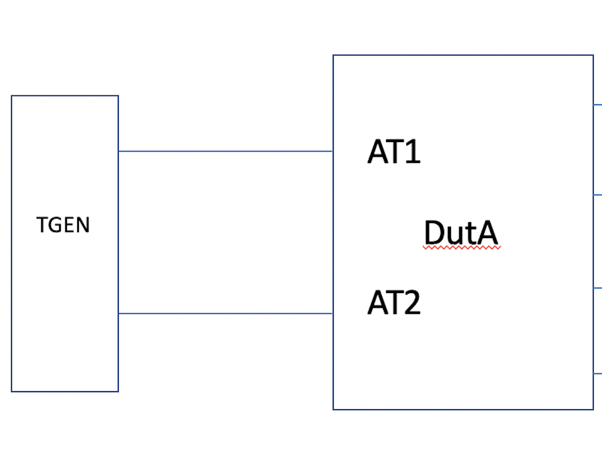

SQA Test Plan

# Drop Counter test plan 

#  SONiC 4.0 Project and Cyrus Release

Rev 1.0

[TOC]

## Test Plan Revision History

| Rev  | Date       | Author                        | Change Description                                    |
| ---- | ---------- | ----------------------------- | ----------------------------------------------------- |
| 1    | 05/27/2021 | Naveen Nag     | Initial Version                                       |
| 2 | 06/30/2021 | Naveen Nag | Changed the test case ID |
|      |            |            |                    |
|      |            |            |                    |
|      |            |            |                    |
|      |            |            |                    |

## List of Reviewers

| Function | Name |
| :------: | :--: |
|          |      |

## List of Approvers

| Function | Name | Date Approved |
| :------: | :--: | :-----------: |
|          |      |               |

## Definition/Abbreviation

| **Term** | **Meaning** |
| -------- | ----------- |
|          |             |
|          |             |

## Introduction

### Feature Overview

The main goal of this feature is to provide better packet drop visibility in SONiC by providing a mechanism to count, classify and capture packet drops that occur due to different reasons.

The other goal of this feature is for users to be able to track the types of drop reasons that are important for their scenario. Because different users have different priorities, and because priorities change over time, it is important for this feature to be easily configurable. Users can configure mirroring selected/all drop frames.

We will accomplish both goals by adding support for SAI debug counters to SONiC.

- Support for creating and configuring port-level and switch-level debug counters will be added to orchagent and syncd.

- A CLI tool will be provided for users to manage and configure their own drop counters

- CLI tool also takes care of configuring mirroring for specific or all drops.

  

## 1 Test Focus Areas

### 1.1 Functional Requirements

1. CONFIG_DB can be configured to create debug counters

2. STATE_DB can be queried for debug counter capabilities

3. Users can access drop counter information via a KLISH, GNMI, REST interfaces.

   - Users can see what capabilities are available to them
     - Types of counters (i.e. port-level and/or switch-level)
     - Number of counters
     - Supported drop reasons
   - Users can see what types of drops each configured counter contains
   - Users can see which drop frames can be mirrored.
   - Users can add and remove drop reasons from each counter
   - Users can read the current value of each counter
   - Users can assign aliases to counters
   - Users can clear counters
   - Users can mirror all/selected drop frames.

    

The supported drop counters are mentined below, we will be referring these as Flags in the test cases. 

PORT_INGRESS_DROPS:
      L2_ANY
      SMAC_MULTICAST
      SMAC_EQUALS_DMAC
      INGRESS_VLAN_FILTER
      EXCEEDS_L2_MTU
      SIP_CLASS_E
      SIP_LINK_LOCAL
      DIP_LINK_LOCAL
      ACL_ANY
      EXCEEDS_L3_MTU
      L3_EXGRESS_DOWN
      FDB_AND_BLACKHOLE_DISCARDS
      IP_HEADER_ERROR

SWITCH_EGRESS_DROPS:
      L2_ANY
      L3_ANY

PORT_MIRROR_SUPPORTED_INGRESS_DROPS:
      L2_ANY
      SMAC_MULTICAST
      SMAC_EQUALS_DMAC
      INGRESS_VLAN_FILTER
      EXCEEDS_L2_MTU

## 2 Topologies 

2.1 Topology

## 3 Test Case and objectives

### **3.1 Functional Test Cases**

In order to verify the Drop counters we need to create a custom packet from TGEN for the respective protocols and send a burst of traffic. Most of the test case will use custom packets unless specified. 

#### **3.1.1 To verify the various Port drop counters with Source Mac ** ####

| **Test ID**    | DROP_CNT_FUNC_311                                            |
| -------------- | :----------------------------------------------------------- |
| **Test Name**  | To verify the Various port drop counters with source Mac     |
| **Test Setup** | **Topology1**                                                |
| **Type**       | **Functional**                                               |
| **Steps**      | 1) Configure a drop counter with the name FTDrop_1  2) Add the flag SMAC_EQUALS_DMAC and enable the counter  3) Start sending the traffic with Smac same as Dmac and verify there is Rx drop    4) Execute show dropcounter configuration and verify the counter name, type and reason   5) Execute show dropcounter counts and verify both Rxdrop and FTDrop_1 counter are reading the same numbers    6) Stop the traffic, clear the counters and verify all the counters are reading 0, start the traffic and verify the same    7) With the drop counter in place, try adding the non-existent mirror session, we should get an error  8) Add a Mirror session with Rx port as Tgen and Tx as CPU, verify the traffic is punted to CPU now  9) Stop this stream,  add one more drop flag - SMAC_MULTICAST to the same group   10) Verfiy the show dropcounter configuration shows both the flags    11) Start the traffic with  Source mac as multicast mac and verify the drop counter is incrementing along with the Rxdrop counter  12) Verify the traffic is punted to CPU now  13) Start the first stream as well, verify both the streams are dropped and counted in the drop counter group   14) Remove only the Source mac flag from the drop counter while the traffic is running    15) Now verify the Rxdrop should have more packets than the FTDrop_1 counter since only one flag is active now  16) Also verify only the Smac as multicast traffic is punted to CPU   17) Start the first stream as well, verify both the streams are dropped and counted in the drop counter group   |

#### **3.1.2 To verify the various Port drop counters with IP ** ####

| **Test ID**    | DROP_CNT_FUNC_312                                            |
| -------------- | :----------------------------------------------------------- |
| **Test Name**  | To verify the various port drop counters with source IP      |
| **Test Setup** | **Topology1**                                                |
| **Type**       | **Functional**                                               |
| **Steps**      | 1) Configure a drop counter with the name FTDrop_1  2) Add the flag SIP_CLASS_E and enable the counter  3) Start sending the traffic with SIP as Class E IP address and verify there is Rx drop    4) Execute show dropcounter configuration and verify the counter name, type and reason   5) Execute show dropcounter counts and verify both Rxdrop and FTDrop_1 counter are reading the same numbers    6) Stop the traffic, clear the counters and verify all the counters are reading 0     7) Start the traffic and verify the counters are incrementing as expected  8) Add a Mirror session with Rx port as Tgen and Tx as CPU, verify the traffic is punted to CPU now  9) Stop this stream,  add one more drop flag - SIP_LINK_LOCAL to the same group   10) Verfiy the show dropcounter configuration shows both the flags    11) Start the traffic with  Source IP configured as link local address and verify the drop counter is incrementing along with the Rxdrop counter  12) Verify the traffic is punted to CPU now  13) Start the first stream as well, verify both the streams are dropped and counted in the drop counter group   14) Remove only the Source mac flag from the drop counter while the traffic is running    15) Now verify the Rxdrop should have more packets than the FTDrop_1 counter since only one flag is active now  16) Also verify only the Smac as multicast traffic is punted to CPU   17) Start the third stream which has valid Source IP but link local as destinaton IP   18) Verify the Rx drop is incrementing for this stream since we haven't added the flag yet to the group  19) Now add the flag DIP_LINK_LOCAL to the drop counter group and verify the group counter is incrementing and this traffic is getting puntted to CPU   |

#### **3.1.3 To verify the various Port drop counters for Invalid IP packet** ####

| **Test ID**    | DROP_CNT_FUNC_313                                            |
| -------------- | :----------------------------------------------------------- |
| **Test Name**  | To verify the various port drop counters for Invalid IP packet |
| **Test Setup** | **Topology1**                                                |
| **Type**       | **Functional**                                               |
| **Steps**      | 1) Configure a drop counter with the name FTDrop_1 and enable IP_HEADER_ERROR flag  2) Create a stream with Invalid IP packet, for eg both source and destination IP same  3) Start sending the traffic with this stream and verify there is Rx drop    4) Execute show dropcounter configuration and verify the counter name, type and reason   5) Execute show dropcounter counts and verify both Rxdrop and FTDrop_1 counter are reading the same numbers    6) Stop the traffic, enable L3_ANY flag and remove IP_HEADER_ERROR flag from the group     7) Start the traffic and verify the Group counters are incrementing as expected since there should be a match for L3_ANY flag as well   8) Edit the stream or create one more stream with CRC error in the IP packet  9) Verify the group counter is incrementing as before , add back  IP_HEADER_ERROR flag to the group  10) Verfiy the show dropcounter configuration shows both the flags    11) Verify the group counter is incrementing along with the Rx drop  12) Save the config and do a reboot of the switch with traffic running  13) Once the node is back online, verify the drop counter config is retained and counters are incrementing as expected  14) Edit or create one more stream with DF bit set and MTU of the packet set to 7000   15) Start the traffic and verify the counter, the behavior should be same since this should also qualify for IP header Error  16) Remove all the flags from the group and add EXCEEDS_L3_MTU FLAG and verify the counter should increment due to the match   |

#### **3.1.4 To verify the various Port drop counters with ACL and Vlan filter** ####

| **Test ID**    | DROP_CNT_FUNC_314                                            |
| -------------- | :----------------------------------------------------------- |
| **Test Name**  | To verify the various port drop counters with ACL and Vlan filter |
| **Test Setup** | **Topology1**                                                |
| **Type**       | **Functional**                                               |
| **Steps**      | 1) Configure a drop counter with the name FTDrop_1 without any flag  2) Create a stream with a valid L2 packet  3) Add a ACL rule to deny any of the header source or destination IP   4) Verify the packet is matching the ACL rule and getting dropped   5) Now add a flag ACL_ANY to the group on the fly and verify the group counter is incrementing   6) Remove the ACL rules and make sure the ACL is not hit    7) Verify the group counter shouldn't increment since the ACL is removed   8) Stop the traffic, clear the counter and on the same stream add a vlan header 1111 and start the traffic  9) Verify the Rx drop is incrementing whereas group counter should read zero  10) Add VLAN_FILTER flag to the group    11) Due to mismtach in the vlan, verify the group counter is incrementing along with the Rx drop  12) Save the config and do a warm reboot of the switch with traffic running  13) Once the node is back online, verify the drop counter config is retained and counters are incrementing as expected  14) Add a mirror session with traffic to CPU and attach this mirror session to the group   15) Verify the traffic is punted to CPU due to match in the mirror session.   |

#### **3.1.5 To verify the various Port drop counters for Tx side** ####

| **Test ID**    | DROP_CNT_FUNC_315                                            |
| -------------- | :----------------------------------------------------------- |
| **Test Name**  | To verify the various port drop counters for Tx side         |
| **Test Setup** | **Topology1**                                                |
| **Type**       | **Functional**                                               |
| **Steps**      | 1) Configure a drop counter with the name FTDrop_1 without any flag  2) Create a stream with a valid L2 packet and add 2 ports as part of the same plan  3) The traffic from first port should be received on the second port  4) Bring down the second interface on which the packet was getting transmitted  5) Verify the Tx drop is observed   6) Add the flag L3_EGRESS_DOWN to the drop counter group    7) Verify the group counter starts to increment   8) Bring up the interface, verify the traffic is received on the other port  9) Verify both the Rx drop and group drop counters are not incrementing   10) Bring down the port from the other end - spirent side and the counters should increment as before   11) Due to mismtach in the vlan, verify the group counter is incrementing along with the Rx drop  |

### **3.2 Scale Test Cases**

### 3.2.1 To verify the maximum number of port drop counter groups that can be added in a system  ###

| **Test ID**    | DROP_CNT_SCALE_321                                           |
| -------------- | :----------------------------------------------------------- |
| **Test Name**  | To verify the maximum number of port drop counter groups that can be added in a system |
| **Test Setup** | **Topology1**                                                |
| **Type**       | **Scale Test Case**                                          |
| **Steps**      | 1) Create 32 drop counter group and make sure there are no errors seen   2) Add different filter flags for each of the groups and enable the mirroring to another edge port for all the flags which are supported    3) Create the stream which matches all these flags   4) Start the traffic and verify all the groups are hit and counters are being incremented   5) Also verify the packets are mirrored    6) Execute install and no install to make sure the groups are flapped    7) Once the groups are active, drop counter should increment and packet should get mirrored   8) Save the config and do a fast reboot, make sure once the node is up verify the groups are hit.  |

### **3.3 Stress Test Cases**

### 3.3.1 To verify mem leak and CPU usuage by stressing while adding and removing the various filter to the drop counter group  ###

| **Test ID**    | DROP_CNT_STRESS_331                                          |
| -------------- | :----------------------------------------------------------- |
| **Test Name**  | To verify mem leak and CPU usuage by stressing while adding and removing the various filter to the drop counter group |
| **Test Setup** | **Topology1**                                                |
| **Type**       | **Stress Test Case**                                         |
| **Steps**      | 1) Configure a drop counter with the name FTDrop_1  2) Have multiple streams with the following header  3) SMAC_MULTICAST,  SMAC_EQUALS_DMAC,  INGRESS_VLAN_FILTER,  EXCEEDS_L2_MTU , SIP_CLASS_E SIP_LINK_LOCAL,  DIP_LINK_LOCAL, EXCEEDS_L3_MTU & IP_HEADER_ERROR  4) Start all the streams and verify Rx drop is incremented   5) Now start adding one flag at a time as mentioned in Step 3    6) Since the traffic is getting matched for any one of the flags, the drop counter group will also increment along with the Rx drop.    7) While the traffic running, delete the FTDrop_1 group and verify only Rx drop is incremented  8) Recreate the group and add all the flags and verify the counter  9) Add a mirror session to mirror the packet to another Edge port and verify the packets are getting mirrored   10) With the traffic running and mirror session active, add and delete the flags multiple times   11) When any one of the flags are present group counter should increment and packets should be mirrored  12) While all the flags are removed verify none of the packets are mirrored  |

## 4.0 **Reference Links**

 HLD document -->

https://github.com/BRCM-SONIC/sonic_doc_private/pull/148

