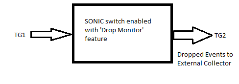

#  SQA Test Plan
# Drop Monitor
#  SONiC 3.0 - 4.0.0 Buzznik/Cyrus Releases
[TOC]
# Test Plan Revision History
| Rev | Date        | Author             | Change Description          |
|:---:|:-----------:|:------------------:|-----------------------------|
| 0.2 | 18/08/2021  | Prudviraj Kristipati    | Enhanced version             |
| 0.1 | 11/05/2019  | Rizwan Siddiqui    | Initial version             |

# List of Reviewers
|  Function 		  | Name  							 |
|:-------------------:|:--------------------------------:|
|	QA		  |	 Kalyan Vadlamani				 |
|	QA		  |	 Giri Babu Sajja				 |
|   Dev		  |  Sachin Suman					 |
|   Dev		  |  Bandaru Viswanath					 |
|   QA				  |  Anil Kumar Kolkaleti			 |
|   Dev				  |  Shirisha Dasari				 |

# List of Approvers
|  Function    | Name            | Date Approved      |
|:------------:|:---------------:|:------------------:|
| QA | Giri Babu Sajja |                    |
| Dev | Sachin Suman    |                    |
|	QA		  |	 Kalyan Vadlamani				 	||
|   Dev		  |  Bandaru Viswanath					 ||

# Definition/Abbreviation
| **Term** | **Meaning**                       |
| -------- | -------------------------------   |
| TAM      | Telemetry and Monitoring          |

# Feature Overview
Drop Monitor is a Telemetry feature. 'Drop Monitor' is used to detect and report drop reasons on a per-flow basis to the external collector. 'Drop Monitor' reports the following drop events to the collector. 
Drop Start:- Sent when drops are observed on the flow for the first time. The report contains the event, flow keys, and the last observed drop reasons. Drop Active:- Sent whenever the drop reason on the flow changes. The report contains the event, flow keys (5-tuple), and the drop reasons. Drop Stop:- Sent when no sampled dropped packets are observed for the aging interval. The report contains event, flow keys and the last observed drop reasons. 
Sampling rate: One out of configured number of dropped packets of flow are sampled for processing. 
The report contains event, flow keys and the last observed drop reasons. Once a drop-stop event is notified to the collector, if a flow drops again, a "drop-start" event will be sent indicating drops on flow. 

Additionally, to enable quick and targeted packet-drop debugging, the Drop Monitor feature supports reporting information locally about dropped flows without requiring an external Collector. This mode is termed `local` mode.

The two modes - *local* mode and *external* mode are mutually exclusive. That is, when an external collector is configured, information on dropped-flows is unavailable locally on the Switch. Likewise, when used in *local* mode, drop reports are not sent to any external collector. The `external` mode is the default mode.

The  `local` mode is meant for debugging purposes only and is limited interms of scale (number of flows that can be monitored). It is not expected as a replacement for true drop monitoring with an external Collector. 

# Test Approach
### What will be part of module config? 
Module Config will have below items covered. 
1. Ensure Min Topology, checking build contains advance package, feature supported platform and feature availability check, initializing TG port handlers and creating TG streams, creating routing interfaces, creating a random VLAN to be used for L2 drop reason, needed show commands to check/debug the configuration. 
2. Drop Monitor feature configuration such as entering into TAM mode, flow configuration, collector creation, sample configuration, aging-interval configuration. 
3. All drop reasons related configuration i.e. ACL rules & ACL tables, 'Drop Monitor' flows and their corresponding TG streams configuration. 
4. Drop monitor with Local mode configuration can be part of this.

### What Utility will be used? 
SpyTest framework TG packet capture utility will be used for analyzing the drop event packets. 
### What tests will be covered / clubbed together? 
All the drop reasons will be covered while clubbing feature functionality i.e. sampling, aging-interval behavior, 2 drop reasons per flow, checking different drop events. 
All Drop Reasons tests will be clubbed and will be part of one test function.  Also memory-leak test case can be clubbed along with drop reason functional test cases verification. 
### What 3rd party tools to be tested for? 
NA 
### Combinations covered 
As part of 'Drop Mirror' feature testing below drop reasons (whichever of the below listed can be testable) will be validated. 
1.  Unknown VLAN 
2.  TTL_ERR 
3.  TTL1_ERR 
4.  L3_DEST_MISS 
5.  Martian Address 
6.  Parity Error 
7.  DoS Attack 
8.  L3 MTU Check Fail 
9.  L3 Header Error 
10. L3 Source Bind Fail 
11. Invalid TPID 
### Which area of the test plan covers common warm-boot, cold boot, fastboot file tests of the given feature. 
Section 3.3 of the Test Plan covers test scenarios related to warm-reboot, cold reboot, fast-reboot, config-reload. All these will be tested under 'test_system_fast_reboot.py', 'test_system_save_reboot.py', 'test_system_warm_reboot.py' test functions. 
### List of tests which can not be automated and why 
NA 
### What is the plan for covering secondary UI ( Ex:- gNMI / KLISH / REST ) and how much? 
Validating 'Drop Monitor' feature configuration through gNMI, REST, KLISH will be taken care by SpyTest infra team. 
### Platform dependencies ( If the feature is supported only on some specific platforms, list them out ) 
'Drop Monitor' feature is supported on TH2, TH3 and TD3
### Reuse of any existing scripts / modules. 
NA 

### Target run time for the scripts 
Estimated run time would be 5-7 minutes (excluding other reboot tests).  

# 1 Test Focus Areas
  ## 1.1 Functional Testing 
  - All Klish CLI, SNMP, REST, gNMI
  - Feature functionality for 'Drop Monitor'

  ## 1.2 Negative Testing 
  -	Link shut or no-shut 
  -	Reload/kill TAM container 
  -	Warm reboot
  -	Fast reboot                
  -	Config save and reload

  ## 1.3 Scalability Testing
  - Scaling with max supported flows.

# 2 Topologies
## 2.1 Topology 1

# 3 Test  Case and Objectives
## 3.1 Functional
### 3.1.1 Verify that 'Invalid TPID' packets are dropped and dropped events are sent to the configured collector.
| **Test ID**    | **ft_mod_invalid_tpid_pkt_drop**                             								  |
| -------------- | :--------------------------------------------------------------------------------------------- |
| **Test Name**  | **Verify that 'Invalid TPID' packets are dropped and dropped events are sent to configured collector.** |
| **Test Setup** | **Topology**                                                 								  |
| **Type**       | **Functional**                                              									  |
| **Steps**      | **Setup: i. DUT with 4 TG ports and reachable through management interface. ii. Place the ACL rule and ACL table in the 'config_db.json' file such that configured ACL should have rule i.e. MONITOR_DROP. iii. Routing configured and ARP resolved for TG ports. iv. L3 IXIA stream having 'Invalid TPID'. Packet with IPv4 packet with TPID different to outer TPID. i.e. Invalid VLAN. Procedure: 1) Bring up the DUT with default configuration. 2) Enable 'Drop Monitor' feature, configure sampling rate, aging interval and a collector. 3) Configure a flow using 5-Tuple info to look for a specific pattern in the incoming flow of traffic. 4) Configure IPv4 TPID and send IPv4  packet with TPID different to outer TPID and check the behavior on collector after capturing the packets. Expected Behavior: 1) Verify that DUT is UP with default configuration. 2) Verify that configuration is successful and 'Drop Monitor' feature is enabled, sampling config is successful, aging interval and collector configuration is successful. 3) Verify that a flow is configured using 5-tuple. 4) Verify that 'Invalid TPID' packets are dropped and the drop event is sent to the collector in protobuf format having part of packet, flow details, drop reason opcode.** |

### 3.1.2 Verify that 'L3_DEST_MISS' packets are dropped and dropped events are sent to configured collector.
| **Test ID**    | **ft_mod_l3_dest_miss_pkt_drop**                          					                      |
| -------------- | :------------------------------------------------------------------------------------------------- |
| **Test Name**  | **Verify that 'L3_DEST_MISS' packets are dropped and dropped events are sent to the configured collector.** |
| **Test Setup** | **Topology**                                              									      |
| **Type**       | **Functional**                                              										  |
| **Steps**      | **Setup: i. DUT with 4 TG ports and reachable through management interface ii. L3 IXIA stream having 'L3_DEST_MISS'. Do not install L3 route/L3 host entry. iii. Place the ACL rule and ACL table in the 'config_db.json' file such that configured ACL should have rule i.e. MONITOR_DROP.Routing configured and ARP resolved for TG ports. Procedure: 1) Bring up the DUT with default configuration. 2) Enable 'Drop Monitor' feature, configure sampling rate, aging interval and a collector. 3) Configure a flow using 5-Tuple info to look for a specific pattern in the incoming flow of traffic. 4) Send 'L3_DEST_MISS' packets and check the behavior on collector after capturing the packets. Expected Behavior: 1) Verify that DUT is UP with default configuration. 2) Verify that configuration is successful and 'Drop Monitor' feature is enabled, sampling config is successful, aging interval and collector configuration is successful. 3) Verify that a flow is configured using 5-tuple. 4) Verify that 'L3_DEST_MISS' packets are dropped and the drop event is sent to the collector in protobuf format having part of packet, flow details, drop reason opcode.** |

### 3.1.3 Verify that 'Dos Attack' packets are dropped and dropped events are sent to the configured collector.
| **Test ID**    | **ft_mod_l3_dos_attack_pkt_drop**                            						            |
| -------------- | :----------------------------------------------------------------------------------------------- |
| **Test Name**  | **Verify that 'Dos Attack' packets are dropped and dropped events are sent to the configured collector.** |
| **Test Setup** | **Topology**                                                  									|
| **Type**       | **Functional**                                               									|
| **Steps**      | **Setup: i. DUT with 4 TG ports and reachable through management interface. ii. DUT configured with DoS Attack (say Source IP = Destination IP) iii. Place the ACL rule and ACL table in the 'config_db.json' file such that configured ACL should have rule i.e. MONITOR_DROP. iv. Routing configured and ARP resolved for TG ports.  v. L3 IXIA stream having 'Dos Attack'. Packet with Source IP=Dest IP vi. DUT configured with DoS Attack (say Source IP = Destination IP) Procedure: 1) Bring up the DUT with default configuration. 2) Enable 'Drop Monitor' feature, configure sampling rate, aging interval and a collector. 3) Configure a flow using 5-Tuple info to look for a specific pattern in the incoming flow of traffic. 4) Send 'Dos Attack' packets and check the behavior on collector after capturing the packets. Expected Behavior: 1) Verify that DUT is UP with default configuration. 2) Verify that configuration is successful and 'Drop Monitor' feature is enabled, sampling config is successful, aging interval and collector configuration is successful. 3) Verify that a flow is configured using 5-tuple. 4) Verify that 'Dos Attack' packets are dropped and the drop event is sent to the collector in protobuf format having part of packet, flow details, drop reason opcode.** |

### 3.1.4 Verify that 'L3 MTU Check Fail' packets are dropped and dropped events are sent to the configured collector.
| **Test ID**    | **ft_mod_l3_dest_miss_pkt_drop**                                        							       |
| -------------- | :------------------------------------------------------------------------------------------------------ |
| **Test Name**  | **Verify that 'L3 MTU Check Fail' packets are dropped and dropped events are sent to the configured collector.** |
| **Test Setup** | **Topology**                                                 										   |
| **Type**       | **Functional**                                              											   |
| **Steps**      | **Setup: i. DUT with 4 TG ports and reachable through management interface. ii. DUT interface configured with an MTU value. iii. Place the ACL rule and ACL table in the 'config_db.json' file such that configured ACL should have rule i.e. MONITOR_DROP. iv. Routing configured and ARP resolved for TG ports.  v. L3 - IXIA stream having 'L3 MTU Check Fail'. Packet with Source IP=Dest IP DUT interface configured with an MTU value. Procedure: 1) Bring up the DUT with default configuration. 2) Enable 'Drop Monitor' feature, configure sampling rate, aging interval and a collector. 3) Configure a flow using 5-Tuple info to look for a specific pattern in the incoming flow of traffic. 4) Send Packet with L3 MTU Size greater than the L3 LTU size configured in L3 interface and check the behavior on collector after capturing the packets. Expected Behavior: 1) Verify that DUT is UP with default configuration. 2) Verify that configuration is successful and 'Drop Monitor' feature is enabled, sampling config is successful, aging interval and collector configuration is successful. 3) Verify that a flow is configured using 5-tuple. 4) Verify that 'L3 MTU Check Fail' packets are dropped and the drop event is sent to the collector in protobuf format having part of packet, flow details, drop reason opcode.** |

### 3.1.5 Verify that 'Parity Error' packets are dropped and dropped events are sent to configured collector.
| **Test ID**    | **ft_mod_l3_parity_error_pkt_drop**                                    			              |
| -------------- | :--------------------------------------------------------------------------------------------- |
| **Test Name**  | **Verify that 'Parity Error' packets are dropped and dropped events are sent to configured collector.** |
| **Test Setup** | **Topology**                                                 								  |
| **Type**       | **Functional**                                              									  |
| **Steps**      | **Setup: i. DUT with 4 TG ports and reachable through management interface. ii. L3 IXIA stream having 'Parity Error'. Inject ser error on IP Entry iii. Place the ACL rule and ACL table in the 'config_db.json' file such that configured ACL should have rule i.e. MONITOR_DROP. iv. Routing configured and ARP resolved for TG ports. Procedure: 1) Bring up the DUT with default configuration. 2) Enable 'Drop Monitor' feature, configure sampling rate, aging interval and a collector. 3) Configure a flow using 5-Tuple info to look for a specific pattern in the incoming flow of traffic. 4) Send 'Parity Error' packets and check the behavior on collector after capturing the packets. Expected Behavior: 1) Verify that DUT is UP with default configuration. 2) Verify that configuration is successful and 'Drop Monitor' feature is enabled, sampling config is successful, aging interval and collector configuration is successful. 3) Verify that a flow is configured using 5-tuple. 4) Verify that 'Parity Error' packets are dropped and the drop event is sent to the collector in protobuf format having part of packet, flow details, drop reason opcode.** |

### 3.1.6 Verify that 'L3 Source Bind Fail' packets are dropped and dropped events are sent to configured collector.
| **Test ID**    | **ft_mod_l3_source_bind_fail_pkt_drop**                       				                         |
| -------------- | :---------------------------------------------------------------------------------------------------- |
| **Test Name**  | **Verify that 'L3 Source Bind Fail' packets are dropped and dropped events are sent to configured collector.** |
| **Test Setup** | **Topology**                                                                                          |
| **Type**       | **Functional**                                                                                        |
| **Steps**      | **Setup: i. DUT with 4 TG ports and reachable through management interface. ii. L3 - IXIA stream having 'L3 Source Bind Fail'. Send packet with a different MAC than the MAC address used in SRC binding. iii. Place the ACL rule and ACL table in the 'config_db.json' file such that configured ACL should have rule i.e. MONITOR_DROP. iv. Routing configured and ARP resolved for TG ports. Procedure: 1) Bring up the DUT with default configuration. 2) Enable 'Drop Monitor' feature, configure sampling rate, aging interval and a collector. 3) Configure a flow using 5-Tuple info to look for a specific pattern in the incoming flow of traffic. 4) Send packet with a different MAC address than the MAC address used in source binding and check the behavior on collector after capturing the packets. Expected Behavior: 1) Verify that DUT is UP with default configuration. 2) Verify that configuration is successful and 'Drop Monitor' feature is enabled, sampling config is successful, aging interval and collector configuration is successful. 3) Verify that a flow is configured using 5-tuple. 4) Verify that 'L3 Source Bind Fail' packets are dropped and the drop event is sent to the collector in protobuf format having part of packet, flow details, drop reason opcode.** |

### 3.1.7 Verify that 'L3HEADER Error' packets are dropped and dropped events are sent to configured collector.
| **Test ID**    | **ft_mod_l3header_error_pkt_drop**                           				                    |
| -------------- | :----------------------------------------------------------------------------------------------- |
| **Test Name**  | **Verify that 'L3HEADER Error' packets are dropped and dropped events are sent to configured collector.** |
| **Test Setup** | **Topology**                                                 									|
| **Type**       | **Functional**                                               									|
| **Steps**      | **Setup: i. DUT with 4 TG ports and reachable through management interface. ii. L3 IXIA stream having 'L3 Source Bind Fail'. Send packet with unicast Destination MAC Address and Multicast Destination IP address. iii. Place the ACL rule and ACL table in the 'config_db.json' file such that configured ACL should have rule i.e. MONITOR_DROP. iv. Routing configured and ARP resolved for TG ports. Procedure: 1) Bring up the DUT with default configuration. 2) Enable 'Drop Monitor' feature, configure sampling rate, aging interval and a collector. 3) Configure a flow using 5-Tuple info to look for a specific pattern in the incoming flow of traffic. 4) Send packet with a different MAC address than the MAC address used in source binding and check the behavior on collector after capturing the packets. Expected Behavior: 1) Verify that DUT is UP with default configuration. 2) Verify that configuration is successful and 'Drop Monitor' feature is enabled, sampling config is successful, aging interval and collector configuration is successful. 3) Verify that a flow is configured using 5-tuple. 4) Verify that 'L3 Source Bind Fail' packets are dropped and the drop event is sent to the collector in protobuf format having part of packet, flow details, drop reason opcode.** |

### 3.1.8 Verify that 'Martian address' packets are dropped and dropped events are sent to configured collector.

| **Test ID**    | **ft_mod_martian_address_pkt_drop**                                             					 |
| -------------- | :------------------------------------------------------------------------------------------------ |
| **Test Name**  | **Verify that 'Martian address' packets are dropped and dropped events are sent to configured collector.** |
| **Test Setup** | **Topology**                                                 									 |
| **Type**       | **Functional**                                               									 |
| **Steps**      | **Setup: i. DUT with 4 TG ports and reachable through management interface. ii. L3 IXIA stream having 'Martian address'. Set source IP (0.0.0.0) iii. Place the ACL rule and ACL table in the 'config_db.json' file such that configured ACL should have rule i.e. MONITOR_DROP. iv. Routing configured and ARP resolved for TG ports.  Procedure: 1) Bring up the DUT with default configuration. 2) Enable 'Drop Monitor' feature, configure sampling rate, aging interval and a collector. 3) Configure a flow using 5-Tuple info to look for a specific pattern in the incoming flow of traffic. 4) Send 'Martian address' packets and check the behavior on collector after capturing the packets. Expected Behavior: 1) Verify that DUT is UP with default configuration. 2) Verify that configuration is successful and 'Drop Monitor' feature is enabled, sampling config is successful, aging interval and collector configuration is successful. 3) Verify that a flow is configured using 5-tuple. 4) Verify that 'Martian address' packets are dropped and the drop event is sent to the collector in protobuf format having part of packet, flow details, drop reason opcode.** |

### 3.1.9 Verify that 'TTL_ERR' packets are dropped and dropped events are sent to the configured collector.

| **Test ID**    | **ft_mod_ttl_err_pkt_drop**                                                                   |
| -------------- | :-------------------------------------------------------------------------------------------- |
| **Test Name**  | **Verify that 'TTL_ERR' packets are dropped and dropped events are sent to the configured collector.** |
| **Test Setup** | **Topology**                                                 								 |
| **Type**       | **Functional**                                               								 |
| **Steps**      | **Setup: i. DUT with 4 TG ports and reachable through management interface. ii. L3 - IXIA stream having 'TTL_ERR' error. Set IPv4 L3 packet with TTL = '0' to introduce 'TTL_ERR' in the packet. iii. Place the ACL rule and ACL table in the 'config_db.json' file such that configured ACL should have rule i.e. MONITOR_DROP. iv. Routing configured and ARP resolved for TG ports. Procedure: 1) Bring up the DUT with default configuration. 2) Enable 'Drop Monitor' feature, configure sampling rate, aging interval and a collector. 3) Configure a flow using 5-Tuple info to look for a specific pattern in the incoming flow of traffic. 4) Send 'Martian address' packets and check the behavior on collector after capturing the packets. Expected Behavior: 1) Verify that DUT is UP with default configuration. 2) Verify that configuration is successful and 'Drop Monitor' feature is enabled, sampling config is successful, aging interval and collector configuration is successful. 3) Verify that a flow is configured using 5-tuple. 4) Verify that 'Martian address' packets are dropped and the drop event is sent to the collector in protobuf format having part of packet, flow details, drop reason opcode.** |

### 3.1.10 Verify that 'TTL1_ERR' packets are dropped and dropped events are sent to configured collector.

| **Test ID**    | **ft_mod_ttl1_err_pkt_drop**                                              			      |
| -------------- | :----------------------------------------------------------------------------------------- |
| **Test Name**  | **Verify that 'TTL1_ERR' packets are dropped and dropped events are sent to configured collector.** |
| **Test Setup** | **Topology**                                                 							  |
| **Type**       | **Functional**                                               							  |
| **Steps**      | **Setup: i. DUT with 4 TG ports and reachable through management interface. ii. L3 IXIA stream having 'TTL1_ERR' error. Set IPv4 L3 packet with TTL = '1' to introduce 'TTC_ERR' in the packet. iii. Place the ACL rule and ACL table in the 'config_db.json' file such that configured ACL should have rule i.e. MONITOR_DROP. iv. Routing configured and ARP resolved for TG ports.  Procedure: 1) Bring up the DUT with default configuration. 2) Enable 'Drop Monitor' feature, configure sampling rate, aging interval and a collector. 3) Configure a flow using 5-Tuple info to look for a specific pattern in the incoming flow of traffic. 4) Send 'TTL1_ERR' packets and check the behavior on collector after capturing the packets.  Expected Behavior: 1) Verify that DUT is UP with default configuration. 2) Verify that configuration is successful and 'Drop Monitor' feature is enabled, sampling config is successful, aging interval and collector configuration is successful. 3) Verify that a flow is configured using 5-tuple. 4) Verify that 'TTL1_ERR' packets are dropped and the drop event is sent to the collector in protobuf format having part of packet, flow details, drop reason opcode.** |

### 3.1.11 Verify that 'Unknown VLAN' packets are dropped and dropped events are sent to the configured collector.

| **Test ID**    | **ft_mod_unknown_vlan_pkt_drop**                                              					  |
| -------------- | :------------------------------------------------------------------------------------------------- |
| **Test Name**  | **Verify that 'Unknown VLAN' packets are dropped and dropped events are sent to the configured collector.** |
| **Test Setup** | **Topology**                                                 									  |
| **Type**       | **Functional**                                               									  |
| **Steps**      | **Setup: i. DUT with 4 TG ports and reachable through management interface. ii. L2 IXIA stream having VLAN tag with the VLAN which does not exist on the DUT. iii. Place the ACL rule and ACL table in the 'config_db.json' file such that configured ACL should have rule i.e. MONITOR_DROP. Procedure: 1) Bring up the DUT with default configuration. 2) Enable 'Drop Monitor' feature, configure sampling rate, aging interval and a collector. 3) Configure a flow using 5-Tuple info to look for a specific pattern in the incoming flow of traffic. 4) Send 'Unknown VLAN' packets and check the behavior on collector after capturing the packets. 5) Send 'Unknown VLAN' packets after the aging interval. Expected Behavior: 1) Verify that DUT is UP with default configuration. 2) Verify that configuration is successful and 'Drop Monitor' feature is enabled, sampling config is successful, aging interval and collector configuration is successful. 3) Verify that a flow is configured using 5-tuple. 4) Verify that 'TTL1_ERR' packets are dropped and the drop event is sent to the collector having part of packet, flow details, drop reason opcode. 5) Verify that drop reasons are not sent to the collector in protobuf format as these drop events are received after the aging interval. ** |
Note : VLAN tagged packet for the VLAN which is not configured / exists on the switch is Unkown VLAN.

### 3.1.12 Verify that 'catch-all' can be configured to monitor drops on all the flows across the switch. 

| **Test ID**    | **ft_mod_catch_all_flows_drop_event**                                              				  |
| -------------- | :------------------------------------------------------------------------------------------------- |
| **Test Name**  | **Verify that 'catch-all' can be configured to monitor drops on all the flows across the switch.** |
| **Test Setup** | **Topology**                                                 									  |
| **Type**       | **Functional**                                               									  |
| **Steps**      | **Setup: i. DUT with 4 TG ports and reachable through management interface. ii. L2 IXIA stream having VLAN tag with the VLAN which does not exist on the DUT and L3 - IXIA stream having 'TTL_ERR' error. Set IPv4 L3 packet with TTL = '0' to introduce 'TTC_ERR' in the packet. iii. Place the ACL rule and ACL table in the 'config_db.json' file such that configured ACL should have rule i.e. MONITOR_DROP. iv. Routing configured and ARP resolved for TG ports.  Procedure: 1) Bring up the DUT with default configuration. 2) Enable 'Drop Monitor' feature, configure sampling rate, aging interval and a collector. 3) Send 'TTL_ERR' & 'Unknown VLAN' packets and check the behavior on collector after capturing the packets.  Expected Behavior: 1) Verify that DUT is UP with default configuration. 2) Verify that configuration is successful and 'Drop Monitor' feature is enabled, sampling config is successful, aging interval and collector configuration is successful. 3) Verify that 'Drop Monitor' drop event for 'TTL_ERR' & 'Unknown VLAN' is sent to collector in protobuf format having part of packet, flow details, drop reason opcode.** |

### 3.1.13 Verify that 'Drop Monitor' feature exports max 2 drop reasons per flow. 

| **Test ID**    | **ft_mod_2_drop_reasons_per_flow**                               |
| -------------- | :----------------------------------------------------------------|
| **Test Name**  | **Verify that 'Drop Monitor' feature exports max 2 drop reasons per flow.** |
| **Test Setup** | **Topology**                                                 	|
| **Type**       | **Functional**                                               	|
| **Steps**      | **Setup: i. DUT with 4 TG ports and reachable through management interface. ii. L3 - IXIA stream having 'TTL_ERR' error. Set IPv4 L3 packet with TTL = '0' to introduce 'TTL_ERR' in the packet. iii. Place the ACL rule and ACL table in the 'config_db.json' file such that configured ACL should have rule i.e. MONITOR_DROP. iv. Routing configured and ARP resolved for TG ports.  Procedure: 1) Bring up the DUT with default configuration. 2)   Enable 'Drop Monitor' feature, configure sampling rate, aging interval and a collector. 3) Send 'TTL_ERR' & 'Unknown VLAN' packets as per configured flow and check the behavior on collector after capturing the packets. Expected Behavior: 1) Verify that DUT is UP with default configuration. 2) Verify that configuration is successful and 'Drop Monitor' feature is enabled, sampling config is successful, aging interval and collector configuration is successful. 3) Verify that 2 drop reasons i.e. 'TTL_ERR' & 'Unknown VLAN' are sent to collector in protobuf format for configured 1 flow having part of packet, flow details, drop reason opcode.** |

### 3.1.14 Verify that a single drop event report is sent to the collector if multiple events on a flow are detected at the same time.  

| **Test ID**    | **ft_mod_single_drop_event_multiple_reasons_at_a_time**               		                      |
| -------------- | :------------------------------------------------------------------------------------------------- |
| **Test Name**  | **Verify that a single drop event report is sent to the collector if multiple events on a flow are detected at the same time.** |
| **Test Setup** | **Topology**                                                 									  |
| **Type**       | **Functional**                                               									  |
| **Steps**      | **Setup: i. DUT with 4 TG ports and reachable through management interface. ii. Send 'Unknown VLAN' & 'TTL_ERR'packets and check the behavior on collector after capturing the packets. iii. Place the ACL rule and ACL table in the 'config_db.json' file such that configured ACL should have rule i.e. MONITOR_DROP. iv. Routing configured and ARP resolved for TG ports.  Procedure: 1) Bring up the DUT with default configuration. 2) Enable 'Drop Monitor' feature, configure sampling rate, aging interval and a collector. 3) Send 'TTL_ERR' & 'Unknown VLAN' packets and check the behavior on collector after capturing the packets.  Expected Behavior: 1) Verify that DUT is UP with default configuration. 2) Verify that configuration is successful and 'Drop Monitor' feature is enabled, sampling config is successful, aging interval and collector configuration is successful. 3) Verify that 'Drop Monitor' multiple drop events (start/active/stop) for 'Unknown VLAN' & 'TTL_ERR' are exported in a single packet with both events set in it. Also multiple flows reporting same event at same time are reported in a single event and sent to the collector in protobuf format having part of packet, flow details, drop reason opcode.** |

### 3.1.15 verify the local mode configurations in different scenarios. 

| **Test ID**    | **ft_mode_local_config                                       |
| -------------- | :----------------------------------------------------------- |
| **Test Name**  | **verify the local mode configurations in different scenarios. ** |
| **Test Setup** | **Topology**                                                 |
| **Type**       | **Functional**                                               |
| **Steps**      | **1)  configure the mode as local. 2) verify the mode is reflecting correctly or not. 3)verify the built in collector is named as 'local' as mode configured is local. 4)verify that When Drop Monitor is setup in 'local mode' the collector  parameter should be optional and is ignored..** |

### 3.1.16 Verify that clear dropped flows  functionality after  'Unknown VLAN' packets are dropped and dropped events are sent to the configured Drop Monitor mode local.

| **Test ID**    | **ft_mod_unknown_vlan_pkt_drop_local**                       |
| -------------- | :----------------------------------------------------------- |
| **Test Name**  | ** Verify that clear dropped flows  functionality after  'Unknown VLAN' packets are dropped and dropped events are sent to the configured Drop Monitor mode local.** |
| **Test Setup** | **Topology**                                                 |
| **Type**       | **Functional**                                               |
| **Steps**      | **Setup: i. DUT with 4 TG ports and reachable through management interface. ii. L2 IXIA stream having VLAN tag with the VLAN which does not exist on the DUT. iii. Place the ACL rule and ACL table in the 'config_db.json' file such that configured ACL should have rule i.e. MONITOR_DROP. Procedure: 1) Bring up the DUT with default configuration. 2) Enable 'Drop Monitor' feature, configure sampling rate, aging interval and mode local. 3) Configure a flow using 5-Tuple info to look for a specific pattern in the incoming flow of traffic. 4) Send 'Unknown VLAN' packets and check the behavior from respective show command. 5) Send 'Unknown VLAN' packets after the aging interval. 6) Issue clear tam drop-monitor flows command. 7) Send 'Unknown VLAN' packets and check the behavior from respective show command. Expected Behavior: 1) Verify that DUT is UP with default configuration. 2) Verify that configuration is successful and 'Drop Monitor' feature is enabled, sampling config is successful, aging interval and local configuration is successful. 3) Verify that a flow is configured using 5-tuple. 4) Verify that 'TTL1_ERR' packets are dropped and the drop event is sent to the local collector having part of packet, flow details, drop reason opcode. 5) Verify that drop reasons are not sent to the local collector. 6) observe that flow are cleared and verify the same in respective show command 7) Verify that 'TTL1_ERR' packets are dropped and the drop event is sent to the local collector having part of packet, flow details, drop reason opcode.** |
Note : VLAN tagged packet for the VLAN which is not configured / exists on the switch is Unkown VLAN.

### 3.1.17 Verify that 'L3HEADER Error' packets are dropped and dropped events are sent to configured Drop Monitor mode local when continuous traffic is sent.
| **Test ID**    | **ft_mod_l3header_error_pkt_drop_local**                     |
| -------------- | :----------------------------------------------------------- |
| **Test Name**  | **Verify that 'L3HEADER Error' packets are dropped and dropped events are sent to configured Drop Monitor mode local when continuous traffic is sent.** |
| **Test Setup** | **Topology**                                                 |
| **Type**       | **Functional**                                               |
| **Steps**      | **Setup: i. DUT with 4 TG ports and reachable through management interface. ii. L3 IXIA stream having 'L3 Source Bind Fail'. Send continuous packet with unicast Destination MAC Address and Multicast Destination IP address. iii. Place the ACL rule and ACL table in the 'config_db.json' file such that configured ACL should have rule i.e. MONITOR_DROP. iv. Routing configured and ARP resolved for TG ports. Procedure: 1) Bring up the DUT with default configuration. 2) Enable 'Drop Monitor' feature, configure sampling rate, aging interval and mode local. 3) Configure a flow using 5-Tuple info to look for a specific pattern in the incoming flow of traffic. 4) Send packet with a different MAC address than the MAC address used in source binding and check the show command for reasons. Expected Behavior: 1) Verify that DUT is UP with default configuration. 2) Verify that configuration is successful and 'Drop Monitor' feature is enabled, sampling config is successful, aging interval and local configuration is successful. 3) Verify that a flow is configured using 5-tuple. 4) Verify that 'L3 Source Bind Fail' packets are dropped and the drop event are seen in show command ** |

### 3.1.18 Verify  drop monitor events are not to sent to the external collector even the collector is configured if the mode is set to local and collector is mentioned as local in session configuration.

| **Test ID**    | **ft_mod_l3_source_bind_fail_pkt_local_drop**                |
| -------------- | :----------------------------------------------------------- |
| **Test Name**  | **Verify  drop monitor events are not to sent to the external collector even the collector is configured if the mode is set to local and collector is mentioned as local in session configuration.** |
| **Test Setup** | **Topology**                                                 |
| **Type**       | **Functional**                                               |
| **Steps**      | **Setup: i. DUT with 4 TG ports and reachable through management interface. ii. L3 - IXIA stream having 'L3 Source Bind Fail'. Send packet with a different MAC than the MAC address used in SRC binding. iii. Place the ACL rule and ACL table in the 'config_db.json' file such that configured ACL should have rule i.e. MONITOR_DROP. iv. Routing configured and ARP resolved for TG ports. Procedure: 1) Bring up the DUT with default configuration. 2) Enable 'Drop Monitor' feature, configure sampling rate, aging interval and mode local. 3) Configure a flow using 5-Tuple info to look for a specific pattern in the incoming flow of traffic. 4) Send packet with a different MAC address than the MAC address used in source binding and check the are seen in show command. Expected Behavior: 1) Verify that DUT is UP with default configuration. 2) Verify that configuration is successful and 'Drop Monitor' feature is enabled, sampling config is successful, aging interval and collector configuration is successful. 3) Verify that a flow is configured using 5-tuple. 4) Verify that 'L3 Source Bind Fail' packets are dropped and the drop events should not sent to external collector .** |

## 3.2 Negative

### 3.2.1 Verify that 'Known/Configured VLAN' packets are not dropped and no dropped events are sent to the configured collector.

| **Test ID**    | **ft_neg_mod_known_vlan_pkt_not_dropped**                                              							  |
| -------------- | :----------------------------------------------------------------------------------------------------------------- |
| **Test Name**  | **Verify that 'Known/Configured VLAN' packets are not dropped no dropped events are sent to the configured collector.** |
| **Test Setup** | **Topology**                                                 													  |
| **Type**       | **Negative**                                               													      |
| **Steps**      | **Setup: i. L2 IXIA stream having VLAN tag with the VLAN which is configured on the DUT. Procedure: 1) Bring up the DUT with default configuration. 2) Enable 'Drop Monitor' feature, configure sampling rate, aging interval and a collector. 3) Configure a flow using 5-Tuple info to look for a specific pattern in the incoming flow of traffic. 4) Send packets in configured VLAN and check the behavior on collector after capturing the packets. Expected Behavior: 1) Verify that DUT is UP with default configuration. 2) Verify that configuration is successful and 'Drop Monitor' feature is enabled, sampling config is successful, aging interval and collector configuration is successful. 3) Verify that a flow is configured using 5-tuple. 4) Verify that VLANs packets are flooded in configured VLAN and these packets are not dropped and no event is sent to the collector in protobuf format having part of packet, flow details, drop reason opcode.** |

### 3.2.2 Verify that link shut/no-shut for 'Drop Monitor' 'Unknown VLAN' packets resume and drop events are sent to the configured collector.

| **Test ID**    | **ft_neg_mod_link_shut_no_shut_resume**                                                                                       |
| -------------- | :---------------------------------------------------------------------------------------------------------------------------- |
| **Test Name**  | **Verify that link shut/no-shut for 'Drop Monitor' 'Unknown VLAN' packets resume and drop events are sent to the configured collector.** |
| **Test Setup** | **Topology**                                                                                                                  |
| **Type**       | **Negative**                                                                                                                  |
| **Steps**      | **Setup: i. L2 IXIA stream having VLAN tag with the VLAN which is not configured on the DUT. Procedure: 1) Bring up the DUT with default configuration. 2) Enable 'Drop Monitor' feature, configure sampling rate, aging interval and a collector. 3) Configure a flow using 5-Tuple info to look for a specific pattern in the incoming flow of traffic. 4) Send packets to 'Unknown VLAN' and check the behavior on collector after capturing the packets. 5) Do a shut/no-shut on traffic sending links and check feature behavior.  Expected Behavior: 1) Verify that DUT is UP with default configuration. 2) Verify that configuration is successful and 'Drop Monitor' feature is enabled, sampling config is successful, aging interval and collector configuration is successful. 3) Verify that a flow is configured using 5-tuple. 4) Verify that packets are dropped and events are sent to the collector.  5) Verify that once the link come back UP, feature functionality resumes, dropped packets events are sent to the collector in protobuf format having part of packet, flow details, drop reason opcode.** |

### 3.2.3 verify that  mode change is not allowed  when the active sessions present  on the switch.

| **Test ID**    | **ft_neg_external_local                                      |
| -------------- | :----------------------------------------------------------- |
| **Test Name**  | ** verify that  mode change is not allowed  when the active sessions present  on the switch.** |
| **Test Setup** | **Topology**                                                 |
| **Type**       | **Negative**                                                 |
| **Steps**      | **1) verify the default mode. 2) check any available sessions. 3) configure the mode as local. 4) check that mode change is not allowed as active sessions present on the switch.** |

### 3.2.4 verify the command 'show tam drop-monitor flows' throws appropriate error when  collector is configured as external. 

| **Test ID**    | **ft_neg_error_drop                                     |
| -------------- | :----------------------------------------------------------- |
| **Test Name**  | **verify the command 'show tam drop-monitor flows' throws appropriate error when  collector is configured as external. ** |
| **Test Setup** | **Topology**                                                 |
| **Type**       | **Negative**                                                 |
| **Steps**      | **1)Make sure no dropped events are present in the device. 2) verify the which mode is configured on the device. 3)Try to issue the command show tam drop-monitor flows on the device . 4)Appropriate error should be seen on the console.** |

## 

## 3.3 Reboot/Reload Test Cases

### 3.3.1  Verify that 'Drop Monitor' warm-reboot functionality works fine. 

| **Test ID**    | **ft_mod_warm_reboot**                                       |
| -------------- | :----------------------------------------------------------- |
| **Test Name**  | **Verify that 'Drop Monitor' warm-reboot functionality works fine.**    |
| **Test Setup** | **Topology**                                                 |
| **Type**       | **Reload**                                                   |
| **Steps**      | **Procedure: 1) Bring up the DUT with default configuration. 2) Enable 'Drop Monitor' feature, configure sampling rate, aging interval and a collector. 3) Configure a flow using 5-Tuple info to look for a specific pattern in the incoming flow of traffic. 4) Save the configuration and perform a warm-reboot and check the behavior. Expected Behavior: 1) Verify that DUT is UP with default configuration. 2) Verify that configuration is successful and 'Drop Monitor' feature is enabled, sampling config is successful, aging interval and collector configuration is successful. 3) Verify that a flow is configured using 5-tuple. 4) Verify that 'Drop Monitor' configuration honors warm-reboot behavior, configuration is shown once the switch comes UP.** |

### 3.3.2  Verify that 'Drop Monitor' cold-reboot functionality works fine.  

| **Test ID**    | **ft_mod_cold_reboot**                                       |
| -------------- | :----------------------------------------------------------- |
| **Test Name**  | **Verify that 'Drop Monitor' cold-reboot functionality works fine.** 	|
| **Test Setup** | **Topology**                                                 |
| **Type**       | **Reload**                                                   |
| **Steps**      | **Procedure: 1) Bring up the DUT with default configuration. 2) Enable 'Drop Monitor' feature, configure sampling rate, aging interval and a collector. 3) Configure a flow using 5-Tuple info to look for a specific pattern in the incoming flow of traffic. 4) Save the configuration and perform a cold-reboot and check the behavior. Expected Behavior: 1) Verify that DUT is UP with default configuration. 2) Verify that configuration is successful and 'Drop Monitor' feature is enabled, sampling config is successful, aging interval and collector configuration is successful. 3) Verify that a flow is configured using 5-tuple. 4) Verify that 'Drop Monitor' configuration honors cold-reboot behavior, configuration is shown once the switch comes UP.** |

### 3.3.3  Verify that 'Drop Monitor' config reload works fine.  

| **Test ID**    | **ft_mod_config_reload**                                     |
| -------------- | :----------------------------------------------------------- |
| **Test Name**  | **Verify that 'Drop Monitor' config reload works fine.** 				|
| **Test Setup** | **Topology**                                                 |
| **Type**       | **Config Reload**                                            |
| **Steps**      | **Procedure: 1) Bring up the DUT with default configuration. 2) Enable 'Drop Monitor' feature, configure sampling rate, aging interval and a collector. 3) Configure a flow using 5-Tuple info to look for a specific pattern in the incoming flow of traffic. 4) Save the config and perform 'reload config' and check the configuration. Expected Behavior: 1) Verify that DUT is UP with default configuration. 2) Verify that configuration is successful and 'Drop Monitor' feature is enabled, sampling config is successful, aging interval and collector configuration is successful. 3) Verify that a flow is configured using 5-tuple. 4) Verify that reload config functionality works fine, configuration is applied back to the switch.** |

### 3.3.4  Verify 'Drop Monitor' configuration gets removed when TAM docker is restarted. 

| **Test ID**    | **ft_mod_docker_restart**                                    |
| -------------- | :----------------------------------------------------------- |
| **Test Name**  | **Verify 'Drop Monitor' configuration gets removed when TAM docker is restarted.** |
| **Test Setup** | **Topology**                                                 |
| **Type**       | **Docker Restart**                                           |
| **Steps**      | **Procedure: 1) Bring up the DUT with default configuration. 2) Enable 'Drop Monitor' feature, configure sampling rate, aging interval and a collector. 3) Configure a flow using 5-Tuple info to look for a specific pattern in the incoming flow of traffic. 4) Restart TAM docker and check the configuration. 5) Repeat above steps #2 & 3. Expected Behavior: 1) Verify that DUT is UP with default configuration. 2) Verify that configuration is successful and 'Drop Monitor' feature is enabled, sampling config is successful, aging interval and collector configuration is successful. 3) Verify that a flow is configured using 5-tuple. 4) Verify that restarting the docker will only restart the dropMonitorMgr. 5) Verify that there should not be an impact on the config in CONFIG_DB. ** |

### 3.3.6  Verify that 'Drop Monitor' config save reload works fine. 

| **Test ID**    | **ft_mod_save_reload**                                       |
| -------------- | :----------------------------------------------------------- |
| **Test Name**  | **Verify that 'Drop Monitor' config save reload works fine.** |
| **Test Setup** | **Topology**                                                 |
| **Type**       | **Config Save Reload**                                       |
| **Steps**      | **Procedure: 1) Bring up the DUT with default configuration. 2) Enable 'Drop Monitor' feature, configure sampling rate, aging interval and a collector. 3) Configure a flow using 5-Tuple info to look for a specific pattern in the incoming flow of traffic. 4) Save the configuration and reboot the switch. Expected Behavior: 1) Verify that DUT is UP with default configuration. 2) Verify that configuration is successful and 'Drop Monitor' feature is enabled, sampling config is successful, aging interval and collector configuration is successful. 3) Verify that a flow is configured using 5-tuple. 4) Verify that 'Drop Monitor' configuration sustains a reboot and all configuration is retained. ** |

### 3.3.7 Verify that there is no memory leak for 'Drop Monitor' feature. 

| **Test ID**    | **ft_mod_memory_leak**                                       |
| -------------- | :----------------------------------------------------------- |
| **Test Name**  | **Verify that there is no memory leak for 'Drop Monitor' feature.** |
| **Test Setup** | **Topology**                                                 |
| **Type**       | **Memory_Leak**                                              |
| **Steps**      | **Setup: i. L3 - IXIA stream having 'L3_DEST_MISS'. Do not install L3 route/L3 host entry Procedure: 1) Bring up the DUT with default configuration. 2) Enable 'Drop Monitor' feature, configure sampling rate, aging interval and a collector. 3) Configure a flow using 5-Tuple info to look for a specific pattern in the incoming flow of traffic. 4) Send 'L3_DEST_MISS' packets and check the behavior on collector after capturing the packets.  5) Run the traffic and check for memory leaks for TAM docker before and after the test.  Expected Behavior: 1) Verify that DUT is UP with default configuration. 2) Verify that configuration is successful and 'Drop Monitor' feature is enabled, sampling config is successful, aging interval and collector configuration is successful. 3) Verify that a flow is configured using 5-tuple. 4) Verify that 'L3_DEST_MISS' packets are dropped and the drop event is sent to the collector.  5) Verify that no memory leak is observed. ** |

### 3.3.8 Verify System behavior having 'Drop Monitor' configuration while fast rebooting the switch.

| **Test ID**    | **ft_mod_fast_reboot**                                       						 |
| -------------- | :------------------------------------------------------------------------------------ |
| **Test Name**  | **Verify System behavior having 'Drop Monitor' configuration while fast rebooting the switch.** |
| **Test Setup** | **Topology**                                                 						 |
| **Type**       | **Fast-Reboot**                                               						 |
| **Steps**      | **Procedure: 1) Bring up the DUT with default configuration. 2) Enable 'Drop Monitor' feature, configure sampling rate, aging interval and a collector. 3) Configure a flow using 5-Tuple info to look for a specific pattern in the incoming flow of traffic. 4) Save the config and perform a fast-reboot and check the behavior. Expected Behavior: 1) Verify that DUT is UP with default configuration. 2) Verify that configuration is successful and 'Drop Monitor' feature is enabled, sampling config is successful, aging interval and collector configuration is successful. 3) Verify that a flow is configured using 5-tuple. 4) Verify that 'Drop Monitor' configuration honors fast-reboot behavior, config is retained after switch comes UP.** |

### 4 Scalability
### 4.1 Verify that 'Drop Monitor' max flows can be created.

| **Test ID**    | **ft_mod_max_flows**                                         |
| -------------- | :----------------------------------------------------------- |
| **Test Name**  | **Verify that 'Drop Monitor' max supported flows can be created.** |
| **Test Setup** | **Topology**                                                 |
| **Type**       | **Scalability**                                              |
| **Steps**      | **Procedure: 1) Bring up the DUT with default configuration. 2) Enable 'Drop Monitor' feature, configure sampling rate, aging interval and a collector. 3) Configure max flows using 5-Tuple info to look for a specific pattern in the incoming flow of traffic. 4) Pick any 2 of the configured flows and test feature functionality. Expected Behavior: 1) Verify that DUT is UP with default configuration. 2) Verify that configuration is successful and 'Drop Monitor' feature is enabled, sampling config is successful, aging interval and collector configuration is successful. 3) Verify that max flows are configured and are shown correctly. 4) Verify that drop events are generated for the selected 2 flows and sent to the collector. ** | Note : 'Drop Monitor' max flows depend on max ACL rules supported per platform.

### 4.2  Verify max available flows when mode is configured as local.

| **Test ID**    | **ft_mod_max_flows_local**_                                        |
| -------------- | :----------------------------------------------------------- |
| **Test Name**  | **Verify max available flows when mode is configured as local.** |
| **Test Setup** | **Topology**                                                 |
| **Type**       | **Scalability**                                              |

| **Steps**      | **Procedure: 1) Bring up the DUT with default configuration. 2) Enable 'Drop Monitor' feature, configure sampling rate, aging interval and mode as local.  3) Configure max flows using 5-Tuple info to look for a specific pattern in the incoming flow of traffic. 4) Pick any 2 of the configured flows and test feature functionality. Expected Behavior: 1) Verify that DUT is UP with default configuration. 2) Verify that configuration is successful and 'Drop Monitor' feature is enabled, sampling config is successful, aging interval and local configuration is successful. 3) Verify that max flows are configured and are shown correctly. 4) Verify that drop events are generated for the selected 2 flows and sent to the local. ** | Note : 'Drop Monitor' max flows depend on max ACL rules supported per platform.

## 5 Reference Links
SONIC 3.0 'Drop Monitor' feature HLD @
http://gerrit-lvn-07.lvn.broadcom.net:8083/c/sonic/documents/+/12993

SONIC 4.0.0 'Drop Monitor' feature HLD @

https://github.com/BRCM-SONIC/sonic_doc_private/blob/master/devops/tam/tam-drop-monitor-hld.md 

