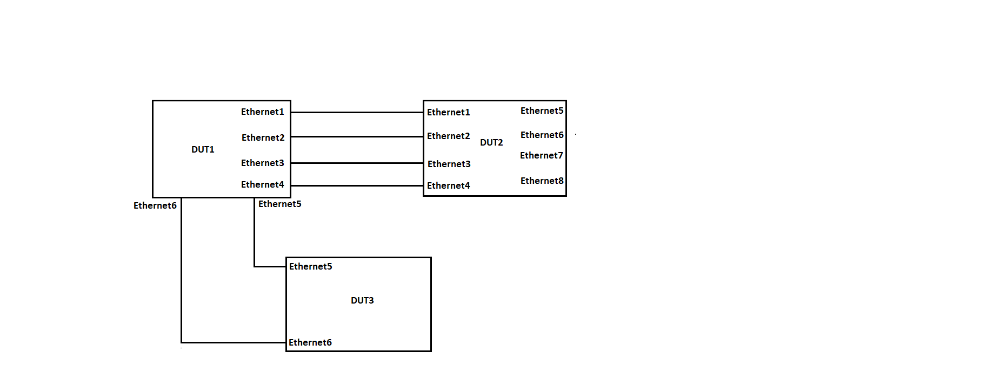

#  SQA Test Plan
#  SONIC Interface Down Reason
#  SONiC 4.0.0 Release

## Test Plan Revision History

| Rev  | Date       | Author          | Change Description |
| ---- | ---------- | --------------- | ------------------ |
| 0.1  | 6/11/2021 | Jagadish Ch   | Initial Version    |
| 0.2  |            |                 |                    |

## List of Reviewers

| Function | Name |
| :------: | :--: |
|    QA      |   Chandra Bhushan Singh   |
|    DEV     |   Prasanth K V	    |

## List of Approvers

| Function | Name | Date Approved |
| :------: | :--: | :-----------: |
|          |      |               |
|          |      |               |

## Definition/Abbreviation

| **Term** | **Meaning**                |
| -------- | -------------------------- |
|          |                            |
|          |                            |

## Feature Overview

  This feature is to help the user in finding the reason for Physical/PortChannel interfaces down easier.

## 1 Test Focus Areas

  - This Test plan covers the validation of all the down reasons of Physical/PortChannel interfaces.

### 1.1 Functional Testing

  - Validate interface down reason "Admin down" for physical interface.
  - Validate interface down reason "Remote fault" for physical interface.
  - Validate interface down reason "Transceiver not present" for physical interface.
  - Validate interface down reason "Incompatible transceiver" for physical interface.
  - Validate interface up reason "PHY link up" for physical interface.
  - Validate interface down reason "Port breakout in-progress" for physical interface.
  - Validate interface down reason "STP error disabled" for physical interface with STP mode as "pvst".
  - Validate interface down reason "STP error disabled" for physical interface with STP mode as "rapid-pvst".
  - Validate interface down reason "UDLD error disabled" for physical interface.
  - Validate interface down reason "Link flap error disabled" for physical interface.
  - Validate interface down reason "STP error disabled" for PortChannel interface with STP mode as "pvst".
  - Validate interface down reason "STP error disabled" for PortChannel interface with STP mode as "rapid-pvst".
  - Validate interface down reason "Min-links-not-met" for PortChannel interface.
  - Validate interface down reason "Admin-down" for PortChannel interface.
  - Validate interface down reason "LACP-convergence-failed" for PortChannel interface.
  - Below interface down reasons will be added later. 
  Link training failed 
  Link training not completed 
  Link training not started 
  Link tuning failed 
  Link tuning not started 
  Link tuning not completed 
  High BER 
  PCS AM lock error 
  PCS sync error 
  Transceiver error disabled 
  

## 2 Topologies

 

#### 								Topology 1
Topology Description -
- Configure PortChannel in DUT1 and DUT2 and add inter connected ports as members of that PortChannel. 
**Note:**  This configuration is applicable only for the PortChannel test cases.

## 3 Test Case and objectives

### 3.1 Functional Test Cases

#### 3.1.1 Validate interface down reason "Admin down" for physical interface.  

| **Test ID**    | **INTERFACE_DOWN_REASON_FUNC_001**                                               |
| -------------- | :----------------------------------------------------------- |
| **Test Name**  | **Validate interface down reason "Admin down" for physical interface.** |
| **Test Setup** | **Topology 1**                                               |
| **Type**       | **Functional**                                               |
| **Steps**      | 1. Shutdown the Ethernet1 in DUT1 and observe the down reason for that port is updated as "Admin down" in the "show interface status" output.|

#### 3.1.2 Validate interface down reason "Remote fault" for physical interface.  

| **Test ID**    | **INTERFACE_DOWN_REASON_FUNC_002**                                               |
| -------------- | :----------------------------------------------------------- |
| **Test Name**  | **Validate interface down reason "Remote fault" for physical interface.** |
| **Test Setup** | **Topology 1**                                               |
| **Type**       | **Functional**                                               |
| **Steps**      | 1. Shutdown the Ethernet2 in DUT2 and observe the down reason for that port is updated as "Admin down" in DUT2 and "Remote fault" in DUT1 for the corresponding port(Ethernet2) in the "show interface status" output.|

#### 3.1.3 Validate interface down reason "Transceiver not present" for physical interface.  

| **Test ID**    | **INTERFACE_DOWN_REASON_FUNC_003**                                               |
| -------------- | :----------------------------------------------------------- |
| **Test Name**  | **Validate interface down reason "Transceiver not present" for physical interface.** |
| **Test Setup** | **Topology 1**                                               |
| **Type**       | **Functional**                                               |
| **Steps**      | 1. Don't insert any transceiver in the SFP/SFP+/QSFP/QSFP+ module of DUT1. 2. Observe interface down reason will be shown as "Transceiver not present" for the respective ports in the "show interface status" output.|

#### 3.1.4 Validate interface down reason "Incompatible transceiver" for physical interface.  

| **Test ID**    | **INTERFACE_DOWN_REASON_FUNC_004**                                               |
| -------------- | :----------------------------------------------------------- |
| **Test Name**  | **Validate interface down reason "Incompatible transceiver" for physical interface.** |
| **Test Setup** | **Topology 1**                                               |
| **Type**       | **Functional**                                               |
| **Steps**      | 1. Insert unsupported/speed incompatible transceivers in Ethernet3 of DUT1, supported transceiver in DUT2 and observe the interface down reason for Ethernet3 is updated as "Incompatible transceiver" in "show interface status" output of DUT1.|

#### 3.1.5 Validate link up reason "PHY link up" for physical interface.  

| **Test ID**    | **INTERFACE_DOWN_REASON_FUNC_005**                                               |
| -------------- | :----------------------------------------------------------- |
| **Test Name**  | **Validate link up reason "PHY link up" for physical interface.** |
| **Test Setup** | **Topology 1**                                               |
| **Type**       | **Functional**                                               |
| **Steps**      | 1. Make the port as up using PHY loopback and observe the link up reason for the port is updated as "PHY link up" in "show interface status" output.|

#### 3.1.6 Validate interface down reason "Port breakout in-progress" for physical interface.  

| **Test ID**    | **INTERFACE_DOWN_REASON_FUNC_006**                                               |
| -------------- | :----------------------------------------------------------- |
| **Test Name**  | **Validate interface down reason "Port breakout in-progress" for physical interface.** |
| **Test Setup** | **Topology 1**                                               |
| **Type**       | **Functional**                                               |
| **Steps**      | 1. Breakout the port to supported modes and observe the interface down reason for the port is updated as "Port breakout in-progress" during the breakout process in "show interface status" output.|

#### 3.1.7 Validate interface down reason "STP error disabled" for physical interface with STP mode as "pvst".  

| **Test ID**    | **INTERFACE_DOWN_REASON_FUNC_007**                                               |
| -------------- | :----------------------------------------------------------- |
| **Test Name**  | **Validate interface down reason "STP error disabled" for physical interface with STP mode as "pvst".** |
| **Test Setup** | **Topology 1**                                               |
| **Type**       | **Functional**                                               |
| **Steps**      | 1. Configure VLAN-10 in DUT1 and DUT2. 2. Add Ethernet1 as tagged member of VLAN-10 in DUT1 and DUT2. 3. Configure Spanning tree mode as "pvst" in DUT1 and DUT2. 4. Enable spanning on VLAN-10 in DUT1 and DUT2. 5. Enable spanning tree on Ethernet1 of DUT1 and DUT2. 6. Configure errdisable recovery cause bpduguard in DUT1. 7. Configure errdisable recovery interval as 30 seconds in DUT1. 8. Now enable bpdu guard on Ethernet1 of DUT1 with port shutdown on bpdu guard violation. 9. Observe Ethernet1 will go down and the interface down reason will be updated as "STP error disabled" in the "show interface status err-disabled" output in DUT1. 10. Disable spanning tree on Ethernet1 of DUT2 11. Observe after the recovery interval(30 seconds) Ethernet1 will come Up in DUT1.|

#### 3.1.8 Validate interface down reason "STP error disabled" for physical interface with STP mode as "rapid-pvst".  

| **Test ID**    | **INTERFACE_DOWN_REASON_FUNC_008**                                               |
| -------------- | :----------------------------------------------------------- |
| **Test Name**  | **Validate interface down reason "STP error disabled" for physical interface with STP mode as "rapid-pvst".** |
| **Test Setup** | **Topology 1**                                               |
| **Type**       | **Functional**                                               |
| **Steps**      | 1. Configure VLAN-10 in DUT1 and DUT2. 2. Add Ethernet1 as tagged member of VLAN-10 in DUT1 and DUT2. 3. Configure Spanning tree mode as "rapid-pvst" in DUT1 and DUT2. 4. Enable spanning on VLAN-10 in DUT1 and DUT2. 5. Enable spanning tree on Ethernet1 of DUT1 and DUT2. 6. Configure errdisable recovery cause bpduguard in DUT1. 7. Configure errdisable recovery interval as 30 seconds in DUT1. 8. Now enable bpdu guard on Ethernet1 of DUT1 with port shutdown on bpdu guard violation. 9. Observe Ethernet1 will go down and the interface down reason will be updated as "STP error disabled" in the "show interface status err-disabled" output in DUT1. 10. Disable spanning tree on Ethernet1 of DUT2 11. Observe after the recovery interval(30 seconds) Ethernet1 will come Up in DUT1.|

#### 3.1.9 Validate interface down reason "UDLD error disabled" for physical interface.  

| **Test ID**    | **INTERFACE_DOWN_REASON_FUNC_009**                                               |
| -------------- | :----------------------------------------------------------- |
| **Test Name**  | **Validate interface down reason "UDLD error disabled" for physical interface.** |
| **Test Setup** | **Topology 1**                                               |
| **Type**       | **Functional**                                               |
| **Steps**      | 1. Configure errdisable recovery cause udld in DUT1. 2. Configure errdisable recovery interval as 30 seconds in DUT1. 3. Enable UDLD globally in DUT1 and DUT2. 4. Configure message-time and multiplier as 2 and 3 respectively in DUT1 and DUT2. 5. Enable UDLD on Ethernet1 of both DUT1 and DUT2. 6. Enable UDLD packets blocking on Ethernet1 of DUT1 7. Observe Ethernet1 go down and the interface down reason will be updated as "UDLD error disabled" in the "show interface status err-disabled" output in DUT1. 8. Disable UDLD packets blocking on Ethernet1 of DUT1. 9. Observe after the recovery interval(30 seconds) Ethernet1 will come Up in DUT1.|

#### 3.1.10 Validate interface down reason "Link flap error disabled" for physical interface.  

| **Test ID**    | **INTERFACE_DOWN_REASON_FUNC_010**                                               |
| -------------- | :----------------------------------------------------------- |
| **Test Name**  | **Validate interface down reason "Link flap error disabled" for physical interface.** |
| **Test Setup** | **Topology 1**                                               |
| **Type**       | **Functional**                                               |
| **Steps**      | 1. Enable link flap error disable on Ethenet4 of DUT1 with flap-threshold 2, sampling-time 10, recovery-timeout 15. 2. Do shutdown and no-shutdown Ethernet4 of DUT2 for 3 times within 10 seconds. 3. Observe the interface down reason for Ethernet4 of DUT1 will be updated as "Link flap error disabled" in the "show interface status err-disabled" output. 4. The Link flap error disabled port  will come up after 15 seconds of recovery-time.|

#### 3.1.11 Validate interface down reason "STP error disabled" for PortChannel interface with STP mode as "pvst".  

| **Test ID**    | **INTERFACE_DOWN_REASON_FUNC_011**                                               |
| -------------- | :----------------------------------------------------------- |
| **Test Name**  | **Validate interface down reason "STP error disabled" for PortChannel interface with STP mode as "pvst".** |
| **Test Setup** | **Topology 1**                                               |
| **Type**       | **Functional**                                               |
| **Steps**      | 1. Configure VLAN-10 in DUT1 and DUT2. 2. Add PortChannel7 as tagged member of VLAN-10 in DUT1 and DUT2. 3. Configure Spanning tree mode as "pvst" in DUT1 and DUT2. 4. Enable spanning on VLAN-10 in DUT1 and DUT2. 5. Enable spanning tree on PortChannel7 of DUT1 and DUT2. 6. Configure errdisable recovery cause bpduguard in DUT1. 7. Configure errdisable recovery interval as 30 seconds in DUT1. 8. Now enable bpdu guard on PortChannel7 of DUT1 with port shutdown on bpdu guard violation. 9. Observe PortChannel7 will go down and the interface down reason will be updated as "STP error disabled" in the "show interface status err-disabled" output in DUT1. 10. Disable spanning tree on PortChannel7 of DUT2 11. Observe after the recovery interval(30 seconds) PortChannel7 will come Up in DUT1.|

#### 3.1.12 Validate interface down reason "STP error disabled" for PortChannel interface with STP mode as "rapid-pvst".  

| **Test ID**    | **INTERFACE_DOWN_REASON_FUNC_012**                                               |
| -------------- | :----------------------------------------------------------- |
| **Test Name**  | **Validate interface down reason "STP error disabled" for PortChannel interface with STP mode as "rapid-pvst".** |
| **Test Setup** | **Topology 1**                                               |
| **Type**       | **Functional**                                               |
| **Steps**      | 1. Configure VLAN-10 in DUT1 and DUT2. 2. Add PortChannel7 as tagged member of VLAN-10 in DUT1 and DUT2. 3. Configure Spanning tree mode as "rapid-pvst" in DUT1 and DUT2. 4. Enable spanning on VLAN-10 in DUT1 and DUT2. 5. Enable spanning tree on PortChannel7 of DUT1 and DUT2. 6. Configure errdisable recovery cause bpduguard in DUT1. 7. Configure errdisable recovery interval as 30 seconds in DUT1. 8. Now enable bpdu guard on PortChannel7 of DUT1 with port shutdown on bpdu guard violation. 9. Observe PortChannel7 will go down and the interface down reason will be updated as "STP error disabled" in the "show interface status err-disabled" output in DUT1. 10. Disable spanning tree on PortChannel7 of DUT2 11. Observe after the recovery interval(30 seconds) PortChannel7 will come Up in DUT1.|

#### 3.1.13 Validate interface down reason "Min-links-not-met" for PortChannel interface.  

| **Test ID**    | **INTERFACE_DOWN_REASON_FUNC_013**                                               |
| -------------- | :----------------------------------------------------------- |
| **Test Name**  | **Validate interface down reason "Min-links-not-met" for PortChannel interface.** |
| **Test Setup** | **Topology 1**                                               |
| **Type**       | **Functional**                                               |
| **Steps**      | 1. Configure the PortChannels with min-links as 4 in both the DUTs. 2. Remove one of the member ports from PortChannel in DUT1. 3. Observe that interface down reason will be updated as "Min-links-not-met(DM)" in the "show PortChannel summary" output in DUT1. 4. Add the member port back to the PortChannel and observe PortChannel is Up in both the devices. 5. Shutdown one of the member ports of PortChannel in DUT1. 6. Observe that interface down reason will be updated as "Min-links-not-met(DM)" in the "show PortChannel summary" output of DUT1. 7. no shutdown the member port of PortChannel in DUT1 and observe PortChannel is Up in both the devices. 8. Remove one of the member ports from PortChannel in DUT2. 9. Observe that interface down reason will be updated as "Min-links-not-met(DM)" in the "show PortChannel summary" output in DUT1. 10. Add the member port back to the PortChannel and observe PortChannel is Up in both the devices. |

#### 3.1.14 Validate interface down reason "Admin-down" for PortChannel interface. 

| **Test ID**    | **INTERFACE_DOWN_REASON_FUNC_014**                                               |
| -------------- | :----------------------------------------------------------- |
| **Test Name**  | **Validate interface down reason "Admin-down" for PortChannel interface.** |
| **Test Setup** | **Topology 1**                                               |
| **Type**       | **Functional**                                               |
| **Steps**      | 1. Shutdown the PortChannel in DUT1 and observe the down reason for that PortChannel is updated as "Admin down(DA)" in the "show PortChannel summary" output of DUT1. 2. Do no-shutdown the PortChannel in DUT1 and shutdown the PortChannel in DUT2. 3. Observe the interface down reason is shown as "LACP-convergence-failed(DL)" in DUT1 and shown as "Admin-down(DA)" in DUT2.|

#### 3.1.15 Validate interface down reason "LACP-convergence-failed" for PortChannel interface.  

| **Test ID**    | **INTERFACE_DOWN_REASON_FUNC_015**                                               |
| -------------- | :----------------------------------------------------------- |
| **Test Name**  | **Validate interface down reason "LACP-convergence-failed" for PortChannel interface.** |
| **Test Setup** | **Topology 1**                                               |
| **Type**       | **Functional**                                               |
| **Steps**      | 1. Configure PortChannel7 in DUT1 and DUT3, PortChannel7 and PortChannel8 in DUT2. 2. Add Ethernet1, Ethernet2, Ethernet3, Ethernet4, Ethernet5, Ethernet6 as members of PortChannel7 in DUT1. 3. Add Ethernet1, Ethernet2 as members of PortChannel8.  4. Add Ethernet3, Ethernet4 as members of PortChannel7 in DUT2. 5. Add Ethernet5, Ethernet6 as members of PortChannel7 in DUT3. 6. Observe PortChannel7 is Up with Ethernet1 and Ethernet2 as the only active members in DUT1. 7. Observe the interface down reason for PortChannel7 is shown as "LACP-convergence-failed(DL)" in DUT2 and DUT3. **Note:** Strictly follow the sequence of above steps.|

 
 

### 3.4 Management

#### 3.4.1 REST

## Reference Links

https://github.com/BRCM-SONIC/sonic_doc_private/blob/195022db0525816d61edeb31ebc1dee1615398e1/system/Interface_Down_Reason.md