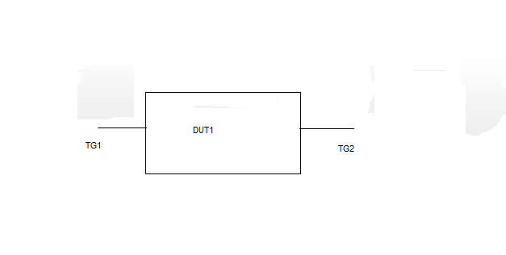

#  SQA Test Plan
#  Klish debugsh cli
#  SONiC 4.0.0 Release

## Test Plan Revision History

| Rev  | Date       | Author          | Change Description |
| ---- | ---------- | --------------- | ------------------ |
| 0.1  | 5/31/2021  | Kesava Swamy K  | Initial Version    |
| 0.2  | 6/3/2021   | Kesava Swamy K  | Corrected the directory path and made changes as per update in HLD |

## List of Reviewers

| Function | Name |
| :------: | :--: |
|    QA      |   Chandra Bhushan Singh   |
|    DEV     |   Arun Barboza    |

## List of Approvers

| Function | Name | Date Approved |
| :------: | :--: | :-----------: |
|          |      |               |

## Definition/Abbreviation

| **Term** | **Meaning**                |
| -------- | -------------------------- |
|          |                            |

## Feature Overview

  This feature provides the framework to execute debugsh CLI commands from sonic-cli/Klish Cli.

## 1 Test Focus Areas
 - This test plan covers the verification of execution of below debugsh CLI commands(mentioned in HLD) from sonic-cli. Under each command's help there may be multiple options and corresponding sub options. We cover the execution of each command with that main option and one or two sub options to that main option.
 - Test Script compares the output of the command form sonic-cli to that from Linux prompt/debugsh shell and reports the test result.  
        sonic-cli# debug shell  
        sonic-cli(debugsh)# show system internal <tab>  
        sonic-cli(debugsh)#  
        sonic-cli(debugsh)# show system internal vxlanmgr global  
         
        VxlanHwCapability Enable  
        Feature Capability: Vxlan(Enable) Vlan_Vni_Num(4096)  
         
        ============== Pending Request Count===============  
        tunnel_map:0 nvo:0 tunnel:0 vnet:0  
        sonic-cli(debugsh)#  
        sonic-cli(debugsh)# debug system internal logger aclsvcd level info  
        sonic-cli(debugsh)#  
        sonic-cli(debugsh)# clear system internal vlan ifp  
        sonic-cli(debugsh)#   
        sonic-cli(debugsh)# timeout 2  
        sonic-cli(debugsh)#  

## 2 Topologies

 

#### 								Topology 1

## 3 Test Case and objectives

### 3.1 Functional Test Cases

#### 3.1.1 Verification of command execution "show system internal <>" in debugsh shell in Klish CLI.

| **Test ID**    | **debugsh_sonic_001**                                               |
| -------------- | :----------------------------------------------------------- |
| **Test Name**  | **Verification of command execution "show system internal <>" in debugsh shell in Klish CLI.**      |
| **Test Setup** | **Topology 1**                                               |
| **Type**       | **Functional**                                               |
| **Steps**      | 1. In Klish CLI, enter into "debugsh" shell and execute the command "show system internal <>" with each possible option and sub options.   2. Check that command is executed successfully.  3. Capture the output of each command.  4. Execute the same commands in Linux CLI in debugsh mode and capture the output.  5. Verify that outputs of each command is same in both Klish CLI and Linux CLI.  6. Execute the command with invalid options and verify that command execution is rejected.|

#### 3.1.2 Verification of command execution "debug system internal <>" in debugsh shell in sonic-cli/Klish Cli.

| **Test ID**    | **debugsh_sonic_002**                                               |
| -------------- | :----------------------------------------------------------- |
| **Test Name**  | **Verification of command execution "debug system internal <>" in debugsh shell in Klish CLI.**      |
| **Test Setup** | **Topology 1**                                               |
| **Type**       | **Functional**                                               |
| **Steps**      | 1. In Klish CLI, enter into "debugsh" shell and execute the command "debug system internal <>" with each possible option and sub options.   2. Check that command is executed successfully.  3. Capture the output of each command.  4. Execute the same commands in Linux CLI in debugsh mode and capture the output.  5. Verify that outputs of each command is same in both Klish CLI and Linux CLI.  6. Execute the command with invalid options and verify that command execution is rejected.|

#### 3.1.3 Verification of command execution "clear system internal <>" in debughsh shell in Klish CLI.

| **Test ID**    | **debugsh_sonic_003**                                               |
| -------------- | :----------------------------------------------------------- |
| **Test Name**  | **Verification of command execution "clear system internal <>" in debughsh shell in Klish CLI.**      |
| **Test Setup** | **Topology 1**                                               |
| **Type**       | **Functional**                                               |
| **Steps**      | 1. In Klish CLI, enter into "debugsh" shell and execute the command "clear system internal" with each possible option and sub options.   2. Check that command is executed successfully.  3. Capture the output of each command.  5. Execute the same commands in Linux CLI in debugsh mode and capture the output.  4. Verify that outputs of each command is same in both Klish CLI and Linux CLI.  6. Execute the command with invalid options and verify that command execution is rejected.|

#### 3.1.4 Verification of command execution "show system internal debugsh backend cmdtree <>" in debugsh shell in Klish CLI.

| **Test ID**    | **debugsh_sonic_004**                                               |
| -------------- | :----------------------------------------------------------- |
| **Test Name**  | **Verification of command execution "show system internal debugsh backend cmdtree <>" in debugsh shell in Klish CLI.**      |
| **Test Setup** | **Topology 1**                                               |
| **Type**       | **Functional**                                               |
| **Steps**      | 1. In Klish CLI, enter into "debugsh" shell and execute the command "show system internal debugsh backend cmdtree" with each possible option and sub options.   2. Check that command is executed successfully.  3. Capture the output of each command.  4. Execute the same commands in Linux CLI in debugsh mode and capture the output.  5. Verify that outputs of each command is same in both Klish CLI and Linux CLI.  6. Execute the command with invalid options and verify that command execution is rejected.|

#### 3.1.5 Verification of command execution "timeout <1-180>" in debugsh shell in Klish CLI.

| **Test ID**    | **debugsh_sonic_005**                                               |
| -------------- | :----------------------------------------------------------- |
| **Test Name**  | **Verification of command execution "timeout <1-180>" in debugsh shell in Klish CLI.**      |
| **Test Setup** | **Topology 1**                                               |
| **Type**       | **Functional**                                               |
| **Steps**      | 1. In Klish CLI, enter into "debugsh" shell and execute the command "timeout <1-180>" with each possible option and sub options.   2. Check that command is executed successfully.  3. Capture the output of each command.  4. Execute the same commands in Linux CLI in debugsh mode and capture the output.  5. Verify that outputs of each command is same in both Klish CLI and Linux CLI.  6. Execute the command with invalid options and verify that command execution is rejected.|

### 3.4 Management

#### 3.4.1 REST

##### 3.4.1.1 Verify the debugsh supported commands via REST.

| **Test ID**    | **debugsh_sonic_006**                                              |
| -------------- | ------------------------------------------------------------ |
| **Test Name**  | **Verify the debugsh supported commands via REST.** |
| **Test Setup** | **Topology 1**                                               |
| **Type**       | **Functional**                                               |
| **Steps**      | This test case will be covered implicitly in REST run.|

## Reference Links
HLD - https://github.com/BRCM-SONIC/sonic_doc_private/pull/205/files/a54e8812c2bdf59836ceaa44b0fbb510c88c79b4#diff-21787d9be61858381372a0833ded648ae10d5b79b4f54d88eeaf1c22e93e163d

