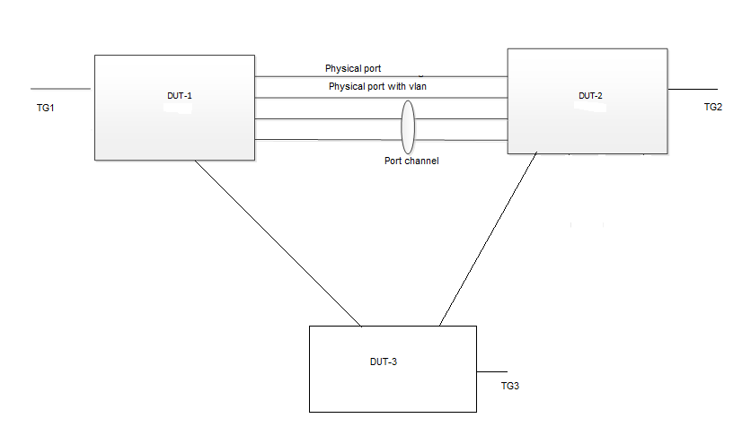

#  SQA Test Plan
#  Link Flap Error Disable
#  SONiC 4.0.0 Release

## Test Plan Revision History

| Rev  | Date       | Author          | Change Description |
| ---- | ---------- | --------------- | ------------------ |
| 0.1  | 5/28/2021 | Kesava Swamy K   | Initial Version    |
| 0.2  | 5/31/2021 |                  | Removed unsupported tests as per latest update in HLD              |

## List of Reviewers

| Function | Name |
| :------: | :--: |
|    QA      |   Chandra Bhushan Singh   |
|    DEV     |   Steven Lu    |

## List of Approvers

| Function | Name | Date Approved |
| :------: | :--: | :-----------: |
|          |      |               |

## Definition/Abbreviation

| **Term** | **Meaning**                |
| -------- | -------------------------- |
|          |                            |

## Feature Overview

  The Port Link Flap Error Disable feature prevent excessive interface flapping events from adversely affecting routing protocols and routing tables in the network. Suppressing port state change events to protect the system resources. More details in HLD.

## 1 Test Focus Areas

### 1.1 CLI Testing 

  - Validation of CLI config command "link-error-disable flap-threshold sampling-interval recovery-interval" to configure the feature on interface level.
  - Validation of CLI config command "link-error-disable flap-threshold sampling-interval recovery-interval" to enable the feature on interface range mode.
  - Validation of CLI show command "show errdisable link-flap" and "show errdisable recovery".

### 1.2 Functional Testing

  - Verify that with Link Flap Error Disable default config on that physical interface, port goes down (or suppressed) when port flaps occur and comes up(or  released ) after recovery-interval expire.
  - Verify that with Link Flap Error Disable non-default config on that physical interface, port goes down (or suppressed) when port flaps occur and comes up(or  released ) after recovery-interval expire.
  - Verify that with Link Flap Error Disable recovery-interval is set to 0, port remains in operationally down state until administrator overrides it.
  - Verify that with Link Flap Error Disable flap-threshold is set to 1, port goes down (or suppressed) immediately after one port flap (one time up to down).
  - Verify that corresponding syslog is generated when port is suppressed or released by Link Flap Error Disable.
  - Verify that after config/un config of Link Flap Error Disable feature on the interface, port gets suppressed/released correctly as per config.
  - Verify the Port Channel interface (with 2 member ports) status is properly updated when both member ports are suppressed/released by Link Flap Error Disable.
  - Verify that on a port routing interface ARP/ND, static routes and dynamic routes are removed(/added) and IPv4/IPv6 traffic stops(/resume) forwarding when the port gets suppressed(/released) by Link Flap Error Disable.
  - Verify that on a port channel routing interface ARP/ND, static routes and dynamic routes are removed(/added) and IPv4/IPv6 traffic stops(/resume) forwarding when both the member ports gets suppressed(/released) by Link Flap Error Disable.
  - Verify that on a Vlan routing interface ARP/ND, static routes and dynamic routes are removed(/added) and IPv4/IPv6 traffic stops(/resume) forwarding when port associated to that Vlan gets suppressed(/released) by Link Flap Error Disable.
  - Verify the Vlan Autostate status when Vlan member port is suppressed/released by Link Flap Error Disable.
  - Verify that with different Link Flap Error Disable interface level configs on multiple interfaces, each port gets suppressed/released as per that specific interface configuration.
  - Verify the MCLAG state and peer-link state when the peer-link port channel member port is suppressed/released by Link Flap Error Disable.
  - Verify that with RPVST running between the DUTs, STP port states are updated accordingly when the Designated forwarding port and Root ports are suppressed by Link Flap Error Disabled.
  - Verify that with PVST running between the DUTs, STP port states are updated accordingly when the Designated forwarding port and Root ports are suppressed by Link Flap Error Disabled.
  - Verify that with MSTP running between the DUTs, STP port states are updated accordingly when the Designated forwarding port and Root ports are suppressed by Link Flap Error Disabled.
  - Verify the UDLD state update accordingly when the port gets suppressed or released by the Link Flap Error Disable.
  - Verify the MAC learning and L2 traffic forwarding after port is suppressed and released by Link Flap Error Disable.
  - Verify the port operational state after continuous port flaps for two consecutive recovery-interval (non-default value).
  - Verify the port state after warm boot, with warm boot is performed when the port is in suppressed state with non zero recovery-interval greater than warm boot time.
  - Verify the port state after warm boot, with warm boot is performed when the port is in suppressed state with non zero recovery-interval less than warm boot time.
  - Verify the Link Flap Error Disable functionality after Reboot/FastReboot.
  - Verify that there is no memory leak with Link Flap Error Disable feature enabled and continuous port flaps are performed on the interface. 
  - Verify that user should not be allowed to configure the Link Flap Error Disable on port channel interface and vlan interfaces.
  - Verify the Link Flap Error Disable feature via REST.  

## 2 Topologies

 

#### 								Topology 1
Topology Description -
 - Minimum 4 back to back links are required between DUT1-DUT2, and these links will be used as physical ports, or Vlan associated ports or port channel interfaces based on the test case requirement.
 - In case of L3 traffic related test, corresponding dynamic protocol or static routes will be configured.
 - For MCLAG peer-link port state validation after Link Flap Error Disable, DUT3 will be sued as MCLAG client, and corresponding MCLAG port channel and other client Vlan will be configured in the respective test cases.

## 3 Test Case and objectives

### 3.1 CLI Test Cases

#### 3.1.1 Validate CLI config command "link-error-disable flap-threshold sampling-interval recovery-interval" to configure the feature on interface level. 

| **Test ID**    | **LinkFlapErrorDisable_CLI_001**                                               |
| -------------- | :----------------------------------------------------------- |
| **Test Name**  | **Validate CLI command "link-error-disable flap-threshold sampling-interval recovery-interval" to configure the feature on interface level.**      |
| **Test Setup** | **Topology 1**                                               |
| **Type**       | **CLI**                                               |
| **Steps**      | 1. Validate CLI options for command "link-error-disable flap-threshold sampling-interval recovery-interval" interface level".   2. Check the running-config is updated correctly.|

#### 3.1.2 Validate CLI command "link-error-disable flap-threshold sampling-interval recovery-interval" to configure the feature on interface range mode. 

| **Test ID**    | **LinkFlapErrorDisable_CLI_002**                                               |
| -------------- | :----------------------------------------------------------- |
| **Test Name**  | **Validate CLI command "link-error-disable flap-threshold sampling-interval recovery-interval" to configure the feature on interface range mode.**|
| **Test Setup** | **Topology 1**                                               |
| **Type**       | **CLI**                                               |
| **Steps**      | 1. Validate CLI options for command "link-error-disable flap-threshold sampling-interval recovery-interval" to configure the feature on interface range mode.  2. Check the running-config is updated correctly.|

#### 3.1.3 Validation of CLI show command "show errdisable link-flap" and "show errdisable recovery". 

| **Test ID**    | **LinkFlapErrorDisable_CLI_003**                                               |
| -------------- | :----------------------------------------------------------- |
| **Test Name**  | **Validation of CLI show command "show errdisable link-flap" and "show errdisable recovery".**|
| **Test Setup** | **Topology 1**                                               |
| **Type**       | **CLI**                                               |
| **Steps**      | 1. Validate CLI options for show commands "show errdisable link-flap" and "show errdisable recovery".|

### 3.2 Functional Test Cases

#### 3.2.1 Verify that with Link Flap Error Disable default config on that physical interface, port goes down (or suppressed) when port flaps occur and comes up(or  released ) after recovery-interval expire.  

| **Test ID**    | **LinkFlapErrorDisable_Func_001**                                               |
| -------------- | :----------------------------------------------------------- |
| **Test Name**  | **Verify that with Link Flap Error Disable default config on that physical interface, port goes down (or suppressed) when port flaps occur and comes up(or  released ) after recovery-interval expire.** |
| **Test Setup** | **Topology 1**                                               |
| **Type**       | **Functional**                                               |
| **Steps**      | 1. In DUT1, enable/configure the Link Flap Error Disable feature on the physical port (d1port1) with default values for flap-threshold, sampling-interval and recovery-interval.  2. In DUT2, perform port flaps (shut/no shut) on the corresponding port (d2port1, that is connected to DUT1 port) as per flap-threshold and sampling-interval configured on d1port1.  3. Verify that d1port1 gets suppressed and port operational state moved to Down. Verify that "show errdisable recovery" and "show errdisable link-flap" commands shows the correct status for that interface.  4. Wait until the recovery-interval expire, and verify that port gets released and port operational state is UP now. Verify that "show errdisable recovery" and "show errdisable link-flap" commands shows the correct status for that interface.  5. In DUT2, perform port flaps again but not as per flap-threshold and sampling-interval configured on d1port1.  6. Verify that now d1port1 don't get suppressed as the port flaps didn't occur as per the default config parameters. Verify that "show errdisable recovery" and "show errdisable link-flap" commands shows the correct status for that interface.|

#### 3.2.2 Verify that with Link Flap Error Disable non-default config on that physical interface, port goes down (or suppressed) when port flaps occur and comes up(or  released ) after recovery-interval expire.  

| **Test ID**    | **LinkFlapErrorDisable_Func_002**                                               |
| -------------- | :----------------------------------------------------------- |
| **Test Name**  | **Verify that with Link Flap Error Disable non-default config on that physical interface, port goes down (or suppressed) when port flaps occur and comes up(or  released ) after recovery-interval expire.** |
| **Test Setup** | **Topology 1**                                               |
| **Type**       | **Functional**                                               |
| **Steps**      | 1. In DUT1, enable/configure the Link Flap Error Disable feature on the physical port (d1port1) and configure non-default values for flap-threshold, sampling-interval and recovery-interval.  2. In DUT2, perform port flaps (shut/no shut) on the corresponding port (d2port1, that is connected to DUT1 port) as per flap-threshold and sampling-interval configured on d1port1.  3. Verify that d1port1 gets suppressed and port operational state moved to Down. Verify that "show errdisable recovery" and "show errdisable link-flap" commands shows the correct status for that interface.  4. Wait until the recovery-interval expire, and verify that port gets released and port operational state is UP now. Verify that "show errdisable recovery" and "show errdisable link-flap" commands shows the correct status for that interface.  5. In DUT2, perform port flaps again but not as per flap-threshold and sampling-interval configured on d1port1.  6. Verify that now d1port1 don't get suppressed as the port flaps didn't occur as per the configured values to parameters. Verify that "show errdisable recovery" and "show errdisable link-flap" commands shows the correct status for that interface.|

#### 3.2.3 Verify that with Link Flap Error Disable recovery-interval is set to 0, port remains in operationally down state until administrator overrides it.

| **Test ID**    | **LinkFlapErrorDisable_Func_003**                                               |
| -------------- | :----------------------------------------------------------- |
| **Test Name**  | **Verify that with Link Flap Error Disable recovery-interval is set to 0, port remains in operationally down state until administrator overrides it.** |
| **Test Setup** | **Topology 1**                                               |
| **Type**       | **Functional**                                               |
| **Steps**      | 1. In DUT1, enable/configure the Link Flap Error Disable feature on the physical port (d1port1) with non-default values for flap-threshold (say 5), recovery-interval(say 10) and sampling-interval (10).  2. In DUT2, perform port flaps (shut/no shut) on the corresponding port (d2port1, that is connected to DUT1 port) as per flap-threshold (5 up-to-down events) in 10 seconds.  3. Verify that d1port1 gets suppressed and port operational state moved to Down.  4. Wait until the recovery-interval (10 sec) expire, and verify that port gets released and port operational state is UP now.  5. Change the recovery-interval to 0. And in DUT2, perform port flaps again as per flap-threshold(5 up-to-down events) in 10 sec.  6. Verify that d1port1 get suppressed and port state moved to operational Down state.  7. Wait for 10 sec, verify that port operational state is still Down.  8.  Verify that "show errdisable recovery" and "show errdisable link-flap" commands shows the correct status for that interface.  9. Perform shut no shut on the interface, and then verify that interface is operationally UP.  10. In DUT2, perform port flaps again as per flap-threshold(5 up-to-down events) in 10 sec.  6. Verify that d1port1 get suppressed and port state moved to operational Down state.  7. Wait for 10 sec, verify that port operational state is still Down.  8.  Verify that "show errdisable recovery" and "show errdisable link-flap" commands shows the correct status for that interface.  9. Remove the Link Flap Error Disable config on the interface, and then verify that interface is operationally UP.|

#### 3.2.4 Verify that with Link Flap Error Disable flap-threshold is set to 1, port goes down (or suppressed) immediately after one port flap (one time up to down).

| **Test ID**    | **LinkFlapErrorDisable_Func_004**                                               |
| -------------- | :----------------------------------------------------------- |
| **Test Name**  | **Verify that with Link Flap Error Disable flap-threshold is set to 1, port goes down (or suppressed) immediately after one port flap (one time up to down).** |
| **Test Setup** | **Topology 1**                                               |
| **Type**       | **Functional**                                               |
| **Steps**      | 1. In DUT1, enable/configure the Link Flap Error Disable feature on the physical port (d1port1) with non-default values for recovery-interval(say 10), sampling-interval (10) and flap-threshold to 1.  2. In DUT2, perform one time port flaps (shut/no shut) on the corresponding port (d2port1, that is connected to DUT1 port) in 10 seconds.  3. Verify that d1port1 gets suppressed and port operational state moved to Down.  4.  Verify that "show errdisable recovery" and "show errdisable link-flap" commands shows the correct status for that interface.  5. Wait until the recovery-interval (10 sec) expire, and verify that port gets released and port operational state is UP now.  6. Change flap-threshold to 5. And in DUT2, perform one time port flaps (shut/no shut) on the corresponding port (d2port1, that is connected to DUT1 port) in 10 seconds.  7. Verify that d1port1 don't get suppressed and port state not moved to operational Down state.  8. Verify that "show errdisable recovery" and "show errdisable link-flap" commands shows the correct status for that interface.  9. Wait for 10 sec, verify that port operational state moved to UP.|

#### 3.2.5 Verify that corresponding syslog is generated when port is suppressed or released by Link Flap Error Disable.

| **Test ID**    | **LinkFlapErrorDisable_Func_005**                                               |
| -------------- | :----------------------------------------------------------- |
| **Test Name**  | **Verify that corresponding syslog is generated when port is suppressed or released by Link Flap Error Disable.** |
| **Test Setup** | **Topology 1**                                               |
| **Type**       | **Functional**                                               |
| **Steps**      | 1. In DUT1, enable/configure the Link Flap Error Disable feature on the physical port (d1port1) with non-default values for recovery-interval, sampling-interval and flap-threshold  2. In DUT2, perform one time port flaps (shut/no shut) on the corresponding port (d2port1, that is connected to DUT1 port) as per flap-threshold and sampling interval.  3. Verify that d1port1 gets suppressed and port operational state moved to Down.  4.  Verify that in syslog, a proper log message is generated informing the port state going down due to link flap error disable.  5. Wait until the recovery-interval expire, and verify that port gets released and port operational state is UP now.  6. Verify that in syslog, a proper log message is generated informing the port state going up due to link flap error disable recovery-interval expire.|

#### 3.2.6 Verify that after config/un config of Link Flap Error Disable feature on the interface, port gets suppressed/released correctly as per config.

| **Test ID**    | **LinkFlapErrorDisable_Func_006**                                               |
| -------------- | :----------------------------------------------------------- |
| **Test Name**  | **Verify that after config/un config of Link Flap Error Disable feature on the interface, port gets suppressed/released correctly as per config.** |
| **Test Setup** | **Topology 1**                                               |
| **Type**       | **Functional**                                               |
| **Steps**      | 1. In DUT1, enable/configure the Link Flap Error Disable feature on the physical port (d1port1) with non-default values for recovery-interval, sampling-interval and flap-threshold  2. In DUT2, perform one time port flaps (shut/no shut) on the corresponding port (d2port1, that is connected to DUT1 port) as per flap-threshold and sampling interval.  3. Verify that d1port1 gets suppressed and port operational state moved to Down.  4. Verify that "show errdisable link-flap" commands shows the correct status for that interface.  5. Wait until the recovery-interval expire, and verify that port gets released and port operational state is UP now.  6. Remove the config on the interface and re configure with same values.  7. Repeat the steps from 2 to 5, check results are same as previous.|

#### 3.2.7 Verify the Port Channel interface (with 2 member ports) status is properly updated when both member ports are suppressed/released by Link Flap Error Disable.

| **Test ID**    | **LinkFlapErrorDisable_Func_007**                                               |
| -------------- | :----------------------------------------------------------- |
| **Test Name**  | **Verify the Port Channel interface (with 2 member ports) status is properly updated when both member ports are suppressed/released by Link Flap Error Disable.** |
| **Test Setup** | **Topology 1**                                               |
| **Type**       | **Functional**                                               |
| **Steps**      | 1. In DUT1, enable/configure the Link Flap Error Disable feature on the physical ports (d1port1, d1port2 - members of port channel interface) with non-default values for recovery-interval, sampling-interval and flap-threshold  2. In DUT2, perform port flaps (shut/no shut) on the corresponding ports (d2port1, d2port2, that is connected to DUT1 port) as per flap-threshold and sampling interval.  3. Verify that d1port1, d1port2 ports gets suppressed and port operational state moved to Down.  4. Verify that "show errdisable link-flap" commands shows the correct status for those interfaces.  5. Verify that port channel interface is Down.  6. Wait until the recovery-interval expire, and verify that both the ports gets released and port operational state is UP now.  7. Verify that port channel is UP, and verify that "show errdisable link-flap" commands shows the correct status for those interfaces.  8. In DUT2, perform port flaps (shut/no shut) on the corresponding port (d2port2, that is connected to DUT1 port) as per flap-threshold and sampling interval.  9. Verify that d1port2 (not d1port1) port gets suppressed and port operational state not moved to Down state as only one port is down.  10. Verify that "show errdisable link-flap" commands shows the correct status for those interfaces.  11. Verify that port d1port2 is UP after recovery-interval expire and port channel state should not change.  12. Send Learned traffic through this port channel and check that traffic forward successfully and interface counters and port channel counters should updated correctly.|

#### 3.2.8 Verify that on a port routing interface ARP/ND, static routes and dynamic routes are removed(/added) and IPv4/IPv6 traffic stops(/resume) forwarding when that physical port gets suppressed(/released) by Link Flap Error Disable.

| **Test ID**    | **LinkFlapErrorDisable_Func_008**                                               |
| -------------- | :----------------------------------------------------------- |
| **Test Name**  | **Verify that on a port routing interface ARP/ND, static routes and dynamic routes are removed(/added) and IPv4/IPv6 traffic stops(/resume) forwarding when that physical port gets suppressed(/released) by Link Flap Error Disable.** |
| **Test Setup** | **Topology 1**                                               |
| **Type**       | **Functional**                                               |
| **Steps**      | 1. Configure port routing interface between the DUTs with IPv4/IPv6 address.  2. Establish IPv4/IPv6 BGP neighborship.   3. Configure a Ipv4/Ipv6 static route in DUT1 with next hop as port routing interface, check that IPv4/IPv6 route table is updated with this route.  4. configure a loopback interface with IPv4/IPv6 address in DUT2, redistribute it in BGP. Check this IPv4/IPv6 route is learned and updated in DUT1 route table via Vlan routing interface as next hop.   5. Do ping from DUT2 to the IPv4/IPv6 address, check that ARP/ND table updated with egress interface as port routing interface.  6. Send IPv4/IPv6 traffic from TG1 to TG2 such that traffic forwards via port routing interface.  7. In DUT1, enable/configure the Link Flap Error Disable feature on the physical port (d1port1- member port of that Vlan) with non-default values for recovery-interval, sampling-interval and flap-threshold  8. In DUT2, perform port flaps (shut/no shut) on the corresponding port (d2port1 that is connected to DUT1 port) as per flap-threshold and sampling interval.  9. Verify that d1port1, port gets suppressed and port operational state moved to Down.  10. Verify that "show errdisable link-flap" commands shows the correct status for that interface.  11. In DUT1, verify that port routing interface is Down. Corresponding ARP/ND entries are removed. BGP peers are Down, and corresponding static and dynamic routes are removed from route table.  12. Wait until the recovery-interval expire, and verify that the port gets released and is UP.  13.  Verify that "show errdisable link-flap" commands shows the correct status for that interface.  14. In DUT1, verify that port routing interface is UP, corresponding ARP/ND table are updated, BGP peers are UP and route table also updated with static and dynamic routes.  15. Send the traffic again and check that traffic is forwarded successful via port routing interface and check that interface counters also getting updated properly.|

#### 3.2.9 Verify that on a port channel routing interface ARP/ND, static routes and dynamic routes are removed(/added) and IPv4/IPv6 traffic stops(/resume) forwarding when both the member ports gets suppressed(/released) by Link Flap Error Disable.

| **Test ID**    | **LinkFlapErrorDisable_Func_009**                                               |
| -------------- | :----------------------------------------------------------- |
| **Test Name**  | **Verify that on a port channel routing interface ARP/ND, static routes and dynamic routes are removed(/added) and IPv4/IPv6 traffic stops(/resume) forwarding when both the member ports gets suppressed(/released) by Link Flap Error Disable.** |
| **Test Setup** | **Topology 1**                                               |
| **Type**       | **Functional**                                               |
| **Steps**      | 1. Configure port channel (with 2 member ports) routing interface between the DUTs with IPv4/IPv6 address.  2. Establish IPv4/IPv6 BGP neighborship.   3. Configure a Ipv4/Ipv6 static route in DUT1 with next hop as port channel routing interface, check that IPv4/IPv6 route table is updated with this route.  4. configure a loopback interface with IPv4/IPv6 address in DUT2, redistribute it in BGP. Check this IPv4/IPv6 route is learned and updated in DUT1 route table via port channel routing interface as next hop.   5. Do ping from DUT2 to the IPv4/IPv6 address, check that ARP/ND table updated with egress interface as port channel interface.  6. Send IPv4/IPv6 traffic from TG1 to TG2 such that traffic forwards via port channel routing interface.  7. In DUT1, enable/configure the Link Flap Error Disable feature on the physical ports (d1port1, d1port2 - members of port channel interface) with non-default values for recovery-interval, sampling-interval and flap-threshold  8. In DUT2, perform port flaps (shut/no shut) on the corresponding ports (d2port1, d2port2, that is connected to DUT1 port) as per flap-threshold and sampling interval.  9. Verify that d1port1, d1port2 ports gets suppressed and port operational state moved to Down.  10. Verify that "show errdisable link-flap" commands shows the correct status for those interfaces.  11. In DUT1, verify that port channel routing interface is Down. Corresponding ARP/ND entries are removed. BGP peers are Down, and corresponding static and dynamic routes are removed from route table.  12. Wait until the recovery-interval expire, and verify that both the ports gets released and port operational state is UP now.  13.  Verify that "show errdisable link-flap" commands shows the correct status for those interfaces.  14. In DUT1, verify that port channel routing interface is UP, corresponding ARP/ND table are updated, BGP peers are UP and route table also updated with static and dynamic routes.  15. Send the traffic again and check that traffic is forwarded successful via port channel routing interface.|

#### 3.2.10 Verify that on a Vlan routing interface ARP/ND, static routes and dynamic routes are removed(/added) and IPv4/IPv6 traffic stops(/resume) forwarding when port associated to that Vlan gets suppressed(/released) by Link Flap Error Disable.

| **Test ID**    | **LinkFlapErrorDisable_Func_010**                                               |
| -------------- | :----------------------------------------------------------- |
| **Test Name**  | **Verify that on a Vlan routing interface ARP/ND, static routes and dynamic routes are removed(/added) and IPv4/IPv6 traffic stops(/resume) forwarding when port associated to that Vlan gets suppressed(/released) by Link Flap Error Disable.** |
| **Test Setup** | **Topology 1**                                               |
| **Type**       | **Functional**                                               |
| **Steps**      | 1. Configure Vlan routing interface between the DUTs with IPv4/IPv6 address.  2. Establish IPv4/IPv6 BGP neighborship.   3. Configure a Ipv4/Ipv6 static route in DUT1 with next hop as Vlan routing interface, check that IPv4/IPv6 route table is updated with this route.  4. configure a loopback interface with IPv4/IPv6 address in DUT2, redistribute it in BGP. Check this IPv4/IPv6 route is learned and updated in DUT1 route table via Vlan routing interface as next hop.   5. Do ping from DUT2 to the IPv4/IPv6 address, check that ARP/ND table updated with egress interface as Vlan routing interface.  6. Send IPv4/IPv6 traffic from TG1 to TG2 such that traffic forwards via Vlan routing interface.  7. In DUT1, enable/configure the Link Flap Error Disable feature on the physical port (d1port1- member port of that Vlan) with non-default values for recovery-interval, sampling-interval and flap-threshold  8. In DUT2, perform port flaps (shut/no shut) on the corresponding port (d2port1 that is connected to DUT1 port) as per flap-threshold and sampling interval.  9. Verify that d1port1, port gets suppressed and port operational state moved to Down.  10. Verify that "show errdisable link-flap" commands shows the correct status for that interface.  11. In DUT1, verify that Vlan routing interface is Down. Corresponding ARP/ND entries are removed. BGP peers are Down, and corresponding static and dynamic routes are removed from route table.  12. Wait until the recovery-interval expire, and verify that the port gets released and is UP.  13.  Verify that "show errdisable link-flap" commands shows the correct status for that interface.  14. In DUT1, verify that Vlan routing interface is UP, corresponding ARP/ND table are updated, BGP peers are UP and route table also updated with static and dynamic routes.  15. Send the traffic again and check that traffic is forwarded successful via Vlan routing interface and check that interface counters are also getting updated.|

#### 3.2.11 Verify the Vlan Autostate status when vlan member port is suppressed/released by Link Flap Error Disable.

| **Test ID**    | **LinkFlapErrorDisable_Func_011**                                               |
| -------------- | :----------------------------------------------------------- |
| **Test Name**  | **Verify the Vlan Autostate status when Vlan member port is suppressed/released by Link Flap Error Disable.** |
| **Test Setup** | **Topology 1**                                               |
| **Type**       | **Functional**                                               |
| **Steps**      | 1. Vlan autostate is enabled by default.  2. Create a Vlan and associate a port (d1port1) to that Vlan, verify Vlan status as active.  3. Enable/Configure Link Flap Error Disable on that port with non-default values for sampling-interval, flap-threshold and recovery-interval.  4. In DUT2, perform port flaps (shut/no shut) on the corresponding port (d2port1 that is connected to DUT1 port) as per flap-threshold and sampling-interval.  5. Verify that d1port1, port gets suppressed and port operational state moved to Down.  6. Verify that "show errdisable link-flap" command shows the correct status for that interface.  7. Verify that corresponding Vlan become in active. Now disable autostate on that port, check that Vlan become active as autostate is disabled.  8. Check that recovery-interval, port is operationally UP and Vlan is active.  9. Re enable autostate and check that vlan status is active only.|

#### 3.2.12 Verify that with different Link Flap Error Disable interface level configs on multiple interfaces, each port gets suppressed/released as per that specific interface configuration.

| **Test ID**    | **LinkFlapErrorDisable_Func_012**                                               |
| -------------- | :----------------------------------------------------------- |
| **Test Name**  | **Verify that with different Link Flap Error Disable interface level configs on multiple interfaces, each port gets suppressed/released as per that specific interface configuration.** |
| **Test Setup** | **Topology 1**                                               |
| **Type**       | **Functional**                                               |
| **Steps**      | 1. Configure/enable Link Flap Error Disable with different non-default values on multiple interfaces (configure different set of configs on all interfaces (including interface that are not UP) using a range command).  2. In DUT2, perform the port flaps (shut/no shut) on the corresponding ports (connected to DUT1 ports) as per the configured flap-threshold and sampling-interval on those corresponding interfaces in DUT1.  3. Verify that ports in DUT1 are moved to down state and the status is updated properly under "show errdisable link-flap" command.  4. Wait until the corresponding recovery-interval of those ports expire, and verify that the port gets released and is UP and link flap error disable status is properly updated under "show errdisable link-flap" command.|

#### 3.2.13 Verify the MCLAG state and peer-link state when the peer-link port channel member port is suppressed/released by Link Flap Error Disable.

| **Test ID**    | **LinkFlapErrorDisable_Func_013**                                               |
| -------------- | :----------------------------------------------------------- |
| **Test Name**  | **Verify the MCLAG state and peer-link state when the peer-link port channel member port is suppressed/released by Link Flap Error Disable.** |
| **Test Setup** | **Topology 1**                                               |
| **Type**       | **Functional**                                               |
| **Steps**      | 1. Configure MCLAG between DUT1-DUT2 with port channel as peer-link with DUT-3 as MCLAG client.  2. In DUT1, enable/configure the Link Flap Error Disable feature on the physical ports (d1port1, d1port2 - members of port channel interface) with non-default values for recovery-interval, sampling-interval and flap-threshold  3. In DUT2, perform port flaps (shut/no shut) on the corresponding ports (d2port1, d2port2, that is connected to DUT1 port) as per flap-threshold and sampling interval.  4. Verify that d1port1, d1port2 ports gets suppressed and port operational state moved to Down.  5. Verify that "show errdisable link-flap" commands shows the correct status for those interfaces.  6. Verify that port channel interface is Down and the peer-link also operationally down.  7. Wait until the recovery-interval expire, and verify that both the ports gets released and port operational state is UP now.  8. Verify that port channel is UP and peer-link also comes UP.  9.  Verify that "show errdisable link-flap" commands shows the correct status for those interfaces.  10. Check the traffic forwarding after peer-link is UP.|

#### 3.2.14 Verify that with RPVST running between the DUTs, STP port states are updated accordingly when the Designated forwarding port and Root ports are suppressed by Link Flap Error Disabled.

| **Test ID**    | **LinkFlapErrorDisable_Func_014**                                               |
| -------------- | :----------------------------------------------------------- |
| **Test Name**  | **Verify that with RPVST running between the DUTs, STP port states are updated accordingly when the Designated forwarding port and Root ports are suppressed/released by Link Flap Error Disabled.** |
| **Test Setup** | **Topology 1**                                               |
| **Type**       | **Functional**                                               |
| **Steps**      | 1. Run RPVST between the DUTs after convergence happened, configure/enable Link Flap Error Disable on the designated port on root device/or non-root device having designated port.  2. Perform port flaps from the partner DUT as per configured flap-threshold and sampling-interval.  3. Verify that the designated port gets suppressed by Link Flap Error Disable and port is operationally Down.  4. Verify that STP gets converged accordingly and port states are updated correctly.  5. Verify that "show errdisable link-flap" commands shows the correct status for those interfaces.  6. After recovery-interval is completed, verify that port gets released and operationally UP.  7. Verify that STP gets converged and port states updated accordingly.  8. Configure/enable Link Flap Error Disable on the Root port on non-root device.  9. Perform port flaps from the partner DUT as per cofnigured flap-threshold and sampling-interval.  10. Verify that the Root port gets suppressed by Link Flap Error Disable and port is operationally Down.  11. Verify that STP gets converged accordingly and port states are updated correctly.  12. Verify that "show errdisable link-flap" commands shows the correct status for those interfaces.  13. After recovery-interval is completed, verify that port gets released and operationally UP.  14. Verify that STP gets converged and port states updated accordingly.|

#### 3.2.15 Verify that with PVST running between the DUTs, STP port states are updated accordingly when the Designated forwarding port and Root ports are suppressed by Link Flap Error Disabled.

| **Test ID**    | **LinkFlapErrorDisable_Func_015**                                               |
| -------------- | :----------------------------------------------------------- |
| **Test Name**  | **Verify that with PVST running between the DUTs, STP port states are updated accordingly when the Designated forwarding port and Root ports are suppressed/released by Link Flap Error Disabled.** |
| **Test Setup** | **Topology 1**                                               |
| **Type**       | **Functional**                                               |
| **Steps**      | 1. Run PVST between the DUTs after convergence happened, configure/enable Link Flap Error Disable on the designated port on root device/or non-root device having designated port.  2. Perform port flaps from the partner DUT as per configured flap-threshold and sampling-interval.  3. Verify that the designated port gets suppressed by Link Flap Error Disable and port is operationally Down.  4. Verify that STP gets converged accordingly and port states are updated correctly.  5. Verify that "show errdisable link-flap" commands shows the correct status for those interfaces.  6. After recovery-interval is completed, verify that port gets released and operationally UP.  7. Verify that STP gets converged and port states updated accordingly.  8. Configure/enable Link Flap Error Disable on the Root port on non-root device.  9. Perform port flaps from the partner DUT as per configured flap-threshold and sampling-interval.  10. Verify that the Root port gets suppressed by Link Flap Error Disable and port is operationally Down.  11. Verify that STP gets converged accordingly and port states are updated correctly.  12. Verify that "show errdisable link-flap" commands shows the correct status for those interfaces.  13. After recovery-interval is completed, verify that port gets released and operationally UP.  14. Verify that STP gets converged and port states updated accordingly.|

#### 3.2.16 Verify that with MSTP running between the DUTs, STP port states are updated accordingly when the Designated forwarding port and Root ports are suppressed by Link Flap Error Disabled.

| **Test ID**    | **LinkFlapErrorDisable_Func_016**                                               |
| -------------- | :----------------------------------------------------------- |
| **Test Name**  | **Verify that with MSTP running between the DUTs, STP port states are updated accordingly when the Designated forwarding port and Root ports are suppressed/released by Link Flap Error Disabled.** |
| **Test Setup** | **Topology 1**                                               |
| **Type**       | **Functional**                                               |
| **Steps**      | 1. Run MSTP between the DUTs after convergence happened, configure/enable Link Flap Error Disable on the designated port on root device/or non-root device having designated port.  2. Perform port flaps from the partner DUT as per configured flap-threshold and sampling-interval.  3. Verify that the designated port gets suppressed by Link Flap Error Disable and port is operationally Down.  4. Verify that STP gets converged accordingly and port states are updated correctly.  5. Verify that "show errdisable link-flap" commands shows the correct status for those interfaces.  6. After recovery-interval is completed, verify that port gets released and operationally UP.  7. Verify that STP gets converged and port states updated accordingly.  8. Configure/enable Link Flap Error Disable on the Root port on non-root device.  9. Perform port flaps from the partner DUT as per configured flap-threshold and sampling-interval.  10. Verify that the Root port gets suppressed by Link Flap Error Disable and port is operationally Down.  11. Verify that STP gets converged accordingly and port states are updated correctly.  12. Verify that "show errdisable link-flap" commands shows the correct status for those interfaces.  13. After recovery-interval is completed, verify that port gets released and operationally UP.  14. Verify that STP gets converged and port states updated accordingly.|

#### 3.2.17 Verify the UDLD state update correctly after port gets suppressed and released by the Link Flap Error Disable.

| **Test ID**    | **LinkFlapErrorDisable_Func_017**                                               |
| -------------- | :----------------------------------------------------------- |
| **Test Name**  | **Verify the UDLD state update correctly after port gets suppressed and released by the Link Flap Error Disable.** |
| **Test Setup** | **Topology 1**                                               |
| **Type**       | **Functional**                                               |
| **Steps**      | 1. In both DUTs, configure UDLD on the physical port connecting the DUTs, check that UDLD status is updated as Bidirectional.  2. In DUT1, Configure Link Flap Error Disable on that port.  3. From DUT2, perform port flaps as per the configured flap-threshold and sampling-interval.  4. Verify that port in DUT1 gets suppressed and operational state moved to Down, and UDLD state is updated as undetermined.  5. After recovery-interval is over, verify that port gets released and operational state moved to UP and also check that UDLD state is updated as Bidirectional.  6. In DUT2, do 'ifconfig <intfid> down' and check the UDLD status in DUT1 is updated as unidirectional.  7. Do 'ifconfig <intfid> up' and check the UDLD status in DUT1 is updated as bidirectional.|

#### 3.2.18 Verify the MAC learning and L2 traffic forwarding after port is suppressed and released by Link Flap Error Disable.  

| **Test ID**    | **LinkFlapErrorDisable_Func_018**                                               |
| -------------- | :----------------------------------------------------------- |
| **Test Name**  | **Verify the MAC learning and L2 traffic forwarding after port is suppressed and released by Link Flap Error Disable.** |
| **Test Setup** | **Topology 1**                                               |
| **Type**       | **Functional**                                               |
| **Steps**      | 1. In DUT1, enable/configure the Link Flap Error Disable feature on the physical port (d1port1) with default values for flap-threshold, sampling-interval and recovery-interval.  2.Send L2 learned traffic between TG ports, check that MAC is learned on d1port1 in DUT1 and traffic is forwarded successfully.  3. In DUT2, perform port flaps (shut/no shut) on the corresponding port (d2port1, that is connected to DUT1 port) as per flap-threshold and sampling-interval configured on d1port1.  3. Verify that d1port1 gets suppressed and port operational state moved to Down. Verify that "show errdisable recovery" and "show errdisable link-flap" commands shows the correct status for that interface.  4. Verify that MAC entries related to this port also removed from FDB table.  5. Wait until the recovery-interval expire, and verify that port gets released and port operational state is UP now.  6. Send the traffic again and check the MAC learning and traffic forwarding and also check that inter counters on this port are getting updated properly.|

#### 3.2.19 Verify the port operational state after continuous port flaps for two consecutive recovery-interval (non-default value).  

| **Test ID**    | **LinkFlapErrorDisable_Func_019**                                               |
| -------------- | :----------------------------------------------------------- |
| **Test Name**  | **Verify the port operational state after continuous port flaps for two consecutive recovery-interval (non-default value).** |
| **Test Setup** | **Topology 1**                                               |
| **Type**       | **Functional**                                               |
| **Steps**      | 1. In DUT1, enable/configure the Link Flap Error Disable feature on the physical port (d1port1) with default values for flap-threshold (5), sampling-interval (10) and recovery-interval (60 s).  2. In DUT2, perform continuous port flaps (shut/no shut) for 120sec on the corresponding port (d2port1, that is connected to DUT1 port) as per flap-threshold and sampling-interval configured on d1port1.  3. Verify that in DUT1, d1port1 gets repeatedly suppressed and released and finally in suppressed state after completion of port flaps. Verify that "show errdisable recovery" and "show errdisable link-flap" commands shows the correct status for that interface.  4. Wait until the final recovery-interval expire, and verify that port gets released and port operational state is UP now.  5. Send the traffic and check traffic forwarding.|

#### 3.2.20 Verify the port state after warm boot, when warm boot performed with the port is in suppressed state with non zero recovery-interval greater than warm boot time.  

| **Test ID**    | **LinkFlapErrorDisable_Func_020**                                               |
| -------------- | :----------------------------------------------------------- |
| **Test Name**  | **Verify the port state after warm boot, when warm boot performed with the port is in suppressed state with non zero recovery-interval greater than warm boot time.** |
| **Test Setup** | **Topology 1**                                               |
| **Type**       | **Functional**                                               |
| **Steps**      | 1. In DUT1, enable/configure the Link Flap Error Disable feature on the physical ports (d1port1, d1port2, d1port3. d1port2,d2port3 are port channel member ports) with default values for flap-threshold (5), sampling-interval (10) and recovery-interval (600 s).  2. In DUT2, perform port flaps (shut/no shut) on the corresponding ports (that are connected to DUT1 port) as per flap-threshold and sampling-interval.  3. Verify that in DUT1, these ports gets suppressed and port states moved to Down state and port channel also Down. Verify that "show errdisable recovery" and "show errdisable link-flap" commands shows the correct status for that interface.  4. Before recovery-interval expire, perform warm boot.  5. After DUT comes UP (considering warm boot completed in 300 sec) check the link flap error disable status under "show errdisable link-flap" command, as warm boot completed before recovery-interval, ports should still be suppressed state and operational state should be down.  6. After recovery-interval expire, and verify that ports gets released and ports operational state is UP and port channel state also UP.|

#### 3.2.21 Verify the port state after warm boot, when warm boot is performed with the port is in suppressed state with non zero recovery-interval less than warm boot time.  

| **Test ID**    | **LinkFlapErrorDisable_Func_021**                                               |
| -------------- | :----------------------------------------------------------- |
| **Test Name**  | **Verify the port state after warm boot, when warm boot is performed with the port is in suppressed state with non zero recovery-interval less than warm boot time.** |
| **Test Setup** | **Topology 1**                                               |
| **Type**       | **Functional**                                               |
| **Steps**      | 1. In DUT1, enable/configure the Link Flap Error Disable feature on the physical ports (d1port1, d1port2, d1port3. d1port2,d2port3 are port channel member ports) with default values for flap-threshold (5), sampling-interval (10) and recovery-interval (60 s).  2. In DUT2, perform port flaps (shut/no shut) on the corresponding ports (that are connected to DUT1 port) as per flap-threshold and sampling-interval.  3. Verify that in DUT1, these ports gets suppressed and port states moved to Down state and port channel also Down. Verify that "show errdisable recovery" and "show errdisable link-flap" commands shows the correct status for that interface.  4. Before recovery-interval expire, perform warm boot.  5. After DUT comes UP (considering warm boot completed in 300 sec) check the link flap error disable status under "show errdisable link-flap" command, as recovery-interval expire during warm boot, ports should still be in released state and operational state should be UP and Port channel also should UP.|

#### 3.2.22 Verify that port state gets suppressed and released as per config after Save Reboot and Fast boot.  

| **Test ID**    | **LinkFlapErrorDisable_Func_022**                                               |
| -------------- | :----------------------------------------------------------- |
| **Test Name**  | **Verify that port state gets suppressed and released as per config after Save Reboot and Fast boot.** |
| **Test Setup** | **Topology 1**                                               |
| **Type**       | **Functional**                                               |
| **Steps**      | 1. In DUT1, enable/configure the Link Flap Error Disable feature on the physical ports (d1port1, d1port2, d1port3. d1port2,d2port3 are port channel member ports) with default values for flap-threshold, sampling-interval and recovery-interval. Perform Save and Reboot in DUT1.  2. After DUT1 comes UP, in DUT2, perform port flaps (shut/no shut) for 120sec on the corresponding ports (that are connected to DUT1 port) as per flap-threshold and sampling-interval.  3. Verify that in DUT1, these ports gets suppressed and port states moved to Down state and port channel also Down. Verify that "show errdisable recovery" and "show errdisable link-flap" commands shows the correct status for that interface.  4. After recovery-interval expire, check the link flap error disable status under "show errdisable link-flap" command, as recovery-interval expire during warm boot, ports should be released state and operational state should be UP and Port channel also should UP.  5. Repeat the same steps after performing Fast boot in DUT1.|

#### 3.2.23 Verify that there is no memory leak with Link Flap Error Disable feature enabled and continuous port flaps are performed on the interface. 

| **Test ID**    | **LinkFlapErrorDisable_Func_023**                                               |
| -------------- | :----------------------------------------------------------- |
| **Test Name**  | **Verify that there is not memory leak with Link Flap Error Disable feature enabled and continuous port flaps are performed on the interface.** |
| **Test Setup** | **Topology 1**                                               |
| **Type**       | **Functional**                                               |
| **Steps**      | 1. In DUT1, enable/configure the Link Flap Error Disable feature on all the interfaces with non-default values for flap-threshold, sampling-interval and recovery-interval.  2. Note down the memory usage in the DUT1.   3. In DUT2, perform continuous port flaps (shut/no shut) for longer duration on the corresponding ports (that are connected to DUT1 port) as per flap-threshold and sampling-interval.  4. Verify that in DUT1, these ports gets suppressed and released as per the recovery-interval.  5. After long duration of port flaps stopped, and after recovery-interval expire, ports should be released state and operational state should be UP.  5. Note down the memory usage in DUT1.  6. Check the difference between the two readings and based on that report if there is any memory leak.|

### 3.3 Negative Test Cases

#### 3.3.1 Verify that user should not be allowed to configure the Link Flap Error Disable on port channel interface and Vlan interfaces.  

| **Test ID**    | **LinkFlapErrorDisable_Func_024**                                               |
| -------------- | :----------------------------------------------------------- |
| **Test Name**  | **Verify that user should not be allowed to configure the Link Flap Error Disable on port channel interface and Vlan interfaces.** |
| **Test Setup** | **Topology 1**                                               |
| **Type**       | **Functional**                                               |
| **Steps**      | 1. Try to configure Link Flap Error Disable on a port channel interface, it should not be accepted.  2. Try to configure Link Flap Error Disable on a Vlan channel interface, it should not be accepted. |

### 3.4 Management

#### 3.4.1 REST

##### 3.4.1.1 Verify the Link Flap Error Disable feature via REST.

| **Test ID**    | **LinkFlapErrorDisable_Func_025**                                              |
| -------------- | ------------------------------------------------------------ |
| **Test Name**  | **Verify the Link Flap Error Disable feature via REST.** |
| **Test Setup** | **Topology 1**                                               |
| **Type**       | **Functional**                                               |
| **Steps**      | This test case will be covered implicitly in REST run.|

## Reference Links

https://github.com/BRCM-SONIC/sonic_doc_private/blob/master/system/intf-dampening-HLD.md