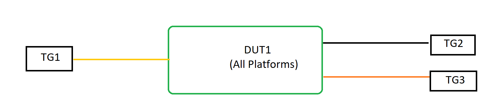

# SQA Test Plan

# Mirroring on Vlan and Port Channel

# SONiC 3.0 Project and Buzznik Release

[TOC]
# Test Plan Revision History

| Rev  |    Date    |       Author        | Change Description |
| :--: | :--------: | :-----------------: | ------------------ |
| 0.1  | 09/10/2019 | Karthikeya Kumar Ch | Initial version    |

# List of Reviewers

| Function |       Name       |
| :------: | :--------------: |
|	Dev	   | Amin Alavi		  |
|   Dev    | Rupesh Kumar     |
|    QA    | Kalyan Vadlamani |
|    QA    | Giri Babu Sajja  |

# List of Approvers

| Function |       Name       | Date Approved |
| :------: | :--------------: | :-----------: |
|	Dev	   | Amin Alavi		  |				  |
|   Dev    | Rupesh Kumar 	  |               |
|    QA    | Kalyan Vadlamani |               |
|    QA    | Giri Babu Sajja  |               |

# Definition/Abbreviation

| **Term** | **Meaning**                                |
| -------- | ------------------------------------------ |
| SPAN     | Switched Port ANalyzer                     |
| ERSPAN   | Encapsulated Remote Switched Port ANalyzer |

# Feature Overview

Port Mirroring, also known as SPAN (Switched Port Analyzer), is a method of monitoring network traffic. With port mirroring enabled, the switch sends a copy of all network packets seen on one port (or an entire VLAN) to another port, where the packet can be analyzed. Here we have the capability of checking port mirroring on Port/Vlan/Port channel.

# Test Approach

## What will be part of module config?

As part of the module config 
1. Port mirroring session creation
2. Ports adding into the created session
3. creation of a vlan and port channel to be used in port mirroring will be presented
4. Will add the common IXIA configuration also to the module which helps in reducing the test case run time.

## What tests will be covered / clubbed together?

1. Checking port mirroring source as port/vlan/port mirroring
2. Checking max mirroring sessions with all above combination as mentioned in the above step
3. Checking the ERSPAN functionality with parallel to port mirroring functionality
4. Checking port mirroring with different directions on different scenarios
5. Checking the functionality of the port mirroring on save and reload, reboot and warm reboot scenarios
6. Checking the ERSPAN functionality with the newly added command support
7. Based on all above scenarios will segregate the test cases from the test plan and will do optimize the tests 

## What 3rd party tools to be tested for?
 None

## In which area?s common warm boot, cold boot , fast boot file, corresponding test of the given feature gets covered?

All the above will be covered as part of existing common files "test_system_fast_reboot.py, test_system_save_reboot.py, test_system_warm_reboot.py"

## What is the plan for covering secondary UI (Ex:- gNMI / KLISH / REST) and how much?

Separate tests are planned for each UI like below :
Validate mirroring related REST commands.
Validate mirroring is working fine with gnmi interface.
Validate mirroring is working fine with KLISH CLI interface.

# 1 Test Focus Areas

## 1.1 Functional Testing 

- All CLI and debug commands,
- Scaling with max supported mirror sessions.
- Testing with source port as Port/Vlan/Port channel
- Testing with ERSPAN parallely with port mirroring
- Testing port mirroring with different directions and combinations

## 1.2 Negative Testing 

- Traffic flow for invalid scenarios
- Configuring mirror session with invalid source,destination or direction

## 1.3 Reboot/Config Testing
- Warm reboot
- Config save and reload
- Fast-boot
- config reload

## 1.4 Scale and Performance Testing

- Scaling with max supported mirror sessions.

# 2 Topologies

## 2.1 Topology

####  

# 3 Test  Case and Objectives

## 3.1 CLI

### 3.1.1 Verify that configuring and unconfiguring port mirroring commands work fine on the device using Klish CLI

| **Test ID**    | **FtOpSoSysPoPmFn001**                                       |
| -------------- | :----------------------------------------------------------- |
| **Test Name**  | **Verify that configuring and unconfiguring port mirroring commands work fine on the device using Klish CLI** |
| **Test Setup** | **Topology**                                                 |
| **Type**       | **CLI**                                                      |
| **Steps**      | **Procedure : 1. Configure the port mirroring commands on the device 2. Check that no issues are observed on the device with configuration and config is observed in the running config or with supported show command 3. Do no commands for the port mirroring and check the running configuration or with the needed commands Expected Result: 1. Verify that commands are configured 2. Verify that there is no issue while configuring the port mirroring commands and config is observed 3. Verify that the unconfiguring the commands works fine and there is no config available on the device ** |

## 3.2 Functional

### 3.2.1 Verify that the port mirroring config is observed in the running config and functionality after the reboot/Cold boot of the device
| **Test ID**    | **FtOpSoSysPoPmFn002**                                       |
| -------------- | :----------------------------------------------------------- |
| **Test Name**  | **Verify that the port mirroring config is observed in the running config and functionality after the reboot of the device** |
| **Test Setup** | **Topology**                                                 |
| **Type**       | **Functional**                                               |
| **Steps**      | **Procedure : 1. Configure the port mirroring commands on the device 2. Check that no issues are observed on the device with configuration and config is observed in the running config or with supported show command 3. Now do reboot the device and check for the config is observed or not and the functionality should work fine and config_db.json should also get updated with correct values Expected Result : 1. Verify that commands are configured 2. Verify that there is no issue while configuring the port mirroring commands and config is observed 3. Verify that the port mirroring configuration is observed on the device even after reboot and functionality should work fine and config_db.json is also got updated ** |

### 3.2.2 Verify that the port mirroring config is observed in the running config after the fast-reboot of the device
| **Test ID**    | **FtOpSoSysPoPmFn003**                                       |
| -------------- | :----------------------------------------------------------- |
| **Test Name**  | **Verify that the port mirroring config is observed in the running config after the fast-reboot of the device** |
| **Test Setup** | **Topology**                                                 |
| **Type**       | **Functional**                                               |
| **Steps**      | **Procedure : 1. Configure the port mirroring commands on the device 2. Check that no issues are observed on the device with configuration and config is observed in the running config or with supported show command 3. Now do fast-reboot the device and check for the config Expected Result : 1. Verify that commands are configured 2. Verify that there is no issue while configuring the port mirroring commands and config is observed 3. Verify that the port mirroring configuration is observed on the device even after fast-reboot and functionality works fine** |

### 3.2.3 Verify that Port mirroring functionality is working with a break out port as source and/or destination.
| **Test ID**    | **FtOpSoSysPoPmFn005**                                       |
| -------------- | :----------------------------------------------------------- |
| **Test Name**  | **Verify that Port mirroring functionality is working with a break out port as source and/or destination** |
| **Test Setup** | **Topology**                                                 |
| **Type**       | **Functional**                                               |
| **Steps**      | **Procedure: 1. configure the port mirroring names as supported in the device 2. Using the port mirroring names please configure the source and destination ports on the port breakout ports  3. Now check the functionality with port breakout ports Expected Result: 1. Verify that configuration is successful 2. Verify that configuration is successful 3. Verify that the functionality works without any issue with breakout ports ** |

### 3.2.4 Verify no more than one single destination can be used for all active sessions.
| **Test ID**    | **FtOpSoSysPoPmFn006**                                       |
| -------------- | :----------------------------------------------------------- |
| **Test Name**  | **Verify no more than one single destination can be used for all active sessions** |
| **Test Setup** | **Topology**                                                 |
| **Type**       | **Functional**                                               |
| **Steps**      | **Procedure: 1.    Create a mirrored session with some number of source ports. 2.    Add a destination port to the session. 3.  Attempt to add another destination port to the same session. 4.    View the mirroring session.  Expected Result: 1.    Verify that a session can be created. 2.    Verify that a destination port can be added to the session. 3.    Verify that another destination port cannot be added to the session. 4.    Verify that the session shows the list of source ports and the single destination port. ** |

### 3.2.5 Verify that a source port can be deleted independently from other source port.
| **Test ID**    | **FtOpSoSysPoPmFn007**                                       |
| -------------- | :----------------------------------------------------------- |
| **Test Name**  | **Verify that a source port can be deleted independently from other source port** |
| **Test Setup** | **Topology**                                                 |
| **Type**       | **Functional**                                               |
| **Steps**      | **Procedure: 1.    Create a mirrored session with a set of source ports and a destination port. 2.    Delete a specific source port. 3.    View the mirroring session. Expected Result: 1.    Verify that the sessions can be created. 2.    Verify that the requested source port is deleted. 3.    Verify that all source ports except the deleted source port shows up in the list.** |

### 3.2.6 Verify that a mirror can be created using a source port as ingress,egress or both 
| **Test ID**    | **FtOpSoSysPoPmFn010**                                       |
| -------------- | :----------------------------------------------------------- |
| **Test Name**  | **Verify that a mirror can be created using a source port ingress packets only.** |
| **Test Setup** | **Topology**                                                 |
| **Type**       | **Functional**                                               |
| **Steps**      | **Procedure: 1.    Create a mirrored session with a source port in which only the ingress traffic is specified to be mirrored. 2.       Create the destination port for the same session as in step 1  3.    View the mirroring session. 4. Verify the above steps using source port as egress Expected Result:1.    Verify that a session can be created with a source port in which only the ingress traffic is specified to be mirrored. 2.       Verify that the destination port is also configured without any issue with the port mirroring session name as step1 3.    Verify that the session is active and able to observe the ingress traffic only 4. Verify that the functionality works fine for egress direction also** |

### 3.2.7 Verify that a mirror can be created using a multiple Port channel interfaces as source ports.
| **Test ID**    | **FtOpSoSysPoPmFn012**                                       |
| -------------- | :----------------------------------------------------------- |
| **Test Name**  | **Verify that a mirror can be created using a multiple Port channel interfaces as source ports.** |
| **Test Setup** | **Topology**                                                 |
| **Type**       | **Functional**                                               |
| **Steps**      | **Procedure: 1.    Create a mirrored session with multiple Port channel interfaces as source ports. 2.    Add a destination port to the session. 3.    View the mirroring session. Expected Result: 1.    Verify that a session can be created. 2.    Verify that a destination port can be added to the session. 3.    Verify that the session shows the list of source ports and the single destination port.** |

### 3.2.8 Verify that a mirror can be created using multiple transmit port egress(also ingress) packets and a destination port
| **Test ID**    | **FtOpSoSysPoPmFn015**                                       |
| -------------- | :----------------------------------------------------------- |
| **Test Name**  | **Verify that a mirror can be created using multiple transmit port egress packets and a destination port** |
| **Test Setup** | **Topology**                                                 |
| **Type**       | **Functional**                                               |
| **Steps**      | **Procedure: 1.    Create a mirrored session with a source port (Port channel interface) in which only the egress traffic is specified to be mirrored. 2.    View the mirroring session. 3.    Add a destination port to the monitor session. 4.    Add a second source port to the session monitoring only the egress traffic. 5.    Continue to add source ports to the session monitoring only the egress traffic up to the maximum allowable source ports on the device under test. 6.Check the same for ingress and both case Expected Result: 1.    Verify that a session can be created with a source port in which only the egress traffic is specified to be mirrored. 2.    Verify that the session is not active as there is no destination port. 3.    Verify that the session is active as there is now a source and a destination. 4.    Verify that the session remains active and that it properly records two sources and one destination. 5.    Verify that the session remains active and that it properly records the maximum number of sources and one destination and direction. 6.Verify that the functionality is working fine with ingress and both scenarios** |

### 3.2.9 Verify that a mirror can be created using multiple transmit and receive port egress and ingress packets and a destination port
| **Test ID**    | **FtOpSoSysPoPmFn016**                                       |
| -------------- | :----------------------------------------------------------- |
| **Test Name**  | **Verify that a mirror can be created using multiple transmit and receive port egress and ingress packets and a destination port** |
| **Test Setup** | **Topology**                                                 |
| **Type**       | **Functional**                                               |
| **Steps**      | **Procedure: 1.    Create a mirrored session with a source port in which only the egress traffic is specified to be mirrored. 2.    View the mirroring session. 3.    Add a destination port to the monitor session. 4.    Add a second source port to the session monitoring only the ingress traffic. 5.    Continue to add source ports to the session monitoring alternately the ingress or the egress traffic up to the maximum allowable source ports on the device under test. Expected Result: 1.    Verify that a session can be created with a source port in which only the egress traffic is specified to be mirrored. 2.    Verify that the session is not active as there is no destination port. 3.    Verify that the session is active as there is now a source and a destination. 4.    Verify that the session remains active and that it properly records two sources and one destination. 5.    Verify that the session remains active and that it properly records the maximum number of sources and one destination and direction.** |

### 3.2.10 Verify that egress mirrored packets are sent unmodified with a VLAN tag (always tagged and untagged) before and after warm reboot
| **Test ID**    | **FtOpSoSysPoPmFn018**                                       |
| -------------- | :----------------------------------------------------------- |
| **Test Name**  | **Verify that egress mirrored packets are sent unmodified with a VLAN tag (always tagged and untagged) before and after warm reboot** |
| **Test Setup** | **Topology**                                                 |
| **Type**       | **Functional**                                               |
| **Steps**      | **Procedure: 1.    Bring up the DUT with default configuration with 3 ports. 2.    Create VLAN 10 and include 2 ports(1,2) in that VLAN with tagged participation 3.    Create a mirrored session with 2nd port as source vlan and 3rd port as destination. 4.    Send bidirectional traffic from port 1 and 2 5.    Capture the traffic at port 3 and observe the result 6.     Now continue the traffic and do perform warm-reboot 7.     After warm reboot no traffic loss should be observed and mirroring functionality should be same 8.Verify the same for source port as vlan in ingress and both direction also Expected Result: 1.    DUT should come up with default configuration. 2.    Verify that VLAN 10 is created and ports participation is successful. 3.    Verify that mirrored session is created. 4.    Verify that bidirectional traffic is forwarded.  5.    Observe  that the egressed mirrored packets contain the specific VLAN tag. 6 &7.     Verify that after warm reboot there should not be any traffic loss and mirroring functionality should work fine 8.Verify that the functionality works fine in ingress and both as direction** |

### 3.2.11 Verify that both ERSPAN and SPAN session should work fine at a time.
| **Test ID**    | **FtOpSoSysPoPmFn021**                                       |
| -------------- | :----------------------------------------------------------- |
| **Test Name**  | **Verify that both ERSPAN and SPAN session should work fine at a time** |
| **Test Setup** | **Topology**                                                 |
| **Type**       | **Functional**                                               |
| **Steps**      | **Procedure: 1.    Create a mirrored session with a source port in which only the egress traffic is specified to be mirrored. 2.    View the mirroring session. 3.    Add a destination port to the monitor session. 4.    Create the configuration as  same for ERSPAN also with different ports 5.   Now check the both the functionalities after sending traffic Expected Result: 1.    Verify that a session can be created with a source port in which only the egress traffic is specified to be mirrored. 2.    Verify that the session is not active as there is no destination port. 3.    Verify that the session is active as there is now a source and a destination. 4.    Verify that the both sessions(ERSPAN&SPAN) remains active 5.    Verify that both ERSPAN and SPAN functionality works fine in the same time.** |

### 3.2.12 Verify that ERSPAN using Klish commands and ACL based port mirroring
| **Test ID**    | **FtOpSoSysPoPmFn023**                                       |
| -------------- | :----------------------------------------------------------- |
| **Test Name**  | **Verify that ERSPAN using Klish commands and ACL based port mirroring.** |
| **Test Setup** | **Topology**                                                 |
| **Type**       | **Functional**                                               |
| **Steps**      | **Procedure: 1.   Configure the ERSPAN using Klish commands using ACL port based mirroring 2.   Check the traffic functionality 3.    Now do unconfiguring ERSPAN  Expected Results : 1.    Verify that the configuration for ERSPAN is successful 2.    Verify that  the functionalities are working fine 3.     Verify that the configuration is un-configured via Klish CLI successfully** |

## 3.3 Negative

### 3.3.1 Verify the Negative scenarios in the mirroring functionality
| **Test ID**    | **FtOpSoSysPoPmNt001**                                       |
| -------------- | :----------------------------------------------------------- |
| **Test Name**  | **Verify the Negative scenarios in the mirroring functionality**  |
| **Test Setup** | **Topology**                                                 |
| **Type**       | **Negative**                                                 |
| **Steps**      | **Procedure: 1. Verify that probe port cannot be same as monitored port 2.Verify that user can not configure Port Channel interface as destination port of a session 3.Verify that mirror configuration throws error with invalid interface or direction 4.Verify that mirror configuration throws error with already configured session(trying to create the same session again) 5. Verify that a Source port used in one session cannot be used as the destination port in another session** |

### 3.3.2 Verify that mirror session goes in-active state when source port-channel has no members
| **Test ID**    | **FtOpSoSysPoPmNt003**                                       |
| -------------- | :----------------------------------------------------------- |
| **Test Name**  | **Verify that mirror session goes in-active state when source port-channel has no members** |
| **Test Setup** | **Topology**                                                 |
| **Type**       | **Negative**                                                 |
| **Steps**      | **Procedure: 1.  Create a mirrored session with Port Channel interface as source port in which both ingress and egress traffic is to be mirrored. 2.  View the mirroring session. 3.  Add a Port as a destination port to the monitor session. 4.  Now remove the ports participated in port-channel which is used as source and check mirror session state  Expected Result: 1.  Verify that a session can be created with a source port  2.  Verify that the session is not active as there is no destination port. 3.  Verify that show command shows the configured session 4.  Verify that the mirror session is in in-active state as the port members are deleted from the  configured port-channel** |

## 3.4 Management

### 3.4.1 Verify that the port mirroring(SPAN) and ERSPAN can be configured/un-configured via GNMI and check the functionality
| **Test ID**    | **FtOpSoSysPoPmFn022**                                       |
| -------------- | :----------------------------------------------------------- |
| **Test Name**  | **Verify that a mirror can be created using a source port egress packets only.** |
| **Test Setup** | **Topology**                                                 |
| **Type**       | **Functional**                                               |
| **Steps**      | **Procedure: 1.    Configure the SPAN and ERSPAN config using GNMI 2.     Check both the functionalities are working fine without any issues 3.  Now do unconfiguring both SPAN and ERSPAN by GNMI  Expected Results : 1.    Verify that the configuration via GNMI is successful 2.    Verify that both the functionalities are working fine 3.     Verify that the configuration is un-configured via GNMI is successful** |

### 3.4.2 Verify that the port mirroring(SPAN) and ERSPAN can be configured/un-configured via REST API's
| **Test ID**    | **FtOpSoSysPoPmFn020**                                       |
| -------------- | :----------------------------------------------------------- |
| **Test Name**  | **Verify that the port mirroring(SPAN) and ERSPAN can be configured/un-configured via REST API's** |
| **Test Setup** | **Topology**                                                 |
| **Type**       | **Functional**                                               |
| **Steps**      | **Procedure: 1.    Configure the SPAN and ERSPAN config using REST API calls 2.     Check both the functionalities are working fine without any issues 3.  Now do unconfiguring both SPAN and ERSPAN by Rest API calls  Expected Results : 1.    Verify that the configuration via REST is successful 2.    Verify that both the functionalities are working fine 3.     Verify that the configuration is un-configured via REST is successful** |

## 3.5 Scalability 

### 3.5.1 Verify  that max port mirroring sessions are formed  
| **Test ID**    | **FtOpSoSysPoPmFn004**                                       |
| -------------- | :----------------------------------------------------------- |
| **Test Name**  | **Verify  that max port mirroring sessions are formed**      |
| **Test Setup** | **Topology**                                                 |
| **Type**       | **Scalability**                                               |
| **Steps**      | **Procedure: 1. configure the port mirroring names as supported in the device 2. Using the port mirroring names please configure the source and destination ports  3. Now do check with the supported show command for max entries 4. Now try for another entry than the supported entries Expected Result: 1. Verify that configuration is successful 2. Verify that configuration is successful 3. Verify that the max sessions are formed without any issue 4. Verify that the device should throw an error as it exceeds the max entries supported** |

# 4 Reference Links

### HLD : http://gerrit-lvn-07.lvn.broadcom.net:8083/c/sonic/documents/+/11337