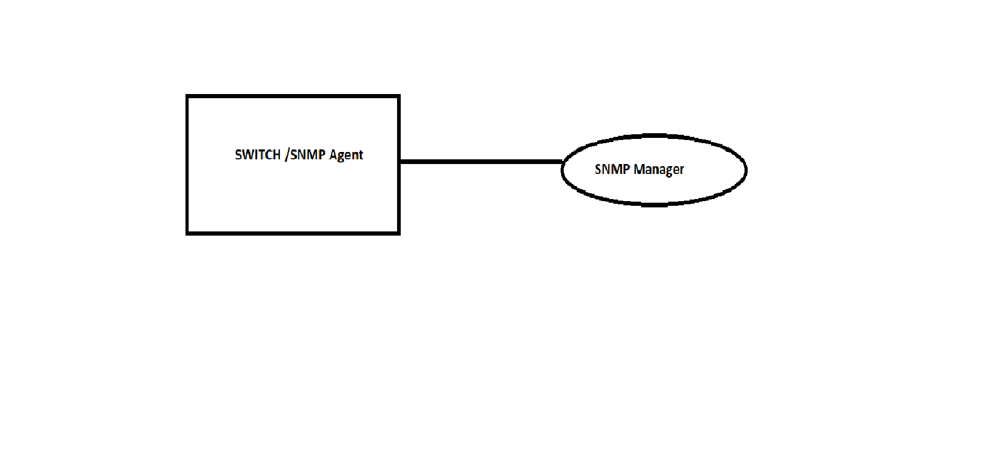

#  SQA Test Plan
#  SNMP CLI Commands Test Plan
#  SONiC 3.0 - Buzznik Release
[TOC]
# Test Plan Revision History
| Rev | Date        | Author                  | Change Description          |
|:---:|:-----------:|:-----------------------:|:---------------------------:|
| 0.1 | 12/11/2019  | Santosh Votarikari      | Initial version             |
| 0.2 | 12/31/2019  | Santosh Votarikari      | Removed set operations steps|
| 0.3 | 03/01/2020  | Surendra Kumar Vella    | Review comments are addressed|

# List of Reviewers
|  Function 		  | Name  							 |
|:-------------------:|:--------------------------------:|
|	Management		  |	 Giri Babu Sajja				 |
|   Management		  |  Craig Gava					 |
|   QA				  |  Anil Kumar Kolkaleti, Chaitanya Kumar Vella		 |
|   Dev				  |  David Sips 				 |

# List of Approvers
|  Function    | Name            | Date Approved      |
|:------------:|:---------------:|:------------------:|
| Management   |  Giri Babu Sajja|                    |                  
| Management   |   Craig Gava    |                    |

# Definition/Abbreviation
| **Term** | **Meaning**                          |
|:--------:|:-------------------------------------|
| SNMP     | Simple Network Management Protocol   |
| CLI      | Command Line Interface               |

# Feature Overview
This feature is to configure the SNMP parameters through CLI commands.

# Test Approach 
###### What will be part of module config?
1. Configure SNMP communities, Users and hosts for traps.

###### What tests will be covered / clubbed together?
1. All Trap and informs related cases will be covered in single test function.
2. All Authentication and Privacy protocols related cases will be covered in single test function.

###### What 3rd party tools to be tested for?
NetSNMP

###### In which area’s common warm-boot, cold boot , fast-boot file, corresponding test of the given feature gets covered?
Section 3.4.1 of the Test Plan covers test scenarios related to fast-reboot.

###### List of tests which can not be automated and why?
Not Applicable  

###### What is the plan for covering secondary UI (Ex:- gNMI / KLISH / REST) and how much?
This test plan is to configure the SNMP parameters through CLI commands(KLISH).

# 1 Test Focus Areas
  ## 1.1 Functional Testing 
  - SNMP, CLI 
   
  ## 1.2 Negative Testing 
  ### 1.2.1 Verify the switch access when trying to contact the switch with invalid community and users.
| **Test ID**    | **FtOpSoSySnFn037**                                         |
| -------------- | :-----------------------------------------------------------|
| **Test Name**  | **Verify the switch access when trying to contact the switch with invalid community and users** |
| **Test Setup** | **Topology**                                                |
| **Type**       | **Functional**                                              |
| **Steps**      | **Setup: Standalone DUT  Procedure: 1) Bring up the device without any issues with one port as up. 2) Do walk operation by using SNMPv2 with invalid community. 3) Do get operation by using SNMPv3 with invalid user. 4) Do walk operation by using SNMPv3 with valid user and invalid authentication password. 5) Do get operation by using SNMPv3 with valid user and invalid privacy password.   Expected Behavior: 1) Verify that device and one port is up. 2) Verify that no Response from switch and walk operation is fail. 3) Verify that no Response from switch and get operation is fail. 4) Verify that no Response from switch and walk operation is fail. 5) Verify that no Response from switch and get operation is fail.** |
  
  ## 1.3 Scale and Performance Testing
  - Not Applicable

# 2 Topologies
## 2.1 Topology

# 3 Test  Case and Objectives
## 3.1 Functional
### 3.2.1 Verify the ability to perform SNMPv1 get and walk operations
| **Test ID**    | **FtOpSoSySnFn024**                                         |
| -------------- | :-----------------------------------------------------------|
| **Test Name**  | **Verify the ability to perform SNMPv1 get and walk operations.** |
| **Test Setup** | **Topology**                                                |
| **Type**       | **Functional**                                              |
| **Steps**      | **Setup: Standalone DUT  Procedure: 1) Bring up the device without any issues with one port as up. 2) Configure snmp communities for ro levels. 3) Do shutdown on interface . 4) Do get operation by using SNMPv1.  Ex: snmpget  -v 1 -c <community> <dut ip address> 1.3.6.1.2.1.2.2.1.7   5) Do no-shutdown on interface .  6) Do walk operation by using SNMPv1.  Ex:  snmpwalk  -v 1 -c <community> <dut ip address> 1.3.6.1.2.1.2.2.1.7    Expected Behavior: 1) Verify that device and one port is up. 2) Verify that snmp communities are successfully configured. 3) Verify that  operation is successful and output value should be valid as expected. 4) Verify that get operation is successful and output value should be valid as expected. 5) Verify that  operation is successful and output value should be valid as expected. 6) Verify that walk operation is successful and output value should be valid as expected.** |

### 3.2.2 Verify the ability to perform SNMPv2 get,bulkwalk and walk operations
| **Test ID**    | **FtOpSoSySnFn025**                                         |
| -------------- | :-----------------------------------------------------------|
| **Test Name**  | **Verify the ability to perform SNMPv2 get,bulkwalk and walk operations.** |
| **Test Setup** | **Topology**                                                |
| **Type**       | **Functional**                                              |
| **Steps**      | **Setup: Standalone DUT  Procedure: 1) Bring up the device without any issues with one port as up. 2) Configure snmp communities for rw and ro levels. 3) Do shutdown on interface . 4) Do get operation by using SNMPv2.  Ex: snmpget  -v2c  -c <community> <dut ip address> 1.3.6.1.2.1.2.2.1.7   5) Do no-shutdown on interface .  6) Do walk operation by using SNMPv2.  Ex:  snmpwalk  -v2c  -c <community> <dut ip address> 1.3.6.1.2.1.2.2.1.7   7) Do bulkwalk operation by using SNMPv2.   Ex:  snmpbulkwalk  -v2c  -c <community> <dut ip address> 1.3.6.1.2.1.2.2.1.7   Expected Behavior: 1) Verify that device and one port is up. 2) Verify that snmp communities are successfully configured. 3) Verify that  operation is successful and output value should be valid as expected. 4) Verify that get operation is successful and output value should be valid as expected. 5) Verify that operation is successful and output value should be valid as expected. 6) Verify that walk operation is successful and output value should be valid as expected. 7) Verify that bulkwalk operation is successful and output value should be valid as expected.** |

### 3.2.3 Verify v3 access to switch and perform SNMP get and walk operations when user is configured without authentication and privacy protocols
| **Test ID**    | **FtOpSoSySnFn028**                                         |
| -------------- | :-----------------------------------------------------------|
| **Test Name**  | **Verify v3 access to switch and perform SNMP get and walk operations when user is configured without authentication and privacy protocols.** |
| **Test Setup** | **Topology**                                                |
| **Type**       | **Functional**                                              |
| **Steps**      | **Setup: Standalone DUT  Procedure: 1) Bring up the device without any issues with one port as up. 2) Configure user without authentication and privacy protocols. 3) Do shutdown on interface . 4) Do get operation by using SNMPv3.  Ex: snmpget  -v 3 -n "" -u noAuthUser -l noAuthNoPriv <dut ip address> 1.3.6.1.2.1.2.2.1.7   5) Do no-shutdown on interface .  6) Do walk operation by using SNMPv3.  Ex:  snmpwalk  -v 3 -n "" -u noAuthUser -l noAuthNoPriv <dut ip address> 1.3.6.1.2.1.2.2.1.7    Expected Behavior: 1) Verify that device and one port is up. 2) Verify that snmp user is successfully configured. 3) Verify that operation is successful and output value should be valid as expected. 4) Verify that get operation is successful and output value should be valid as expected. 5) Verify that operation is successful and output value should be valid as expected. 6) Verify that walk operation is successful and output value should be valid as expected.** |

### 3.2.4 Verify v3 access to switch and perform SNMP get and walk operations when user is configured with authentication protocols and without privacy protocols 
| **Test ID**    | **FtOpSoSySnFn029**                                         |
| -------------- | :-----------------------------------------------------------|
| **Test Name**  | **Verify v3 access to switch and perform SNMP get and walk operations when user is configured with authentication protocols and without privacy protocols.** |
| **Test Setup** | **Topology**                                                |
| **Type**       | **Functional**                                              |
| **Steps**      | **Setup: Standalone DUT  Procedure: 1) Bring up the device without any issues with one port as up. 2) Configure user with MD5 authentication without privacy protocols. 3) Do shutdown on interface. 4) Do get operation by using SNMPv3.  Ex: snmpget  -v 3 -n "" -u noAuthUser -a MD5 -A "The Net-SNMP Demo Password" -l authNoPriv <dut ip address> 1.3.6.1.2.1.2.2.1.7   5) Do no-shutdown on interface .  6) Do walk operation by using SNMPv3.  Ex:  snmpwalk  -v 3 -n "" -u noAuthUser -a MD5 -A "The Net-SNMP Demo Password" -l authNoPriv <dut ip address> 1.3.6.1.2.1.2.2.1.7     7) Repeat the test case with SHA authentication.    Expected Behavior: 1) Verify that device and one port is up. 2) Verify that snmp user is successfully configured. 3) Verify that  operation is successful and output value should be valid as expected. 4) Verify that get operation is successful and output value should be valid as expected. 5) Verify that  operation is successful and output value should be valid as expected. 6) Verify that walk operation is successful and output value should be valid as expected. 7) Verify that results are same as above.** |

### 3.2.5 Verify v3 access to switch and perform SNMP get and walk operations when user is configured with authentication protocols and privacy protocols
| **Test ID**    | **FtOpSoSySnFn030**                                         |
| -------------- | :-----------------------------------------------------------|
| **Test Name**  | **Verify v3 access to switch and perform SNMP get and walk operations when user is configured with authentication protocols and privacy protocols.** |
| **Test Setup** | **Topology**                                                |
| **Type**       | **Functional**                                              |
| **Steps**      | **Setup: Standalone DUT  Procedure: 1) Bring up the device without any issues with one port as up. 2) Configure user with MD5 authentication and DES privacy Protocol. 3) Do shutdown on interface . 4) Do get operation by using SNMPv3.  Ex: snmpget  -v 3 -n "" -u noAuthUser -a MD5 -A "The Net-SNMP Demo Password" -x DES -X "The Net-SNMP Demo Password" -l authNoPriv <dut ip address> 1.3.6.1.2.1.2.2.1.7    5) Do no-shutdown on interface .  6) Do walk operation by using SNMPv3.  Ex:  snmpwalk  -v 3 -n "" -u noAuthUser -a MD5 -A "The Net-SNMP Demo Password" -x DES -X "The Net-SNMP Demo Password" -l authNoPriv <dut ip address> 1.3.6.1.2.1.2.2.1.7      7) Repeat the test case with SHA authentication and AES128 privacy Protocol.    Expected Behavior: 1) Verify that device and one port is up. 2) Verify that snmp user is successfully configured. 3) Verify that  operation is successful and output value should be valid as expected. 4) Verify that get operation is successful and output value should be valid as expected. 5) Verify that  operation is successful and output value should be valid as expected. 6) Verify that walk operation is successful and output value should be valid as expected. 7) Verify that results are same as above.** |

### 3.2.6 Verify v3 access to switch and perform SNMP get and walk operations when user is configured with authentication encryption password and without privacy protocols
| **Test ID**    | **FtOpSoSySnFn031**                                         |
| -------------- | :-----------------------------------------------------------|
| **Test Name**  | **Verify v3 access to switch and perform SNMP get and walk operations when user is configured with authentication encryption password and without privacy protocols.** |
| **Test Setup** | **Topology**                                                |
| **Type**       | **Functional**                                              |
| **Steps**      | **Setup: Standalone DUT  Procedure: 1) Bring up the device without any issues with one port as up. 2) Configure user with MD5 encryption authentication. 3) Do shutdown on interface . 4) Do get operation by using SNMPv3.  Ex: snmpget  -v 3 -n "" -u noAuthUser -a MD5 -A "The Net-SNMP Demo Password" -l authPriv <dut ip address> 1.3.6.1.2.1.2.2.1.7   5) Do no-shutdown on interface . 6) Do walk operation by using SNMPv3.  Ex:  snmpwalk  -v 3 -n "" -u noAuthUser -a MD5 -A "The Net-SNMP Demo Password" -l authPriv <dut ip address> 1.3.6.1.2.1.2.2.1.7     7) Repeat the test case with SHA authentication.    Expected Behavior: 1) Verify that device and one port is up. 2) Verify that snmp user is successfully configured. 3) Verify that  operation is successful and output value should be valid as expected. 4) Verify that get operation is successful and output value should be valid as expected. 5) Verify that  operation is successful and output value should be valid as expected. 6) Verify that walk operation is successful and output value should be valid as expected. 7) Verify that results are same as above.** |

### 3.2.7 Verify v3 access to switch and perform SNMP get and walk operations when user is configured with authentication encryption password and privacy encryption password
| **Test ID**    | **FtOpSoSySnFn032**                                         |
| -------------- | :-----------------------------------------------------------|
| **Test Name**  | **Verify v3 access to switch and perform SNMP get and walk operations when user is configured with authentication encryption password and privacy encryption password.** |
| **Test Setup** | **Topology**                                                |
| **Type**       | **Functional**                                              |
| **Steps**      | **Setup: Standalone DUT  Procedure: 1) Bring up the device without any issues with one port as up. 2) Configure user with MD5 encryption authentication and DES encryption privacy Protocol. 3) Do shutdown on interface . 4) Do get operation by using SNMPv3.  Ex: snmpget  -v 3 -n "" -u noAuthUser -a MD5 -A "The Net-SNMP Demo Password" -x DES -X "The Net-SNMP Demo Password" -l authPriv <dut ip address> 1.3.6.1.2.1.2.2.1.7   5) Do no-shutdown on interface by using SNMPv3.   6) Do walk operation by using SNMPv3.  Ex:  snmpwalk  -v 3 -n "" -u noAuthUser -a MD5 -A "The Net-SNMP Demo Password" -x DES -X "The Net-SNMP Demo Password" -l authPriv <dut ip address> 1.3.6.1.2.1.2.2.1.7     7) Repeat the test case with SHA authentication and AES128 privacy Protocol.    Expected Behavior: 1) Verify that device and one port is up. 2) Verify that snmp user is successfully configured. 3) Verify that  operation is successful and output value should be valid as expected. 4) Verify that get operation is successful and output value should be valid as expected. 5) Verify that  operation is successful and output value should be valid as expected. 6) Verify that walk operation is successful and output value should be valid as expected. 7) Verify that results are same as above.** |

### 3.2.8 Verify that switch sends snmpv1 traps and informs to configured host
| **Test ID**    | **FtOpSoSySnFn033**                                         |
| -------------- | :-----------------------------------------------------------|
| **Test Name**  | **Verify that switch sends snmpv1 traps and informs to configured host.** |
| **Test Setup** | **Topology**                                                |
| **Type**       | **Functional**                                              |
| **Steps**      | **Setup: Standalone DUT  Procedure: 1) Bring up the device without any issues with one port as up. 2) Configure snmp-server host with v1 community and enable trap. Ex:  snmp-server community community_1 snmp-server host 1.2.3.4 community community_1 traps v1.  3) Do shutdown on interface .  4) Check the trap on SNMP trap receiver.  5) Configure snmp-server host with v1 community and enable informs . Ex:  snmp-server community community_2 snmp-server host 1.2.3.4 community community_2 informs.  6) Do no shutdown on interface. 7) Check the trap on SNMP trap receiver.   Expected Behavior: 1) Verify that device and one port is up. 2) Verify that snmp communities and traps are successfully configured. 3) Verify that operation is successful. 4) Verify that DUT sends the link down trap with SNMPv1. 5) Verify that snmp communities and informs are successfully configured. 6) Verify that operation is successful. 7) Verify that DUT sends the link up informs with SNMPv1.** |

### 3.2.9 Verify that switch sends snmpv2 traps and informs to configured host
| **Test ID**    | **FtOpSoSySnFn034**                                         |
| -------------- | :-----------------------------------------------------------|
| **Test Name**  | **Verify that switch sends snmpv2 traps and informs to configured host.** |
| **Test Setup** | **Topology**                                                |
| **Type**       | **Functional**                                              |
| **Steps**      | **Setup: Standalone DUT  Procedure: 1) Bring up the device without any issues with one port as up. 2) Configure snmp-server host with v2c community and enable trap. Ex:  snmp-server community community_3 snmp-server host 1.2.3.4 community community_3 traps v2c.  3) Do shutdown on interface .  4) Check the trap on SNMP trap receiver.  5) Configure snmp-server host with v2c community and enable informs . Ex:  snmp-server community community_4 snmp-server host 1.2.3.4 community community_4 informs.  6) Do no shutdown on interface. 7) Check the trap on SNMP trap receiver.   Expected Behavior: 1) Verify that device and one port is up. 2) Verify that snmp communities and traps are successfully configured. 3) Verify that operation is successful. 4) Verify that DUT sends the link down trap with SNMPv2. 5) Verify that snmp communities and informs are successfully configured. 6) Verify that operation is successful. 7) Verify that DUT sends the link up informs with SNMPv2.** |

### 3.2.10 Verify that switch sends snmpv3 traps and informs to configured host
| **Test ID**    | **FtOpSoSySnFn034**                                         |
| -------------- | :-----------------------------------------------------------|
| **Test Name**  | **Verify that switch sends snmpv3 traps and informs to configured host.** |
| **Test Setup** | **Topology**                                                |
| **Type**       | **Functional**                                              |
| **Steps**      | **Setup: Standalone DUT  Procedure: 1) Bring up the device without any issues with one port as up. 2) Configure snmp-server host with v3 user and enable trap. Ex:  snmp-server user user1 group g1 noauth snmp-server host 1.2.3.4 user user1 traps noauth.  3) Do shutdown on interface .  4) Check the trap on SNMP trap receiver.  5) Configure snmp-server host with v3 user and enable informs . Ex:  snmp-server user user2 group g1 noauth snmp-server host 1.2.3.4 user user2 informs auth.  6) Do no shutdown on interface. 7) Check the trap on SNMP trap receiver.   Expected Behavior: 1) Verify that device and one port is up. 2) Verify that snmp communities and traps are successfully configured. 3) Verify that operation is successful. 4) Verify that DUT sends the link down trap with SNMPv3. 5) Verify that snmp communities and informs are successfully configured. 6) Verify that operation is successful. 7) Verify that DUT sends the link up informs with SNMPv3.** |

## 3.3 Negative
Not Applicable

## 3.4 Reboot/Reload/Upgrade Test Cases

#### 3.4.1  Fast-reboot

### 3.4.1.1 Verify that SNMP configuration is retained after fast-reboot
| **Test ID**    | **FtOpSoSySnFn036**                                         |
| -------------- | :-----------------------------------------------------------|
| **Test Name**  | **Verify that SNMP configuration is retained after fast-reboot.** |
| **Test Setup** | **Topology**                                                |
| **Type**       | **Functional**                                              |
| **Steps**      | **Setup: Standalone DUT  Procedure: 1) Bring up the device without any issues with one port as up. 2) Configure snmp-server host with v3 user,communities,host and enable trap.  3) Do fast-reboot .  4) Check the SNMP configuration.     Expected Behavior: 1) Verify that device and one port is up. 2) Verify that snmp communities and users are successfully configured. 3) Verify that operation is successful. 4) Verify that SNMP configuration is retained after fast-reboot.** |

#### 3.4.2  Cold reboot
Not Applicable

#### 3.4.3 Config reload
Not Applicable

#### 3.4.4  Docker restart
Not Applicable

#### 3.4.5  Upgrade
Not Applicable

## 3.5 Management

KLISH CLI

#### 3.5.3 REST API
Not Applicable

#### 3.5.4 KLISH CLI
This test plan is to configure the SNMP parameters through CLI commands(KLISH).

#### 3.5.5 IS-CLI
Not Applicable

## 3.6 Stress,Scale and Performance
Not Applicable

## 4 Reference Links
Yet to receive the official HLD document  
