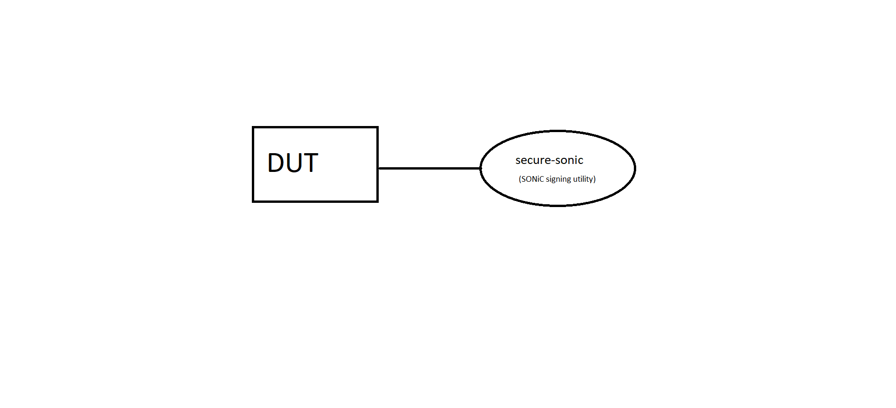

#  SQA Test Plan
#  SONIC Secure Boot Test Plan
#  SONiC 4.0.0 Release
# Test Plan Revision History
| Rev | Date        | Author                  | Change Description          |
|:---:|:-----------:|:-----------------------:|:---------------------------:|
| 0.1 | 30/07/2021  | Santosh Votarikari      | Initial version             |
| 0.2 | 10/08/2021  | Santosh Votarikari      | Fixed Typo errors           |
| 0.3 | 09/09/2021  | Santosh Votarikari      | Added Rajendra as Approver  |
| 0.4 | 13/10/2021  | Santosh Votarikari      | Added new test cases        |

# List of Reviewers
|  Function           | Name  		           |
|:-------------------:|:---------------------|
|   Dev               |  Babu Rajaram 	     |
|   Dev               |  Fuzail Khan         |
|   QA                |  Kalyan Vadlamani    |
|   QA                |  Chandra Bhushan     |

# List of Approvers
|  Function    | Name                | Date Approved      |
|:------------:|:-------------------:|:------------------:|
| Dev          |  Babu Rajaram       |                    |                  
| Dev          |  Fuzail Khan        |                    |
| Dev          |  Rajendra Dendukuri |                    |
| QA           |  Kalyan Vadlamani   |                    |
| QA           |  Chandra Bhushan    |                    |

# Definition/Abbreviation
| **Term** | **Meaning**                          |
|:--------:|:-------------------------------------|
| NOS      | Network Operating System             |
| BIOS     | Basic Input Output System            |
| UEFI     | Unified Extensible Firmware Interface|
| GRUB     | GRand Unified Bootloader             | 
| RoT      | Root of trust                        |
| ONIE     | Open Network Install Environment     |
| FPGA     | Field Programmable Gate Arrays       |
| CPLD     | Complex Programmable Logic Device    |

# Feature Overview
In ONIE enabled computing environment, end users put their trust in 
 - Various HW components such as FPGA, CLPDs, Boot firmware etc.
 - Software e.g. ONIE, NOS installers and NOS

Root of trust (RoT) generally is such a core component which can be trusted explicitly. Usually this RoT is UEFI. Trust is then propagated throughout the components
of the boot process. Chain of trust is formed where one component of the boot process measures, verfies and executes the next component. If verification fails at any one stage, the boot
process is aborted.
ONIE provides support for secure boot by including various applications, keys and certificates management. To apply the secure boot concept to SONiC installer image, we must
provide the NOS image in a way suitable for secure boot applications. Components of the NOS image such as grub and linux kernel should be signed. These components should also support verification of the next component in the chain. Finally, the full NOS image should be signed and formatted in a way so that it supports verfication and execution from ONIE environment. Since the NOS image can be
loaded via sonic_installer command as well, an infra similar to ONIE nos installer must be present to validate the new NOS image.

# 1 Test Focus Areas
  -This Test Plan covers the validations of the Secure Boot feature.
  ## 1.1 Functional Testing 
  - Verify that System should boot up successfully when the secure NOS image is loaded from the ONIE-installer while the NOS image is signed with proper keys and secure boot is enabled.
  - Verify that System boot up fails when a secure NOS image is loaded from ONIE-installer while the NOS image is signed with the wrong key of NOS grub,proper key of NOS kernel image,proper key of overall SONiC installer and secure boot is enabled.
  - Verify that System boot up fails when a secure NOS image is loaded from ONIE-installer while the NOS image is signed with proper key of NOS grub,wrong key of NOS kernel image,proper key of overall SONiC installer and secure boot is enabled.
  - Verify that System boot up fails when a secure NOS image is loaded from ONIE-installer while the NOS image is signed with proper key of NOS grub,proper key of NOS kernel image,wrong key of overall SONiC installer and secure boot is enabled.
  - Verify that System boot up fails when a secure NOS image is loaded from ONIE-installer while the NOS image is signed with wrong key of NOS grub,wrong key of NOS kernel image,wrong key of overall SONiC installer and secure boot is enabled.
  - Verify that System boot up fails when a secure NOS image is loaded from ONIE-installer while the NOS image is signed with wrong key of NOS grub,wrong key of NOS kernel image,proper key of overall SONiC installer and secure boot is enabled.
  - Verify that System boot up fails when a secure NOS image is loaded from ONIE-installer while the NOS image is signed with wrong key of NOS grub,proper key of NOS kernel image,wrong key of overall SONiC installer and secure boot is enabled.
  - Verify that System boot up fails when a secure NOS image is loaded from ONIE-installer while the NOS image is signed with proper key of NOS grub,wrong key of NOS kernel image,wrong key of overall SONiC installer and secure boot is enabled.
  - Verify that System boot up fails when a secure NOS image is loaded from ONIE-installer while NOS image is signed with proper keys and secure boot is disabled.
  - Verify that System boot up fails when an unsigned NOS image is loaded from ONIE-installer when secure boot is enabled.
  - Verify that System should boot up successfully when the secure NOS image is loaded from the Sonic-installer while the NOS image is signed with proper keys and secure boot is enabled.
  - Verify that System boot up fails when a secure NOS image is loaded from Sonic-installer while the NOS image is signed with the wrong key of NOS grub,proper key of NOS kernel image,proper key of overall SONiC installer and secure boot is enabled.
  - Verify that System boot up fails when a secure NOS image is loaded from Sonic-installer while the NOS image is signed with proper key of NOS grub,wrong key of NOS kernel image,proper key of overall SONiC installer and secure boot is enabled.
  - Verify that System boot up fails when a secure NOS image is loaded from Sonic-installer while the NOS image is signed with proper key of NOS grub,proper key of NOS kernel image,wrong key of overall SONiC installer and secure boot is enabled.
  - Verify that System boot up fails when a secure NOS image is loaded from Sonic-installer while the NOS image is signed with wrong key of NOS grub,wrong key of NOS kernel image,wrong key of overall SONiC installer and secure boot is enabled.
  - Verify that System boot up fails when a secure NOS image is loaded from Sonic-installer while the NOS image is signed with wrong key of NOS grub,wrong key of NOS kernel image,proper key of overall SONiC installer and secure boot is enabled.
  - Verify that System boot up fails when a secure NOS image is loaded from Sonic-installer while the NOS image is signed with the wrong key of NOS grub,proper key of NOS kernel image,wrong key of overall SONiC installer and secure boot is enabled.
  - Verify that System boot up fails when a secure NOS image is loaded from Sonic-installer while the NOS image is signed with proper key of NOS grub,wrong key of NOS kernel image,wrong key of overall SONiC installer and secure boot is enabled.
  - Verify that System boot up fails when a secure NOS image is loaded from Sonic-installer while NOS image is signed with proper keys and secure boot is disabled.
  - Verify that System boot up fails when an unsigned NOS image is loaded from Sonic-installer when secure boot is enabled.
  - Verify that System should boot up successfully when the secure NOS image is loaded from the ONIE-installer while the NOS image is signed with 3 different proper keys and secure boot is enabled.
  - Verify that System should boot up successfully when the secure NOS image is loaded from the Sonic-installer while the NOS image is signed with 3 different proper keys and secure boot is enabled.
  - Verify that System boot up fails when an unsigned NOS image is loaded from Sonic-installer and change the mode from disable to enable state.
  - Verify that System boot up fails when an signed NOS image is loaded from Sonic-installer and change the mode from disable to enable state.
  - Verify that System boot up fails when an unsigned NOS image is loaded from onie-installer and change the mode from disable to enable state.
  - Verify that System boot up fails when an signed NOS image is loaded from onie-installer and change the mode from disable to enable state.
  - Verify that System boot up successfully when an signed NOS image is loaded from Sonic-installer and change the mode from enable to disable state.
  - Verify that System boot up successfully when an signed NOS image is loaded from onie-installer and change the mode from enable to disable state.
  - Verify that System boot up successfully when an signed NOS image is loaded and generated with wrong key of grub from onie-installer and change the mode from enable to disable state.
  - Verify that System boot up successfully when an signed NOS image is loaded and generated with wrong key of kernel from sonic-installer and change the mode from enable to disable state.
  - Verify all REST Operations are successful for Secure Boot.
  - Verify that System boot up fails when load signed NOS image from onie-installer which was stripped(--strip-sign option) and secure boot is enabled.
  - Verify that System boot up fails when load signed NOS image from sonic-installer which was stripped(--strip-sign option) and secure boot is enabled.
  - Verify that System boot up fails when an signed NOS image is loaded from onie-installer while image was generated with other than DB/SHIM keys and secure boot is enabled.
  - Verify that System boot up fails when an signed NOS image is loaded from sonic-installer while image was generated with other than DB/SHIM keys and secure boot is enabled.
  - Verify that System boot up fails when an signed NOS image is loaded from onie-installer while overall-sonic was generated with revoked key and secure boot is enabled.
  - Verify that System boot up fails when an signed NOS image is loaded from onie-installer while NOS grub was generated with revoked key and secure boot is enabled.
  - Verify that System boot up fails when an signed NOS image is loaded from onie-installer while NOS kernel was generated with revoked key and secure boot is enabled.
  - Verify that System boot up fails when an signed NOS image is loaded from sonic-installer while overall-sonic was generated with revoked key and secure boot is enabled.
  - Verify that System boot up fails when an signed NOS image is loaded from sonic-installer while NOS grub was generated with revoked key and secure boot is enabled.
  - Verify that System boot up fails when an signed NOS image is loaded from sonic-installer while NOS kernel was generated with revoked key and secure boot is enabled.

# 2 Topologies

  ## Topology-1

Topology Description -
- Generate the signed NOS image by using the secure-sonic (SONiC signing utility) .
- Load the signed NOS image from onie-installer or sonic-installer.

# 3 Test  Case and Objectives
## 3.1 Functional
### 3.1.1 Verify that System should boot up successfully when the secure NOS image is loaded from the ONIE-installer while the NOS image is signed with proper keys and secure boot is enabled.
| **Test ID**    | **SECURE_BOOT_FUNC_001**                                         |
| -------------- | :-----------------------------------------------------------|
| **Test Name**  | **Verify that System should boot up successfully when the secure NOS image is loaded from the ONIE-installer while the NOS image is signed with proper keys and secure boot is enabled.** |
| **Test Setup** | **Topology-1**                                                |
| **Type**       | **Functional**                                              |
| **Steps**      | 1.Verify that Secure Boot is enabled . 2. Generate the NOS image with proper keys of NOS grub , NOS kernel image and overall SONiC installer by using the SONiC signing utility . 3.Load the signed NOS image from onie-installer. 4.Verify that System should boot up successfully once verification is completed.  |
### 3.1.2 Verify that System boot up fails when a secure NOS image is loaded from ONIE-installer while the NOS image is signed with wrong key of NOS grub,proper key of NOS kernel image,proper key of overall SONiC installer and secure boot is enabled.
| **Test ID**    | **SECURE_BOOT_FUNC_002**                                         |
| -------------- | :-----------------------------------------------------------|
| **Test Name**  | **Verify that System boot up fails when a secure NOS image is loaded from ONIE-installer while the NOS image is signed with wrong key of NOS grub,proper key of NOS kernel image,proper key of overall SONiC installer and secure boot is enabled.** |
| **Test Setup** | **Topology-1**                                                |
| **Type**       | **Functional**                                              |
| **Steps**      | 1.Verify that Secure Boot is enabled . 2. Generate the NOS image with wrong key of NOS grub , proper key of NOS kernel image,proper key of overall SONiC installer by using the SONiC signing utility. 3.Load the signed NOS image from onie-installer. 4.Verifying the signature on the installer will be failed and the system should go back to ONIE rescue mode as System boot up fails. |

### 3.1.3 Verify that System boot up fails when a secure NOS image is loaded from ONIE-installer while the NOS image is signed with proper key of NOS grub,wrong key of NOS kernel image,proper key of overall SONiC installer and secure boot is enabled.
| **Test ID**    | **SECURE_BOOT_FUNC_003**                                         |
| -------------- | :-----------------------------------------------------------|
| **Test Name**  | **Verify that System boot up fails when a secure NOS image is loaded from ONIE-installer while the NOS image is signed with proper key of NOS grub,wrong key of NOS kernel image,proper key of overall SONiC installer and secure boot is enabled.** |
| **Test Setup** | **Topology-1**                                                |
| **Type**       | **Functional**                                              |
| **Steps**      | 1.Verify that Secure Boot is enabled . 2. Generate the NOS image with proper key of NOS grub , wrong key of NOS kernel image,proper key of overall SONiC installer by using the SONiC signing utility. 3.Load the signed NOS image from onie-installer. 4.Verifying the signature on the installer will be failed and the system should go back to ONIE rescue mode as System boot up fails .|

### 3.1.4 Verify that System boot up fails when a secure NOS image is loaded from ONIE-installer while the NOS image is signed with proper key of NOS grub,proper key of NOS kernel image,wrong key of overall SONiC installer and secure boot is enabled.
| **Test ID**    | **SECURE_BOOT_FUNC_004**                                         |
| -------------- | :-----------------------------------------------------------|
| **Test Name**  | **Verify that System boot up fails when a secure NOS image is loaded from ONIE-installer while the NOS image is signed with proper key of NOS grub,wrong key of NOS kernel image,proper key of overall SONiC installer and secure boot is enabled.** |
| **Test Setup** | **Topology-1**                                                |
| **Type**       | **Functional**                                              |
| **Steps**      | 1.Verify that Secure Boot is enabled . 2. Generate the NOS image with proper key of NOS grub , proper key of NOS kernel image,wrong key of overall SONiC installer by using the SONiC signing utility. 3.Load the signed NOS image from onie-installer. 4.Verifying the signature on the installer will be failed and the system should go back to ONIE rescue mode as System boot up fails .|

### 3.1.5 Verify that System boot up fails when a secure NOS image is loaded from ONIE-installer while the NOS image is signed with wrong key of NOS grub,wrong key of NOS kernel image,wrong key of overall SONiC installer and secure boot is enabled.
| **Test ID**    | **SECURE_BOOT_FUNC_005**                                         |
| -------------- | :-----------------------------------------------------------|
| **Test Name**  | **Verify that System boot up fails when a secure NOS image is loaded from ONIE-installer while the NOS image is signed with wrong key of NOS grub,wrong key of NOS kernel image,wrong key of overall SONiC installer and secure boot is enabled.** |
| **Test Setup** | **Topology-1**                                                |
| **Type**       | **Functional**                                              |
| **Steps**      | 1.Verify that Secure Boot is enabled . 2. Generate the NOS image with wrong key of NOS grub , wrong key of NOS kernel image,wrong key of overall SONiC installer by using the SONiC signing utility. 3.Load the signed NOS image from onie-installer. 4.Verifying the signature on the installer will be failed and the system should go back to ONIE rescue mode as System boot up fails. |

### 3.1.6 Verify that System boot up fails when a secure NOS image is loaded from ONIE-installer while the NOS image is signed with wrong key of NOS grub,wrong key of NOS kernel image,proper key of overall SONiC installer and secure boot is enabled.
| **Test ID**    | **SECURE_BOOT_FUNC_006**                                         |
| -------------- | :-----------------------------------------------------------|
| **Test Name**  | **Verify that System boot up fails when a secure NOS image is loaded from ONIE-installer while the NOS image is signed with wrong key of NOS grub,wrong key of NOS kernel image,proper key of overall SONiC installer and secure boot is enabled.** |
| **Test Setup** | **Topology-1**                                                |
| **Type**       | **Functional**                                              |
| **Steps**      | 1.Verify that Secure Boot is enabled . 2. Generate the NOS image with wrong key of NOS grub , wrong key of NOS kernel image,proper key of overall SONiC installer by using the SONiC signing utility. 3.Load the signed NOS image from onie-installer. 4.Verifying the signature on the installer will be failed and the system should go back to ONIE rescue mode as System boot up fails. |

### 3.1.7 Verify that System boot up fails when a secure NOS image is loaded from ONIE-installer while the NOS image is signed with wrong key of NOS grub,proper key of NOS kernel image,wrong key of overall SONiC installer and secure boot is enabled.
| **Test ID**    | **SECURE_BOOT_FUNC_007**                                         |
| -------------- | :-----------------------------------------------------------|
| **Test Name**  | **Verify that System boot up fails when a secure NOS image is loaded from ONIE-installer while the NOS image is signed with wrong key of NOS grub,proper key of NOS kernel image,wrong of overall SONiC installer and secure boot is enabled.** |
| **Test Setup** | **Topology-1**                                                |
| **Type**       | **Functional**                                              |
| **Steps**      | 1.Verify that Secure Boot is enabled . 2. Generate the NOS image with wrong key of NOS grub , proper key of NOS kernel image,wrong key of overall SONiC installer by using the SONiC signing utility. 3.Load the signed NOS image from onie-installer. 4.Verifying the signature on the installer will be failed and the system should go back to ONIE rescue mode as System boot up fails. |

### 3.1.8 Verify that System boot up fails when a secure NOS image is loaded from ONIE-installer while the NOS image is signed with proper key of NOS grub,wrong key of NOS kernel image,wrong key of overall SONiC installer and secure boot is enabled.
| **Test ID**    | **SECURE_BOOT_FUNC_008**                                         |
| -------------- | :-----------------------------------------------------------|
| **Test Name**  | **Verify that System boot up fails when a secure NOS image is loaded from ONIE-installer while the NOS image is signed with proper key of NOS grub,wrong key of NOS kernel image,wrong key of overall SONiC installer and secure boot is enabled.** |
| **Test Setup** | **Topology-1**                                                |
| **Type**       | **Functional**                                              |
| **Steps**      | 1.Verify that Secure Boot is enabled . 2. Generate the NOS image with proper key of NOS grub , wrong key of NOS kernel image,wrong key of overall SONiC installer by using the SONiC signing utility. 3.Load the signed NOS image from onie-installer. 4.Verifying the signature on the installer will be failed and the system should go back to ONIE rescue mode as System boot up fails.|

### 3.1.9 Verify that System boot up fails when a secure NOS image is loaded from ONIE-installer while NOS image is signed with proper keys and secure boot is disabled.
| **Test ID**    | **SECURE_BOOT_FUNC_009**                                         |
| -------------- | :-----------------------------------------------------------|
| **Test Name**  | **Verify that System boot up fails when a secure NOS image is loaded from ONIE-installer while NOS image is signed with proper keys and secure boot is disabled.** |
| **Test Setup** | **Topology-1**                                                |
| **Type**       | **Functional**                                              |
| **Steps**      | 1.Verify that Secure Boot is enabled . 2.Disable the Secure Boot flag from UEFI-BIOS environment mode and reboot the System. 3.Verify that Secure Boot is disabled . 4. Generate the NOS image with proper keys of NOS grub , NOS kernel image and overall SONiC installer by using the SONiC signing utility. 5.Load the signed NOS image from onie-installer. 6.Verifying the signature on the installer will be failed and the system should go back to ONIE rescue mode as System boot up fails.|

### 3.1.10 Verify that System boot up fails when an unsigned NOS image is loaded from ONIE-installer when secure boot is enabled.
| **Test ID**    | **SECURE_BOOT_FUNC_010**                                         |
| -------------- | :-----------------------------------------------------------|
| **Test Name**  | **Verify that System boot up fails when an unsigned NOS image is loaded from ONIE-installer when secure boot is enabled.** |
| **Test Setup** | **Topology-1**                                                |
| **Type**       | **Functional**                                              |
| **Steps**      | 1.Verify that Secure Boot is enabled. 2.Load the unsigned NOS image from onie-installer. 3.Verifying the signature on the installer will be failed and the system should go back to ONIE rescue mode as System boot up fails.|

### 3.1.11 Verify that System should boot up successfully when the secure NOS image is loaded from the Sonic-installer while the NOS image is signed with proper keys and secure boot is enabled.
| **Test ID**    | **SECURE_BOOT_FUNC_011**                                         |
| -------------- | :-----------------------------------------------------------|
| **Test Name**  | **Verify that System should boot up successfully when the secure NOS image is loaded from the Sonic-installer while the NOS image is signed with proper keys and secure boot is enabled.** |
| **Test Setup** | **Topology-1**                                                |
| **Type**       | **Functional**                                              |
| **Steps**      | 1.Verify that Secure Boot is enabled . 2. Generate the NOS image with proper keys of NOS grub , NOS kernel image and overall SONiC installer by using the SONiC signing utility. 3.Load the signed NOS image from Sonic-installer. 4.Verify that System should boot up successfully once verification is completed. |

### 3.1.12 Verify that System boot up fails when a secure NOS image is loaded from Sonic-installer while the NOS image is signed with wrong key of NOS grub,proper key of NOS kernel image,proper key of overall SONiC installer and secure boot is enabled.
| **Test ID**    | **SECURE_BOOT_FUNC_012**                                         |
| -------------- | :-----------------------------------------------------------|
| **Test Name**  | **Verify that System boot up fails when a secure NOS image is loaded from Sonic-installer while the NOS image is signed with wrong key of NOS grub,proper key of NOS kernel image,proper key of overall SONiC installer and secure boot is enabled.** |
| **Test Setup** | **Topology-1**                                                |
| **Type**       | **Functional**                                              |
| **Steps**      | 1.Verify that Secure Boot is enabled . 2. Generate the NOS image with wrong key of NOS grub , proper key of NOS kernel image,proper key of overall SONiC installer by using the SONiC signing utility. 3.Load the signed NOS image from sonic-installer. 4.Verifying the signature on the installer will be failed and the system will be run with the previous image.|

### 3.1.13 Verify that System boot up fails when a secure NOS image is loaded from Sonic-installer while the NOS image is signed with proper key of NOS grub,wrong key of NOS kernel image,proper key of overall SONiC installer and secure boot is enabled.
| **Test ID**    | **SECURE_BOOT_FUNC_013**                                         |
| -------------- | :-----------------------------------------------------------|
| **Test Name**  | **Verify that System boot up fails when a secure NOS image is loaded from Sonic-installer while the NOS image is signed with proper key of NOS grub,wrong key of NOS kernel image,proper key of overall SONiC installer and secure boot is enabled.** |
| **Test Setup** | **Topology-1**                                                |
| **Type**       | **Functional**                                              |
| **Steps**      |1.Verify that Secure Boot is enabled . 2. Generate the NOS image with proper key of NOS grub , wrong key of NOS kernel image,proper key of overall SONiC installer by using the SONiC signing utility. 3.Load the signed NOS image from sonic-installer. 4.Verifying the signature on the installer will be failed and the system will be run with the previous image.|

### 3.1.14 Verify that System boot up fails when a secure NOS image is loaded from Sonic-installer while the NOS image is signed with proper key of NOS grub,proper key of NOS kernel image,wrong key of overall SONiC installer and secure boot is enabled.
| **Test ID**    | **SECURE_BOOT_FUNC_014**                                         |
| -------------- | :-----------------------------------------------------------|
| **Test Name**  | **Verify that System boot up fails when a secure NOS image is loaded from Sonic-installer while the NOS image is signed with proper key of NOS grub,proper key of NOS kernel image,wrong key of overall SONiC installer and secure boot is enabled.** |
| **Test Setup** | **Topology-1**                                                |
| **Type**       | **Functional**                                              |
| **Steps**      | 1.Verify that Secure Boot is enabled . 2. Generate the NOS image with proper key of NOS grub , proper key of NOS kernel image,wrong key of overall SONiC installer by using the SONiC signing utility. 3.Load the signed NOS image from sonic-installer. 4.Verifying the signature on the installer will be failed and the system will be run with the previous image.|

### 3.1.15 Verify that System boot up fails when a secure NOS image is loaded from Sonic-installer while the NOS image is signed with wrong key of NOS grub,wrong key of NOS kernel image,wrong key of overall SONiC installer and secure boot is enabled.
| **Test ID**    | **SECURE_BOOT_FUNC_015**                                         |
| -------------- | :-----------------------------------------------------------|
| **Test Name**  | **Verify that System boot up fails when a secure NOS image is loaded from Sonic-installer while the NOS image is signed with wrong key of NOS grub,wrong key of NOS kernel image,wrong key of overall SONiC installer and secure boot is enabled.** |
| **Test Setup** | **Topology-1**                                                |
| **Type**       | **Functional**                                              |
| **Steps**      | 1.Verify that Secure Boot is enabled . 2. Generate the NOS image with wrong key of NOS grub , wrong key of NOS kernel image,wrong key of overall SONiC installer by using the SONiC signing utility. 3.Load the signed NOS image from sonic-installer. 4.Verifying the signature on the installer will be failed and the system will be run with the previous image.|

### 3.1.16 Verify that System boot up fails when a secure NOS image is loaded from Sonic-installer while the NOS image is signed with wrong key of NOS grub,wrong key of NOS kernel image,proper key of overall SONiC installer and secure boot is enabled.
| **Test ID**    | **SECURE_BOOT_FUNC_016**                                         |
| -------------- | :-----------------------------------------------------------|
| **Test Name**  | **Verify that System boot up fails when a secure NOS image is loaded from Sonic-installer while the NOS image is signed with wrong key of NOS grub,wrong key of NOS kernel image,proper key of overall SONiC installer and secure boot is enabled.** |
| **Test Setup** | **Topology-1**                                                |
| **Type**       | **Functional**                                              |
| **Steps**      | 1.Verify that Secure Boot is enabled . 2. Generate the NOS image with wrong key of NOS grub , wrong key of NOS kernel image,proper key of overall SONiC installer by using the SONiC signing utility. 3.Load the signed NOS image from sonic-installer. 4.Verifying the signature on the installer will be failed and the system will be run with the previous image.|

### 3.1.17 Verify that System boot up fails when a secure NOS image is loaded from Sonic-installer while the NOS image is signed with wrong key of NOS grub,proper key of NOS kernel image,wrong key of overall SONiC installer and secure boot is enabled.
| **Test ID**    | **SECURE_BOOT_FUNC_017**                                         |
| -------------- | :-----------------------------------------------------------|
| **Test Name**  | **Verify that System boot up fails when a secure NOS image is loaded from Sonic-installer while the NOS image is signed with wrong key of NOS grub,proper key of NOS kernel image,wrong key of overall SONiC installer and secure boot is enabled.** |
| **Test Setup** | **Topology-1**                                                |
| **Type**       | **Functional**                                              |
| **Steps**      |1.Verify that Secure Boot is enabled . 2. Generate the NOS image with wrong key of NOS grub , proper key of NOS kernel image,wrong key of overall SONiC installer by using the SONiC signing utility. 3.Load the signed NOS image from sonic-installer. 4.Verifying the signature on the installer will be failed and the system will be run with the previous image.|

### 3.1.18 Verify that System boot up fails when a secure NOS image is loaded from Sonic-installer while the NOS image is signed with proper key of NOS grub,wrong key of NOS kernel image,wrong key of overall SONiC installer and secure boot is enabled.
| **Test ID**    | **SECURE_BOOT_FUNC_018**                                         |
| -------------- | :-----------------------------------------------------------|
| **Test Name**  | **Verify that System boot up fails when a secure NOS image is loaded from Sonic-installer while the NOS image is signed with proper key of NOS grub,wrong key of NOS kernel image,wrong key of overall SONiC installer and secure boot is enabled.** |
| **Test Setup** | **Topology-1**                                                |
| **Type**       | **Functional**                                              |
| **Steps**      |1.Verify that Secure Boot is enabled . 2. Generate the NOS image with proper key of NOS grub ,wrong key of NOS kernel image,wrong key of overall SONiC installer by using the SONiC signing utility. 3.Load the signed NOS image from sonic-installer. 4.Verifying the signature on the installer will be failed and the system will be run with the previous image.|

### 3.1.19 Verify that System boot up fails when a secure NOS image is loaded from Sonic-installer while the NOS image is signed with proper keys and secure boot is disabled.
| **Test ID**    | **SECURE_BOOT_FUNC_019**                                         |
| -------------- | :-----------------------------------------------------------|
| **Test Name**  | **Verify that System boot up fails when a secure NOS image is loaded from Sonic-installer while NOS image is signed with proper keys and secure boot is disabled.** |
| **Test Setup** | **Topology-1**                                                |
| **Type**       | **Functional**                                              |
| **Steps**      | 1.Verify that Secure Boot is enabled . 2.Disable the Secure Boot flag from UEFI-BIOS environment mode and reboot the System. 3.Verify that Secure Boot is disabled . 4. Generate the NOS image with proper keys of NOS grub , NOS kernel image and overall SONiC installer by using the SONiC signing utility. 5.Load the signed NOS image from Sonic-installer. 6.Verifying the signature on the installer will be failed and the system will be run with the previous image.|

### 3.1.20 Verify that System boot up fails when an unsigned NOS image is loaded from Sonic-installer when secure boot is enabled.
| **Test ID**    | **SECURE_BOOT_FUNC_020**                                         |
| -------------- | :-----------------------------------------------------------|
| **Test Name**  | **Verify that System boot up fails when an unsigned NOS image is loaded from Sonic-installer when secure boot is enabled.** |
| **Test Setup** | **Topology-1**                                                |
| **Type**       | **Functional**                                              |
| **Steps**      | 1.Verify that Secure Boot is enabled. 2.Load the unsigned NOS image from Sonic-installer. 3.Verifying the signature on the installer will be failed and the system will be run with the previous image.|

### 3.1.21 Verify that System should boot up successfully when the secure NOS image is loaded from the ONIE-installer while the NOS image is signed with 3 different proper keys and secure boot is enabled.
| **Test ID**    | **SECURE_BOOT_FUNC_021**                                         |
| -------------- | :-----------------------------------------------------------|
| **Test Name**  | **Verify that System should boot up successfully when the secure NOS image is loaded from the ONIE-installer while the NOS image is signed with 3 different proper keys and secure boot is enabled.** |
| **Test Setup** | **Topology-1**                                                |
| **Type**       | **Functional**                                              |
| **Steps**      | 1.Verify that Secure Boot is enabled . 2. Generate the NOS image with 3 different proper keys of NOS grub , NOS kernel image and overall SONiC installer by using the SONiC signing utility. 3.Load the signed NOS image from onie-installer. 4.Verify that System should boot up successfully once verification is completed.  |

### 3.1.22 Verify that System should boot up successfully when the secure NOS image is loaded from the Sonic-installer while the NOS image is signed with 3 different proper keys and secure boot is enabled.
| **Test ID**    | **SECURE_BOOT_FUNC_022**                                         |
| -------------- | :-----------------------------------------------------------|
| **Test Name**  | **Verify that System should boot up successfully when the secure NOS image is loaded from the Sonic-installer while the NOS image is signed with 3 different proper keys and secure boot is enabled.** |
| **Test Setup** | **Topology-1**                                                |
| **Type**       | **Functional**                                              |
| **Steps**      | 1.Verify that Secure Boot is enabled . 2. Generate the NOS image with 3 different proper keys of NOS grub , NOS kernel image and overall SONiC installer by using the secure-sonic utility. 3.Load the signed NOS image from sonic-installer. 4.Verify that System should boot up successfully once verification is completed.  |

### 3.1.23 Verify that System boot up fails when an unsigned NOS image is loaded from Sonic-installer and change the mode from disable to enable state.
| **Test ID**    | **SECURE_BOOT_FUNC_023**                                         |
| -------------- | :-----------------------------------------------------------|
| **Test Name**  | **Verify that System boot up fails when an unsigned NOS image is loaded from Sonic-installer and change the mode from disable to enable state.** |
| **Test Setup** | **Topology-1**                                                |
| **Type**       | **Functional**                                              |
| **Steps**      | 1.Go to BIOS menu and disable the secure boot and do save and exit . 2. Verify that Secure Boot is disabled.   3.Load the unsigned NOS image from sonic-installer and reboot the DUT once installed. 4.Verify that System should boot up successfully once verification is completed.  5.Go to BIOS menu and enable the secure boot and do save and exit.  6. Verify that Secure Boot is enabled.   7. Verify that System boot up fails.|

### 3.1.24 Verify that System boot up fails when an signed NOS image is loaded from Sonic-installer and change the mode from disable to enable state.
| **Test ID**    | **SECURE_BOOT_FUNC_024**                                         |
| -------------- | :-----------------------------------------------------------|
| **Test Name**  | **Verify that System boot up fails when an signed NOS image is loaded from Sonic-installer and change the mode from disable to enable state.** |
| **Test Setup** | **Topology-1**                                                |
| **Type**       | **Functional**                                              |
| **Steps**      | 1.Go to BIOS menu and disable the secure boot and do save and exit . 2. Verify that Secure Boot is disabled.   3.Generate the NOS image with proper keys of NOS grub , NOS kernel image and overall SONiC installer by using the SONiC signing utility. 4.Load the signed NOS image from sonic-installer and reboot the DUT once installed. 5.Verify that System should boot up successfully once verification is completed.  6.Go to BIOS menu and enable the secure boot and do save and exit.  7. Verify that Secure Boot is enabled.   8. Verify that System boot up fails.|

### 3.1.25 Verify that System boot up fails when an unsigned NOS image is loaded from onie-installer and change the mode from disable to enable state.
| **Test ID**    | **SECURE_BOOT_FUNC_025**                                         |
| -------------- | :-----------------------------------------------------------|
| **Test Name**  | **Verify that System boot up fails when an unsigned NOS image is loaded from onie-installer and change the mode from disable to enable state.** |
| **Test Setup** | **Topology-1**                                                |
| **Type**       | **Functional**                                              |
| **Steps**      | 1.Go to BIOS menu and disable the secure boot and do save and exit . 2. Verify that Secure Boot is disabled.   3.Load the unsigned NOS image from onie-installer and reboot the DUT once installed. 4.Verify that System should boot up successfully once verification is completed.  5.Go to BIOS menu and enable the secure boot and do save and exit.  6. Verify that Secure Boot is enabled.   7. Verify that System boot up fails.|

### 3.1.26 Verify that System boot up fails when an signed NOS image is loaded from onie-installer and change the mode from disable to enable state.
| **Test ID**    | **SECURE_BOOT_FUNC_026**                                         |
| -------------- | :-----------------------------------------------------------|
| **Test Name**  | **Verify that System boot up fails when an signed NOS image is loaded from onie-installer and change the mode from disable to enable state.** |
| **Test Setup** | **Topology-1**                                                |
| **Type**       | **Functional**                                              |
| **Steps**      | 1.Go to BIOS menu and disable the secure boot and do save and exit . 2. Verify that Secure Boot is disabled.   3.Generate the NOS image with proper keys of NOS grub , NOS kernel image and overall SONiC installer by using the SONiC signing utility. 4.Load the signed NOS image from onie-installer and reboot the DUT once installed. 5.Verify that System should boot up successfully once verification is completed.  6.Go to BIOS menu and enable the secure boot and do save and exit.  7. Verify that Secure Boot is enabled.   8. Verify that System boot up fails.|

### 3.1.27 Verify that System boot up successfully when an signed NOS image is loaded from Sonic-installer and change the mode from enable to disable state.
| **Test ID**    | **SECURE_BOOT_FUNC_027**                                         |
| -------------- | :-----------------------------------------------------------|
| **Test Name**  | **Verify that System boot up successfully when an signed NOS image is loaded from Sonic-installer and change the mode from enable to disable state.** |
| **Test Setup** | **Topology-1**                                                |
| **Type**       | **Functional**                                              |
| **Steps**      | 1.Verify that Secure Boot is enabled . 2. Generate the NOS image with proper keys of NOS grub , NOS kernel image and overall SONiC installer by using the SONiC signing utility. 3.Load the signed NOS image from Sonic-installer and reboot once its installed. 4.Verify that System should boot up successfully once verification is completed. 5.Go to BIOS menu and disable the secure boot and do save and exit . 6.Verify that Secure Boot is disabled. 7.Verify that System should boot up successfully.|

### 3.1.28 Verify that System boot up successfully when an signed NOS image is loaded from onie-installer and change the mode from enable to disable state.
| **Test ID**    | **SECURE_BOOT_FUNC_028**                                         |
| -------------- | :-----------------------------------------------------------|
| **Test Name**  | **Verify that System boot up successfully when an signed NOS image is loaded from onie-installer and change the mode from enable to disable state.** |
| **Test Setup** | **Topology-1**                                                |
| **Type**       | **Functional**                                              |
| **Steps**      | 1.Verify that Secure Boot is enabled . 2. Generate the NOS image with proper keys of NOS grub , NOS kernel image and overall SONiC installer by using the SONiC signing utility. 3.Load the signed NOS image from onie-installer and reboot once its installed. 4.Verify that System should boot up successfully once verification is completed. 5.Go to BIOS menu and disable the secure boot and do save and exit . 6.Verify that Secure Boot is disabled. 7.Verify that System should boot up successfully.|

### 3.1.29 Verify that System boot up successfully when an signed NOS image is loaded and generated with wrong key of grub from onie-installer and change the mode from enable to disable state.
| **Test ID**    | **SECURE_BOOT_FUNC_029**                                         |
| -------------- | :-----------------------------------------------------------|
| **Test Name**  | **Verify that System boot up successfully when an signed NOS image is loaded and generated with wrong key of grub from onie-installer and change the mode from enable to disable state.** |
| **Test Setup** | **Topology-1**                                                |
| **Type**       | **Functional**                                              |
| **Steps**      | 1.Verify that Secure Boot is enabled . 2. Generate the NOS image with wrong key of NOS grub , proper keys of NOS kernel image and overall SONiC installer by using the SONiC signing utility. 3.Load the signed NOS image from onie-installer and reboot once its installed. 4.Verify that System should boot up fails and throw verification status as error and enter on Ok. 5.Wait for boot timer expiry and again enter on Ok once throw verification status as error. 6. Go to ONIE rescue mode and reboot.  7.Go to BIOS menu and disable the secure boot and do save and exit . 6.Verify that Secure Boot is disabled. 7.Verify that System should boot up successfully.|

### 3.1.30 Verify that System boot up successfully when an signed NOS image is loaded and generated with wrong key of kernel from sonic-installer and change the mode from enable to disable state.
| **Test ID**    | **SECURE_BOOT_FUNC_030**                                         |
| -------------- | :-----------------------------------------------------------|
| **Test Name**  | **Verify that System boot up successfully when an signed NOS image is loaded and generated with wrong key of kernel from sonic-installer and change the mode from enable to disable state.** |
| **Test Setup** | **Topology-1**                                                |
| **Type**       | **Functional**                                              |
| **Steps**      | 1.Verify that Secure Boot is enabled . 2. Generate the NOS image with wrong key of NOS kernel , proper keys of NOS grub image and overall SONiC installer by using the SONiC signing utility. 3.Load the signed NOS image from Sonic-installer and reboot once its installed. 4.Verify that System should boot up fails and throw error and enter any key for proceed . 5. Go to ONIE rescue mode and reboot.  6.Go to BIOS menu and disable the secure boot and do save and exit . 7.Verify that Secure Boot is disabled. 8.Verify that System should boot up successfully.|

### 3.1.31 Verify all REST Operations are successful for Secure Boot.
| **Test ID**    | **SECURE_BOOT_FUNC_031**                                         |
| -------------- | :-----------------------------------------------------------|
| **Test Name**  | **Verify all REST Operations are successful for Secure Boot.** |
| **Test Setup** | **Topology-1**                                                |
| **Type**       | **Functional**                                              |
| **Steps**      | 1.Verify that Secure Boot is enabled . 2. Generate the NOS image with proper keys of NOS grub , NOS kernel image and overall SONiC installer by using the SONiC signing utility. 3.Load the signed NOS image from Sonic-installer and reboot once its installed. 4.Verify that System should boot up successfully once verification is completed. 5. Do all supported operations of Secure Boot REST URIs.  6. Verify that all values will return with proper responses. 7 .Go to BIOS menu and disable the secure boot and do save and exit . 8.Verify that Secure Boot is disabled. 9.Verify that System should boot up successfully. 10. Do all supported operations of Secure Boot REST URIs.  11. Verify that all values will return with proper responses.|

### 3.1.32 Verify that System boot up fails when load signed NOS image from onie-installer which was stripped(--strip-sign option) and secure boot is enabled.
| **Test ID**    | **SECURE_BOOT_FUNC_032**                                         |
| -------------- | :-----------------------------------------------------------|
| **Test Name**  | **Verify that System boot up fails when load signed NOS image from onie-installer which was stripped(--strip-sign option) and secure boot is enabled .** |
| **Test Setup** | **Topology-1**                                                |
| **Type**       | **Functional**                                              |
| **Steps**      | 1.Verify that Secure Boot is enabled . 2. Generate the NOS image with proper keys of NOS grub , NOS kernel image and overall SONiC installer by using the SONiC signing utility. 3.Strip the signed image by using --strip-sign option by using the SONiC signing utility. 4.Load the stripped signed NOS image from onie-installer. 5. Verify that System should boot up fails with proper error.|

### 3.1.33 Verify that System boot up fails when load signed NOS image from sonic-installer which was stripped(--strip-sign option) and secure boot is enabled.
| **Test ID**    | **SECURE_BOOT_FUNC_033**                                         |
| -------------- | :-----------------------------------------------------------|
| **Test Name**  | **Verify that System boot up fails when load signed NOS image from sonic-installer which was stripped(--strip-sign option) and secure boot is enabled.** |
| **Test Setup** | **Topology-1**                                                |
| **Type**       | **Functional**                                              |
| **Steps**      | 1.Verify that Secure Boot is enabled . 2. Generate the NOS image with proper keys of NOS grub , NOS kernel image and overall SONiC installer by using the SONiC signing utility. 3.Strip the signed image by using --strip-sign option by using the SONiC signing utility. 4.Load the stripped signed NOS image from sonic-installer. 5. Verify that System should boot up fails with proper error.|

### 3.1.34 Verify that System boot up fails when an signed NOS image is loaded from onie-installer while image was generated with other than DB/SHIM keys and secure boot is enabled.
| **Test ID**    | **SECURE_BOOT_FUNC_034**                                         |
| -------------- | :-----------------------------------------------------------|
| **Test Name**  | **Verify that System boot up fails when an signed NOS image is loaded from onie-installer while image was generated with other than DB/SHIM keys and secure boot is enabled.** |
| **Test Setup** | **Topology-1**                                                |
| **Type**       | **Functional**                                              |
| **Steps**      | 1.Verify that Secure Boot is enabled . 2. Generate the NOS image with other than DB/SHIM keys(Ex: PK) of NOS grub , NOS kernel image and overall SONiC installer by using the SONiC signing utility . 3.Load the signed NOS image from onie-installer and reboot once it is installed. 4.Verify that System should boot up fails and throw verification status as error.|

### 3.1.35 Verify that System boot up fails when an signed NOS image is loaded from sonic-installer while image was generated with other than DB/SHIM keys and secure boot is enabled.
| **Test ID**    | **SECURE_BOOT_FUNC_035**                                         |
| -------------- | :-----------------------------------------------------------|
| **Test Name**  | **Verify that System boot up fails when an signed NOS image is loaded from sonic-installer while image was generated with other than DB/SHIM keys and secure boot is enabled.** |
| **Test Setup** | **Topology-1**                                                |
| **Type**       | **Functional**                                              |
| **Steps**      | 1.Verify that Secure Boot is enabled . 2. Generate the NOS image with other than DB/SHIM keys(Ex: KEK) of NOS grub , NOS kernel image and overall SONiC installer by using the SONiC signing utility . 3.Load the signed NOS image from sonic-installer and reboot once it is installed. 4.Verify that System should boot up fails and throw verification status as error.|

### 3.1.36 Verify that System boot up fails when an signed NOS image is loaded from onie-installer while overall-sonic was generated with revoked key(proper) and secure boot is enabled.
| **Test ID**    | **SECURE_BOOT_FUNC_036**                                         |
| -------------- | :-----------------------------------------------------------|
| **Test Name**  | **Verify that System boot up fails when an signed NOS image is loaded from onie-installer while overall-sonic was generated with revoked key(proper) and secure boot is enabled.** |
| **Test Setup** | **Topology-1**                                                |
| **Type**       | **Functional**                                              |
| **Steps**      | 1.Verify that Secure Boot is enabled . 2. Generate the NOS image with revoked key(proper) which was listed in dbx database of overall SONiC installer , proper keys of DB/SHIM database for NOS kernel image and NOS grub by using the SONiC signing utility . 3.Load the signed NOS image from onie-installer . 4.Verify that image is not installed.|

### 3.1.37 Verify that System boot up fails when an signed NOS image is loaded from onie-installer while NOS grub was generated with revoked key(proper) and secure boot is enabled.
| **Test ID**    | **SECURE_BOOT_FUNC_037**                                         |
| -------------- | :-----------------------------------------------------------|
| **Test Name**  | **Verify that System boot up fails when an signed NOS image is loaded from onie-installer while NOS grub was generated with revoked key(proper) and secure boot is enabled.** |
| **Test Setup** | **Topology-1**                                                |
| **Type**       | **Functional**                                              |
| **Steps**      | 1.Verify that Secure Boot is enabled . 2. Generate the NOS image with revoked key(proper) which was listed in dbx database of NOS grub , proper keys of DB/SHIM database for NOS kernel image and overall SONiC installer by using the SONiC signing utility . 3.Load the signed NOS image from onie-installer and reboot once it is installed. 4.Verify that System should boot up fails and throw verification status as error.|

### 3.1.38 Verify that System boot up fails when an signed NOS image is loaded from onie-installer while NOS kernel was generated with revoked key(proper) and secure boot is enabled.
| **Test ID**    | **SECURE_BOOT_FUNC_038**                                         |
| -------------- | :-----------------------------------------------------------|
| **Test Name**  | **Verify that System boot up fails when an signed NOS image is loaded from onie-installer while NOS kernel was generated with revoked key(proper) and secure boot is enabled.** |
| **Test Setup** | **Topology-1**                                                |
| **Type**       | **Functional**                                              |
| **Steps**      | 1.Verify that Secure Boot is enabled . 2. Generate the NOS image with revoked key(proper) which was listed in dbx database of NOS kernel , proper keys of DB/SHIM database for NOS grub image and overall SONiC installer by using the SONiC signing utility . 3.Load the signed NOS image from onie-installer and reboot once it is installed. 4.Verify that System should boot up fails and throw verification status as error.|

### 3.1.39 Verify that System boot up fails when an signed NOS image is loaded from sonic-installer while overall-sonic was generated with revoked key(proper) and secure boot is enabled.
| **Test ID**    | **SECURE_BOOT_FUNC_039**                                         |
| -------------- | :-----------------------------------------------------------|
| **Test Name**  | **Verify that System boot up fails when an signed NOS image is loaded from sonic-installer while overall-sonic was generated with revoked key(proper) and secure boot is enabled.** |
| **Test Setup** | **Topology-1**                                                |
| **Type**       | **Functional**                                              |
| **Steps**      | 1.Verify that Secure Boot is enabled . 2. Generate the NOS image with revoked key(proper) which was listed in dbx database of overall SONiC installer , proper keys of DB/SHIM database for NOS kernel image and NOS grub by using the SONiC signing utility . 3.Load the signed NOS image from sonic-installer . 4.Verify that image is not installed.|

### 3.1.40 Verify that System boot up fails when an signed NOS image is loaded from sonic-installer while NOS grub was generated with revoked key(proper) and secure boot is enabled.
| **Test ID**    | **SECURE_BOOT_FUNC_040**                                         |
| -------------- | :-----------------------------------------------------------|
| **Test Name**  | **Verify that System boot up fails when an signed NOS image is loaded from sonic-installer while NOS grub was generated with revoked key(proper) and secure boot is enabled.** |
| **Test Setup** | **Topology-1**                                                |
| **Type**       | **Functional**                                              |
| **Steps**      | 1.Verify that Secure Boot is enabled . 2. Generate the NOS image with revoked key(proper) which was listed in dbx database of NOS grub , proper keys of DB/SHIM database for NOS kernel image and overall SONiC installer by using the SONiC signing utility . 3.Load the signed NOS image from sonic-installer and reboot once it is installed. 4.Verify that System should boot up fails and throw verification status as error.|

### 3.1.41 Verify that System boot up fails when an signed NOS image is loaded from sonic-installer while NOS kernel was generated with revoked key(proper) and secure boot is enabled.
| **Test ID**    | **SECURE_BOOT_FUNC_041**                                         |
| -------------- | :-----------------------------------------------------------|
| **Test Name**  | **Verify that System boot up fails when an signed NOS image is loaded from sonic-installer while NOS kernel was generated with revoked key(proper) and secure boot is enabled.** |
| **Test Setup** | **Topology-1**                                                |
| **Type**       | **Functional**                                              |
| **Steps**      | 1.Verify that Secure Boot is enabled . 2. Generate the NOS image with revoked key(proper) which was listed in dbx database of NOS kernel , proper keys of DB/SHIM database for NOS grub image and overall SONiC installer by using the SONiC signing utility . 3.Load the signed NOS image from sonic-installer and reboot once it is installed. 4.Verify that System should boot up fails and throw verification status as error.|

## 4 Reference Links
https://github.com/BRCM-SONIC/sonic_doc_private/pull/285  