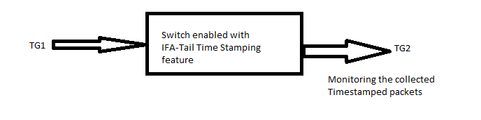
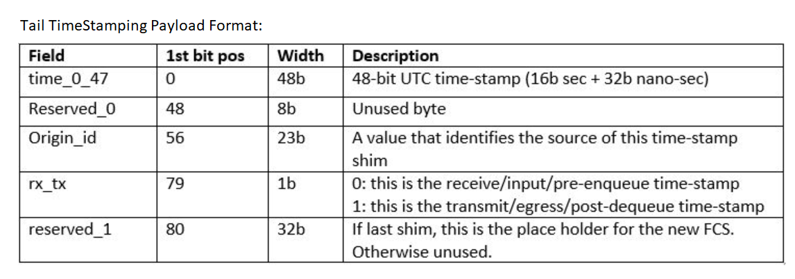
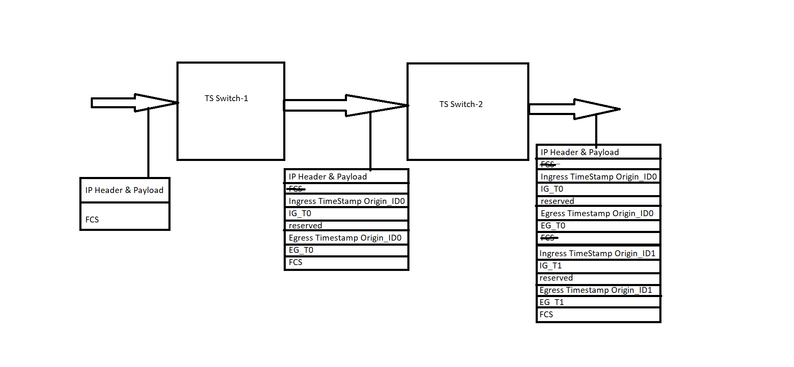
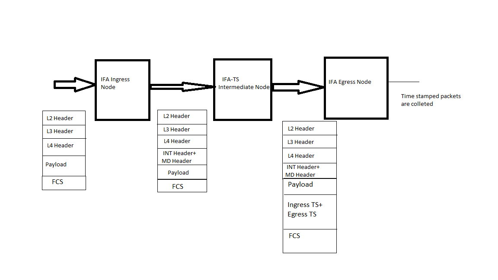

#  SQA Test Plan
#  Tail TimeStamping
#  SONiC 3.0 - Buzznik Release
[TOC]
# Test Plan Revision History
| Rev | Date        | Author             | Change Description          |
|:---:|:-----------:|:------------------:|-----------------------------|
| 0.1 | 10/27/2019  | Rizwan Siddiqui    | Initial version             |
| 0.2 | 11/15/2019  | Tejaswini Buddi    | Revised Test Plan           |

# List of Reviewers
|  Function 		  | Name  				   |
|:-------------------:|:----------------------:|
|	Management		  |	 Giri Babu Sajja	   |
|   Management		  |  Sachin Suman		   |
|   QA				  |  Anil Kumar Kolkaleti  |
|   Dev				  |  Naveen Kumar Aketi	   |

# List of Approvers
|  Function    | Name            | Date Approved      |
|:------------:|:---------------:|:------------------:|
| Management   |  Giri Babu Sajja|                    |
| Management   |  Sachin Suman   |                    |

# Definition/Abbreviation
| Term | **Meaning**              |
| ---- | ------------------------ |
| TS   | Tail TimeStamping      |
| IFA  | Inband Flow Analyzer	  |
| TAM  | Telemetry and Monitoring |

# Feature Overview
Tail TimeStamping feature attaches arrival, departure times along with a switch identifier to a frame at one or more switches along a flow path across the network for a given set of flows matching the user provided criterion. A network monitoring application can analyze the time-stamps and measure the latency of a flow across the network,trace packets across a path and validate arrival sequence.

# Test Approach

### What will be part of module config?

Module Config will have below items covered.

1. Ensure Min Topology, feature supported platform and feature availability check, initializing TG port handlers and creating TG streams,
    creating routing interfaces, needed show commands to check/debug the configuration.

2. Tail TimeStampingfeature configuration such as entering into TAM mode, int-ifa-ts mode and flow configuration.

3. ACL rules & ACL tables, 'IFA-TS' flows and their corresponding TG streams configuration.

### What Utility will be used?

SpyTest framework TG packet capture utility will be used for analyzing the tail time-stamped packets.

###  What 3rd party tools to be tested for?

NA

### Combinations covered

1. Verifying functionality using stand alone DUT by configuring different flows.

2. Verifying functionality having 2 IFA-TS switches in the topology.

3. Verifying functionality by placing IFA-TS device as Intermediate in between to TD3 switches (Ingress & Egress nodes) for 3 node IFA end to end functionality. 

### Which area of the test plan covers common warm-boot, cold boot tests of the given feature?

Section 3.3 of the Test Plan covers test scenarios related to warm-reboot, cold reboot, fast-reboot, config-reload. All these will be tested under  'test_system_save_reboot.py', 'test_system_warm_reboot.py' test functions.

### List of tests which can not be automated and why?
NA

### What is the plan for covering secondary UI ( Ex:- gNMI / REST ) and how much?

Validating 'Tail Time-Stamping' feature configuration through gNMI, REST will be taken care by SpyTest infra team.

### Platform dependencies ( If the feature is supported only on some specific platforms, list them out )

'Tail Time-Stamping' feature is supported on TH2 and TD3.

### Reuse of any existing scripts / modules.

We plan to use existing IFA module config and some of the test functions i.e. ingress-node and egress-node. 

### Target run time for the scripts

Estimated run time would be 5-7 minutes (excluding other reboot tests).

# 1.Test Focus Areas

## 1.1 Functional Testing

   - All KLISH CLI, REST, gNMI
   - Feature functionality for 'Tail Time-Stamping'

## 1.2 Negative Testing

   - Link Shut/non shut
   - Warm Reboot
   - Cold Reboot
   - Reload/kill TAM container
   - Config reload

# 2.Topologies
## 2.1 Topology-1

## 2.2 Topology-2

## 2.3 Topology-3

# 3.Test  Case and Objectives

## 3.1 Functional

### 3.1.1 Verify that  Tail Time-stamping can be used to find out switch / chip level latency and check the packet length and fields.

| **Test ID**    | **ft_tail_ts_switch_level_latency**                          |
| -------------- | :----------------------------------------------------------- |
| **Test Name**  | **Verify that  Tail Time-stamping can be used to find out switch / chip level latency and check the packet length and fields** |
| **Test Setup** | **Topology-1**                                               |
| **Type**       | **Functionality**                                            |
| **Steps**      | **Setup: 1) Switch connected to TG ports. 2) Switch reachable through management interface. 3) Switch with IFA-TS feature availability. 4) Place the ACL rule and ACL table in the 'config_db.json' file such that the ACL includes IFA-TS Policy. 5) Routing configured and ARP resolved for TG ports. Procedure: 1) Bring up the DUT with default configuration. 2) Enter into tam mode and configure device-id & enter into int-ifa-ts mode, enable tail-stamping feature. 3) Configure a flow using 5-tuple to be used for tail-stamping. 4) Send the traffic with matching flow and capture the packets on egress side (Mirroring should be done on the egress port to capture but it is not necessary ,directly capture the traffic at egress port) also check the packet length and fields like origin ID, Ingress & Egress time-stamps Expected Behavior: 1) Verify that DUT is UP with default configuration. 2) Verify that feature is enabled. 3) Verify that flow is created. 4 ) Verify that captured packets has specific length and respective fields. The difference between ingress-enqueue timestamp from egress-dequeue gives the chip latency.** |

### 3.1.2 Verify that each node in the Tail Time-stamping topology insert time-stamps for different flows.

| **Test ID**    | **ft_tail_ts_per_flow**                                      |
| -------------- | :----------------------------------------------------------- |
| **Test Name**  | **Verify that each node in the Tail Time-stamping topology insert time-stamps for different flows.** |
| **Test Setup** | **Topology-1**                                               |
| **Type**       | **Functionality**                                            |
| **Steps**      | **Setup: 1) Switch connected to TG ports. 2) Switch reachable through management interface 3) Switch with IFA-TS feature availability 4) Place the ACL rule and ACL table in the 'config_db.json' file such that the ACL includes IFA-TS Policy 5) Routing configured and ARP resolved for TG ports Procedure: 1) Bring up the DUT with default configuration. 2) Enter into tam mode and configure device-id & enter into int-ifa-ts mode, enable tail-stamping feature. 3) Configure  flows using 5-tuple to be used for tail-stamping. 4) Send the traffic with one or more matching flows and capture the packets on egress side & observe the Time stamped packet format, length Expected Behavior: 1) Verify that DUT is UP with default configuration. 2) Verify that feature is enabled. 3) Verify that flow is created. 4) Verify that for each flow we observe that timestamps are attached with correct payload format.** |

### 3.1.3 Verify that CRC will be recalculated after insertion of the Timestamp payload.

| **Test ID**    | **ft_tail_ts_crc_calculation**                               |
| -------------- | :----------------------------------------------------------- |
| **Test Name**  | **Verify that CRC will be recalculated after insertion of the Timestamp payload.** |
| **Test Setup** | **Topology-1**                                               |
| **Type**       | **Functionality**                                            |
| **Steps**      | **Setup: 1) Switch connected to TG ports. 2) Switch reachable through management interface 3) Switch with IFA-TS feature availability 4) Place the ACL rule and ACL table in the 'config_db.json' file such that the ACL includes IFA-TS Policy 5) Routing configured and ARP resolved for TG ports Procedure: 1) Bring up the DUT with default configuration. 2) Enter into tam mode and configure device-id & enter into int-ifa-ts mode, enable tail-stamping feature. 3) Configure a flow using 5-tuple to be used for tail-stamping. 4) Configure per flow tail-stamping on each device  5) Send the traffic with matching flow and capture the packets on egress side & observe the Time stamped packet format and calculate CRC Expected Behavior: 1) Verify that DUT is UP with default configuration. 2) Verify that feature is enabled. 3) Verify that flow is created. 4) Observe the captured packet  ingress and egress time stamps will be inserted at the end of the frame before the CRC and CRC will be recalculated after insertion of the payload. Note: CRC verification is possible with checking the packet FCS before enabling the feature and after the feature enabled and observe the change in CRC.** |

### 3.1.4 Verify IFA functionality by configuring the TH2 as Intermediate which can able to insert timestamps..

| **Test ID**    | **ft_tail_ts_config_intermediate**                           |
| -------------- | :----------------------------------------------------------- |
| **Test Name**  | **Verify IFA functionality by configuring the TH2 as Intermediate which can able to insert timestamps.** |
| **Test Setup** | **Topology-3**                                               |
| **Type**       | **Functionality**                                            |
| **Steps**      | **Setup: 3-DUT Topology having intermediate node as TH2 with tail time-stamp support. Procedural Steps : 1) Bring up the switch with default configuration and check IFA feature status. 2) Configure switch1 as IFA ingress node and Switch 2 to TS feature enabled in which Switch2 acts as intermediate node in IFA 3) Create an IFA flow  & Configure an IFA session, add the created IFA flow to the session and start the IFA session from Switch 1 4) Send traffic  (matching configured 5-tuple flow info ) and stop the traffic and TG capture the egress device. Captured packets have IFA header and meta-data inserted along with time-stamps and the timestamped packets are reformatted 5) verify that egress node sends report packets to collector. The report should carry information about three nodes. Expected Behavior : 1) Verify that IFA feature is disabled by default. 2) Verify the configuration is successful. 3) Verify that flows are created on Switch1 4) Verify that captured packets are correctly inserted with Ingress and egress time-stamps along with IFA Metadata.  5) Verify that packet is in correct format.** |

### 3.1.5 Verify functionality of Tail Time-stamping in a 2 node topology.

| **Test ID**    | **ft_tail_ts_config_per_device**                             |
| -------------- | :----------------------------------------------------------- |
| **Test Name**  | **Verify functionality of Tail Time-stamping in a 2 node topology.** |
| **Test Setup** | **Topology-2**                                               |
| **Type**       | **Functionality**                                            |
| **Steps**      | **Setup: 2-DUT Topology with IFA-TS Support Procedure: 1) Bring up the DUT with default configuration. 2) Enter into tam mode and configure device-id & enter into int-ifa-ts mode, enable tail-stamping feature on both the devices 3) Configure  flow using 5-tuple to be used for tail-stamping on both devices 4) Send the traffic with matching flow and capture the packets on egress side of the second switch and observe the Timestamped fields Expected Behavior: 1) Verify that DUT is UP with default configuration. 2) Verify that feature is enabled. 3) Verify that flow is created. 4) Verify that each device adds time-stamps and check the correct packet format at the egress side** |

### 3.1.6 Verify that  Tail Time-stamping works fine for the max MTU configured for the incoming flow.

| **Test ID**    | **ft_tail_ts_port_mtu_config**                                |
| -------------- | :----------------------------------------------------------- |
| **Test Name**  | **Verify that  Tail Time-stamping works fine for the max MTU configured for the incoming flow.** |
| **Test Setup** | **Topology-1**                                               |
| **Type**       | **Functionality**                                            |
| **Steps**      | **Setup: 1) Switch connected to TG ports. 2) Switch reachable through management interface 3) Switch with IFA-TS feature availability 4) Place the ACL rule and ACL table in the 'config_db.json' file such that the ACL includes IFA-TS Policy 5) Routing configured and ARP resolved for TG ports Procedure: 1) Bring up the DUT with default configuration. 2) Enter into tam mode and configure device-id & enter into int-ifa-ts mode, enable tail-stamping feature. 3) Configure a flow using 5-tuple to be used for tail-stamping. 4) Capture the egress port  & Send traffic as per configured MTU and configured flow and check the packet tail-stamp info at TG capture Expected Behavior: 1) Verify that DUT is UP with default configuration. 2) Verify that feature is enabled. 3) Verify that flow is created. 4) Verify that captured packets show ingress and egress tail-stamp for each node correctly and also the packet length** |

### 3.1.7 Verify that Tail Time-stamping append time-stamps for packets destined to CPU only if the frame matches the user provided IFA-TS flow criterion.

| **Test ID**    | **ft_tail_ts_cpu_pkts_time_stamped**                          |
| -------------- | :----------------------------------------------------------- |
| **Test Name**  | **Verify that Tail Time-stamping append time-stamps for packets destined to CPU only if the frame matches the user provided IFA-TS flow criterion.** |
| **Test Setup** | **Topology-1**                                               |
| **Type**       | **Functionality**                                            |
| **Steps**      | **Setup: 1) Switch connected to TG ports. 2) Switch reachable through management interface 3) Switch with IFA-TS feature availability 4) Place the ACL rule and ACL table in the 'config_db.json' file such that the ACL includes IFA-TS Policy 5) Routing configured and ARP resolved for TG ports Procedure: 1) Bring up the DUT with default configuration. 2) Enter into tam mode and configure device-id & enter into int-ifa-ts mode, enable tail-stamping feature. 3) Configure a flow using 5-tuple to be used for tail-stamping. 4) Capture the egress port  & Send traffic destined to CPU (broadcast or multicast destination MAC) as per configured flow and check the packet tail-stamp info at TG capture Expected Behavior: 1) Verify that DUT is UP with default configuration. 2) Verify that feature is enabled. 3) Verify that flow is created. 4) Verify that CPU packets will be time-stamped if the frame matches the user provided IFA-TS flow criterion** |

## 3.2 Negative

### 3.2.1 Verify that incoming traffic packets do not get tail time-stamped if they do not match the configured flow.

| **Test ID**    | **ft_tail_ts_unconfig _traffic_flow**                         |
| -------------- | :----------------------------------------------------------- |
| **Test Name**  | **Verify that incoming traffic packets do not get tail time-stamped if they do not match the configured flow.** |
| **Test Setup** | **Topology-1**                                               |
| **Type**       | **Negative**                                                 |
| **Steps**      | **Setup: 1) Switch connected to TG ports. 2) Switch reachable through management interface 3) Switch with IFA-TS feature availability 4) Place the ACL rule and ACL table in the 'config_db.json' file such that the ACL includes IFA-TS Policy 5) Routing configured and ARP resolved for TG ports Procedure: 1) Bring up the DUT with default configuration. 2) Enter into tam mode and configure device-id & enter into int-ifa-ts mode, enable tail-stamping feature. 3) Configure a flow using 5-tuple to be used for tail-stamping. 4) Send the traffic with unconfigured flow and observe the packet capture. Expected Behavior: 1) Verify that DUT is UP with default configuration. 2) Verify that feature is enabled. 3) Verify that flow is created. 4) Verify that packets are not time stamped.** |

### 3.2.2 Verify Tail Time-stamping  resumes after link shut/no-shut.

| **Test ID**    | **ft_tail_ts_link_shut_noshut**                              |
| -------------- | :----------------------------------------------------------- |
| **Test Name**  | **Verify Tail Time-stamping  resumes after link shut/no-shut.** |
| **Test Setup** | **Topology-1**                                               |
| **Type**       | **Negative**                                                 |
| **Steps**      | **Setup: 1) Switch connected to TG ports. 2) Switch reachable through management interface 3) Switch with IFA-TS feature availability 4) Place the ACL rule and ACL table in the 'config_db.json' file such that the ACL includes IFA-TS Policy 5) Routing configured and ARP resolved for TG ports Procedure: 1) Bring up the DUT with default configuration. 2) Enter into tam mode and configure device-id & enter into int-ifa-ts mode, enable tail-stamping feature. 3) Configure a flow using 5-Tuple info to look for a specific pattern in the incoming flow of traffic. 4) Send packets matching the configured flow and check the behavior. 5) Do a shut/no-shut on traffic sending links and check feature behavior.  Expected Behavior: 1) Verify that DUT is UP with default configuration. 2) Verify that feature is enabled. 3) Verify that configuration is successful. 4) Verify that packets are tail-stampled. 5) Verify that once the link come back UP, feature functionality resumes.** |

## 3.3 Reboot/Reload Test Cases

### 3.3.1 Verify that Tail Time-Stamping warm-reboot functionality works fine.

| **Test ID**    | **ft_tail_ts_warm_reboot**                                   |
| -------------- | :----------------------------------------------------------- |
| **Test Name**  | **Verify that Tail Time-Stamping warm-reboot functionality works fine.** |
| **Test Setup** | **Topology-1**                                               |
| **Type**       | **Functional**                                               |
| **Steps**      | **Setup: 1) Switch connected to TG ports. 2) Switch reachable through management interface 3) Switch with IFA-TS feature availability 4) Place the ACL rule and ACL table in the 'config_db.json' file such that the ACL includes IFA-TS Policy. 5) Routing configured and ARP resolved for TG ports Procedure: 1) Bring up the DUT with default configuration. 2) Enter into tam mode and configure device-id & enter into int-ifa-ts mode, enable tail-stamping feature. 3) Configure a flow using 5-tuple to be used for tail-stamping 4)Save the configuration, perform a warm-reboot and check the behavior. Expected Behavior: 1) Verify that DUT is UP with default configuration. 2) Verify that configuration is successful. 3) Verify that config is successful. 4) Verify that IFA-Tail Time-Stamping configuration comes up fine after warm reboot** |

### 3.3.2 Verify that Tail Time-Stamping cold-reboot functionality works fine.

| **Test ID**    | **ft_tail_ts_cold_reboot**                                   |
| -------------- | :----------------------------------------------------------- |
| **Test Name**  | **Verify that Tail Time-Stamping cold-reboot functionality works fine.** |
| **Test Setup** | **Topology-1**                                               |
| **Type**       | **Functional**                                               |
| **Steps**      | **Setup: 1) Switch connected to TG ports. 2) Switch reachable through management interface 3) Switch with IFA-TS feature availability 4) Place the ACL rule and ACL table in the 'config_db.json' file such that the ACL includes IFA-TS Policy 5) Routing configured and ARP resolved for TG ports Procedure: 1) Bring up the DUT with default configuration. 2) Enter into tam mode and configure device-id & enter into int-ifa-ts mode, enable tail-stamping feature. 3) Configure a flow using 5-tuple to be used for tail-stamping. 4) Save the config and do a cold-reboot and check the behavior. Expected Behavior: 1) Verify that DUT is UP with default configuration. 2) Verify that feature is enabled. 3) Verify that configuration is successful. 4) Verify that Tail TimeStampingconfiguration comes up fine after warm reboot** |

### 3.3.3 Verify that Tail Time-Stamping config reload works fine.

| **Test ID**    | **ft_ts_config_reload**                                      |
| -------------- | :----------------------------------------------------------- |
| **Test Name**  | **Verify that Tail TimeStamping config reload works fine.**  |
| **Test Setup** | **Topology-1**                                               |
| **Type**       | **Functional**                                               |
| **Steps**      | **Setup: 1) Switch connected to TG ports. 2) Switch reachable through management interface 3) Switch with IFA-TS feature availability 4) Place the ACL rule and ACL table in the 'config_db.json' file such that the ACL includes IFA-TS Policy 5) Routing configured and ARP resolved for TG ports Procedure: 1) Bring up the DUT with default configuration. 2) Enter into tam mode and configure device-id & enter into int-ifa-ts mode, enable tail-stamping feature. 3) Configure a flow using 5-tuple to be used for tail-stamping 4) Reload the configuration and check the configuration. Expected Behavior: 1) Verify that DUT is UP with default configuration. 2) Verify that feature is enabled. 3) Verify that configuration is successful. 4) Verify that reload config functionality works fine, configuration is applied back to the switch.** |

### 3.3.4 Verify Tail Time-Stamping  configuration gets removed when TAM docker is restarted.

| **Test ID**    | **ft_ts_docker_restart**                                     |
| -------------- | :----------------------------------------------------------- |
| **Test Name**  | **Verify Tail Time-Stamping  configuration gets removed when TAM docker is restarted.** |
| **Test Setup** | **Topology-1**                                               |
| **Type**       | **Functional**                                               |
| **Steps**      | **Setup: 1) Switch connected to TG ports. 2) Switch reachable through management interface 3) Switch with IFA-TS feature availability 4) Place the ACL rule and ACL table in the 'config_db.json' file such that the ACL includes IFA-TS Policy 5) Routing configured and ARP resolved for TG ports Procedure: 1) Bring up the DUT with default configuration. 2) Enable Tail TimeStampingfeature. 3) Configure a flow using 5-tuple to be used for tail-stamping 4) Restart TAM docker and check the configuration. 5) Repeat above steps #2 & 3. Expected Behavior: 1) Verify that DUT is UP with default configuration. 2) Verify that feature is enabled. 3) Verify that configuration is successful. 4) Verify that TS configuration gets removed.  5) Verify that TS configuration is successful after docker restart.** |

## 3.4 Scalability

### 3.4.1 Verify that Tail Time-Stamping  behavior when configured with max flows.

| **Test ID**    | **ft_tail_ts_config_max_flows**                              |
| -------------- | :----------------------------------------------------------- |
| **Test Name**  | **Verify that Tail Time-Stamping behavior when configured with max flows** |
| **Test Setup** | **Topology-1**                                               |
| **Type**       | **Scalability**                                              |
| **Steps**      | **Setup: 1) Switch connected to TG ports. 2) Switch reachable through management interface 3) Switch with IFA-TS feature availability 4) Place the ACL rule and ACL table in the 'config_db.json' file such that the ACL includes IFA-TS Policies for max flows.  5) Routing configured and ARP resolved for TG ports. Procedure: 1) Bring up the DUT with default configuration. 2) Enter into tam mode and configure device-id & enter into int-ifa-ts mode, enable tail-stamping feature. 3) Configure max flows using 5-tuple to be used for tail-stamping. 4) Start traffic with matching flows and capture the egress port. 5) Pick any two or more random flows from the max flows and check tail time-stamping functionality. Expected Behavior: 1) Verify that DUT is UP with default configuration. 2) Verify that feature is enabled. 3) Verify that max flows are created. 4) Verify routing is configured and ARP is resolved. 5) Verify that tail time-stamping functionality works fine for the chosen flows from the max configured flows. ** |

## 3.5 Management
### 3.5.1 gNMI
This section will be taken care by Automation infrastructure testing
### 3.5.1 REST APIs
This section will be taken care by Automation infrastructure testing

# 4.Reference Links
<http://gerrit-lvn-07.lvn.broadcom.net:8083/c/sonic/documents/+/12983/5/devops/telemetry/SONiC_TimeStamping_FeatureSpec.md