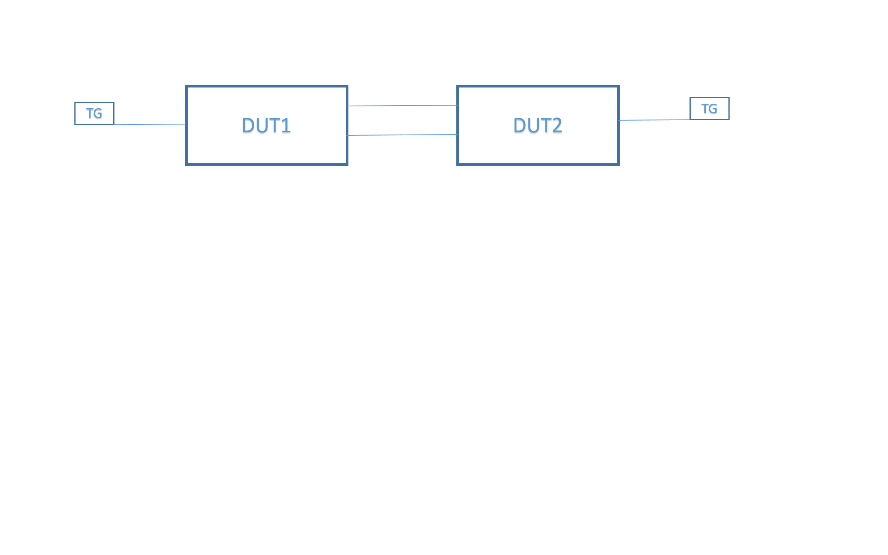

#  SQA Test Plan
# SONiC Interface Enhancements
# SONiC 3.3.0 Release
[TOC]
# Test Plan Revision History
| Rev | Date | Author | Change Description |
|:---:|:-----------:|:------------------:|-----------------------------|
| 0.1 | 08/20/2021 | Pavan Kumar Kasula | Initial version |

# List of Reviewers
|  Function | Name |
|:---:|:-----------:|
|  |   |

# List of Approvers
|  Function | Name | Date Approved|
|:---:|:-----------:|:------------------:|
|  |   |  |

# Definition/Abbreviation
| **Term** | **Meaning**                     |
| -------- | ------------------------------- |
| VLAN     | Virtual Local Area Network       |

# Introduction
# Objective
This document provides functional and design information about "shutdown" support for VLAN and Loopback interfaces.

# Scope
    Only Vlan and Loopback level shut/no shut of interface is covered
# Feature Overview
   ## VLAN
			Add support for admin state configuration to bring the VLAN interface up or down using KLISH CLI commmand -"[no] shutdown", REST or gNMI.
			VLAN interface will be Operationally down when admin state is down, irrespective of the autostate setting and members oper state.
			When the VLAN interface is "administratively down" or "shutdown", the L3 functions within that VLAN will be disabled, and L2 traffic will continue to flow.
			By default, the VLAN's state in kernel is down and changes to up only when first port/LAG in the VLAN is oper up or autostate is disabled and admin state is up.
   ## Loopback
			Add support for admin state configuration via KLISH CLI option-"[no] shutdown", REST or gNMI.
			By default, admin state & oper state is up.

# 1 Test Focus Areas
## 1.1 Functional Testing 
			Enable/disable VLAN and Loopback interfaces via gNMI, REST or KLISH CLI.
			Provide management framework capability to handle admin state configuration for VLAN & Loopback interfaces.
			To administratively bring the VLAN and Loopback interface down, use "shutdown" command.
			To return the interface to its default admin state, use "no shutdown".
			The above configurations should be displayed as part of a show command.

# 2 Topologies
## 2.1 Topology 1

# 3 Test  Case and Objectives
## 3.1 CLI
### 3.1.1 Configure VLAN shut/no shut cli and check running config
| **Test ID** | **Vlan_State_func_001** |
|--------|:----------------|
| **Test Name** | **Configure VLAN shut/no shut cli and check running config** |
| **Test Setup** | **Topology1** |
| **Type** | **CLI** |
| **Steps** | **1. Configure vlans100,200   2. Verify CLI to shutdown/no shutdown vlan admin state works in klish   3. Verify "show vlan" displays the vlan state field as per the configuration   4.Verify running-config displays the vlan config** |

## 3.2 Functional
### 3.2.1 To Verify Vlan state with default config
| **Test ID**    | **Vlan_State_func_002**                                |
| -------------- | :----------------------------------------------------------- |
| **Test Name**  | **To Verify Vlan state with default config** |
| **Test Setup** | **Topology1**                                                |
| **Type**       | **Functional**                                               |
| **Steps**      |**1. Configure Vlan100 on D1   2. Verify Vlan have admin UP and oper state shows Down   3. Do “Shutdown” under VLAN and Verify VLAN's admin state is down and oper state is down   4. Delete and add vlan   5. Do “no Shutdown” under VLAN and Verify VLAN's admin state is UP and oper state is Down** |

### 3.2.2 To Verify Vlan state with autostate disabled
| **Test ID**    | **Vlan_State_func_003**                                |
| -------------- | :----------------------------------------------------------- |
| **Test Name**  | **To Verify Vlan state with autostate disabled** |
| **Test Setup** | **Topology1**                                                |
| **Type**       | **Functional**                                               |
| **Steps**      |**1. Configure Vlan100 on D1   2. Do “Shutdown”   3. Disable autostate under VLAN and Verify VLAN's admin state is down and oper state is down   4. Delete and add vlan   5. Do “no Shutdown”   6. Disable autostate under VLAN and Verify VLAN's admin state is Up and oper state is Up** |

### 3.2.3 To Verify Vlan state by adding/removing physical port, with/without autostate disabled
| **Test ID**    | **Vlan_State_func_004**                                |
| -------------- | :----------------------------------------------------------- |
| **Test Name**  |**To Verify Vlan state by adding/removing physical port, with/without autostate disabled** |
| **Test Setup** | **Topology1**                                                |
| **Type**       | **Functional**                                               |
| **Steps**      |**1. Configure Vlan100 on D1   2. Do “Shutdown” under VLAN   3. Enable autostate   4. Create vlan member Verify Vlan have admin Down and oper state shows Down   5. Do “Shutdown” under VLAN   6. Verify Vlan have admin UP and oper state shows UP** |

### 3.2.4 To Verify Vlan state by adding/removing portchannel, with/without autostate disabled
| **Test ID**    | **Vlan_State_func_005**                                |
| -------------- | :----------------------------------------------------------- |
| **Test Name**  |**To Verify VLAN's state by add/del active port-channel to VLAN ** |
| **Test Setup** | **Topology1**                                                |
| **Type**       | **Functional**                                               |
| **Steps**      | **1. Configure Vlan100 on D1   2. Do “no Shutdown” under VLAN   3. Add portchannel 10 under vlan100 and Verify VLAN's admin state is Up and oper state is Up   4. Do “ Shutdown” under VLAN   5. Delete and add vlan   6. Verify VLAN's state is admin down and oper down** |

### 3.2.5 To Verify mac learning when vlan is shutdown
| **Test ID**    | **Vlan_State_func_005*                                |
| -------------- | :----------------------------------------------------------- |
| **Test Name**  |**To Verify mac learning when vlan is shutdown** |
| **Test Setup** | **Topology1**                                                |
| **Type**       | **Functional**                                               |
| **Steps**      |**1. Configure Vlan100   2. Do “Shutdown” under VLAN   3.Verify Vlan have admin down oper state shows UP   3. verify L2 forwarding is happening and its mac entries learned** |

### 3.2.6To Verify VLAN's state by doing "shutdown" under the VLAN range
| **Test ID**    | **Vlan_State_func_006**                                |
| -------------- | :----------------------------------------------------------- |
| **Test Name**  | **To Verify VLAN's state by doing "shutdown" under the VLAN range** |
| **Test Setup** | **Topology1**                                                |
| **Type**       | **Functional**                                               |
| **Steps**      |**1. Configure interface Vlan range 110-200 on D1    2. Do “shutdown” under vlan range   3. Verify VLAN's state is admin down and oper down** |

### 3.2.7To Verify VLAN's state by Configure ip address in VLAN interface, then "shutdown" the already active VLAN interface
| **Test ID**    | **Vlan_State_func_007**                                |
| -------------- | :----------------------------------------------------------- |
| **Test Name**  | **To Verify VLAN's state by Configure ip address in VLAN interface, then "shut/noshut" the already active VLAN interface** |
| **Test Setup** | **Topology1**                                                |
| **Type**       | **Functional**                                               |
| **Steps**      |**1. Configure Vlan100 on D1   2.  Do “shutdown” under vlan   3. Configure IP addr under intf vlan100   4. Verify network address is not in the IP routing table and it's IP cannot be pinged   5. Do “no shutdown” under vlan   6. Verify VLAN is admin up and oper up, and network address is in the IP routing table** |

### 3.2.8To Verify ARP entries When the VLAN interface is shutdown
| **Test ID**    | **Vlan_State_func_008*                                |
| -------------- | :----------------------------------------------------------- |
| **Test Name**  | **To Verify ARP entries When the VLAN interface is shutdown** |
| **Test Setup** | **Topology1**                                                |
| **Type**       | **Functional**                                               |
| **Steps**      |**1. Configure Vlan100    2.  Do “shutdown” under vlan   3. Configure IP addr under intf vlan100   4. Verify network address is not in the IP routing table and it's IP cannot be pinged   5. verify arp entries that should removed   6. Do “no shutdown” under vlan   7. Verify VLAN is admin up and oper up, and network address is in the IP routing table   8. verify arp entries that should removed  ** |

### 3.2.9To verify Loopback state with default config
| **Test ID**    | **Vlan_State_func_009*                                |
| -------------- | :----------------------------------------------------------- |
| **Test Name**  | **To verify Loopback state with default config** |
| **Test Setup** | **Topology1**                                                |
| **Type**       | **Functional**                                               |
| **Steps**      |**1. Configure Loopback interface 10   2. Do shutdown   3. Verify Loopback state is admin down and oper down   4. Delete Loopback and add  5. Do no shut and Verify VLAN's state is admin up and oper up & Loopback interface routing is working** |

### 3.2.10 To Verify Loopback interface state by Configure ip address in loopback interface, then "shut/noshut"

| **Test ID**    | **Vlan_State_func_010**                                |
| -------------- | :----------------------------------------------------------- |
| **Test Name**  | **To Verify Loopback interface state by Configure ip address in loopback interface, then "shut/noshut"** |
| **Test Setup** | **Topology1**                                                |
| **Type**       | **Functional**                                               |
| **Steps**      |**1. Configure Loopback interface 10   2. Do shutdown   3. Configure IP address under interface Loopback10   4. Verify network address not in the IP routing table and not able to ping the IP address   5. Do “no shutdown” and Verify network address in the IP routing table and can be pinged ** |

### 3.2.11 To Verify Loopback interface state by Configure ip address in loopback interface, then "shut/noshut"

| **Test ID**    | **Vlan_State_func_011**                                |
| -------------- | :----------------------------------------------------------- |
| **Test Name**  | **To Verify Loopback interface state by Configure ip address in loopback interface, then "shut/noshut"** |
| **Test Setup** | **Topology1**                                                |
| **Type**       | **Functional**                                               |
| **Steps**      |**1. Configure Loopback interface 10   2. Do shutdown   3. Configure IP address under interface Loopback10   4. Verify network address not in the IP routing table and not able to ping the IP address   5. delete and add Loopback interface 6. Do “no shutdown” and Verify network address in the IP routing table and can be pinged ** |

### 3.2.12 To Verify ARP entries should remove when Loopback interface is Shutdown

| **Test ID**    | **Vlan_State_func_012**                                |
| -------------- | :----------------------------------------------------------- |
| **Test Name**  | **To Verify ARP entries should remove when Loopback interface is Shutdown** |
| **Test Setup** | **Topology1**                                                |
| **Type**       | **Functional**                                               |
| **Steps**      |**1. Configure Loopback interface 10   2. Do shutdown   3. Configure IP address under interface Loopback10   4. Verify network address not in the IP routing table and not able to ping the IP address   5. Verify ARP entires should remove from ARP table   6. Do “no shutdown” and Verify network address in the IP routing table and can be pinged ** |

## 3.3 Reboot
#### 3.4.1 Add Reboot test cases here

### 3.3.1 To Verify VLAN state by rebooting VLAN with shut/noshut

| **Test ID**    | **Vlan_State_func_013**                                |
| -------------- | :----------------------------------------------------------- |
| **Test Name**  | **To Verify VLAN state by rebooting VLAN with shut/noshut** |
| **Test Setup** | **Topology1**                                                |
| **Type**       | **Functional**                                               |
| **Steps**   |**1. Configure Vlan100 on D1   2. Do “Shutdown” under VLAN and Verify VLAN's admin state is down after reboot   4. Do “no Shutdown” under VLAN and Verify VLAN's admin state is UP after reboot ** |

### 3.3.2 To Verify Loopback interface state by rebootig the dut with "shut/noshut"

| **Test ID**    | **Vlan_State_func_014**                                |
| -------------- | :----------------------------------------------------------- |
| **Test Name**  | **To Verify Loopback interface state by rebootig the dut with "shut/noshut"** |
| **Test Setup** | **Topology1**                                                |
| **Type**       | **Functional**                                               |
| **Steps**      |**1. Configure Loopback interface 10   2. Do shutdown   3. Reload the device by saving the configs   4. Verify Loopback state   5. Do “no shutdown” and do reboot   6. Verify Loopback state should not affect ** |
# 4 Reference Links

https://github.com/project-arlo/SONiC/blob/8048decbc5fbe4eb1056f0f73558e5617df029e6/doc/mgmt/SONiC_OC_Interface_Enhancements_HLD.md

