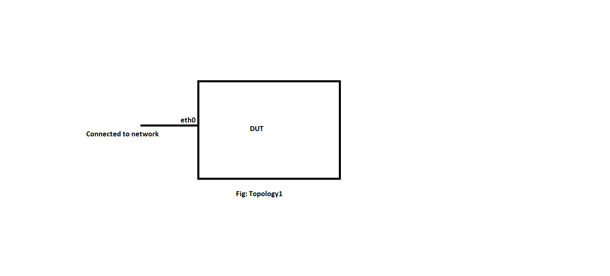

#  SQA Test Plan
#  SONIC YANG Patch
#  SONiC 4.0.0 Release

## Test Plan Revision History

| Rev  | Date       | Author          | Change Description |
| ---- | ---------- | --------------- | ------------------ |
| 0.1  | 6/28/2021  | Jagadish Ch     | Initial Version    |
| 0.2  | 6/28/2021  | Jagadish Ch     | Fixed alignment issues    |

## List of Reviewers

| Function | Name |
| :------: | :--: |
|    QA      |   Chandra Bhushan Singh   |
|    DEV     |   Mohammed Faraaz    |

## List of Approvers

| Function | Name | Date Approved |
| :------: | :--: | :-----------: |
|          |      |               |
|          |      |               |

## Definition/Abbreviation

| **Term** | **Meaning**                |
| -------- | -------------------------- |
|          |                            |
|          |                            |

## Feature Overview

  A "YANG Patch" is an ordered list of edits that are applied to the target configuration datastore by the RESTCONF server. The YANG Patch operation is invoked by the RESTCONF client by sending a PATCH method request with a representation using "application/yang-patch+json". The message-body representing the YANG Patch input parameters MUST be present.

## 1 Test Focus Areas

### 1.1 Functional Testing
  - Verify "patch-id" and "edit-id" accept any combination of characters.
  - Verify that yang patch operations "insert" and "move" are not supported.
  - Verify the yang patch operation "create" is successful for a new data resource.
  - Verify the yang patch operation "delete" is successful for an existing data resource.
  - Verify the yang patch operation "merge" is successful and creates the edit value if data resource doesn't exist.
  - Verify the yang patch operation "merge" is successful and merges the edit value if the data resource exists.
  - Verify the yang patch operation "replace" is successful and replaces the existing data resource with edit value.
  - Verify the yang patch operation "remove" is successful and removes the existing data resource.
  - Verify that yang patch call will not proceed if "edit-id"/"operation"/"target" is missing in edit.
  - Verify that yang patch call will not proceed if "patch-id" is missing.
  - Verify that edits are processed in client specified order.
  - Verify if any of the edit operations fails then the whole configuration won't be applied.
  - Verify that there is no relation between "patch-id" and "edit-id" of two consecutive yang patch calls.
  - Verify that yang patch operation will be successful even if the "patch-id" and "edit-id" are the same.
  - Verify the yang patch operation with target sub-resource as "/".
  - Verify yang patch operation calls with different target sub-resources(including "/").
  - Verify the yang patch fails if we use sub-resource not as list while that target sub-resource points to list.
  - Verify yang patch call with target sub-resources as containers with different types(list, non-list), container-leaf with different types(list, non-list).
  - Verify yang patch with all supported edit operations(single yang patch call).

### 1.2 Negative Testing
  - Verify the yang patch operation "create" returns error for an existing data resource.
  - Verify the yang patch operation "delete" returns an error for a non-existing data resource.
  - Verify the yang patch operation "replace" fails if the data resource doesn't exist.
  - Verify the yang patch operation "remove" doesn't report any error for non-existing data resources.
  - Verify that yang patch operation fails, with invalid edit "operation" e.g "operation" : "config".
  - Verify yang patch fails with duplicate "edit-id" for different edits.
  - Verify the error message while trying with invalid "value"(JSON).
  - Verify that target resource will not accept "/".
  - Verify that yang patch call will fail if we try edit operations delete/remove with value resource.

### 1.3 Scalability Testing
  - Verify that yang patch is successful with max number of characters for "patch-id" and "edit-id".
  - Verify yang patch with max number of edit operations.

## 2 Topologies
 

#### Topology 1
######Topology Description -
- Make sure management port of DUT(eth0) is connected to network.

## 3 Test Case and objectives

### 3.1 Functional Test Cases

#### 3.1.1 Verify "patch-id" and "edit-id" accept any combination of characters. 
| **Test ID**    |**YANG_PATCH_FUNC_001**                                               |
| -------------- | :----------------------------------------------------------- |
| **Test Name**  | **Verify "patch-id" and "edit-id" accept any combination of characters.** |
| **Test Setup** | **Topology 1**                                               |
| **Type**       | **Functional**                                               |
| **Steps**      | 1. Execute yang patch call with "patch-id" and "edit-id" as any combination of characters. 2. Observe that yang patch call doesn't fail because we don't have any restriction for "patch-id" and "edit-id" names.|

#### 3.1.2 Verify that yang patch operations "insert" and "move" are not supported. 
| **Test ID**    |**YANG_PATCH_FUNC_002**                                               |
| -------------- | :----------------------------------------------------------- |
| **Test Name**  | **Verify that yang patch operations "insert" and "move" are not supported.** |
| **Test Setup** | **Topology 1**                                               |
| **Type**       | **Functional**                                               |
| **Steps**      | 1. Execute yang patch call with "operation" as "insert". 2. Observe that yang patch call fails because the insert operation is not supported. 3. Execute yang patch call with "operation" as "move". 4. Observe the yang patch call fail because the move operation is not supported.|

#### 3.1.3 Verify the yang patch operation "create" is successful for a new data resource. 
| **Test ID**    |**YANG_PATCH_FUNC_003**                                               |
| -------------- | :----------------------------------------------------------- |
| **Test Name**  | **Verify the yang patch operation "create" is successful for a new data resource.** |
| **Test Setup** | **Topology 1**                                               |
| **Type**       | **Functional**                                               |
| **Steps**      | 1. Execute yang patch call with "operation" as "create" to configure a new PortChannel which doesn't exist before. 2. Observe that yang patch call is successful. 3. Verify that PortChannel is created.|

#### 3.1.4 Verify the yang patch operation "delete" is successful for an existing data resource. 
| **Test ID**    |**YANG_PATCH_FUNC_004**                                               |
| -------------- | :----------------------------------------------------------- |
| **Test Name**  | **Verify the yang patch operation "delete" is successful for an existing data resource.** |
| **Test Setup** | **Topology 1**                                               |
| **Type**       | **Functional**                                               |
| **Steps**      | 1. Configure a classifier. 2. Execute yang patch call with "operation" as "delete" to delete the classifier. 3. Observe that yang patch call is successful. 4. Verify that classifier is deleted.|

#### 3.1.5 Verify the yang patch operation "merge" is successful and creates the edit value if data resource doesn't exist. 
| **Test ID**    |**YANG_PATCH_FUNC_005**                                               |
| -------------- | :----------------------------------------------------------- |
| **Test Name**  | **Verify the yang patch operation "merge" is successful and creates the edit value if data resource doesn't exist.** |
| **Test Setup** | **Topology 1**                                               |
| **Type**       | **Functional**                                               |
| **Steps**      | 1. Configure ACL table. 2. Assume there is a rule in the ACL table with "sequence-id" as "1". 4. Now execute a yang patch call with "operation" as "merge" with value resource as for ACL rule of "sequence-id" as "1" with "l4_src_port" and "l4_dst_port" as 20 and 30 respectively. 4. Observe that yang patch call is successful. 5. Verify that ACL rule with sequence-id "1" is created.|

#### 3.1.6 Verify the yang patch operation "merge" is successful and merges the edit value if the data resource exists. 
| **Test ID**    |**YANG_PATCH_FUNC_006**                                               |
| -------------- | :----------------------------------------------------------- |
| **Test Name**  | **Verify the yang patch operation "merge" is successful and merges the edit value if the data resource exists.** |
| **Test Setup** | **Topology 1**                                               |
| **Type**       | **Functional**                                               |
| **Steps**      | 1. Configure ACL table with ACL rule of sequence-id, l4_src_port, l4_dst_port as 1, 20 and 30 respectively. 2. Now execute a yang patch call with "operation" as "merge" with value resource as ACL rule of "sequence-id", "l4_src_port" and "l4_dst_port" as 1, 30 and 20 respectively. 4. Observe the yang patch call successful. 5. Verify that ACL rule with sequence-id "1" is modified with "l4_src_port" and "l4_dst_port" as 30 and 20 respectively.|

#### 3.1.7 Verify the yang patch operation "replace" is successful and replaces the existing data resource with edit value. 
| **Test ID**    |**YANG_PATCH_FUNC_007**                                               |
| -------------- | :----------------------------------------------------------- |
| **Test Name**  | **Verify the yang patch operation "replace" is successful and replaces the existing data resource with edit value.** |
| **Test Setup** | **Topology 1**                                               |
| **Type**       | **Functional**                                               |
| **Steps**      | 1. Configure ACL table with ACL rule of sequence-id, l4_src_port, l4_dst_port as 1, 20 and 30 respectively. 2. Now execute a yang patch call with "operation" as "replace" with value resource as ACL rule of "sequence-id", "l4_src_port" and "l4_dst_port" as 1, 30 and 20 respectively. 4. Observe the yang patch call successful. 5. Verify that ACL rule with sequence-id "1" is modified with "l4_src_port" and "l4_dst_port" as 30 and 20 respectively.|

#### 3.1.8 Verify the yang patch operation "remove" is successful and removes the existing data resource.
| **Test ID**    |**YANG_PATCH_FUNC_008**                                               |
| -------------- | :----------------------------------------------------------- |
| **Test Name**  | **Verify the yang patch operation "remove" is successful and removes the existing data resource.** |
| **Test Setup** | **Topology 1**                                               |
| **Type**       | **Functional**                                               |
| **Steps**      | 1. Configure ACL table with ACL rule of sequence-id, l4_src_port, l4_dst_port as 1, 20 and 30 respectively. 2. Now execute patch call to remove the acl rule which is having the sequence-id as "1" with "operation" as "remove". 4. Observe that yang patch call is successful. 5. Verify that ACL rule with sequence-id "1" is removed.|

#### 3.1.9 Verify that yang patch call will not proceed if "edit-id"/"operation"/"target" is missing in edit.
| **Test ID**    |**YANG_PATCH_FUNC_009**                                               |
| -------------- | :----------------------------------------------------------- |
| **Test Name**  | **Verify that yang patch call will not proceed if "edit-id"/"operation"/"target" is missing in edit.** |
| **Test Setup** | **Topology 1**                                               |
| **Type**       | **Functional**                                               |
| **Steps**      | 1. Execute the yang patch call without the "edit-id" field in the edit. 2. Verify the yang patch will fail because the "edit-id" field is missing in the edit. 3. Execute the yang patch call without "operation" filed in the edit. 4. Verify the yang patch will fail because the "operation" field is missing in the edit. 5. Execute the yang patch call without "target" filed in the edit. 6. Verify the yang patch will fail because the "target" field is missing in the edit. 7. Execute the yang patch call without "edit-id", "operation", "target" fields in the edit. 8. Verify the yang patch will fail because the "edit-id", "operation", "target" fields are missing in the edit.|

#### 3.1.10 Verify that yang patch call will not proceed if "patch-id" is missing. 
| **Test ID**    |**YANG_PATCH_FUNC_010**                                               |
| -------------- | :----------------------------------------------------------- |
| **Test Name**  | **Verify that yang patch call will not proceed if "patch-id" is missing.** |
| **Test Setup** | **Topology 1**                                               |
| **Type**       | **Functional**                                               |
| **Steps**      | 1. Execute the yang patch call without the "patch-id" field. 2. Verify the yang patch will fail because the "patch-id" field is missing.|

#### 3.1.11 Verify that edits are processed in client specified order. 
| **Test ID**    |**YANG_PATCH_FUNC_011**                                               |
| -------------- | :----------------------------------------------------------- |
| **Test Name**  | **Verify that edits are processed in client specified order.** |
| **Test Setup** | **Topology 1**                                               |
| **Type**       | **Functional**                                               |
| **Steps**      | 1. Configure two VLANs. i.e. VLAN-10, VLAN-20. 2. Execute a patch call with two edits. In the first edit make a port as tagged member of VLAN-10, in second edit make the same port as tagged member of VLAN-20. 3. Observe that patch call will return an error with message "The port is already part of VLAN-10".|

#### 3.1.12 Verify if any of the edit operations fails then the whole configuration won't be applied. 
| **Test ID**    |**YANG_PATCH_FUNC_012**                                               |
| -------------- | :----------------------------------------------------------- |
| **Test Name**  | **Verify if any of the edit operations fails then the whole configuration won't be applied.** |
| **Test Setup** | **Topology 1**                                               |
| **Type**       | **Functional**                                               |
| **Steps**      | 1. Execute a patch call with two edits. In first edit configure ip address 10.10.10.1/24 on an interface, in second edit configure ip address in the same subnet i.e.10.10.10.2/24 on another interface. 2. Observe that patch call will fail because both the ip addresses are in the same subnet. 3. Verify there is no ip address configuration done as in the edits.|

#### 3.1.13 Verify that there is no relation between "patch-id" and "edit-id" of two consecutive yang patch calls. 
| **Test ID**    |**YANG_PATCH_FUNC_013**                                               |
| -------------- | :----------------------------------------------------------- |
| **Test Name**  | **Verify that there is no relation between "patch-id" and "edit-id" of two consecutive yang patch calls.** |
| **Test Setup** | **Topology 1**                                               |
| **Type**       | **Functional**                                               |
| **Steps**      | 1. Execute a yang patch call to configure a mirror-session with "patch-id" and "edit-id" as "config_mirror_session" and "edit1". 2. Verify the yang patch call is successful and the mirror-session is configured successfully. 3. Now try to delete the mirror-session using a yang patch call with "patch-id" and "edit-id" as "delete_mirror_session" and "edit2". 4. Verify the yang patch call is successful and the mirror-session is deleted successfully. |

#### 3.1.14 Verify that yang patch operation will be successful even if the "patch-id" and "edit-id" are the same. 
| **Test ID**    |**YANG_PATCH_FUNC_014**                                               |
| -------------- | :----------------------------------------------------------- |
| **Test Name**  | **Verify that yang patch operation will be successful even if the "patch-id" and "edit-id" are the same.** |
| **Test Setup** | **Topology 1**                                               |
| **Type**       | **Functional**                                               |
| **Steps**      | 1. Configure a policy-map using yang patch call with "patch-id" and "edit-id" as the same. 2. Verify the yang patch call is successful and the policy-map is configured.|

#### 3.1.15 Verify the yang patch operation with target sub-resource as "/". 
| **Test ID**    |**YANG_PATCH_FUNC_015**                                               |
| -------------- | :----------------------------------------------------------- |
| **Test Name**  | **Verify the yang patch operation with target sub-resource as "/".** |
| **Test Setup** | **Topology 1**                                               |
| **Type**       | **Functional**                                               |
| **Steps**      | 1. Enable UDLD globally using yang patch call with target sub-resource as "/". 2. Verify the yang patch call is successful and UDLD is enabled globally as configured.|

#### 3.1.16 Verify yang patch operation calls with different target sub-resources(including "/"). 
| **Test ID**    |**YANG_PATCH_FUNC_016**                                               |
| -------------- | :----------------------------------------------------------- |
| **Test Name**  | **Verify yang patch operation calls with different target sub-resources(including "/").** |
| **Test Setup** | **Topology 1**                                               |
| **Type**       | **Functional**                                               |
| **Steps**      | 1. Configure mtu and description for an interface within the same yang patch call with two edits. In one of the edits use sub-resources as "/". 2. Verify the yang patch call is successful and mtu, description values are reflected as configured.|

#### 3.1.17 Verify the yang patch fails if we use sub-resource not as list while that target sub-resource points to list. 
| **Test ID**    |**YANG_PATCH_FUNC_017**                                               |
| -------------- | :----------------------------------------------------------- |
| **Test Name**  | **Verify the yang patch fails if we use sub-resource not as list while that target sub-resource points to list.** |
| **Test Setup** | **Topology 1**                                               |
| **Type**       | **Functional**                                               |
| **Steps**      | 1. Execute yang patch with sub-resource not as list but actually target sub-resource points to list. 2. Verify that yang patch will fail due to invalid sub-resource value.|

#### 3.1.18 Verify yang patch call with target sub-resources as containers with different types(list, non-list), container-leaf with different types(list, non-list). 
| **Test ID**    |**YANG_PATCH_FUNC_018**                                               |
| -------------- | :----------------------------------------------------------- |
| **Test Name**  | **Verify yang patch call with target sub-resources as containers with different types(list, non-list), container-leaf with different types(list, non-list).** |
| **Test Setup** | **Topology 1**                                               |
| **Type**       | **Functional**                                               |
| **Steps**      | 1. Execute yang patch call with target sub-resources as containers with different types(list, non-list), container-leaf with different types(list, non-list). 2. Verify that yang patch call is successful.|

#### 3.1.19 Verify yang patch with all supported edit operations(single yang patch call). 
| **Test ID**    |**YANG_PATCH_FUNC_019**                                               |
| -------------- | :----------------------------------------------------------- |
| **Test Name**  | **Verify yang patch with all supported edit operations(single yang patch call).** |
| **Test Setup** | **Topology 1**                                               |
| **Type**       | **Functional**                                               |
| **Steps**      | 1. Execute yang patch call with all supported edit operations. 2. Verify that yang patch call is successfully executed.|

### 3.2 Negative Test Cases

#### 3.2.1 Verify the yang patch operation "create" returns error for an existing data resource.
| **Test ID**    |**YANG_PATCH_NEG_001**                                               |
| -------------- | :----------------------------------------------------------- |
| **Test Name**  | **Verify the yang patch operation "create" returns error for an existing data resource.** |
| **Test Setup** | **Topology 1**                                               |
| **Type**       | **Functional**                                               |
| **Steps**      | 1. Configure a VRF, let's say Vrf-101. 2. Try to configure the same VRF using yang-patch with edit operation as "create". 3. Observe yang-patch call fails because the entry already exists. 4. Verify that error message **"Data already exists; cannot be created"** in the RESTCONF server the response.|

#### 3.2.2 Verify the yang patch operation "delete" returns an error for a non-existing data resource.
| **Test ID**    |**YANG_PATCH_NEG_002**                                               |
| -------------- | :----------------------------------------------------------- |
| **Test Name**  | **Verify the yang patch operation "delete" returns an error for a non-existing data resource.** |
| **Test Setup** | **Topology 1**                                               |
| **Type**       | **Functional**                                               |
| **Steps**      | 1. Try to delete a PortChannel which is not created in DUT using yang-patch with edit operation as "delete". 3. Observe yang-patch call fails because the entry does not exist. 4. Verify that error message **"Data doesn't exist; cannot be deleted"** in the RESTCONF server the response.|

#### 3.2.3 Verify the yang patch operation "replace" fails if the data resource doesn't exist. 
| **Test ID**    |**YANG_PATCH_NEG_003**                                               |
| -------------- | :----------------------------------------------------------- |
| **Test Name**  | **Verify the yang patch operation "replace" fails if the data resource doesn't exist.** |
| **Test Setup** | **Topology 1**                                               |
| **Type**       | **Functional**                                               |
| **Steps**      | 1. Configure ACL table. 2. Assume there is a rule in the ACL table with "sequence-id" as "1". 4. Now execute a patch call with "operation" as "replace" with value resource as for ACL rule of "sequence-id" as "1" with "l4_src_port" and "l4_dst_port" as 20 and 30 respectively. 4. Observe that yang patch call fails. 5. Verify that error message **"Data doesn't exist; cannot be replaced"** in the RESTCONF server the response.|

#### 3.2.4 Verify the yang patch operation "remove" doesn't report any error for non-existing data resources.
| **Test ID**    |**YANG_PATCH_NEG_004**                                               |
| -------------- | :----------------------------------------------------------- |
| **Test Name**  | **Verify the yang patch operation "remove" doesn't report any error for non-existing data resources.** |
| **Test Setup** | **Topology 1**                                               |
| **Type**       | **Functional**                                               |
| **Steps**      | 1. Try to delete a PortChannel which is not created in DUT using yang-patch with edit operation as "remove". 3. Observe that yang-patch call doesn't fail even if the entry does not exist. 4. Verify that there is no error message found in the RESTCONF server response.|

#### 3.2.5 Verify that yang patch operation fails, with invalid edit "operation" e.g "operation" : "config". 
| **Test ID**    |**YANG_PATCH_NEG_005**                                               |
| -------------- | :----------------------------------------------------------- |
| **Test Name**  | **Verify that yang patch operation fails, with invalid edit "operation" e.g "operation" : "config".** |
| **Test Setup** | **Topology 1**                                               |
| **Type**       | **Functional**                                               |
| **Steps**      | 1. Execute yang patch call with invalid edit "operation", let's say "config". 2. Observe yang-patch call fails because the operation is invalid.|

#### 3.2.6 Verify yang patch fails with duplicate "edit-id" for different edits. 
| **Test ID**    |**YANG_PATCH_NEG_006**                                               |
| -------------- | :----------------------------------------------------------- |
| **Test Name**  | **Verify yang patch fails with duplicate "edit-id" for different edits.** |
| **Test Setup** | **Topology 1**                                               |
| **Type**       | **Functional**                                               |
| **Steps**      | 1. Execute yang patch call with at least two edits in the edit list with the same "edit-id" for all edits. 2. Observe yang-patch call fails because the same "edit-id" is used across the edits.|

#### 3.2.7 Verify the error message while trying with invalid "value"(JSON). 
| **Test ID**    |**YANG_PATCH_NEG_007**                                               |
| -------------- | :----------------------------------------------------------- |
| **Test Name**  | **Verify the error message while trying with invalid "value"(JSON).** |
| **Test Setup** | **Topology 1**                                               |
| **Type**       | **Functional**                                               |
| **Steps**      | 1. Execute yang patch call with invalid value resource. 2. Observe yang-patch call fails because the value resource is invalid.|

#### 3.2.8 Verify that target resource will not accept "/". 
| **Test ID**    |**YANG_PATCH_NEG_008**                                               |
| -------------- | :----------------------------------------------------------- |
| **Test Name**  | **Verify that target resource will not accept "/".** |
| **Test Setup** | **Topology 1**                                               |
| **Type**       | **Functional**                                               |
| **Steps**      | 1. Execute a yang patch call with target resource as "/" and mention the respective URI in the sub target resource of an edit. 2. Verify the yang patch call fails because sonic won't support root as target resource.|

#### 3.2.9 Verify that yang patch call will fail if we try edit operations delete/remove with value resource. 
| **Test ID**    |**YANG_PATCH_NEG_009**                                               |
| -------------- | :----------------------------------------------------------- |
| **Test Name**  | **Verify that yang patch call will fail if we try edit operations delete/remove with value resource.** |
| **Test Setup** | **Topology 1**                                               |
| **Type**       | **Functional**                                               |
| **Steps**      | 1. Configure a VLAN i.e. VLAN-10. 2. Try to delete that VLAN using yang patch call with value resource using edit operation "delete". 3. Verify that yang patch call will fail as value resource is not allowed for the edit operation "edit". 4. Repeat the above steps with the edit operation as "remove".|

### 3.3 Scaling Test Cases

#### 3.3.1 Verify that yang patch is successful with max number of characters for "patch-id" and "edit-id".  

| **Test ID**    |**YANG_PATCH_SCAL_001**                                               |
| -------------- | :----------------------------------------------------------- |
| **Test Name**  | **Verify that yang patch is successful with max number of characters for "patch-id" and "edit-id".** |
| **Test Setup** | **Topology 1**                                               |
| **Type**       | **Functional**                                               |
| **Steps**      | 1. Configure a PortChannel using yang-patch with "patch-id", "edit-id" of maximum characters and edit operation as "create". 2. Verify yang-patch operation is successful and PortChannel is created without any issues.|

#### 3.3.2 Verify yang patch with max number of edit operations.  

| **Test ID**    |**YANG_PATCH_SCAL_002**                                               |
| -------------- | :----------------------------------------------------------- |
| **Test Name**  | **Verify yang patch with max number of edit operations.** |
| **Test Setup** | **Topology 1**                                               |
| **Type**       | **Functional**                                               |
| **Steps**      | 1. Configure maximum number of VLANs using yang patch operation "create". For each VLAN configuration use a different edit within the same yang patch call. 2. Verify yang-patch operation is successful and VLANs are created without any issues. **Note:** The maximum number of edits allowed within a patch call is not specified in HLD.|

 
 

### 3.4 Management

#### 3.4.1 REST

## Reference Links

https://github.com/BRC/M-SONIC/sonic_doc_private/blob/fe5895f60dcae312db6ed9d7909c846d418f2d6c/manageability/mgmt-framework/Yang_Patch_HLD.md