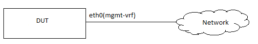

#  SQA Test Plan
# Management VRF
#  SONiC 3.0 Project and Buzznik Release
[TOC]
# Test Plan Revision History
| Rev | Date | Author | Change Description |
|:---:|:-----------:|:------------------:|-----------------------------|
| 0.1 | 10/29/2019 | Kiran Vedula | Initial version |
| 0.2 | 11/07/2019 | Kiran Vedula | Addressed review comments |
| 0.3 | 11/11/2019 | Kiran Vedula | Addressed review comments |

# List of Reviewers
|  Function | Name |
|:---:|:-----------:|
| QA |  Anil Kolkaleti
| QA |  Giribabu Sajja
| DEV |  Arun Barboza
| DEV |  Suresh Rupanagudi

# List of Approvers
|  Function | Name | Date Approved|
|:---:|:-----------:|:------------------:|
| QA | John Chrysogeles  |  |
| QA |  Giribabu Sajja   |  |
| DEV | Suresh Rupanagudi  |  |

# Definition/Abbreviation
| **Term** | **Meaning**                     |
| -------- | ------------------------------- |
| VRF     | Virtual Routing and Forwarding      |

# Feature Overview
Management VRF is a subset of VRF (virtual routing tables and forwarding) and provides a separation between the out-of-band management network and the in-band data plane network. For all VRFs, the main routing table is the default table for all of the data plane switch ports. With management VRF, a second table, mgmt, is used for routing through the Ethernet ports of the switch. The following design for mgmt-vrf uses the l3mdev approach for implementating mgmt-vrf on SONiC.

# 1 Test Focus Areas
## 1.1 Functional Testing 
  

## 1.2 Reboot Testing 
  -	Warm/cold reboot
  -	Config reload

## 1.3 Scale and Performance Testing
## 1.4 Test Approach
  - Module prolog constitutes of Management VRF creation and bind eth0 to the same.
  - Any subsequent config will be handled in individual test functions.
  - Helper function(s) to verify existence of eth0 in Mgmt VRF and non-existence of data plane ports on Mgmt VRF.
  - Interaction tests like sFlow,SSH and RADIUS using Management VRF will be covered in the respective modules wherever applicable.
  - No platform limitations for this feature.

# 2 Topologies
## 2.1 Topology 1

# 3 Test  Case and Objectives

## 3.1 Functional
### 3.1.1 Verify that eth0 can be assigned to a Management VRF and is isolated from data plane routing table

| **Test ID**    | **ft_mgmtVrf_bind**                                |
| -------------- | :----------------------------------------------------------- |
| **Test Name**  | **Verify that eth0 can be assigned to a Management VRF and is isolated from data plane routing table** |
| **Test Setup** | Topology1                                               |
| **Type**       | Functional                                              |
| **Steps**      | **Procedure:** 1) Create Management VRF and bind Management port (eth0)  **Expected Result:** 1) Verify that Management VRF is enabled  2) Verify that no routes and interfaces from front panel/data plane are listed in Management VRF|

### 3.1.2 Verify that eth0 interface in Management VRF can be assigned static IP as well as DHCP.

| **Test ID**    | **ft_mgmtVrf_static_dhcp**                                |
| -------------- | :----------------------------------------------------------- |
| **Test Name**  | **Verify eth0 interface Management VRF IP address assignment** |
| **Test Setup** | Topology1                                                |
| **Type**       | Functional                                              |
| **Steps**      | **Procedure:** 1) Create Management VRF and bind Management port (eth0) **Expected Result:** 1) Verify that eth0 can be assigned a static IP 2) Verify that eth0 can be assigned IP address through DHCP |

### 3.1.3 Verify that SSH works over Management VRF

| **Test ID**    | **ft_mgmtVrf_ssh**                                |
| -------------- | :----------------------------------------------------------- |
| **Test Name**  | **Verify that SSH works over Management VRF** |
| **Test Setup** | Topology1                                                |
| **Type**       | Functional                                               |
| **Steps**      | **Procedure:** 1) Create Management VRF and bind Management port(eth0) **Expected Result:** 1) Verify that SSH to DUT is successful 2) Verify that SSH from DUT is successful |

### 3.1.4 Verify that Ping works over Management VRF

| **Test ID**    | **ft_mgmtVrf_ping**                                |
| -------------- | :----------------------------------------------------------- |
| **Test Name**  | **Verify that Ping works over Management VRF** |
| **Test Setup** | Topology1                                                |
| **Type**       | Functional                                               |
| **Steps**      | **Procedure:** 1) Create Management VRF and bind Management port (eth0) **Expected Result:** 1) Verify that Ping to DUT is successful 2) Verify that Ping from DUT is successful |

### 3.1.5 Verify that Traceroute works over Management VRF

| **Test ID**    | **ft_mgmtVrf_tarceroute**                                |
| -------------- | :----------------------------------------------------------- |
| **Test Name**  | **Verify that Traceroute works over Management VRF** |
| **Test Setup** | Topology1                                                |
| **Type**       | Functional                                              |
| **Steps**      | **Procedure:** 1) Create Management VRF and bind Management port (eth0) and validate traceroute over eth0. **Expected Result:** 1) Verify that Traceroute to DUT is successful 2) Verify that Traceroute deom DUT is successful |

### 3.1.6 Verify that http/wget/curl requests work in Management VRF

| **Test ID**    | **ft_mgmtVrf_http**                                |
| -------------- | :----------------------------------------------------------- |
| **Test Name**  | **Verify that http/wget/curl requests work in Management VRF** |
| **Test Setup** | Topology1                                               |
| **Type**       | Functional                                               |
| **Steps**      | **Procedure:** 1) Create Management VRF and bind Management port (eth0) and validate http/wget/curl requests. **Expected Result:** 1) Verify that http/wget/curl requests to DUT are successful 1) Verify that http/wget/curl requests from DUT to outside network are successful|

### 3.1.7 Verify that ntp sync is successful over Management VRF

| **Test ID**    | **ft_mgmtVrf_ntp**                                |
| -------------- | :----------------------------------------------------------- |
| **Test Name**  | **Verify that ntp sync is successful over Management VRF** |
| **Test Setup** | Topology1                                                |
| **Type**       | Functional                                               |
| **Steps**      | **Procedure:** 1) Create Management VRF and bind Management port (eth0) **Expected Result:** 1) Verify that ntp sync is successful over Management VRF |

### 3.1.8 Verify that SNMP successful over Management VRF

| **Test ID**    | **ft_mgmtVrf_snmp**                                |
| -------------- | :----------------------------------------------------------- |
| **Test Name**  | **Verify that SNMP is successful over Management VRF** |
| **Test Setup** | Topology1                                                |
| **Type**       | Functional                                              |
| **Steps**      | **Procedure:** 1) Create Management VRF and bind Management port (eth0) **Expected Result:** 1) Verify that SNMP requests over Management VRF are successful 2) Verify that SNMP traps are successfully received with eth0 in Management VRF using SNMP logs in /var/log/syslog|

### 3.1.9 Verify that TACACS+ authentication is successful with Management VRF

| **Test ID**    | **ft_mgmtVrf_tacacs**                                |
| -------------- | :----------------------------------------------------------- |
| **Test Name**  | **Verify that TACACS authentication is successful with Management VRF** |
| **Test Setup** | Topology1                                                |
| **Type**       | Functional                                               |
| **Steps**      | **Procedure:** 1) Create Management VRF and bind Management port (eth0) 2) Configure TACACS+ server for authentication and login to the device **Expected Result:** 1) Verify that TACACS authentication is successful with Management VRF |

### 3.1.10 Verify that RADIUS authentication is successful with Management VRF

| **Test ID**    | **ft_mgmtVrf_radius**                                |
| -------------- | :----------------------------------------------------------- |
| **Test Name**  | **Verify that RADIUS authentication is successful with Management VRF** |
| **Test Setup** | Topology1                                                |
| **Type**       | Functional                                               |
| **Steps**      | **Procedure:** 1) Create Management VRF and bind Management port (eth0) 2) Configure RADIUS server for authentication and login to the device  **Expected Result:** 1) Verify that RADIUS authentication is successful over Management VRF |

### 3.1.11 Verify that ZTP is successful over Management VRF

| **Test ID**    | **ft_mgmtVrf_ztp**                                |
| -------------- | :----------------------------------------------------------- |
| **Test Name**  | **Verify that ZTP is successful over Management VRF** |
| **Test Setup** | Topology1                                                |
| **Type**       | Functional                                               |
| **Steps**      | **Procedure:** 1) Create Management VRF and bind Management port (eth0)  **Expected Result:** 1) Verify that ZTP operation is successful over Management VRF |

### 3.1.12 Verify that sFlow server reachablity over Management VRF

| **Test ID**    | **ft_mgmtVrf_sFlow**                                |
| -------------- | :----------------------------------------------------------- |
| **Test Name**  | **Verify that sFlow server is reachable over Management VRF** |
| **Test Setup** | Topology1                                                |
| **Type**       | Functional                                               |
| **Steps**      | **Procedure:** 1) Create Management VRF and bind Management port (eth0)  1) Configure a sFlow server and generate samples **Expected Result:** 1) Verify that sFlow samples are recived at server successfully over Management VRF |

## 3.2 Reboot/Reload/Upgrade Test Cases
#### 3.2.1 Warm reboot with Management VRF

| **Test ID**    | **ft_mgmtVrf_warmreboot**                                |
| -------------- | :----------------------------------------------------------- |
| **Test Name**  | **Warm Reboot with Management VRF** |
| **Test Setup** | Topology1                                                |
| **Type**       | Functional                                              |
| **Steps**      | **Procedure:** 1) Create Management VRF and bind Management port (eth0)  2) Warmboot the DUT with ping to eth0 in progress **Expected Result:** 1) Verify that warm boot is successful and Management VRF config sustains the warmboot 2) Verify that no data plane routes/interfaces are seen in Management VRF |

#### 3.2.2  Cold reboot
| **Test ID**    | **ft_mgmtVrf_coldreboot**                                |
| -------------- | :----------------------------------------------------------- |
| **Test Name**  | **Cold Reboot with Management VRF** |
| **Test Setup** | Topology1                                                |
| **Type**       | Functional                                              |
| **Steps**      | **Procedure:** 1) Create Management VRF and bind Management port (eth0)  2) Cold reboot the DUT **Expected Result:** 1) Verify that  Management VRF config sustains the cold reboot 2) Verify that no data plane routes/interfaces are seen in Management VRF |

#### 3.2.3 Config reload
| **Test ID**    | **ft_mgmtVrf_cfgreload**                                |
| -------------- | :----------------------------------------------------------- |
| **Test Name**  | **Config reload with Management VRF** |
| **Test Setup** | Topology1                                                |
| **Type**       | Functional                                              |
| **Steps**      | **Procedure:** 1) Create Management VRF and bind Management port (eth0)  2) Config reload the DUT **Expected Result:** 1) Verify that config reload is successful and Management VRF config sustains the config reload 2) Verify that no data plane routes/interfaces are seen in Management VRF |

#### 3.2.4  Docker restart
#### 3.2.5  Upgrade

## 3.3 Management

#### 3.4.1 gNMI

#### 3.4.2 REST API

## 3.5 Stress,Scale,Performance and Negative

### 3.5.1 Verify that front panel ports cannot be bind to Management VRF

| **Test ID** | **ft_mgmtvrf_dataport** |
|--------|:----------------|
| **Test Name** | **Verify that front panel ports cannot be bind to Management VRF** |
| **Test Setup** | Topology1 |
| **Type** | Negative |
| **Steps** | **Procedure:** 1) Configure and enable the Management VRF  2)Try and bind a front panel port to Management VRF **Expected Result:** 1) Verify the Management VRF is enabled and front panel port bind to Mgmt VRF fails. |

# 4 Reference Links

https://github.com/Azure/sonic-utilities/pull/463 
https://github.com/project-arlo/SONiC/blob/f9395eb8c1b875d2b3fc30b467c62fa330b999fe/doc/mgmt/SONiC_OC_Management_VRF_HLD.md

