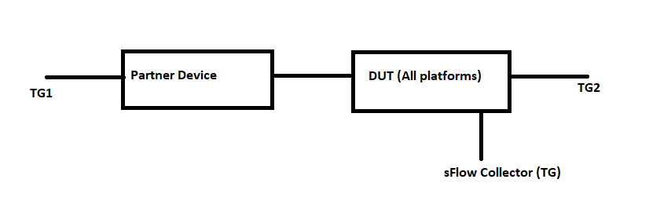

#  SQA Test Plan
#  sFlow
#  SONiC 3.0 Project and Buzznik Release
[TOC]
# Test Plan Revision History
|Rev  | Date        | Author                 | Change Description      |
|:---:|:-----------:|:----------------------:|:-----------------------:|
| 0.7  | 10/23/2019 | SreenivasulaReddy V    | Initial version         |

# List of Reviewers
| Function |         Name         |
| :------: | :------------------: |
|   Dev    |      Michael Li      |
|   Dev    |   Aravindu Maneti    |
|   TA     | Kalyan Vadlamani     |
|   QA     | Anil Kumar Kolkaleti |
|   QA     |   Giri Babu Sajja    |

# List of Approvers
| Function |         Name         | Date Approved |
| :------: | :------------------: | :-----------: |
|   Dev    |      Michael Li      |               |
|   Dev    |   Aravindu Maneti    |               |
|   QA     | Anil Kumar Kolkaleti |               |
|   QA     |   Giri Babu Sajja    |               |

# Definition/Abbreviation
| **Term** | **Meaning**  |
| -------- | ------------ |
| sFlow    | sampled flow |
| gNMI     | gRPC Network Management Interface|
| REST     | Representational State Transfer |

# Feature Overview
sFlow (defined in https://sflow.org/sflow_version_5.txt) is a standard-based sampling technology the meets the key requirements of network traffic monitoring on switches and routers. 
sFlow uses two types of sampling:
1.Statistical packet-based sampling of switched or routed packet flows to provide visibility into network usage and active routes
2.Time-based sampling of interface counters

# Test Approach
From section 2 topology diagram ,TG is used as sFlow collector.Capture sFlow packets from TG and validate appropriate match conditions.
1.Below items will be part of module config
 -Routing configuration on both DUTs and TG ports.
 -TG stream configuration
 -static route configurations on both DUT's.
 -sFlow collector,agent,sampling rate configuration.
 
2.Tests covered
FtOpSfFn001,FtOpSfFn003,FtOpSfFn004,FtOpSfFn005,FtOpSfFn006,FtOpSfFn007,FtOpSfFn008,FtOpSfFn009,FtOpSfFn010,FtOpSfFn012 FtOpSfFn014,FtOpSfFn015,FtOpSfFn016,FtOpSfFn017,FtOpSfFn018,FtOpSfFn019,FtOpSfFn020,FtOpSfFn021,FtOpSfFn022,FtOpSfFn023,FtOpSfFn024
below test cases are clubbed FtOpSfFn020,FtOpSfFn024,FtOpSfFn022,FtOpSfFn006,FtOpSfFn008,FtOpSfFn010,FtOpSfFn003

3.To reduce run time,sFlow warmboot,cold boot,fastboot,config reload tests are covered in separate files in system folder (test_system_fast_reboot.py,test_system_save_reboot.py,test_system_warm_reboot.py)

# 1 Test Focus Areas
## 1.1 Functional Testing 
  - sFlow sampling and polling functionality with IPv4 and IPv6 collectors.
  - sFlow sampling and polling functionality with Front end port and Management port.
  - sFlow over physical interfaces.
  - sFlow functionality with non default sample rates,counter polling intervals,sFlow collector UDP port etc

## 1.2 Negative Testing 
  - sFlow sampling and polling functionality with invalid/not reachable sFlow collectors.
  - sFlow sampling and polling functionality with invalid sFlow Agent.

## 1.3 Reboot/Config Testing  
  - Warm reboot
  - Config save and reload
  - Fast-boot
  - config reload
  - sFlow docker restart

## 1.4 Scale and Performance Testing
  - sFlow functionality with Max supported sFlow collectors.

  
# 2 Topologies
## 2.1 Topology 1

# 3 Test  Case and Objectives

## 3.1 Functional

### 3.1.1 Verify sFlow sampling functionality through management port connectivity to sFlow collector.
| **Test ID**    | **FtOpSfFn001**                                              |
| -------------- | :----------------------------------------------------------- |
| **Test Name**  | **Verify sFlow sampling functionality through management port on physical interfaces using IPv4 sFlow collector.** |
| **Test Setup** | **Topology**                                                 |
| **Type**       | **Functional**    
| **Steps**      | **Procedure: 1)Configure sFlow v4 Collector on DUT which has management port connectivity to Collector. 2)with default port sampling rate check sflow functionality. 3) pump continuous traffic for certain duration	to reach default sample rate and observe that sFlow packet is generated and forwarded to collector. 4)Configure sampling rate to non default value.  5) pump continuous traffic for certain duration to reach configured sample rate and observe that sFlow packet is generated and forwarded to collector  Expected Result: 1) verify that configuration is successful. 2) verify that configuration is successful. 3) verify that sFlow packet is forwarded to configured IPv4 collector. 4) verify that configuration is successful. 5) verify that sFlow packet is forwarded to configured IPv4 collector.** |

### 3.1.2 Verify sFlow sampling functionality through Front end port on physical interfaces using IPv4 connectivity to sFlow collector.

| **Test ID**    | **FtOpSfFn003**                                              |
| -------------- | :----------------------------------------------------------- |
| **Test Name**  | **Verify sFlow sampling functionality through Front end port on physical interfaces using IPv4 connectivity to sFlow collector.** |
| **Test Setup** | **Topology**                                                 |
| **Type**       | **Functional**                                               |
| **Steps**      | **Procedure: 1)Configure sFlow v4 Collector on DUT which has front end  port connectivity to Collector. 2)with default port sampling rate check sflow functionality. 3) pump continuous traffic for certain duration	to reach default sample rate and observe that sFlow packet is generated and forwarded to collector. 4)Configure sampling rate to non default value.  5) pump continuous traffic for certain duration to reach configured sample rate and observe that sFlow packet is generated and forwarded to collector.  Expected Result: 1) verify that configuration is successful. 2) verify that configuration is successful. 3) verify that sFlow packet is forwarded to configured IPv4 collector. 4) verify that configuration is successful. 5) verify that sFlow packet is forwarded to configured IPv4 collector.** |

### 3.1.3 Verify sFlow sampling functionality through Front end port on physical interfaces using IPv6 connectivity to sFlow collector.

| **Test ID**    | **FtOpSfFn004**                                              |
| -------------- | :----------------------------------------------------------- |
| **Test Name**  | **Verify sFlow sampling functionality through Front end port on physical interfaces using IPv6 connectivity to sFlow collector.** |
| **Test Setup** | **Topology**                                                 |
| **Type**       | **Functional**                                               |
| **Steps**      | **Procedure: 1)Configure sFlow v6 Collector on DUT which has front end  port connectivity to Collector. 2)with default port sampling rate check sflow functionality  3) pump the traffic to reach configured sample rate and observe that sFlow packet is generated and forwarded to collector by agent. Expected Result: 1) verify that configuration is successful. 2) verify that configuration is successful. 3) verify that sFlow packet is forwarded to configured IPv4 collector.** |

### 3.1.4 Verify that collector and per-interface changes get reflected using the "show sflow" and "show sflow interface" commands

| **Test ID**    | **FtOpSfFn006**                                              |
| -------------- | :----------------------------------------------------------- |
| **Test Name**  | **Verify that collector and per-interface changes get reflected using the "show sflow" and "show sflow interface" commands** |
| **Test Setup** | **Topology**                                                 |
| **Type**       | **Functional**                                               |
| **Steps**      | **Procedure 1)Configure sFlow config on DUT globally. 2)Configure sFlow config at interface level. 2)Verify the config using"show sflow" and "show sflow interface** |
 
### 3.1.5 Verify sFlow sampling functionality with non default sFlow UDP port.

| **Test ID**    | **FtOpSfFn007**                                              |
| -------------- | :----------------------------------------------------------- |
| **Test Name**  | **Verify sFlow sampling functionality with non default sFlow collector port.** |
| **Test Setup** | **Topology**                                                 |
| **Type**       | **Functional**                                               |
| **Steps**      | **Procedure: 1)Configure sFlow v4 Collector on DUT with non defaultsFlow collector udp port  2)with default port sampling rate check sflow functionality  3)pump the traffic to reach configured sample rate and observe that sFlow packet is generated and forwarded to collector by agent. Expected Results: 1)verify that configuration is successful 2)verify that configuration is successful. 3)verify that sFlow packet is forwarded to configured reachable IPv4 collector.** |

### 3.1.6 Verify sFlow sampling functionality when sFlow enable/disable configuration at interface level.

| **Test ID**    | **FtOpSfFn008**                                              |
| -------------- | :----------------------------------------------------------- |
| **Test Name**  | **Verify sFlow sampling functionality when sFlow enable/disable configuration at interface level.** |
| **Test Setup** | **Topology**                                                 |
| **Type**       | **Functional**                                               |
| **Steps**      | **Procedure: 1) Configure sFlow v4 Collector on DUT and enable sFlow at interface level 2)with default port sampling rate check sflow functionality. 3)pump the traffic to reach configured sample rate and observe that sFlow packet is generated and forwarded to collector by agent. 4)Verify that packet & counter samples stop for a disabled interface Expected Results: 1)verify that configuration is successful 2)verify that configuration is successful. 3)verify that sFlow packet is forwarded to configured reachable IPv4 collector.** |

### 3.1.7 Verify that counter samples are updated for non default polling interval.

| **Test ID**    | **FtOpSfFn012**                                              |
| -------------- | :----------------------------------------------------------- |
| **Test Name**  | **Verify that counter samples are updated for non default polling interval** |
| **Test Setup** | **Topology**                                                 |
| **Type**       | **Functional**                                               |
| **Steps**      | **Procedure: 1)Configure sFlow v4 Collector on DUT at interface level. 2)Configure polling interval to non default value 20. 3)After polled interval sFlow packet with interface counters statistics should be forwarded to agent. Expected Results: 1)verify that configuration is successful 2)verify that configuration is successful. 3)verify that sFlow packet is forwarded to configured reachable IPv4 collector.** |

### 3.1.8 Verify sFlow functionality when sflow collector interface is participated in PortChannel 

| **Test ID**    | **FtOpSfFn016**                                              |
| -------------- | :----------------------------------------------------------- |
| **Test Name**  | **Verify sFlow functionality when sflow collector interface is participated in PortChannel ** |
| **Test Setup** | **Topology**                                                 |
| **Type**       | **Functional**                                                   |
| **Steps**      | **Procedure: 1)Configure sFlow v4 Collector on DUT which has connectivity to Collector which is participated in port channel. 2)with default port sampling rate check sflow functionality. 3)pump the traffic to reach configured sample rate and observe that sFlow packet is generated and forwarded to collector by agent. Expected Results: 1)verify that configuration is successful 2)verify that configuration is successful. 3)verify that sFlow packet is forwarded to configured IPv4 collector.** |

### 3.1.9 Verify that the sFlow hsflowd logs are emitted to the syslog file for various severities.

| **Test ID**    | **FtOpSfFn020**                                              |
| -------------- | :----------------------------------------------------------- |
| **Test Name**  | **Verify that the sFlow hsflowd logs are emitted to the syslog file for various severities.** |
| **Test Setup** | **Topology**                                                 |
| **Type**       | **Functional**                                               |
| **Steps**      | **Procedure: 1)Configure sFlow v4 Collector on DUT which has management port connectivity to Collector. 2)with default port sampling rate check sflow functionality. 3)pump the traffic to reach configured sample rate and observe that sFlow packet is generated and forwarded to collector by agent. 4)Verify that the sFlow hsflowd logs are emitted to the syslog file for various severities Expected Results: 1)verify that configuration is successful 2)verify that configuration is successful. 3)verify that sFlow packet is forwarded to configured IPv4 collector. 4)Verify  the sFlowlogs in syslog** |

### 3.1.10 Verify sFlow functionality using non default or user vrf instance

| **Test ID**    | **FtOpSfFn021**                                              |
| -------------- | :----------------------------------------------------------- |
| **Test Name**  | **Verify sFlow functionality using non default or user vrf instance.** |
| **Test Setup** | **Topology**                                                 |
| **Type**       | **Functional**                                                   |
| **Steps**      | **Procedure: 1)Configure sFlow v4 Collector on DUT which has connectivity to Collector through non default vrf instance. 2)with default port sampling rate check sflow functionality. 3)pump the traffic to reach configured sample rate and observe that sFlow packet is generated and forwarded to collector by agent. 4)Repeat the same procedure for management vrf if supported Expected Results: 1)verify that configuration is successful 2)verify that configuration is successful. 3)verify that sFlow packet is forwarded to configured IPv4 collector. 4)verify that sFlow packet is forwarded to configured IPv4 collector.** |

### 3.1.11 Verify sFlow functionality during TCP and UDP data traffic flow

| **Test ID**    | **FtOpSfFn022**                                              |
| -------------- | :----------------------------------------------------------- |
| **Test Name**  | **Verify sFlow functionality during TCP and UDP data traffic flow** |
| **Test Setup** | **Topology**                                                 |
| **Type**       | **Functional**                                                   |
| **Steps**      | **Procedure: 1)Configure sFlow v4 Collector on DUT which has connectivity to Collector through non default vrf instance. 2)Configure sampling rate to max value 8388608 connected . 3)pump TCP data traffic to reach configured sample rate and observe that sFlow packet is generated and forwarded to collector by agent. 4)Repeat above steps for UDP data traffic to reach configured sample rate and observe that sFlow packet is generated and forwarded to collector by agent Expected Results: 1)verify that configuration is successful 2)verify that configuration is successful. 3)verify that sFlow packet is forwarded to configured IPv4 collector.** |

### 3.1.12 Verify sFlow functionality for control Plane traffic.

| **Test ID**    | **FtOpSfFn023**                                              |
| -------------- | :----------------------------------------------------------- |
| **Test Name**  | **Verify sFlow functionality for control Plane traffic.** |
| **Test Setup** | **Topology**                                                 |
| **Type**       | **Functional**                                                   |
| **Steps**      | **Procedure: 1)Configure sFlow v4 Collector on DUT which has connectivity to Collector through non default vrf instance. 2)with default port sampling rate check sflow functionality. 3)pump TCP data traffic to reach configured sample rate and observe that sFlow packet is generated and forwarded to collector by agent. Expected Results: 1)verify that configuration is successful 2)verify that configuration is successful. 3)verify that sFlow packet is forwarded to configured IPv4 collector.** |

### 3.1.13 Verify sFlow functionality on port break out interface.

| **Test ID**    | **FtOpSfFn024**                                              |
| -------------- | :----------------------------------------------------------- |
| **Test Name**  | **Verify sFlow functionality on port break out interface..** |
| **Test Setup** | **Topology**                                                 |
| **Type**       | **Functional**                                                   |
| **Steps**      | **Procedure: 1)Configure sFlow v4 Collector on DUT which has connectivity to Collector . 2)with default port sampling rate check sflow functionality 3)pump data traffic to reach configured sample rate and observe that sFlow packet is generated and forwarded to collector by agent. Expected Results: 1)verify that configuration is successful 2)verify that configuration is successful. 3)verify that sFlow packet is forwarded to configured IPv4 collector.** |

### 3.1.14 Verify COPP sFlow rate limiting functionality.

| **Test ID**    | **FtOpSfFn025**                                              |
| -------------- | :----------------------------------------------------------- |
| **Test Name**  | **Verify COPP sFlow rate limiting.** |
| **Test Setup** | **Topology**                                                 |
| **Type**       | **Functional**  
| **Steps**      | **Procedure: 1)Configure sFlow packet on TG with sent rate more than the CoPP sFlow config rate. 2)pump sflow traffic and observe that sFlow packets are rate limited as per CoPP rate limit. Expected Results: 1)verify that configuration is successful 2)verify that sFlow packet are rate limited as per CoPP rate limit.** |

## 3.2 Negative
### 3.2.1 Verify v4/v6 sFlow collectors and sFlow agent IP with valid and invalid IPv4/v6 addresses

| **Test ID**    | **FtOpSfFn009**                                              |
| -------------- | :----------------------------------------------------------- |
| **Test Name**  | **Verify v4/v6 sFlow collector with valid and invalid IPv4/v6 addresses** |
| **Test Setup** | **Topology**                                                 |
| **Type**       | **Negative**                                                 |
| **Steps**      | **Procedure:1)Configure invalid and valid v4/v6 sFlow collector IP addresses. addresses. 2)Configure valid and invalidsFlow v4/v6 agent IP address on DUT.  Expected Result: 1)verify that configuration is successful for valid collector IP addresses and not success for invalid addresses. 2)verify that configuration is successful for valid IPv4/v6 addresses and not success for invalid addresses** |** |

### 3.2.2 Verify that samples are received when either 1 or 2 reachable/unreachable sFlow collectors configured.

| **Test ID**    | **FtOpSfFn010**                                              |
| -------------- | :----------------------------------------------------------- |
| **Test Name**  | **Verify that samples are received when either 1 or 2 reachable/unreachable sFlow collectors configured.** |
| **Test Setup** | **Topology**                                                 |
| **Type**       | **Negative**                                                 |
| **Steps**      | **Procedure: 1)Configure 2 sFlow v4 Collectors on DUT with 1 reachable and other unreachable 2)Configure sampling rate to non default value. 3)pump continuous traffic for certain duration to reach configured sample rate and observe that sFlow packet is generated and forwarded to collector. Expected Results: 1)verify that configuration is successful 2)verify that configuration is successful. 3)verify that sFlow packet is forwarded to configured reachable IPv4 collector.** |

## 3.3 Reboot/Reload/Upgrade Test Cases

### 3.3.1 Verify sFlow functionality with valid startup configuration and after normal/cold reboot

| **Test ID**    | **FtOpSfFn017**                                              |
| -------------- | :----------------------------------------------------------- |
| **Test Name**  | **Verify sFlow functionality with valid startup configuration and after normal/cold reboot** |
| **Test Setup** | **Topology**                                                 |
| **Type**       | **Reboot**                                                   |
| **Steps**      | **Procedure: 1)Configure sFlow v4 Collector on DUT which has management port connectivity to Collector. 2)with default port sampling rate check sflow functionality. 3)pump the traffic to reach configured sample rate and observe that sFlow packet is generated and forwarded to collector by agent. 4)Verify sFlow functionality with valid startup configuration and after normal/cold reboot. Expected Results: 1)verify that configuration is successful 2)verify that configuration is successful. 3)verify that sFlow packet is forwarded to configured IPv4 collector.** |

### 3.3.2 Verify sFlow functionality with valid startup configuration and after fast reboot

| **Test ID**    | **FtOpSfFn018**                                              |
| -------------- | :----------------------------------------------------------- |
| **Test Name**  | **Verify sFlow functionality with valid startup configuration and after fast reboot** |
| **Test Setup** | **Topology**                                                 |
| **Type**       | **Reboot**                                                   |
| **Steps**      | **Procedure: 1)Configure sFlow v4 Collector on DUT which has management port connectivity to Collector. 2)with default port sampling rate check sflow functionality. 3)pump the traffic to reach configured sample rate and observe that sFlow packet is generated and forwarded to collector by agent. 4)Verify sFlow functionality with valid startup configuration and fast reboot. Expected Results: 1)verify that configuration is successful 2)verify that configuration is successful. 3)verify that sFlow packet is forwarded to configured IPv4 collector.** |

### 3.3.3 Verify sFlow functionality with valid startup configuration and after warm reboot

| **Test ID**    | **FtOpSfFn019**                                              |
| -------------- | :----------------------------------------------------------- |
| **Test Name**  | **Verify sFlow functionality with valid startup configuration and after warm reboot** |
| **Test Setup** | **Topology**                                                 |
| **Type**       | **Reboot**                                                   |
| **Steps**      | **Procedure: 1)Configure sFlow v4 Collector on DUT which has management port connectivity to Collector. 2)with default port sampling rate check sflow functionality. 3)pump the traffic to reach configured sample rate and observe that sFlow packet is generated and forwarded to collector by agent. 4)Verify sFlow functionality with valid startup configuration and warm reboot. Expected Results: 1)verify that configuration is successful 2)verify that configuration is successful. 3)verify that sFlow packet is forwarded to configured IPv4 collector.** |

### 3.3.4 Verify that sFlow functionality after sflow docker restart.

| **Test ID**    | **FtOpSfFn015**                                              |
| -------------- | :----------------------------------------------------------- |
| **Test Name**  | **Verify that sFlow docker can be stopped and restarted and check that packet and counter sampling restarts.** |
| **Test Setup** | **Topology**                                                 |
| **Type**       | **Reboot**                                               |
| **Steps**      | **Verify that sFlow docker can be stopped and restarted and check that packet and counter sampling restarts** |

## 3.4 Stress,Scale and Performance

### 3.4.1  Verify max sFlow collectors configuration with different combinations.

| **Test ID**    | **FtOpSfFn005**                                              |
| -------------- | :----------------------------------------------------------- |
| **Test Name**  | Verify max sFlow collectors configuration with different combinations (2 IPv4,2 IPv6,combination of both). |
| **Test Setup** | **Topology**                                                 |
| **Type**       | **Scalability**                                              |
| **Steps**      | **Procedure: 1)Configure 2 sFlow v4 Collectors on DUT with diffenet names.2)Unconfigure 2 sFlow v4 Collectors on DUT  3) Configure 2 sFlow v6 Collectors on DUT with diffenet names. 4)Unconfigure 2 sFlow v6 Collectors on DUT. 5)Configure1 sFlow v4 and 1 v6 Collectors on DUT. 6)Unconfigure 2 sFlowCollectors on DUT. Expected Result: 1 verify that configuration is successful. 2 verify that configuration is successful. 3 verify that configuration is successful 4)verify that configuration is successful 5)verify that configuration is successful 6)verify that configuration is successful** |

## 3.5 UI
N/A UI's will be covered as part of spytest infra.

## 4 Reference Links
<https://github.com/Azure/SONiC/blob/35ce6ff2c7cbaea188ae2585268d8261cd05bf0f/doc/sflow/sflow_hld.md>