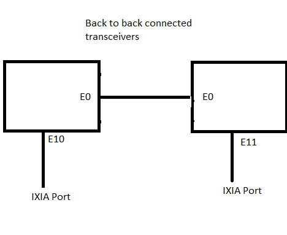

#  SQA Test Plan
# Transceiver parameter tuning
#  SONiC 3.0 Project and Buzznik Release
[TOC]
# Test Plan Revision History

| Rev. | Date     | Author                | Change Description |
| ---- | -------- | --------------------- | ------------------ |
| 0.1  | 25/09/19 | Mahanti Nageswara Rao | Initial Document   |
|      |          |                       |                    |

# List of Reviewers
|  Function | Name |
|:---:|:-----------:|
| QA | Anil Kolkaleti |
| QA | Giri Babu Sajja |
| Dev | Steven Lu |
| Dev | Amin Alavi |

# List of Approvers

| Function |      Name       |
| :------: | :-------------: |
|    QA    | Anil Kolkaleti  |
|    QA    | Giri Babu Sajja |
|   Dev    |    Steven Lu    |
|   Dev    |   Amin Alavi    |

# 

# Definition/Abbreviation

| **Term** | **Meaning**                     |
| -------- | ------------------------------- |
| SFP Transceiver | Small form factor pluggable Transceiver |
| QSFP+ Transceiver | Quad small form factor pluggable Transceiver                |
| DAC cable | Direct Attach Copper cable |
| BiDi QSFP+ | Bi-Directional QSFP+                                         |
| QSFP DD Transceiver | Quad small form factor pluggable Double Density Transceiver |
|  |                                                              |

# Feature Overview
Transceiver parameter tuning is to test and qualify different transceivers and DAC cables from different vendors as part of Buzznik Release. Platform support on which transceivers are tested are as7712, as7816, as7326, as9716, as7726 and Quanta IX9. Transceivers with and without port breakout is tested as part of testing.  400G, 100G, 40G, 25G and 10G transceivers supported and will be tested.

# 1 Test Focus Areas
## 1.1 Functional Testing
  -	Testing the connectivity of different transceivers and DAC cables
  -	testing transceivers with port breakout 

# 2 Topologies

### 2.1 Topology 1
####  

#### 

# 3 Test  Case and Objectives

## 3.1 Functionality

#### 3.1.1 Verify the connectivity of SFP+ Passive DAC (10G) on supported platform.

| **Test ID**    | **FtSyTpFn001**                                              |
| -------------- | :----------------------------------------------------------- |
| **Test Name**  | **Verify the connectivity of SFP+ Passive DAC (10G) on supported platform.** |
| **Test Setup** | **Topology1**                                                |
| **Type**       | **Functionality**                                            |
| **Steps**      | **Test Steps: 1. Connect SFP+ Passive DAC (10G) back-to-back to two ports. 2. Issue interface shutdown command on one of the connected ports. 3. Issue interface startup command on the port, which was down earlier. 4. Disconnect the cable on one of the ports and connect back . 5. Issue command "show interfaces transceiver presence" . 6. Issue command "show interfaces transceiver eeprom". 7. Issue command "show interfaces transceiver lpmode". 8. Repeat steps 4,5&6 multiple times  Expected results:  1. Verify that port link is up. 2. Verify that link is down with interface shutdown command. 3. Verify that link comes up with interface startup command. 4. Verify that link goes down on the back-to-back connected ports. 5. Verify that command displays the presence of connected ports. 6. Verify that command displays the transceiver details of the connected ports. 7. Verify that command displays the transceiver lp mode, if available. 8. Verify that link comes up fine after multiple disconnections and show command displays the correct information about transceiver.** |

#### 3.1.2 Verify the connectivity of SFP28 Passive DAC (25G)  on supported platform.

| **Test ID**    | **FtSyTpFn002**                                              |
| -------------- | :----------------------------------------------------------- |
| **Test Name**  | **Verify the connectivity of SFP28 Passive DAC (25G)  on supported platform.** |
| **Test Setup** | **Topology1**                                                |
| **Type**       | **Functionality**                                            |
| **Steps**      | **Test Steps: 1. Connect SFP28 Passive DAC (25G)  back-to-back to two ports. 2. Issue interface shutdown command on one of the connected ports. 3. Issue interface startup command on the port, which was down earlier. 4. Disconnect the cable on one of the ports and connect back . 5. Issue command "show interfaces transceiver presence" . 6. Issue command "show interfaces transceiver eeprom". 7. Issue command "show interfaces transceiver lpmode". 8. Repeat steps 4,5&6 multiple times  Expected results:  1. Verify that port link is up. 2. Verify that link is down with interface shutdown command. 3. Verify that link comes up with interface startup command. 4. Verify that link goes down on the back-to-back connected ports. 5. Verify that command displays the presence of connected ports. 6. Verify that command displays the transceiver details of the connected ports. 7. Verify that command displays the transceiver lp mode, if available. 8. Verify that link comes up fine after multiple disconnections and show command displays the correct information about transceiver.** |

#### 3.1.3 Verify the connectivity of QSFP+ Fan out Passive DAC (40G->4*10G)    on supported platform.

| **Test ID**    | **FtSyTpFn003**                                              |
| -------------- | :----------------------------------------------------------- |
| **Test Name**  | **Verify the connectivity of QSFP+ Fan out Passive DAC (40G->4*10G)    on supported platform.** |
| **Test Setup** | **Topology1**                                                |
| **Type**       | **Functionality**                                            |
| **Steps**      | **Test Steps: 1. Connect QSFP+ Fan out Passive DAC (40G->4*10G)  back-to-back to two ports. 2. Issue interface shutdown command on one of the connected ports. 3. Issue interface startup command on the port, which was down earlier. 4. Disconnect the cable on one of the ports and connect back . 5. Issue command "show interfaces transceiver presence" . 6. Issue command "show interfaces transceiver eeprom". 7. Issue command "show interfaces transceiver lpmode". 8. Repeat steps 4,5&6 multiple times  Expected results:  1. Verify that port link is up. 2. Verify that link is down with interface shutdown command. 3. Verify that link comes up with interface startup command. 4. Verify that link goes down on the back-to-back connected ports. 5. Verify that command displays the presence of connected ports. 6. Verify that command displays the transceiver details of the connected ports. 7. Verify that command displays the transceiver lp mode, if available. 8. Verify that link comes up fine after multiple disconnections and show command displays the correct information about transceiver.** |

#### 3.1.4 Verify the connectivity of SFP 10G SR transceiver  on supported platform.

| **Test ID**    | **FtSyTpFn004**                                              |
| -------------- | :----------------------------------------------------------- |
| **Test Name**  | **Verify the connectivity of SFP 10G SR transceiver  on supported platform.** |
| **Test Setup** | **Topology1**                                                |
| **Type**       | **Functionality**                                            |
| **Steps**      | **Test Steps: 1. Connect SFP 10G SR Transceivers to two ports and connect a cable back-to-back for these two connections. 2. Issue interface shutdown command on one of the connected ports. 3. Issue interface startup command on the port, which was down earlier. 4. Disconnect the cable on one of the ports and connect back . 5. Issue command "show interfaces transceiver presence" . 6. Issue command "show interfaces transceiver eeprom". 7. Issue command "show interfaces transceiver lpmode". 8. Repeat steps 4,5&6 multiple times.  Expected results:  1. Verify that port link is up. 2. Verify that link is down with interface shutdown command. 3. Verify that link comes up with interface startup command. 4. Verify that link goes down on the back-to-back connected ports. 5. Verify that command displays the presence of connected ports. 6. Verify that command displays the transceiver details of the connected ports. 7. Verify that command displays the transceiver lp mode, if available. 8. Verify that link comes up fine after multiple disconnections and show command displays the correct information about transceiver.** |

#### 3.1.5 Verify the connectivity of QSFP(40G) 150M transceiver  on supported platform.

| **Test ID**    | **FtSyTpFn005**                                              |
| -------------- | :----------------------------------------------------------- |
| **Test Name**  | **Verify the connectivity of QSFP(40G) 150M transceiver  on supported platform.** |
| **Test Setup** | **Topology1**                                                |
| **Type**       | **Functionality**                                            |
| **Steps**      | **Test Steps: 1. Connect QSFP(40G) 150M Transceivers to two ports and connect a cable back-to-back for these two connections. 2. Issue interface shutdown command on one of the connected ports. 3. Issue interface startup command on the port, which was down earlier. 4. Disconnect the cable on one of the ports and connect back . 5. Issue command "show interfaces transceiver presence" . 6. Issue command "show interfaces transceiver eeprom". 7. Issue command "show interfaces transceiver lpmode". 8. Repeat steps 4,5&6 multiple times.  Expected results:  1. Verify that port link is up. 2. Verify that link is down with interface shutdown command. 3. Verify that link comes up with interface startup command. 4. Verify that link goes down on the back-to-back connected ports. 5. Verify that command displays the presence of connected ports. 6. Verify that command displays the transceiver details of the connected ports. 7. Verify that command displays the transceiver lp mode, if available. 8. Verify that link comes up fine after multiple disconnections and show command displays the correct information about transceiver.** |

#### 3.1.6 Verify the connectivity of QSFP28 SR4 150M transceiver  on supported platform.

| **Test ID**    | **FtSyTpFn006**                                              |
| -------------- | :----------------------------------------------------------- |
| **Test Name**  | **Verify the connectivity of QSFP28 SR4 150M transceiver  on supported platform.** |
| **Test Setup** | **Topology1**                                                |
| **Type**       | **Functionality**                                            |
| **Steps**      | **Test Steps: 1. Connect  transceivers to two ports and connect a cable back-to-back for these two connections. 2. Issue interface shutdown command on one of the connected ports. 3. Issue interface startup command on the port, which was down earlier. 4. Disconnect the cable on one of the ports and connect back . 5. Issue command "show interfaces transceiver presence" . 6. Issue command "show interfaces transceiver eeprom". 7. Issue command "show interfaces transceiver lpmode". 8. Repeat steps 4,5&6 multiple times.  Expected results:  1. Verify that port link is up. 2. Verify that link is down with interface shutdown command. 3. Verify that link comes up with interface startup command. 4. Verify that link goes down on the back-to-back connected ports. 5. Verify that command displays the presence of connected ports. 6. Verify that command displays the transceiver details of the connected ports. 7. Verify that command displays the transceiver lp mode, if available. 8. Verify that link comes up fine after multiple disconnections and show command displays the correct information about transceiver.** |

#### 3.1.7 Verify the connectivity ofQSFP28 AOC 10M transceiver  on supported platform.

| **Test ID**    | **FtSyTpFn007**                                              |
| -------------- | :----------------------------------------------------------- |
| **Test Name**  | **Verify the connectivity ofQSFP28 AOC 10M transceiver  on supported platform.** |
| **Test Setup** | **Topology1**                                                |
| **Type**       | **Functionality**                                            |
| **Steps**      | **Test Steps: 1. Connect QSFP28 AOC 10M Transceivers to two ports and connect a cable back-to-back for these two connections. 2. Issue interface shutdown command on one of the connected ports. 3. Issue interface startup command on the port, which was down earlier. 4. Disconnect the cable on one of the ports and connect back . 5. Issue command "show interfaces transceiver presence" . 6. Issue command "show interfaces transceiver eeprom". 7. Issue command "show interfaces transceiver lpmode". 8. Repeat steps 4,5&6 multiple times  Expected results:  1. Verify that port link is up. 2. Verify that link is down with interface shutdown command. 3. Verify that link comes up with interface startup command. 4. Verify that link goes down on the back-to-back connected ports. 5. Verify that command displays the presence of connected ports. 6. Verify that command displays the transceiver details of the connected ports. 7. Verify that command displays the transceiver lp mode, if available. 8. Verify that link comes up fine after multiple disconnections and show command     displays the correct information about transceiver.** |

#### 3.1.8 Verify the connectivity of QSFP 40G LR transceiver  on supported platform.

| **Test ID**    | **FtSyTpFn008**                                              |
| -------------- | :----------------------------------------------------------- |
| **Test Name**  | **Verify the connectivity of QSFP 40G LR transceiver  on supported platform.** |
| **Test Setup** | **Topology1**                                                |
| **Type**       | **Functionality**                                            |
| **Steps**      | **Test setup: Connect the transceivers to two ports and back-to-back connection. Test Steps: 1. Connect QSFP 40G LR Transceivers to two ports and connect a cable back-to-back for these two connections. 2. Issue interface shutdown command on one of the connected ports. 3. Issue interface startup command on the port, which was down earlier. 4. Disconnect the cable on one of the ports and connect back . 5. Issue command "show interfaces transceiver presence" . 6. Issue command "show interfaces transceiver eeprom". 7. Issue command "show interfaces transceiver lpmode". 8. Repeat steps 4,5&6 multiple times.  Expected results:  1. Verify that port link is up. 2. Verify that link is down with interface shutdown command. 3. Verify that link comes up with interface startup command. 4. Verify that link goes down on the back-to-back connected ports. 5. Verify that command displays the presence of connected ports. 6. Verify that command displays the transceiver details of the connected ports. 7. Verify that command displays the transceiver lp mode, if available. 8. Verify that link comes up fine after multiple disconnections and show command displays the correct information about transceiver.** |

#### 3.1.9 Verify the connectivity of QSFP28-100G-DAC transceiver  on supported platform.

| **Test ID**    | **FtSyTpFn009**                                              |
| -------------- | :----------------------------------------------------------- |
| **Test Name**  | **Verify the connectivity of QSFP28-100G-DAC transceiver  on supported platform.** |
| **Test Setup** | **Topology1**                                                |
| **Type**       | **Functionality**                                            |
| **Steps**      | **Test Steps: 1. ConnectQSFP28-100G-DAC Transceivers to two ports and connect a cable back-to-back for these two connections. 2. Issue interface shutdown command on one of the connected ports. 3. Issue interface startup command on the port, which was down earlier. 4. Disconnect the cable on one of the ports and connect back . 5. Issue command "show interfaces transceiver presence" . 6. Issue command "show interfaces transceiver eeprom". 7. Issue command "show interfaces transceiver lpmode". 8. Repeat steps 4,5&6 multiple times.  Expected results:  1. Verify that port link is up. 2. Verify that link is down with interface shutdown command. 3. Verify that link comes up with interface startup command. 4. Verify that link goes down on the back-to-back connected ports. 5. Verify that command displays the presence of connected ports. 6. Verify that command displays the transceiver details of the connected ports. 7. Verify that command displays the transceiver lp mode, if available. 8. Verify that link comes up fine after multiple disconnections and show command displays the correct information about transceiver.** |

#### 3.1.10 Verify the connectivity of QSFP28 - 4xSFP28 DAC 3M transceiver  on supported platform.

| **Test ID**    | **FtSyTpFn010**                                              |
| -------------- | :----------------------------------------------------------- |
| **Test Name**  | **Verify the connectivity ofQSFP28 AOC 10M transceiver  on supported platform.** |
| **Test Setup** | **Topology1**                                                |
| **Type**       | **Functionality**                                            |
| **Steps**      | **Test Steps: 1. Connect QSFP28 - 4xSFP28 DAC 3M Transceivers to two ports and connect a cable back-to-back for these two connections. 2. Issue interface shutdown command on one of the connected ports. 3. Issue interface startup command on the port, which was down earlier. 4. Disconnect the cable on one of the ports and connect back . 5. Issue command "show interfaces transceiver presence" . 6. Issue command "show interfaces transceiver eeprom". 7. Issue command "show interfaces transceiver lpmode". 8. Repeat steps 4,5&6 multiple times  Expected results:  1. Verify that port link is up. 2. Verify that link is down with interface shutdown command. 3. Verify that link comes up with interface startup command. 4. Verify that link goes down on the back-to-back connected ports. 5. Verify that command displays the presence of connected ports. 6. Verify that command displays the transceiver details of the connected ports. 7. Verify that command displays the transceiver lp mode, if available. 8. Verify that link comes up fine after multiple disconnections and show command displays the correct information about transceiver.** |

#### 3.1.11 Verify the connectivity of QSFP28-SR4-100G transceiver  on supported platform.

| **Test ID**    | **FtSyTpFn011**                                              |
| -------------- | :----------------------------------------------------------- |
| **Test Name**  | **Verify the connectivity of QSFP28-SR4-100G transceiver  on supported platform.** |
| **Test Setup** | **Topology1**                                                |
| **Type**       | **Functionality**                                            |
| **Steps**      | **Test Steps: 1. Connect QSFP28-SR4-100G Transceivers to two ports and connect a cable back-to-back for these two connections. 2. Issue interface shutdown command on one of the connected ports. 3. Issue interface startup command on the port, which was down earlier. 4. Disconnect the cable on one of the ports and connect back . 5. Issue command "show interfaces transceiver presence" . 6. Issue command "show interfaces transceiver eeprom". 7. Issue command "show interfaces transceiver lpmode". 8. Repeat steps 4,5&6 multiple times.  Expected results:  1. Verify that port link is up. 2. Verify that link is down with interface shutdown command. 3. Verify that link comes up with interface startup command. 4. Verify that link goes down on the back-to-back connected ports. 5. Verify that command displays the presence of connected ports. 6. Verify that command displays the transceiver details of the connected ports. 7. Verify that command displays the transceiver lp mode, if available. 8. Verify that link comes up fine after multiple disconnections and show command displays the correct information about transceiver.** |

#### 3.1.12 Verify the connectivity of QSFP- 4xSFP DAC transceiver  on supported platform.

| **Test ID**    | **FtSyTpFn012**                                              |
| -------------- | :----------------------------------------------------------- |
| **Test Name**  | **Verify the connectivity of QSFP- 4xSFP DAC transceiver  on supported platform.** |
| **Test Setup** | **Topology1**                                                |
| **Type**       | **Functionality**                                            |
| **Steps**      | **Test Steps: 1. Connect QSFP- 4xSFP DAC Transceivers to two ports and connect a cable back-to-back for these two connections. 2. Issue interface shutdown command on one of the connected ports. 3. Issue interface startup command on the port, which was down earlier. 4. Disconnect the cable on one of the ports and connect back . 5. Issue command "show interfaces transceiver presence" . 6. Issue command "show interfaces transceiver eeprom". 7. Issue command "show interfaces transceiver lpmode". 8. Repeat steps 4,5&6 multiple times.  Expected results:  1. Verify that port link is up. 2. Verify that link is down with interface shutdown command. 3. Verify that link comes up with interface startup command. 4. Verify that link goes down on the back-to-back connected ports. 5. Verify that command displays the presence of connected ports. 6. Verify that command displays the transceiver details of the connected ports. 7. Verify that command displays the transceiver lp mode, if available. 8. Verify that link comes up fine after multiple disconnections and show command displays the correct information about transceiver.** |

#### 3.1.13 Verify the connectivity of QSFP-SR4-40G transceiver  on supported platform.

| **Test ID**    | **FtSyTpFn013**                                              |
| -------------- | :----------------------------------------------------------- |
| **Test Name**  | **Verify the connectivity of QSFP-SR4-40G transceiver  on supported platform.** |
| **Test Setup** | **Topology1**                                                |
| **Type**       | **Functionality**                                            |
| **Steps**      | **Test Steps: 1. Connect QSFP-SR4-40G Transceivers to two ports and connect a cable back-to-back for these two connections. 2. Issue interface shutdown command on one of the connected ports. 3. Issue interface startup command on the port, which was down earlier. 4. Disconnect the cable on one of the ports and connect back . 5. Issue command "show interfaces transceiver presence" . 6. Issue command "show interfaces transceiver eeprom". 7. Issue command "show interfaces transceiver lpmode". 8. Repeat steps 4,5&6 multiple times.  Expected results:  1. Verify that port link is up. 2. Verify that link is down with interface shutdown command. 3. Verify that link comes up with interface startup command. 4. Verify that link goes down on the back-to-back connected ports. 5. Verify that command displays the presence of connected ports. 6. Verify that command displays the transceiver details of the connected ports. 7. Verify that command displays the transceiver lp mode, if available. 8. Verify that link comes up fine after multiple disconnections and show command displays the correct information about transceiver.** |

#### 3.1.14 Verify the connectivity of QSFP28 - 4xSFP28 DAC 3M transceiver  on supported platform.

| **Test ID**    | **FtSyTpFn014**                                              |
| -------------- | :----------------------------------------------------------- |
| **Test Name**  | **Verify the connectivity of QSFP28 - 4xSFP28 DAC 3M transceiver  on supported platform.** |
| **Test Setup** | **Topology1**                                                |
| **Type**       | **Functionality**                                            |
| **Steps**      | **Test Steps: 1. Connect QSFP28 - 4xSFP28 DAC 3M Transceivers to two ports and connect a cable back-to-back for these two connections. 2. Issue interface shutdown command on one of the connected ports. 3. Issue interface startup command on the port, which was down earlier. 4. Disconnect the cable on one of the ports and connect back . 5. Issue command "show interfaces transceiver presence" . 6. Issue command "show interfaces transceiver eeprom". 7. Issue command "show interfaces transceiver lpmode". 8. Repeat steps 4,5&6 multiple times  Expected results:  1. Verify that port link is up. 2. Verify that link is down with interface shutdown command. 3. Verify that link comes up with interface startup command. 4. Verify that link goes down on the back-to-back connected ports. 5. Verify that command displays the presence of connected ports. 6. Verify that command displays the transceiver details of the connected ports. 7. Verify that command displays the transceiver lp mode, if available. 8. Verify that link comes up fine after multiple disconnections and show command displays the correct information about transceiver.** |

#### 3.1.15 Verify the connectivity of 40GE BiDi QSFP+   transceiver  on supported platform.

| **Test ID**    | **FtSyTpFn015**                                              |
| -------------- | :----------------------------------------------------------- |
| **Test Name**  | **Verify the connectivity of 40GE BiDi QSFP+   transceiver  on supported platform.** |
| **Test Setup** | **Topology1**                                                |
| **Type**       | **Functionality**                                            |
| **Steps**      | **Test Steps: 1. Connect40GE BiDi QSFP+ Transceivers to two ports and connect a cable back-to-back for these two connections. 2. Issue interface shutdown command on one of the connected ports. 3. Issue interface startup command on the port, which was down earlier. 4. Disconnect the cable on one of the ports and connect back . 5. Issue command "show interfaces transceiver presence" . 6. Issue command "show interfaces transceiver eeprom". 7. Issue command "show interfaces transceiver lpmode". 8. Repeat steps 4,5&6 multiple times.  Expected results:  1. Verify that port link is up. 2. Verify that link is down with interface shutdown command. 3. Verify that link comes up with interface startup command. 4. Verify that link goes down on the back-to-back connected ports. 5. Verify that command displays the presence of connected ports. 6. Verify that command displays the transceiver details of the connected ports. 7. Verify that command displays the transceiver lp mode, if available. 8. Verify that link comes up fine after multiple disconnections and show command displays the correct information about transceiver.** |

#### 3.1.16 Verify that traffic goes fine on ports when supported transceivers connected.

| **Test ID**    | **FtSyTpFn016**                                              |
| -------------- | :----------------------------------------------------------- |
| **Test Name**  | **Verify that traffic goes fine on ports when supported transceivers connected.** |
| **Test Setup** | **Topology1**                                                |
| **Type**       | **Functionality**                                            |
| **Steps**      | **Test Steps: 1. Send traffic from two connected ports from TG. 2. Disconnect the cable from transceiver and connect it back.  Expected Results:  1. Verify that traffic is going fine between two connected ports. 2. Verify that traffic is resumed after link comes up.** |

#### 3.1.17 Swap QSFP+ and QSFP-28 and change speed and make sure links come up

| **Test ID**    | **FtSyTpFn017**                                              |
| -------------- | :----------------------------------------------------------- |
| **Test Name**  | **Swap QSFP+ and QSFP-28 and change speed and make sure links come up** |
| **Test Setup** | **Topology1**                                                |
| **Type**       | **Functionality**                                            |
| **Steps**      | **Test Steps: 1. Connect QSFP+ and QSFP-28 transceivers and change speeds accordingly and check the link status. 2. Swap the transceivers and connect QSFP+ to earlier port connected to QSFP-28 and vice versa. Check the connectivity.  Expected Results:  1. Verify that links comes up for QSFP+ and QSFP-28 connected ports. 2. Verify that after swapping the transceivers, links come up for both transceiver connected ports.** |

#### 3.1.18 Swap SFP and SFP-28 and change speed and make sure links come up

| **Test ID**    | **FtSyTpFn018**                                              |
| -------------- | :----------------------------------------------------------- |
| **Test Name**  | **Swap SFP and SFP-28 and change speed and make sure links come up** |
| **Test Setup** | **Topology1**                                                |
| **Type**       | **Functionality**                                            |
| **Steps**      | **Test Steps: 1. Connect SFP and SFP-28 transceivers and change speeds accordingly and check the link status. 2. Swap the transceivers and connect SFP to earlier port connected to SFP-28 and vice versa. Check the connectivity.  Expected Results:  1. Verify that links comes up for SFP and SFP-28 connected ports. 2. Verify that after swapping the transceivers, links come up for both transceiver connected ports.** |

#### 3.1.19 Verify the connectivity of QSFP-DD transceiver  on supported platform.

| **Test ID**    | **FtSyTpFn019**                                              |
| -------------- | :----------------------------------------------------------- |
| **Test Name**  | **Verify the connectivity of QSFP-DD transceiver  on supported platform.** |
| **Test Setup** | **Topology1**                                                |
| **Type**       | **Functionality**                                            |
| **Steps**      | **Test Steps: 1. Connect QSFP-DD Transceivers to two ports and connect a cable back-to-back for these two connections. 2. Issue interface shutdown command on one of the connected ports. 3. Issue interface startup command on the port, which was down earlier. 4. Remove the cable on one of the connected ports. 5. Issue command "show interfaces transceiver presence" . 6. Issue command "show interfaces transceiver eeprom". 7. Issue command "show interfaces transceiver lpmode".  Expected results:  1. Verify that port link is up. 2. Verify that link is down with interface shutdown command. 3. Verify that link comes up with interface startup command. 4. Verify that link goes down on the back-to-back connected ports. 5. Verify that command displays the presence of connected ports. 6. Verify that command displays the transceiver details of the connected ports. 7. Verify that command displays the transceiver lp mode, if available.** |

#### 3.1.20 Verify that port breakout is successful on QSFP+( 40G QSFP+ to 4x10G) transceivers and make sure links come up

| **Test ID**    | **FtSyTpFn020**                                              |
| -------------- | :----------------------------------------------------------- |
| **Test Name**  | **Verify that port breakout is successful on QSFP+( 40G QSFP+ to 4x10G) transceivers and make sure links come up** |
| **Test Setup** | **Topology1**                                                |
| **Type**       | **Functionality**                                            |
| **Steps**      | **Test steps:  1. Connect QSFP+(40G) transceiver to DUT1 and 4 * 10G transceivers to DUT2 and connect them using the splitter cable. 2. Configure port breakout and check the connectivity. 3. Send traffic on the connected ports. 4. Disconnect on of the splitter cables and connect it back. 5. Send traffic on the reconnected port. 6. Repeat steps 4 &5 multiple times.  Test Results:  1&2. Verify that links comes up on both sides after port breakout. 3. Verify that  traffic goes successful on the connected ports. 4. Verify that link goes down after cable disconnect and comes up after cable reconnect.  5. Verify that traffic goes successfully after reconnect. 6. Verify that link comes up and traffic is successful after multiple disconnects.** |

#### 3.1.21 Verify that port breakout is successful on 100G QSFP-28 to 4x25G transceivers and make sure links come up

| **Test ID**    | **FtSyTpFn021**                                              |
| -------------- | :----------------------------------------------------------- |
| **Test Name**  | **Verify that port breakout is successful on 100G QSFP-28 to 4x25G transceivers and make sure links come up** |
| **Test Setup** | **Topology1**                                                |
| **Type**       | **Functionality**                                            |
| **Steps**      | **Test setup: connect two DUTs to connect QSFP+ on onside and 4*25G other side. Test steps:  1. Connect 100G QSFP-28  transceiver to DUT1 and 4x25G transceivers to DUT2 and connect them using the splitter cable. 2. Configure port breakout and check the connectivity.  Test Results:  1&2. Verify that links comes up on both sides after port breakout.** |

#### 3.1.22 Verify that port breakout is successful on QSFP-28 breakout cables to 4x25G transceivers and make sure links come up

| **Test ID**    | **FtSyTpFn022**                                              |
| -------------- | :----------------------------------------------------------- |
| **Test Name**  | **Verify that port breakout is successful on QSFP-28 breakout cables to 4x25G transceivers and make sure links come up** |
| **Test Setup** | **Topology1**                                                |
| **Type**       | **Functionality**                                            |
| **Steps**      | **Test steps:  1. Connect QSFP-28 breakout cables to 4x25G. 2. Configure port breakout and check the connectivity. 3. Send traffic on the connected ports. 4. Disconnect on of the splitter cables and connect it back. 5. Send traffic on the reconnected port. 6. Repeat steps 4 &5 multiple times.  Test Results:  1&2. Verify that links comes up on both sides after port breakout. 3. Verify that  traffic goes successful on the connected ports. 4. Verify that link goes down after cable disconnect and comes up after cable reconnect.  5. Verify that traffic goes successfully after reconnect. 6. Verify that link comes up and traffic is successful after multiple disconnects.** |

#### 3.1.23 Verify that port breakout is successful on QSFP-DD breakout cable to 2x100G-NRZ transceivers and make sure links come up

| **Test ID**    | **FtSyTpFn023**                                              |
| -------------- | :----------------------------------------------------------- |
| **Test Name**  | **Verify that port breakout is successful on QSFP-DD breakout cable to 2x100G-NRZ transceivers and make sure links come up** |
| **Test Setup** | **Topology1**                                                |
| **Type**       | **Functionality**                                            |
| **Steps**      | **Test steps:  1. Connect QSFP-DD breakout cable to 2x100G-NRZ. 2. Configure port breakout and check the connectivity. 3. Send traffic on the connected ports. 4. Disconnect on of the splitter cables and connect it back. 5. Send traffic on the reconnected port. 6. Repeat steps 4 &5 multiple times.  Test Results:  1&2. Verify that links comes up on both sides after port breakout. 3. Verify that  traffic goes successful on the connected ports. 4. Verify that link goes down after cable disconnect and comes up after cable reconnect.  5. Verify that traffic goes successfully after reconnect. 6. Verify that link comes up and traffic is successful after multiple disconnects.** |

#### 3.1.24 Verify that port breakout is successful on QSFP-DD cable to 4x100G-PAM4 transceivers and make sure links come up

| **Test ID**    | **FtSyTpFn024**                                              |
| -------------- | :----------------------------------------------------------- |
| **Test Name**  | **Verify that port breakout is successful on QSFP-DD cable to 4x100G-PAM4 transceivers and make sure links come up** |
| **Test Setup** | **Topology1**                                                |
| **Type**       | **Functionality**                                            |
| **Steps**      | **Test steps:  1. Connect QSFP-DD cable to 4x100G-PAM4. 2. Configure port breakout and check the connectivity. 3. Send traffic on the connected ports. 4. Disconnect on of the splitter cables and connect it back. 5. Send traffic on the reconnected port. 6. Repeat steps 4 &5 multiple times.  Test Results:  1&2. Verify that links comes up on both sides after port breakout. 3. Verify that  traffic goes successful on the connected ports. 4. Verify that link goes down after cable disconnect and comes up after cable reconnect.  5. Verify that traffic goes successfully after reconnect. 6. Verify that link comes up and traffic is successful after multiple disconnects.** |

#### 3.1.25  Verify that  other  breakout ports comes out successful after one of the connection removed 

| **Test ID**    | **FtSyTpFn028**                                              |
| -------------- | :----------------------------------------------------------- |
| **Test Name**  | **Verify that  other  breakout ports comes out successful after one of the connection removed** |
| **Test Setup** | **Topology1**                                                |
| **Type**       | **Functionality**                                            |
| **Steps**      | **Test steps:   1. Connect QSFP-DD cable to 4x100G-PAM4.  2. Configure port breakout and check the connectivity.  3. Send traffic on the connected ports.  4. Disconnect on of the splitter cables and connect it back.  5. Check if other ports are still connected without any issues  Test Results:  1&2. Verify that links comes up on both sides after port breakout.  3. Verify that  traffic goes successful on the connected ports.  4. Verify that link goes down after cable disconnect and comes up after cable reconnect.   5. Verify that other connected ports shows link up while disconnected port is down ** |

#### 3.1.26  Verify that  400G pluggable transceiver works fine.

| **Test ID**    | **FtSyTpFn029**                                              |
| -------------- | :----------------------------------------------------------- |
| **Test Name**  | **Verify that  400G pluggable transceiver works fine** |
| **Test Setup** | **Topology1**                                                |
| **Type**       | **Functionality**                                            |
| **Steps**      | **Test Steps: 1. Connect QSFP-DD Transceivers to two ports and connect a cable back-to-back for these two connections. 2. Issue interface shutdown command on one of the connected ports. 3. Issue interface startup command on the port, which was down earlier. 4. Disconnect the cable on one of the ports and connect back . 5. Issue command "show interfaces transceiver presence" . 6. Issue command "show interfaces transceiver eeprom". 7. Issue command "show interfaces transceiver lpmode". 8. Repeat steps 4,5&6 multiple times.  Expected results:  1. Verify that port link is up. 2. Verify that link is down with interface shutdown command. 3. Verify that link comes up with interface startup command. 4. Verify that link goes down on the back-to-back connected ports. 5. Verify that command displays the presence of connected ports. 6. Verify that command displays the transceiver details of the connected ports. 7. Verify that command displays the transceiver lp mode, if available. 8. Verify that link comes up fine after multiple disconnections and show command displays the correct information about transceiver. ** |

# 4 Reference Links

 https://docs.google.com/document/d/1u3KIrVIqVF7GfquPh4BwkSzvSmETQSjExJN_3pkNNRY/edit 

 [**doc/media-settings/Media-based-Port-settings.md**](https://github.com/Azure/SONiC/pull/328/files/328f5117e9526e85d9bb26267a34d3ac7fc44feb#diff-3fef928e00c574d15b6b07e4ff0f7f14) 

