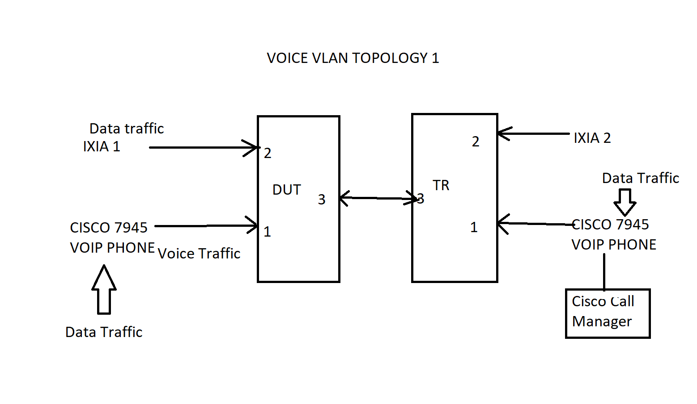

#  SQA Test Plan

#  Voice VLAN

    #  SONIC 3.2.1  Release

[TOC]
# Test Plan Revision History
| Rev  |    Date    |        Author        | Change Description |
| :--: | :--------: | :------------------: | ------------------ |
| 0.1  | 12/17/2021  | Anil Kumar Kolkaleti | Initial version    |

# List of Reviewers
| Function |         Name         |
| :------: | :------------------: |
|   Dev    |      Sandeep         |
|    QA    | Chandra Bhushan      |
|    QA    |   Kalyan V           |

# List of Approvers
| Function |         Name         | Date Approved |
| :------: | :------------------: | :-----------: |
|   Dev    |      Sandeep         |               |
|    QA    | Chandra Bhushan      |               |
|    QA    |    Kalyan V          |               |

# Definition/Abbreviation
| **Term** | **Meaning**  |
| -------- | ------------ |
|   CoS    | Class of service   |
|   DSCP   | Differentiated Service Code point |
|   MED    | NMedia endpoint discovery         |
|   PoE    | Power over Ethernet |

# Feature Overview
Link Layer Discovery Protocol-Media Endpoint Discovery (LLDP-MED) is an extension to LLDP that operates between endpoint devices such as IP phones to provide support for voice over IP (VoIP) applications. LLDP-MED endpoints determine the capabilities of a connected device and whether those capabilities are enabled.

LLDP-MED supports below TLVs:
Network policy profile -

Allows the device to advertise the voice VLAN information to endpoint devices like VoIP phones. Along with voice VLAN, tagging mode, dot1p CoS and DSCP values can be sent to the endpoint device. Voice VLAN feature enables switch ports to carry voice traffic with defined priority so as to enable separation of voice and data traffic coming onto the port. This is to ensure that sound quality of an IP phone could be safeguarded from deteriorating when the data traffic on the port is high.

Note: Voice VLAN TLV should be enabled only with compatible devices

Possible combinations of voice vlan traffic -

Assign Voice VLAN to the IP phone. Phone will send voice packets tagged with the voice vlan and the data traffic will come untagged. This is the most common deployment.
Assign a Dot1p priority to the IP phone. Phone will send voice packets with 802.1p tag and data traffic will be untagged.
Allow the IP phone to send untagged voice traffic. Voice traffic cannot be differentiated from data traffic and no QoS can be provided.
Power management TLV -

Allows the network device and endpoint device to exchange the power information like how the device is powered on, power priority, power required by the device
# Test Focus Areas
 1.Verify the Voice Vlan functionality through LLDP-MED using Cisco 7945 VOIP phones. 
 2.Verify that voice Vlan operation on the DUT by providing voice Vlan id on the interface. 
 3.Verify that voice Vlan can be configured on the DUT by configuring DSCP Value. 
 4.Verify that voice Vlan can be configured to send untagged traffic. 
 5.Verify that a port can participate only in one voice Vlan at a given instance of time. 
 6.Verify that Voice Vlan is operational on the port so that the connected IP phone can correctly communicate on the Voice Vlan. 
 7.Verify that Voice VLAN becomes non-operational if the Voice VLAN Id is deleted from dot1q database. 
 8.Verify that VoIP traffic is received with the dot1p priority when a dot1p priority is associated with the voice Vlan port instead of Vlan id. 
 9.Verify that in Untrusted Mode the CoS value is not trusted for 802.1p or 802.1Q tagged traffic and all untagged traffic is forwarded with a CoS value of 0. 
 10.Verify that in trusted Mode the CoS values of 802.1p or 802.1Q tagged traffic are forwarded based on the embedded priority info. 
 11.Verify that the switch can be configured to override the data traffic CoS. 
 12.To check the functionality of voice vlan age out time. 
 13.Verify that port is removed from Voice Vlan when OUI is deleted. 
 14.Verify that port is removed from Voice Vlan when voice vlan Id is changed. 
 15.Verify that Voip connected port is added to the vlan after disable and enable the voice vlan. 
 16.Verify the voice vlan functionality through LLDP-MED using IXIA. 
 17.Verify that ports are added to the vlan after disable and enable the voice vlan. 
 18.Verify the voice vlan functionlaity through LLDP using IXIA. 
 19.Verify the LLDP mgmt-ip is advertised by the DUT. 
 20.Verify Voice Vlan feature when admin mode for Voice Vlan is disabled but the voice Vlan configuration is set on the interface and dot 1p priority for the VoIP traffic is configured. 
 21.Verify Voice Vlan feature when Voice Vlan is configured to send untagged traffic and when Voice Vlan is set to none  admin mode for Voice Vlan is disabled but the voice Vlan configuration is set on the interface. 
 22.Verify Voice Vlan feature when Voice Vlan Id is deleted from Dot1q database. 
 23.Verify Voice Vlan feature when Voice Vlan Id is configured  interface mode for Voice Vlan is disabled but the voice Vlan configuration is set globally. 
 24.Verify Voice Vlan feature when Voice Vlan is configured for Dot1p priority  interface mode for Voice Vlan is disabled but the voice Vlan configuration is set globally. 
 25.Verify Voice Vlan feature when Voice Vlan is configured to send untagged traffic interface mode for Voice Vlan is disabled but the voice Vlan configuration is set globally. 
 26.Verify Voice Vlan feature when Voice Vlan is configured globally and on interface mode and Voice Vlan Id is provided in the interface mode but LLDP-MED is disabled. 
 27.Verify Voice Vlan feature when Voice Vlan is configured globally and on interface mode  dot1p priority is set for the Voice traffic in the interface mode but LLDP-MED is disabled. 
 28.Verify Voice Vlan feature when Voice Vlan is configured to send untagged traffic and LLDP-MED is disabled. 
 29.Verify station movement is updated in the FDB. 
 30.Verify Voice VLAN behavior when port is disconnected or disabled. 
 31.Verify that the Voice Vlan functionality with STP portfast feature. 
 32.Verify that the Voice VLAN interaction with port-security. 
# Scope
SQA scope is to test the below requirements.
 1.Support LLDP MED voice vlan with dot1p, cos and dscp marking value for phones to use 
2.Support LLDP MED voice vlan configuration on physical interface 

# 1 Topologies
## 1.1 Topology1

# 2 Test  Case and Objectives
## 2.1 Functionality

### 2.2.1 Verify the Voice Vlan functionality through LLDP-MED using Cisco 7945 VOIP phones. 

| **Test ID**    | **FtOpSoSysVvFn001**                                              |
| -------------- | :----------------------------------------------------------- |
| **Test Name**  | **Verify the Voice Vlan functionality through LLDP-MED using Cisco 7945 VOIP phones.** |
| **Test Setup** | **Topology1** |
| **Type**       | **Functional**                                               |
| **Steps**      | **Procedure: 1. Setup the devices as per the topology mentioned above. Configure Port 2 of DUT and partnerDevice to be in same VLAN 10 and configure Port1 of DUT and PartnerDevice to be in same VLAN 20.  Enable tagged participation of 10 and 20 on Port3 of DUT and PartnerDevice. 2. Enable Voice VLAN on ports 1 and 3 of DUT and ensure that the traffic class assigned by Voice VLAN is mapped to highest priority queue. 3. Enable logging of debug severity level so as to view the messages that indicate Voice VLAN installing hardware rules after call establishment. Enable other console debugs as per the support for Voice VLAN related packet debugs. 4. Initiate a call from IP phone1 to IP phone2. Start the traffic from ixia1 to ixia2 to create congestion at port 3 of DUT. 5. Terminate the call (session) and check the logs. 6. Reinitiate call to IP phone2 and check the performance and voice clarity. 7. Terminate the call from Phone1 and initiate the call from Phone 2 to Phone1. Expected Results: 1.Verify that the configuration is successful. 2.Verify that the configuration is successful. 3. Verify that config is successful. 4.Verify that call gets established successfully and DUT is stable. Verify that log messages indicate the installation of Hardware rules to prioritize the current session traffic, this is done after the remote IP phone answers the call. Verify that Voice quality is fine in spite of congestion being created due to ixia traffic. 5. Verify that once the call is terminated, the HW rules are uninstalled removed by DUT as indicated by the system logs. 6.Verify that the results are same as explained in step4. 7. Verify that the call gets terminated successfully and entries are removed (as indicated by the log messages). After initiating call from Phone2 to phone1, the HW entries are formed again. ** |

### 2.2.2 Verify that voice Vlan operation on the DUT by providing voice Vlan id on the interface.

| **Test ID**    | **FtOpSoSysVvFn002**                                              |
| -------------- | :----------------------------------------------------------- |
| **Test Name**  | **Verify that voice Vlan operation on the DUT by providing voice Vlan id on the interface.** |
| **Test Setup** | **Topology1**                                                 |
| **Type**       | **Functional**                                               |
| **Steps**      | **Procedure: 1.Enable Voice VLAN  global mode and port mode on port 1. 2.Enable LLDP-MED mode on port 1 and the required med TLV tx option.  3.Create a Vlan X on the DUT. Enable voice Vlan on the port and provide the voice Vlan id as X.  4.Enable the IP phone connected to DUT port and check the packet ecxhange between DUT and IP phone. 5.Disable Voice VLAN on interface 0/1 . Expected Results:  1.Show voice Vlan   shows Voice Vlan enabled on the DUT. 2.Verify that the LLDP -MED is enabled. 3.Verify that the configuration is successful. Ensure that the port does not immediately participate in VLAN X until it detects IP phones LLDP MED packets. 4.Verify that DUT sends LLDP-MED packets with network policy TLV having following options.VID=X; Tagged flag set to true; After receiving the LLDP update from DUT, IP phone sends its LLDP update with similar Network policy TLV values. After that IP phone starts sending VLAN X agges packets and thus operates in VLAN X , obtains IP in VLAN X, contackts call manager and gets operationally UP. 5.After step 5  check voice Vlan is disabled on the interface from show interface 0/1 command also observe that voice traffic coming from the phone is not tagged with voice Vlan id.Verify that Vlan participation should be deleted when voice vlan is disabled.Verify that DUT stops sending Network-Policy TLV to IP phone. ** |

### 2.2.3  Verify that voice Vlan can be configured on the DUT by configuring DSCP Value.

| **Test ID**    | **FtOpSoSysVvFn003**                                              |
| -------------- | :----------------------------------------------------------- |
| **Test Name**  | **Verify that voice Vlan can be configured on the DUT by configuring DSCP Value.** |
| **Test Setup** | **Topology1**                                                 |
| **Type**       | **Functional**                                               |
| **Steps**      | **Procedure: 1.Enable Voice VLAN on global mode.. 2.Set Dscp value on the interface 0/1. Expected Results:  1.Show voice Vlan   shows Voice Vlan enabled on the DUT. 2.Show voice vlan interface 0/1   shows Configured Voice VLAN DSCP Value. ** |

### 2.2.4 Verify that voice Vlan can be configured to send untagged traffic.

| **Test ID**    | **FtOpSoSysVvFn004**                                              |
| -------------- | :----------------------------------------------------------- |
| **Test Name**  | **Verify that voice Vlan can be configured to send untagged traffic.** |
| **Test Setup** | **Topology1**                                                 |
| **Type**       | **Functional**                                               |
| **Steps**      | **Procedure: 1. Enable Voice VLAN on global mode. 2.Enable LLDP-MED globally. 3.Set the Voice VLAN traffic to none on the interface to accept the default configuration from the connected VoIP.  4.Send the traffic from the VoIP device. 5.Disable Voice VLAN on interface 0/1 . 6.On the interface  Enable voice Vlan and configure the Voice Vlan to send untagged traffic. 7.Send the traffic from the VoIP device. 8.Disable Voice VLAN on interface 0/1 . Expected Results:  1.Show voice Vlan   shows Voice Vlan enabled on the DUT. 2.LLDP -MED is enabled. 3.After step 4  check that VoIP device uses its own configuration to send untagged voice traffic. DUT must send LLDP-MED packets without Network policy TLV. 4.After step 6, DUT sends LLDP-MED packets with Network policy TLV (Voice) set with folowing options Tagged bit = False; VID = 0;check that untagged Voice traffic is received from the VoIP device. 5. After step 8 check voice Vlan is disabled on the interface from show interface 0/1 command. ** |

### 2.2.5 Verify that a port can participate only in one voice Vlan at a given instance of time.

| **Test ID**    | **FtOpSoSysVvFn005**                                              |
| -------------- | :----------------------------------------------------------- |
| **Test Name**  | **verify the operation of a client host that is using symmetric key cryptography  to authenticate the server.** |
| **Test Setup** | **Topology1**                                                 |
| **Type**       | **Functional**                                               |
| **Steps**      | **Procedure: 1.Enable Voice VLAN on global mod. 2.Set voice Vlan id on the interface. 3.Try to set another Voice Vlan id on the same interface. Expected Results:  1.Voice Vlan id is enabled on the DUT. 2.Voice Vlan is enabled on the interface. 3.Verify that the New voice Vlan Id is enabled on the interface and the voice Vlan id configured earlier is no more operational. ** |

### 2.2.6 Verify that Voice Vlan is operational on the port so that the connected IP phone can correctly communicate on the Voice Vlan.

| **Test ID**    | **FtOpSoSysVvFn006**                                              |
| -------------- | :----------------------------------------------------------- |
| **Test Name**  | **Verify that Voice Vlan is operational on the port so that the connected IP phone can correctly communicate on the voice Vlan.** |
| **Test Setup** | **Topology1**                                                 |
| **Type**       | **Functional**                                               |
| **Steps**      | **Procedure: 1.Enable Voice VLAN on global mode.  2.Configure Voice VLAN on interface mode. 3.Enable LLDP-MED globally. 4.Configure Voice Vlan as one of the active Vlan in the Dot1q database. on the interface mode, configure voice vlan id. 5.Verify that port is authorized and link is active. 6.Verify that port is not a part of Guest Vlan or lag interface. 7.Send traffic from the VoIP Phone. Expected Results:  1.Voice Vlan id is enabled on the DUT.  2.Voice Vlan is enabled on the interface with the correct Vlan id. 3.LLDP-MED is enabled. 4.Voice Vlan is the active Vlan. 5.Port is authorized and link is active. 6.Port is not a part of Guest Vlan or lag interface. 7.Verify that Tagged traffic is received from VoIP Phone with the tagging as the Vlan id. ** |

### 2.2.7 Verify that Voice VLAN becomes non-operational if the Voice VLAN Id is deleted from dot1q database.

| **Test ID**    | **FtOpSoSysVvFn007**                                              |
| -------------- | :----------------------------------------------------------- |
| **Test Name**  | **Verify that Voice VLAN becomes non-operational if the Voice VLAN Id is deleted from dot1q database..** |
| **Test Setup** | **Topology1**                                                 |
| **Type**       | **Functional**                                               |
| **Steps**      | **Procedure: 1.Enable Voice VLAN on global mode. 2.Configure Voice VLAN on interface mode. 3.Enable LLDP-MED globally. 4.Configure Voice Vlan as one of the active Vlan in the Dot1q database. Set the port participation in configured Voice Vlan id. 5.Verify that port is authorized and link is active. 6.verify that port is not a part of Guest Vlan or lag interface. 7.Send traffic from the VoIP Phone. 8.Delete the Voice Vlan id from the dot1q database. 9.Send traffic from the VoIP Phone. Expected Results:  1.Voice Vlan id is enabled on the DUT. 2.Voice Vlan is enabled on the interface with the correct Vlan id. 3.Verify that the LLDP -MED is enabled. 4.Voice Vlan is the active Vlan. 5.Port is authorized and link is active. 6.Port is not a part of Guest Vlan or lag interface. 7.Verify that Tagged traffic is received from VoIP Phone with the tagging as the Vlan id. 8.Check that voice Vlan id does not exist further in the dot1q database. 9.Check that traffic received from VoIP phone is not tagged with Voice Vlan id. ** |

### 2.2.8 Verify that VoIP traffic is received with the dot1p priority when a dot1p priority is associated with the voice Vlan port instead of Vlan id.

| **Test ID**    | **FtOpSoSysVvFn008**                                              |
| -------------- | :----------------------------------------------------------- |
| **Test Name**  | **Verify that VoIP traffic is received with the dot1p priority when a dot1p priority is associated with the voice Vlan port instead of Vlan id.** |
| **Test Setup** | **Topology1**                                                 |
| **Type**       | **Functional**                                               |
| **Steps**      | **Procedure: 1.Enable Voice VLAN on global mode. 2.Enable LLDP-MED globally. 3.Enable Voice VLAN on interface 0/1. 4.Set the voice traffic priority to dot1p. 5.Disable Voice VLAN on the interface 0/1. Expected Results:  1.Voice Vlan id is enabled on the DUT. 2.LLDP -MED is enabled. 3.Voice Vlan is enabled on the interface. 4.After step 4  check if Voice Vlan priority is correctly set on the interface 0/1 from show interface 0/1 command.. 5. Trace Voice Traffic coming from the VoIP device tagged with Voice Vlan Id as 0 and priority that is set on the interface 0/1. 6.After step 5 check voice Vlan is disabled on the interface from show interface 0/1 command also observe that voice traffic coming from the phone is not tagged with voice Vlan priority set previously on the interface. ** |

### 2.2.9 Verify that in Untrusted Mode the CoS value is not trusted for 802.1p or 802.1Q tagged traffic and all untagged traffic is forwarded with a CoS value of 0.

| **Test ID**    | **FtOpSoSysVvFn009**                                              |
| -------------- | :----------------------------------------------------------- |
| **Test Name**  | **Verify that in Untrusted Mode the CoS value is not trusted for 802.1p or 802.1Q tagged traffic and all untagged traffic is forwarded with a CoS value of 0.** |
| **Test Setup** | **Topology1**                                                 |
| **Type**       | **Functional**                                               |
| **Steps**      | **Procedure: 1.Enable Voice VLAN on global mode. 2.Enable LLDP-MED globally. 3.Set the Voice Vlan data priority as untrust on the interface. 4.Enable Voice VLAN on interface 0/1 so that the VoIP device sends the untagged traffic. 5.Send the traffic from VoIP device. 6.Configure the IP Phone to use 802.1p priority tagging for voice traffic. Set the voice traffic priority to dot1p. 7.Send the traffic from VoIP device. 8.Disable Voice VLAN on the interface 0/1. Expected Results:  1.Voice Vlan id is enabled on the DUT. 2.LLDP -MED is enabled. 3.Voice Vlan is enabled on the interface. 4.After step 4  verify that all the untagged traffic from VoIP device is forwarded with a CoS value of 0. 5.After step 6  verify that the tagged traffic from VoIP device is forwarded with a CoS value of 0. 6.Trace Voice Traffic coming from the VoIP device tagged with Voice Vlan Id as 0 and priority that is set on the interface 0/1. 7.After step 7  check voice Vlan is disabled on the interface from show interface 0/1 command. ** |

### 2.3.0 Verify that in trusted Mode the CoS values of 802.1p or 802.1Q tagged traffic are forwarded based on the embedded priority info.

| **Test ID**    | **FtOpSoSysVvFn010**                                              |
| -------------- | :----------------------------------------------------------- |
| **Test Name**  | **Verify that in trusted Mode the CoS values of 802.1p or 802.1Q tagged traffic are forwarded based on the embedded priority info.** |
| **Test Setup** | **Topology1**                                                 |
| **Type**       | **Functional**                                               |
| **Steps**      | **Procedure: 1.Enable Voice VLAN on global mode. 2.Enable LLDP-MED globally. 3.Configure the IP Phone to use 802.1p priority tagging for voice traffic. Set the voice traffic priority to dot1p. 4.Send the traffic from VoIP device at 100mbps port speed. 5.Send the traffic from another IXIA port at 100mbps. 6.Set the port speed on DUT to 10mbps. 7.Capture the traffic transmitted from switch using IXIA. 8.Disable Voice VLAN on the interface 0/1. Expected Results: 1. Voice Vlan id is enabled on the DUT. 2.LLDP -MED is enabled. 3.Voice Vlan is enabled on the interface. 4.Verify that all the voice traffic is received with no loss of packets. 5.After step 8  check voice Vlan is disabled on the interface from show interface 0/1 command. ** |

### 2.3.1 Verify that the switch can be configured to override the data traffic CoS.

| **Test ID**    | **FtOpSoSysVvFn011**                                              |
| -------------- | :----------------------------------------------------------- |
| **Test Name**  | **Verify that the switch can be configured to override the data traffic CoS.** |
| **Test Setup** | **Topology1**                                                 |
| **Type**       | **Functional**                                               |
| **Steps**      | **Procedure: 1.Enable Voice VLAN on global config mode. 2.Enable LLDP-MED on the global mode. 3.Configure Voice Vlan as dot1p priority on the interface 0/1. 4.Set the port priority as lower than Voice Vlan priority. Send the traffic from the VoIP device. 5.Enable switch to override data priority. Send the traffic from the VoIP device. 6.Disable Voice VLAN on the interface 0/1. Expected Results: 1. Check show voice-Vlan to see if Voice VLAN is enabled on the global mode. 2.After step 3  check if Voice Vlan configuration is correctly set on the interface 0/1 from show interface 0/1 command. 3.Trace the Voice Traffic received from the VoIP device is tagged with priority configured on the interface 0/1. 4.Trace the data traffic is sent with priority configured on the port. 5.After step 5  data traffic is not sent out from the port with the priority configured on the port. 6.After step 6  check voice Vlan is disabled on the interface from show interface 0/1 command.. ** |

### 2.3.2 To check the functionality of voice vlan age out time.

| **Test ID**    | **FtOpSoSysVvFn012**                                              |
| -------------- | :----------------------------------------------------------- |
| **Test Name**  | **To check the functionality of voice vlan age out time.** |
| **Test Setup** | **Topology1**                                                 |
| **Type**       | **Functional**                                               |
| **Steps**      | **Procedure:  1.create a vlan in DUT. enable voice vlan functionality in DUT in global mode and make the created vlan as voice vlan. 2.on the ixia connected dut's port enable voice vlan functionality. and set voice vlan ageout timer to 2 mins.  3.Check the port's vlan membership . 4. From Ixia, send some test packets to DUT with source mac address matching one of  telephony OUI's  supported by platform. stop the stream . 5.Check the FDB Table. and check DUT port's vlan membership . 6.Clear the FDB Table . 7.Wait for 2 mins and after that check the port's vlan membership . Expected Results: 1.voice vlan enabling and configuration should be successful. 2.voice vlan setting on port and age out timer should be set successfully.   3.Port should not become  member of voice vlan.  4.DUT should accept those packets. 5.FDB table should have entry with the SMAC of test packet. port should become member of voice vlan . 6.FDB table should be cleared . 7.Port should not be the member of voice vlan after voice vlan ageout timer . ** |

### 2.3.3 Verify that port is removed from Voice Vlan when OUI is deleted.

| **Test ID**    | **FtOpSoSysVvFn013**                                              |
| -------------- | :----------------------------------------------------------- |
| **Test Name**  | **Verify that port is removed from Voice Vlan when OUI is deleted.** |
| **Test Setup** | **Topology1**                                                 |
| **Type**       | **Functional**                                               |
| **Steps**      | **Procedure: 1.Create a vlan and enable Voice Vlan globally and on the port connected to Ixia with the vlan created. 2.Send burst traffic with source MAC address having OUI prefix (Ex 00:01:e3:12:23:12, first three bytes of Mac address) from Ixia. 3.Delete that OUI used in the traffic. Expected Results: 1.Verify that vlan is created and voice vlan is enabled globally and on port. 2.Verify that port is a member of the voice vlan. 3.Verify that voice vlan membership of the port is deleted successfully. ** |

### 2.3.4 Verify that port is removed from Voice Vlan when voice vlan Id is changed. 

| **Test ID**    | **FtOpSoSysVvFn014**                                              |
| -------------- | :----------------------------------------------------------- |
| **Test Name**  | **Verify that port is removed from Voice Vlan when voice vlan Id is changed.** |
| **Test Setup** | **Topology1** |
| **Type**       | **Functional**                                               |
| **Steps**      | **Procedure: 1.Enable Voice Vlan globally and on the port connected to Ixia with default vlan 2 . 2.Send burst traffic with source MAC address having OUI prefix (Ex 00:03:6b:12:23:12, first three bytes of Mac address) from Ixia . 3.Create a vlan 2000 and change the voice vlan Id to 2000 on the port .  4.Clear the address table, so that previous OUI MAC entry is erased . 5.Send burst traffic with source MAC address having OUI prefix (Ex 00:03:6b:12:23:12, first three bytes of Mac address) from Ixia. Expected Results: 1.Verify that vlan is created and voice vlan is enabled globally and on the port . 2.Verify that port is a member of the voice vlan 2 . 3.Verify that vlan is created and voice vlan is enabled on port with 2000 as vlan ID and port participation is removed from the privious vlan . 4.Verify the address table is cleared . 5.Verify that now port is a member of the voice vlan 2000 only, it should not be a member of both 2 & 2000. ** |

### 2.3.5 Verify that Voip connected port is added to the vlan after disable and enable the voice vlan. 

| **Test ID**    | **FtOpSoSysVvFn015**                                              |
| -------------- | :----------------------------------------------------------- |
| **Test Name**  | **Verify that Voip connected port is added to the vlan after disable and enable the voice vlan.** |
| **Test Setup** | **Topology1** |
| **Type**       | **Functional**                                               |
| **Steps**      | **Procedure: 1.Enable voice vlan globally and on voip connected interafce and also configure voice Vlan on it. 2.Disable Vlan gloablly and on the voip connected port. 3.re-enable vlan globally and on the voip connected port.  Expected Results:  1.Verify that voice vlan configuration is suucessful and the port is added to the vlan. 2.Verify that port participation from voice VLAN gets cleared. 3.Verify that port participation in voice VLAN happens again. ** |

### 2.3.6 Verify the voice vlan functionality through LLDP-MED using IXIA. 

| **Test ID**    | **FtOpSoSysVvFn016**                                              |
| -------------- | :----------------------------------------------------------- |
| **Test Name**  | **Verify the voice vlan functionality through LLDP-MED using IXIA.** |
| **Test Setup** | **Topology1**                                                 |
| **Type**       | **Functional**                                               |
| **Steps**      | **Procedure: 1.Enable LLDP-MED on interface connected to DUT.> 2.Enable voice vlan globally and on IXIA connected interface and also configure voice Vlan on it.> 3.Send LLDP-MED stream (VOIP phones traffic) from IXIA to the DUT.> 4.Save and reload the DUT with the existing configuration.> 5.Send LLDP-MED stream (VOIP phone traffic) from IXIA to the DUT.> 6.Disable the voice vlan.> Expected Results:  1.Verify that LLDP-MED configuration is successful. 2.Verify that voice vlan configuration is successful. 3.Verify that port is participating in configured voice vlan and VOIP device entry is registered. 4.Verify that the DUT comes up fine after reload. 5.Verify that port is participating in configured voice vlan and VOIP device entry is registered after reload. 6.Verify that the all VOIP entries are deleted. ** |

### 2.3.7 Verify that ports are added to the vlan after disable and enable the voice vlan.

| **Test ID**    | **FtOpSoSysVvFn017**                                              |
| -------------- | :----------------------------------------------------------- |
| **Test Name**  | **Verify that ports are added to the vlan after disable and enable the voice vlan.** |
| **Test Setup** | **Topology1** |
| **Type**       | **Functional**                                               |
| **Steps**      | **Procedure: 1.Configure voice Vlan and send traffic from two ports.The traffic had OUI source mac. 2.Disable Vlan gloablly and on two ports. 3.re-enable vlan globally and on two ports. >Expected Results: 1.Verify that two ports are added to the vlan. 2.Verify that ports participation from voice VLAN gets cleared . 3.Verify that ports participation in voice VLAN happens again . ** |

### 2.3.8 Verify the voice vlan functionlaity through LLDP using IXIA. 

| **Test ID**    | **FtOpSoSysVvFn018**                                              |
| -------------- | :----------------------------------------------------------- |
| **Test Name**  | **Verify the voice vlan functionlaity through LLDP using IXIA.** |
| **Test Setup** | **Topology1** |
| **Type**       | **Functional**                                               |
| **Steps**      | **Procedure: 1.Enable LLDP on interface connected to DUT. 2.Enable voice vlan globally and on voip(IXIA) connected interafce and also configure voice Vlan on it. 3.Send stream from IXIA to the DUT.  4.Save and reload the DUT with the existing configuration. 5. Send stream from IXIA to the DUT. 6.Disable the voice vlan. Expected Results:  1.Verify that LLDP configuration is successful. 2.Verify that voice vlan configuration is successful. 3.Verify that port is participating in configured voice vlan and VOIP device entries are registered. 4.Verify that the DUT comes up fine after reload. 5.Verify that port is participating in configured voice vlan and VOIP device entries are registered after reload. 6.Verify that the all VOIP entries are deleted. ** |
### 2.3.9 Verify the LLDP mgmt-ip is advertised by the DUT. 

| **Test ID**    | **FtOpSoSysVvFn018**                                              |
| -------------- | :----------------------------------------------------------- |
| **Test Name**  | **Verify the voice vlan functionlaity through LLDP using IXIA.** |
| **Test Setup** | **Topology1** |
| **Type**       | **Functional**                                               |
| **Steps**      | **Procedure: 1.Enable LLDP MED on both DUT and TR. 2.Enable LLDP-MED adv mgmt-ip address. Expected Results:  1.Verify that LLDP MED configuration is successful. 2.Verify that DUT mgmt-ip address is update in the show lldp config in the TR. ** |

## Negative Functionality
### 2.3.9 Verify Voice Vlan feature when admin mode for Voice Vlan is disabled but the voice Vlan configuration is set on the interface 0/1 and voice Vlan id is configured. 

| **Test ID**    | **FtOpSoSysVvNt001**                                              |
| -------------- | :----------------------------------------------------------- |
| **Test Name**  | **Verify Voice Vlan feature when admin mode for Voice Vlan is disabled but the voice Vlan configuration is set on the interface 0/1 and voice Vlan id is configured** |
| **Test Setup** | **Topology1** |
| **Type**       | **Negative**                                               |
| **Steps**      | **Procedure: 1.Enable Voice VLAN on global mode . 2.Enable LLDP-MED globally. 3.Create a Vlan X on the DUT. Enable voice Vlan on the interface and provide the voice Vlan id as X . 4. Send the traffic from the VoIP device . 5.Disable the voice Vlan in the global mode . Expected Results: 1.Show voice Vlan   shows Voice Vlan enabled on the DUT. 2.LLDP -MED is enabled . 3. After step 4  VoIP traffic received from the VoIP device should be tagged with Voice Vlan id . 4.After step 5  check voice Vlan is disabled and the voice traffic received from the phone is not tagged with voice Vlan Id configured on the interface . ** |

### 2.4.0 Verify Voice Vlan feature when admin mode for Voice Vlan is disabled but the voice Vlan configuration is set on the interface 0/1 and dot 1p priority for the VoIP traffic is configured.  

| **Test ID**    | **FtOpSoSysVvNt002**                                              |
| -------------- | :----------------------------------------------------------- |
| **Test Name**  | **Verify Voice Vlan feature when admin mode for Voice Vlan is disabled but the voice Vlan configuration is set on the interface 0/1 and dot 1p priority for the VoIP traffic is configured.** |
| **Test Setup** | **Topology1**                                                 |
| **Type**       | **Negative**                                               |
| **Steps**      |  **Procedure: 1.Enable Voice VLAN on global mode. 2. Enable LLDP-MED globally. 3.Enable voice Vlan on the interface and provide the voice Vlan data priority..  4. Send the traffic from the VoIP device. 5.Disable the voice Vlan in the global mode. Expected Results:  1.Show voice Vlan   shows Voice Vlan enabled on the DUT. 2. Verify that the LLDP -MED is enabled. 3.After step 4  VoIP traffic received from the VoIP device should be tagged with Voice Vlan data priority. 4.After step 5  check voice Vlan is disabled and the voice traffic received from the phone is not tagged with voice Vlan data priority configured on the interface. ** |

### 2.4.1 :  Verify Voice Vlan feature when Voice Vlan is configured to send untagged traffic and when Voice Vlan is set to none  admin mode for Voice Vlan is disabled but the voice Vlan configuration is set on the interface.

| **Test ID**    | **FtOpSoSysVvNt003**                                              |
| -------------- | :----------------------------------------------------------- |
| **Test Name**  | **Verify Voice Vlan feature when Voice Vlan is configured to send untagged traffic and when Voice Vlan is set to none  admin mode for Voice Vlan is disabled but the voice Vlan configuration is set on the interface.** |
| **Test Setup** | **Topology1**                                                 |
| **Type**       | **Negative**                                               |
| **Steps**      |  **Procedure: 1.Enable Voice VLAN on global mode . 2.Enable LLDP-MED globally . 3. Set the Voice VLAN traffic to none on the interface to accept the default configuration from the connected VoIP . 4.Send the traffic from the VoIP device.  5.Disable Voice VLAN globally . 6.Enable Voice Vlan globally again . 7.On the interface  configure the Voice Vlan to send untagged traffic .  8.Send the traffic from the VoIP device . 9.Disable Voice VLAN globally . Expected Results:  1.Show voice Vlan   shows Voice Vlan enabled on the DU . 2.LLDP -MED is enabled . 3.After step 4  check that VoIP device uses its own configuration to send untagged voice traffic. 4.After step 5  check that untagged traffic is received from the VoIP device . 5.After step 8  check that untagged Voice traffic is received from the VoIP device . 6.After step 9 check voice Vlan is disabled globally and untagged traffic is received from the VoIP device . ** |

### 2.4.2 Verify Voice Vlan feature when Voice Vlan Id is deleted from Dot1q database.

| **Test ID**    | **FtOpSoSysVvNt004**                                              |
| -------------- | :----------------------------------------------------------- |
| **Test Name**  | **Verify Voice Vlan feature when Voice Vlan Id is deleted from Dot1q database.** |
| **Test Setup** | **Topology1**                                                 |
| **Type**       | **Negative**                                               |
| **Steps**      |  **Procedure: 1. Enable Voice VLAN on global mode.. 2.Configure Voice VLAN on interface mode. 3.Enable LLDP-MED globally . 4.Configure Voice Vlan as one of the active Vlan in the Dot1q database. Set the port participation in configured Voice Vlan id . 5.Verify that port is authorized and link is active . 6.Verify that port is not a part of Guest Vlan or lag interface . 7.Send traffic from the VoIP Phone . 8.Delete the Voice Vlan id from the dot1q database . 9. Send traffic from the VoIP Phone . Expected Results: 1.Voice Vlan id is enabled on the DUT . 2.Voice Vlan is enabled on the interface with the correct Vlan id. 3.LLDP -MED is enabled . 4.Voice Vlan is the active Vlan . 5.Port is authorized and link is activ . 6.Port is not a part of Guest Vlan or lag interface . 7.Verify that Tagged traffic is received from VoIP Phone with the tagging as the Vlan id . 8. Check that voice Vlan id does not exist further in the dot1q database . 9.Check that traffic received from VoIP phone is not tagged with Voice Vlan id. ** |

### 2.4.3 Verify Voice Vlan feature when Voice Vlan Id is configured  interface mode for Voice Vlan is disabled but the voice Vlan configuration is set globally.

| **Test ID**    | **FtOpSoSysVvNt005**                                              |
| -------------- | :----------------------------------------------------------- |
| **Test Name**  | **Verify Voice Vlan feature when Voice Vlan Id is configured  interface mode for Voice Vlan is disabled but the voice Vlan configuration is set globally.** |
| **Test Setup** | **Topology1**                                                 |
| **Type**       | **Negative**                                               |
| **Steps**      |  **Procedure: 1.Enable Voice VLAN on global mode . 2.Enable LLDP-MED globally . 3. Enable voice Vlan on the interface and provide the voice Vlan id . 4.Send the traffic from the VoIP device . 5.Disable Voice VLAN on interface 0/1 . Expected Results: 1. Show voice Vlan   shows Voice Vlan enabled on the DUT . 2.LLDP -MED is enabled. 3.After step 4  VoIP traffic received from the VoIP device should be tagged with Voice Vlan id . 4.After step 5  check voice Vlan is disabled on the interface from show interface 0/1 command also observe that voice traffic coming from the phone is not tagged with voice Vlan id . ** |

### 2.4.4 Verify Voice Vlan feature when Voice Vlan is configured for Dot1p priority  interface mode for Voice Vlan is disabled but the voice Vlan configuration is set globally.

| **Test ID**    | **FtOpSoSysVvNt006**                                              |
| -------------- | :----------------------------------------------------------- |
| **Test Name**  | **Verify Voice Vlan feature when Voice Vlan is configured for Dot1p priority  interface mode for Voice Vlan is disabled but the voice Vlan configuration is set globally.** |
| **Test Setup** | **Topology1**                                                 |
| **Type**       | **Negative**                                               |
| **Steps**      |  **Procedure:  1.Enable Voice VLAN on global mode. 2.Enable LLDP-MED globally . 3.Set dot1p priority for the voice traffic on the interface.  4.Send the traffic from the VoIP device .  5.Disable Voice VLAN on interface 0/1 . Expected Results: 1. Show voice Vlan   shows Voice Vlan enabled on the DUT .  2.Verify that the LLDP -MED is enabled.  3.After step 4  VoIP traffic received from the VoIP device should be tagged with dot1p priority.  4.After step 5  check voice Vlan is disabled on the interface from show interface 0/1 command also observe that voice traffic coming from the phone is not tagged with dot1p priority . ** |

### 2.4.5 Verify Voice Vlan feature when Voice Vlan is configured to send untagged traffic interface mode for Voice Vlan is disabled but the voice Vlan configuration is set globally.

| **Test ID**    | **FtOpSoSysVvNt007**                                              |
| -------------- | :----------------------------------------------------------- |
| **Test Name**  | **Verify Voice Vlan feature when Voice Vlan is configured to send untagged traffic interface mode for Voice Vlan is disabled but the voice Vlan configuration is set globally.** |
| **Test Setup** | **Topology1**                                                 |
| **Type**       | **Negative**                                               |
| **Steps**      |  **Procedure: 1.Enable Voice VLAN on global mode . 2.Enable LLDP-MED globally. 3.Set the Voice VLAN traffic to none on the interface to accept the default configuration from the connected VoIP. 4.Send the traffic from the VoIP device . 5.Disable Voice VLAN on interface 0/1 . 6.On the interface  configure the Voice Vlan to send untagged traffic . 7.Send the traffic from the VoIP device . 8.Disable Voice VLAN on interface 0/1 . Expected Results:  1.Show voice Vlan   shows Voice Vlan enabled on the DUT . 2.Verify that the LLDP -MED is enabled. 3.After step 4  check that VoIP device uses its own configuration to send untagged voice traffic . 4.After step 5  check that untagged traffic is received from the VoIP devic . 5.After step 7  check that untagged Voice traffic is received from the VoIP device. 6. After step 8 check voice Vlan is disabled on the interface from show interface 0/1 command and untagged traffic is received from the VoIP device. ** |

### 2.4.6 Verify Voice Vlan feature when Voice Vlan is configured globally and on interface mode and Voice Vlan Id is provided in the interface mode but LLDP-MED is disabled.

| **Test ID**    | **FtOpSoSysVvNt008**                                              |
| -------------- | :----------------------------------------------------------- |
| **Test Name**  | **Verify Voice Vlan feature when Voice Vlan is configured globally and on interface mode and Voice Vlan Id is provided in the interface mode but LLDP-MED is disabled.** |
| **Test Setup** | **Topology1**                                                 |
| **Type**       | **Negative**                                               |
| **Steps**      |  **Procedure: 1.Enable Voice VLAN on global mode. 2.Enable LLDP-MED globally. 3.Enable voice Vlan on the interface and provide the voice Vlan id. 4.Send the traffic from the VoIP device .  5.Disable LLDP-MED globally . Expected Results: 1.Show voice Vlan   shows Voice Vlan enabled on the DUT . 2.Verify that the LLDP -MED is enabled . 3.After step 4  VoIP traffic received from the VoIP device should be tagged with Voice Vlan id . 4.After step 5  check that voice traffic coming from the phone is not tagged with voice Vlan id. ** |

### 2.4.7 Verify Voice Vlan feature when Voice Vlan is configured globally and on interface mode  dot1p priority is set for the Voice traffic in the interface mode but LLDP-MED is disabled.

| **Test ID**    | **FtOpSoSysVvNt009**                                              |
| -------------- | :----------------------------------------------------------- |
| **Test Name**  | **Verify Voice Vlan feature when Voice Vlan is configured globally and on interface mode  dot1p priority is set for the Voice traffic in the interface mode but LLDP-MED is disabled.** |
| **Test Setup** | **Topology1**                                                 |
| **Type**       | **Negative**                                               |
| **Steps**      | **Procedure: 1.Enable Voice VLAN on global mode. 2.Enable LLDP-MED globally . 3.Set dot1p priority for the voice traffic on the interface. 4.Send the traffic from the VoIP device. 5. Disable LLDP-MED globally . Expected Results: 1.Show voice Vlan shows Voice Vlan enabled on the DUT. 2.Verify that the LLDP -MED is enabled. 3.After step 4  VoIP traffic received from the VoIP device should be tagged with dot1p priority . 4.After step 5  check that voice traffic coming from the phone is not tagged with dot1p priority. ** |

### 2.4.8 Verify Voice Vlan feature when Voice Vlan is configured to send untagged traffic and LLDP-MED is disabled.

| **Test ID**    | **FtOpSoSysVvNt010**                                              |
| -------------- | :----------------------------------------------------------- |
| **Test Name**  | **Verify Voice Vlan feature when Voice Vlan is configured to send untagged traffic and LLDP-MED is disabled.** |
| **Test Setup** | **Topology1**                                                 |
| **Type**       | **Negative**                                               |
| **Steps**      |  **Procedure: 1.Enable Voice VLAN on global mode . 2.Enable LLDP-MED globally . 3.Set the Voice VLAN traffic to none on the interface to accept the default configuration from the connected VoIP . 4.Send the traffic from the VoIP device. 5.Disable LLDP-MED . 6.On the interface  configure the Voice Vlan to send untagged traffic . 7.Send the traffic from the VoIP device. 8.Disable LLDP-MED. Expected Results:  1.Show voice Vlan   shows Voice Vlan enabled on the DUT . 2.Verify that the LLDP -MED is enabled . 3.After step 4  check that VoIP device uses its own configuration to send untagged voice traffic . 4.After step 5  check that untagged traffic is received from the VoIP device. 5.After step 7  check that untagged Voice traffic is received from the VoIP device. 6.After step 8  check voice Vlan is disabled on the interface from show interface 0/1 command and untagged traffic is received from the VoIP device . ** |

### 2.4.9 Verify station movement is updated in the FDB

| **Test ID**    | **FtOpSoSysVvNt011**                                              |
| -------------- | :----------------------------------------------------------- |
| **Test Name**  | **Verify station movement is updated in the FDB** |
| **Test Setup** | **Topology1**                                                 |
| **Type**       | **Negative**                                               |
| **Steps**      |  **Procedure: 1.Bring up the DUT with default configuratio. 2.Configure 2 streams on the IXIA with the same src MAC. 3.Enable Voice VLAN on the ports connected to the IXIA. 4.Send stream to the first port  . 5.Then stop first stream and send stream to the second port. . Expected Results: 1.For step 4, verify that port has been successfully added to the Voice VLAN . 2.For step 5, verify that first port has been removed from the first VLAN and second has been added instead . ** |

### 2.5.0 Verify Voice VLAN behavior when port is disconnected or disabled.

| **Test ID**    | **FtOpSoSysVvNt012**                                              |
| -------------- | :----------------------------------------------------------- |
| **Test Name**  | **Verify Voice VLAN behavior when port is disconnected or disabled.** |
| **Test Setup** | **Topology1**                                                 |
| **Type**       | **Negative**                                               |
| **Steps**      |  **Procedure: 1.Bring up the DUT with default configuration . 2.Connect one port to the IXIA . 3.Enable Voice VLAN on this port . 4.Sent Voice stream from the IXIA to the DUT. 5.Stop the stream and admin remove the Ixia port . 6.Repeat above steps 1-4 and for step 5, administratively shutdown the port on DUT. Expected Results:  1. For step 4, verify that the FDB has the source MAC address of the stream sent from Ixia . 2.For both steps 5 and 6, verify that port is Not Active and is not participating in the Voice VLAN. ** |

## Feature Interaction
### 2.5.1 Verify that the Voice Vlan functionality with STP portfast feature.

| **Test ID**    | **FtOpSoSysVvFi001**                                              |
| -------------- | :----------------------------------------------------------- |
| **Test Name**  | **Verify that the Voice Vlan functionality with STP portfast feature..** |
| **Test Setup** | **Topology1**                                                 |
| **Type**       | **Interaction**                                               |
| **Steps**      | **Procedure: 1.Create VLANs 10, 100 and 200 on DUT. 2.Configure the following on port 1 of DUT, data vlan 10,voice vlan 100,portfast,LLDP MED. 3.onnect LLDP capable IP Phone to port 1 (Cisco 7945/7940 IP phone). Wait for the IP phone to start sending LLDP packets. Connect port 2 to production network having call manager and DHCP server, participate port 2 in VLAN 100 PVID 100.. 4.Check the IP phone connectivity   . 5.Save the configuration and reboot the DUT. Check the IP phone status after DUT reboots. 6.Disconnect and reconnect the IP Phone. 7.Change the Voice VLAN ID to 20 on port 1 and participate interface in VLAN 200 . Expected Results:  1.Verify that the configuration is successful. 2.Verify that the configuration is successful. 3. Verify that port authorizes IP Phone upon receiving the first LLDP packet with from IP phone, thus by-passing the authentication. The IP phones MAC is then associated with Voice VLAN ID. 4.Verify that the IP phone tags all its egress packets with VLAN 100, obtains IP address in VLAN 100, contacts call manager and is then ready to receive and initiate calls.. 5.Verify that upon reboot, DUT comes up well with saved configuration. Check that calls can be initiated and received using the IP phone over Voice VLAN. Also wait for a period of 600 seconds and verify that IP phone is stable and does not restart the DHCP discovery process. 6.Verify that the IP phone gets authorized and establishes network connectivity again through the Switch over Voice VLAN. 7.Verify that DUT advertises LLDP packets with modified VLAN id in Voice VLAN reply TLV. IP phone adjusts its VLAN accordingly an starts DHCP discovery process in the new Voice VLAN. Verify that the Phone is UP, Calls can be initiated and received on the phone. ** |

### 2.5.2 Verify that the Voice VLAN interaction with port-security.

| **Test ID**    | **FtOpSoSysVvFi002**                                              |
| -------------- | :----------------------------------------------------------- |
| **Test Name**  | **Verify that the Voice VLAN interaction with port-security.** |
| **Test Setup** | **Topology1**                                                 |
| **Type**       | **Interaction**                                               |
| **Steps**      | **Procedure: 1.Enable Voice VLAN on global mode. 2.Configure Voice VLAN and port-security on interface mode. 3.Enable LLDP-MED and port-security globally. 4.Configure Voice Vlan as one of the active Vlan in the Dot1q database. on the interface mode, configure voice vlan id. 5.Send traffic from the VoIP Phone. Expected Results:  1.Voice Vlan id and port-security is enabled on the DUT. 2.Voice Vlan is enabled on the interface with the correct Vlan id. 3.Verify that the LLDP MED and port-security is enabled. 4.Voice Vlan is the active Vlan. 5.Verify that Tagged traffic is received from VoIP Phone with the tagging as the Vlan id. ** |

## 3 Reference Links
<https://github.com/BRCM-SONIC/sonic_doc_private/blob/3cddb5413340cdb3809e48d094f984c648e5f06d/L2/LLDP/LLDP_enhancements.md>