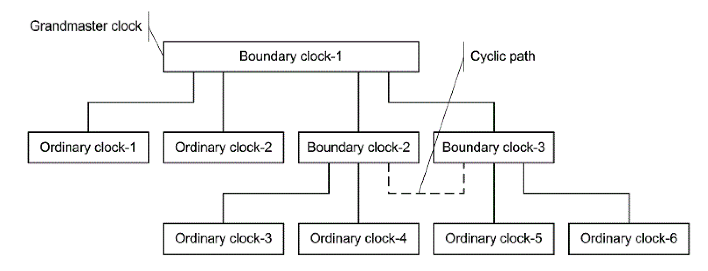
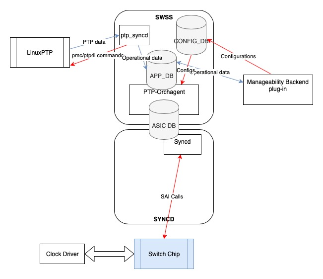
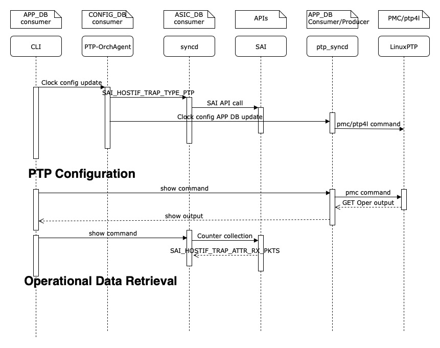

# SONiC LinuxPTP

## High Level Design Document

### Rev 0.4

# Table of Contents

* [List of Tables](#list-of-tables)
  * [Revision](#revision)
  * [About This Manual](#about-this-manual)
  * [Scope](#scope)
  * [Definition/Abbreviation](#definition-abbreviation)
  * [Requirements](#1-Requirements-Overview)
  * [Functionality](#2-Functionality)
  * [Design](#3-Design)
  * [Flow Diagrams](#4-Flow-Diagrams)
  * [Serviceability and Debug](#5-Serviceability-and-Debug)
  * [Warm Boot Support](#6-Warm-Boot-Support)
  * [Scalability](#7-Scalability)
  * [Unit Test](#8-Unit-Test)

# List of Tables

[Table 1: Abbreviations](#table-1-abbreviations)  
[Table 2: SAI Attributes](#table-2-sai-attributes)

# Revision

| Rev |     Date    |       Author       | Change Description                |
|:---:|:-----------:|:------------------:|:-----------------------------------|
| 0.1 | 04/22/2019  |   Prasanth Kunjum Veettil   | Initial version          |
| 0.2 | 07/30/2019  |   Prasanth Kunjum Veettil   | Addressed review comments|
| 0.3 | 10/07/2019  |   Lyndon Siao               | Addressed review comments|
| 0.4 | 01/07/2020  |   Prasanth Kunjum Veettil  / Lyndon Siao               | Updated support matrix and CLI|

# About this Manual

This document provides functional requirements and high-level design of Precision Time Protocol in SONiC.

# Scope

The PTP implementation for SONiC with LinuxPTP is covered in this document. The internal details of LinuxPTP and SONiC CPU path are not covered in this document.

# Definition/Abbreviation

## Table 1: Abbreviations

| **Term**                 | **Meaning**                         |
|--------------------------|-------------------------------------|
| PTP                      | Precision Time Protocol             |
| GM/GMC                   | Grand Master Clock                  |
| BMC                      | Best Master Clock                   |
| BMCA                     | Best Master Clock Algorithm         |
| ITU-T                    | International Telecommunication Union - Telecommunication    |
| BC                       | Boundary Clock                      |
| OC                       | Ordinary Clock                      |
| TC                       | Transparent Clock                   |
| E2E-TC                   | End to End Transparent Clock        |
| P2P-TC                   | Peer to Peer Transparent Clock      |

# 1 Requirements Overview

Precision Time Protocol provides a mechanism for synchronizing the clocks of participating nodes to a high degree of accuracy.

A PTP system is a distributed, networked system consisting of a combination of PTP and non-PTP devices. PTP devices are ordinary clocks, boundary clocks, end-to-end transparent clocks, peer-to-peer transparent clocks and management nodes. Non-PTP devices are bridges, routers and other infrastructure devices.

Precision Time Protocol is a distributed protocol that specifies how the real-time clocks in the system synchronize with each other. These clocks are organized into a master-slave synchronization hierarchy. The grandmaster clock at the top of the hierarchy  determines the reference time for the entire system. The synchronization is achieved by exchanging PTP timing messages, with the slaves using the timing information to adjust their clocks to the time of their master in the hierarchy.

The protocol executes within a logical scope called a domain. A given physical network and individual devices connected to the network can be associated with multiple domains, the time established within one domain by the protocol is independent of the time in other domains.

A network of boundary clocks and transparent clocks enable high precision time distribution by synchronization between clock nodes. Also, it supports redundancy of clock sources by supporting selection between multiple grand-masters available in a clock domain.

****
**Example clock deployment*

 It is assumed that the network eliminates cyclic forwarding of PTP messages within each communication path.
 Grand Master Clock is the node to which all other participating PTP nodes synchronize. If the current GMC goes down due to some reason, the next best clock  in the domain take over the role of Grand Master based on Best Master Clock (BMC) algorithm.
Transparent clocks basically timestamps the PTP packet and adjusts the correction field by measuring the residence time (queuing and buffering delays).

 PTP protocol does two major functions:

 1. Best Master Clock selection and port state machine.
         The grandmaster clock node and the roles of a clock ports in a domain across different clock nodes will be decided this way. The ANNOUNCE message exchanged between the potential-masters will enable the data-set comparison in BMCA to arrive at best master clock.
 2. The continuous synchronization to grand master clock using sync messages and delay measurement mechanism.
         The PTP messages - SYNC, FOLLOW-UP, DELAY and DELAY-RESPONSE -  facilitates time synchronization. PTP Servo running in each clock node will adjust the time, phase and frequency.

## 1.1 Functional Requirements

The functional requirements described below have direct dependency on the features supported in open-source LinuxPTP.  

1.1.1 Boundary Clock  
A boundary clock(BC) has one port in slave clock role and other ports in master clock role. BC synchronizes to the clock connected to its slave port. The clock nodes connected to master ports synchronizes to BC.
The network of BCs can select a grand-master clock from the available grand-master clocks in the network there by providing redundancy of clock sources. The role of clock ports of a BC can get changed when the time source changes to a different grand master or if there is a change in network topology.  

1.1.2 Transparent Clock End-to-End  
The end to end transparent clock uses end to end delay measurement. The LinuxPTP support is not required for this. The hardware support is required to update the resident time in the PTP packets.  

The following profiles are supported:  
1.1.3 IEEE 1588 Default Profile
This PTP profile is part of the IEEE1588 standard and it is basically used in a closed network with multicast transport mode.  

1.1.4 T-REC-G.8275.2 (Phase/time synchronization with partial timing support from the network)

1.1.5 The PTP packets are exchanged via regular port interface. PTP is not supported on port-channel and VLAN interfaces.

1.1.6 The PTP packets are encapsulated into Ethernet frame, IPv4 packet or IPv6 packets and transported in multicast and unicast modes.
The network transport modes supported for different profiles are captured in the below table:

| Boundary Clock|
|:-------------:|
| Profile| L2 MC | L2 UC | IPv4 MC | IPv4 UC | IPv6 MC | IPv6 UC  |
| IEEE 1588-2008 | Yes | Yes | Yes | Yes | Yes   | No* |
| ITUT-G.8275.2  | No | No | No | Yes | No   | No  |

| End-to-End Transparent Clock|
|:-------------:|
| Profile| L2 MC | L2 UC | IPv4 MC | IPv4 UC | IPv6 MC | IPv6 UC  |
| IEEE 1588-2008 | Yes | No | Yes | No | Yes   | No          |
| ITUT-G.8275.2  | N/A | N/A | N/A | N/A | N/A   | N/A       |
\* IPv6 unicast transport mode is not supported in LinuxPTP 2.0

1.1.7 The hardware time stamping capability depends on hardware capability as well as SAI support for the hardware platform.

1.1.8 The timing precision depends on the hardware platform and LinuxPTP implementation. It varies from platform to platform.

1.1.9 Both 1-step and 2-step time synchronization is supported by LinuxPTP. But this requires SAI support as well.

1.1.10 LinuxPTP supports multiple domains. The number of domains supported in a node is limited by the clock ports in that node.

1.1.11 A clock port can only be a physical port.

## 1.2 Configuration and Management Requirements

1.2.1 The LinuxPTP has to be managed using the  SONiC management infrastructure.  

1.2.2 The configurations provisioned using SONiC management infrastructure has to be persistent across reboot.  

1.2.3 The PTP behavior may not be expected with reference to the running configurations if LinuxPTP configurations are changed using linux commands or by modifying the related config files.  

1.2.4 In a node, single PTP instance is supported.  

## 1.3 Scalability Requirements

1.3.1. The requirement is for all switch ports to be able to participate as BC a port, and to each operate up to, at least 16 PPS. Each port can be separately configured to 128 PPS, but this is not expected to scale to all ports simultaneously.

## 1.4 Warm Boot Requirements

1.4.1 Warm boot is not supported for BC. During the warm boot, PTP processing stops and downstream devices will go into holdover. Clock precision may drift during this time, depending upon the properties of the downstream device. After the warm boot PTP processing will resume, and full precision is restored. For TC, PTP continues as normal through the warm boot.

# 2 Functionality

## 2.1 Target Deployment Use Cases

SONiC supports boundary clock only.
ITU-T recommends different telecom profile for different use cases. These telecom profile support  depends on LinuxPTP implementation.

## 2.2 Functional Description

LinuxPTP stack and servo will be used for the PTP solution in SONiC.

# 3 Design
## 3.1 Overview  

*Design block diagram*

PTP implementation can be divided into following components:

1. LinuxPTP (Open source)
2. Manageability and other SONiC platform independent components.  
3. SAI APIs
4. PTP hardware clock driver and hardware time stamping support.

## 3.2 DB Changes

### 3.2.1 CONFIG DB

PTP Table will contain the following data.
#### 3.2.1.1 Global PTP/Clock attributes

These are datasets which are not specific to clock ports. Example, default dataset, some of the parameters of which will be used by BMCA. The key for global level attribute will be "GLOBAL" and the table name is PTP_CLOCK.
The DB schema:
PTP_CLOCK|{GLOBAL}
  clockIdentity = 23*ALPHA
  twoStepFlag = 1*DIGIT
  domainNumber = 3*DIGIT
  numberPorts = 3*DIGIT
  priority1 = 3*DIGIT
  cq-clockClass = 3*DIGIT
  cq-clockAccuracy = 2*HEXDIG
  cq-offsetScaledLogVariance = 4*HEXDIG
  priority2 = 3*DIGIT

#### Clock port attributes

These are datasets specific to clock port. Example, port dataset. The field-value pairs at clock port level are stored and accessed using interface name as key.
The DB schema:
PTP_CLOCK|{Ethernet0...}
  portIdentity = 3*DIGIT
  portState = 2*DIGIT
  logMinDelayReqInterval = 5*DIGIT
  delayMechanism = 2*DIGIT
  logMinPdelayReqInterval = DIGIT
  versionNumber = 5*DIGIT

### 3.2.2 APP DB

### 3.2.3 STATE DB

The below mentioned attributes will be part of the table PTP_DATA in STATE_DB

PTP_DATA|{CurrentDS}
  stepsRemoved =  5*DIGIT
  offsetFromMaster = 20*DIGIT
  meanPathDelay = 20*DIGIT

PTP_DATA|{ParentDS}
  parentPortIdentity = 23*ALPHA
  parentStats = 1*DIGIT
  observedParentOffsetScaledLogVariance = 20*DIGIT
  grandmasterIdentity = 23*ALPHA
  gm-cq-clockClass = 3*DIGIT
  gm-cq-clockAccuracy = 2*HEXDIG
  gm-cq-offsetScaledLogVariance = 4*HEXDIG
  grandmasterPriority1 = 3*DIGIT
  grandmasterPriority2 = 3*DIGIT

PTP_DATA|{TimePropDS}
  currentUtcOffset = 20*DIGIT
  currentUtcOffsetValid = 1*DIGIT
  leap59 = 1*DIGIT
  leap61 = 1*DIGIT
  timeTraceable = 1*DIGIT
  frequencyTracable = 1*DIGIT
  ptpTimescale = 1*DIGIT
  timeSource = 2*DIGHEX

### 3.2.4 ASIC DB
ASIC DB updates specific to PTP transport modes and for End-to-End Transparent Clock time stamping.
### 3.2.5 COUNTER DB
## 3.3 Switch State Service Design
### 3.3.1 Orchestration Agent
A new orchestration agent will be introduced for PTP. It basically handles the CONFIG_DB update notifications for PTP. It uses APP_DB to communicate with ptp_syncd.
ASIC DB updated are comparatively less since Linux PTP stack and servo is been used.

### 3.3.2 Other Process
ptp_syncd will be introduced to interface with LinuxPTP via ptp4l or pmc commands.
## 3.4 SyncD
ASIC programming to support PTP transport modes and packet time stamping shall be handled.

## 3.5 SAI

The following SAI attributes are added for setting the time-stamping mode and getting RX packet statistics:

### Table 2: SAI Attributes
| **Attribute**                  |    **Value**                            |
|--------------------------------|-----------------------------------------|
| SAI_PORT_ATTR_PTP_MODE         | SAI_PORT_PTP_MODE_NONE  SAI_PORT_PTP_MODE_SINGLE_STEP_TIMESTAMP   SAI_PORT_PTP_MODE_TWO_STEP_TIMESTAMP |

The above SAI attribute is used to enable PTP packet trapping and set the time stamping mode.
SAI pull request for trapping PTP packets: <https://github.com/opencomputeproject/SAI/pull/971>

The SAI APIs to attach and fetch the generic counters will be used for PTP packet counts. There is no need of a new SAI attribute for this.
More details can be found in the SAI pull request for generic counters: <https://github.com/opencomputeproject/SAI/pull/939>

## 3.6 CLI

### 3.6.1 Data Models

IETF Yang Model:
    <https://tools.ietf.org/html/rfc8575>

### 3.6.2 Configuration Commands

The default configurations are inline with the defaults in LinuxPTP. The config commands uses Klish framework. It requires klish to be in configuration mode (configure terminal).

#### 3.6.2.1 ptp mode <boundary-clock/peer-to-peer-transparent-clock/end-to-end-transparent-clock/disable>
Configures the device ptp mode as boundary-clock, peer-to-peer-transparent-clock, end-to-end-transparent-clock or disables ptp.

    Default:disable

#### 3.6.2.2 ptp network-transport <l2/ipv4/ipv6> <unicast/multicast>
Configures the network transport used and whether unicast or multicast mode.

    Default:l2

#### 3.6.2.3 ptp ipv6-scope <0x0..0xf>
Configures the desired scope for the IPv6 multicast messages. This will be used as the second byte of the primary address and is relevant only in IPv6 multicast transport.

    Default: 0xe

#### 3.6.2.4 ptp domain <0..127>
Configures the domain number to use for this clock.

    Default: 0

#### 3.6.2.5 ptp domain-profile <default/g8275.1/g8275.2>
Configures the method to be used when comparing data sets during the Best Master Clock Algorithm.

    Default: default

#### 3.6.2.6 ptp two-step <enable/disable>
Configures the two-step mode for sync messages. One-step mode can be used only with hardware time stamping.

    Default: enable

#### 3.6.2.7 ptp priority1 <0..255>
Configures the priority1 attribute of the local clock. It is used int he best master selection algorithm. Lower values take precedence.

    Default: 128

#### 3.6.2.8 ptp priority2 <0..255>
Configures the priority2 attribute of the local clock. It is used int he best master selection algorithm. Lower values take precedence.

    Default: 128

#### 3.6.2.9 ptp announce-timeout <2..128>
Configures the number of sync/follow up messages that may go missing before triggering a best master clock election.

    Default: 3
#### 3.6.2.10 ptp log-announce-interval <-128..128>
Configures the mean time interval between announce messages.

    Default: 1

#### 3.6.2.11 ptp log-sync-interval <-128..128>
Configures the mean time interval between sync messages.

    Default: 0

#### 3.6.2.12 ptp log-min-delay-req-interval <-128..128>
Configures the minimum permitted mean time interval between delay_req messages.

    Default: 0

#### 3.6.2.13 ptp port add <Interface Name>
Specifies the interface on which PTP is enabled.

    Default: N/A

#### 3.6.2.14 ptp port del <Interface Name>
Removes the interface on which PTP is enabled.

    Default: N/A

#### 3.6.2.15 ptp port master-table <Interface Name> add <master-ip-address>
Configures the set of master ip addresses that the slave port uses to initiate PTP communication. This is typically the IP address assigned to the interface attached to the device slave port. This command is relevant only in unicast mode and has a maximum of 8 ip addresses allowed per slave port.

    Default: N/A

#### 3.6.2.16 ptp port master-table <Interface Name> del <master-ip-address>
Removes from the set of master ip addresses that the slave port uses to initiate PTP communication. This is typically the IP address assigned to the interface attached to the device slave port. This command is relevant only in unicast mode.

    Default: N/A

### 3.6.3 Interface IP Address commands
The following existing click based sonic commands configure the IP address of the interface and are required for network ipv4 and ipv6 network transports.

#### 3.6.3.1 config interface ip add <OPTIONS> <interface_name> <ip_addr> <default gateway IP address>
#### 3.6.3.2 config interface ip remove <OPTIONS> <interface_name> <ip_addr> <default gateway IP address>

### 3.6.4 Show Commands

#### 3.6.4.1 show ptp

Example output:

    sonic# show ptp
    ---------------------
    Interface  State
    ---------------------
    Ethernet52  master
    Ethernet64  slave

#### 3.6.4.2 show ptp time-property  

Example output:

	sonic# show ptp time-property
	Curr UTC Offset Vld  false
	Curr UTC Offset      37
	Leap59               false
	Leap61               false
	Time Traceable       false
	Freq Traceable       false
	PTP Timescale        true

#### 3.6.4.3 show ptp clock
Example output:

	sonic# show ptp clock
	Mode                  BC
	Domain Profile        ieee1588
	Network Transport     L2 multicast
	Domain Number         1
	Clock Identity        b86a97.fffe.2ff1ba
	Priority1             128
	Priority2             128
	Two Step              Enabled
	Slave Only            False
	Number Ports          2
	Clock Quality:
	  Clock Class         248
	  Clock Accuracy      254
	  Ofst Scaled Log Var 65535
	Mean Path Delay       0
	Steps Removed         0
	Ofst From Master      0

#### 3.6.4.4 show ptp port  

Example output:

	sonic# show ptp port Ethernet 52
	Port Number                    52
	Port State                     master
	Log Min delay Req Intvl        0
	Peer Mean Path Delay           0
	Log Announce Interval          1
	Log Sync Interval              0
	Delay Mechanism                e2e
	Log Min PDelay Req Interval    0
	Version Number                 2

#### 3.6.4.5 show ptp parent

Example output:

	sonic# show ptp parent
	Parent Clock Identity          b86a97.fffe.2ff1ba
	Port Number                    0
	Grandmaster Clock Class        248  

  ### 3.6.4 Debug Commands

  LinuxPTP support the following debug features:
  3.6.4.1 Debug logs:- The debug log levels can be set according to the need. There are 6 levels and default is LOG_INFO.
  3.6.4.2 Verbose logs:- The debug messages can be directed to standard output.
  The following command can be used to enable the log from LinuxPTP:
  swssloglevel -c PTP -l [log-level]
  The accepted values of log levels are LOG_EMERG, LOG_ALERT, LOG_CRIT, LOG_ERR, LOG_WARNING, LOG_NOTICE, LOG_INFO and LOG_DEBUG

  ### 3.6.5 REST API Support

  This is supported by default with the new management framework.

  # 4 Flow Diagrams

  
  *Linux PTP Flow Diagram*

  # 5 Serviceability and Debug

  PTP RX packet statistics per port will be available.
  Linux PTP provides logging at multiple levels, which can be leveraged while debugging issues.
  PTP Orch-agent logs and LinuxPTP logs are part of SWSS logs. This would be part of showtech bundle.

  # 6 Warm Boot Support

  Both boundary-clock and transparent clock uses LinuxPTP stack. LinuxPTP stack will be down during warm reboot. Hence, no warm reboot support for the PTP protocol handling.

  # 7 Scalability

  7.1 The PTP packet rates are based on hardware platform capability. For example, not all platforms can handle 128 PTP packets/second without major impact on system performance and other control protocols. The config files can be modified manually or through CLI to adjust the rates.
  7.2 The clock precision depends on the capability of hardware platform and performance of PTP components in SAI.
  7.3 There can be as much as total (ports - 1) master ports for a boundary clock.

  The following are some of the factors to be considered:
  - The number of hops from a grand-master will have direct impact on the precision.
  - The more number of active master ports in a boundary clock will increase the load on BC.

# 8 Unit Test

The following is the list of unit test cases:  
* Verify PTP CLI config commands.
* Verify HW timestamping capability with ethtool.
* Verify PTP initialization is successful.
* Verify PTP configurations getting updatd to CONFIG_DB.
* Verify PTP configurations are restored after reload and linuxPTP is running with correct parameters.
* Verify PTP packet trapping works after reload on the configured PTP ports.
* Verify clock port configurations - normal port
* Verify number of clock ports.
* Verify time synchronization on physical port.
* Verify grandmaster change and change in PTP time by changing datasets
* Verify grandmaster change and change in PTP time when grandmaster is not reachable.
* Verify clock master selection with default profile
* Verify transparent clock forwarding message pass through
* Verify BMCA with multiple clock ports within a node
* Verify servo states with LinuxPTP logs
* Verify PTP packet counts with LinuxPTP logs
* Verify time synchronization with different transport modes-  L2, IPv4 and IPv6
* Verify PTP dataset collection from LinuxPTP
* Verify SAI Error handling with simulated errors
* Verify LinuxPTP logs with different log levels
* Verify no HW programming related to PTP during warm reboot

# 9 Internal Design Information
The major component for timestamping support, KNETSync, is implemented in an embedded application. The KNETSync driver changes and clock driver are part of SDK patch for Linux PTP.  
