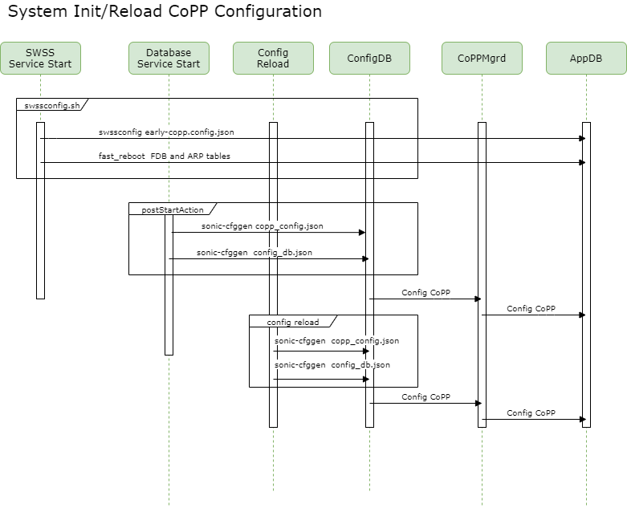
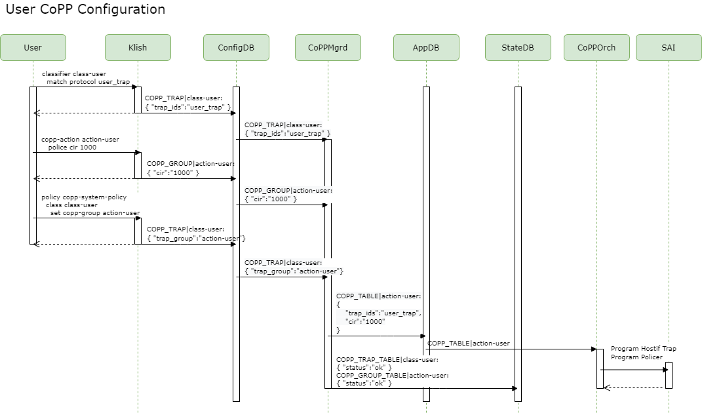

# SONiC Control Plane Policing
# High Level Design Document
#### Rev 0.1


# Table of Contents
  * [List of Tables](#list-of-tables)
  * [Revision](#revision)
  * [About This Manual](#about-this-manual)
  * [Scope](#scope)
  * [Definition/Abbreviation](#definitionabbreviation)
  * [1 Feature Overview](#1-feature-overview)
     * [1.1 Requirements](#11-requirements)
        *  [1.1.1 Functional Requirements](#111-functional-requirements)
        *  [1.1.2 Configuration and Management Requirements](#112-configuration-and-management-requirements)
        *  [1.1.3 Scalability Requirements](#113-scalability-requirements)
        *  [1.1.4 Warm Boot Requirements](#114-warm-boot-requirements)
      *  [1.2 Design Overview](#12-design-overview)
          * [1.2.1 Basic Approach](#121-basic-approach)
          * [1.2.2 Container](#122-container)
          * [1.2.3 SAI Overview](#123-sai-overview)
  * [2 Functionality](#2-functionality)
      * [2.1 Target Deployment Use Cases](#21-target-deployment-use-cases)
      * [2.2 Functional Description](#22-functional-description)
      * [2.3 Limitations](#23-limitations)
  * [3 Design](#3-design)
      * [3.1 Overview](#31-overview)
      * [3.2 DB Changes](#32-db-changes)
          * [3.2.1 CONFIG_DB](#321-config_db)
          * [3.2.2 APP_DB](#322-app_db)
          * [3.2.3 STATE_DB](#323-state_db)
          * [3.2.4 ASIC_DB](#324-asic_db)
          * [3.2.5 COUNTER_DB](#325-counter_db)
      * [3.3 Switch State Service Design](#33-switch-state-service-design)
      * [3.4 SAI](#34-sai)
      * [3.5 CLI](#35-cli)
          * [3.5.1 Data Models](#351-data-models)
          * [3.5.2 Configuration Commands](#352-configuration-commands)
          * [3.5.3 Show Commands](#353-show-commands)
          * [3.5.4 Clear Commands](#354-clear-commands)
          * [3.5.5 Debug Commands](#355-debug-commands)
          * [3.5.6 Rest API Support](#356-rest-api-support)
          * [3.5.7 Example Configuration](#357-example-configuration)          
  * [4 Flow Diagrams](#4-flow-diagrams)

  * [5 Error Handling](#5-error-handling)
  * [6 Serviceability and Debug](#6-serviceability-and-debug)
  * [7 Warm Boot Support](#7-warm-boot-support)
  * [8 Scalability](#8-scalability)
  * [9 Unit Test](#9-unit-test) 
     * [9.1 Config Test Cases](#91-config-test-cases)
     * [9.2 Functional Test Cases](#92-functional-test-cases)
     * [9.3 Scaling Test Cases](#93-scaling-test-cases)
     * [9.4 Warm Boot Test Cases](#94-warm-boot-test-cases)
     * [9.5 Negative Test Cases](#95-negative-test-cases)


# List of Tables
[Table 1: Abbreviations](#table-1-abbreviations)


# Revision
| Rev |     Date    |          Authors             | Change Description                |
|:---:|:-----------:|:----------------------------:|-----------------------------------|
| 0.1 | 04/20/2020  |  Michael Li, Aravindu Maneti | Initial version                   |


# About this Manual
This document provides general information about SONiC Control Plane Policing (CoPP) feature implementation in SONiC.
# Scope
This document describes the functionality and high level design of the Control Plane Policing (CoPP) feature in SONiC
with a focus on management and configuration CLIs.


# Definition/Abbreviation
### Table 1: Abbreviations
| Term   | Meaning                                                |
|--------|--------------------------------------------------------|
| QoS    | Quality of Service                                     |
| CoPP   | Control Plane Policing                                 |
| CIR    | Committed Information Rate                             |
| CBS    | Committed Burst Size                                   |
| PIR    | Peak Information Rate                                  |
| PBS    | Peak Burst Size                                        |
| CVL    | Configuration Validation Library                       |


# 1 Feature Overview
The Control Plane Policing (CoPP) feature allows management of the network traffic flow handled by the control plane CPU. CoPP is designed to protect the CPU from getting overwhelmed by a high rate of CPU bound traffic which can affect system performance, and also to define per-traffic type priorities and rate limits to ensure that the system can receive packets in an optimal manner. 

The switch creates a default "system CoPP policy" that is statically applied to the control plane to allow the configuration of trap IDs (traffic punted to CPU), CPU queue assignments, and policers to rate limit the traffic.
 
## 1.1 Requirements

### 1.1.1 Functional Requirements
 1. Support creation of multiple CoPP classifiers with protocol trap match types
 2. Support applying multiple CoPP classifiers to the system CoPP policy.
 3. Support configuration of CoPP policy actions such as assignment of the protocol trap to a specific CPU queue.
 4. Support addition and configuration of a policer to a CoPP policy flow to rate limit the bandwidth of each protocol trap matched by the classifier.

### 1.1.2 Configuration and Management Requirements
1. Provide commands to support configuration CoPP classifiers and application to the system CoPP policy.


### 1.1.3 Scalability Requirements
1. Support a CoPP classifier for each protocol trap supported by SONiC. This allows configuration of a separate policer with a unique rate limit value for each protocol trap. (Max scaling is detailed in scaling section)
2. Multiple CoPP classifiers can be assigned to the same CPU queue. The max number of CPU queues will be silicon specific.

### 1.1.4 Performance Requirements
1. The max aggregate packet rate should be tuned to protect the CPU from utilizing too much CPU bandwidth (<mark>**TODO: provide guidance on what is "too much CPU utilization"**</mark>)

### 1.1.5 Warm Boot Requirements
CoPP functionalities are not expected to work during warm reboot but will be restored after warm reboot. Traffic to CPU will get dropped when CPU is reset until SAI drivers have restored the CPU pkt path.

## 1.2 Design Overview

### 1.2.1 Basic Approach
The SONiC management framework provide CLIs and interfaces for users to create CoPP classifiers, apply them to the system CoPP policy, and modify the associated trap actions and policers.  A single system CoPP policy (which cannot be deleted) exists with a default configuration. The system CoPP policy is set in the SONiC CONFIG_DB COPP tables.

The CoPP manager daemon handles the CoPP policy that the management framework has set in the SONiC CONFIG_DB COPP_TABLE.  The CoPP mgmt daemon will apply each CONFIG_DB COPP_TABLE entry to the APP_DB COPP_TABLE.

The CoPP Orchestration agent handles changes to the APP_DB COPP_TABLE (existing functionality).  Each entry in the table provides configuration of several attributes such as:
- trap punt to the control plane CPU
- trap CPU queue assignment
- trap policer rate limiting

Multiple CoPP classifiers can be created and applied to the system CoPP policy. Multiple protocol trap matches can be configured in a single CoPP classifier but the default CoPP configuration (see creating CoPP classifiers section) assigns each SONiC trap to a separate CoPP classifier with a unique CPU queue and policer. This provides several benefits:
- Ability to dynamically change policer values without affecting other traps
- Separate each CPU traffic type to its own CPU queue
- Provides HW level CPU queue stats for each CPU traffic type

### 1.2.2 Container
CoPP manager and orchagent daemons reside in the SWSS container.

### 1.2.3 SAI Overview
Existing host interface and policer SAI APIs are used to support the CoPP feature:

https://github.com/opencomputeproject/SAI/blob/master/inc/saihostif.h<br>
https://github.com/opencomputeproject/SAI/blob/master/inc/saipolicer.h<br>


# 2 Functionality

## 2.1 Target Deployment Use Cases
See Feature Overview

## 2.2 Functional Description

See section 1.2.1

## 2.3 Limitations
1. Modifying CoPP classifier action attributes (ie queue, policer rates) causes service disruption to trap protocols assigned to the CoPP classifier (COPP_TABLE entry is deleted, then added)

# 3 Design
## 3.1 Overview
A new CoPP manager is introduced to handle CONFIG_DB changes (ie from SONiC mgmt). When protocol classifiers are applied to the system CoPP policy, the CoPP manager will propagate the config to APP_DB for consumption by CoPP orchagent to program the traps and policers in hardware.

## 3.2 DB Changes

### 3.2.1 CONFIG_DB
Two COPP tables with fields similar to the APP_DB COPP_TABLE table is introduced in CONFIG_DB to configure CoPP parameters.  In the rest of the document, the two tables will be referred to collectively as the CONFIG_DB COPP_TABLE.

#### 3.2.1.1 COPP_TRAP table
The COPP_TRAP table allows configuration of a CoPP trap's packet match conditions such as specific trap IDs and feature specific trap attributes.  A COPP_TRAP entry can reference a COPP_GROUP (trap_group field) that defines the actions taken when a packet hits the CoPP trap match condition.

```    
key           = "COPP_TRAP|name"
trap_ids      = name ; list of trap ids (ie: bgp, lacp, arp, etc)
trap_group    = ref_hash_key_reference ; reference to COPP_GROUP table entry

;Feature specific attributes (sFlow)
genetlink_name       = name      ; "psample" for sFlow 
genetlink_mcgrp_name = group_name; "packets" for sFlow 
```  
#### 3.2.1.1.1 Feature specific COPP_TRAP attributes 
Feature specific attributes (currently only genetlink parameters for sFlow) will be exposed in CONFIG_DB COPP_TRAP for schema backward compatibility but will not be configurable from mgmt and CLI.  The CoPPMgr daemon will be responsible for adding these attributes to the COPP_TRAP table when receiving feature specific trap_ids such as "sflow".

#### 3.2.1.2 COPP_GROUP
The COPP_GROUP table allows configuration of the CoPP trap's action attributes such as queue mappings, packet action, and policer attributes.
```
key           = "COPP_GROUP:name"
queue         = number       ; CPU queue
trap_action   = packet_action; trap, drop, copy (see packet_action_map)
trap_priority = priority of trap when packet has multiple matches

; settings for the embedded policer
meter_type    = "packets" | "bytes"
mode          = "sr_tcm" | "tr_tcm" | "storm"
color         = "aware" | "blind" 
green_action  = packet_action
yellow_action = packet_action
red_action    = packet_action
cir           = number       ; guaranteed rate in pps or bytes/sec
cbs           = number       ; guaranteed burst size in packets or bytes
pir           = number       ; max rate in pps or bytes/sec
pbs           = number       ; max burst size in packets or bytes
```

### 3.2.2 APP_DB

#### 3.2.2.1 COPP_TABLE
No changes are introduced in "COPP_TABLE" in APP_DB (allows backward compatibility).

    key = "COPP_TABLE:name"
    name_list     = name | name,name_list
    queue         = number; strict queue priority. Higher number means higher priority.
    trap_ids      = name_list; Acceptable values: bgp, lacp, arp, lldp, snmp, ssh, ttl error, ip2me
    trap_action   = packet_action; trap action which will be applied to all trap_ids.

    ;Settings for embedded policer. NOTE - if no policer settings are specified, then no policer is created.
    meter_type  = "packets" | "bytes"
    mode        = "sr_tcm" | "tr_tcm" | "storm"
    color        = "aware" | "blind"
    cbs         = number ;packets or bytes depending on the meter_type value
    cir         = number ;packets or bytes depending on the meter_type value
    pbs         = number ;packets or bytes depending on the meter_type value
    pir         = number ;packets or bytes depending on the meter_type value
    green_action   = packet_action
    yellow_action  = packet_action
    red_action     = packet_action

    ;Feature specific attributes (sFlow)
    genetlink_name       = name      ; "psample" for sFlow 
    genetlink_mcgrp_name = group_name; "packets" for sFlow 

### 3.2.3 STATE_DB
COPP_TRAP_TABLE and COPP_GROUP_TABLE are introduced in STATE_DB to set the entry state. Feature driven COPP config could delay COPP processing until the feature is enabled.  This allows applications to check the state of COPP entry processing.

```
key = "COPP_GROUP_TABLE|name"
state        = "ok"

key = "COPP_TRAP_TABLE|name"
state        = "ok"
```

### 3.2.4 ASIC_DB
No changes are introduced in ASIC_DB. 
### 3.2.5 COUNTER_DB
No changes are introduced in COUNTER_DB. 

See the "show queue counter" in the CLI section on the usage monitor CPU queue counters.

## 3.3 Switch State Service Design
### 3.3.1 CoPPMgr 
Introduce a new CoPP manager, that subscribes for the CONFIG_DB CoPP Tables and Feature Tables. Based on the feature enablement, CoPPMgr handles the logic to resolve whether a CoPP table entry shall be written to APP_DB for orchagent consumption. Similar to existing swss managers, an entry with state "ok" shall be added to STATE_DB.

Copp Manager daemon is responsible for the following activities:
- Subscribes to COPP_TABLE notifications and FEATURE table notifications in CONFIG_DB. 
- Backend checks on syntax and field validations for COPP_TABLE in CONFIG_DB.
- Copy the COPP_TABLE entries from CONFIG_DB to APP_DB.  After the entry is copied to APP_DB, set the STATE_DB COPP_TABLE state attribute to "ok".
- When an entry is removed from the CONFIG_DB COPP_TABLE, remove the associated CoPP entry in the APP_DB and STATE_DB. 


### 3.3.2 CoPPOrch
CoPPOrch shall only be a consumer of APP DB CoPP Table. It is not expected to handle feature logic and the current handling of features like sFlow, NAT shall be revisited and removed to be added as part of CoPPMgr

CoPP Orchestration agent is responsible for the following activities:
   - Subscribes to notifications on COPP_TABLE in APP_DB.
   - Calls hostif SAI APIs to create host interface traps with parameters from COPP_TABLE entries 
   - Calls policer SAI APIs to create policers with parameters from COPP_TABLE entries


### 3.3.3 Default CoPP Tables
The default CoPP configuration is stored in JSON files that are loaded by the swssconfig utility when the swssconfig init bash script is started by the system supervisord daemon during bootup.

The [swssconfig.sh script](https://github.com/Azure/sonic-buildimage/blob/master/dockers/docker-orchagent/swssconfig.sh) and [swssconfig utility](https://github.com/Azure/sonic-swss/blob/master/swssconfig/swssconfig.cpp) loads the following CoPP related JSON files from the default SWSS_CONFIG_DIR directory in the swss docker into the APP_DB (bypasses CONFIG_DB).

    /etc/swss/config.d/early-copp.config.json
    /etc/swss/config.d/00-copp.config.json

The 00-copp.config.json file (located at swssconfig/sample/00-copp.config.json) shall be modified to be compatible to CONFIG_DB schema (remove "OP" attributes used by `swssconfig` utility).  Instead of using the `swssconfig` utility to load the CoPP file directly into APP_DB, the `swssconfig.sh` script will be modified to use `sonic-cfggen` script to load the CoPP JSON file to CONFIG_DB.

```
sonic-cfggen -j /etc/swss/config.d/00-copp.config.json --write-to-db
```

The swssconfig.sh script loads the default configuration to CONFIG_DB. Some time later, the function postStartAction() in the docker control script (docker_image_ctl.j2) loads the config_db.json. Any user defined CoPP configuration will overwrite the defaults loaded by the swssconfig.sh script earlier.

```
    function postStartAction()
        ...
        if [ -r /etc/sonic/config_db.json ]; then
            sonic-cfggen -j /etc/sonic/config_db.json --write-to-db
        fi
```
To handle potential merge conflicts when adding user defined CoPP configuration over the default CoPP configuration, the following limitations are imposed:
* The system CoPP classifiers cannot be deleted but the match conditions can be modified. Changes to the system CoPP classifiers is a modify operation on an existing COPP_TABLE entry.
* A protocol trap may only be added to a single CoPP classifier. This prevents a trap from being in both default and user defined CoPP configurations.

### 3.3.3 Early CoPP Config JSON file
To address an issue with CoPP config JSON file processing delayed during fast_reboot processing of a scaled number of entries in FDB and ARP tables, an "early CoPP" JSON file is introduced to process traps before loading FDB and ARP tables. The early CoPP JSON file will be loaded directly to APP_DB.  

The same early CoPP entries will be loaded in CONFIG_DB later as well in postStartAction().  CoPPMgrd will prevent writing to APP_DB when there are no changes between CONFIG_DB and APP_DB entries.

`/sonic-buildimage/dockers/docker-orchagent/swssconfig.sh`
```
# Early COPP processing
SWSSCONFIG_EARLY_COPP="early-copp.config.json"
if [[ -f /etc/swss/config.d/$SWSSCONFIG_EARLY_COPP ]]; then
    echo "Early COPP processing"
    swssconfig /etc/swss/config.d/$SWSSCONFIG_EARLY_COPP
    sleep 1
fi

# Restore FDB and ARP table ASAP
fast_reboot
```

## 3.4 SAI
No new SAI changes have been made to support this feature.  The SAI attributes have been added here for reference.

###### Table 2: Host Interface Group SAI attributes
| HostIF Group parameter   | SAI attributes                                         | 
|--------------------------|--------------------------------------------------------|
| CPU Queue                | SAI_HOSTIF_TRAP_GROUP_ATTR_QUEUE                       |
| Trap Action              | SAI_HOSTIF_TRAP_GROUP_ATTR_PACKET_ACTION               |
| Trap Priority            | SAI_HOSTIF_TRAP_GROUP_ATTR_TRAP_PRIORITY               |
| Policer ID               | SAI_HOSTIF_TRAP_GROUP_ATTR_POLICER                     |

###### Table 3: Host Interface trap SAI attributes
| Trap parameter           | SAI attributes                                         | 
|--------------------------|--------------------------------------------------------|
| Type                     | SAI_HOSTIF_ATTR_TYPE                                   |
| Name                     | SAI_HOSTIF_ATTR_NAME                                   |
| Generic Netlink Name     | SAI_HOSTIF_ATTR_GENETLINK_MCGRP_NAME                   |
| Name                     | SAI_HOSTIF_TRAP_NAME                                   |

###### Table 4: Policer SAI attributes
| Policer parameters         | SAI attributes                                       | 
|----------------------------|------------------------------------------------------|
| Meter type                 | SAI_POLICER_ATTR_METER_TYPE                          |
| Mode                       | SAI_POLICER_ATTR_MODE                                |
| CIR                        | SAI_POLICER_ATTR_CIR                                 |
| CBS                        | SAI_POLICER_ATTR_CBS                                 |
| PIR                        | SAI_POLICER_ATTR_PIR                                 |
| PBS                        | SAI_POLICER_ATTR_PBS                                 |
| PBS                        | SAI_POLICER_ATTR_PBS                                 |
| Color                      | SAI_POLICER_ATTR_COLOR_SOURCE                        |
| Green action               | SAI_POLICER_ATTR_GREEN_PACKET_ACTION                 |
| Yellow action              | SAI_POLICER_ATTR_YELLOW_PACKET_ACTION                |
| Red action                 | SAI_POLICER_ATTR_RED_PACKET_ACTION                   |


## 3.5 Manageability

### 3.5.1 Data Models
The user facing COPP data model will build on top of the SONiC ACL flow based management models (based on OpenConfig ACL YANG model).

The backend data model (SONiC YANG) will use the COPP_TABLE format in CONFIG_DB. See CONFIG_DB changes section.

### 3.5.2 Configuration Commands

The following KLISH CLI commands are used to configure CoPP policies.   The CLI syntax follows the SONiC ACL flow based management (based on OpenConfig YANG model) and is also follows industry-standard CLIs</br>

#### 3.5.2.1 Creating CoPP Classifers

| Mode | Config |
| ---- | --------------------------------------------------- |
| Syntax         | sonic(config)# [**no**] **classifier** *NAME* **match-type** **copp**  ||
| Arguments      | ***NAME***: String of 1-63 characters in length. Must begin with a alpha numeric character. Rest of the characters can be alpha numeric or hyphen (-) or underscore (\_). |

The CoPP classifier name maps directly to a COPP_TRAP entry key in the CONFIG_DB. For example:
```
sonic(config)# classifier copp-system-arp match-type copp

CONFIG_DB:
{
    "COPP_TRAP:copp-system-arp": {
        ...
    },
},
```
Table 1 shows a list of CoPP classifiers created by the system and the default CoPP policy configuration.  

The scaling notes provide hints on the derivation of default rate limits. Latency sensitive protocols are set to higher rates.  Rates are subject to change based on performance and system testing.

**NOTE**: The system CoPP classifiers cannot be deleted but the match conditions can be modified. User created CoPP classifiers can be deleted.

**Table 1: Default system classifiers in CoPP policy**

| Classifier           | Queue |  Rate (PPS)  | Protocols | Scaling Notes 
|----------------------|-------|--------------|-----------|------
| copp-system-lacp     | 25    |  1000        | lacp      | 1 sec timer/port 
| copp-system-udld     | 24    |  1000        | udld      | 1 sec timer/port
| copp-system-stp      | 23    |  16000       | stp,pvrst | 16K port-vlan instances
| copp-system-bfd      | 22    |  5000        | bfd,bfdv6 | 64x100ms sessions
| copp-system-ptp      | 21    |  16000       | ptp       | 16pps/port max
| copp-system-lldp     | 20    |  1000        | lldp      | 5 sec/port min
| copp-system-vrrp     | 19    |  5000        | vrrp,vrrpv6 |
| copp-system-iccp     | 18    |  5000        | iccp      | 
| copp-system-ospf     | 17    |  10000       | ospf      | 
| copp-system-bgp      | 16    |  10000       | bgp,bgpv6 | minimize convergence of high scale routes
| copp-system-pim      | 15    |  10000       | pim       |
| copp-system-igmp     | 14    |  6000        | igmp_query| 
| reserved             | 13    |  N/A         |           |
| reserved             | 12    |  N/A         |           |
| copp-system-suppress | 11    |  5000        | arp_suppress,nd_suppress |
| copp-system-arp      | 10    |  6000        | arp_req,arp_resp,neigh_discovery | L3 perf tests
| copp-system-dhcp     | 9     |  1000        | dhcp,dhcpv6 |
| copp-system-icmp     | 8     |  1000        | icmp,icmpv6 |
| copp-system-ip2me    | 7     |  6000        | ip2me       | L3 perf, ZTP inband downloads
| copp-system-subnet   | 6     |  6000        | subnet      | L3 perf tests
| copp-system-nat      | 5     |  600         | src_nat_miss,dest_nat_miss | limit exception case
| copp-system-mtu      | 4     |  500         | l3_mtu_error | limit exception case
| copp-system-sflow    | 3     |  16000       | sample_packet | detect large flows within 1 sec
| reserved             | 2     |  N/A         |
| reserved             | 1     |  N/A         |
| copp-system-default  | 0     |  100         | any


#### 3.5.2.2 Adding match protocol traps to the CoPP Classifers
| Mode   | Classifier|
| ------ | ----------------------------------------------------------- |
| Syntax | SONiC(config-classifier)# [**no**] **match protocol** *TRAP_ID* |
| Arguments | ***TRAP_ID***: See [trap_id_map](https://github.com/Azure/sonic-swss/blob/cdffff315f10f79d4f68668540cb80c32d84c9ea/orchagent/copporch.cpp#L39) and user_trap_id_map for valid values. Some examples include arp, bgp, lacp, lldp, ip2me.  This is a mandatory field.

**Note**: Modifying match conditions while the CoPP classifier is assigned to the system CoPP policy will cause service disruption to all traps assigned to the CoPP classifier (The COPP_TABLE entry will be removed, modified, and added back to APP_DB) 

**Note**: A protocol trap ID may only be added to a single CoPP classifier <mark>**(TODO: custom CVL logic to check this? or release note as invalid configuration).**</mark>

Example config and corresponding entry written into the COPP_TRAP in CONFIG_DB
```
sonic(config)# classifier copp-system-arp match-type copp
sonic(config-classifier)# match protocol arp_req
sonic(config-classifier)# match protocol arp_resp
sonic(config-classifier)# match protocol neigh_discovery

CONFIG_DB:
{
    "COPP_TRAP:copp-system-arp": {
        "trap_ids": "arp_req,arp_resp,neigh_discovery",
        ...
},
```

#### 3.5.2.3 Creating the CoPP Action Group

| Mode | Config |
| ---- | --------------------------------------------------- |
| Syntax         | sonic(config)# [**no**] **copp-action** *NAME* |
| Arguments      | ***NAME***: String of 1-63 characters in length. Must begin with a alpha numeric character. Rest of the characters can be alpha numeric or hyphen (-) or underscore (\_). |

The CoPP action group name maps directly to a COPP_GROUP entry key in the CONFIG_DB. For example:
```
sonic(config)# copp-action copp-system-arp

CONFIG_DB:
{
    "COPP_GROUP:copp-system-arp": {
        ...
    },
},
```
**NOTE**:  A default CoPP action group called "default" is created by the system and cannot be removed. This is used for the default CoPP action for unclassified traffic. The default CoPP action config is shown below.

```
"COPP_GROUP|default": {
    "queue": "0",
    "meter_type":"packets",
    "mode":"sr_tcm",
    "cir":"100",
    "cbs":"100",
    "red_action":"drop"
},

```

#### 3.5.2.3.1 Configuring the CoPP trap action
Optional configuration. Default trap action is "trap".

| Mode        | action 
|-------------|------------------------------------------------------
| Syntax      | sonic(config-action)# [**no**] **set trap-action** *TRAP_ACTION*
| Arguments   | ***TRAP_ACTION***: See [packet_action_map](https://github.com/Azure/sonic-swss/blob/cdffff315f10f79d4f68668540cb80c32d84c9ea/orchagent/copporch.cpp#L81): drop, forward, copy, copy_cancel, trap, log, deny, transit.

The packet action maps directly to SAI Host interface packet action types. The [SAI switch packet action type](https://github.com/opencomputeproject/SAI/blob/befd00861459e343990a1e8b2acd8edc6be20b4f/inc/saiswitch.h#L68) describes the behavior of each action.

#### 3.5.2.3.2 Configuring the CoPP trap action priority
Optional configuration. Default is same as CPU queue value.
| Mode   | Policy
| ------ | ------ |
| Syntax | SONiC(config-policy)# [**no**] **set trap-priority** *PRIORITY* |
| Arguments | ***PRIORITY***: Priority number in range 0-1023.  The trap_priority refers to the priority of a classifier rule when a packet has multiple matches. |

#### 3.5.2.3.3 Configuring the CoPP action CPU queue
Optional configuration. Default CPU queue is 0.

| Mode        | action 
|-------------|------------------------------------------------------
| Syntax      | sonic(config-action)# [**no**] **set trap-queue** *QUEUE_ID*
| Arguments   | ***QUEUE_ID***: CPU queue value in range of 0-47.

#### 3.5.2.3.4 Configuring the CoPP action policer
Optional configuration.  No policer means no rate limit for this CoPP class flow.

| Mode        | action 
|-------------|------------------------------------------------------
| Syntax      | sonic(config-action)#  [**no**] **police** **cir** *CIR* [**cbs** *CBS*] [**pir** *PIR*] [**pbs** *PBS*] |
| Arguments   | ***CIR***: Committed information rate in bps or pps (packets per second) depending on meter-type. CIR is mandatory.<br/>***CBS***: Committed burst size in packets or bytes. The default value is 20% of the CIR. If configured by the user, it must be greater than or equal to CIR in packets or bytes.<br/>***PIR***: Peak information rate in bps or pps. If configured by the user, it must be greater than CIR.<br/>***PBS***: Peak burst size. The default value is 20% of the PIR value. If configured by the user, it must be greater than PIR and CBS value.|

#### 3.5.2.3.5 Configuring the CoPP action policer meter type
Optional configuration with defaults specified in the table.

| Mode        | action 
|-------------|------------------------------------------------------
| Syntax      | sonic(config-action)# [**no**] **police** [**meter-type** <**pps** \| **bps**>]
| Arguments   | ***pps*** (default): packets per second<br/>***bps***: bits per second

#### 3.5.2.3.6 Configuring the CoPP action policer mode
Optional configuration with defaults specified in the table.

| Mode        | action 
|-------------|------------------------------------------------------
| Syntax      | sonic(config-action)# [**no**] **police** [**mode** <**sr_tcm** \| **tr_tcm** \| **storm**> [**green** *TRAP_ACTION*] [**yellow** *TRAP_ACTION*] **red** *TRAP_ACTION*]
| Arguments   | ***sr_tcm*** (default): Single Rate Three color marker, CIR, CBS and PBS, G, Y and R<br/>***tr_tcm***: Two Rate Three color marker, CIR, CBS, PIR and PBS, G, Y and R<br/>***storm***: Storm control mode. Single Rate Two color CIR, CBS, G and R<br/>***TRAP_ACTION***: See [packet_action_map](http://10.59.132.240:8010/sonic_3.x/xref/sonic-swss/orchagent/copporch.cpp#92): drop, forward, copy, copy_cancel, trap, log, deny, transit.</br>Default green trap-action is "trap".</br>Default yellow trap-action is "trap".</br>Default red trap-action is "drop".


#### 3.5.2.4 Editing the CoPP Policy

| Mode        | Config 
|-------------|------------------------------------------------------
| Syntax      | sonic(config)# **policy** **copp-system-policy** **type** **copp**
| Arguments   | ***copp-system-policy***: Control Plane CoPP policy

The only control plane policy is **copp-system-policy**, which cannot be deleted. The default **copp-system-policy** consists of the system classifers listed in table 1.


#### 3.5.2.5 Adding a CoPP classifier to the CoPP Policy
| Mode   | Policy
| ------ | ------ |
| Syntax | SONiC(config-policy)# [**no**] **class** *NAME* |
| Arguments | ***NAME***: CoPP Classifier name. String of 1-63 characters in length. Must begin with a alpha numeric character. Rest of the characters can be alpha numeric or hyphen (-) or underscore (\_).|

**NOTE**: The copp-system-default classifier (unclassified CPU traffic) always exists in the system CoPP policy and cannot be removed from the copp-system-policy.

#### 3.5.2.6 Binding a CoPP action to the CoPP classifier
Binds CoPP action group to a classifier match group. CoPP action is mandatory when adding a CoPP classifier to the CoPP policy. 
| Mode   | Flow
| ------ | ------ |
| Syntax | SONiC(config-policy-flow)# **set copp-action** *NAME* |
| Arguments | ***NAME***: CoPP Action group name. String of 1-63 characters in length. Must begin with a alpha numeric character. Rest of the characters can be alpha numeric or hyphen (-) or underscore (\_).|

This CLI triggers the CoPPMgrd to act on processing the COPP_TRAP and COPP_GROUP entries in CONFIG_DB and add/merge them to the corresponding COPP_TABLE in APP_DB.

* Search for the COPP_GROUP name in the APP_DB COPP_TABLE and create the entry if it doesn't exist.  Add the COPP_GROUP parameters to the COPP_TABLE.
* Add the traps from the COPP_TRAP table to the APP_DB COPP_TABLE trap_list if they don't already exist in the APP_DB COPP_TABLE trap_list.

An example configuration is below:
```
sonic(config)# policy copp-system-policy type copp
sonic(config-policy)# class copp-system-arp
sonic(config-policy-flow)# set copp-action copp-system-arp

CONFIG_DB:
{
    ...
    "COPP_TRAP:copp-system-arp": {
        ...
        "trap_group": "copp-system-arp"
    },
    ...
},
```

#### 3.5.2.7 CoPP Policy Binding
The **copp-system-policy** policy map is always applied to the CPU control plane. No commands are available to add or remove this assignment.

#### 3.5.2.8 CoPP Configuration Examples

##### 3.5.2.8.1 Configuring ARP related CoPP classifier

```
sonic(config)# classifier copp-system-arp match-type copp
sonic(config-classifier)# match protocol arp_req
sonic(config-classifier)# match protocol arp_resp
sonic(config-classifier)# match protocol neigh_discovery
sonic(config-classifier)# exit

CONFIG_DB:
{
    ...
    "COPP_TRAP:copp-system-arp": {
        "trap_ids": "arp_req,arp_resp,neigh_discovery"
    },
    ...
},
```
##### 3.5.2.8.2  Configuring ARP related CoPP actions

```
sonic(config)# copp-action copp-system-arp
sonic(config-action)# set trap-action copy
sonic(config-action)# set trap-priority 3  
sonic(config-action)# set trap-queue 3 
sonic(config-action)# police meter-type pps 
sonic(config-action)# police mode sr_tcm red drop
sonic(config-action)# police cir 6000 cbs 6000
sonic(config-action)# exit

CONFIG_DB:
{
    ...
    "COPP_GROUP:copp-system-arp": {
        "trap_action":"copy",
        "trap_priority":"3",
        "queue": "3",
        "meter_type":"packets",
        "mode":"sr_tcm",
        "cir":"6000",
        "cbs":"6000",
        "red_action":"drop"
    },
    ...
},
```

##### 3.5.2.8.3  Binding ARP classifier and action to CoPP system policy
```
sonic(config)# policy copp-system-policy type copp
sonic(config-policy)# class copp-system-arp
sonic(config-policy-flow)# set copp-action copp-system-arp
sonic(config-policy-flow)# exit

CONFIG_DB:
{
    ...
    "COPP_TRAP:copp-system-arp": {
        "trap_ids": "arp_req,arp_resp,neigh_discovery",
        "trap_group": "copp-system-arp"
    },
    ...
},
```

### 3.5.3 Show Commands

#### 3.5.3.1 show CoPP classifiers
Dumps the configured CoPP classifiers
- Example:
```
sonic# show classifier match-type copp
Classifier copp-system-bgp match-type copp
  protocol bgp
  protocol bgpv6
Classifier copp-system-arp match-type copp
  protocol arp_req
  protocol arp_resp
  protocol neigh_discovery
...
```
An alternate non-ISCLI version of the command keeps all COPP related show commands under "show copp ..."
```
sonic# show copp classifiers
```

#### 3.5.3.2 show CoPP protocols
Dumps a list of supported CoPP classifier protocol trap IDs
- Example:
```
sonic# show copp protocols
Classifier match-type copp protocols
  protocol bgp
  protocol bgpv6
  protocol arp_req
  protocol arp_resp
  protocol neigh_discovery
...
```
#### 3.5.3.1 show CoPP action groups
Dumps the configured CoPP action groups
- Example:
```
sonic# show copp actions
CoPP action group copp-system-bgp
  trap-action trap
  trap-priority 5
  trap-queue 5
  police cir 10000 cbs 10000
    meter-type: packets
    mode: sr_tcm
    red-action: drop
CoPP action group copp-system-arp
  trap-action: trap
  trap-priority: 4
  trap-queue: 4
  police cir 6000 cbs 6000
    meter-type: packets
    mode: sr_tcm
    red-action: drop
...
```
#### 3.5.3.3 show CoPP policy
Dumps the CoPP policy **copp-system-policy**.
```
sonic# show policy type copp
Policy copp-system-policy Type copp
  Flow copp-system-bgp
    Action copp-system-bgp
      trap-action trap
      trap-priority 5
      trap-queue 5
      police cir 10000 cbs 10000
        meter-type: packets
        mode: sr_tcm
        red-action: drop    
  Flow copp-system-arp
    Action copp-system-arp
      trap-action: trap
      trap-priority: 4
      trap-queue: 4
      police cir 6000 cbs 6000
        meter-type: packets
        mode: sr_tcm
        red-action: drop    
 ...   
```
An alternate non-ISCLI version of the command keeps all COPP related show commands under "show copp ..."
```
sonic# show copp policy 
```
##### 3.5.3.4.1 Trap statistics enhancement
In a future enhancement, add policer statistics to each classifier flow output. 


#### 3.5.3.5 show queue counters CPU
Show queue counters CLI can be used to monitor CPU queuing and trap policing functions.
- Usage:
```
  show queue counters CPU [queue <qid>]
```
- Example:
```
sonic# show queue counters CPU
  Port    TxQ    Counter/pkts    Counter/bytes    Drop/pkts    Drop/bytes
------  -----  --------------  ---------------  -----------  ------------
   CPU    MC0               0                0            0             0
   CPU    MC1               0                0            0             0
   CPU    MC2               0                0            0             0
   CPU    MC3               0                0            0             0
   CPU    MC4               0                0            0             0
   CPU    MC5               0                0            0             0
   CPU    MC6               0                0            0             0
   CPU    MC7               0                0            0             0
   CPU    MC8               0                0            0             0
   CPU    MC9               0                0            0             0
   CPU   MC10               0                0            0             0
   CPU   MC11               0                0            0             0
   CPU   MC12               0                0            0             0
   CPU   MC13               0                0            0             0
   CPU   MC14               0                0            0             0
   CPU   MC15               0                0            0             0
   CPU   MC16               0                0            0             0
   CPU   MC17               0                0            0             0
   CPU   MC18               0                0            0             0
   CPU   MC19               0                0            0             0
   CPU   MC20               0                0            0             0
   CPU   MC21               0                0            0             0
   CPU   MC22               0                0            0             0
   CPU   MC23               0                0            0             0
   CPU   MC24               0                0            0             0
   CPU   MC25               0                0            0             0
   CPU   MC26               0                0            0             0
   CPU   MC27               0                0            0             0
   CPU   MC28               0                0            0             0
   CPU   MC29               0                0            0             0
   CPU   MC30               0                0            0             0
   CPU   MC31               0                0            0             0
   CPU   MC32               0                0            0             0
   CPU   MC33               0                0            0             0
   CPU   MC34               0                0            0             0
   CPU   MC35               0                0            0             0
   CPU   MC36               0                0            0             0
   CPU   MC37               0                0            0             0
   CPU   MC38               0                0            0             0
   CPU   MC39               0                0            0             0
   CPU   MC40               0                0            0             0
   CPU   MC41               0                0            0             0
   CPU   MC42               0                0            0             0
   CPU   MC43               0                0            0             0
   CPU   MC44               0                0            0             0
   CPU   MC45               0                0            0             0
   CPU   MC46               0                0            0             0
   CPU   MC47               0                0            0             0
```  
#### 3.5.3.6 show running-config copp
Dumps the CoPP running configuration
```
sonic# show running-config copp
!
copp-action copp-system-bgp
  set trap-action trap
  set trap-queue 5
  police meter-type pps
  police mode sr_tcm red drop
  police cir 10000 cbs 10000
!
copp-action copp-system-arp
  set trap-action copy
  set trap-queue 3
  police meter-type pps
  police mode sr_tcm red drop
  police cir 6000 cbs 6000
!
policy copp-system-policy type copp
  class copp-system-bgp
    copp-action copp-system-bgp
  class copp-system-arp
    copp-action copp-system-arp
 ...   
```

###  3.5.4 Clear Commands
- Usage:
```
  clear queue counters CPU [queue <qid>]
```

#### 3.5.5 IS-CLI Compliance
The following table maps SONIC CLI commands to corresponding IS-CLI commands. The compliance column identifies how the command comply to the IS-CLI syntax:
- **IS-CLI drop-in replace** ? meaning that it follows exactly the format of a pre-existing IS-CLI command.
- **IS-CLI-like** ? meaning that the exact format of the IS-CLI command could not be followed, but the command is similar to other commands for IS-CLI (e.g. IS-CLI may not offer the exact option, but the command can be positioned is a similar manner as others for the related feature).
- **SONIC** - meaning that no IS-CLI-like command could be found, so the command is derived specifically for SONIC.


| CLI Command   | Compliance  |          IS-CLI Command<br>(if applicable)           | Reference to IS-CLI cmd<br>(if applicable) |
| -------------- | --------- | ----------------------------------------------- | ------------------------------------------------------------ |
| **classifier** *NAME* **match-type** **copp** | IS-CLI-like | **class-map type copp match-any** *NAME*  | [Control Plane Config](https://www.arista.com/en/um-eos/eos-section-30-7-traffic-management-configuration-commands#ww1154073) |
| **match protocol** *TRAP_ID* | IS-CLI-like | **match protocol** *TRAP_ID* | [Control Plane Config](https://www.cisco.com/c/en/us/td/docs/ios-xml/ios/qos_plcshp/configuration/15-mt/qos-plcshp-15-mt-book/qos-plcshp-cpp.html) |
| **policy** **copp-system-policy** **type** **copp** | IS-CLI-like | **policy-map type copp** **copp-system-policy** | [Control Plane Config](https://www.arista.com/en/um-eos/eos-section-30-7-traffic-management-configuration-commands) |
| **class** *NAME*  | IS-CLI-like | **class** *NAME* | [Control Plane Config](https://www.arista.com/en/um-eos/eos-section-30-7-traffic-management-configuration-commands) |
| **copp-action** *NAME* | SONiC | N/A | N/A |
| **set trap-action** *TRAP_ACTION* | SONIC | N/A | N/A |
| **set trap-queue** *QUEUE_ID*  | IS-CLI-like | **set traffic class** *QUEUE_ID* | [Control Plane Config](https://www.arista.com/en/um-eos/eos-section-30-7-traffic-management-configuration-commands) |
| **police** **cir** *CIR* [**cbs** *CBS*] [**pir** *PIR*] [**pbs** *PBS*]  | IS-CLI-like | **police** **cir** *CIR* [**cb** *CBS*]  | [Control Plane Config](https://www.cisco.com/c/en/us/td/docs/switches/datacenter/nexus9000/sw/6-x/security/configuration/guide/b_Cisco_Nexus_9000_Series_NX-OS_Security_Configuration_Guide/b_Cisco_Nexus_9000_Series_NX-OS_Security_Configuration_Guide_chapter_010001.html#task_1082584) |
| **police** [**meter-type** <**pps** \| **bps**>]  | IS-CLI-like |  **police** **cir** [**pps\|kbps**] *CIR* [**cb** *CBS*]  | [Control Plane Config](https://www.cisco.com/c/en/us/td/docs/switches/datacenter/nexus9000/sw/6-x/security/configuration/guide/b_Cisco_Nexus_9000_Series_NX-OS_Security_Configuration_Guide/b_Cisco_Nexus_9000_Series_NX-OS_Security_Configuration_Guide_chapter_010001.html#task_1082584)  |
| **police** [**mode** <**sr_tcm** \| **tr_tcm** \| **storm**> [**green** *TRAP_ACTION*] [**yellow** *TRAP_ACTION*] **red** *TRAP_ACTION*] | IS-CLI-like | N/A | N/A  
| show classifier match-type copp | IS-CLI-like | show class-map type control-plane *NAME* | [Control Plane Config](https://www.cisco.com/c/en/us/td/docs/switches/datacenter/nexus9000/sw/6-x/security/configuration/guide/b_Cisco_Nexus_9000_Series_NX-OS_Security_Configuration_Guide/b_Cisco_Nexus_9000_Series_NX-OS_Security_Configuration_Guide_chapter_010001.html#task_1082584) |
| show copp protocols | SONIC | N/A | N/A  |
| show copp actions | SONIC | N/A | N/A  |
| show policy type copp | IS-CLI-like | show policy-map copp copp-system-policy | [Control Plane Config](https://www.cisco.com/c/en/us/td/docs/switches/datacenter/nexus9000/sw/6-x/security/configuration/guide/b_Cisco_Nexus_9000_Series_NX-OS_Security_Configuration_Guide/b_Cisco_Nexus_9000_Series_NX-OS_Security_Configuration_Guide_chapter_010001.html#task_1082584)  |
| show queue counters CPU [queue <qid>] | IS-CLI-like | show policy-map copp copp-system-policy | [Control Plane Config](https://www.arista.com/en/um-eos/eos-section-30-7-traffic-management-configuration-commands) |
| clear queue counters CPU [queue <qid>]  | IS-CLI-like | clear policy-map interface control-plane counters copp-system-policy | [Control Plane Config](https://www.arista.com/en/um-eos/eos-section-30-7-traffic-management-configuration-commands)            

### 3.5.5 Restrictions
* A protocol trap may only be added to a single CoPP classifier. Adding traps to multiple CoPP classifiers that are added to the CoPP policy is user error.

### 3.5.5 Debug Commands
Not applicable
### 3.5.6 REST API Support
The COPP data model will build on top of the SONiC ACL flow based management models (based on OpenConfig ACL YANG model).

### 3.5.7 Example Configuration 

# 4 Flow Diagrams

## 4.1 Initial Config
The following flow captures scenarios for ```boot-up``` sequence and ```config reload```. Default CoPP Tables shall be present in ```00-copp.config.json``` and if the same entry is present in ```config_db.json```, it is expected to be overwritten by ```config_db``` entry. This model ensures user-configuration gets priority over default configuration.



## 4.2 CoPP Manager flow
The following flow captures CoPP management functionality. 




Corresponding CLI:
```
sonic(config)# classifier class-user match-type copp
sonic(config-classifier)# match protocol user_trap
sonic(config-classifier)# exit

sonic(config)# copp-action action-user
sonic(config-action)# set trap-queue 1 
sonic(config-action)# police cir 1000
sonic(config-action)# exit

sonic(config)# policy copp-system-policy type copp
sonic(config-policy)# class class-user
sonic(config-policy-flow)# set copp-action action-user
sonic(config-policy-flow)# exit
```

## 4.3 Feature Driven CoPP Config flow
The following flow captures CoPP manager functionality. 


# 5 Error Handling
- Invalid config errors will be displayed via console and configuration will be rejected
- Internal processing errors within SwSS will be logged in syslog with ERROR level
- SAI interaction errors will be logged in syslog

# 6 Serviceability and Debug
Debug output will be captured as part of tech support.
- Internal processing errors within SwSS will be logged in syslog with ERROR level
- SAI interaction errors will be logged in syslog

CoPPMgr daemon restartability will be added in SWSS docker.

# 7 Warm Boot Support
CoPP functionalities are not expected to work during warm reboot but will be restored after warm reboot. Traffic to CPU will get dropped when CPU is reset until SAI drivers have restored the CPU pkt path.


# 8 Scalability
- Limit CoPP classifiers to 64
- Minimum number of CoPP policers supported must be equal to max number of CoPP protocol traps supported in SONiC
- Max number of CPU queues is ASIC specific


# 9 Unit Test

## 9.1 Config Test Cases
1. Verify creating CoPP classifier 
2. Verify deleting a CoPP classifier
3. Verify adding one (or) more than one match protocol_traps to a CoPP classifier
4. Verify removing match protocol_traps from a CoPP classifier
5. Verify creating CoPP action group
6. Verify deleting CoPP action group
7. Verify adding CoPP action attributes(trap_action, queue, policer)
8. Verify modifying CoPP action policer attributes
9. Verify adding classifier and binding CoPP action to CoPP policy
10. Verify deleting classifier from CoPP policy
11. Verify modifying CoPP action policer attributes when bound to classifier

## 9.2 Functional Test Cases
 
1. Verify that protocol packets are rate-limited as per default configured policies</br>
2. Verify that protocol packets go to the right CPU queue as per default configured policies</br>
3. Verify that unmatched traffic to CPU is rate-limited after deleting IP2ME classifier
4. Verify that protocol packets are rate-limited when an existing classifier action is modified

## 9.3 Scaling Test Cases
1. Verify creating of maximum number of classifiers

## 9.4 Warm Boot Test Cases
1. Verify that CoPP config is restored after warmboot.
2. Verify that traffic to CPU continues to get rate-limited as per configured CoPP policy after warmboot
2. Verify that CoPP policy is active after warmboot on the protocols that had classifers before warmboot

## 9.5 Negative Test Cases
1. Verify that you cannot delete default CoPP policy "copp-system-policy"
2. Verify that you cannot create new policies of type 'copp'
3. Kill CoppMgrd and observe process restart. 
4. Verify that a protocol can be added to a single classifier. Protocol that is added to a classifier is not allowed to be added to another classifier
5. Verify that 'default' classifier is not removable from CoPP policy

# 10 BRCM Internal Design Information
Internal BRCM information to be removed before sharing with the community

## 10.1 BCM Shell Debug Commands

**show counters**

The BCM show counters CLI provides rate output (pkts/sec) per interface queue that can be used to automated testing validation of policer rate limit function.
```
admin@sonic:~$ bcmcmd "show c cpu"
MC_PERQ_PKT(3).cpu0         :                     3                  +1
MC_PERQ_PKT(10).cpu0        :                23,312             +23,312           6,000/s
MC_PERQ_BYTE(3).cpu0        :                   204                 +68
MC_PERQ_BYTE(10).cpu0       :             3,077,184          +3,077,184         791,964/s
```

## 10.2 Chip support
Supported on TD2, TD3, TH1, TH2, TH3.

### 10.2.1 Scalability
* Max number of CPU queues is ASIC specific (48 CPU queues available in most BRCM ASICs)

## 10.3 CLI syntax references
* https://www.arista.com/en/um-eos/eos-section-30-5-traffic-management-configuration--trident-platform-switches
* https://tools.cisco.com/security/center/resources/copp_best_practices


## 11 Open Issues
- Need to converge with MSFT PR on COPP Management (https://github.com/Azure/SONiC/pull/606). Especially related to default COPP configuration (includes init_cfg.json infra that has not been pulled into BRCM SONiC yet)
- How to handle mini COPP during fast-reboot if using MSFT way of creating default COPP cfg using jinja

