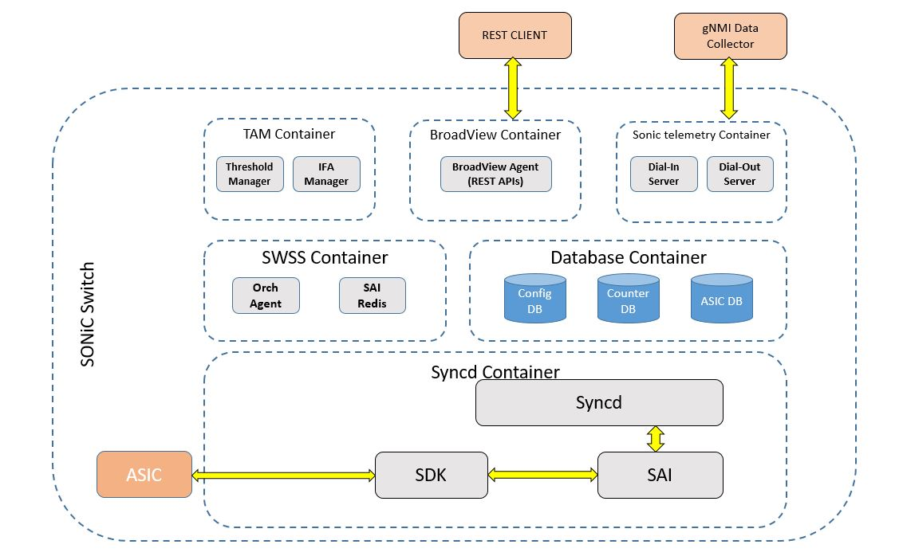

<br>
<br>
<br>
# Broadcom SONiC 2.1.0
### Broadview REST API Guide
<br>
<br>
<br>
<br>
<br>
<br>
<br>
<br>
<br>
<br>


# Feature Name
BroadView REST APIs in SONiC.

# High Level Design Document
**Rev 0.1**

# Table of Contents
- [Feature Name](#feature-name)
- [High Level Design Document](#high-level-design-document)
- [Table of Contents](#table-of-contents)
- [List of Tables](#list-of-tables)
- [Revision](#revision)
- [About this Manual](#about-this-manual)
- [Scope](#scope)
- [Definition/Abbreviation](#definitionabbreviation)
    - [Table 1: Abbreviations](#table-1-abbreviations)
- [1 BroadView Overview](#1-broadview-overview)
  - [1.1 Positioning of BroadView in SONiC](#11-positioning-of-broadview-in-sonic)
  - [1.2 South-Bound Plugin Block changes](#12-south-bound-plugin-block-changes)
  - [1.3 North-Bound Plugin Block changes](#13-north-bound-plugin-block-changes)
  - [1.4 Using BroadView REST APIs in conjunction with CLI and gNMI](#14-using-broadview-rest-apis-in-conjunction-with-cli-and-gnmi)
    - [1.5 Container](#15-container)
- [2 DB Changes](#2-db-changes)
- [3 REST Requests](#3-rest-requests)
  - [3.1 IFA REST Requests](#31-ifa-rest-requests)
    - [Table 2: IFA Rest Requests](#table-2-ifa-rest-requests)
  - [3.2 BST REST Requests](#32-bst-rest-requests)
    - [Table 3: BST Rest Requests](#table-3-bst-rest-requests)
  - [3.3 PDM REST Requests](#32-pdm-rest-requests)
    - [Table 4: PDM Rest Requests](#table-4-pdm-rest-requests)
  - [3.4 TS REST Requests](#32-ts-rest-requests)
    - [Table 5: TS Rest Requests](#table-5-ts-rest-requests)
- [4 CLI](#4-cli)
  - [4.1 Configuration Commands](#41-configuration-commands)
- [5 Packaging](#5-packaging)

  
# List of Tables
[Table 1: Abbreviations](#table-1-abbreviations)

[Table 2: IFA-Rest-Requests](#table-2-ifa-rest-requests)

[Table 3: BST-Rest-Requests](#table-3-bst-rest-requests)

[Table 4: PDM-Rest-Requests](#table-3-pdm-rest-requests)

[Table 5: TS-Rest-Requests](#table-3-ts-rest-requests)

# Revision
| # |    Date    |   Document Version    | Details |
|:---:|:----------:|:------------------:|--------------------|
| 1 | Jan 16, 2020 | v1 | Initial version    |

# About this Manual
This document provides general information about the BroadView REST-API based communication with REST management interface in SONiC.

# Scope
This document describes the high level implementation for supporting BroadView REST APIs in SONiC.

# Definition/Abbreviation
### Table 1: Abbreviations
| **Term** | **Meaning**               |
|----------|---------------------------|
| IFA      | Inband flow analyzer      |
| BST      | Buffer statistics tracker |
| BV       | BroadView                 |
| PDM      | Packet Drop Monitor       |
| TS       | Tail stamping             |


# 1 BroadView Overview

With the proliferation of Software-Defined Networking (SDN), multi-tenant networks, and server virtualization—aided by cloud deployments for applications and storage—network complexity is growing exponentially. Troubleshooting such networks has become an increasingly daunting task.  Network operators need increased visibility into the network and deeper telemetry data in order to remain in control of the network and to ensure optimal network resource utilization. BroadView Instrumentation software provides this critical visibility and telemetry information.

BroadView Agent unlocks the potential of Broadcom switch silicon by augmenting CPU functionality to deliver advanced network analytics. 

In SONiC, the BroadView Agent communicates with the underlying Broadcom switch silicon via SONiC. It operates upon various telemetry and visibility information fetched from DB, runs algorithms on the data, packages the information appropriately, and provides it to a registered client. Similarly, the BroadView Agent configures the silicon based on the configuration requests from the client by updating the appropriate data into the DB.

The BroadView Agent communicates with clients using REST-style communication, with the data exchange in JSON-RPC (2.0) format. It supports both the pull model of operation (the client requests data and obtains it) as well as the push model of operation (refer to "Note" below).

BroadView Agent supports a REST-based API and uses JSON-RPC messaging as the payload over REST. The name of the API becomes the method in the JSON-RPC message, and any associated parameters for the command form the params in the JSON-RPC message.

All the commands are to be sent as HTTP 1.1 POST operations, with the JSON content as the HTTP message body.

By default, the webserver provided as part of the Agent uses the following URL scheme to provide the access to the API:

```
http://<ipaddr>:8080/broadview/<feature>/<api-name>
```
For example, the configure-bst-feature API is accessible via the following URL:

```
http://<ipaddr>:8080/broadview/bst/configure-bst-feature
```
For the Generic Agent Management API, the URL scheme does not have the feature name embedded in the URL. For example, the configure-system-feature API is accessible via the following URL:

```
http://<ipaddr>:8080/broadview/configure-system-feature
```
BroadView REST feature provides REST management interface to configure BroadView features such as Inband flow analyzer (IFA) and Buffer statistics tracker (BST) in SONiC. BroadView REST feature processes the configuration in the REST request and updates respective feature specific tables in CONFIG DB.

For details about BroadView agent and supported APIs for BST and IFA, please refer to publicly available BroadView specification:-

https://github.com/Broadcom-Switch/BroadView-Instrumentation/blob/master/BroadView%20Instrumentation%20Specification.pdf

**Note**: Heartbeat, Periodic and trigger reports are not supported in Arlo+.

## 1.1 Positioning of BroadView in SONiC

Below is the diagram which explains how BroadView agent is integrated into provide BroadView REST APIs:-



## 1.2 South-Bound Plugin Block changes

New SB plug-in block has been implemented as SONiC-SB-plugin. New South-Bound (SB) plugin block including South-Bound-plugin re-director of BroadView agent has been changed as part of integration into SONiC. SONiC-SB-plugin block makes calls to configure the REDIS DB tables as needed for BST and IFA. For configuration related REST APIs, SONiC-SB-plugin block makes call to update CONFIG DB. For stats, SONiC-SB-plugin makes calls to fetch the data from COUNTER_DB.

SONiC-SB-plugin listens for threshold breach events set by thresholdmgr in COUNTER_DB,once event receives trigger-report is prepared and sent to collector configured.

## 1.3 North-Bound Plugin Block changes

There is no change in North-Bound plugin block. SONiC uses North-Bound plugin block as is.

## 1.4 Using BroadView REST APIs in conjunction with CLI and gNMI

Currently in SONiC, there are limited number BroadView REST APIs supported. As explained in earlier section, For BST, Heartbeat and Reports (both periodic and trigger) are not supported. Those are planned to be supported in subsequent releases.

Scope of BroadView REST APIs currently is to provide config and state support. For reports either CLI can be used to dump the data from the DBs (e.g. COUNTER_DB) or if one is interested to get reports remotely, then use gNMI on change subscription method to receive the same. To get details on how to use gNMI for the same, please refer to the below link:-

- gNMI Telemetry: https://github.com/Azure/sonic-telemetry/blob/master/doc/grpc_telemetry.md

As there is no BroadView Heartbeat support in the SONiC, LLDP message can be used in place of Heartbeat messages.

### 1.5 Container

BroadView Agent runs in a separate container. The name of the container is "sonic-broadview".

# 2 DB Changes

For details about DB schemas, please refer to the BST and IFA feature specs on the links below:-

- BST/Threshold: https://github.com/Azure/SONiC/pull/429/files
- IFA: https://github.com/Azure/SONiC/pull/427/files

# 3 REST Requests

## 3.1 IFA REST Requests

Below table is listing out  REST requests for IFA feature supported in Arlo+ release of SONiC.

### Table 2: IFA Rest Requests

| **Request**                  | **Supported** |
|------------------------------|---------------|
| config-ifa-feature           | Yes           |
| create-ifa-collector         | Yes           |
| remove-ifa-collector         | Yes           |
| create-ifa-flow              | Yes           |
| remove-ifa-flow              | Yes           |
| create-ifa-session           | Yes           |
| remove-ifa-session           | Yes           |
| start-ifa-session            | Yes           |
| stop-ifa-session             | Yes           |
| get-ifa-session              | Yes           |
| get-ifa-flow                 | Yes           |
| get-ifa-collector            | Yes           |
| get-ifa-status               | Yes           |
| clear-ifa-session-statistics | **No**        |


## 3.2 BST REST Requests

Below table is listing out REST requests for Threshold/BST feature supported in Arlo+ release of SONiC.  

### Table 3: BST Rest Requests

| **Request**                    | **Realm**                   | **Threshold**              | **Supported** |
|--------------------------------|-----------------------------|----------------------------|---------------|
| configure-bst-thresholds       | ingress-port-priority-group | um-shared-threshold        | Yes           |
| configure-bst-thresholds       | ingress-port-priority-group | um-headroom-threshold      | Yes           |
| configure-bst-thresholds       | egress-uc-queue             | uc-threshold               | Yes           |
| configure-bst-thresholds       | egress-uc-queue             | mc-threshold               | Yes           |
| configure-bst-thresholds       | egress-cpu-queue            | cpu-threshold              | Yes           |
| configure-bst-thresholds       | egress-mc-queue             | mc-queue-entries-threshold | **No**        |
| configure-bst-multi-thresholds | ingress-port-priority-group | um-shared-threshold        | Yes           |
| configure-bst-multi-thresholds | ingress-port-priority-group | um-headroom-threshold      | Yes           |
| configure-bst-multi-thresholds | egress-uc-queue             | uc-threshold               | Yes           |
| configure-bst-multi-thresholds | egress-mc-queue             | mc-threshold               | Yes           |
| configure-bst-multi-thresholds | egress-mc-queue             | mc-queue-entries-threshold | **No**        |

## 3.3 PDM REST Requests

Below table is listing out REST requests for PDM feature supported in Buzznik release of SONiC.  

### Table 4: PDM Rest Requests

| **Request**                 | **Supported** |
|-----------------------------|---------------|
| configure-pdm-feature       |    Yes        |
| create-pdm-collector        |    Yes        |
| remove-pdm-collector        |    Yes        |
| create-pdm-flow             |    Yes        |
| remove-pdm-flow             |    Yes        |
| create-pdm-session          |    Yes        |
| remove-pdm-session          |    Yes        |
| start-pdm-session           |    Yes        |
| stop-pdm-session            |    Yes        |
| get-pdm-session             |    Yes        |
| get-pdm-flow                |    Yes        |
| get-pdm-collector           |    Yes        |
| get-pdm-status              |    Yes        |

## 3.4 TS REST Requests

Below table is listing out REST requests for TS feature supported in Buzznik release of SONiC.  

### Table 5: TS Rest Requests

| **Request**                 | **Supported** |
|-----------------------------|---------------|
| config-ifa-feature          |    Yes        |
| create-ifa-collector        |    Yes        |
| remove-ifa-collector        |    Yes        |
| create-ifa-flow             |    Yes        |
| remove-ifa-flow             |    Yes        |
| create-ifa-session          |    Yes        |
| remove-ifa-session          |    Yes        |
| start-ifa-session           |    Yes        |
| stop-ifa-session            |    Yes        |
| get-ifa-session             |    Yes        |
| get-ifa-flow                |    Yes        |
| get-ifa-collector           |    Yes        |
| get-ifa-status              |    Yes        |


# 4 CLI

Below are BroadView configuration commands of BroadView REST interface supported in SONiC.

## 4.1 Configuration commands

BroadView collector configuration command is below

    config broadview collector <ip> <port>

# 5 Packaging

Inclusion of BroadView docker in SONiC source code packaging and compilation has been explicitly enabled using compilation and packaging flags. 
