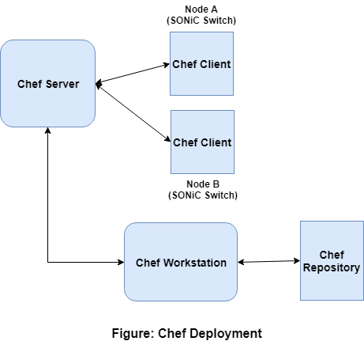

 
 
 
# Broadcom SONiC 2.1.0 
### Configure SONiC Using Chef
 
 
 
 
 
 
 
 
 
 

# Table of Contents

-   [Revision](#revision)
-   [Introduction](#introduction)
	-   [Chef](#chef)
	-   [SONiC](#sonic)
	-   [References](#references)
-   [Chef Functional Description](#chef-functional-description)
-   [Installation of Chef Client](#installation-of-chef-client)
-   [Configuration of SONiC using Chef](#configuration-of-sonic-using-chef)
-   [SONiC Cookbook](#sonic-cookbook)
-   [Deliverables](#deliverables)
-   [Supported SONiC Cookbook Operations](#supported-sonic-cookbook-operations)

# Document History

| # | Date    |  Document Version | Details |
| --- | --- | --- | --- |
| 1 |  Sep 20, 2019 |v1 | Initial version |
| 2 |  Nov 22, 2019 |v2 | Broadcom SONiC 2.1.0 Release |
| 3 |  Dec 16, 2019 |v3 | Updated Cookbook Operations required for BGP-EVPN related configuration|

# Introduction

## Chef
The need for configuring a large number of devices arises with the continuous growth of data center and cloud environments. To make this task of configuration easy and automatic, different suite of tools are being developed. Chef is one such tool which helps the IT and Network configuration automation.

## SONiC
SONiC is an open source network operating system based on Linux that runs on switches from multiple vendors and ASICs. SONiC offers a full-suite of network functionality, like BGP and RDMA that has been production-hardened in the data centers of some of the largest cloud-service providers. It offers teams the flexibility to create the network solutions they need while leveraging the collective strength of a large ecosystem and community.

Linux operating system in SONiC is an open source Debian distro accessible to the operator where applications like Chef can run at the OS-level, and without any intervention from SONiC.

## References

- **https://docs.chef.io**
	- This link explains the complete details of Chef

- **https://docs.chef.io/chef_overview.html**
	- This link details the overview of Chef including various terminology used in Chef

- **https://docs.chef.io/chef_client_overview.html**
	- This link explains the Chef client including various stages involved in chef-client run, authentication mechanism including SSL certificate creation and validation or verification, installation and configuration of chef-client, Bootstrapping a chef node from the chef workstation, etc.

- **https://www.chef.sh/docs/chef-workstation/getting-started**
	- This link Details the Chef work station installation and troubleshooting steps

- **https://devdocs.io/chef~12**
	- This link details the Chef Server configuration and managing different entities. It also provides more details on the current version of Chef.

- **https://docs.chef.io/cookbooks.html**
	- This link explains the details on the Chef cookbooks starting with different contents of it, its creation and its management

- **https://github.com/Azure/SONiC/wiki/Command-Reference**
	- This link explains briefly about SONiC and details of the Command Line Interface (CLI) available in SONiC.

Go back to [Beginning of the document](#Chef).

# Chef Functional Description

Chef has three major components, namely, Chef Workstation, Chef Server and Chef Node.  Each Chef configuration consists of one or more workstations, a single server and all the nodes that need to be configured by Chef. This is depicted in the Figure 1 below. The Chef-Client is installed on all the nodes that are to be configured using Chef Framework. Cookbooks and Recipes, which are written in Ruby scripting language, are used to tell Chef Client how to configure each node. The Chef Workstation is where the cookbooks are written to define the network and specify how each node in the network needs to be configured. These cookbooks are maintained in a repository maintained by the Chef Workstation. When the operator wants to perform the actual configuration, the recipes and cookbooks are pushed from the Chef Workstation to the Chef server. Corresponding recipes and roles can then be applied to the specific Chef Nodes. The Chef-Client, which runs in each node, performs the actual configuration on the node. Chef is implemented in Ruby and the recipes are also written in Ruby language, but can call out to other languages such as Bash, C and Python.

Go back to [Beginning of the document](#Chef).

# Installation of Chef Client

Installation of chef client on any Linux machine (including SONiC switch) can be done in the below 3 methods:

1.	**Manual Installation:**
	- Update the OS using the command “apt-get update”.
	- Install chef-client using the command “apt-get install chef”.
	- Configure chef server details and copy validation.pem file from the chef server into the client’s /etc/chef folder.
	- Establish Client Server communication by initiating chef-client run using the command “chef-client”. Make sure that the client is successfully added as a node in the Chef Server.
	- Start the chef-client daemon in the back ground so that it runs and picks the configuration from the server for every configured/default interval.

2.	**Bootstrapping a node:**
	- Using Knife bootstrap command from the chef workstation:
	**“knife bootstrap FQDN_or_IP_ADDRESS -x username -P password –sudo”**

3.	**ZTP on a SONiC switch:**
	- ZTP (Zero Touch Provisioning) mechanism can be used to install chef-client on a SONiC switch. This mechanism is specific to SONiC and the details of the ZTP module is available in the link https://github.com/Azure/SONiC/blob/a9f893fbdec5d9bbd8d4d957c2e36850ecfff473/doc/ztp/ztp.md
	- Chef client installation, configuration and service provisioning can be achieved in 2 different ways:
		- Using the “provisioning script” plugin:- *Mention the detailed steps of installating and starting the chef-client service in the script file "post_install.sh" (as per method #1 Manual installation section)*.
		- Using the “chef” plugin:- *Specify the required details (like chef-server URL, Path to copy the certificates and the key files, etc.,) and the action to take place for that plugin if required.*

**Note:**

No manual intervention is required by using the knife bootstrap or ZTP options. Setting of required parameters and generation and copy of required certificates and key files is done automatically.

Go back to [Beginning of the document](#Chef).

# Configuration of SONiC using Chef

SONiC software can be configured using Chef in following two methods:

1.	Config file(s)
	- Chef can use the predefined resources like “remote_file” to download the config file(s) and then "execute" to perform required operation.
	- For Example: When system boots, configurations will be loaded from /etc/sonic/config_db.json file into redis DB. Please note that CONFIG_DB content won't be written back into /etc/sonic/config_db.json file automatically. In order to achieve that, execution of config save command is required. Similarly, execution of config load command will trigger a force load of json file into DB. Generally, content in /etc/sonic/config_db.json can be considered as starting config, and content in redis DB as running config. config_db.json is downloaded and placed in the required path on the SONiC switch using "remote_file" resource and then the command “config load” gets executed using "execute" resource to perform the required configuration using config_db.json. This will be done for each chef-client run.
2.	Command Line Interface (CLI)
	- New resources need to be defined to perform the configuration using CLI.
	- This is done by executing SONiC supported CLI commands from the chef cookbook. 

Go back to [Beginning of the document](#Chef).

# SONiC cookbook

## Steps:
1.	knife cookbook create *<cookbook-name>*
	- This command will create a new cookbook template with the name specified by the user in the chef work station or chef repository.
	Example: knife cookbook create *sonic*

		This cookbook provides configuration of SONiC based switch with the following features:
		**VLAN, Interface (Port), LAG and FDB.**

		- Make required changes in the files – attributes/default.rb, metadata.rb
		- Create the files - metadata.json, recipes/*<recipe-name.rb>*, providers/*<provider-name.rb>* and resources/*<resource-name.rb>* (for example: create vlan.rb for VLAN in all the 3 locations).
		- Develop provider code using CLI commands. This is limited to how the CLI infrastructure is designed. Error handling and availability of show commands is limited. Hence there is a possibility to see unsuccessful chef-client run attempt even if the configuration is successful on the DUT.

			For example: VLAN 100 is already present on the SONiC switch. The same VLAN 100 is being created from chef-client by executing the CLI command "config vlan add 100". Hence on the console of the chef-client or the log file of the chef-client will display the text as below:
			Error: Vlan100 already exists

2.	knife cookbook upload *<cookbook-name>*
	- This command will upload the cookbook from the work station/repository to the Chef Server. For each change made in the cookbook, it should be uploaded again to the server for the change to be effective.

	Example: knife cookbook upload *sonic*

3.	Create a role file named “sonic.json” under the directory /home/vmuser/chef-repo/roles/

4.	knife role from file roles/*<role-name>.json*
	- This command will upload the role to the chef server.

	Example: knife role from file roles/*sonic.json*

5.	knife node run_list add *<node-name>* *<run-list-item>* (options)
	- This command will update the node's (SONiC Switch) run list with the newly created cookbook, recipes and roles.
	- Doing this will push the required configurations mentioned in the role to the chef-client during its run.

	Example: knife node run_list add *sonic* *'recipe[sonic::vlan],role[sonic]'*

Go back to [Beginning of the document](#Chef).

# Deliverables
A cookbook with VLAN, Interface (Port), LAG and FDB modules supporting the below listed operations is delivered.
Samples roles to perform the above listed operations are also provided. Cookbook is deployed as is where as roles are reference examples which are parameterized based on the operator needs.

UT Test reports and the related console logs captured on the SONiC Switch are also provided.
 
These deliverables will be part of the sonic-mgmt repo and under the chef folder.

Go back to [Beginning of the document](#Chef).

# Supported SONiC Cookbook Operations

**1.	VLAN**

- Creation
- Deletion
- Addition of ports (tagged/untagged) in the VLAN
- Deletion of ports from the VLAN

**2.	Interface settings**

- Speed
- Admin status
- MTU
- Storm Control parameters (broadcast, unknown-multicast, unknown-unicast)
- Addition/Deletion of IPv4/IPv6 address
- Bind/Unbind interface to VRF

**3.	LAG**

- Creation
- Deletion
- Creation with Minimum number of links and/or Fallback options
- Addition of members
- Deletion of members

**4.	FDB Static entries**

- Creation
- Deletion

**5.	BGP Configuration (with/without VRF)**

- Enable BGP 
- Disable BGP 
- Addition of Peer Group, Router-id, Timers (dealy-timer, hold-timer, keepalive-timer)
- Deletion of Peer Group, Router-id, Timers (dealy-timer, hold-timer, keepalive-timer)
- Addition of Neighbor (shutdown, ebgp-multihop, local-as, remote-as, update-source)
- Deletion of Neighbor (shutdown, ebgp-multihop, local-as, remote-as, update-source)
- Addition of ipv4 unicast Address Family (neighbors, network, redistribute, aggregate-address)
- Deletion of ipv4 unicast Address Family (neighbors, network, redistribute, aggregate-address)
- Addition of l2vpn evpn Address Family (neighbors, vni, advertise-all-vni, advertise-default-gw, advertise, route-target)
- Deletion of l2vpn evpn Address Family (neighbors, vni, advertise-all-vni, advertise-default-gw, advertise, route-target)
- Addition of ipv6 unicast Address Family (neighbors, network, redistribute, aggregate-address, maximum-paths)
- Deletion of ipv6 unicast Address Family (neighbors, network, redistribute, aggregate-address, maximum-paths)

**6.	VRF**

- Creation
- Deletion
- Addition of ports
- Deletion of ports

**7.	MCLAG**

- Creation
- Deletion
- Addition of members, Keepalive interval, Session timeout
- Deletion of members, Keepalive interval, Session timeout
- Addition of Unique IP for VLAN interfaces
- Deletion of Unique IP for VLAN interfaces

**8.	Loopback Interface settings**

- Addition/Deletion of IPv4/IPv6 address
- Bind/Unbind interface to VRF

**9.	VxLAN**
- Creation/Deletion of VTEP with Source IP
- Configure VLAN to VNI mapping
 

**10.	EVPN**
- Create/Delete EVPN NVO
- Add/Remove Source VTEP

Go back to [Beginning of the document](#Chef).
