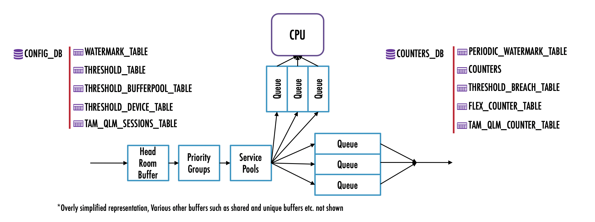
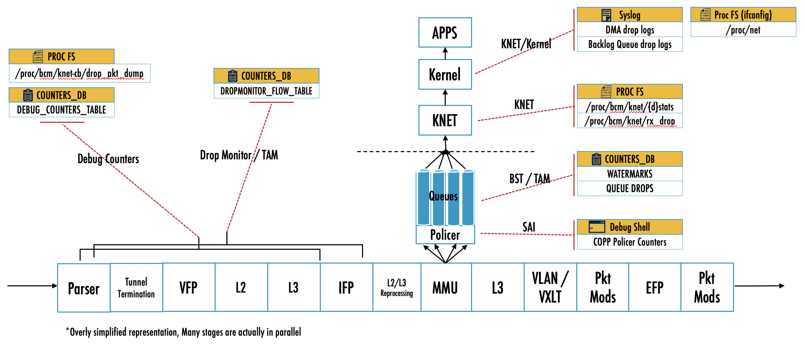
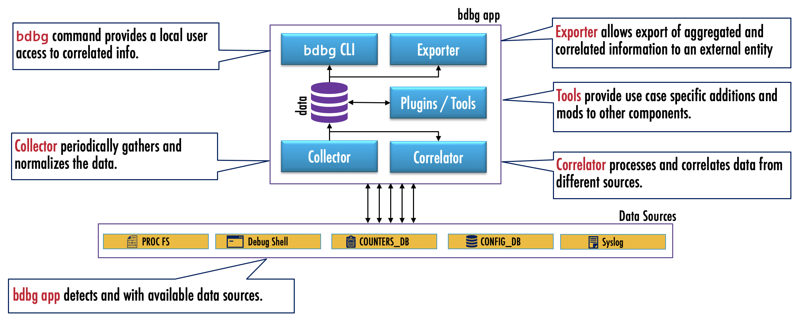

# Broadcom Debug Application

## Highlevel Design Document

### Rev 0.1

## Table of Contents

- [Broadcom Debug Application](#broadcom-debug-application)
  - [Highlevel Design Document](#highlevel-design-document)
    - [Rev 0.1](#rev-01)
  - [Table of Contents](#table-of-contents)
  - [List of Tables](#list-of-tables)
  - [Revision](#revision)
  - [About This Manual](#about-this-manual)
  - [Scope](#scope)
  - [Definition/Abbreviation](#definitionabbreviation)
    - [Table 1: Abbreviations](#table-1-abbreviations)
- [1 Feature Overview](#1-feature-overview)
  - [1.1 Requirements](#11-requirements)
    - [1.1.1 Design Requirements](#111-design-requirements)
    - [1.1.2 Functional Requirements](#112-functional-requirements)
    - [1.1.3 User Interface Requirements](#113-user-interface-requirements)
    - [1.1.4 Configuration and Management Requirements](#114-configuration-and-management-requirements)
    - [1.1.5 Maintenance Requirements](#115-maintenance-requirements)
    - [1.1.6 Scale Requirements](#116-scale-requirements)
  - [1.2 Design Overview](#12-design-overview)
    - [1.2.1 Basic Approach](#121-basic-approach)
    - [1.2.2 SAI Overview](#122-sai-overview)
- [2 Functionality](#2-functionality)
  - [2.1 Target Deployment Use Cases](#21-target-deployment-use-cases)
  - [2.2 Functional Description](#22-functional-description)
- [3 Design](#3-design)
  - [3.1 Overview](#31-overview)
  - [3.2 DB Changes](#32-db-changes)
  - [3.3 Daemons](#33-daemons)
  - [3.4 Switch State Service Design](#34-switch-state-service-design)
    - [3.4.1 Orchestration Agent](#341-orchestration-agent)
    - [3.4.2 Other Process](#342-other-process)
  - [3.5 SyncD](#35-syncd)
  - [3.6 SAI](#36-sai)
  - [3.7 CLI](#37-cli)
    - [3.7.1 Data Models](#371-data-models)
    - [3.7.2 Configuration Commands](#372-configuration-commands)
      - [3.7.2.1 Setting up tuning parameters for BDBG](#3721-setting-up-tuning-parameters-for-bdbg)
      - [3.7.2.2 Setting up a congestion definition](#3722-setting-up-a-congestion-definition)
    - [3.7.3 Show Commands](#373-show-commands)
      - [3.7.3.1 Listing the Global parameters](#3731-listing-the-global-parameters)
      - [3.7.3.2 Listing the Congestion tool parameters](#3732-listing-the-congestion-tool-parameters)
      - [3.7.3.3 Listing the drops tool parameters](#3733-listing-the-drops-tool-parameters)
      - [3.7.3.4 Show active congestion](#3734-show-active-congestion)
      - [3.7.3.5 Show top congestion sources](#3735-show-top-congestion-sources)
      - [3.7.3.6 Show congestion history for a specific source](#3736-show-congestion-history-for-a-specific-source)
      - [3.7.3.7 Show active drops](#3737-show-active-drops)
      - [3.7.3.8 Show historical drops](#3738-show-historical-drops)
    - [3.7.4 Clear commands](#374-clear-commands)
      - [3.7.4.1 Resetting glocal tuning parameters](#3741-resetting-glocal-tuning-parameters)
      - [3.7.4.2 Clearing all histories](#3742-clearing-all-histories)
      - [3.7.4.3 Resetting congestion tool tuning parameters](#3743-resetting-congestion-tool-tuning-parameters)
      - [3.7.4.4 Clearing congestion history](#3744-clearing-congestion-history)
      - [3.7.4.4 Clearing drop history](#3744-clearing-drop-history)
    - [3.7.5 Debug Commands](#375-debug-commands)
      - [3.7.5.1 Exporting history](#3751-exporting-history)
    - [3.7.6 REST API Support](#376-rest-api-support)
- [4 Flow Diagrams](#4-flow-diagrams)
  - [4.1 Config call flow](#41-config-call-flow)
- [5 Error Handling](#5-error-handling)
  - [CLI](#cli)
- [6 Serviceability and Debug](#6-serviceability-and-debug)
- [7 Warm Boot Support](#7-warm-boot-support)
- [8 Scalability](#8-scalability)
- [9 Unit Test](#9-unit-test)
  - [CLI](#cli-1)
  - [Functional Unit Tests](#functional-unit-tests)
- [Broadcom Internal Information : To be removed before publishing externally.](#broadcom-internal-information--to-be-removed-before-publishing-externally)
  - [Revision History](#revision-history)
  - [Key notes](#key-notes)
  - [Specific Limitations](#specific-limitations)


## List of Tables

[Table 1: Abbreviations](#table-1-abbreviations)

## Revision

| Rev |     Date    |       Author       | Change Description                |
|---|-----------|------------------|-----------------------------------|
| 0.1 | 07/10/2020  | Sharad Agrawal  | New draft for Broadcom SONiC            |
| 0.2 | 07/27/2020  | Sharad Agrawal  | Address review comments            |


## About This Manual

This document provides general information about the Broadcom Debug App implementation in SONiC.

## Scope

This document describes the high level design of Broadcom SONIC Debug App in Broadcom SONiC. The design is intended for the following.

- Help reviwers understand the design and infrastructure
- Help QA understand the proposed user interface and plan tests
- Help developers implement additional tools that use and share the common infrastructure.

## Definition/Abbreviation

### Table 1: Abbreviations

| **Term**                 | **Meaning**                         |
|--------------------------|-------------------------------------|
| BDBG                      | Broadcom SONIC Debug App        |
| Data Source              | A specific source for the BDBG to collect the data from. It could be one of the Database Tables, Syslog, Kernel (fs) etc.            |
| Observation Point |  Locations on the switch where metrics are being observed e.g. on-chip Buffers at  Ports, Queues etc |

# 1 Feature Overview

The BDBG App aims to improve upon the debugability aspects of Broadcom SONIC. 

- SONIC has lots of useful counters. But they are dispersed and fragmented; the user must go to multiple different places to find them, and when they do, they see different counter formats and presentations. For debugging, it is required to correlate various counters to be able to draw conclusions. 
- SONIC also doesn’t provide any historical perspective for the counters.
SONIC counters are real-time, and doesn’t support a local "what happened when" perspective.
- Allow integrating dataplane monitoring into the same tools.  

BDBG attempts a use case oriented approach to debugging issues on a Broadcom SONIC Switch

- It aims to solve select (speific use case) problems
- Presents a unified, normalized and focused interface for the data to the user
- Correlates data from different sources on the Switch – software and hardware
- Presents a historical perspective along with current view
- Allows exporting of aggregated data to ease burden on external collectors

There are existing individual features in Broadcom SONIC that aim to solve specific problems. BDBG does not compete / replace existing features, rather uses the data gathered by them.

The BDBG infrastructure implements common aspects so that individual debug tools can share the infrastructure without having to re-implement from scratch. More details on provisioning are avaiable in subsequent sections.

Along with the basic infrastucture, two specific tools for monitoring congestions and drops are built. The tools are named `congestion` and `drops` respectively.

## 1.1 Requirements

### 1.1.1 Design Requirements

1. Support tools and their data-sources. For example, `drops` is a tool under the app. The bdbg app supports multiple tools. These tools represent various debug abilities that the bdbg app can support.
2. Each tool may have one or more data sources. For example, the `drops` tool data sources include, queue-watermarks, drop-counters etc.
3. The app provides default collection and presentation capabilities to all its tools. 
    1. App auto collects data from all data sources for each of the tools  
    2. App provides some commonly used presentation mechanisms to all tools 
4. Each tool can enhance default collection abilities and correlation/presentation functionality from app
    1. Each tool can alter/influence the data collection for its data sources 
    2. Each tool can add additional presentation mechanism for better debugging
5. The app is intended to be having majority of the functionality at the time of invocation but not at the time of data collection. This is to limit the CPU impact of data collection and correlation.

### 1.1.2 Functional Requirements

1. Support periodic data collection from data sources. Periodic data collection is turned off by default. When enabled, the app collects the data from each of the data sources at a configurable interval.
2. The collected data is stored locally for further reference.
3. Each snapshot collected is stored along with the collection time-stamp
    1. The collected historical data is exportable via UI
    2. The collected historical data is also available in the tech-support
    3. The app ensures that historical data doesn’t exceed a limit on the disk. The actual limit may be arrived at initial implementation
4. The app accounts for the likely rounding of data at the data sources.
5. Users can configure thresholds specific to data sources 
    1. Collection will record data only when the collected data exceeds the thresholds.
6. When enabled, by default the data is collected for all data sources every 15 seconds
    1. The interval must be configurable, in the order of seconds
    2. The app will hold the data only for a configurable time period. Default 1hr, to be arrived at after implementation
7. User can turn off periodic collection for selected tools / data sources
8. User can clear the historical data collected on per tool basis

### 1.1.3 User Interface Requirements

1. Each tool shows information from its data sources
    1. Current Values
    2. Historical Max/Min Values along with timestamps
    3. Historical Values sorted by a time, with latest on the top, preceded by clear summary
    4. User can limit the number of events in a given output. e.g., “not more than 20 records from each source” 
    5. Data from sources collected around a user supplied time stamp. e.g., “show all packet drop events around 2pm today”
    6. Historical data that matches & exceeds (or less than) a user supplied threshold
    7. Strings matching user supplied regex, for data from syslog in a time period.
2. Each tool allows user to ignore data from certain data sources for each “show” request.
3. User will be able to define time-periods and compare data from sources across time periods.

### 1.1.4 Configuration and Management Requirements

The BDBG app (infrastructure and tools) is not a regular SONIC feature. BDBG is an app that sits on the top of the SONIC Management infrastructure. It doesn’t support configuration via the UMF, rather it is a consumer of UMF and offers management via its own CLI. No REST or other management facilities are supported since the raw data is already available for processing in that mode.

Likewise, its configuration and data is stored in a separate DB instance distinct from the other database instances in redis.

### 1.1.5 Maintenance Requirements

1. The app can be downloaded and used on a live Broadcom SONIC switch. Does not require a reboot or config-reload of the switch
2. The app detects the needed data sources and works with them
Works gracefully in the event a necessary source is not available.
3. The app can be upgraded on the switch. The historical data in the DB/Disk must be compatible with newer versions (with a reasonable limit)

### 1.1.6 Scale Requirements

1. The app should be able to hold upto 1h time (duration). The limit should be user configurable.

## 1.2 Design Overview

### 1.2.1 Basic Approach

The BDBG infrastructure is newly developed. It is built as an independent application that runs on the top of existing (and unmodified) SONIC infrastructure. 

### 1.2.2 SAI Overview

No changes required for SAI.

# 2 Functionality

## 2.1 Target Deployment Use Cases

The BDBG tools are not meant for any specific usecase, but for general debugging purposes.

## 2.2 Functional Description

The BDBG tools and infrastrucutre aims to improve upon the debugability aspects of Broadcom SONIC.

## 2.3 Data sources for the **congestion** tool

The following diagram depicts a simpllified on-chip buffering scheme, and lists various tables that act as sources for understanding congestion events. 



Note that some of the features that contribute the data sources are in development at the time of this writing. This list and the specific names are meant to be indicative and are not to be considered final. 

## 2.3 Data sources for the **drops** tool

The following diagram depicts a simplified packet pipeline, both on-chip and in the software, and lists various places that act as sources for understanding drop events. 



Note that some of the features that contribute the data sources are in development at the time of this writing. This list and the specific names are meant to be indicative and are not to be considered final. 

# 3 Design

## 3.1 Overview

The BDBG app is built as an independent application that runs on the top of existing (and unmodified) SONIC infrastructure.

The following diagram depicts a high level functional block diagram for the BDBG app.



- Collector periodically gathers and normalizes the data.
- Correlator processes and correlates data from different sources.
- Tools provide use case specific additions and mods to other components.
- Exporter allows export of aggregated and correlated information to an external entity
- bdbg command provides a local user access to correlated info.


## 3.2 DB Changes

BDBG doesn't use redis for storing the data from the data sources inview of the following:

- Lack of support for time-series data
- The large volume of the data
- Likely access-conflicts with time sensitive SONIC features.

In uses in memory data structures and appropriate algorithms for search.

This design decision may be changed during the course of implementation, in which case, this section will be updated.

The app has very little configuration and it is stored as a file in the file-system.

## 3.3 Daemons

A new daemon called `bdbgd` is introduced, which is responsible for periodic data collection as well as for purging historical data.

## 3.4 Switch State Service Design

### 3.4.1 Orchestration Agent

NA

### 3.4.2 Other Process

N/A

## 3.5 SyncD

N/A

## 3.6 SAI

NA

## 3.7 CLI

### 3.7.1 Data Models

NA

### 3.7.2 Configuration Commands

#### 3.7.2.1 Setting up tuning parameters for BDBG

Two tuning parameters are supported by BDBG for controlling data collection as well as for historical data retention.

| **Parameter**                 | **Description**                         |
|--------------------------|-------------------------------------|
| `collection-interval`    | The data collection periodicity in seconds Range 0 - 3600. 0 indicates disabling periodic collection. Default : 0 |
| `max-retention-interval` | Data retention interval, in seconds, for the historical data, after which the data will be purged. Range 0 - 3600. 0, indicates no historical data retention, Default : 0|

Atleast one parameter must be provided in any invocation. Any unsupplied parameter will continue to have the previously configured value. 

The command syntax for setting up the tuning parameters is as follows:

```
shell # bdbg config collection-interval <cinterval> max-retention-interval <rinterval>
```

#### 3.7.2.2 Setting up a congestion definition

The `congestion` tool allows user to configure a value for buffer utilization beyond which the buffer is considered as undergoing congestion. 

| **Parameter**                 | **Description**                         |
|--------------------------|-------------------------------------|
| `congestion-threshold`    | Value for buffer utilization in percentage, beyond which the buffer is considered as undergoing congestion Range 0 - 100. Default : 0 |

The command syntax for setting up the parameter is as follows:

```
shell # bdbg config congestion congestion-threshold <buffer-utilization> 
```


### 3.7.3 Show Commands

#### 3.7.3.1 Listing the Global parameters

The following command lists the values of the tuning parameters and status information for BDBG.

```
shell # bdbg show 
```
An example invocation is as below

```
shell # bdbg show

Supported tools : congestion, drops

Tuning Parameters
----------------------
collection-interval      : 5 sec
max-retention-interval   : 3600 sec
```

#### 3.7.3.2 Listing the Congestion tool parameters

The following command lists the values of the tuning parameters and status information for the `congestion` tool.

```
shell # bdbg show congestion
```
An example invocation is as below

```
shell # bdbg show congestion

Number of Congestion Events             :   360
Switch Latency  - Minimum               :   less than 1.2us (70%) 
Switch Latency - Median                 :   10us - 20us (10%) 
Switch Latency - Maximum                :   above 120us (1%) 
Congestion Events last cleared at       :   30th Jun 2021, 10:11AM

Tuning Parameters
----------------------
congestion-threshold      : 25%
```

#### 3.7.3.3 Listing the drops tool parameters

The following command lists the values of the tuning parameters and status information for the `drops` tool.

```
shell # bdbg show drops
```
An example invocation is as below

```
shell # bdbg show drops

Number of Dropping Flows              :   3
Number of Active Drop Reasons         :   2
Number of Active Drop Locations       :   3
Number of Active Dropping CPU Queues  :   3
Drop Events last cleared at           :   30th Jun 2021, 10:11AM

```

#### 3.7.3.4 Show active congestion

This command shows the congestion events recorded in the current data collection interval.

```
shell # bdbg show congestion active
```
An example invocation is as below

```
shell # bdbg show congestion active

Buffer             Interface        Direction    Utilization    Drops 
----------------   --------------   ---------    -------------  -----
pfc0               -                Ingress      50%            -
sp1                Ethernet0        Ingress      50%            -          
queue 0            Ethernet24       Egress       40%            -
queue 7 [ARP]      CPU              Egress       40%            2048

```

#### 3.7.3.5 Show top congestion sources 

This command shows the top congestion sources recorded since the congestion history was cleared. Note that if the historical records exceed the `max-retention-interval`, then they will be purged and will not be counted as part of the historical data.

```
shell # bdbg show congestion top [limit <num-sources>]
```

The optional parameter `num-sources` can be used to limit the output to a preferred number of top congesting observation points.

An example invocation is as below.

```
shell # bdbg show congestion top

Number of Congestion Events             :   360
Congestion Events last cleared at       :   30th Jun 2021, 10:11AM

Buffer             Interface        Direction    Utilization    Drops      Events
----------------   --------------   ---------    -----------    -----      ------
Sp0                Ethernet0        Ingress      50%            -          200
queue 0            Ethernet24       Egress       40%            -          125
queue 7 [ARP]      CPU              Egress       40%            2048       25
queue 24 [BFD]     CPU              Egress       10%            4096       10

```

#### 3.7.3.6 Show congestion history for a specific source 

This command shows the congestion events recorded for a specified observation point/source since the congestion history was cleared. Note that if the historical records exceed the `max-retention-interval`, then they will be purged and will not be counted as part of the historical data.

```
shell # bdbg show congestion history { buffer <buffer-name> | interface <if-name> queue <queue-number> } [limit <num-events>] [around <time>]
```

The optional parameter `num-events` can be used to limit the output to a preferred number of congestion events.

The optional parameter `time` specified in the `HH:MM:SS` format, can be used to look at the history around a specific time. By default 10 events are shown. If `num-events` is also specified, as many events are shown. 

An example invocation is as below.

```
shell # bdbg show congestion history interface Ethernet0 queue 8

Observation Point                       :   Ethernet 0 Queue 8
Number of Congestion Events             :   3
Congestion Events last cleared at       :   30th Jun 2021, 10:11AM

Id      Timestamp                   Utilization     Drops
---     ---------------------       -----------     -----
1       30th Jun 2021, 10:11AM      25%             0
2       30th Jun 2021, 10:21AM      25%             0
3       30th Jun 2021, 11:11AM      50%             0
```

```
shell # bdbg show congestion history buffer pfc0

Observation Point                       :   pfc0 [Global Service Pool 0]
Number of Congestion Events             :   3
Congestion Events last cleared at       :   30th Jun 2021, 10:11AM

Id      Timestamp                   Utilization     Drops
---     ---------------------       -----------     -----
1       30th Jun 2021, 10:11AM      25%             0
2       30th Jun 2021, 10:21AM      25%             0
3       30th Jun 2021, 11:11AM      50%             0
```
#### 3.7.3.7 Show active drops

This command shows the drops events recorded in the current data collection interval.

```
shell # bdbg show drops active {flows | reasons | locations | interface <interface-name>}
```

- The `flows` option shows the dropped flows in the data-plane (silicon), cpu-queue or kernel along with the reason the flow is dropped. The dropped flow is identified by 5-tuple i.e. source and destination IP address, source and destination L4 port number and protocol (e.g. 17 for udp, 6 for tcp etc).

- The `reasons` option shows the packet-drop count of different reasons for which the various flows have dropped.

- The `locations` option shows the packet-drop count at various locations - silicon and in software.

- The `interface` option shows the packet-drop count at a specific interface.

An example invocation is as below:

```
shell # bdbg show drops active flows

Number of Dropping Flows          :   3
Drop Events last cleared at       :   30th Jun 2021, 10:11AM

src-id         dst-ip            src-port     dst-port     protocol     drop-reason     location     timestamp
-----------    --------------    --------     --------     --------     ------------    -----------  ----------
10.10.1.1      10.10.2.2         5656         80           6            L3_DEST_MISS    data-plane   2021-06-11 11:22AM
10.10.1.1      10.10.2.2         5656         80           6            UNKNOWN_VLAN    cpu-queue    2021-06-11 11:20AM
10.10.1.1      10.10.2.2         5656         80           6            UNKNOWN_VLAN    kernel       2021-06-11 11:20AM

```

```
shell # bdbg show drops active reasons

Number of Active Drop Reasons     :   2
Drop Events last cleared at       :   30th Jun 2021, 10:11AM

drop-reason     count       
------------    --------    
L3_DEST_MISS    24          
UNKNOWN_VLAN    32          

```

```
shell # bdbg show drops active locations

Number of Active Drop Locations   :   3
Drop Events last cleared at       :   30th Jun 2021, 10:11AM

location        count       
------------    --------    
data-plane      3400          
cpu-queue       32          
kernel          45

```

```
shell # bdbg show drops active interface cpu

Number of Active Dropping Queues   :   3
Drop Events last cleared at        :   30th Jun 2021, 10:11AM

location                count       
------------            --------    
Queue 0 [Unassigned]    3400          
Queue 24 [BFD]          25          
Queue 36 [MOD]          10
```

```
shell # bdbg show drops active interface Ethernet0

Number of Active Dropping Queues   :   1
Drop Events last cleared at        :   30th Jun 2021, 10:11AM

location                count       
------------            --------    
Queue 0                 5 
```

#### 3.7.3.8 Show historical drops

This command shows the drop events recorded since the drop history was cleared. Note that if the historical records exceed the `max-retention-interval`, then they will be purged and will not be counted as part of the historical data.

The command syntax is very similar to the `show drops active` command discussed earlier, with the addtion of `limit` and `around` options. The command output is also in the same format.

```
shell # bdbg show drops history {flows | reasons | locations | interface <interface-name>} [limit <num-events>] [around <time>]
```

- The `flows` option shows the dropped flows in the data-plane (silicon), cpu-queue or kernel along with the reason the flow is dropped. The dropped flow is identified by 5-tuple i.e. source and destination IP address, source and destination L4 port number and protocol (e.g. 17 for udp, 6 for tcp etc).

- The `reasons` option shows the packet-drop count of different reasons for which the various flows have dropped.

- The `locations` option shows the packet-drop count at various locations - silicon and in software.

- The `interface` option shows the packet-drop count at a specific interface.

- The optional parameter `num-events` can be used to limit the output to a preferred number of drop events.

- The optional parameter `time` specified in the `HH:MM:SS` format, can be used to look at the history around a specific time. By default 10 events are shown. If `num-events` is also specified, as many events are shown. 

Example invocations are as below:

```
shell # bdbg show drops history flows

Number of Dropping Flows          :   3
Drop Events last cleared at       :   30th Jun 2021, 10:11AM

src-id         dst-ip            src-port     dst-port     protocol     drop-reason     location     timestamp
-----------    --------------    --------     --------     --------     ------------    -----------  ----------
10.10.1.1      10.10.2.2         5656         80           6            L3_DEST_MISS    data-plane   2021-06-11 11:22AM
10.10.1.1      10.10.2.2         5656         80           6            UNKNOWN_VLAN    cpu-queue    2021-06-11 11:20AM
10.10.1.1      10.10.2.2         5656         80           6            UNKNOWN_VLAN    kernel       2021-06-11 11:20AM

```

```
shell # bdbg show drops history reasons

Number of Active Drop Reasons     :   2
Drop Events last cleared at       :   30th Jun 2021, 10:11AM

drop-reason     count       
------------    --------    
L3_DEST_MISS    240          
UNKNOWN_VLAN    320          

```

```
shell # bdbg show drops history locations

Number of Active Drop Locations   :   3
Drop Events last cleared at       :   30th Jun 2021, 10:11AM

location        count       
------------    --------    
data-plane      34000          
cpu-queue       320          
kernel          450

```

```
shell # bdbg show drops history interface CPU

Number of Active Dropping Queues   :   3
Drop Events last cleared at        :   30th Jun 2021, 10:11AM

location                count       
------------            --------    
Queue 0 [Unassigned]    34000          
Queue 24 [BFD]          250          
Queue 36 [MOD]          100
```

```
shell # bdbg show drops history interface Ethernet0

Number of Active Dropping Queues   :   1
Drop Events last cleared at        :   30th Jun 2021, 10:11AM

location                count       
------------            --------    
Queue 0                 50 
```

### 3.7.4 Clear commands

#### 3.7.4.1 Resetting glocal tuning parameters

The following clear command resets the bdbg tuning parameters to its default values 

```
shell # bdbg clear collection-interval
shell # bdbg clear max-retention-interval
```

#### 3.7.4.2 Clearing all histories

The following clear command clears the histories of all individual tools. 

```
shell # bdbg clear history
```

#### 3.7.4.3 Resetting congestion tool tuning parameters

The following clear command resets the congestion tool tuning parameters to its default values 

```
shell # bdbg clear congestion congestion-threshold
```

#### 3.7.4.4 Clearing congestion history

The following clear command clears the congestion history. 

```
shell # bdbg clear congestion history
```

#### 3.7.4.4 Clearing drop history

The following clear command clears the drop history. 

```
shell # bdbg clear drops history
```


### 3.7.5 Debug Commands

#### 3.7.5.1 Exporting history

The following command exports the specified history to a text file at TBD location. This export is useful for offline processing of the data. The export may take time depending on the amount of data and associated conversion.

```
shell # bdbg export { all | congestion | drops }
```

### 3.7.6 REST API Support

N/A

 # 4 Flow Diagrams

## 4.1 Config call flow


# 5 Error Handling

## CLI

N/A

# 6 Serviceability and Debug

N/A

# 7 Warm Boot Support

The BDBG tool doesn't offer any functionality that can persist across a warmboot. All histories are cleared.

# 8 Scalability

N/A

# 9 Unit Test

## CLI

The CLI testcases are included as part of individual feature testcases.

## Functional Unit Tests
1. Verify that once ‘collection-interval’ configuration is successful, the configuration can be retrieved via the show command properly.
2. Verify that once ‘max-retention-interval’ configuration is successful, the configuration can be retrieved via the show command properly.
3. Verify that once ‘congestion-threshold’ configuration is successful, the configuration can be retrieved via the show command properly.
4. Verify that ‘collection-interval’ configuration can be cleared.
5. Verify that ‘max-retention-interval’ configuration can be cleared.
6. Verify that ‘congestion-threshold’ configuration can be cleared.
7. Verify that congestion on ‘Ingress shared/headroom pool occupancy per PG’ can be retrieved via show commands.
8. Verify that congestion on ‘Egress shared pool occupancy per queue’ can be retrieved via show commands.
9. Verify that congestion on ‘CPU Queue’ can be retrieved via show commands.
10. Verify that congestion on ‘Device buffer’ can be retrieved via show commands.
11. Verify that congestion on ‘Ingress service pool’ can be retrieved via show commands.
12. Verify that congestion on ‘Egress service pool’ can be retrieved via show commands.
13. Verify that packet drop at data-plane (e.g. Unknown Vlan, TTL0) can be retrieved via show commands.
14. Verify that packet drop at CPU queue (e.g. Unknown Vlan) can be retrieved via show commands.
15. Verify that packet drop at Kernel (e.g. Unknown Vlan) can be retrieved via show commands.
16. Verify that count of dropped packets at cpu-queue can be retrieved via show commands.
17. Verify that count of dropped packets at physical interface (e.g. Ethernet0) can be retrieved via show commands.
18. Verify that the input parameters provided to CLI are validated for ranges and validity.

# Broadcom Internal Information : To be removed before publishing externally.

## Revision History

## Key notes

The following items are open as of this writing and need to be closed after experimentation.

- Default values for collection interval and retention interval
- Max value for retention interval, and whether history can be measured in memory size instead of time.
- Use of Redis for data holding
- Use of REST API for DB access (as opposed to direct DB access) especially for data gathering
- Use of KLISH for running the bdbg command

## Specific Limitations

Not all data sources are available on all Broadcom SONiC supported platforms. 