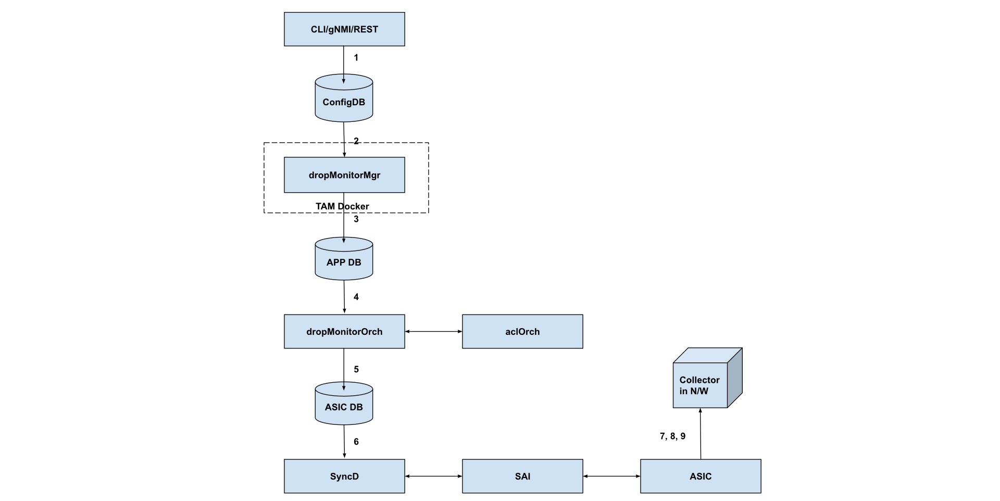
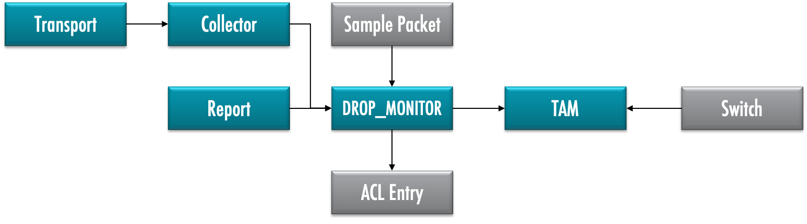

# Drop Monitor

## Highlevel Design Document

### Rev 0.1

# Table of Contents

- [Drop Monitor](#drop-monitor)
  * [Highlevel Design Document](#highlevel-design-document)
    + [Rev 0.1](#rev-01)
- [Table of Contents](#table-of-contents)
  * [List of Tables](#list-of-tables)
  * [Revision](#revision)
  * [About This Manual](#about-this-manual)
  * [Scope](#scope)
  * [Definition/Abbreviation](#definition-abbreviation)
    + [Table 1: Abbreviations](#table-1--abbreviations)
- [1 Feature Overview](#1-feature-overview)
  * [1.1 Requirements](#11-requirements)
    + [1.1.1 Functional Requirements](#111-functional-requirements)
    + [1.1.2 Configuration and Management Requirements](#112-configuration-and-management-requirements)
    + [1.1.3 Scalability Requirements](#113-scalability-requirements)
  * [1.2 Design Overview](#12-design-overview)
    + [1.2.1 Basic Approach](#121-basic-approach)
    + [1.2.2 Container](#122-container)
    + [1.2.3 SAI Overview](#123-sai-overview)
- [2 Functionality](#2-functionality)
  * [2.1 Target Deployment Use Cases](#21-target-deployment-use-cases)
  * [2.2 Functional Description](#22-functional-description)
- [3 Design](#3-design)
  * [3.1 Overview](#31-overview)
  * [3.1.1 DropMonitorMgr](#311-dropmonitormgr)
  * [3.2 DB Changes](#32-db-changes)
    + [3.2.1 CONFIG DB](#321-config-db)
    + [3.2.2 APP DB](#322-app-db)
    + [3.2.3 STATE DB](#323-state-db)
    + [3.2.4 ASIC DB](#324-asic-db)
    + [3.2.5 COUNTER DB](#325-counter-db)
  * [3.3 Switch State Service Design](#33-switch-state-service-design)
    + [3.3.1 Orchestration Agent](#331-orchestration-agent)
    + [3.3.2 Other Process](#332-other-process)
  * [3.4 SyncD](#34-syncd)
  * [3.5 SAI](#35-sai)
  * [3.6 CLI](#36-cli)
    + [3.6.1 Data Models](#361-data-models)
    + [3.6.2 Configuration Commands](#362-configuration-commands)
      - [3.6.2.1 Activating and Deactivating Drop Monitor](#3621-activating-and-deactivating-drop-monitor)
      - [3.6.2.2 Setting up Aging interval](#3622-setting-up-aging-interval)
      - [3.6.2.3 Setting up flows for drop-monitoring](#3623-setting-up-flows-for-drop-monitoring)
    + [3.6.3 Show Commands](#363-show-commands)
      - [3.6.3.1 Listing the Drop Monitor attributes](#3631-listing-the-drop-monitor-attributes)
      - [3.6.3.1 Listing the Drop Monitor sessions](#3631-listing-the-drop-monitor-sessions)
    + [3.6.4 Sample Workflow](#364-sample-workflow)
    + [3.6.5 Debug Commands](#365-debug-commands)
    + [3.6.6 REST API Support](#366-rest-api-support)
- [4 Flow Diagrams](#4-flow-diagrams)
  * [4.1 Config call flow](#41-config-call-flow)
- [5 Error Handling](#5-error-handling)
  * [DropMgr](#dropmgr)
  * [DropMonitorOrch](#dropmonitororch)
- [6 Serviceability and Debug](#6-serviceability-and-debug)
- [7 Warm Boot Support](#7-warm-boot-support)
- [8 Scalability](#8-scalability)
- [9 Unit Test](#9-unit-test)
  * [CLI](#cli)
- [Broadcom Internal Information : To be removed before publishing externally.](#broadcom-internal-information---to-be-removed-before-publishing-externally)
  * [Key notes](#key-notes)
  * [Specific Limitations](#specific-limitations)
  * [Supported Drop Reasons](#supported-drop-reasons)
  * [Qualified Drop Reasons](#qualified-drop-reasons)
  * [Drop Report format](#drop-report-format)


## List of Tables

[Table 1: Abbreviations](#table-1-abbreviations)

## Revision

| Rev |     Date    |       Author       | Change Description                |
|---|-----------|------------------|-----------------------------------|
| 0.1 | 07/01/2020  | Bandaru Viswanath  | New draft for SONiC Drop Monitor feature            |

## About This Manual

This document provides general information about the Drop Monitor feature implementation in SONiC.

## Scope

The term Inband Telemetry refers to the set of technologies of the Switch, that embed useful metadata as part of packets that are transiting the Switch. SAI community defined a Telemetry and Monitoring specification that defines a unified interface - [TAM](https://github.com/opencomputeproject/SAI/tree/master/doc/TAM) - for provisioning and monitoring these technologies. Inband Flow Analyzer feature is one such Inband Telemetry technologies.

The design as specified in this document uses the common [SONiC TAM](tam.hld) infrastructure.

This document describes the high level design of Drop Monitor feature in SONiC.

## Definition/Abbreviation

### Table 1: Abbreviations

| **Term**                 | **Meaning**                         |
|--------------------------|-------------------------------------|
| SAI                      | Switch Abstraction Interface        |
| TAM                      | Telemetry and Monitoring            |

# 1 Feature Overview

The Drop Monitor feature in SONiC allows the user to setup packet-drop monitoring sessions for specific flows. A Collector, identified by an IP address and associated transport parameters, can be configured on the switch to send packet drop-reports. 

## 1.1 Requirements

### 1.1.1 Functional Requirements

1.0 Drop Monitor feature allows user to configure a Drop Monitor session on a given switch and send the drop-reports to a specified collector. Drop Monitor session is defined by flow classifiers that are used to identify a flow that needs to be monitored for packet drops.

2.0 Drop Monitor provisioning as listed below.

2.1 TAM switch identifier to uniquely identify a switch in network and drop-reports carry this information.

2.2 ACL configuration to identify a flow-group to look for packet drops.

2.3 TAM sampler configuration to indicate the sampling rate for the flow.

2.4 TAM collector configuration that can be attached to Drop Monitor session to send drop reports.

2.5 An aging-interval configuration. If the Drop Monitor feature doesn't notice packet drops for this duration, it considers packet drops to have stopped.

3.0  When the first packet of the flow is dropped by the switch, a "Drop-start" report is sent to the collector. This report contains the event type (Drop-start), first 128 bytes of the packet dropped, flow details and the drop reasons for the packet drop.

3.1 "Drop-active" report is sent to the collector when the drop reason for a flow changes, while the aging-interval has not expired. This report contains the event type (Drop-active), flow details and drop reasons for the packet drop. Note that this report is sent only when the reason for the packet drop for this flow changes.

3.2 "Drop-stop" report is sent to the collector when the drops are not seen on the flow for a duration of aging interval. This report contains the event type (Drop-stop), flow details and the last noted drop reason for packet drops for this flow. 

4.0 Drop Monitor feature is by default de-activated on the switch, and requires an explicit user intervention to activate it in the configuration.

4.1 If the Drop Monitor feature can't be supported/activated on the switch, any attempt to activate the feature returns appropriate failure.

5.0 The Drop Monitor feature is supported on physical and LAG ports.

5.1 The Drop Monitor feature supports dynamic-port-breakout and aliasing features.

6.0 The Drop Monitor feature will be a part of the TAM container along with other TAM features.

### 1.1.2 Configuration and Management Requirements

The TAM Drop Monitor feature supports the new management framework and KLISH CLI for configuration. The following configuration and status information is available.

- To activate / de-activate the feature
- To create/clear appropriate Drop Monitor configuration on a per-flow-group basis and switch-wide.
- To display current status and statistics for the Drop Monitor on a per flow-group basis.

### 1.1.3 Scalability Requirements

- Number of Drop Monitor sessions that can be supported is proportional to the availability of resources in hardware such as ACLs. No specific constraints are imposed.
- Only a single collector is supported.

## 1.2 Design Overview

### 1.2.1 Basic Approach

The Drop Monitor feature is newly developed.

### 1.2.2 Container

A container called 'tam' exists as a container for all TAM applications, including the this application.

### 1.2.3 SAI Overview

The SAI TAM spec specifies the TAM APIs to be used to configure the TAM functionality. Please refer to SAI-Proposal-TAM2.0-v2.0.docx in [https://github.com/opencomputeproject/SAI/tree/master/doc/TAM](https://github.com/opencomputeproject/SAI/tree/master/doc/TAM) for more details.

# 2 Functionality

## 2.1 Target Deployment Use Cases

Drop Monitor is used to  monitor the network for faults and  bottlenecks, it aids in detecting data plane faults and isolating them to a given device or location and assists in network planning. Some of the key usecases are -

- Idenitfying switches and flows that are undergoing packet-drops
- Identifying packet-drop patterns

## 2.2 Functional Description

The drop monitor feature detects and reports drops on a per-flow basis to a configured external collector. Dropped packets of the flow are sampled (based upon the sampling rate configuration) to the drop-monitor application.  

Once a flowgroup (matching criteria) is configured for monitoring drops, the drop monitor application reports the following drop events on the flow to the collector in the protobuf format:

  - Drop start: Sent when drops are observed on the flow for the first time. The report contains the event, flow keys, first 128 bytes of the packet and the last observed drop reasons.

  - Drop active: Sent whenever the drop reason on the flow changes. The report contains the event, flow keys, and the drop reasons.

  - Drop stop: Sent when no sampled dropped packets are observed for the aging interval. The report contains event, flow keys and the last observed drop reasons.


# 3 Design

## 3.1 Overview

***Drop Monitor Architecture***



The architecture of the drop monitor feature in SONiC is illustrated in the diagram above.

1. CLI/gNMI/REST interface is used to configure the drop monitor feature functionality. Configuration is saved to CONFIG_DB.

2. DropMonitorMgr picks the configuration from CONFIG_DB.

3. DropMonitorMgr populates the APPL_DB drop monitor tables appropriately.

4. DropMonitorOrch picks the configuration from APPL_DB, interacts with aclOrch for ACL related information.

5. DropMonitorOrch programs the ASIC_DB via SAIREDIS calls.

6. Syncd picks the configuration from ASIC_DB and configures SAI. 

7. When a drop is detected on the flow configured in step 1, a "drop-start" event is sent to the configured collector.

8. When the drop reason on the flow changes, a "drop-active" event is sent to the configured collector.

9. Once drops on the flow have not been seen for configured "aging-interval", a "drop-stop" event is sent to the collector.

## 3.1.1 DropMonitorMgr

The DropMonitorMgr runs in the TAM docker and is used to pass drop monitor configuration arriving from UI to dropMonitorOrch. DropMonitorMgr validates and collates information from CONFIG_DB  tables TAM_COLLECTOR_TABLE, TAM_DROP_MONITOR_SESSIONS_TABLE, and TAM_SAMPLERATE_TABLE. APPL_DB TAM_DROP_MONITOR_FOW_TABLE is populated with a valid flow configuration once all the required data is available.  

The DropMonitorMgr configures the source IP address to be used in drop reports to the system IP address. 9073 is configured as the source port number to be used in drop reports.

## 3.2 DB Changes

### 3.2.1 CONFIG DB

TAM\_DROP\_MONITOR\_TABLE

    ;Defines TAM Drop Monitor switch-wide configuration in CONFIG_DB

    key                = global         ; Only one instance and 
                                        ; has a fixed key ”global".
    aging-interval     = 1 * 5DIGIT     ; Aging interval in seconds

    Example: 
    > keys *TAM_DROP_MONITOR_TABLE* 
    1) "TAM_DROP_MONITOR_TABLE|global" 

    > hgetall "TAM_DROP_MONITOR_TABLE|global"

    1) "aging-interval"
    2) 3600

TAM\_DROP\_MONITOR\_SESSIONS\_TABLE

    ;Defines TAM Drop Monitor session configuration in CONFIG_DB

    key = name                  ; name is collector name and should be unique. 
    flowgroup = 1*255VCHAR      ; Flow group reference
    collector = 1*255VCHAR      ; Collector Reference
    sample-rate = 1*255VCHAR    ; Sampler reference

    Example: 
    > keys *TAM_DROP_MONITOR_SESSIONS* 

    1) "TAM_DROP_MONITOR_SESSIONS_TABLE|dm1" 

    > hgetall "TAM_DROP_MONITOR_SESSIONS_TABLE|dm1"

    1) "flowgroup"
    2) "websrvrflows"
    3) "collector"
    4) "dmcol1"
    5) "sample-rate"
    6) "aggressive"


### 3.2.2 APP DB

TAM\_DROP\_MONITOR\_FEATURE\_TABLE

    ;Defines TAM DROP MONITOR feature configuration

    key                = feature        ; Only one instance and has a fixed key "feature".
    deviceid           = 1 * 5DIGIT     ; Uniquely identifies a device on the network. 

    Example:
    > keys *TAM_DROP_MONITOR_FEATURE*
    1) "TAM_DROP_MONITOR_FEATURE_TABLE:feature"

    > HGETALL "TAM_DROP_MONITOR_FEATURE_TABLE:feature"
    1) "deviceid"
    2) 54325

TAM\_DROP\_MONITOR\_FLOW\_TABLE

    ;Defines a TAM drop monitor flow configuration.

    key            = name                        ; Flow name. Should be 
                                                   unique
    acl-table-name = table-name                  ; Parameter to map acl table to 
                                                   the flow.
    acl-rule-name  = rule-name                   ; Parameter to map acl rule to 
                                                   the flow.
    dst-ipaddress-type = "ipv4" / "ipv6"         ; Collector IP address type.
    dst-ipaddress  = ipv4_address / ipv6_address ; Collector IP address.
    dst-port       = 1 * 4DIGIT                  ; Collector UDP port number
    src-ipaddress  = ipv4_address / ipv6_address ; Source IP address to be used in the drop 
                                                   event reports sent to collector.
    src-port       = 1 * 4DIGIT                  ; Source port number to be used in the 
                                                   drop event reports sent to the 
                                                   collector.
    sampling-rate  = 1 * 5DIGIT                  ; Sampling rate. 1 out of “rate”
                                                   dropped packets of flow are 
                                                   sampled for processing.
    aging-interval = 1 * 5DIGIT                  ; Optional. Aging interval for 
                                                   drop-                                                  
                                                   monitoring in milliseconds. Determines  
                                                   the interval for which the system 
                                                   waits to declare that a flow is 
                                                   no longer being dropped.
    flowgroup-id   = flowgroup-id                ; Flow group ID. Must be unique per flow.

    Example:
    > keys *TAM_DROP_MONITOR*
    1) "TAM_DROP_MONITOR_FLOW_TABLE:flow1"

    > HGETALL "TAM_DROP_MONITOR_FLOW_TABLE:flow1"
    1) "acl-table-name"
    2) "table1"
    3) "acl-rule-name"
    4) "rule1"
    5) "ipaddress-type"
    6) "ipv4"
    7) "dst-ipaddress"
    8) "10.10.10.40"
    9) "dst-port"
    10) "9070"
    11) "src-ipaddress"
    12) "10.10.10.20"
    13) "src-port"
    14) "9070"
    15) "sampling-rate"
    16) "1000"
    17) "aging-interval"
    18) "10"
    17) "flowgroup-id"
    18) "1"


### 3.2.3 STATE DB

N/A

### 3.2.4 ASIC DB

N/A

### 3.2.5 COUNTER DB

N/A


## 3.3 Switch State Service Design

### 3.3.1 Orchestration Agent

A new orchestration agent class, DropMonitorOrch is added to convert the incoming drop monitor configuration from APPL_DB to ASIC_DB configuration. DropMonitorOrch subscribes to the TAM_DROP_MONITOR_FLOW_TABLE and TAM_DROP_MONITOR_TABLE and converts the incoming flow configuration into drop-monitor SAI configuration.

DropMonitorOrch maintains data pertaining to all the currently configured flows and the associated TAM object bindings. TAM object bindings are re-used wherever possible.

Interaction with aclOrch is required to retrieve the SAI object ID associated with the drop-monitor flow ACL rule.  

Drop monitor uses sampling rate configuration for sampling the dropped packets of the flow. The sampling configuration in terms of rate is converted into a SAI sample packet object and provided to the TAM drop-monitor object for configuration

### 3.3.2 Other Process

N/A

## 3.4 SyncD

N/A

## 3.5 SAI

The SAI TAM API spec defines all TAM APIs supported in SAI. Please refer to SAI-Proposal-TAM2.0-v2.0.docx in [https://github.com/opencomputeproject/SAI/tree/master/doc/TAM](https://github.com/opencomputeproject/SAI/tree/master/doc/TAM) for more details.

***Below diagram provides details about various TAM objects needed to support Drop Monitor, and their correlation***



## 3.6 CLI

### 3.6.1 Data Models

The user facing data model is based on OpenConfig TAM yang model (TBD). The backend data model (SONiC YANG) will use the formats in CONFIG_DB & STATE_DB. See above sections.

### 3.6.2 Configuration Commands

#### 3.6.2.1 Activating and Deactivating Drop Monitor

The command syntax for activating/de-activating the feature on the switch is as follows:

```
sonic (config-tam-dm)# [no] enable
```

Deactivating Drop Monitor will purge all Drop Monitor configuration from the switch.

#### 3.6.2.2 Setting up Aging interval

The command syntax for setting up the aging interval for Drop Monitoring is as follows:

```
sonic (config-tam-dm)# [no] aging-interval <value>
```
| **Attribute**                 | **Description**                         |
|--------------------------|-------------------------------------|
| `aging-interval`               | An integer, representing duration in seconds. Range is 1-3600, Default value is 5seconds |

The default value for the aging interval is 5 seconds.

#### 3.6.2.3 Setting up flows for drop-monitoring 

A Drop Monitoring session associated a previously defined flow-group as described below.

- The Drop Monitor session must have a unique name for referencing.
- The flow-group must be previously created with the `flow-group` command (under `config-tam` hierarchy).
- The sampling-rate can be set, by referencing a previously created sampler, created with the `sampler` command (under `config-tam` hierarchy).
- A collector must be associated with the session, where the drop-reports will be sent. The collector must be previously created with the `collector` command (under `config-tam` hierarchy)..

When a sesssion that is previously created is removed (with the `no` command), the associated flows are no longer monitored for drops by the switch. 

The following attribtes are supported for  drop-monitor sessions.

| **Attribute**                 | **Description**                         |
|--------------------------|-------------------------------------|
| `name`               | A string that uniquely identifies the Drop Monitor session        |
| `flowgroup`            | Specifies the name of *flow-group* |
| `collector`               | Specifies the name of the *collector* |
| `sample-rate`            | Specifies the name of the *sampler*  |


The command syntax for creating /removing the sessions are as follows:

```
sonic(config-tam-dm)# session <name> flowgroup <fg-name> collector <col-name> [sample-rate <sampler-name>]

sonic (config-tam-dm)# no session <name>
```

### 3.6.3 Show Commands

#### 3.6.3.1 Listing the Drop Monitor attributes

The following command lists the switch-wide attributes that are in use.

```
sonic # show tam drop-monitor
```
Sample usage shown below.

```
sonic # show tam drop-monitor

Status             : Active
Switch ID          : 2020
Aging Interval     : 60

```

#### 3.6.3.1 Listing the Drop Monitor sessions

The following command lists the details for all drop-monitor sessions or for a specific session. Note that only explicitly configured tuples in the associated flow-group are displayed.

```
sonic # show tam drop-monitor sessions [<name>]
```

Sample usage shown below.

```
sonic # show tam drop-monitor sessions

Name           Flow Group          Collector          Sampler
-----------    ----------------    --------------     -------------
http_236       tcp_port_236        Col_i19            aggresive
http_239       tcp_port_239        Col_i19            aggresive
http_241       tcp_port_241        Col_i19            aggresive

sonic # show tam drop-monitor sessions http_236

Session            : http_236
Flow Group Name    : tcp_port_236
   Id              : 4025
   Priority        : 100
   SRC IP          : 13.92.96.32
   DST IP          : 7.72.235.82
   DST L4 Port     : 236
Collector          : Col_i19
Sampler            : aggresive
Packet Count       : 7656

```

### 3.6.4 Sample Workflow

This section provides a sample Drop Monitor workflow using CLI, for monitoring the packet drops as described below.

> Need to monitor all packet drops on this switch, for all the flows destined for the webserver running at 20.20.1.1. A Drop Monitor collector for analysing the metadata is running at 20.20.20.4:9091 (UDP). Not every packet drop needs monitored, but one in 100 is acceptable. If a flow didn't see any drop for 5sec, it can be assumed that the active drop window may have ended. The flows are ingressing onto switch1 on port 'Ethernet44'

```
; setup switch-wide configuration

sonic (config-tam)# switch-id 1234

; setup the sample-rate

sonic (config-tam)# sampler websamp interface Ethernet44 rate 100

; create the flowgroup

sonic (config-tam)# flow-group websrvflows dst-ip 20.20.1.1 dst-l4-port 80 protocol 6

; setup the collector

collector dmcol1 type ipv4 ip 20.20.20.4 port 9091 protocol UDP

; Enable Drop Monitor on the switch

sonic (config-tam-dm)# enable

; Setup aging interval

sonic (config-tam-dm)# aging-interval 5

; Create the drop-monitoring session

sonic(config-tam-dm)# session webflowmonitor flowgroup websrvflows sample-rate websamp collector dmcol1

```

### 3.6.5 Debug Commands
N/A

### 3.6.6 REST API Support

The following REST API are supported - 

- BroadView REST API for Drop Monitor feature
    - TBD : Provide reference and listlimitations 
- REST API as obtained from the openconfig-tam module defintions
    - TBD List these 
 
 # 4 Flow Diagrams

## 4.1 Config call flow

All the configuration is stored in the CONFIG_DB via the management framework.

# 5 Error Handling

## DropMgr

Any mismatch in the CONFIG_DB and APPL_DB schema for drop-monitor flows will be flagged/logged appropriately.

## DropMonitorOrch

SAI errors will be captured via the error handling framework and handled appropriately. All errors arising out of processing of incoming drop-monitor flow configuration will be captured via syslogs.

# 6 Serviceability and Debug

Logging of errors and invalid parameters will be done at each level allowing a hierarchical view of failures arising out of mis-configuration or system errors. 

# 7 Warm Boot Support

No special handling is done for the warm boot case. The TAM configuration is restored from the Config DB and TAM functionality will continue to work as it is through a warm boot.

# 8 Scalability

N/A

# 9 Unit Test

## CLI

TBD

# Broadcom Internal Information : To be removed before publishing externally.

## Key notes

* Drop Monitor feature is supported via the MOD firmware running on embedded R5 cores on TD3-X7, TH2 and TH3 Broadcom silicon. Additional details on the MOD firmware, including specific list of drop-reasons, can be had by requesting (via docSafe) for the document number StrataXGS-MOD-AN100.

* Drop Monitor feature is an *advanced* feature that is not available in all the Broadcom SONiC packages.

## Specific Limitations

Drop Monitor feature in SONiC inherits the limitations of the underlying firmware and the hardware. These are listed below.

1. Only a single collector is supported
2. Drop Monitor flows must be IPv4 flows
3. Drop Monitor is supported on TD3-X7, TH2 and TH3 platforms only.

## Supported Drop Reasons

The drop reasons supported are as below:-


| Drop reasons                  | Drop reasons                | Drop reasons               | Drop reasons     | Drop reasons        | Drop reasons            |
|-------------------------------|-----------------------------|----------------------------|------------------|---------------------|-------------------------|
| L3_SOURCE_MISS                | L3_DEST_MISS                | MCAST_MISS                 | IP_MCAST_MISS    | UNKNOWN_VLAN        | L3_HEADER_MISMATCH      |
| DOS_ATTACK                    | MARTIAN_ADDR                | TUNNEL_ERROR               | PARITY_ERROR     | L3_MTU_FAIL         | HIGIG_HDR_ERROR         |
| MCAST_IDX_ERROR               | CLASS_BASED_MOVE            | L3_ADDR_BIND_FAIL          | MPLS_LABEL_MISS  | MPLS_INVALID_ACTION | MPLS_INVALID_PAYLOAD    |
| TUNNEL_OBJECT_VALIDATION_FAIL | MPLS_SEQUENCE_NUMBER        | L2_NON_UNICAST_MISS        | NIV_PRIO_DROP    | NIV_RPF_FAIL        | UNKNOWN_SUBTENDING_PORT |
| TUNNEL_ADAPT_LOOKUP_MISS      | PACKET_FLOW_SELECT_MISS     | TUNNEL_DECAP_ECN_ERROR     | FAILOVER_DROP    | OTHER_LOOKUP_MISS   | INVALID_TPID            |
| TUNNEL_TTL_ERROR              | MPLS_ILLEGAL_RESERVED_LABEL | L3_HEADER_ERROR            | L2_HEADER_ERROR  | TTL1                | TTL                     |
| FCOE_ZONE_CHECK_FAIL          | IPMC_INTERFACE_MISMATCH     | MPLS_TTL                   | MPLS_UNKNOWN_ACH | OAM_ERROR           | L2_GRE_SIP_MISS         |
| L2_GRE_VPNID_MISS             | BFD_ERROR                   | CONGESTION_CNM_PROXY_ERROR | VXLAN_SIP_MISS   | VXLAN_VPNID_MISS    | NIV_INTERFACE_MISS      |
| NIV_TAG_INVALID               | NIV_TAG_DROP                | NIV_UNTAG_DROP             | TRILL_INVALID    | TRILL_MISS          | TRILL_RPF_FAIL          |
| TRILL_TTL                     | NAT_ERROR                   | TCP_UDP_NAT_MISS           | ICMP_NAT_MISS    | NAT_FRAGMENT        |                         |

## Qualified Drop Reasons

The following drop-reaons are explicitly qualified on SONiC.

| **Drop Reasons** | **Description**                  |
|------------------|----------------------------------|
| L3_DEST_MISS     | Missing L3 route/host entry      |
| UNKNOWN_VLAN     | Vlan of packet unknown           |
| MARTIAN_ADDR     | Packet with source IP=0.0.0.0    |
| DOS_ATTACK       | Packet with SIP=DIP              |
| L3_MTU_FAIL      | MTU > configured MTU             |
| L3_ADDR_BIND_FAIL| L3 Packet with incorrect SMAC    |
| INVALID_TPID     | Packet with an invalid TPID      |
| L3_HEADER_ERROR  | Error in L3 header               |
| TTL1             | Packet with TTL=0                |
| TTL              | Packet with TTL=1                |
| PARITY_ERROR     | Parity error                     |

## Drop Report format

The drop-report format is silicon specific. When used with the MOF firmware, the drop reports are encoded in protobuf format provided below.

```protobuf

/*
     * Copyright (c) 2017 Broadcom. The term "Broadcom" refers
     * to Broadcom Limited and/or its subsidiaries.

     * Licensed under the Apache License, Version 2.0 (the "License");
     * you may not use this file except in compliance with the License.

     * You may obtain a copy of the License at
     * http://www.apache.org/licenses/LICENSE-2.0

     * Unless required by applicable law or agreed to in writing, software
     * distributed under the License is distributed on an "AS IS" BASIS,
     * WITHOUT WARRANTIES OR CONDITIONS OF ANY KIND, either express or implied.
     * See the License for the specific language governing permissions and
     * limitations under the License.
     */

    syntax = "proto2";

    message Event {
        required uint64 timestamp               = 1;

        oneof EventType {
            MirrorOnDrop mod_event              = 2;
            FlowLearning flow_event             = 3;
            RouteChangeDetection rcd_event      = 4;
            NetworkLatencyMonitoring nlm_event  = 5;
        }
    }

    message MirrorOnDrop {
        enum MOD_STATE {
            DROP_INVALID = 0;
            DROP_START   = 1;
            DROP_ACTIVE  = 2;
            DROP_STOP    = 3;
        }

        optional MOD_STATE mod_state       = 1;
    }

    message FlowLearning {
        enum FL_STATE {
        	FL_INVALID      = 0;   
	        FL_LEARN        = 1;
	        FL_AGING        = 2;
	        FL_EXPORT       = 3;
	        FL_TABLE_FULL   = 4; /* Atomic event, no other information need to be send */
        }

        optional FL_STATE fl_state    = 1;
    }

    message RouteChangeDetection {
        optional uint32 dummy           = 1;
    }

    message NetworkLatencyMonitoring {
        optional uint32 dummy           = 1;
    }

    message Flow {
        enum DROP_REASON {
	        DROP_INVALID                  = 0;  
         	L3_SOURCE_MISS                = 1;
	        L3_DEST_MISS                  = 2;
	        MCAST_MISS                    = 3;
	        IP_MCAST_MISS                 = 4;
	        UNKNOWN_VLAN                  = 5;
	        L3_HEADER_MISMATCH            = 6;
	        DOS_ATTACK                    = 7;
	        MARTIAN_ADDR                  = 8;
	        TUNNEL_ERROR                  = 9;
	        PARITY_ERROR                  = 10;  
	        L3_MTU_FAIL                   = 11;
	        HIGIG_HDR_ERROR               = 12;
            MCAST_IDX_ERROR               = 13;
            CLASS_BASED_MOVE              = 14;
            L3_ADDR_BIND_FAIL             = 15;
	        MPLS_LABEL_MISS               = 16;
	        MPLS_INVALID_ACTION           = 17;
	        MPLS_INVALID_PAYLOAD          = 18;
	        TUNNEL_OBJECT_VALIDATION_FAIL = 19;
	        MPLS_SEQUENCE_NUMBER          = 20;
	        L2_NON_UNICAST_MISS           = 21;
	        NIV_PRIO_DROP                 = 22;
	        NIV_RPF_FAIL                  = 23;
	        UNKNOWN_SUBTENDING_PORT       = 24;
	        TUNNEL_ADAPT_LOOKUP_MISS      = 25;
	        PACKET_FLOW_SELECT_MISS       = 26;
	        TUNNEL_DECAP_ECN_ERROR        = 27;
	        FAILOVER_DROP                 = 28;
	        OTHER_LOOKUP_MISS             = 29;
	        INVALID_TPID                  = 30;
	        TUNNEL_TTL_ERROR              = 31;
	        MPLS_ILLEGAL_RESERVED_LABEL   = 32;
	        L3_HEADER_ERROR               = 33;
	        L2_HEADER_ERROR               = 34;
	        TTL1                          = 35;
	        TTL                           = 36;
	        FCOE_ZONE_CHECK_FAIL          = 37;
	        IPMC_INTERFACE_MISMATCH       = 38;
	        MPLS_TTL                      = 39;
	        MPLS_UNKNOWN_ACH              = 40;
	        OAM_ERROR                     = 41;
	        L2_GRE_SIP_MISS               = 42;
	        L2_GRE_VPNID_MISS             = 43;
	        BFD_ERROR                     = 44;
	        CONGESTION_CNM_PROXY_ERROR    = 45;
	        VXLAN_SIP_MISS                = 46;
	        VXLAN_VPNID_MISS              = 47;
	        NIV_INTERFACE_MISS            = 48;
	        NIV_TAG_INVALID               = 49;
	        NIV_TAG_DROP                  = 50;
	        NIV_UNTAG_DROP                = 51;
	        TRILL_INVALID                 = 52;
	        TRILL_MISS                    = 53;
	        TRILL_RPF_FAIL                = 54;
	        TRILL_TTL                     = 55;
	        NAT_ERROR                     = 56;
            TCP_UDP_NAT_MISS              = 57;
            ICMP_NAT_MISS                 = 58;
            NAT_FRAGMENT                  = 59;
            NAT_MISS                      = 60;
        }

        optional uint32 proto              = 1;
        optional uint32 sip                = 2;
        optional uint32 dip                = 3;

        optional uint32 l4_sport           = 4;
        optional uint32 l4_dport           = 5;
        optional uint32 vnid               = 6;
        optional uint32 inner_proto        = 7;
        optional uint32 inner_sip          = 8;
        optional uint32 inner_dip          = 9;

        optional uint32 inner_l4_sport     = 10;
        optional uint32 inner_l4_dport     = 11;
        optional bytes  custom_key         = 12;
        optional uint32 group_id           = 13; /* Packet type is derived directly from group ID */
        optional bytes packet              = 14;

        optional uint64 packet_count       = 15;
        optional uint64 byte_count         = 16;

        optional DROP_REASON drop_reason_1 = 17;
        optional DROP_REASON drop_reason_2 = 18;

    }

    message EventPair {
        repeated Event event            = 1;
        repeated Flow flow              = 2;
    }

    message GenEvent {
        required string system_id        = 1;
        optional uint32 component_id     = 2;
        optional uint32 sub_component_id = 3;
        repeated EventPair eventpair     = 4;
        optional string hostname         = 5;
    }
```
