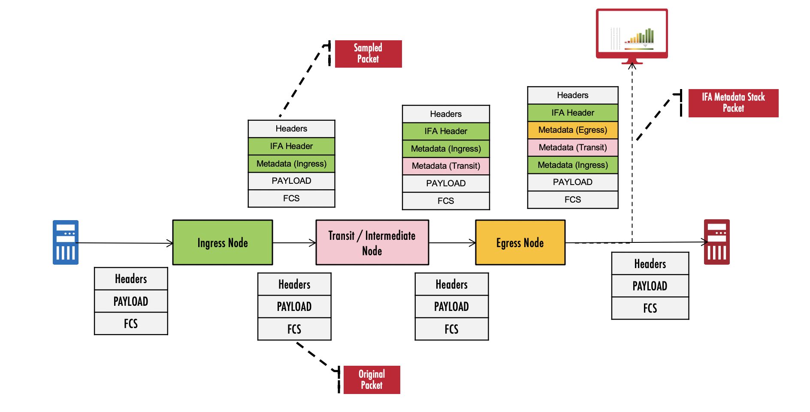
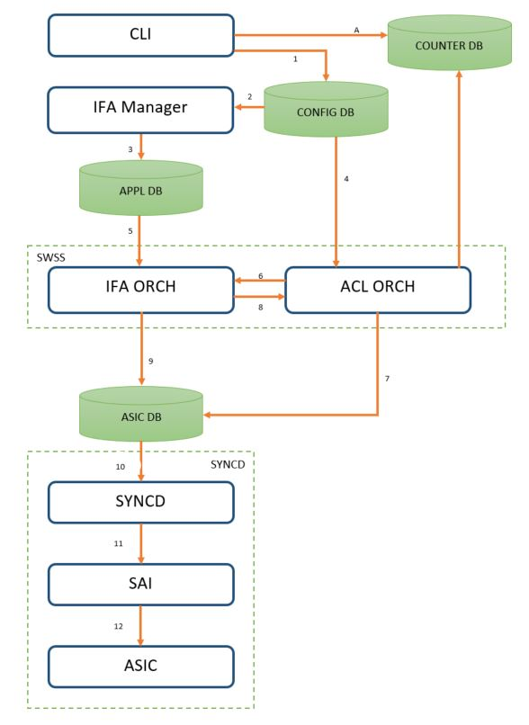
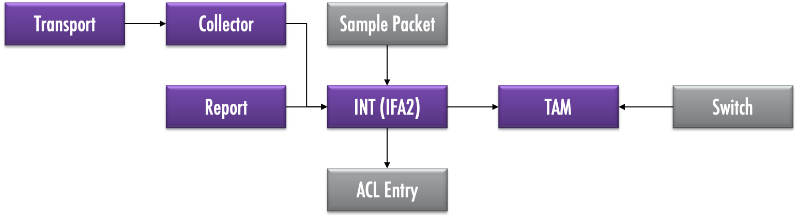

# IFA : Inband Flow Analyzer 

## Highlevel Design Document

### Rev 0.1

# Table of Contents

- [IFA : Inband Flow Analyzer](#ifa---inband-flow-analyzer)
  * [Highlevel Design Document](#highlevel-design-document)
    + [Rev 0.1](#rev-01)
- [Table of Contents](#table-of-contents)
  * [List of Tables](#list-of-tables)
  * [Revision](#revision)
  * [About This Manual](#about-this-manual)
  * [Scope](#scope)
  * [Definition/Abbreviation](#definition-abbreviation)
    + [Table 1: Abbreviations](#table-1--abbreviations)
- [1 Feature Overview](#1-feature-overview)
  * [1.1 Requirements](#11-requirements)
    + [1.1.1 Functional Requirements](#111-functional-requirements)
    + [1.1.2 Configuration and Management Requirements](#112-configuration-and-management-requirements)
    + [1.1.3 Scalability Requirements](#113-scalability-requirements)
  * [1.2 Design Overview](#12-design-overview)
    + [1.2.1 Basic Approach](#121-basic-approach)
    + [1.2.2 Container](#122-container)
    + [1.2.3 SAI Overview](#123-sai-overview)
- [2 Functionality](#2-functionality)
  * [2.1 Target Deployment Use Cases](#21-target-deployment-use-cases)
  * [2.2 Functional Description](#22-functional-description)
- [3 Design](#3-design)
  * [3.1 Overview](#31-overview)
  * [3.2 DB Changes](#32-db-changes)
    + [3.2.1 CONFIG DB](#321-config-db)
    + [3.2.2 APP DB](#322-app-db)
    + [3.2.3 STATE DB](#323-state-db)
    + [3.2.4 ASIC DB](#324-asic-db)
    + [3.2.5 COUNTER DB](#325-counter-db)
  * [3.3 Daemons](#33-daemons)
  * [3.4 Switch State Service Design](#34-switch-state-service-design)
    + [3.4.1 Orchestration Agent](#341-orchestration-agent)
    + [3.4.2 Other Process](#342-other-process)
  * [3.5 SyncD](#35-syncd)
  * [3.6 SAI](#36-sai)
  * [3.7 CLI](#37-cli)
    + [3.7.1 Data Models](#371-data-models)
    + [3.7.2 Configuration Commands](#372-configuration-commands)
      - [3.7.2.1 Activating and Deactivating IFA](#3721-activating-and-deactivating-ifa)
      - [3.7.2.2 Setting up flows for monitoring with IFA](#3722-setting-up-flows-for-monitoring-with-ifa)
    + [3.7.3 Show Commands](#373-show-commands)
      - [3.7.3.1 Listing the IFA attributes](#3731-listing-the-ifa-attributes)
      - [3.7.3.1 Listing the IFA flows](#3731-listing-the-ifa-flows)
    + [3.7.5 Debug Commands](#375-debug-commands)
    + [3.7.6 REST API Support](#376-rest-api-support)
- [4 Flow Diagrams](#4-flow-diagrams)
  * [4.1 Config call flow](#41-config-call-flow)
- [5 Error Handling](#5-error-handling)
  * [CLI](#cli)
  * [IFAOrch](#ifaorch)
- [6 Serviceability and Debug](#6-serviceability-and-debug)
- [7 Warm Boot Support](#7-warm-boot-support)
- [8 Scalability](#8-scalability)
- [9 Unit Test](#9-unit-test)
  * [CLI](#cli-1)
- [Broadcom Internal Information : To be removed before publishing externally.](#broadcom-internal-information---to-be-removed-before-publishing-externally)
  * [Key notes](#key-notes)
  * [Specific Limitations](#specific-limitations)

## List of Tables

[Table 1: Abbreviations](#table-1-abbreviations)

## Revision

| Rev |     Date    |       Author       | Change Description                |
|---|-----------|------------------|-----------------------------------|
| 0.1 | 07/01/2020  | Bandaru Viswanath  | New draft for SONiC IFA feature            |

## About This Manual

This document provides general information about the Inband Flow Analyzer (IFA) feature implementation in SONiC.

## Scope

The term Inband Telemetry refers to the set of technologies of the Switch, that embed useful metadata as part of packets that are transiting the Switch. SAI community defined a Telemetry and Monitoring specification that defines a unified interface - [TAM](https://github.com/opencomputeproject/SAI/tree/master/doc/TAM) - for provisioning and monitoring these technologies. Inband Flow Analyzer feature is one such Inband Telemetry technologies.

The design as specified in this document uses the common [SONiC TAM](tam.hld) infrastructure.

This document describes the high level design of Inband Flow Analyzer feature in SONiC.

## Definition/Abbreviation

### Table 1: Abbreviations

| **Term**                 | **Meaning**                         |
|--------------------------|-------------------------------------|
| SAI                      | Switch Abstraction Interface        |
| TAM                      | Telemetry and Monitoring            |
| IFA                      | Inband Flow Analyzer                |

# 1 Feature Overview

Inband Flow Analyzer (IFA) records flow specific information from switches across a network for specific flows. It is described at the IETF draft [https://datatracker.ietf.org/doc/draft-kumar-ippm-ifa](https://datatracker.ietf.org/doc/draft-kumar-ippm-ifa). The protocol defines an IFA header to mark the flow and direct the collection of analyzed metadata per marked packet per hop across the network. Some of the text in the document is taken from the above IETF draft, for contextual purposes.

IFA performs flow analysis, and possible actions on the flow data, inband.  Once a flow is enabled for analysis, an Ingress node makes a copy of the flow or samples the live traffic flow, or tags a live traffic flow for analysis and data collection. Copying of a flow is done by sampling or cloning the flow.  These new packets are representative packets of the original flow and possess the exact same characteristics as the original flow.  This means that IFA packets traverse the same path in the network and same queues in the networking element as the original packet would.  

The intermediate nodes keep appending their own metadata to the IFA-tagged packets before forwarding them. The terminating node is responsible for terminating the IFA flow by summarizing/extracting the metadata of the entire path and sending it to a designated Collector. A network monitoring application on a Collector can analyze the telemetry information provided by IFA feature and provide full visibility of a network by providing metrics such as latency, packet loss and full network path that packet travels. A complete description of the functionality can be obtained from the IETF draft mentioned above.

The IFA feature in SONiC allows the user to setup flow monitoring sessions for specific flows. The switch may be marked as an ingress node, a transit node or a terminating node for a flow. A Collector, identified by an IP address and associated transport parameters, can be configured on the terminating nodes to send the extracted metadata. More details on provisioning are avaiable in subsequent sections.

## 1.1 Requirements

### 1.1.1 Functional Requirements

1.0 IFA feature allows user to configure IFA session on a given switch and send the telemetry metadata to a specified collector. IFA session is defined by flow classifiers that are used to identify a flow that needs to be monitored for inband telemetry.

1.1 IFA feature is accomplished by configuring IFA session on various nodes that act as ingress, intermediate and egress nodes. The IFA role is per flow on a Swich. For example, any given switch can act as an ingress node for one flow and as an intermediate node for another flow.

1.2 Ingress nodes sample the flow and tags the sampled packets for analysis and data collection, and insert own metadata.

1.3 Intermediate node is responsible for identifying IFA tagged flows and insertion of telemetry metadata.

1.4 Egress node is responsible for terminating the IFA flow by summarizing the telemetry data of the entire path and sending it to collector as well as dropping the sampled packets.

2.0 IFA provisioning as listed below.

2.1 TAM switch identifier to uniquely identify a switch in network and IFA header of the reports carry this information.

2.2 Enterprise Id to be used for the IPFIX export records.

2.3 ACL configuration to identify a flow-group to insert IFA metadata.

2.4 TAM sampler configuration to indicate the sampling rate for the flow.

2.5 TAM collector configuration that can be attached to IFA flow on egress device to forward collected telemetry data.

3.0 IFA feature is by default de-activated on the switch, and requires an explicit user intervention to activate it in the configuration.

3.1 If the IFA feature can't be supported/activated on the switch, any attempt to activate the IFA feature returns appropriate failure.

4.0 The IFA feature is supported on physical and LAG ports.

4.1 The IFA feature supports dynamic-port-breakout and aliasing features.

5.0 The IFA feature will be a part of the TAM container along with other TAM features.

### 1.1.2 Configuration and Management Requirements

The TAM IFA feature supports the new management framework and KLISH CLI for configuration. The following configuration and status information is available.

- To activate / de-activate IFA feature
- To create/clear appropriate IFA configuration for ingress, intermediate and egress nodes, on a per-flow group basis.
- To display current status and statistics for the IFA on a per flow-group basis.

### 1.1.3 Scalability Requirements

- Number of IFA sessions that can be supported is proportional to the availability of resources in hardware such as ACLs. No specific constraints are imposed.
- Only a single collector is supported.

## 1.2 Design Overview

### 1.2.1 Basic Approach

The IFA feature is newly developed.

### 1.2.2 Container

A container called 'tam' exists as a container for all TAM applications, including the IFA application.

### 1.2.3 SAI Overview

The SAI TAM spec specifies the TAM APIs to be used to configure the TAM functionality. Please refer to SAI-Proposal-TAM2.0-v2.0.docx in [https://github.com/opencomputeproject/SAI/tree/master/doc/TAM](https://github.com/opencomputeproject/SAI/tree/master/doc/TAM) for more details.

# 2 Functionality

## 2.1 Target Deployment Use Cases

IFA is used to proactively monitor the network for faults and performance bottlenecks, it aids in detecting data plane faults and isolating them to a given device or location and assists in planning network capacity and projecting future load. Some of the key usecases are -

- SLA conformance that require end-to-end path latency for targeted flows
- Idenitfying switches and flows that are undergoing congestion
- Identifying network bandwidth usage patterns
- Packet path and path change analysis

## 2.2 Functional Description

The IFA feature in SONiC allows the user to setup flow monitoring sessions for specific flows. The switch may be marked as an ingress node, a transit node or a terminating node for a flow.

When IFA feature is activated, the switch will behave as intermediate node and perform IFA intermediate node actions. What it means is that the switch will append its own metadata to all IFA-tagged flows transiting the switch. Non IFA-tagged flows are not impacted.  There may be multiple IFA intermediate nodes in the path for the IFA-tagged flows.

When the switch is configured as an ingress node for any flow (or set of flows),  the switch -

 - Makes a copy of a sampled packet from the flow based upon the configured sampling rate.
 - Adds IFA tag to the sampled packet 
 - Adds its own metadata to the packet.

The sampled packet is then forwarded along the same path as the original packet. 

When the switch is configured as an egress node for any flow (or set of flows),  the switch -

- Collectes the IFA sampled packets belonging to the flow
- Adds its own metadata
- Summarizes the telemetry data for the entire path, encapsulates the telemetry data as payload and sends it to collector.

The sampled packet is then dropped at the egress node.

At all other non-IFA activated nodes, IFA sampled packet is forwarded as a normal packet in the network.

***Example IFA  topology illustrating the packet paths and metadata***



# 3 Design

## 3.1 Overview

***IFA Architecture***



The above diagram illustrates the architecture of the IFA feature within SONiC.

Below is the call flow sequence specified in above architecture diagram

1 IFA and ACL configuration from CLI is saved to CONFIG DB.

2 IFA Manager reads IFA configuration from CONFIG DB, processes and validates the same.

3 IFA Manager updates valid IFA configuration to APPL DB.

4 ACL ORCH reads ACL configuration from CONFIG DB.

5 IFA ORCH reads IFA configuration from APPL DB and creates/deletes TAM INT IFA objects.

6 IFA ORCH checks for ACL table and ACL rule specified in IFA configuration.

7 ACL ORCH will make SAI API calls to update ASIC DB.

8 ACL ORCH notifies IFA ORCH about ACL rule creation/deletion.

9 IFA ORCH attaches/detaches the TAM INT IFA object to/from ACL ENTRY.

10, 11, 12 SYNCD reads IFA and ACL information from ASIC DB and configures ASIC accordingly.

A CLI reads IFA ACL counters from COUNTER DB and displays it as output of show commands.

## 3.2 DB Changes

### 3.2.1 CONFIG DB

TAM\_IFA\_TABLE

    ;Defines TAM IFA configuration in CONFIG_DB

    key = name 			          ; name is ifa flow name and should be unique. 
    flowgroup = 1*255VCHAR 		; Flow group reference
    collector = 1*255VCHAR 		; Collector Reference
    sample-rate = 1*255VCHAR 	; Sampler reference
    node-type = ”INGRESS"/”EGRESS”/”INTERMEDIATE”
                                ; IFA Node type, INTERMEDIATE is the default

    Example: 
    > keys *TAM_IFA* 
    1) "TAM_IFA_TABLE|ifa1"

    > hgetall "TAM_IFA_TABLE|ifa1"
    1) "flowgroup"
    2) "websrvrflows"
    3) "collector"
    4) "ifacol1"
    5) "sample-rate"
    6) "aggressive"
    7) "node-type"
    8) "ingress"

### 3.2.2 APP DB

TAM\_IFA\_FLOW\_TABLE

    ;Defines a TAM INT IFA flow configuration

    key                = name                      ; name is flow name and should be 
                                                     unique
    acl-table-name     = table-name                ; Parameter to map to acl table to 
                                                     the flow.
    acl-rule-name      = rule-name                 ; Parameter to map to acl rule to 
                                                     the flow.
    dst-ipaddress-type = "ipv4" / "ipv6"           ; Optional parameter that indicates
                                                     collector IP address type.
    dst-ipaddress      = ipv4_prefix / ipv6_prefix ; Optional parameter that indicates
                                                     collector IP address.
    dst-port           = 1 * 4DIGIT                ; Optional parameter that indicates
                                                     collector UDP port number
    src-ipaddress      = ipv4_prefix / ipv6_prefix ; Optional parameter that indicates
                                                     source IP address.
    src-port           = 1 * 4DIGIT                ; Optional parameter that indicates
                                                     source port number
    sampling-rate      = 1 * 5DIGIT                ; Optional parameter that indicates 
                                                     the sampling rate for the packets 
                                                     belonging to the flow that need 
                                                     to be tagged with IFA meta-data.
                                                     One packet in every 
                                                     ‘sampling-rate’ packets will be  
                                                     tagged with IFA Metadata.
                                                     Note: This parameter is 
                                                     applicable for switches 
                                                     configured as the type 
                                                     ingress-node, and will be ignored
                                                     for the other types. If this  
                                                     field is not specified, it 
                                                     indicates a 1:1 sampling.
                                                     Range is 1 to 10000. A value of 1
                                                     indicates that all packets 
                                                     belonging to this flow will be 
                                                     sampled.

    Example:
    > KEYS *TAM_INT_IFA_FLOW*                                  
    1) "TAM_INT_IFA_FLOW_TABLE:F1"
    2) "TAM_INT_IFA_FLOW_TABLE:F2"

    > HGETALL TAM_INT_IFA_FLOW_TABLE:F1
    1)  "acl-table-name"
    2)  "T1"
    3)  "acl-rule-name"
    4)  "R1"
    5)  "dst-ipaddress-type"
    6)  "ipv4"
    7)  "dst-ipaddress"
    8)  "10.20.30.40"
    9)  "dst-port"
    10) "2233"
    11) "src-port"
    12) "9070"
    13) "src-ipaddress"
    14) "10.52.141.231"

    > HGETALL TAM_INT_IFA_FLOW_TABLE:F2
    1) "acl-table-name"
    2) "T2"
    3) "acl-rule-name"
    4) "R2"
    5) "sampling-rate"
    6) "1000"

### 3.2.3 STATE DB

N/A

### 3.2.4 ASIC DB

N/A

### 3.2.5 COUNTER DB

N/A

## 3.3 Daemons

IFA manager daemon runs as part of TAM docker. IFA manager processes IFA configuration from CONFIG DB, validates for consistency and completeness of IFA configuration and updates valid IFA configuration to APPL DB. 

## 3.4 Switch State Service Design

### 3.4.1 Orchestration Agent

A new orchestration agent class, IFAOrch is added to convert the incoming IFA config to ASIC configuration. IFAOrch subscribes to the IFA tables of APPL DB and converts the configuration to the SAI TAM API call sequence described in section 3.6.

IFAOrch maintains data pertaining to all the currently configured IFA entities and the associated TAM object bindings. TAM object bindings are re-used wherever possible.

### 3.4.2 Other Process

N/A

## 3.5 SyncD

N/A

## 3.6 SAI

The SAI TAM API spec defines all TAM APIs supported in SAI. Please refer to SAI-Proposal-TAM2.0-v2.0.docx in [https://github.com/opencomputeproject/SAI/tree/master/doc/TAM](https://github.com/opencomputeproject/SAI/tree/master/doc/TAM) for more details.

***Below diagram provides details about various TAM objects needed to support IFA and their correlation***



## 3.7 CLI

### 3.7.1 Data Models

The user facing data model is based on OpenConfig TAM yang model (TBD). The backend data model (SONiC YANG) will use the formats in CONFIG_DB & STATE_DB. See above sections.

### 3.7.2 Configuration Commands

#### 3.7.2.1 Activating and Deactivating IFA

The command syntax for activating/de-activating the IFA feature on the switch is as follows:

```
sonic (config-tam-ifa)# [no] enable
```
As noted earlier, the IFA activated switches act as intermediate nodes for all IFA-tagged flows transiting the switch.

Deactivating IFA will purge all IFA configuration from the switch.

#### 3.7.2.2 Setting up flows for monitoring with IFA

A IFA monitoring session associated a previously defined flow-group, with IFA as described below.

- The IFA session must have a unique name for referencing.
- The flow-group must be previously created with the `flow-group` command (under `config-tam` hierarchy).
- The switch can be setup to act as an ingress node or as an egress node for this session.
- On ingress nodes, the sampling-rate can be set, by referencing a previously created sampler, created with the `sampler` command (under `config-tam` hierarchy).
- On the egress nodes, a collector must be associated with the flow, where the extracted metadata will be sent. The collector must be previously created with the `collector` command (under `config-tam` hierarchy)..

When a sesssion that is previously created is removed (with the `no` command), the associated flows are no longer processed for IFA as an ingress node or as an egress-node by the switch. 

The following attribtes are supported for IFA sessions.

| **Attribute**                 | **Description**                         |
|--------------------------|-------------------------------------|
| `name`               | A string that uniquely identifies the IFA session        |
| `flowgroup`            | Specifies the name of *flow-group* |
| `collector`               | Specifies the name of the *collector*,  valid and mandatory for egress nodes |
| `sample-rate`            | Specifies the name of the *sampler*, valid and mandatory for ingress nodes    |
| `node-type`                | Specifies the IFA role of the switch for the flow. Valid values are `"ingress"` and `"egresss"`|

The command syntax for creating /removing the sessions are as follows:

```
sonic(config-tam-ifa)# session <name> flowgroup <fg-name> [collector <col-name>] [sample-rate <sampler-name>] node-type {ingress | egress }

sonic (config-tam-ifa)# no session <name>
```

### 3.7.3 Show Commands

#### 3.7.3.1 Listing the IFA attributes

The following command lists the switch-wide attributes that are in use.

```
sonic # show tam ifa 
```
Sample usage shown below.

```
sonic # show tam ifa

Status             : Active
Version            : 2.0
Switch ID          : 2020
Enterprise ID      : 2345

```

#### 3.7.3.1 Listing the IFA sessions

The following command lists the details for all ifa sessions or for a specific session. Note that only explicitly configured tuples in the associated flow-group are displayed.

```
sonic # show tam ifa sessions [<name>]
```

Sample usage shown below.

```
sonic # show tam ifa sessions

Name           Flow Group          Collector          Sampler           Node Type
-----------    ----------------    --------------     -------------     ----------
http_236       udp_port_236        -                  aggresive         Ingress
http_239       udp_port_239        -                  -                 Intermediate
http_241       udp_port_241        IFA_Col_i19        -                 Egress

sonic # show tam ifa sessions http_236

Session            : http_236 (Ingress)
Flow Group Name    : udp_port_236
   SRC IP          : 13.92.96.32
   DST IP          : 7.72.235.82
   DST L4 Port     : 236
Collector          : None
Sampler            : aggresive
Packet Count       : 7656

```

### 3.7.5 Debug Commands
N/A

### 3.7.6 REST API Support

The following REST API are supported - 

- BroadView REST API for IFA feature
    - TBD : Provide reference and listlimitations 
- REST API as obtained from the openconfig-tam module defintions
    - TBD List these 
 
 # 4 Flow Diagrams

## 4.1 Config call flow

All the configuration is stored in the CONFIG_DB via the management framework.

# 5 Error Handling

## CLI

* CLI configuration sanity will be enforced by the CLI handler & CVL and any invalid configuration is rejected. An error is displayed to the user notifying the reason for rejection of the configuration.

## IFAOrch

- Any error occurring in the orchestration agent is logged appropriately via SWSS logging.
- Errors or failures of SAI APIs will be logged by IFAOrch.
- On failure of a SAI TAM API in the config sequence of section 3.6, the previously configured steps will be rolled back i.e previously created intermediate TAM objects for IFA etc will be destroyed.

# 6 Serviceability and Debug

N/A

# 7 Warm Boot Support

No special handling is done for the warm boot case. The TAM configuration is restored from the Config DB and TAM functionality will continue to work as it is through a warm boot.

# 8 Scalability

N/A

# 9 Unit Test

## CLI

TBD

# Broadcom Internal Information : To be removed before publishing externally.

## Key notes

* IFA 2.0 protocol is not documented in this specification. It may be requested via docSafe for the document number 56870-AN500-D1.

* IFA 2.0 feature is very similar to the IFA 1.1 feature supported in 2.x and 3.0 release of Broadcom SONiC. They are almost identical from a provisioning perspetive. However, the protocol is very different.

* IFA 2.0 feature is an *advanced* feature that is not available in all the Broadcom SONiC packages.

## Specific Limitations

IFA 2.0 feature in SONiC inherits the limitations of the underlying firmware and the hardware. These are listed below.

1. Only a single collector is supported
2. IFA enabled flows that are tunneled are not supported 
3. IFA enabled flows must be L3 & IPv4 flows
4. IFA is supported on TD3-X7 platforms only.
5. The flow path may not exceed 32 nodes
6. The sampled packet has about 128bytes of the original packet, and will be sent to the collector along with the aggregated metadata from individual nodes in the flow path.
