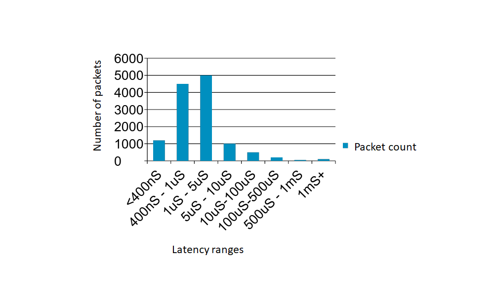
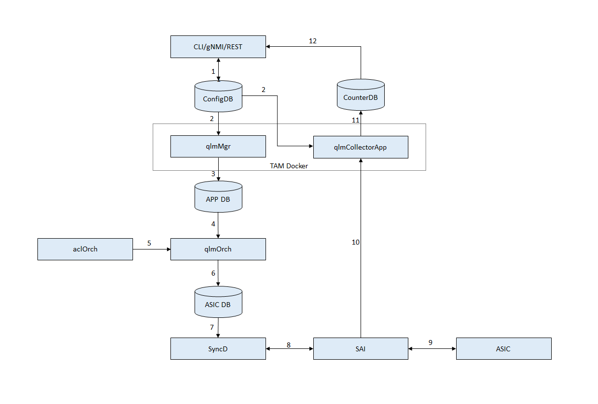
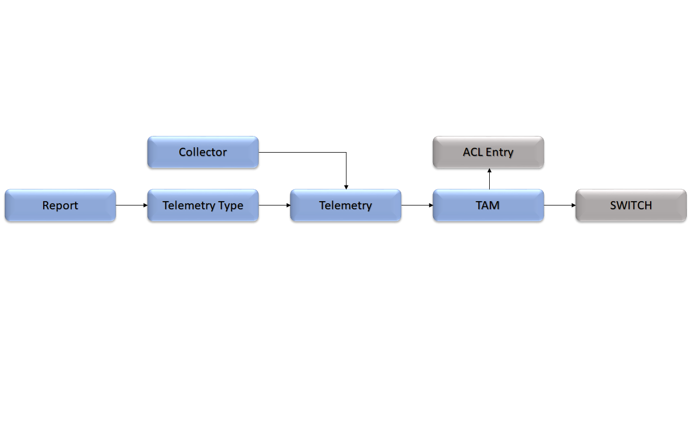

# Queue Latency Monitoring

## Highlevel Design Document

### Rev 0.1

# Table of Contents

- [Queue Latency Monitoring](#queue-latency-monitoring)
  - [Highlevel Design Document](#highlevel-design-document)
    - [Rev 0.1](#rev-01)
- [Table of Contents](#table-of-contents)
  - [List of Tables](#list-of-tables)
  - [Revision](#revision)
  - [About This Manual](#about-this-manual)
  - [Scope](#scope)
  - [Definition/Abbreviation](#definitionabbreviation)
    - [Table 1: Abbreviations](#table-1-abbreviations)
- [1 Feature Overview](#1-feature-overview)
  - [1.1 Requirements](#11-requirements)
    - [1.1.1 Functional Requirements](#111-functional-requirements)
    - [1.1.2 Configuration and Management Requirements](#112-configuration-and-management-requirements)
    - [1.1.3 Scalability Requirements](#113-scalability-requirements)
  - [1.2 Design Overview](#12-design-overview)
    - [1.2.1 Basic Approach](#121-basic-approach)
    - [1.2.2 Container](#122-container)
    - [1.2.3 SAI Overview](#123-sai-overview)
- [2 Functionality](#2-functionality)
  - [2.1 Target Deployment Use Cases](#21-target-deployment-use-cases)
  - [2.2 Functional Description](#22-functional-description)
- [3 Design](#3-design)
  - [3.1 Overview](#31-overview)
  - [3.1.1 qlmMgr](#311-qlmmgr)
  - [3.2 DB Changes](#32-db-changes)
    - [3.2.1 CONFIG DB](#321-config-db)
    - [3.2.2 APPL DB](#322-appl-db)
    - [3.2.3 STATE DB](#323-state-db)
    - [3.2.4 ASIC DB](#324-asic-db)
    - [3.2.5 COUNTER DB](#325-counter-db)
  - [3.3 Switch State Service Design](#33-switch-state-service-design)
    - [3.3.1 Orchestration Agent](#331-orchestration-agent)
    - [3.3.2 Other Process](#332-other-process)
  - [3.4 SyncD](#34-syncd)
  - [3.5 SAI](#35-sai)
  - [3.6 CLI](#36-cli)
    - [3.6.1 Data Models](#361-data-models)
    - [3.6.2 Configuration Commands](#362-configuration-commands)
      - [3.6.2.1 Activating and Deactivating Queue Latency Monitor](#3621-activating-and-deactivating-queue-latency-monitor)
      - [3.6.2.2 Setting up sessions for Queue Latency Monitoring](#3622-setting-up-sessions-for-queue-latency-monitoring)
    - [3.6.3 Show Commands](#363-show-commands)
      - [3.6.3.1 Listing the Queue Latency Monitor attributes](#3631-listing-the-queue-latency-monitor-attributes)
      - [3.6.3.2 Listing the Queue Latency Monitor latency ranges](#3632-listing-the-queue-latency-monitor-latency-ranges)
      - [3.6.3.3 Listing the Queue Latency Monitor sessions](#3633-listing-the-queue-latency-monitor-sessions)
    - [3.6.4 Sample Workflow](#364-sample-workflow)
    - [3.6.5 Debug Commands](#365-debug-commands)
    - [3.6.6 REST API Support](#366-rest-api-support)
- [4 Flow Diagrams](#4-flow-diagrams)
  - [4.1 Config call flow](#41-config-call-flow)
- [5 Error Handling](#5-error-handling)
  - [qlmMgr](#qlmmgr)
  - [qlmOrch](#qlmorch)
- [6 Serviceability and Debug](#6-serviceability-and-debug)
- [7 Warm Boot Support](#7-warm-boot-support)
- [8 Scalability](#8-scalability)
- [9 Unit Test](#9-unit-test)
  - [CLI](#cli)
- [Broadcom Internal Information : To be removed before publishing externally.](#broadcom-internal-information--to-be-removed-before-publishing-externally)
  - [Key notes](#key-notes)
  - [Specific Limitations](#specific-limitations)
  - [TBD](#tbd)
  - [Queue Latency Report format](#queue-latency-report-format)


## List of Tables

[Table 1: Abbreviations](#table-1-abbreviations)

## Revision

| Rev |     Date    |       Author       | Change Description                |
|---|-----------|------------------|-----------------------------------|
| 0.1 | 06/28/2021  | Yelamandeswara Rao  | Initial Version            |


## About This Manual

This document provides general information about the Queue Latency Monitor feature implementation in SONiC.

## Scope

The term Inband Telemetry refers to the set of technologies of the Switch, that embed useful metadata as part of packets that are transiting the Switch. SAI community defined a Telemetry and Monitoring specification that defines a unified interface - [TAM](https://github.com/opencomputeproject/SAI/tree/master/doc/TAM) - for provisioning and monitoring these technologies. Queue Latency Monitor feature is one such Inband Telemetry technologies.

The design as specified in this document uses the common [SONiC TAM](tam.hld) infrastructure.

This document describes the high level design of Queue Latency Monitor feature in SONiC.

## Definition/Abbreviation

### Table 1: Abbreviations

| **Term**                 | **Meaning**                         |
|--------------------------|-------------------------------------|
| SAI                      | Switch Abstraction Interface        |
| TAM                      | Telemetry and Monitoring            |
| QLM                      | Queue Latency Monitoring            |

# 1 Feature Overview
Latency is the residence time of a packet in the switch. The feature allows user to obtain Queue latency stats per queue/queue-group for a given pairs of ports or port-group. User can use the latency measurements to identify which paths are impacted by latency issues, for example from uplink port to downlink port.  User can also use the statistics to provide a Service Level Agreement (SLA) for latency intensive applications. ex:- Live video streaming, stock market tracker e.t.c


***Figure below shows the sample packet latencies of a queue in a given interval***




## 1.1 Requirements

### 1.1.1 Functional Requirements

1.0 Queue Latency Monitor feature allows user to configure a Queue Latency Monitor session on a given switch and send the latency-reports to local application. This session is defined by flow classifiers, Ingress and Egress ports  that are used to identify a flow and queues that needs to be monitored for latency.

2.0 Queue Latency Monitor provisioning as listed below.

- Latency ranges are predefined. QLM reports contain the number of packets whose latency falls in the given ranges on per queue basis.

- ACL configuration to identify a flow-group to monitor.

- interface group configuration to identify a set of ingress and egress ports to monitor.

- QLM session configuration is used to create a session with the given if-group, flow-group and report durarion. Duration indicates the time period at which this session's QLM reports are sent to application.

- QLM report contains a session's latency statistics for a given combination of source/destination ports on per queue basis. 

- QLM feature is by default de-activated on the switch, and requires an explicit user intervention to activate it in the configuration.

- If the QLM feature can't be supported/activated on the switch, any attempt to activate the feature returns appropriate failure.

- The QLM feature is supported on physical ports only.

- The QLM feature supports dynamic-port-breakout and aliasing features.

- The QLM feature will be a part of the TAM container along with other TAM features.

- An egress port can only be part of on if-group.

- An interface group (if-group) can only be part of a session


### 1.1.2 Configuration and Management Requirements

The TAM Queue Latency Monitor feature supports the new management framework and KLISH CLI for configuration. The following configuration and status information is available.

- To activate / de-activate the feature
- To create/clear appropriate Queue Latency Monitor configuration on per flow-group or per tam if-group basis and switch-wide.
- To display current status for the Queue Latency Monitor on a per session basis.

### 1.1.3 Scalability Requirements

- Number of Queue Latency Monitor sessions that can be supported is proportional to the availability of resources in hardware such as Latency Histogram Monitors. No specific constraints are imposed by application.
- Only local application/collector is supported.

## 1.2 Design Overview

### 1.2.1 Basic Approach

The Queue Latency Monitor feature is newly developed.

### 1.2.2 Container

A container called 'tam' exists as a container for all TAM applications, including the this application.

### 1.2.3 SAI Overview
The SAI TAM spec specifies the TAM APIs to be used to configure the TAM functionality. Please refer to SAI-Proposal-TAM2.0-v2.0.docx in [https://github.com/opencomputeproject/SAI/tree/master/doc/TAM](https://github.com/opencomputeproject/SAI/tree/master/doc/TAM) for more details.
- QLM feature is supported through the SAI extension attributes to the above spec. Following is list of attributes added as part of extension.
```
    SAI_TAM_TEL_TYPE_ATTR_QUEUE_LATENCY_STATS,
    SAI_TAM_TEL_TYPE_ATTR_FLOW_QUEUE_LATENCY_STATS,
    SAI_TAM_REPORT_ATTR_NUMBER_OF_BINS,
    SAI_TAM_REPORT_ATTR_BIN_BOUNDARY,
    SAI_TAM_REPORTING_UNIT_MILLI_SEC
    SAI_TAM_TELEMETRY_ATTR_ID,
    SAI_TAM_TELEMETRY_ATTR_ING_PORT_LIST,
    SAI_TAM_TELEMETRY_ATTR_EGR_PORT_LIST
```    
# 2 Functionality

## 2.1 Target Deployment Use Cases

Queue Latency Monitor is used to  monitor the switch for congestion and queue latency. Some of the key usecases are -

- Idenitfying the paths, ports, flows and queues that are undergoing unusual latency. Essentially Microburst monitoring. 
- SLA tracking

## 2.2 Functional Description

The Queue Latency Monitor feature monitors latency of all flows/particular flow between a set of ingress and egress ports. Latency Monitor reports latency stats on per queue and latency range basis for a given session. Reports are sent to collector/application at the rate of configured session duration. Reports format is protobuf.


# 3 Design

## 3.1 Overview

***Queue Latency Monitor Architecture***



The architecture of the Queue Latency Monitor feature in SONiC is illustrated in the diagram above.

1. CLI/gNMI/REST interface is used to configure the queue latency monitor feature functionality. Configuration is saved to CONFIG_DB.

2. qlmMgr and qlmCollectorApp picks the configuration from CONFIG_DB.

3. qlmMgr populates the APPL_DB qlm monitor tables appropriately.
   
4. qlmOrch picks the configuration from APPL_DB.
 
5. qlmOrch interacts with aclOrch for ACL related information.

6. qlmOrch programs the ASIC_DB via SAIREDIS calls.

7. Syncd picks the configuration from ASIC_DB.
   
8. Syncd configures SAI. 

9.  SAI configures HW. SAI collects the latency stats at regular intervals.
  
10. SAI sends report to the configured local qlmCollectorApp.

11. qlmCollectorApp writes the latency reports into counterDB. For every session qlmCollectorApp maintains last 30 seconds reports in the CounterDB

12. CLI/gNMI/REST is used to access the latency reports in the CounterDB.

   
## 3.1.1 qlmMgr

The qlmMgr runs in the TAM docker and is used to pass queue latency monitor configuration arriving from UI to qlmOrch. qlmMgr validates and collates information from CONFIG_DB  tables  IF_GROUP_TABLE and TAM_QLM_SESSION_TABLE. APPL_DB TAM_QLM_TABLE and TAM_QLM_SESSION_TABLE  are populated with a valid session configuration once all the required data is available.  

The qlmMgr configures the source and destination udp ports to be used between SAI and qlmCollectorApplication.

## 3.2 DB Changes

### 3.2.1 CONFIG DB


TAM\_QLM\_SESSIONS\_TABLE

    ;Defines TAM QLM session configuration in CONFIG_DB

    key = name                  ; name is session name and should be unique.
    if-group = 1*255VCHAR       ; interface group reference
    flow-group = 1*255VCHAR     ; Flow group reference
    interval  = 1*5DIGIT        ; Interval in seconds
    
    Example: 
    > keys *TAM_QLM_SESSIONS* 

    1) "TAM_QLM_SESSIONS_TABLE|S1" 

    > hgetall "TAM_QLM_SESSIONS_TABLE|S1"

    1) "if-group"
    2) "pg1"
    3) "flow-group"
    4) "websrvrflows"
    5) "interval"
    6) 2
    

### 3.2.2 APPL DB

TAM\_QLM\_TABLE

    ;Contains QLM feature status

    key                = global                 ; Only one instance and 
                                                ; has a fixed key ”global"
    status             = "enable"/"disable"     ; QLM status
    latency-ranges     = 16 * 64VCHAR           ; Array of latency ranges in string format, unit is ns

    Example:
    > keys *TAM_QLM_TABLE*
    1) "TAM_QLM_TABLE:global"

    > HGETALL "TAM_QLM_TABLE:global"
    1) "status"
    2) "enable"
    3) "latency-ranges"
    4) "0-1280, 1281-2360, 2361-4720, 4721-9440, 9441-12800, 12801-12864, 23600"

TAM\_QLM\_SESSIONS\_TABLE

    ;Defines a TAM QLM sessions configuration.

    key                = name                      ; Session name. Should be unique
    ingress-ports      = [0-max_ports]*port_name   ; List of ingress ports participating in this group
    egress-ports       = [0-max_ports]*port_name   ; List of egress ports participating in this group
    interval           = 1*5DIGIT                  ; Interval in seconds
    acl-table-name     = table-name                ; Parameter to map acl table to the flow.
    acl-rule-name      = rule-name                 ; Parameter to map acl rule to the flow.
    session-id         = 1*5DIGIT                  ; Session ID. Must be unique per session.

    ;value annotations
    max_ports     = 1*5DIGIT                ; number of ports supported on the chip
    port_name     = 1*64VCHAR               ; name of the port, must be unique
                                            ; port name can be Ethernetxxx
    Example:
    > keys *TAM_QLM_SESSIONS*
    1) "TAM_QLM_SESSIONS_TABLE:S1"

    > HGETALL "TAM_QLM_SESSIONS_TABLE:S1"
    1) "ingress-ports"
    2) "Ethernet1, Ethernet3"
    3) "egress-ports"
    4) "Ethernet4, Ethernet2"
    5) "interval"
    6) 2
    7) "acl-table-name"
    8) "table1"
    9) "acl-rule-name"
    10) "rule1"
    11) "session-id"
    12) 9
    


### 3.2.3 STATE DB

N/A

### 3.2.4 ASIC DB

N/A

### 3.2.5 COUNTER DB

    TAM_QLM_COUNTER_TABLE
		;Defines TAM QLM counter table
		key                = name                     ; unique key formed using the format session_name:index
		                                              ; session_name is name of the session
		                       											  ; index is the index of the record
		time-stamp         = %y-%m-%d - %H:%M:%S      ; time-stamp when the threshold breach occurred
		range              = 16 * 64VCHAR             ; Array of latency ranges in string format, unit is ns
	  stats              = 8 * 64VCHAR              ; Array of stats in string format
    
    Example:
    > keys *TAM_QLM_COUNTER*
    1) "TAM_QLM_COUNTER_TABLE:S1:1"

    > HGETALL "TAM_QLM_COUNTER_TABLE:S1:1"
    1) "time-stamp"
    2) "2021-07-06 - 02:50:44"
    3) "range"
    4) "0-1280, 1281-2360, 2361-4720, 4721-9440, 9441-12800, 12801-12864, 12865-23600"
    5) "stats"
    6) "5000, 9876, 434323, 4343235, 232356, 687, 0, 0"


## 3.3 Switch State Service Design

### 3.3.1 Orchestration Agent

A new orchestration agent class, qlmOrch is added to convert the incoming qlm configuration from APPL_DB to ASIC_DB configuration. qlmOrch subscribes to the TAM_QLM_SESSIONS_TABLE and TAM_QLM_TABLE and converts the incoming flow configuration into Queue latency monitor SAI configuration.

qlmOrch maintains data pertaining to all the currently configured sessions, flows and the associated TAM object bindings. TAM object bindings are re-used wherever possible.

Interaction with aclOrch is required to retrieve the SAI object ID associated with the queue latency monitor flow ACL rule.  

Queue latency monitor uses interval configuration for each session to collect stats periodically.

qlmOrch checks for support for the Queue Latency Monitor feature in the silicon using SAI capability API and sets the field `queue_latency_monitor_supported` to `True` in the `SWITCH_TABLE` of APPL_DB under the key `switch`.

### 3.3.2 Other Process

N/A

## 3.4 SyncD

N/A

## 3.5 SAI

The following attributes will be part of SAI extension.

    SAI_TAM_TEL_TYPE_ATTR_QUEUE_LATENCY_STATS,
    SAI_TAM_REPORT_ATTR_BIN_BOUNDARY,
    SAI_TAM_REPORTING_UNIT_MILLI_SEC
    SAI_TAM_TELEMETRY_ATTR_ID,
    SAI_TAM_TELEMETRY_ATTR_ING_PORT_LIST,
    SAI_TAM_TELEMETRY_ATTR_EGR_PORT_LIST


***Below diagram provides details about various TAM objects needed to support Queue Latency Monitor, and their correlation***



## 3.6 CLI

### 3.6.1 Data Models

The user facing data model is based on OpenConfig compatible TAM yang model. The backend data model (SONiC YANG) will use the formats in CONFIG_DB & APPL_DB. See above sections.

### 3.6.2 Configuration Commands

#### 3.6.2.1 Activating and Deactivating Queue Latency Monitor

The command syntax for activating/de-activating the feature on the switch is as follows:

```
sonic (config-tam-qlm)# [no] enable
```

- Deactivating Queue Latency Monitor will purge all Queue Latency Monitor configuration from the switch.
- QLM feature entry will be added to the TAM_FEATURE_TABLE in CONFIG_DB. Please refer to TAM_FEATURE_TABLE in tam HLD for more information.
  

#### 3.6.2.2 Setting up sessions for Queue Latency Monitoring 

A Queue Latency Monitoring session is associated a previously defined flow-group and if-group as described below.

- The Queue Monitor session must have a unique name for referencing.
- To monitor a specific flow, the flow-group must be previously created with the `flow-group` command (under `config-tam` hierarchy).
- A session can be created with out any flow-group association. In this case all the flows are monitored
- An if-group can be part of only one session.
- A session can be created with out any if-group. In this case all the ports are treated as ingress and egress ports
- Interval parameter is the time duration between periodic reports of a session, unit is milli seconds
-  Default value for interval is 100 milli secs
  

When a sesssion that is previously created is removed (with the `no` command), the associated flows and if-groups are no longer monitored for latencies by the switch. 

The following attribtes are supported for  Queue Latency Monitor sessions.

| **Attribute**                 | **Description**                         |
|--------------------------|-------------------------------------|
| `name`                   | A string that uniquely identifies the Queue Latency Monitor session            |
| `flow-group`             | Specifies the name of *flow-group* |
| `if-group`               | Specifies the name of the *if-group* |
| `interval`               | Interval used for periodic stats reporting, minimum is 100ms  |


The command syntax for creating /removing the sessions are as follows:

```
sonic(config-tam-qlm)# session <name> [flow-group <fg-name>] [if-group ] [interval <value>]

sonic (config-tam-dm)# no session <name>
```
- This command updates the TAM_QLM_SESSIONS_TABLE in CONFIG DB.

### 3.6.3 Show Commands

#### 3.6.3.1 Listing the Queue Latency Monitor attributes

The following command lists the switch-wide attributes that are in use.

```
sonic # show tam qlm
```
Sample usage shown below.

```
sonic # show tam qlm

Status             : Active


```

- This command refers to the TAM_FEATURE_TABLE for information. Refer to TAM HLD for more details. 

#### 3.6.3.2 Listing the Queue Latency Monitor latency ranges

The following command lists the details for all queue latency monitor latency ranges.

```
sonic # show tam qlm latency-ranges
```
Sample usage shown below.

```
sonic # show tam qlm latency-ranges
Num            latency-range(ns)
---------      -----------------------
1               (0 to 256)
2               (257 to 1024) 
....
....

```
- This command refers to the TAM_QLM_TABLE in APPL DB for information.

#### 3.6.3.3 Listing the Queue Latency Monitor sessions

The following command lists the details for all queue latency monitor sessions or for a specific session. Note that only explicitly configured tuples in the associated flow-group are displayed.

```
sonic # show tam qlm sessions [<name>]
```

Sample usage shown below.

```
sonic # show tam qlm sessions

Name           port-group          Flow Group           Interval
-----------    ----------------    --------------     -------------
http_236       P1                   tcp_port_236        3           
http_239       P2                   tcp_port_512        2
http_241       P3                   tcp_port_241        4


sonic # show tam qlm sessions http_236

Session            : http_236
Tam port Group Name: P1
   Ingress ports   : Ethernet1,Ethernet2
   Egress ports    : Ethernet3,Ethernet4
Flow Group Name    : tcp_port_236
   Id              : 4025
   Priority        : 100
   SRC IP          : 13.92.96.32
   DST IP          : 7.72.235.82
   DST L4 Port     : 236
Interval           : 300ms

Time-Stamp          Queue  range1 range2  range3  range4  range5 range6 range7 range8
----------          ----- ------- ------  ------  ------  ------ ------ ------ ------
2019-06-14:11:29:33  q0     1234   5674     9876   12      43     423    32    0 
2019-06-14:11:29:33  q1     2244   2356     1198   312      3       0     0    0
……………
2019-06-14:11:29:33  q7     22255   92354   3198   0        0       0     0    0
2019-06-14:11:29:36  q0     12244   22356   41198  700      0       0     0    0
…..
……………
2019-06-14:11:29:36  q7     1244    2256    4118   200      0       0     0    0

```

- The above output should be in chronological order.
- range1, range2 .. are latency ranges representing min and max values in nano seconds. ex:- range1 as 0-1024, range2 as 1025-4096 e.t.c 

- This command refers to TAM_QLM_SESSIONS_TABLE, TAM_IF_GROUP_TABLE, TAM_FLOWGROUP_TABLE in CONFIG DB and TAM_QLM_COUNTER_TABLE in COUNTER DB.
  
   
### 3.6.4 Sample Workflow

This section provides a sample Queue Latency Monitor workflow using CLI, for monitoring the queue latency as described below.

> Need to monitor queue latency for all the flows destined for the webserver running at 20.20.1.1 and  are ingressing on Ethernet3 and egressing on Ethernet45. Need to collect the latency monitoring reports for every 900ms periodically   

Note that there would be other system wide configuration that is not covered in the sample workflow below, but would be required for the packet forwarding/routing.

```

; create the flow-group

sonic (config-tam)# flow-group websrvflows dst-ip 20.20.1.1 dst-l4-port 80 protocol 6 

; Enable Queue Latency Monitor on the switch

sonic (config-tam-qlm)# enable

; Create if-group

sonic (config-tam)# if-group P1

# associate the ingress interface to the interface group

sonic (config) # interface Ethernet 3
sonic (config-if-Ethernet3)# if-group P1 direction ingress


# associate the egress interface to the interface group

sonic (config) # interface Ethernet 45
sonic (config-if-Ethernet45)# if-group P1 direction egress

; Create the queue latency monitoring session

sonic(config-tam-qlm)# session webflowmonitor if-group P1 flow-group websrvflows interval 900

```

### 3.6.5 Debug Commands
N/A

### 3.6.6 REST API Support
N/A
 
# 4 Flow Diagrams

## 4.1 Config call flow

All the configuration is stored in the CONFIG_DB via the management framework.
Please refer to [3.1 Overview](#31-overview) for more inoformation.

# 5 Error Handling

## qlmMgr

Any mismatch in the CONFIG_DB and APPL_DB schema for qlm flows will be flagged/logged appropriately.

## qlmOrch

SAI errors will be captured via the error handling framework and handled appropriately. All errors arising out of processing of incoming queue latency monitoring configuration will be captured via syslogs.

# 6 Serviceability and Debug

Logging of errors and invalid parameters will be done at each level allowing a hierarchical view of failures arising out of mis-configuration or system errors. 

# 7 Warm Boot Support

No special handling is done for the warm boot case. The TAM configuration is restored from the Config DB and TAM functionality will continue to work as it is through a warm boot.

# 8 Scalability

N/A

# 9 Unit Test

## CLI

  1.	Verify that CLI handlers throw errors for QLM config CLIs when the underlying platform does not support QLM feature.
  2.	Verify that the input parameters provided to CLI are validated for ranges and validity.
  3.	Verify that the successful execution of CLI results in a CONFIG_DB entry for the config commands.
  4.	Verify the schema of QLM tables in CONFIG_DB when the CLI commands are executed successfully.
  5.	Verify that no entry is populated in CONFIG_DB when CLI execution fails.
  6.	Verify that CLI no command for removing the configuration can be executed successfully.
  7.	Verify that show commands show up the correct configured parameters and stats appropriately.


# Broadcom Internal Information : To be removed before publishing externally.

## Key notes

* Queue Latency Monitor feature is an *advanced* feature that is not available in all the Broadcom SONiC packages.

## Specific Limitations

Queue Latency Monitor feature in SONiC inherits the limitations of the underlying hardware. These are listed below.

1. Only a single local collector is supported
2. Queue Latency Monitor is supported on TH3 and TH4 platforms only.
3. Supports only 4 sessions
4. One egress port can be part of one if-group only.
5. One if-group can be part of one session only.
6. flow-group based monitoring is currently not supported in this release.

## TBD
Command to configure time duration that defines how long a latency report's data has to be maintained in the system.

## Queue Latency Report format

The Queue latency report is encoded in protobuf format as provided below.

```protobuf

/*
     * Copyright (c) 2017 Broadcom. The term "Broadcom" refers
     * to Broadcom Limited and/or its subsidiaries.

     * Licensed under the Apache License, Version 2.0 (the "License");
     * you may not use this file except in compliance with the License.

     * You may obtain a copy of the License at
     * http://www.apache.org/licenses/LICENSE-2.0

     * Unless required by applicable law or agreed to in writing, software
     * distributed under the License is distributed on an "AS IS" BASIS,
     * WITHOUT WARRANTIES OR CONDITIONS OF ANY KIND, either express or implied.
     * See the License for the specific language governing permissions and
     * limitations under the License.
     */

    syntax = "proto2";

    message PortOidList {
        repeated uint64 objId = 1;
    }

    enum QLMType {
        PORT_QUEUE_STATS = 1;
        PORT_QUEUE_FLOW_STATS = 2;
    }

    message latencyStat {
        required uint64 number_of_packets = 1; //number of packets
    }

    message latencyInfo {
        optional string latency_min = 1; // latency min value
        optional string latency_max = 2; // latency max value
        required latencyStat stats = 3;
    }

    message QueueLatencyStatistics {
        required uint32 queue = 1; //Queue number
        repeated latencyInfo latency_info = 2;
    }
        
    message QueueLatencyMonitorInfo {
        required uint64 timestamp  = 1;
        required uint32 id = 2;   //Monitor id
        optional PortOidList ing_port_oid_list = 3; //Array of ingress port oids
        optional PortOidList egr_port_oid_list = 4; //Array of egress port oids
        required QLMType type = 5; // Monitor type
        repeated QueueLatencyStatistics = 6;
    }

