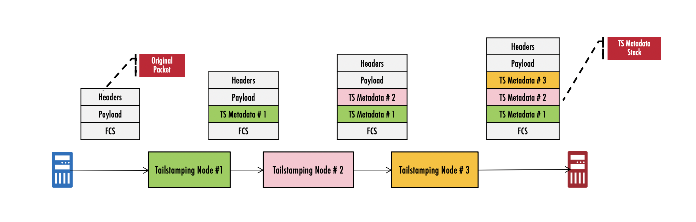

# Tailstamping

## Highlevel Design Document

### Rev 0.1

# Table of Contents

- [Tailstamping](#tailstamping)
  * [Highlevel Design Document](#highlevel-design-document)
    + [Rev 0.1](#rev-01)
- [Table of Contents](#table-of-contents)
  * [List of Tables](#list-of-tables)
  * [Revision](#revision)
  * [About This Manual](#about-this-manual)
  * [Scope](#scope)
  * [Definition/Abbreviation](#definition-abbreviation)
    + [Table 1: Abbreviations](#table-1--abbreviations)
- [1 Feature Overview](#1-feature-overview)
  * [1.1 Requirements](#11-requirements)
    + [1.1.1 Functional Requirements](#111-functional-requirements)
    + [1.1.2 Configuration and Management Requirements](#112-configuration-and-management-requirements)
    + [1.1.3 Scalability Requirements](#113-scalability-requirements)
  * [1.2 Design Overview](#12-design-overview)
    + [1.2.1 Basic Approach](#121-basic-approach)
    + [1.2.2 Container](#122-container)
    + [1.2.3 SAI Overview](#123-sai-overview)
- [2 Functionality](#2-functionality)
  * [2.1 Target Deployment Use Cases](#21-target-deployment-use-cases)
  * [2.2 Functional Description](#22-functional-description)
- [3 Design](#3-design)
  * [3.1 Overview](#31-overview)
  * [3.2 DB Changes](#32-db-changes)
    + [3.2.1 CONFIG DB](#321-config-db)
    + [3.2.2 APP DB](#322-app-db)
    + [3.2.3 STATE DB](#323-state-db)
    + [3.2.4 ASIC DB](#324-asic-db)
    + [3.2.5 COUNTER DB](#325-counter-db)
  * [3.3 Daemons](#33-daemons)
  * [3.4 Switch State Service Design](#34-switch-state-service-design)
    + [3.4.1 Orchestration Agent](#341-orchestration-agent)
    + [3.4.2 Other Process](#342-other-process)
  * [3.5 SyncD](#35-syncd)
  * [3.6 SAI](#36-sai)
  * [3.7 CLI](#37-cli)
    + [3.7.1 Data Models](#371-data-models)
    + [3.7.2 Configuration Commands](#372-configuration-commands)
      - [3.7.2.1 Activating and Deactivating Tailstamping](#3721-activating-and-deactivating-tailstamping)
      - [3.7.2.2 Setting up flows for monitoring with Tailstamping](#3722-setting-up-flows-for-monitoring-with-tailstamping)
    + [3.7.3 Show Commands](#373-show-commands)
      - [3.7.3.1 Listing the TS attributes](#3731-listing-the-ts-attributes)
      - [3.7.3.1 Listing the Tailstamping sessions](#3731-listing-the-tailstamping-sessions)
    + [3.7.5 Debug Commands](#375-debug-commands)
    + [3.7.6 REST API Support](#376-rest-api-support)
- [4 Flow Diagrams](#4-flow-diagrams)
  * [4.1 Config call flow](#41-config-call-flow)
- [5 Error Handling](#5-error-handling)
  * [CLI](#cli)
  * [TSOrch](#tsorch)
- [6 Serviceability and Debug](#6-serviceability-and-debug)
- [7 Warm Boot Support](#7-warm-boot-support)
- [8 Scalability](#8-scalability)
- [9 Unit Test](#9-unit-test)
  * [CLI](#cli-1)
- [Broadcom Internal Information : To be removed before publishing externally.](#broadcom-internal-information---to-be-removed-before-publishing-externally)
  * [Key notes](#key-notes)
  * [Specific Limitations](#specific-limitations)

## List of Tables

[Table 1: Abbreviations](#table-1-abbreviations)

## Revision

| Rev |     Date    |       Author       | Change Description                |
|---|-----------|------------------|-----------------------------------|
| 0.1 | 07/01/2020  | Bandaru Viswanath  | New draft for SONiC Tailstamping feature            |

## About This Manual

This document provides general information about the Tailstamping feature implementation in SONiC.

## Scope

The term Inband Telemetry refers to the set of technologies of the Switch, that embed useful metadata as part of packets that are transiting the Switch. SAI community defined a Telemetry and Monitoring specification that defines a unified interface - [TAM](https://github.com/opencomputeproject/SAI/tree/master/doc/TAM) - for provisioning and monitoring these technologies. Tailstamping feature is one such Inband Telemetry technologies.

The design as specified in this document uses the common [SONiC TAM](tam.hld) infrastructure.

This document describes the high level design of Tailstamping feature in SONiC.

## Definition/Abbreviation

### Table 1: Abbreviations

| **Term**                 | **Meaning**                         |
|--------------------------|-------------------------------------|
| SAI                      | Switch abstraction interface        |
| TAM                      | Telemetry and monitoring            |
| TS                   | Tailstamping             |
| CRC                      | Cyclic Redundancy Check             |
| MAC                      | Media Access Control                |

# 1 Feature Overview

Tailstamping feature attaches arrival and departure timestamps along with a switch identifier to a frame at one or more switches along a flow path across the network for a given set of flows matching the user provided criterion. Time-stamps can be gathered and analyzed by a designated collector. A network monitoring application can analyze the time-stamps and measure the latency of a flow across the network, trace packets across a path, detect hotspots points and validate arrival sequence.

The Tailstamping feature in SONiC allows the user to setup flow monitoring sessions for specific flows.

## 1.1 Requirements

### 1.1.1 Functional Requirements

1.0 Tailstamping feature allows user to enable time stamping on a per flow and per port basis.

1.1 Ingress and Egress timestamps are added at the end of frames.

1.2 Ingress and Egress timestamps are in 1588 Time-of-Day format (UTC time).

1.3 The presence of any tailstamping headers in the packet must not affect forwarding or processing of the packet in downstream devices, including those that do not support the timestamping feature.

1.4 Timestamping packet format is not covered by any standards and is Broadcom proprietary.

2.0 Tailstamping feature needs configuration as mentioned below.

2.1 TAM swith identifier to uniquely identify a device in network and to insert as part of the metadata.

2.2 TAM flowgroup configuration to identify a flow that should be tagged with tailstamping metadata.

3.0 UI commands available to configure Tailstamping configuration.

3.1 UI commands available to show Tailstamping configuration, status and statistics.

3.2 UI commands available to clear Tailstamping configuration.

4.0 The maximum number of Tailstamping sessions are platform dependent.

4.1 The maximum packet length supported by Tailstamping is platform dependent.

4.2 Frames received by CPU are ingress time-stamped if the frame matches the user provided flow criterion.

5.0 Tailstamping feature is by default not active on the switch, and requires an explicit user intervention to activate it in the configuration.

5.1 If the  feature can't be supported/activated on the switch, any attempt to activate the feature returns appropriate failure.

6.0 The Tailstamping feature is supported on physical and LAG ports.

6.1 The Tailstamping feature supports dynamic-port-breakout and aliasing features.

7.0 The Tailstamping feature will be a part of the TAM container along with other TAM features.

### 1.1.2 Configuration and Management Requirements

The TAM Tailstamping feature supports the new management framework and KLISH CLI for configuration. The following configuration and status information is available.

- To activate / de-activate Tailstamping feature
- To create/clear appropriate Tailstamping configuration on a per-flow group basis.
- To display current status and statistics for the Tailstamping on a per flow-group basis.

### 1.1.3 Scalability Requirements

- Number of Tailstamping sessions that can be supported is proportional to the availability of resources in hardware such as ACLs. No specific constraints are imposed.

## 1.2 Design Overview

### 1.2.1 Basic Approach

The Tailstamping feature is newly developed.

### 1.2.2 Container

A container called 'tam' exists as a container for all TAM applications, including the TS application.

### 1.2.3 SAI Overview

The SAI TAM spec specifies the TAM APIs to be used to configure the TAM functionality. Please refer to SAI-Proposal-TAM2.0-v2.0.docx in [https://github.com/opencomputeproject/SAI/tree/master/doc/TAM](https://github.com/opencomputeproject/SAI/tree/master/doc/TAM) for more details.

# 2 Functionality

## 2.1 Target Deployment Use Cases

Tailstamping is used to proactively monitor the network for faults and performance bottlenecks, it aids in detecting data plane faults and isolating them to a given device or location and assists in planning network capacity and projecting future load. Some of the key usecases are -

- SLA conformance that require end-to-end path latency for targeted flows
- Idenitfying switches and flows that are undergoing congestion
- Identifying network bandwidth usage patterns
- Packet path and path change analysis

The mechanism to direct the tail-stamped packets to a collector is not part of this feature. User should use appropriate means to direct the tail-timestamped packets to a collector. For example, user can configure a ACL matching the tail-timestamped packets and configure the ACL action as mirror/redirect.

## 2.2 Functional Description

The Tailstamping feature in SONiC allows the user to setup flow monitoring sessions for specific flows. The switch adds the tailstamping metadata for the matching flows, towards the end of the ethernet packet, right infront of the CRC.


***Example topology illustrating the packet paths and tailstamping metadata***



# 3 Design

## 3.1 Overview

***Tailstamping Architecture***


The above diagram illustrates the architecture of the Tailstamping feature within SONiC.

Below is the call flow sequence specified in above architecture diagram : 

1 TS and Flowgroup configuration from CLI is saved to CONFIG DB.

2 TS Manager reads configuration from CONFIG DB, processes and validates the configuration.

3 ACL Manager reads ACL configuration from CONFIG DB, processes and validates ACL configuration.

4 TS Manager updates valid TS configuration to APPL DB.

5 ACL Manager updates valid ACL configuration to APPL DB.

6 TS ORCH reads TS configuration from APPL DB and creates/deletes TAM INT TS objects.

7 ACL ORCH reads ACL configuration from APPL DB.

8 ACL ORCH notifies TS ORCH about ACL rule creation/deletion.

9 TS ORCH checks for ACL table and ACL rule specified in TS configuration.

10 TS ORCH attaches/detaches the TAM INT (IFA1_TS) object to/from ACL ENTRY.

11 ACL ORCH will make SAI API calls to update ASIC DB.

12,13,14 SYNCD reads TS and ACL information from ASIC DB and configures ASIC accordingly.

A CLI reads TS ACL counters from COUNTER DB and displays it as output of show commands.

## 3.2 DB Changes

### 3.2.1 CONFIG DB

TAM\_TAILSTAMPING\_TABLE

    ;Defines TAM TS configuration in CONFIG_DB

    key = name                  ; name is collector name and should be unique. 
    flowgroup = 1*255VCHAR      ; Flow group reference

    Example: 
    > keys *TAM_TAILSTAMPING* 

    1) "TAM_TAILSTAMPING_TABLE|sla1" 

    > hgetall "TAM_TAILSTAMPING_TABLE|sla1"

    1) "flowgroup"
    2) "slaflows"

### 3.2.2 APP DB

TAM\_TAILSTAMPING\_TABLE

    ;Defines TS flow configuration

    key            = name       ; name is flow name and should be unique.
    acl-table-name = table-name ; Parameter to map to acl table to the flow.
    acl-rule-name  = rule-name  ; Parameter to map to acl rule to the flow.

    Example:
    > KEYS *TAM__TAILSTAMPING_TABLE*
    1) "TAM__TAILSTAMPING_TABLE:F1"

    > HGETALL TAM__TAILSTAMPING_TABLE:F1
    1)  "acl-table-name"
    2)  "T1"
    3)  "acl-rule-name"
    4)  "R1"

### 3.2.3 STATE DB

N/A

### 3.2.4 ASIC DB

The ASIC DB is updated by SAI REDIS upon invocation of SAI REDIS APIs by TSOrch.

### 3.2.5 COUNTER DB

N/A

## 3.3 Daemons

TS manager daemon runs as part of TAM docker. TS manager processes TS configuration from CONFIG DB, validates for consistency and completeness of TS configuration and updates valid S configuration to APPL DB.

## 3.4 Switch State Service Design

### 3.4.1 Orchestration Agent

A new orchestration agent class, TSOrch is added to convert the incoming config to ASIC configuration. TSOrch subscribes to the TS tables of APPL DB and converts the configuration to the SAI TAM API call sequence described in section 3.6.

TSOrch maintains data pertaining to all the currently configured TS entities and the associated TAM object bindings. TAM object bindings are re-used wherever possible.

### 3.4.2 Other Process

N/A

## 3.5 SyncD

N/A

## 3.6 SAI

The SAI TAM API spec defines all TAM APIs supported in SAI. Please refer to SAI-Proposal-TAM2.0-v2.0.docx in [https://github.com/opencomputeproject/SAI/tree/master/doc/TAM](https://github.com/opencomputeproject/SAI/tree/master/doc/TAM) for more details.

Tailstamping feature is accomplished by attaching a SAI TAM INT object to SAI ACL entry. Below diagram provides details about how the SAI ACL object and SAI TAM objects are stitched.


***Below diagram provides details about various TAM objects needed to support TS and their correlation***


## 3.7 CLI

### 3.7.1 Data Models

The user facing data model is based on OpenConfig TAM yang model (TBD). The backend data model (SONiC YANG) will use the formats in CONFIG_DB & STATE_DB. See above sections.

### 3.7.2 Configuration Commands

#### 3.7.2.1 Activating and Deactivating Tailstamping

The command syntax for activating/de-activating the Tailstamping feature on the switch is as follows:

```
sonic (config-tam-ts)# [no] enable
```


Deactivating TS will purge all associated configuration from the switch.

#### 3.7.2.2 Setting up flows for monitoring with Tailstamping

A Tailstamping monitoring session associated a previously defined flow-group, with TS as described below.

- The monitoring session must have a unique name for referencing.
- The flow-group must be previously created with the `flow-group` command (under `config-tam` hierarchy).

When a sesssion that is previously created is removed (with the `no` command), the associated flows are no longer processed for TS by the switch. 

The following attribtes are supported for Tailstamping sessions.

| **Attribute**                 | **Description**                         |
|--------------------------|-------------------------------------|
| `name`               | A string that uniquely identifies the TS session        |
| `flowgroup`            | Specifies the name of *flow-group* |

The command syntax for creating /removing the sessions are as follows:

```
sonic(config-tam-ts)# session <name> flowgroup <fg-name> 

sonic (config-tam-ts)# no session <name>
```

### 3.7.3 Show Commands

#### 3.7.3.1 Listing the TS attributes

The following command lists the switch-wide attributes that are in use.

```
sonic # show tam tail-stamping 
```
Sample usage shown below.

```
sonic # show tam tail-stamping

Status             : Active
Switch ID          : 2020

```

#### 3.7.3.1 Listing the Tailstamping sessions

The following command lists the details for all tail-stamping sessions or for a specific session. Note that only explicitly configured tuples in the associated flow-group are displayed.

```
sonic # show tam tail-stamping sessions [<name>]
```

Sample usage shown below.

```
sonic # show tam tail-stamping sessions

Name           Flow Group
-----------    ----------------  
http_236       tcp_port_236
http_239       tcp_port_239
http_241       tcp_port_241

sonic # show tam tail-stamping sessions http_236

Session            : http_236
Flow Group Name    : tcp_port_236
   SRC IP          : 13.92.96.32
   DST IP          : 7.72.235.82
   DST L4 Port     : 236
Packet Count       : 7656

```

### 3.7.5 Debug Commands
N/A

### 3.7.6 REST API Support

The following REST API are supported - 

- BroadView REST API for TS feature
    - TBD : Provide reference and listlimitations 
- REST API as obtained from the openconfig-tam module defintions
    - TBD List these 
 
 # 4 Flow Diagrams

## 4.1 Config call flow

All the configuration is stored in the CONFIG_DB via the management framework.

# 5 Error Handling

## CLI

* CLI configuration sanity will be enforced by the CLI handler & CVL and any invalid configuration is rejected. An error is displayed to the user notifying the reason for rejection of the configuration.

## TSOrch

- Any error occurring in the orchestration agent is logged appropriately via SWSS logging.
- Errors or failures of SAI APIs will be logged by TSOrch.
- On failure of a SAI TAM API in the config sequence of section 3.6, the previously configured steps will be rolled back i.e previously created intermediate TAM objects for TS etc will be destroyed.

# 6 Serviceability and Debug

N/A

# 7 Warm Boot Support

No special handling is done for the warm boot case. The TAM configuration is restored from the Config DB and TAM functionality will continue to work as it is through a warm boot.

# 8 Scalability

N/A

# 9 Unit Test

## CLI

TBD

# Broadcom Internal Information : To be removed before publishing externally.

## Key notes

1. Tailstamping feature in the dataplane is completely supported in the silicon. 

2. Switches which have Tailstamping feature can be used as intermediate nodes in an IFA deployments, where the ingress and egress nodes run IFA. The IFA firmware on the egress nodes is capable of extracting the TS metadata from the end of the packet and present a unified metadata stack to the collector. 

3. Tailstamping feature is an *advanced* feature that is not available in all the Broadcom SONiC packages.

4. Tailstamping metadata format varies slightly based on silicon, while being compatible with each other. The specific formats are documented in appropriate silicon documentation.

## Specific Limitations

Tailstamping feature inherits the  usage constraints from the underlying hardware. These are listed below.

1. Only TCP and UDP traffic can be timestamped.
2. Timestamp is not part of the L3 packet. Any checks that assume the L3+ packet length field represents the total frame length will not be accurate.
3. Systems that need to subject packets to such checks must disable timestamping for the corresponding system, port or flow.
4. Header length fields or checksum fields(e.g UDP checksum) will not be updated upon insertion of the timestamp.
5. IEEE 802.3 frames(e.g SNAP LLC) are not supported.
6. No switches across the timestamping path should do pad stripping or otherwise adjust frame content based on the IP header payload/total length fields for Ethernet II frames.
7. Platforms using the HiGig2 extension header cannot coexist with packet timestamping.
