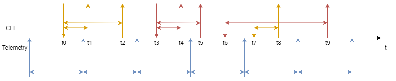
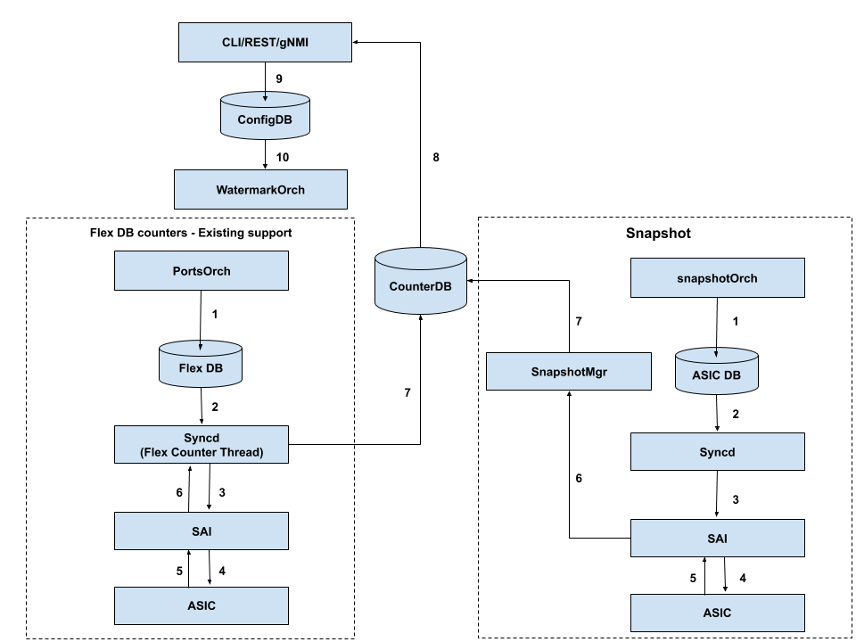

# Watermark counters in SONiC

# High Level Design Document

### Rev 0.2
- [Watermark counters in SONiC](#watermark-counters-in-sonic)
- [High Level Design Document](#high-level-design-document)
    - [Rev 0.2](#rev-02)
- [List of Tables](#list-of-tables)
- [Revision](#revision)
- [About this Manual](#about-this-manual)
- [Scope](#scope)
- [Definitions/Abbreviation](#definitionsabbreviation)
  - [Table 2: Abbreviations](#table-2-abbreviations)
- [1 Overview](#1-overview)
  - [1.1 System Chart](#11-system-chart)
  - [1.2 Modules description](#12-modules-description)
    - [1.2.1 gRPC](#121-grpc)
    - [1.2.2 Counter DB](#122-counter-db)
    - [1.2.3 Orchestration Agent](#123-orchestration-agent)
    - [1.2.4 SAI Redis](#124-sai-redis)
    - [1.2.5 ASIC DB](#125-asic-db)
    - [1.2.6 syncd](#126-syncd)
    - [1.2.7 SAI (Redis and Switch)](#127-sai-redis-and-switch)
- [2 Requirements](#2-requirements)
  - [2.1 Watermark counters requirements](#21-watermark-counters-requirements)
  - [2.2 Requirements for snapshot feature](#22-requirements-for-snapshot-feature)
  - [2.3 Watermark Snapshot UI support using new management framework](#23-watermark-snapshot-ui-support-using-new-management-framework)
  - [2.4 Add buffer pool watermark support](#24-add-buffer-pool-watermark-support)
- [3 Modules Design](#3-modules-design)
  - [3.1 Modules that need to be updated](#31-modules-that-need-to-be-updated)
    - [3.1.1 Counter DB](#311-counter-db)
    - [3.1.2 CLI](#312-cli)
      - [3.1.2.1 CLI show](#3121-cli-show)
      - [3.1.2.2 CLI clear](#3122-cli-clear)
      - [3.1.2.3 Show/configure telemetry interval](#3123-showconfigure-telemetry-interval)
    - [3.1.3 Lua plugins](#313-lua-plugins)
    - [3.1.4 SWSS](#314-swss)
    - [3.1.5 SAI Redis](#315-sai-redis)
    - [3.1.6 CONFIG DB](#316-config-db)
    - [3.1.7 Syncd](#317-syncd)
    - [3.1.8 SAI](#318-sai)
    - [3.1.9 gRPC](#319-grpc)
  - [3.2 Design of snapshot feature](#32-design-of-snapshot-feature)
  - [3.3. Design diagram of Snapshot feature](#33-design-diagram-of-snapshot-feature)
  - [3.4. Modules needing update for snapshot feature](#34-modules-needing-update-for-snapshot-feature)
    - [3.4.1 Counter DB](#341-counter-db)
    - [3.4.2 CLI](#342-cli)
    - [3.4.3 LUA scripts and plug-ins](#343-lua-scripts-and-plug-ins)
    - [3.4.4 SWSS](#344-swss)
    - [3.4.4 SAI](#344-sai)
- [4 Flows](#4-flows)
  - [4.1 Watermark general flow](#41-watermark-general-flow)
  - [4.2 Resetting the telemetry period flow](#42-resetting-the-telemetry-period-flow)
  - [4.3 Cli flow](#43-cli-flow)
  - [4.4 UI flow via new management framework](#44-ui-flow-via-new-management-framework)
- [5 Error Handling](#5-error-handling)
- [6 Serviceability And Debug](#6-serviceability-and-debug)
- [7 Unit Test cases (Watermark using snapshot)](#7-unit-test-cases-watermark-using-snapshot)
  - [7.1 SnapshotOrch](#71-snapshotorch)
  - [7.2 SnapshotMgr](#72-snapshotmgr)
  - [7.3 Functional Tests](#73-functional-tests)

# List of Tables

  - [Table 1: Revision](#revision)
  - [Table 2: Abbreviations](#definitionsabbreviation)
  - [Table 3: COUNTERS\_DB Table details](#table-details)
  - [Table 4: Virtual paths](#virtual-paths)

# Revision

| Rev | Date |     Author      | Change Description |
|:---:|:----:|:---------------:|--------------------|
| 0.1 |      |  Mykola Faryma  | Initial version    |
| 0.2 |      | Shirisha Dasari | Snapshot Addition  |

# About this Manual

This document provides general information about the watermark feature
implementation in SONiC.

# Scope

This document describes the high level design of the watermark feature.

# Definitions/Abbreviation

## Table 2: Abbreviations

| Definitions/Abbreviation | Description                        |
|--------------------------|------------------------------------|
| gRPC                     | gRPC Remote Procedure Calls        |
| gNMI                     | gRPC Network Management Interface  |
| API                      | Application Programmable Interface |
| SAI                      | Switch Abstraction Interface       |

# 1 Overview

## 1.1 System Chart

Following diagram describes a top level overview of the architecture:


## 1.2 Modules description

### 1.2.1 gRPC

System data telemetry infrastructure. Basically allows to getRequest
data from SONiC DBs (and more).

### 1.2.2 Counter DB

Located in the Redis DB instance \#2 running inside the container
"database". Redis DB works with the data in format of key-value tuples,
needs no predefined schema and holds various counters like port
counters, ACL counters, etc.

### 1.2.3 Orchestration Agent

This component is running in the "orchagent" docker container and is
responsible for processing updates of the APP DB and do corresponding
changes in the SAI DB via SAI Redis.

### 1.2.4 SAI Redis

SAI Redis is an implementation of the SAI API which translates API calls
into SAI objects which are stored in the ASIC DB.

### 1.2.5 ASIC DB

Redis DB instance \#1. Holds serialized SAI objects.

### 1.2.6 syncd

Reads SAI DB data (SAI objects) and performs appropriate calls to Switch
SAI.

### 1.2.7 SAI (Redis and Switch)

An unified API which represent the switch state as a set of objects. In
SONiC represented in two implementations - SAI DB frontend and ASIC SDK
wrapper.

# 2 Requirements

The following watermarks should be supported:

## 2.1 Watermark counters requirements

|                                                                                             | SAI attribute mapping                                             |
|---------------------------------------------------------------------------------------------|-------------------------------------------------------------------|
| Ingress headroom per PG                                                                     | SAI\_INGRESS\_PRIORITY\_GROUP\_STAT\_XOFF\_ROOM\_WATERMARK\_BYTES |
| Ingress shared pool occupancy per PG                                                        | SAI\_INGRESS\_PRIORITY\_GROUP\_STAT\_SHARED\_WATERMARK\_BYTES     |
| Egress shared pool occupancy per queue (including both unicast queues and multicast queues) | SAI\_QUEUE\_STAT\_SHARED\_WATERMARK\_BYTES                        |

System behavior: We consider a maximum of one regular user and a maximum
of one special user that comes from streaming telemetry (grpc)

Streaming telemetry is only interested in periodic watermark, i.e., it
queries the watermark at regular intervals. The interval is
configurable. Streaming telemetry does not care about persistent
watermark. Regular user is able to query the watermark. Regular user is
able to reset the watermark. When the watermark is reset, watermark
starts a new recording from the time reset is issued. Regular user is
able to query the persistent watermark. Regular user is able to reset
the persistent watermark. When the persistent watermark is reset,
persistent watermark starts a new recording from the time reset is
issued.

When one regular user and the streaming telemetry coexist, they do not
interfere with each other. Their behaviors stay the same as described
above. So the software should be able to handle the following situations
and return the correct watermark values to each user:



t0 - clear user watermark event

t1 - show user watermark event. Shows highest watermark value for the
period t0-t1

t2 - show user watermark event. Shows highest watermark value for the
period t0-t2

t3 - clear persistent watermark event

t4 - show persistent watermark event. Shows highest watermark value for
the period t3-t4

t5 - show persistent watermark event. Shows highest watermark value for
the period t3-t5

t6 - clear persistent watermark event

t7 - clear user watermark event

t8 - show user watermark event. Shows highest watermark value for the
period t7-t8

t9 - show persistent watermark event. Shows highest watermark value for
the period t6-t9

## 2.2 Requirements for snapshot feature

The flex counter approach of retrieving HW counters sequentially, that is used by the watermark feature, does not allow the user to accurately co-relate all the buffer usage statistics at a particular instant. It may be useful for a network application or administrator to be able to get a bird’s eye view of all the supported buffer counters at a particular instant. This enables the user to co-relate the buffer usage statistics with specific network events. The snapshot feature provides this functionality by exporting buffer usage statistics collected in one shot into a protobuf. The protobufs are processed and counters populated into COUNTERS_DB. From here-on, the watermark tables are generated from the COUNTERS_DB data with the help of Lua plugins. The snapshot feature requirements are captured below:

  - Snapshot feature integration into SONIC should not change the user experience of watermark CLI/gnmi etc. for the end-user.

  - The snapshot feature must only change the mechanism of retrieving HW counters leaving rest of the watermark functionality intact.

  - Once the COUNTERS_DB is updated with data from protobuf, the flow remains common for existing watermark and snapshot feature.

  - Snapshot feature must implement a snapshotmgr that decodes the incoming protobuf reports and populates COUNTERS_DB with stats.

  - SnapshotOrch and other orch changes must take care of:

    - Determining snapshot support on the platform.
    - Disabling existing flex counter programming to avoid counter read via flex counter approach in syncd.
    - Setup snapshot configuration so that snapshotmgr receives protobufs with counters.

  - Additional mechanism for an on-demand snapshot should be supported. This should trigger the system to collect and update the COUNTERS\_DB once the user executes the CLI.

  - Snapshot periodic interval is configurable and should be made available via an enhanced watermark CLI.

## 2.3 Watermark Snapshot UI support using new management framework

As new management framework is in place in community baseline so, UI of watermark (using snapshot) should be supported using new management framework. 

## 2.4 Add buffer pool watermark support

Following is the PR for buffer pool watermark support:
<https://github.com/Azure/sonic-swss/pull/853>

# 3 Modules Design

## 3.1 Modules that need to be updated

### 3.1.1 Counter DB

**The following new Queue counters should be available for each queue entry in the DB:**

  - "COUNTERS:queue\_vid"
      - SAI\_QUEUE\_STAT\_SHARED\_WATERMARK\_BYTES

**For every Ingress PG the following should be available in the DB:**

  - "COUNTERS:pg\_vid"
      - SAI\_INGRESS\_PRIORITY\_GROUP\_STAT\_XOFF\_ROOM\_WATERMARK\_BYTES
      - SAI\_INGRESS\_PRIORITY\_GROUP\_STAT\_SHARED\_WATERMARK\_BYTES

**Additionally a few mappings should be added:**

  - "COUNTERS\_PG\_PORT\_MAP" - map PG oid to port oid
  - "COUNTERS\_PG\_NAME\_MAP" - map PG oid to PG name
  - "COUNTERS\_PG\_INDEX\_MAP" - map PG oid to PG index

The watermark counters are provided via Flex Counter, with a period of
1s. Flex Counter does clear the value from
HW.

**New tables will be introduced:**

| Table                  | Updated by               | Cleared by                                                                                       | Used by                              | Purpose                                                             |
|------------------------|--------------------------|--------------------------------------------------------------------------------------------------|--------------------------------------|---------------------------------------------------------------------|
| COUNTERS               | Flex counter             | No need to clear, Flex Counter clears the value on HW every 1s(by default) and overwrites the DB | Lua plugins(Flex counter plugins)    | Contains the counters updated by Flex counters                      |
| PERIODIC\_WATERMARKS   | Flex counter lua plugins | Cleared on telemetry period (watermark orch handles the timer)                                   | Used by Cli (show queue              | priority-group watermark, accessible for telemetry via virtual path |
| PERSISTENT\_WATERMARKS | Flex counter lua plugins | Cleared by user using clear Cli (clear queue                                                     | priority-group persistent-watermark) | Used by Cli (show queue                                             |
| USER\_WATERMARKS       | flex counter lua plugins | Cleared on user request (clear queue                                                             | priority-group watermark)            | Used by CLI (show queue                                             |

The structure of all three this tables is the same as COUNTERS table,
but the hashes only contain watermark counters.

For
        example:

  - "PERIODIC\_WATERMARKS:queue\_vid"
      - "SAI\_QUEUE\_STAT\_SHARED\_WATERMARK\_BYTES"
  - "PERIODIC\_WATERMARKS:pg\_vid"
      - "SAI\_INGRESS\_PRIORITY\_GROUP\_STAT\_XOFF\_ROOM\_WATERMARK\_BYTES"
      - "SAI\_INGRESS\_PRIORITY\_GROUP\_STAT\_SHARED\_WATERMARK\_BYTES"
  - "PERSISTENT\_WATERMARKS:queue\_vid"
      - "SAI\_QUEUE\_STAT\_SHARED\_WATERMARK\_BYTES"
  - "PERSISTENT\_WATERMARKS:pg\_vid"
      - "SAI\_INGRESS\_PRIORITY\_GROUP\_STAT\_XOFF\_ROOM\_WATERMARK\_BYTES"
      - "SAI\_INGRESS\_PRIORITY\_GROUP\_STAT\_SHARED\_WATERMARK\_BYTES"
  - "USER\_WATERMARKS:queue\_vid"
      - "SAI\_QUEUE\_STAT\_SHARED\_WATERMARK\_BYTES"
  - "USER\_WATERMARKS:pg\_vid"
      - "SAI\_INGRESS\_PRIORITY\_GROUP\_STAT\_XOFF\_ROOM\_WATERMARK\_BYTES"
      - "SAI\_INGRESS\_PRIORITY\_GROUP\_STAT\_SHARED\_WATERMARK\_BYTES"

### 3.1.2 CLI

The CLI flow does not involve any logic, the cli only gets the data from
a related table in DB (see table above). It does not do any comparison
between watermark values.

#### 3.1.2.1 CLI show

New script and alias should be implemented to provide watermark values:

$ show priority-group \[watermark|persistent-watermark\] headroom

    Ingress headroom per PG:
    Interface                    PG0   PG1   PG2   PG3   PG4   PG5   PG6   PG7
    Ethernet0                     0     0     0    23     0     0     0     0
    …
    Ethernet128                   0     0     0     0     0     0     0     0

$ show priority-group \[watermark|persistent-watermark\] shared

    Ingress shared pool occupancy per PG:
    Interface                   PG0   PG1   PG2   PG3   PG4   PG5   PG6   PG7
    Ethernet0                   0  1092     0   380     0     0     0     0
    …
    Ethernet128                 0     0     0     0     0     0     0     0

$ show queue \[watermark|persistent-watermark\] unicast

    Egress shared pool occupancy per unicast queue:
    Interface                    UC0   UC1   UC2   UC3   UC4   UC5   UC6   UC7
    Ethernet0                      0    14     0    11     0     1     0     0
    …
    Ethernet128                    0     0     0     0     0     0     0     0

$ show queue \[watermark|persistent-watermark\] multicast

    Egress shared pool occupancy per multicast queue:
    Interface                    MC0   MC1   MC2   MC3   MC4   MC5   MC6   MC7
    Ethernet0                      0     3     0     0     0     0     0     0
    …
    Ethernet128                    0     0     0     0     0     0     0     0

#### 3.1.2.2 CLI clear

In addition clear functionality will be added:

    # clear priority-group [watermark|persistent-watermark] headroom
    
    # clear priority-group [watermark|persistent-watermark] shared
    
    # clear queue [watermark|persistent-watermark] unicast
    
    # clear queue [watermark|persistent-watermark] mutlicast

The user can clear the persistent watermark, and the "user" watermark.
The user can not clear the periodic(telemetry) watermark. The clear
command requires sudo, as the watermark is shared for all users, and
clear will affect every user(if a number of people are connected through
ssh).

#### 3.1.2.3 Show/configure telemetry interval

The telemetry interval will be available for viewing and configuring
with the following CLI:


    $ show watermark telemetry interval
    
    # config watermark telemetry interval <value>

Note: after the new interval is configured, it will be changed only when
the current telemetry interval ends.

    

### 3.1.3 Lua plugins

In order to keep track of highest watermark plugins for queue and
priority groups will be implemented. They will read the new watermark
value from COUNTERS table, compare and overwrite the values in
PERIODIC\_WATERMARKS, PERSISTENT\_WATERMARK and USER\_WATERMARK table.

The plugin logic as pseudo code:

``` 
lua:

    PERIODIC_WATERMARKS[object_vid][watermark_name] = max(COUNTERS[object_vid][watermark_name], PERIODIC_WATERMARKS[object_vid][watermark_name])
    PERSISTENT_WATERMARK[object_vid][watermark_name] = max(COUNTERS[object_vid][watermark_name], PERSISTENT_WATERMARK[object_vid][watermark_name])
    USER_WATERMARK[object_vid][watermark_name] = max(COUNTERS[object_vid][watermark_name], USER_WATERMARK[object_vid][watermark_name])
        
```

### 3.1.4 SWSS

Portorch should be updated:

  - implement new flex counter groups for queue and PG watermarks. This
    groups are configured with read and clear stats mode, meaning clear
    from HW every time it's read.
  - implement PG to port map generation

New watermark orch should be implemented with the following
functionality:

  - Handle watermarks configuration, for example configuring
    TELEMETRY\_INTERVAL.
  - Listen to CLEAR\_WATERMARK notification channel, handle clear
    watermark requests for USER\_WATERMARKS and for HIGHEST\_WATERMARKS
    for every type: PG\_HEADROOM, PG\_SHARED, QUEUE\_UNICAST,
    QUEUE\_MULTICAST. Clear request only means clearing the data from
    the related table.
  - Create and manage a timer, which clears the telemetry watermark
    every TELEMETRY\_INTERVAL.

### 3.1.5 SAI Redis

Flex counter should be extended to support new PG counters.

### 3.1.6 CONFIG DB

Add new table WATERMARK\_TABLE with fields like TELEMETRY\_PERIOD

### 3.1.7 Syncd

FlexCounter should be extended:

to collect PG stats. generate maps (PG to port, PG to index, PG to name)
support a new attribute STATS\_MODE use get\_\*\_stats\_ext() calls for
counter collection to support read\_and\_clear stats mode. To for the
stats mode the flex counter group schema will be extended:

1)  "POLL\_INTERVAL"
2)  "1000"
3)  "STATS\_MODE"
4)  "STATS\_MODE\_READ\_AND\_CLEAR"
5)  "FLEX\_COUNTER\_STATUS"
6)  "disable"

### 3.1.8 SAI

The sai APIs anf calls are:

  - sai\_queue\_api
    
    sai\_get\_queue\_stats\_ext()

  - sai\_buffer\_api
    
    sai\_get\_ingress\_priority\_group\_stats\_ext()

### 3.1.9 gRPC

Sonic-telemetry will have access to data in WATERMARK an
HIGHEST\_WATERMARK tables. For this the virtual db should be extended to
access the said tables, virtual path should should support mapping ports
to queues and priority groups. The exact syntax of the virtual paths is
TBD.

Examples of virtual
paths:

|--------------|-----------------------------------------------------------------------------|------------------------------------------------|
| ------------ | :-------------------------------------------------------------------------: | ---------------------------------------------- |
| COUNTERS\_DB | "WATERMARKS/Ethernet\*/Queues/PERIODIC\_WATERMARKS"                         | Queue watermarks on all Ethernet ports         |
| COUNTERS\_DB | "WATERMARKS/Ethernet`<port number`\>/Queues/PERIODIC\_WATERMARKS"           | Queue watermarks on one Ethernet ports         |
| COUNTERS\_DB | "WATERMARKS/Ethernet\*/PriorityGroups/PERIODIC\_WATERMARKS"                 | PG watermarks on all Ethernet ports            |
| COUNTERS\_DB | "WATERMARKS/Ethernet`<port number`\>/PriorityGroups/PERIODIC\_WATERMARKS"   | PG watermarks on one Ethernet ports            |
| COUNTERS\_DB | "WATERMARKS/Ethernet\*/Queues/PERSISTENT\_WATERMARKS"                       | Queue highest watermarks on all Ethernet ports |
| COUNTERS\_DB | "WATERMARKS/Ethernet`<port number`\>/Queues/PERSISTENT\_WATERMARKS"         | Queue highest watermarks on one Ethernet ports |
| COUNTERS\_DB | "WATERMARKS/Ethernet\*/Priority-groups/PERSISTENT\_WATERMARKS"              | PG highest watermarks on all Ethernet ports    |
| COUNTERS\_DB | "WATERMARKS/Ethernet`<port number`\>/PriorityGroups/PERSISTENT\_WATERMARKS" | PG highest watermarks on one Ethernet ports    |
|              |                                                                             |                                                |
|              |                                                                             |                                                |

## 3.2 Design of snapshot feature
 
The snapshot feature relies upon incoming protobufs for retrieving the HW counter data. The following illustrates how the feature turns off existing counter retrieval approach and sets up the system to receive counters via protobuf.

  - During Orch bootup, a capability check determines if the system/platform is capable of snapshot support.

  - If snapshot is not supported on the platform, no changes are made and the system functions with existing Watermark feature functionality via Flex counter approach.

  - If snapshot is supported, flex counter DB is not setup for PG, queue and buffer pool counters retrieval. This makes sure the syncd flex counter code does not read and populate COUNTERS_DB with the PG, queue and buffer pool watermark stats.

  - SnapshotOrch sets up SAI to send periodic protobuf reports with HW counters. Changes in snapshot interval are handled accordingly.

  - Existing watermark Orch handles clear notifications, changes on telemetry interval. Nothing changes on watermarkOrch since watermarkOrch is essentially only working on the watermark tables in COUNTERS_DB.

  - Snapshotmgr in TAM docker receives the protobufs, decodes them and populates the counters in COUNTERS_DB. Lua plugins are run to generate the watermark tables then from the COUNTERS_DB data.

## 3.3. Design diagram of Snapshot feature



  1 - During orch agent initialization, PortsOrch (watermark legacy approach) sets up FLEX_DB for periodic retrieval of counters. For snapshot approach, SnapshotOrch populates ASIC_DB with appropriate configuration for periodic snapshot reports. 

  2 - syncd picks up configuration from FLEX_DB or ASIC_DB based upon the approach. 

  3 - For snapshot approach SAI calls are made to configure periodic reporting of stats (one time configuration). For legacy Watermark approach, syncd Flex counter thread runs periodically and retrieves the stats via SAI API calls.

  4 - Stats are retrieved from the ASIC.

  5 - Counters are fetched in one shot in case of snapshot periodically in SAI OR legacy watermark approach counters are fetched sequentially.

  6 - SAI sends counters in protobuf format to snapshotMgr for processing. In the legacy approach, stats are returned to syncd.

  7 - snapshotMgr processes protobuf and pushes data into counterDB. In the legacy approach, stats are populated into CounterDB from syncd.

  8 - LUA plugins are run on CounterDB counters to generate the Watermark table data.

  9 - Watermark clear notification/telemetry interval configuration path remains the same across both the approaches.

## 3.4. Modules needing update for snapshot feature

### 3.4.1 Counter DB

Counter DB schema is same as mentioned in the [section 3.1.1](#311-counter-db).

### 3.4.2 CLI

There is a new CLI command being introduced.

    $config watermark interval <interval>
    
The above command is to configure the interval which will be used to determine periodicity for fetching data from the HW and put it into counter DB using snapshot.    
    
    $show watermark interval
    
     Snapshot interval: 5 second(s)
    
The above command is to show the interval used for determining periodicity for fetching data from the HW and put it into counter DB using snapshot. It shows default interval(10 sec) if not configured by user.   
     
    $sonic-clear watermark interval 
     
The above command is to clear the interval. Clearing the user configured interval sets it back to default value of 10 seconds.   
     
UI for Watermark feature is supported on new management framework. Existing Click CLI will be retained as it is. UI on new management framework will have support for IS-CLI, REST and gNMI interfaces. Details for UI is captured in a separate spec. Currently, it is located at:-

<https://github.com/project-arlo/SONiC/blob/d963cddd0ed7e250f0f14a48ad01bf8c709e431f/doc/mgmt/SONiC_Management_Framework_WatermarkTelemetryInterval.md>

### 3.4.3 LUA scripts and plug-ins

Lua scripts and plug-ins implementation is same as mentioned in the [section 3.1.3](#313-lua-plugins). The only change is to move the LUA scripts and plug-ins to the existing TAM docker. This is receive snapshot reports/stats in protobuf format and process the same.

### 3.4.4 SWSS

Portorch should be updated:

  - Not to use flex counter groups for queue and PG watermarks if SAI (underlying HW) supports snapshot capability.
  
  - Snapshot orch will be used to fetch snapshot report in protobuf format.

### 3.4.4 SAI

TBD.

# 4 Flows

## 4.1 Watermark general flow


The core components are the flex counter, watermark orch, DB, CLI.

The flex counter reads and clears the watermarks on a period of 1s by
default. The values are put directly to COUNTERS table. The flex counter
also has plugins configured for queue and pg, which will be triggered on
every flex counter group interval. The lua plugin will update
PERIODIC\_WATERMARKS, PERSISTENT\_WATERMARKS and USER\_WATERMARKS with
if the new value exceeds the value that was read from the table.

The watermark orch has 2 main functions:

  - Handle the Timer that clears the PERIODIC\_WATERMARKS table. Handle
    the configuring of the interval for the timer.
  - Handle Clear notifications. On clear event the orch should just
    zero-out the corresponding watermarks from the table. It will be
    soon repopulated by lua plugin.

The DB contains all the tables with watermarks, and the configuration
table.

The Cli reads the watermarks from the tables, formats and outputs it.

## 4.2 Resetting the telemetry period flow


The watermark orch handles notifications on changes in WATERMARK\_TABLE
in config DB. The new interval will be assigned to the timer during the
timer handling, so the orch will reset the interval only when the
current timer expires.

## 4.3 Cli flow


## 4.4 UI flow via new management framework 

TBD.

# 5 Error Handling

TBD.

# 6 Serviceability And Debug

TBD.

# 7 Unit Test cases (Watermark using snapshot)

## 7.1 SnapshotOrch

1.  Verify if snapshot interval configuration from config DB is received by snapshotOrch.

2.  Verify if snapshot configuration semantics are verified by snapshotOrch before processing the data.

3.  Verify if snapshotOrch is able to add new snapshot configuration via SAI TAM APIs successfully.

4.  Verify if snapshotOrch is able to delete existing snapshot configuration via SAI TAM APIs successfully.

5.  Verify if a change of snapshot value on previous snapshot configuration is handled appropriately.

6.  Verify if SAI gets configured appropriately on snapshot interval change.

7. Verify if all the internal tables and data are updated appropriately on deletion of new snapshot configuration.

8. Verify if snapshotOrch logs any errors arising out of SAI API failure.

9. Verify if snapshotOrch rolls back config in a clean way if there is a SAI API failure.

## 7.2 SnapshotMgr

1.  Verify if SnapshotMgr is able to receive protobuf messages from SAI on configuration of a Snapshot in SAI.

2.  Verify if SnapshotMgr is able to decode and process the incoming protobuf message as a Snapshot breach event notification.

3.  Verify if SnapshotMgr logs errors encountered in recv and processing of the Snapshot breach event notification.

4.  Verify if SnapshotMgr can update the COUNTERS\_DB with the Snapshot breach data.

5.  Verify if SnapshotMgr is able to generate multiple Snapshot breach entries in COUNTERS\_DB each with a unique breach report index.

6. Verify if Snapshotmgr is able to run Lua plugins to generate the watermark tables on top of the COUNTERS_DB data. 
   
7. Verify if all the watermark tables are generated and updated periodically as expected. 

## 7.3 Functional Tests

1.  System is able to determine the SAI capability and ensure if HW capability to snapshot is supported.

2.  In case of snapshot feature supported by HW, Watermark feature should be disabled and HW based snapshot feature should be used for fetching stats.

3.  SAI is able to configure and fetch stats using snapshot mechanism.

4.  Verify that default interval for snapshot gets configured.

5.  Verify each port priority group counters are getting updated into Counter DB.

6.  Verify each port unicast counters are getting updated into Counter DB.

7.  Verify each port multicast counters are getting updated into Counter DB.

8.  Verify buffer pool counters are getting updated into Counter DB
