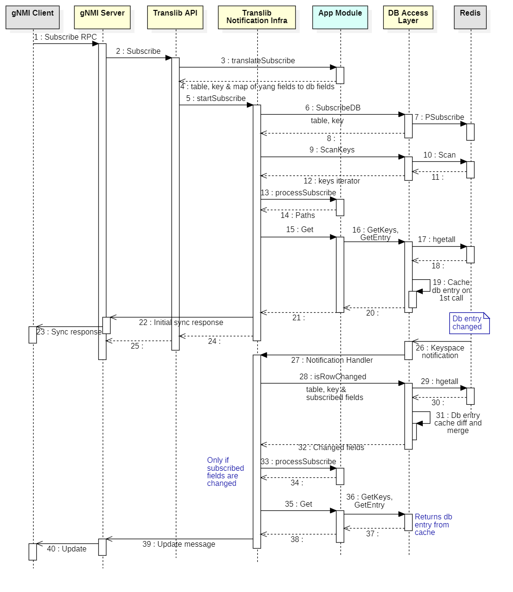
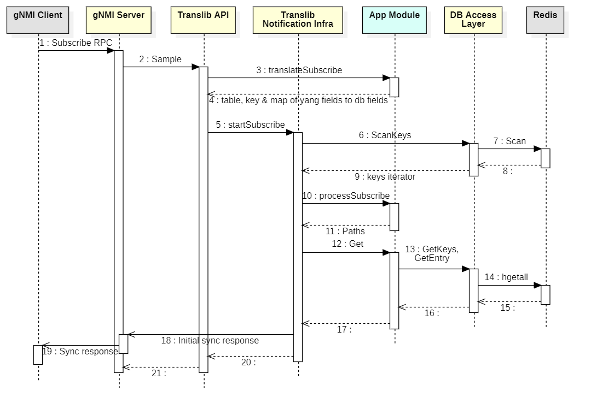

# Subscription RPC enhancements in Telemetry Service

# High Level Design Document

# Table of Contents

- [1 Feature Overview](#1-Feature-Overview)
    - [1.1 Target Deployment Use Cases](#11-Target-Deployment-Use-Cases)
    - [1.2 Requirements](#12-Requirements)
        - [1.2.1 Wildcard paths in Subscribe API](#121-wildcard-paths-in-subscribe-api)
        - [1.2.2 ON_CHANGE subscription](#122-on_change-subscription)
        - [1.2.3 TARGET_DEFINED subscription](#123-target_defined-subscription)
        - [1.2.4 PROTO encoding in gNMI responses](#124-proto-encoding-in-gnmi-responses)
        - [1.2.5 Translib Subscription Infrastructure for DB data](#125-translib-subscription-infrastructure-for-db-data)
    - [1.3 Design Overview](#13-Design-Overview)
        - [1.3.1 Basic Approach](#131-Basic-Approach)
            - [1.3.1.1 ON_CHANGE Subscription for DB data](#1311-on_change-subscription-for-db-data)
            - [1.3.1.2 SAMPLE Subscription for DB data](#1312-sample-subscription-for-db-data)
            - [1.3.1.3 TARGET_DEFINED Subscription](#1313-target_defined-subscription)
            - [1.3.1.4 Subscription for non-DB data](#1314-subscription-for-non-db-data)
            - [1.3.1.5 PROTO encoded responses](#1315-proto-encoded-responses)
        - [1.3.2 Container](#132-Container)
        - [1.3.3 SAI Overview](#133-SAI-Overview)
- [2 Functionality](#2-Functionality)
    - [2.1 Subscribe API](#21-subscribe-api)
    - [2.2 Wildcard Paths](#22-wildcard-paths)
- [3 Design](#3-Design)
    - [3.1 Overview](#31-Overview)
    - [3.2 DB Changes](#32-DB-Changes)
    - [3.3 Switch State Service Design](#33-Switch-State-Service-Design)
    - [3.4 SyncD](#34-SyncD)
    - [3.5 SAI](#35-SAI)
    - [3.6 User Interface](#36-User-Interface)
        - [3.6.1 Data Models](#361-Data-Models)
        - [3.6.2 CLI](#362-CLI)
        - [3.6.3 REST API Support](#363-REST-API-Support)
        - [3.6.4 gNMI Support](#364-gNMI-Support)
     - [3.7 Warm Boot Support](#37-Warm-Boot-Support)
     - [3.8 Upgrade and Downgrade Considerations](#38-Upgrade-and-Downgrade-Considerations)
     - [3.9 Resource Needs](#39-Resource-Needs)
- [4 Flow Diagrams](#4-Flow-Diagrams)
- [5 Error Handling](#5-Error-Handling)
- [6 Serviceability and Debug](#6-Serviceability-and-Debug)
- [7 Scalability](#7-Scalability)
- [8 Platform](#8-Platform)
- [9 Limitations](#9-Limitations)
- [10 Unit Test](#10-Unit-Test)
    - [10.1 Test Cases](#101-test-cases)
    - [10.2 gNMI UT Framework for PyNUT](#102-gnmi-ut-framework-for-pynut)
    - [10.3 UT with gnmi_cli tool](#103-ut-with-gnmi_cli-tool)
- [11 Internal Design Information](#11-Internal-Design-Information)
    - [11.1 IS-CLI Compliance](#111-IS-CLI-Compliance)
    - [11.2 Broadcom Packaging](#112-Broadcom-SONiC-Packaging)
    - [11.3 Broadcom Silicon Considerations](#113-Broadcom-Silicon-Considerations)    
    - [11.4 Design Alternatives](#114-Design-Alternatives)
    - [11.5 Broadcom Release Matrix](#115-Broadcom-Release-Matrix)

# List of Tables

[Table 1: Abbreviations](#table-1-Abbreviations)

[Broadcom Release Matrix](#115-broadcom-release-matrix)

# Revision

| Rev |     Date    |       Author       | Change Description                |
|:---:|:-----------:|:------------------:|-----------------------------------|
| 0.1 | 12/23/2020  | Sachin Holla       | Initial version                   |

# About This Manual

This document describes the high level design for Telemetry service and Translib infrastructure
to support gNMI ON_CHANGE subscriptions and wildcard paths in SONiC Telemetry Service.
Community version of telemetry service provides subscriptions using REDIS database based paths
as explained [here](https://github.com/Azure/sonic-telemetry/blob/master/doc/grpc_telemetry.md).
This functionality will be retained as is, without any modifications.
All the enhancements discussed here are applicable to only YANG data model based paths.
These paths are supported using the **Translib** library of the
[SONiC Management Framework](https://github.com/BRCM-SONIC/sonic_doc_private/blob/master/manageability/mgmt-framework/Management%20Framework.md).

Scope of this document is limited to the infrastructure components only.
HLD for individual features will be documented separately by respective feature teams.

# Definition/Abbreviation

### Table 1: Abbreviations

| **Term**       | **Meaning**                         |
|----------------|-------------------------------------|
| gNMI           | gRPC Network Management Interface   |
| gRPC           | gRPC Remote Procedure Call (it is a recursive acronym!!)   |

# References

SONiC Management Framework overview<br>
https://github.com/BRCM-SONIC/sonic_doc_private/blob/master/manageability/mgmt-framework/Management%20Framework.md

gNMI Specification<br>
https://github.com/openconfig/reference/blob/master/rpc/gnmi/gnmi-specification.md

gNMI Protobuff Definition<br>
https://github.com/openconfig/gnmi/blob/master/proto/gnmi/gnmi.proto

# 1 Feature Overview

## 1.1 Target Deployment Use Cases

 *FILLME*

## 1.2 Requirements

### 1.2.1 Wildcard paths in Subscribe API

gNMI Server should support wild cards in **path key** for all subscription modes.
Example: `/openconfig-interfaces:interfaces/interface[name=*]/config`.
Path can contain any number of wildcard key values.

Following cases will not be supported:

- Wildcard in path element (like `/openconfig-interfaces:interfaces/*/config`). 
- Wildcard paths pointing to non-DB data sources, like FRR socket.
- WIldcard paths in **Get** API.

Server should reject the RPC with INVALID_ARGUMENT status code if the request contains
unsupported wildcard paths.

### 1.2.2 ON_CHANGE subscription

gNMI server should support ON_CHANGE subscription for all YANG paths except following:

- Paths mapped to COUNTER_DB
- Paths mapped to any other DB table that can be updated frequently (to be decided by individual features).
- Paths mapped to non-DB data sources, like FRR socket.
- Any YANG container or list path whose descendent node does not support ON_CHANGE.

Note: The actual list of unsupported paths is not in the scope of this document.
It will be separately published by individual feature teams.

Server should reject the Subscribe request with INVALID_ARGUMENT status code if it receives
ON_CHANGE subscription request for unsupported paths.

### 1.2.3 TARGET_DEFINED subscription

### 1.2.4 PROTO encoding in gNMI responses

gNMI server should support PROTO encoded responses for **Get** and **Subscribe** RPCs.
Existing implementation supports only IETF_JSON encoded values.
Server should return response data in either PROTO or IETF_JSON encoded values
depending on the encoding requested by the client.
Server should reject the RPC with UNIMPLEMENTED status code if client requested for any other encoding.

### 1.2.5 Translib Subscription Infrastructure for DB data

## 1.3 Design Overview

### 1.3.1 Basic Approach

#### 1.3.1.1 ON_CHANGE Subscription for DB data

ON_CHANGE subscription for DB data can be achieved using redis keyspace notifications.
Redis also supports wildcard keyspace if registered through PSUBSCRIBE API.
These two are combined as follows to achieve **ON_CHANGE with wildcard paths**.



A simpler implementation of this design already exists in Translib and gNMI servers.
But it does not handle wildcard paths and supports ON_CHANGE for YANG paths pointing to
only leaf nodes or inner most YANG containers.
New design addresses these limitations and supports ON_CHANGE at any level in the YANG tree.

gNMI server handles all protocol specific encoding and decoding of subscribe RPC.
It uses **translib.Subscribe** API to register for notifications and receive
asynchrnous responses upon data change.
gNMI server maintains queues and locks to receive asynchronous responses from Translib.

The **translib.Subscribe** API manages redis subscriptions and notifications for the YANG path.
It uses App Module's `translateSubscribe` and `processSubscribe` functions to map YANG paths
to redis key and vice versa.

App Module's `translateSubscribe` function provides DB key mapping for YANG path.
It should also return DB entry field to YANG leaf mappings.
App module can return multiple redis DB and they can have wildcard components.

Few examples with a simplified openconfig-interfaces YANG model:

```text
module: openconfig-interfaces
  +--rw interfaces
     +--rw interface*
        +--rw name
        +--rw config        ==> CONFIG_DB:PORT
        |  +--rw enabled
        +--ro state         ==> APPL_DB:PORT_TABLE
        |  +--ro enabled
        |  +--ro oper-status
```

| **YANG Path**                         | **DB mappings**                         |
|---------------------------------------|-----------------------------------------|
| /interfaces/interface[name=\*]         | {CONFIG_DB, PORT\|\*, {admin_status=config/enabled}}<br> {APPL_DB, PORT_TABLE\|\*, {admin_status=state/enabled, oper_status=state/oper-status}} |
| /interfaces/interface[name=\*]/config  | {CONFIG_DB, PORT\|\*, {admin_status=enabled}} |
| /interfaces/interface[name=\*]/state/oper-status  | {APPL_DB, PORT_TABLE\|\*, {oper_status=oper-status}} |
| /interfaces/interface[name=Ethernet0]/config      | {CONFIG_DB, PORT\|Ethernet0, {admin_status=enabled}} |

Translib subscribes for redis keyspace notifications (through PSUBSCRIBE operation)
for the DB keys returned by `translateSubscribe`.

gNMI Subscribe PRC requires server to stream current data values before it could
send incremental updates.
Translib sends this initial sync responses by doing a Get of the subscribed path.
If the path contains wildcard keys, it must be expanded and Get operation must be performed
for each of the expanded path.
Get operation does not handle paths with wildcard keys (due to YGOT limitations).
Translib uses App Module's `processSubscribe` function to expand the wildcard path keys using the DB key.

Example: If the subscribed path is "/interfaces/interface[name=\*]/config" and the DB key
is "PORT|Ethernet0", the `processSubscribe` should return the expanded path as
"/interfaces/interface[name=**Ethernet0**]/config".

Translib performs redis SCAN operation of the key pattern returned by `translateSubscribe`
to iterate over existing DB keys.
For each DB key, App Module's `processSubscribe` function will be called to resolve the
wildcard keys in the path.
Get operation is performed for the expanded path and resulting YANG data is enquened onto
the gNMI server's response queue.
This approach tends to result in Translib sending stream of smaller chunks of data.

Once the initial data sync is complete, the `translib.Subscribe` API ends.
Subsequent incremental updates are sent asynchronously.

Redis would invoke Translib's notification handler callback function when a DB entry
for the subscribed key pattern is modified.
Redis notifications do not include any information about which fields of the DB entry are modified.
To identify the modified fields, Translib maintains a cache of DB entries it is monitoring.
Notification handler would read the current DB entry and compare with the cached DB entry to
identify the updated and deleted DB entry fields.
Cache will also be updated in this process.
Translib will identify the modified YANG leaf paths using DB field to YANG leaf mapping
returned by `translateSubscribe`.
Redis notification is ignored if none of the monitored DB fields are changed.
This allows to the noises close to the source and save precious CPU cycles.

If the subscribe path had wildcard keys, the wildcards need to be resolved in the modified YANG paths.
Translib uses App Module's `processSubscribe` function to achieve this.
The Translib obtains the modified YANG value through Get operation on each of the
modified YANG paths and enqueue them onto gNMI server's response queue.

The DB entry cache will be maintained in Translib's DB Access Layer.
This allows to automatically fill the initial values during initial data sync.
Also the App Modules can reuse cache data during subsequent Get calls as well.

#### 1.3.1.2 SAMPLE Subscription for DB data

SAMPLE subscription will be handled similar to ON_CHANGE's initial data sync.
Existing gNMI server implementation uses `translib.Get` API, but it will not support wildcard paths.
A new API `translib.Sample` will be developed for handling SAMPLE subscription.
This will be almost similar to `translib.Subscribe`, but will not register for redis keyspace
notifications and will not cache the DB entries.



gNMI server maintains the sample timer, response queue and locks.
It invokes the `translib.Sample` for every timer tick.

POLL and ONCE subscriptions are also be implemented using `translib.Sample` API.

#### 1.3.1.3 TARGET_DEFINED Subscription

gNMI server already implements the TARGET_DEFINED subscription with the help of
`translib.IsSubscribeSupported` API.
It returns the preferred subscription type for the YANG path.
Based on this gNMI sever starts either ON_CHANGE or SAMPLE subscription.

The `translib.IsSubscribeSupported` invokes App Module's `translateSubscribe` function
to get subscription preferences for the YANG path.
`translateSubscribe` returns the preferences for YANG node pointed by the subscribe path
and its descendent nodes.
If any of the descendent node does not support ON_CHANGE, then ON_CHANGE cannot be supported
for the target path -- even if individual leaf nodes under subscribe path support ON_CHANGE.

Few examples with a simplified openconfig-interfaces YANG model:

```text
module: openconfig-interfaces
  +--rw interfaces
     +--rw interface*
        +--rw name
        +--rw config        ==> CONFIG_DB:PORT
        |  +--rw enabled
        +--ro state         ==> APPL_DB:PORT_TABLE
        |  +--ro enabled
        |  +--ro oper-status
        |  +--ro counters   ==> COUNTERS_DB:COUNTERS (on_change not supported)
        |  |  +--ro in-octets
```

YANG container /interfaces/interface/state/counters maps to COUNTERS_DB and hence ON_CHANGE is not supported.
Other nodes support ON_CHANGE.
Below table lists the gNMI server's behavior for different combinations of subscription modes and paths.

| **Mode**       | **Subscribe Path**                       | **Result** |
|----------------|------------------------------------------|------------|
| TARGET_DEFINED | /interfaces/interface[name=\*]           | SAMPLE (counters does not support ON_CHANGE) |
| TARGET_DEFINED | /interfaces/interface[name=\*]/config    | ON_CHANGE |
| TARGET_DEFINED | /interfaces/interface[name=\*]/state     | SAMPLE (counters does not support ON_CHANGE) |
| TARGET_DEFINED | /interfaces/interface[name=\*]/state/enabled         | ON_CHANGE  |
| TARGET_DEFINED | /interfaces/interface[name=\*]/state/counters        | SAMPLE     |
| ON_CHANGE      | /interfaces/interface[name=\*]           | error (counters does not support ON_CHANGE) |
| ON_CHANGE      | /interfaces/interface[name=\*]/config    | ON_CHANGE |
| ON_CHANGE      | /interfaces/interface[name=\*]/state     | error (counters does not support ON_CHANGE) |
| ON_CHANGE      | /interfaces/interface[name=\*]/state/enabled         | ON_CHANGE  |
| SAMPLE         | /interfaces/interface[name=\*]           | SAMPLE    |


#### 1.3.1.4 Subscription for non-DB data

Current design does not support ON_CHANGE for non-DB data sources, like FRR socket.
Unlike redis, there is no standard model for detecting non-DB data modifications.
Recommendation is to migrate such applications to use redis as data store.

SAMPLE, POLL and ONCE subscriptions are supported for non-DB data only if the subscribe path
does not contain wildcards.
Theoretically, wildcard paths can be supported using the same `processSubscribe` App Module functions.
However Translib cannot provide streamed responses since non-DB data sources do not provide data "iterators" (like redis SCAN operation).

#### 1.3.1.5 PROTO encoded responses

 *FILLME*

### 1.3.2 Container

All the changes will be local to existing **telemetry** container.

### 1.3.3 SAI Overview

N/A

# 2 Functionality

## 2.1 Subscribe API

The [gNMI specification](https://github.com/openconfig/reference/blob/master/rpc/gnmi/gnmi-specification.md)
defines a **Subscribe** RPC, which allows clients to receive relating to the state of specific data instances.
A subscription consists of one or more paths, with a specified subscription mode.
The mode of each subscription determines the triggers for updates for data sent from the server.
Different modes of subscription available:

- **ONCE** -- server streams the current data to the client and closes the subscription.
    This is equivalent of **Get** RPC, but is more efficient since server need not coalesce
    individual data items into a single response.

- **POLL** -- server streams the data in response to a poll request from the client.
    The client would specify the paths it is interested in through the **Subscribe** request.
    It would later send a **Poll** message to trigger responses from the server.
    Poll subscription are used as an efficient alternative to **Get** RPC.

- **SAMPLE** -- server samples the data values periodically and streams the data to the client.
    Client would specify the paths and sample interval through the **Subscribe** request.
    Server would reject the request if it cannot support the requested sample interval.

- **ON_CHANGE** -- server sends data updates to the client when the value of subscribed path is changed.
    This mode is not suitable for frequently changing values like counters.
    Server can reject the ON_CHANGE subscribe request if it cannot support ON_CHANGE updates
    to the requested paths.
    Once accepted, server first sends current data for the subscribed paths to client (initial sync).
    Thereafter server sends only the delta updates to client when the values are changed on the server.

- **TARGET_DEFINED** -- server can pick either SAMPLE or ON_CHANGE modes for the subscribe path
    depending on its settings or preferences.

## 2.2 Wildcard Paths

Wildcards in the gNMI paths indicate all elements at a given subtree in the schema.
Wildcards can appear in path element name or key value.
Asterisk (*) is the single level wildcard and ellipses (...) is the multi-level wildcard character.

To select configured MTUs of all interfaces:<br>
`/openconfig-interfaces:interfaces/interface[name=*]/config/mtu`

To select both config/mtu and state/mtu of Ethernet0:<br>
`/openconfig-interfaces:interfaces/interface[name=Ethernet0]/*/mtu`

To select all state containers in oc-interface yang tree:<br>
`/openconfig-interfaces:interfaces/.../state`

To select all leafs and containers of Ethernet0:<br>
`/openconfig-interfaces:interfaces/interface[name=Ethernet0]/...`

Wildcard paths are allowed in Get and Subscribe requests only.
The response message should not include wildcards.
It should include the expanded paths.

**Note:** Paths with wildcard element names (last 3 examples) are not supported in this release.

# 3 Design

## 3.1 Overview

 *FILLME*

## 3.2 DB Changes

No DB schema change required.

## 3.3 Switch State Service Design

N/A

## 3.4 SyncD

N/A

## 3.5 SAI

N/A

## 3.6 User Interface

### 3.6.1 Data Models

No data model is added/modified by the infrastructure.

### 3.6.2 CLI

No CLIs are added/modified.

### 3.6.3 REST API Support

No REST APIs are added/modified.

### 3.6.4 gNMI Support

No REST APIs are added/modified by the infrastructure.
However individual features will support ON_CHANGE subscription for eligible YANG paths.

## 3.7 Warm Boot Support

N/A

## 3.8 Upgrade and Downgrade Considerations

N/A

## 3.9 Resource Needs

 *FILLME*

# 4 Flow Diagrams

N/A

# 5 Error Handling

N/A

# 6 Serviceability and Debug

N/A

# 7 Scalability

 *FILLME*

# 8 Platform

N/A
This is platform independent feature.

# 9 Limitations

- ON_CHANGE not supported for YANG nodes mapped to non-DB data, like FRR socket.
- Subscribe not supported for wildcard paths pointing to non-DB data nodes.
- Subscribe not supported for paths with wildcard element names.
    Only wildcard keys are allowed.
- Wilcard paths not supported in gNMI Get RPC.

# 10 Unit Test

## 10.1 Test Cases

 *FILLME*

## 10.2 gNMI UT Framework for PyNUT

 *FILLME*

## 10.3 UT with gnmi_cli tool

OpenConfig community provides [gnmi_cli](https://github.com/openconfig/gnmi/blob/master/cmd/gnmi_cli/gnmi_cli.go)
tool which can be used for quick testing gNMI subscriptions on the SONiC device.
This tool will be available in the **telemetry** container.
Alternatively, it can be obtained from the build server `sonic-buildimage/src/sonic-telemetry/build/bin/gnmi_cli`.
Few of the sample usages are listed below.

1\) ON_CHANGE subscription
```
gnmi_cli -insecure -logtostderr -target OC_YANG -address localhost:8080 \
    -query_type streaming -streaming_type ON_CHANGE \
    -query openconfig-interfaces:interfaces/interface[name=*]/config
```

2\) SAMPLE subscription, with sample interval of 30 seconds
```
gnmi_cli -insecure -logtostderr -target OC_YANG -address localhost:8080 \
    -query_type streaming -streaming_type SAMPLE -streaming_sample_interval 30 \
    -query openconfig-interfaces:interfaces/interface[name=*]/config
```

3\) TARGET_DEFINED subscription
```
gnmi_cli -insecure -logtostderr -target OC_YANG -address localhost:8080 \
    -query_type streaming -streaming_type TARGET_DEFINED \
    -query openconfig-interfaces:interfaces/interface[name=*]/config
```

4\) POLL subscription, with polling interval of 20 seconds
```
gnmi_cli -insecure -logtostderr -target OC_YANG -address localhost:8080 \
    -query_type polling -polling_interval 20s \
    -query openconfig-interfaces:interfaces/interface[name=*]/config
```

5\) ONCE subscription
```
gnmi_cli -insecure -logtostderr -target OC_YANG -address localhost:8080 \
    -query_type once \
    -query openconfig-interfaces:interfaces/interface[name=*]/config
```

6\) Subscribing to multiple paths (passing comma separated path list in -query option)
```
gnmi_cli -insecure -logtostderr -target OC_YANG -address localhost:8080 \
    -query_type streaming -streaming_type ON_CHANGE \
    -query openconfig-interfaces:interfaces/interface[name=*]/config,openconfig-acl:acl/acl-sets
```

# 11 Internal Design Information

## 11.1 IS-CLI Compliance

N/A

## 11.2 Broadcom SONiC Packaging

This feature will be available in all packages.

## 11.3 Broadcom Silicon Considerations

N/A

## 11.4 Design Alternatives

N/A

## 11.5 Broadcom Release Matrix

| Release | Change(s)    |
|:-------:|:-------------------------------------------------------------------------|
| 3.2.0   | * Subscribe RPC for paths with wildcard keys <br> * ON_CHANGE subscription for eligible YANG paths<br> * PROTO encoding in Get and Subscribe RPCs |
