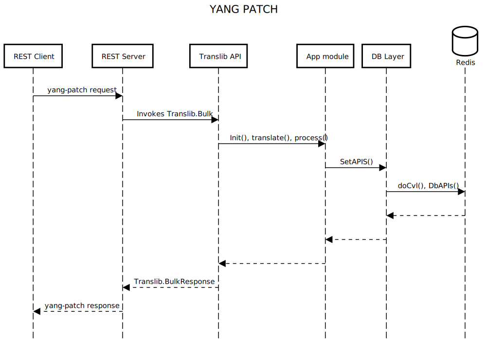

# Feature Name
YANG Patch Media Type
# High Level Design Document
#### Rev 0.3

# Table of Contents
  - [Revision](#revision)
  - [About This Manual](#about-this-manual)
  - [Scope](#scope)
  - [1 Feature Overview](#1-feature-overview)
  - [2 Requirements](#2-requirements)
  - [3 Design Overview](#3-design-overview)
    - [3.1 Basic Approach](#31-basic-approach)
     - [3.1.1 REST Server changes](#311-rest-server-changes)
     - [3.1.2 Translib changes](#312-translib-changes)
     - [3.1.3 DB Access Layer changes](#313-db-access-layer-changes)
     - [3.1.4 REST CLI Client changes](#314-rest-cli-client-changes)
      - [3.1.4.1 Bulk Class](#3141-bulk-class)
      - [3.1.4.2 yang_patch API](#3142-yang_patch-api)
      - [3.1.4.3 YangPatchResponse Class](#3143-yangpatchresponse-class)
      - [3.1.4.4 Usage Example](#3144-usage-example)
  - [4 Functionality](#4-functionality)
    - [4.1 Target Resource](#41-target-resource)
    - [4.2 Yang Patch Request](#42-yang-patch-request)
    - [4.3 Yang Patch Status Response](#43-yang-patch-status-response)
    - [4.4 Edit operations](#44-edit-operations)
    - [4.5 Error Handling](#45-error-handling)
  - [5 Unit Test](#5-unit-test) 
    - [5.1 Example Module](#51-example-module) 
    - [5.2 Positive Test case](#52-positive-test-case) 
    - [5.3 Negative Test case](#53-negative-test-case) 
  - [6 Limitations](#6-limitations) 
  
# Revision
| Rev |     Date    |       Author       | Change Description                |
|:---:|:-----------:|:------------------:|-----------------------------------|
| 0.1 | 04/23/2021  |   Mohammed Faraaz  | Initial version                   |
| 0.2 | 05/23/2021  |   Mohammed Faraaz  | Added Design and UT sections      |
| 0.3 | 07/23/2021  |   Mohammed Faraaz  | Addressed Review comments.        |

# About this Manual
This document provides general information about the YANG Patch Media Type feature implementation in SONiC mgmt-framework's RESTCONF server.

# Scope
This document describes the high level design of YANG Patch Media Type feature. Describing RESTCONF and other related information are beyond the scope of this document.

# 1 Feature Overview
A "YANG Patch" is an ordered list of edits that are applied to the target configuration datastore by the RESTCONF server.
The YANG Patch operation is invoked by the RESTCONF client by sending a PATCH method request with a representation using 
"application/yang-patch+json". The message-body representing the YANG Patch input parameters MUST be present.

# 2 Requirements

## 2.1 Functional Requirements

1. The RESTCONF server should implement the "YANG PATCH" feature as described in the [RFC8072](https://tools.ietf.org/html/rfc8072)
2. The RESTCONF server should allow multiple sub-resources to be edited within the same PATCH method.
3. The RESTCONF server should allow a more precise edit operation than the "plain patch" mechanism found in [RFC8040](https://tools.ietf.org/html/rfc8040). i.e. edits operations can be heterogenuous.
4. The RESTCONF server should support "create", "delete", "merge", "replace", and "remove" operations. [More details on operations](https://datatracker.ietf.org/doc/html/rfc8072#section-2.5)
5. The RESTCONF server should process "edits" in the explicit order. i.e. The edits are processed in client-specified order.
6. The YANG Patch request should be an atomic operation. i.e. All the edits must be succeded, otherwise an error will be thrown.
7. The RESTCONF server should log the YANG Patch's "patch-id" in the audit-log, this is useful for debugging. The format will be "[REST-ID] User \"<USER_ID>@<REMOTE_ADDR>\" request \"PATCH yang-yatch-id:<Patch-ID> <PATCH_URL>\" status - <STATUS_CODE>"
8. The RESTCONF server MUST return the "Accept-Patch" header field in an OPTIONS response, as specified in [RFC5789], which includes the media type for YANG Patch.  This is needed by a client to determine the message-encoding formats supported by the server (e.g., XML, JSON, or both).
   The following is an example of an "Accept-Patch" header:
   Accept-Patch: application/yang-patch+json

# 3 Design Overview



## 3.1 Basic Approach

## 3.1.1 REST Server changes

- RESTCONF Server's Request handler will be enhanced to accept the PATCH Request with media type ["application/yang-patch+json"](https://datatracker.ietf.org/doc/html/rfc8072#section-4.2.2).
- RESTCONF Server will enhance OPTIONS response to include “application/yang-patch+json” content type in the “Accept-Patch” header.
- RESTCONF Server will advertise the [":yang-patch" RESTCONF Capability](https://datatracker.ietf.org/doc/html/rfc8072#section-4.3).

## 3.1.2 Translib changes

- Translib's Bulk API will be enhanced to process the Ordered edits. i.e. to preserve and process the edits in a order sent by a REST Client.
- Translib's Bulk API will be enhanced to process the request atomically.
- Translib's Bulk API currently processes the edits as per the requirement of GNMI spec, there should not be any impact on current behaviour GNMI's bulk request processing.

## 3.1.3 DB Access Layer changes

- DB Access layer's GET APIs will be enhanced to read from the current transaction cache.

## 3.1.4 REST CLI Client changes

The Generic CLI Client in CLI Actioner infrastructure has been extended with below enhancements

### 3.1.4.1 Bulk Class

A new Class called `Bulk` is added, which can be used to create a Bulk Request. This Class when instantiated adds a request attribute `<bulk_instance>.req`, which contains a YANG-PATCH-Request data. Bulk class also exposes below instance methods to fill the YANG PATCH request.

- `create`  - Adds an edit to the YANG-PATCH-Request with operation as Create
- `replace` - Adds an edit to the YANG-PATCH-Request with operation as Replace
- `merge`   - Adds an edit to the YANG-PATCH-Request with operation as Merge
- `delete`  - Adds an edit to the YANG-PATCH-Request with operation as Delete
- `remove`  - Adds an edit to the YANG-PATCH-Request with operation as Remove

### 3.1.4.2 yang_patch API

The `ApiClient` class has been extended to provide `yang_patch` API, which the Actioner scripts can invoke to send a YANG-PATCH Request and YANG-PATCH Response

### 3.1.4.3 YangPatchResponse Class

A new class called `YangPatchResponse` is added, which inherits `Response` class. The (yang_patch API)[#3142-yang_patch-API] returns an instance of this class. All the instance methods which are applicable to instance of `Response` class can be used with the instance of this class. Below are some of the additional instance attributes `YangPatchResponse` provides
- **global_status** - This provides overall status of the Yang-Patch request. Contains `Boolen` value(True/False)
- **global_errors** - This contains a Global Error data (/ietf-yang-patch:/yang-patch-status/errors)
- **edit_status**   - This contains a list of status for individual yang patch edit operations.

### 3.1.4.4 Usage Example

 ```python
patch_url = Path("/restconf/data/openconfig-interfaces:interfaces")
bulk_req = Bulk(patch_id="sample", comment="testing")
payload = {"openconfig-interfaces:interface": [{"name":
    "PortChannel10","config": {"name": "PortChannel10","mtu": 9100}}]}
bulk_req.merge(target=Path("/interface=PortChannel10"), payload=payload edit_id="edit-0")
bulk_req.remove(target=Path("/interface=PortChannel10"), edit_id="edit-1")
bulk_req.delete(target=Path("/interface=PortChannel10"), edit_id="edit-2")
api = ApiClient()
resp = api.yang_patch(patch_url, bq)
if resp.ok():
    print("yes")
else:
    print(resp.error_message())
 ```

# 4 Functionality

## 4.1 Target Resource

The YANG Patch operation uses the RESTCONF target resource URI to identify the resource that will be patched.  This must be a configuration data resource within the datastore resource, e.g., "/restconf/data/openconfig-acl:acl/acl-sets", to edit sub-resources within a top-level configuration datastore (/restconf/data). SONiC does not support operation at datastore resource (/restconf/data) i.e. sub-resources can be patched.

The target resource can point to any [data resource](https://datatracker.ietf.org/doc/html/rfc8040#section-3.5)

## 4.2 Yang Patch Request

A YANG Patch is identified by a unique "patch-id", and it may have an optional comment.  A patch is an ordered collection of edits.  
Each edit is identified by an "edit-id", and it has an edit operation ("create", "delete", "merge", "replace", or "remove") that is applied to the target resource.
Each edit can be applied to a sub-resource "target" within the target resource.
The YANG Patch operation is invoked by the RESTCONF client by sending a PATCH method request with a representation using the media type "application/yang-patch+json" with a message body in a below template.

The target under edit can point to any [data resource](https://datatracker.ietf.org/doc/html/rfc8040#section-3.5).

Refer [Target Data Node](https://datatracker.ietf.org/doc/html/rfc8072#section-2.4) for more details on URI format for edits.


```text
     +---- yang-patch
           +---- patch-id    string
           +---- comment?    string
           +---- edit* [edit-id]
              +---- edit-id      string
              +---- operation    enumeration
              +---- target       target-resource-offset
              +---- value?
```

Note that YANG Patch can only edit data resources.  The PATCH method cannot be used to replace the datastore resource.
The value should be a RFC7951 JSON encoded yang data.

Please refer [Unit test](#5-unit-test) examples for sample request.

## 4.3 Yang Patch Status Response

A message-body representing the YANG Patch Status is returned to the RESTCONF client to report the detailed status of the edit operation. 
Below is the Response body template which RESTCONF server uses

```text
     +---- yang-patch-status
           +---- patch-id       string
           +---- (global-status)?
           |  +--:(global-errors)
           |  |  +---- errors
           |  |     +---- error*
           |  |        +---- error-type       enumeration
           |  |        +---- error-tag        string
           |  |        +---- error-app-tag?   string
           |  |        +---- error-path?      instance-identifier
           |  |        +---- error-message?   string
           |  |        +---- error-info?
           |  +--:(ok)
           |     +---- ok?            empty
           +---- edit-status
              +---- edit* [edit-id]
                 +---- edit-id    string
                 +---- (edit-status-choice)?
                    +--:(ok)
                    |  +---- ok?        empty
                    +--:(errors)
                       +---- errors
                          +---- error*
                             +---- error-type       enumeration
                             +---- error-tag        string
                             +---- error-app-tag?   string
                             +---- error-path?      instance-identifier
                             +---- error-message?   string
                             +---- error-info?
```

Please refer [Unit test](#5-unit-test) examples for sample response.

## 4.4 Edit operations

Edit operations are described breifly in the [RFC8072](https://datatracker.ietf.org/doc/html/rfc8072#section-2.5)

Note: Move and Insert operations are not supported in SONiC.

Below is the mapping between a yang patch operation and a translib operation
  
| Patch Operation | Translib operation|
|:---------------:|:-----------------:|
| create          | CREATE            |
| replace         | REPLACE           |
| merge           | UPDATE            |
| delete          | DELETE            |
| remove          | DELETE            |

Note: Remove operation will suppress the Resource-not-found-Error (tlerr.NotFoundError), to satisfy the RFC8072 requirement.

## 4.5 Error Handling

- **Global Error** - When there exists any global error such as patch-id missing, or PATCH URL(Target resource) is not valid none of the edits will be processed and the global errors subbtree (ietf-yang-patch:yang-patch-status/errors) in a yang patch response will be populated. Since none of the edits are processed, the edit status errors subtree will not be present in the response.

- **Edit specific Error** - When one of the edit in the yang patch request fails, all the subsequent edits will not be processed. The yang-patch-status will contain an edit-status subtree (ietf-yang-patch:yang-patch-status/edit-status/edit/errors) filled. The **edit-status** subtree will only contain status for the edits which are processed.
  
For more information, please refer [Error handling](https://datatracker.ietf.org/doc/html/rfc8072#page-12), [RFC Examples](https://datatracker.ietf.org/doc/html/rfc8072#page-29), and [Unit Test Examples](#5-unit-test)

# 5 Unit Test

## 5.1 Example module

The example YANG module used in this document is a subset of openconfig-acl module.

The YANG subtree diagram for the "openconfig-acl" module

```text
module: openconfig-acl
  +--rw acl
     +--rw acl-sets
     |  +--rw acl-set* [name type]
     |     +--rw name           -> ../config/name
     |     +--rw type           -> ../config/type
     |     +--rw config
     |     |  +--rw name?          string
     |     |  +--rw type?          identityref
     |     |  +--rw description?   string
     |     +--rw acl-entries
     |        +--rw acl-entry* [sequence-id]
     |           +--rw sequence-id    -> ../config/sequence-id
     |           +--rw config
     |           |  +--rw sequence-id?   uint32
     |           |  +--rw description?   string
     |           +--rw ipv4
     |           |  +--rw config
     |           |  |  +--rw source-address?        oc-inet:ipv4-prefix
     |           |  |  +--rw destination-address?   oc-inet:ipv4-prefix
     |           |  |  +--rw dscp?                  oc-inet:dscp
     |           |  |  +--rw protocol?              oc-acl-ext:ip-protocol-type-ext
     |           +--rw transport
     |           |  +--rw config
     |           |  |  +--rw source-port?                          oc-pkt-match-types:port-num-range
     |           |  |  +--rw destination-port?                     oc-pkt-match-types:port-num-range
     |           +--rw actions
     |              +--rw config
     |              |  +--rw forwarding-action    identityref

```

## 5.2 Positive Test case

### 5.2.1 Example 1

```text
   The following example shows 4 edits are being applied to an existing ACL which is MyACL1.

   o  First Edit is creating RULE with sequence-id 1
   o  Second Edit is Replacing RULE with sequence-id 1 (This Replaces the rule created in edit-1)
   o  Third Edit is Updating a subtree(ipv4/config/source-address) RULE with sequence-id 1 (Note: this updates the rule created in edit-2)
   o  Fourth Edit is Deleting a RULE with sequence-id 1

   Request from the RESTCONF client:

      PATCH /restconf/data/openconfig-acl:acl/\
         acl-sets/acl-set=MyACL1,ACL_IPV4/acl-entries \
         HTTP/1.1
      Host: example.com
      Accept: application/yang-data+json
      Content-Type: application/yang-patch+json

      {
        "ietf-yang-patch:yang-patch" : {
          "patch-id" : "ACL Rules",
          "edit" : [
            {
              "edit-id" : "edit1",
              "operation" : "create",
              "target" : "/acl-entry=1",
              "value" : {
                "acl-entry": [
                    {
                        "sequence-id": 1,
                        "config": {
                            "sequence-id": 1,
                            "description": "Description for MyACL1 Rule Seq 1"
                        },
                        "ipv4": {
                            "config": {
                                "source-address": "13.1.1.1/32",
                                "destination-address": "23.1.1.1/32",
                                "dscp": 1,
                                "protocol": "IP_TCP"
                            }
                        },
                        "transport": {
                            "config": {
                                "source-port": 101,
                                "destination-port": 201
                            }
                        },
                        "actions": {
                            "config": {
                                "forwarding-action": "ACCEPT"
                            }
                        }
                    }
                ]
              }
            },
            {
              "edit-id" : "edit2",
              "operation" : "replace",
              "target" : "/acl-entry=1",
              "value" : {
                "acl-entry": [
                    {
                        "sequence-id": 1,
                        "config": {
                            "sequence-id": 1,
                            "description": "Description for Changed Rule"
                        },
                        "ipv4": {
                            "config": {
                                "source-address": "13.1.1.1/32",
                                "destination-address": "23.1.1.1/32",
                                "protocol": "IP_TCP"
                            }
                        },
                        "transport": {
                            "config": {
                                "source-port": 102,
                                "destination-port": 102
                            }
                        },
                        "actions": {
                            "config": {
                                "forwarding-action": "ACCEPT"
                            }
                        }
                    }
                ]
              }
            },
            {
              "edit-id" : "edit3",
              "operation" : "merge",
              "target" : "/acl-entry=1/ipv4/config/source-address",
              "value" : {
                 "source-address": "13.3.3.3/32",
                 "dscp": 1                 
              }
            },  
            {
              "edit-id" : "edit4",
              "operation" : "delete",
              "target" : "/acl-entry=1"
            }            
          ]
        }
      }

   Response from the RESTCONF server:

      HTTP/1.1 200 OK
      Date: Thu, 26 Jan 2017 20:56:30 GMT
      Content-Type: application/yang-data+json

      {
        "ietf-yang-patch:yang-patch-status" : {
          "patch-id" : "ACL Rules",
          "ok" : [null]
        }
      }            
```

### 5.2.2 Example 2

```text

   o  First Edit is creating ACL 
   o  Second Edit is creating RULE for ACL created in edit-1

   Request from the RESTCONF client:

      PATCH /restconf/data/openconfig-acl:acl/acl-sets \
         HTTP/1.1
      Host: example.com
      Accept: application/yang-data+json
      Content-Type: application/yang-patch+json
      {
        "ietf-yang-patch:yang-patch" : {
          "patch-id" : "Add ACL And Rules",
          "edit" : [
            {
              "edit-id" : "edit1",
              "operation" : "create",
              "target" : "/acl-set=MyACL1,ACL_IPV4",
              "value" : {
                "acl-set": [
                    {
                        "name": "MyACL1",
                        "type": "ACL_IPV4",
                        "config": {
                            "name": "MyACL1",
                            "type": "ACL_IPV4",
                            "description": "Description for MyACL1"
                        }
                    }
                ]                  
              }
            },              
            {
              "edit-id" : "edit2",
              "operation" : "create",
              "target" : "/acl-set=MyACL1,ACL_IPV4/acl-entries/acl-entry=1",
              "value" : {
                "acl-entry": [
                    {
                        "sequence-id": 1,
                        "config": {
                            "sequence-id": 1,
                            "description": "Description for MyACL1 Rule Seq 1"
                        },
                        "ipv4": {
                            "config": {
                                "source-address": "13.1.1.1/32",
                                "destination-address": "23.1.1.1/32",
                                "dscp": 1,
                                "protocol": "IP_TCP"
                            }
                        },
                        "transport": {
                            "config": {
                                "source-port": 101,
                                "destination-port": 201
                            }
                        },
                        "actions": {
                            "config": {
                                "forwarding-action": "ACCEPT"
                            }
                        }
                    }
                ]
              }
            }           
          ]
        }
      }

   Response from the RESTCONF server:

      HTTP/1.1 200 OK
      Date: Thu, 26 Jan 2017 20:56:30 GMT
      Content-Type: application/yang-data+json
      {
        "ietf-yang-patch:yang-patch-status" : {
          "patch-id" : "ACL Rules",
          "ok" : [null]
        }
      }
```

## 5.3 Negative Test case

```text
   The following example shows 2 ACLs are being added.

   o  First Edit will fail, because ACL1 already exists
   o  Second Edit will not be attempted as first edit is failed.

   Request from the RESTCONF client:

      PATCH /restconf/data/openconfig-acl:acl/\
         acl-sets \
         HTTP/1.1
      Host: example.com
      Accept: application/yang-data+json
      Content-Type: application/yang-patch+json

      {
        "ietf-yang-patch:yang-patch" : {
          "patch-id" : "Add ACLs",
          "edit" : [
            {
              "edit-id" : "edit1",
              "operation" : "create",
              "target" : "/acl-set=MYACL1,ACL_IPV4",
              "value" : {
                "acl-set": [
                 {
                   "name": "MyACL1",
                   "type": "ACL_IPV4",
                   "config": {
                       "name": "MyACL1",
                       "type": "ACL_IPV4",
                       "description": "Description for MyACL1"
                   },
                 }
                ]
              }
            },
            {
              "edit-id" : "edit2",
              "operation" : "create",
              "target" : "/acl-set=MYACL2,ACL_IPV4",
              "value" : {
                "acl-set": [
                 {
                   "name": "MyACL2",
                   "type": "ACL_IPV4",
                   "config": {
                       "name": "MyACL2",
                       "type": "ACL_IPV4",
                       "description": "Description for MyACL2"
                   },
                 }
                ]
              }
            },            
          ]
        }
      }
      
      HTTP/1.1 409 Conflict
      Date: Thu, 26 Jan 2017 20:56:30 GMT
      Content-Type: application/yang-data+json
      {
        "ietf-yang-patch:yang-patch-status" : {
          "patch-id" : "Add ACLs",
          "edit-status" : {
            "edit" : [
              {
                "edit-id" : "edit1",
                "errors" : {
                  "error" : [
                    {
                      "error-type": "application",
                      "error-tag": "data-exists",
                      "error-path": "/openconfig-acl:acl/acl\
                         /acl-sets/[acl-set='MyACL1','ACL_IPV4']\,
                      "error-message":
                        "Data already exists; cannot be created"
                    }
                  ]
                }
              }
            ]
          }
        }
      }      
```

# 6 Limitations

1. Does not support “insert” and “move” operations because SONiC does not support order by user.
2. Does not support YANG patch for data store resource i.e. The target resource cannot be '/' (top-level).


