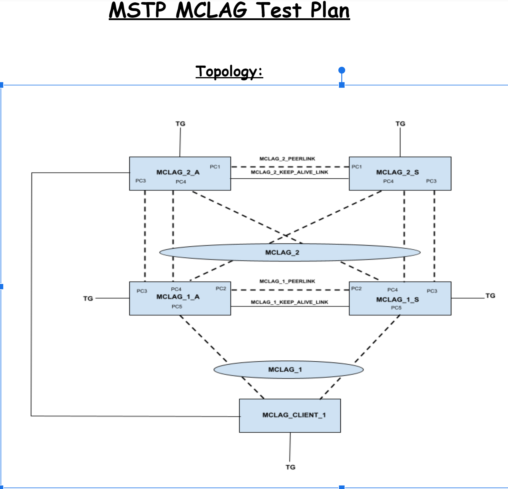

#  SQA Test Plan

#  MSTP

#  SONIC 4.0.0 Release

# Test Plan Revision History
| Rev  |    Date    |        Author        | Change Description |
| :--: | :--------: | :------------------: | ------------------ |
| 0.1  | 06/28/2021  | Anil Kumar Kolkaleti | Initial version    |

# List of Reviewers
| Function |         Name         |
| :------: | :------------------: |
|   Dev    | Divya Kumaran Chandralekha|
|    QA    | Chandra Bhushan Singh     |
|    QA    | Kalyan Vadlamani          |

# List of Approvers
| Function |         Name         | Date Approved |
| :------: | :------------------: | :-----------: |
|   Dev    | Divya Kumaran Chandralekha|          |
|    QA    | Chandra Bhushan Singh     |          |
|    QA    | Kalyan Vadlamani          |          |

# Definition/Abbreviation
| **Term** | **Meaning**                          |
| -------- | ------------------------------------ |
| BPDU     | Bridge protocol data unit            |
| CIST     | Common and internal spanning tree    |
| MSTI     | Multiple spanning tree instance      |
| MSTP     | Multiple spanning tree protocol      |
| MCLAG    | Multi-chassis Link Aggregation Group |
| PVST     | Per VLAN spanning tree protocol      |
| REST     | Representational state transfer      |
| STP      | Spanning tree protocol               |

# Feature Overview
The MSTP enables multiple VLANs to be mapped to the same spanning-tree instance, reducing the number of spanning-tree instances needed to support a large number of VLANs. The MSTP provides for multiple forwarding paths for data traffic and enables load-balancing. It improves the fault tolerance of the network because a failure in one instance (forwarding path) does not affect other instances (forwarding paths). The most common initial deployment of MSTP is in the backbone and distribution
layers of a Layer 2 switched network.

# Test Focus Areas
##Functionality
 1.Verify that with default configuration, the bridge with lower bridge-id is the ROOT Bridge with MSTP configured. 
 2.Verify that all VLANs are initially associated to the CIST by default with no MSTs configured and verify that traffic is running as expected when vlan exists. 
 3.Verify VLANs can be assigned to an MST instance before creation of VLAN. 
 4.Verify that functionality is working as expected when we created vlan after mapping VLAN to MST instance. 
 5.Verify that the MSTP working behavior after deleting non existing vlan. 
 6.Verify that the MSTP working behavior after deleting existing vlan. 
 7.Verify that behavior of MSTP instance associated with an existing VLAN and also a non-existing VLAN when the non-existing vlan is deleted. 
 8.Verify that behavior of MSTP instance associated with an existing VLAN and also a non-existing VLAN when the existing vlan is deleted. 
 9.Verify MSTP behavior after adding/removing a few more VLANs. 
 10.Verify that with MSTP configured fdb flush happens in the instance for which there is a topology change and other instances fdb is not flushed. 
 11.Verify that another switch is elected as the root in the event of root switch failure by rebooting the root switch in MSTP topology. 
 12.Verify that another switch is elected as the root in the event of root switch failure by disabling MSTP globally or disabling at instance level on the ROOT Bridge. 
 13.Verify that another switch is elected as the root in the event of root switch failure by removing all the ports in  a MSTP instance. 
 14.Verify that another switch is elected as the root in the event of root switch failure by shutting down the ports in a MSTP instance. 
 15.Verify MSTP revision number and region name are properly configured and displayed. 
 16.Verify the mstp converges with empty region name can not be configured.  
 17.Verify MSTP timers are working fine. 
 18.Verify MSTP activate and abort configuration commands are working fine. 
 19.Verify that DUT is stable when we configured MSTP configuration name is different on partner device and DUT. 
 20.Verify the port states and roles with mstp port path cost configured and link made up/down in MSTP. 
 21.Verify that spanning tree hello is displaying configured value in show commands when operating in MSTP mode. 
 22.Verify that end to end learnt traffic is forwarded fine for a given vlan instance in a MSTP topology. 
 23.Verify that end to end unlearnt traffic is forwarded fine for a given vlan instance in a MSTP topology. 
 24.Verify that Broadcast/Multicast/Unicast traffic is forwarded fine in a MSTP topology. 
##Port
 25.Verify that the mac addresses are not learnt when the port is in discarding state when MSTP is configured. 
 26.Verify that interface with lower interface index will be in forwarding state and port having higher interface index will be in Blocking state and root port is selected based on port priority of the designated bridge. 
 27.Verify that shut and no shut of a discarding port continues to keep discarding port in discarding state. 
 28.Verify that shutdown of blocked ports does not have any impact on the traffic. 
##Statistics
 29.Verify all MSTP statistics are correctly displayed on fwd/desig and blocking ports(Tx_Drop). 
 30.Verify MSTP clear counters clear the statistics. 
 31.Verify the MSTP convergence by reloading the DUT and checking for convergence. 
 32.Verify MSTP is converging fine when topology changes- due to minimum link configured and lag members are removed. 
 33.Verify that MSTP convergence is fine with port channel interfaces in the topology 
 34.Verify the MSTP over the port-channel is converging fine when vlans are added or removed. 
 35.Verify that while addition/removal of member ports to a lag there are no topology changes when MSTP is configured. 
 36.Verify that with MSTP configured on port-channel interfaces STP BPDUs are sent or received fine. 
 37.Verify there is no change in port channel cost when a member is deleted and added. 
 38.Verify Edge port functionality when MSTP is configured. 
 39.Verify that the Edge port enabled for BPDU filtering will drop any BPDUs it receives 
 40.Verify the ROOT guard feature in MSTP mode. 
 41.Verify that ROOT guard related syslog messages are correctly displayed. 
 42.Verify BPDU guard functionality when MSTP is configured 
 43.Verify that BPDU guard related syslog messages are correctly displayed. 
 44.Verify Loop guard functionality when enabled on a physical interface. 
 45.Verify Loop guard functionality when enabled on a lag interface 
 46.Verify that Loop guard enabled port stays in blocking state even after shutting down the root forwarding port. 
 47.Verify configuring guard option as none disables both root guard and loop guard, and also when global loop guard is enabled, port level loop guard is disabled 
 48.Verify that BPDU filter is working fine when DUT is working on spanning tree MSTP mode. 
 49.Verify that BPDU filter on global level is effect when no form is done in interface 
 50.Verify that BPDU filter is working fine on LAG interface when DUT is working on spanning tree MSTP mode. 
 51.Verify that the BPDU filter lost its ability when configured globally, if the edge port receives BPDUS. 
 52.Verify that MSTP converges with MAX supported MSTP instances 
 53.Verify the MSTP functionality when switches are part of same MST region and switches are in different region with  max mst instances and vlans pairs 
 54.Verify the MSTP functionality  when switches are part of same MST region and switches are in different regions with  max mst instances and vlans are created and topology change occurs 
 55.Verify the MSTP functionality interaction when switches are part of same MST region and few switches are with pvst/rpvst. 
 56.Verify MSTP convergence by changing the bridge priorities and check for stable state 
 57.Verify MSTP convergence by shut/no shut of lag interfaces for multiple times and checking for convergence 
 58.Verify MSTP convergence by shut/no shut of physical interfaces for multiple times and checking for convergence 
 59.Verify MSTP convergence by disabling and re-enabling spanning tree globally on the dut for multiple times. 
 60.Verify MSTP convergence by disabling and re-enabling spanning tree on physical and lag interface on the dut for multiple times. 
 61.Verify MSTP convergence in MLAG topology with different root bridges for different MSTP instances. 
 62.Verify MSTP convergence in MLAG topology when separate links are used for keep alive and peer link. 
 63.Verify MSTP convergence in MLAG topology when mclag interface goes down/up while traffic is forwarding. 
 64.Verify MSTP convergence in MLAG topology when peer link goes down/up between mclag devices. 
 65.Verify MSTP convergence in MLAG topology when orphan ports link goes down/up. 
 66.Verify MSTP convergence in MLAG topology when mclag peers bridge priority is changed. 
 67.Verify MSTP convergence in MLAG topology when failover happens on a mclag active switch 
 68.Verify MSTP convergence in MLAG topology when failover happens on mclag standby switch. 
 69.Verify MSTP convergence in MLAG topology when failover happens on mclag active+standby switches. 
 70.Verify MSTP convergence in MLAG topology when the non-mclag device is root bridge. 
 71.Verify MSTP convergence in MLAG topology when mcalg config is removed and added back 
 72.Verify MSTP convergence in MLAG topology when stp is disabled and enabled back 
 73.Verify MSTP convergence works fine after upgrade from previous old release(PVST/RPVST) to latest release(change mode to mst and verify IST convergence) 

# Scope
SQA scope is to test the below requirements.

 Support MSTP protocol (IEEE 802.1s, later incorporated in IEEE 802.1Q-2005) 
 Support BPDU guard functionality 
 Support Root guard functionality 
 Support Loop guard functionality 
 Support Bpdu filter functionality 
 Port channel path cost will be same as the member port cost, it will not be cumulative of member ports cost 
 Support protocol operation on dynamic breakout ports 
 Support protocol operation on Port-channel interfaces 
 Support MC-LAG peers acting as a single bridge in the network 
 Support MC-LAG peers in both root bridge and non-root bridge roles in the network 
 Support 2-tier MC-LAG scenarios 
 Configuration and management requirements 
 Scalability requirements 

# 1 Topologies
## 1.1 Topology1

### Stable State Verfication Checks
McLAG configured between 2_A,2_S devices and 1_A,1_S devices.
 i 
     1. 2_A,2_S devices root bridge in the instance 100  
     2. 1_A,1_S devices root bridge in the instance 200  
     3. Client_1 device root bridge in the instance 300  
 ii 
     1. 2_A,2_S devices must have the mstp port state/role as FWD/Desig for the instance 100  
     2. 1_A,1_S devices must have the mstp port state/role as FWD/Desig for the instance 200  
     3. Client_1 device must have the mstp port state/role as FWD/Desig for the instance 300  
 iii 
     1. 2_A,2_S devices must have the same mstp port states/roles 
     2. 1_A,1_S devices must have the same mstp port states/roles 
     3. Client_1 device must have the same mstp port states/roles 
 iv 
     1. north bound to south bound traffic verification without any loss 
     2. East bound to west bound traffic verification without any loss 
 v 
     1. Verify that the McLAG is properly comes up between 2_A,2_S devices and 1_A,1_S devices

### Automation runs
 All the below tests will be run with REST and KLISH UI 
 All the below tests will be run with interface alias mode 

# 2 Test  Case and Objectives

### 2.1.1 Verify that the bridge with lower bridge-id is the ROOT Bridge with MSTP configured. 

| **Test ID**    | **MSTP_Func_001**                                              |
| -------------- | :----------------------------------------------------------- |
| **Test Name**  | **Verify that the bridge with lower bridge-id is the ROOT Bridge with MSTP configured.** |
| **Test Setup** | **Topology1** |
| **Type**       | **Functional**                                               |
| **Steps**      | ** 1. Setup the devices as per the topology1 mentioned above. Configure vlans 100-103 in each device and include all ports in each device with trunk vlans 100-103. 2. Configure the same mst region name in all the devices. 3.Configure the same mst revision number in all the devices. 4.Enable Spanning tree mode mst in all the devices and activate the config. 5.Verify that the lower bridge-id switch becomes the Root Bridge for default mst instance 0 in all the devices.Verify the stable state verification checks ** |

### 2.1.2 Verify that all VLANs are initially associated to the CIST by default with no MSTs configured and verify that traffic is running as expected when vlan exists.

| **Test ID**    | **MSTP_Func_002**                                              |
| -------------- | :----------------------------------------------------------- |
| **Test Name**  | **Verify that all VLANs are initially associated to the CIST by default with no MSTs configured and verify that traffic is running as expected when vlan exists.** |
| **Test Setup** | **Topology1**                                                 |
| **Type**       | **Functional**                                               |
| **Steps**      | ** 1. Setup the devices as per the topology1 mentioned above. Configure vlans 100-103 in each device and include all ports in each device with trunk vlans 100-103. 2. Configure the same mst region name in all the devices. 3.Configure the same mst revision number in all the devices. 4.Enable Spanning tree mode mst in all the devices and activate config. 5.Verify that the lower bridge-id switch becomes the Root Bridge for default mst instance 0 in all the devices. 6.Verify the north to south bidirectional traffic without any loss. 5.Verify the East to west bidirectional traffic without any loss. 6.Verify the stable state verification checks ** |

### 2.1.3 Verify VLANs can be assigned to an MST instance before creation of VLAN.

| **Test ID**    | **MSTP_Func_003**                                              |
| -------------- | :----------------------------------------------------------- |
| **Test Name**  | **Verify VLANs can be assigned to an MST instance before creation of VLAN..** |
| **Test Setup** | **Topology1**                                                 |
| **Type**       | **Functional**                                               |
| **Steps**      | ** 1.Setup the devices as per the topology1 mentioned above.Conifgure same mst region name and revision number in all the devices. 2.Configure mst instance 100 and map vlans 101-103. 3.Verify that the mst instance mapping to vlans preconfig is successfully configured without any issues. ** |

### 2.1.4 Verify that functionality is working as expected when we created vlan after mapping VLAN to MST instance.

| **Test ID**    | **MSTP_Func_004**                                              |
| -------------- | :----------------------------------------------------------- |
| **Test Name**  | **Verify that functionality is working as expected when we created vlan after mapping VLAN to MST instance.** |
| **Test Setup** | **Topology1**                                                 |
| **Type**       | **Functional**                                               |
| **Steps**      | ** 1.Setup the devices as per the topology1 mentioned above.Configure same mst region name and revision number in all the devices. 2.Configure mst instance 101,102,103 and map vlans 101,102,103 respectively to 3 mstp instances in all the devices. 3.Verify that the mst instance mapping to vlans preconfig is successfully configured without any issues.  4.Now configure vlans 101-103 in all the devices and include all the ports in trunk vlans 101-103, and activate the mst configuration. 5.configure bridge priority in 2_A/2_S elected active device in such a way that it becomes the root bridge for the instance 101, configure bridge priority in 1_A/1_S elected active device in such a way that it becomes the root bridge for the instance 102, configure the client_1 bridge priority in such way that it becomes root bridge for the 3rd mstp instance 103  6. verify that the mstp convergence in the mst instances 101,102 and 103 without any issues. 7.Verify all the stable state verification checks ** |

### 2.1.5 Verify that the MSTP working behavior after deleting non existing vlan.

| **Test ID**    | **MSTP_Func_005**                                              |
| -------------- | :----------------------------------------------------------- |
| **Test Name**  | **Verify that the MSTP working behavior after deleting non existing vlan.** |
| **Test Setup** | **Topology1**                                                 |
| **Type**       | **Functional**                                               |
| **Steps**      | ** 1.Setup the devices as per the topology1 mentioned above.Configure same mst region name and revision number in all the devices. 2.Configure mst instance 101,102,103 and map vlans 101,102,103 respectively to 3 mstp instances in all the devices. 3.Verify that the mst instance mapping to vlans preconfig is successfully configured without any issues.  4.Now configure vlans 101-103 in all the devices and include all the ports in trunk vlans 101-103, and activate the mst configuration. 5.configure bridge priority in 2_A/2_S elected active device in such a way that it becomes the root bridge for the instance 101, configure bridge priority in 1_A/1_S elected active device in such a way that it becomes the root bridge for the instance 102, configure the client_1 bridge priority in such way that it becomes root bridge for the 3rd mstp instance 103  6. verify that the mstp convergence in the mst instances 101,102 and 103 without any issues. 7.Verify all the stable state verification checks 8.Delete a non-existing vlan 2000 in all the devices. 8.Verify that the results are same as steps 6 and 7 ** |

### 2.2.6 Verify that the MSTP working behavior after deleting existing vlan.

| **Test ID**    | **MSTP_Func_006**                                              |
| -------------- | :----------------------------------------------------------- |
| **Test Name**  | **Verify that the MSTP working behavior after deleting existing vlan.** |
| **Test Setup** | **Topology1**                                                 |
| **Type**       | **Functional**                                               |
| **Steps**      | ** 1.Setup the devices as per the topology1 mentioned above.Configure same mst region name and revision number in all the devices. 2.Configure mst instance 101,102,103 and map vlans 101,102,103 respectively to 3 mstp instances  in all the devices, also map 200 vlan to mstp instance 101. 3.Verify that the mst instance mapping to vlans preconfig is successfully configured without any issues.  4.Now configure vlans 101-103 and 200 in all the devices and include all the ports in trunk vlans 101-103 and 200, and activate the mst configuration. 5.configure bridge priority in 2_A/2_S elected active device in such a way that it becomes the root bridge for the instance 101, configure bridge priority in 1_A/1_S elected active device in such a way that it becomes the root bridge for the instance 102, configure the client_1 bridge priority in such way that it becomes root bridge for the 3rd mstp instance 103  6. verify that the mstp convergence in the mst instances 101,102 and 103 without any issues. 7.Verify all the stable state verification checks 8.Delete a existing valid vlan 200 in all the devices. 9.Verify that the mstp convergence in the mst instances 101,102 and 103 without any issues for the available vlans mapped to mst instances  10.Verify that all the stable state verification checks ** |

### 2.2.7 Verify that behavior of MSTP instance associated with an existing VLAN and also a non-existing VLAN when the non-existing vlan is deleted.

| **Test ID**    | **MSTP_Func_007**                                              |
| -------------- | :----------------------------------------------------------- |
| **Test Name**  | **Verify that behavior of MSTP instance associated with an existing VLAN and also a non-existing VLAN when the non-existing vlan is deleted.** |
| **Test Setup** | **Topology1**                                                 |
| **Type**       | **Functional**                                               |
| **Steps**      | ** 1.Setup the devices as per the topology1 mentioned above.Configure same mst region name and revision number in all the devices. 2.Configure mst instance 101,102,103 and map vlans 101,102,103 respectively to 3 mstp instances in all the devices.Also map non-existing vlan 200 to instance 101 3.Verify that the mst instance mapping to vlans preconfig is successfully configured without any issues.  4.Now configure vlans 101-103 in all the devices and include all the ports in trunk vlans 101-103, and activate the mst configuration. 5.configure bridge priority in 2_A/2_S elected active device in such a way that it becomes the root bridge for the instance 101, configure bridge priority in 1_A/1_S elected active device in such a way that it becomes the root bridge for the instance 102, configure the client_1 bridge priority in such way that it becomes root bridge for the 3rd mstp instance 103  6. verify that the mstp convergence in the mst instances 101,102 and 103 without any issues. 7.Verify all the stable state verification checks .8.Delete the non-existing vlan 200 in all devices. 9.Verify the results are same as steps 6 and 7 ** |

### 2.1.8 Verify that behavior of MSTP instance associated with an existing VLAN and also a non-existing VLAN when the existing vlan is deleted.

| **Test ID**    | **MSTP_Func_008**                                              |
| -------------- | :----------------------------------------------------------- |
| **Test Name**  | **Verify that behavior of MSTP instance associated with an existing VLAN and also a non-existing VLAN when the existing vlan is deleted.** |
| **Test Setup** | **Topology1**                                                 |
| **Type**       | **Functional**                                               |
| **Steps**      | ** 1.Setup the devices as per the topology1 mentioned above.Configure same mst region name and revision number in all the devices. 2.Configure mst instance 101,102,103 and map vlans 101,102,103 respectively to 3 mstp instances  in all the devices, also map 200 vlan to mstp instance 101. map a non-exising vlan 300 to mst instance 101 3.Verify that the mst instance mapping to vlans preconfig is successfully configured without any issues.  4.Now configure vlans 101-103 and 200 in all the devices and include all the ports in trunk vlans 101-103 and 200, and activate the mst configuration. 5.configure bridge priority in 2_A/2_S elected active device in such a way that it becomes the root bridge for the instance 101, configure bridge priority in 1_A/1_S elected active device in such a way that it becomes the root bridge for the instance 102, configure the client_1 bridge priority in such way that it becomes root bridge for the 3rd mstp instance 103  6. verify that the mstp convergence in the mst instances 101,102 and 103 without any issues. 7.Verify all the stable state verification checks 8.Delete a existing valid vlan 200 in all the devices. 9.Verify that the mstp convergence in the mst instances 101,102 and 103 without any issues for the available vlans mapped to mst instances  10.Verify that all the stable state verification checks ** |

### 2.1.9 Verify MSTP behavior after adding/removing a few more VLANs .

| **Test ID**    | **MSTP_Func_009**                                              |
| -------------- | :----------------------------------------------------------- |
| **Test Name**  | **Verify MSTP behavior after adding/removing a few more VLANs.** |
| **Test Setup** | **Topology1**                                                 |
| **Type**       | **Functional**                                               |
| **Steps**      | ** 1.Setup the devices as per the topology1 mentioned above.Configure same mst region name and revision number in all the devices. 2.Configure mst instance 101,102,103 and map vlans 101,102,103 respectively to 3 mstp instances  in all the devices, also map 200 vlan to mstp instance 101. 3.Verify that the mst instance mapping to vlans preconfig is successfully configured without any issues.  4.Now configure vlans 101-103 and 200 in all the devices and include all the ports in trunk vlans 101-103 and 200, and activate the mst configuration. 5.configure bridge priority in 2_A/2_S elected active device in such a way that it becomes the root bridge for the instance 101, configure bridge priority in 1_A/1_S elected active device in such a way that it becomes the root bridge for the instance 102, configure the client_1 bridge priority in such way that it becomes root bridge for the 3rd mstp instance 103  6. verify that the mstp convergence in the mst instances 101,102 and 103 without any issues. 7.Verify all the stable state verification checks 8.Delete a existing valid vlan 200 in all the devices. 9.Verify that the mstp convergence in the mst instances 101,102 and 103 without any issues for the available vlans mapped to mst instances  10.Verify that all the stable state verification checks 11.Again add the vlan 200 in all the devices 12.Verify that the results are same as steps 9 and 10 ** |

### 2.1.10 Verify that with MSTP configured fdb flush happens in the instance for which there is a topology change and other instances fdb is not flushed.

| **Test ID**    | **MSTP_Func_010**                                              |
| -------------- | :----------------------------------------------------------- |
| **Test Name**  | **Verify that with MSTP configured fdb flush happens in the instance for which there is a topology change and other instances fdb is not flushed.** |
| **Test Setup** | **Topology1**                                                 |
| **Type**       | **Functional**                                               |
| **Steps**      | ** 1.Setup the devices as per the topology1 mentioned above.Configure same mst region name and revision number in all the devices. 2.Configure mst instance 101,102,103 and map vlans 101,102,103 respectively to 3 mstp instances in all the devices. 3.Verify that the mst instance mapping to vlans preconfig is successfully configured without any issues.  4.Now configure vlans 101-103 in all the devices and include all the ports in trunk vlans 101-103, exclude the one link between 1_A and 2_A from vlan 101 and activate the mst configuration. 5.configure bridge priority in 2_A/2_S elected active device in such a way that it becomes the root bridge for the instance 101, configure bridge priority in 1_A/1_S elected active device in such a way that it becomes the root bridge for the instance 102, configure the client_1 bridge priority in such way that it becomes root bridge for the 3rd mstp instance 103  6. verify that the mstp convergence in the mst instances 101,102 and 103 without any issues. 7.Verify all the stable state verification checks 8.Shut/no-shut the link excluded from vlan 101 in step 4 9.Verify that the fdb entries in mst instances 102,103 corresponding vlans 102 and 103 will be flushed and no change to the mst instance 101 vlans fdb table ** |

### 2.1.11 Verify that another switch is elected as the root in the event of root switch failure by rebooting the root switch in MSTP topology..

| **Test ID**    | **MSTP_Func_011**                                              |
| -------------- | :----------------------------------------------------------- |
| **Test Name**  | **Verify that another switch is elected as the root in the event of root switch failure by rebooting the root switch in MSTP topology.** |
| **Test Setup** | **Topology1**                                                 |
| **Type**       | **Functional**                                               |
| **Steps**      | ** 1.Setup the devices as per the topology1 mentioned above.Configure same mst region name and revision number in all the devices. 2.Configure mst instance 101,102,103 and map vlans 101,102,103 respectively to 3 mstp instances in all the devices. 3.Verify that the mst instance mapping to vlans preconfig is successfully configured without any issues.  4.Now configure vlans 101-103 in all the devices and include all the ports in trunk vlans 101-103, and activate the mst configuration. 5.configure bridge priority in 2_A/2_S elected active device in such a way that it becomes the root bridge for the instance 101, configure bridge priority in 1_A/1_S elected active device in such a way that it becomes the root bridge for the instance 102, configure the client_1 bridge priority in such way that it becomes root bridge for the 3rd mstp instance 103  6. verify that the mstp convergence in the mst instances 101,102 and 103 without any issues. 7.Verify all the stable state verification checks 8.Reboot the switch 2_A root bridge in mst instance 101 9.During 2_A device reboot verify that the next switch with lower bridge priority(mac+priority) becomes the root bridge for the mst instance 101 10.After reboot verify that the switch 2_A again becomes the root switch for the instance 101 11.Verify the results are same as steps 6 and 7 ** |

### 2.1.12 Verify that another switch is elected as the root in the event of root switch failure by disabling MSTP globally or disabling at instance level on the ROOT Bridge.

| **Test ID**    | **MSTP_Func_012**                                              |
| -------------- | :----------------------------------------------------------- |
| **Test Name**  | **Verify that another switch is elected as the root in the event of root switch failure by disabling MSTP globally or disabling at instance level on the ROOT Bridge.** |
| **Test Setup** | **Topology1**                                                 |
| **Type**       | **Functional**                                               |
| **Steps**      | ** 1.Setup the devices as per the topology1 mentioned above.Configure same mst region name and revision number in all the devices. 2.Configure mst instance 101,102,103 and map vlans 101,102,103 respectively to 3 mstp instances in all the devices. 3.Verify that the mst instance mapping to vlans preconfig is successfully configured without any issues.  4.Now configure vlans 101-103 in all the devices and include all the ports in trunk vlans 101-103, and activate the mst configuration. 5.configure bridge priority in 2_A/2_S elected active device in such a way that it becomes the root bridge for the instance 101, configure bridge priority in 1_A/1_S elected active device in such a way that it becomes the root bridge for the instance 102, configure the client_1 bridge priority in such way that it becomes root bridge for the 3rd mstp instance 103  6. verify that the mstp convergence in the mst instances 101,102 and 103 without any issues. 7.Verify all the stable state verification checks 8.Disable mst config globally in the switch 2_A root bridge in mst instance 101 9.Verify that the next switch with lower bridge priority(mac+priority) becomes the root bridge for the mst instance 101 10.Verify the results are same as steps 6 and 7 ** |

### 2.1.13 Verify that another switch is elected as the root in the event of root switch failure by removing all the ports in  a MSTP instance.

| **Test ID**    | **MSTP_Func_013**                                              |
| -------------- | :----------------------------------------------------------- |
| **Test Name**  | **Verify that another switch is elected as the root in the event of root switch failure by removing all the ports in  a MSTP instance.** |
| **Test Setup** | **Topology1**                                                 |
| **Type**       | **Functional**                                               |
| **Steps**      | ** 1.Setup the devices as per the topology1 mentioned above.Configure same mst region name and revision number in all the devices. 2.Configure mst instance 101,102,103 and map vlans 101,102,103 respectively to 3 mstp instances in all the devices. 3.Verify that the mst instance mapping to vlans preconfig is successfully configured without any issues.  4.Now configure vlans 101-103 in all the devices and include all the ports in trunk vlans 101-103, and activate the mst configuration. 5.configure bridge priority in 2_A/2_S elected active device in such a way that it becomes the root bridge for the instance 101, configure bridge priority in 1_A/1_S elected active device in such a way that it becomes the root bridge for the instance 102, configure the client_1 bridge priority in such way that it becomes root bridge for the 3rd mstp instance 103  6. verify that the mstp convergence in the mst instances 101,102 and 103 without any issues. 7.Verify all the stable state verification checks 8.Unconfigure switch 2_A root bridge ports from vlan 101 in mst instance 101 9.Verify that the next switch with lower bridge priority(mac+priority) becomes the root bridge for the mst instance 101 10.Verify the results are same as steps 6 and 7 ** |

### 2.1.14 Verify that another switch is elected as the root in the event of root switch failure by shutting down the ports in a MSTP instance. 

| **Test ID**    | **MSTP_Func_014**                                              |
| -------------- | :----------------------------------------------------------- |
| **Test Name**  | **Verify that another switch is elected as the root in the event of root switch failure by shutting down the ports in a MSTP instance.** |
| **Test Setup** | **Topology1** |
| **Type**       | **Functional**                                               |
| **Steps**      | ** 1.Setup the devices as per the topology1 mentioned above.Configure same mst region name and revision number in all the devices. 2.Configure mst instance 101,102,103 and map vlans 101,102,103 respectively to 3 mstp instances in all the devices. 3.Verify that the mst instance mapping to vlans preconfig is successfully configured without any issues.  4.Now configure vlans 101-103 in all the devices and include all the ports in trunk vlans 101-103, and activate the mst configuration. 5.configure bridge priority in 2_A/2_S elected active device in such a way that it becomes the root bridge for the instance 101, configure bridge priority in 1_A/1_S elected active device in such a way that it becomes the root bridge for the instance 102, configure the client_1 bridge priority in such way that it becomes root bridge for the 3rd mstp instance 103  6. verify that the mstp convergence in the mst instances 101,102 and 103 without any issues. 7.Verify all the stable state verification checks 8.Shutdown the switch 2_A root bridge ports  9.Verify that the next switch with lower bridge priority(mac+priority) becomes the root bridge for the mst instance 101 10.Verify the results are same as steps 6 and 7 ** |

### 2.1.15 Verify MSTP revision number and region name are properly configured with max supported value and max lengh name and displayed. 

| **Test ID**    | **MSTP_Func_015**                                              |
| -------------- | :----------------------------------------------------------- |
| **Test Name**  | **Verify MSTP revision number and region name are properly configured and displayed.** |
| **Test Setup** | **Topology1** |
| **Type**       | **Functional**                                               |
| **Steps**      | ** 1.Setup the devices as per the topology1 mentioned above.Configure same mst region name and revision number in all the devices. 2.Configure mst instance 101,102,103 and map vlans 101,102,103 respectively to 3 mstp instances in all the devices. 3.Verify that the mst instance mapping to vlans preconfig is successfully configured without any issues.  4.Now configure vlans 101-103 in all the devices and include all the ports in trunk vlans 101-103, and activate the mst configuration. 5.configure bridge priority in 2_A/2_S elected active device in such a way that it becomes the root bridge for the instance 101, configure bridge priority in 1_A/1_S elected active device in such a way that it becomes the root bridge for the instance 102, configure the client_1 bridge priority in such way that it becomes root bridge for the 3rd mstp instance 103  6. verify that the mstp convergence in the mst instances 101,102 and 103 without any issues. 7.Verify all the stable state verification checks 8.Change the mstp revision number to max supported value and region name to max supported length 9.Verify that the results are same as step 6 and 7  ** |

### 2.1.16 Verify the mstp converges with empty region name can not be configured. 

| **Test ID**    | **MSTP_Func_016**                                              |
| -------------- | :----------------------------------------------------------- |
| **Test Name**  | **Verify the mstp converges with empty region name can not be configured.** |
| **Test Setup** | **Topology1**                                                 |
| **Type**       | **Functional**                                               |
| **Steps**      | ** 1.Setup the devices as per the topology1 mentioned above.Configure same mst region name and revision number in all the devices. 2.Configure mst instance 101,102,103 and map vlans 101,102,103 respectively to 3 mstp instances in all the devices. 3.Verify that the mst instance mapping to vlans preconfig is successfully configured without any issues.  4.Now configure vlans 101-103 in all the devices and include all the ports in trunk vlans 101-103, and activate the mst configuration. 5.configure bridge priority in 2_A/2_S elected active device in such a way that it becomes the root bridge for the instance 101, configure bridge priority in 1_A/1_S elected active device in such a way that it becomes the root bridge for the instance 102, configure the client_1 bridge priority in such way that it becomes root bridge for the 3rd mstp instance 103  6. verify that the mstp convergence in the mst instances 101,102 and 103 without any issues. 7.Verify all the stable state verification checks 6.Configure the region name to empty zero length 7.Verify that the empty region name config throws an error ** |

### 2.1.17 Verify MSTP timers are working fine.

| **Test ID**    | **MSTP_Func_017**                                              |
| -------------- | :----------------------------------------------------------- |
| **Test Name**  | **Verify MSTP timers are working fine.** |
| **Test Setup** | **Topology1** |
| **Type**       | **Functional**                                               |
| **Steps**      | ** 1.Setup the devices as per the topology1 mentioned above.Configure same mst region name and revision number in all the devices. 2.Configure mst instance 101,102,103 and map vlans 101,102,103 respectively to 3 mstp instances in all the devices. 3.Verify that the mst instance mapping to vlans preconfig is successfully configured without any issues.  4.Now configure vlans 101-103 in all the devices and include all the ports in trunk vlans 101-103, and activate the mst configuration. 5.configure bridge priority in 2_A/2_S elected active device in such a way that it becomes the root bridge for the instance 101, configure bridge priority in 1_A/1_S elected active device in such a way that it becomes the root bridge for the instance 102, configure the client_1 bridge priority in such way that it becomes root bridge for the 3rd mstp instance 103  6. verify that the mstp convergence in the mst instances 101,102 and 103 without any issues. 7.Verify all the stable state verification checks 6.Change the max-age,fwd-delay and hello timers to non-default values 7.Verify that the results are same as step 6 and 7 as per the non-default timer values ** |

### 2.1.18 Verify MSTP activate and abort configuration commands are working fine. 

| **Test ID**    | **MSTP_Func_018**                                              |
| -------------- | :----------------------------------------------------------- |
| **Test Name**  | **Verify MSTP activate and abort configuration commands are working fine.** |
| **Test Setup** | **Topology1** |
| **Type**       | **Functional**                                               |
| **Steps**      | ** 1.Setup the devices as per the topology1 mentioned above.Configure same mst region name and revision number in all the devices. 2.Configure mst instance 101,102,103 and map vlans 101,102,103 respectively to 3 mstp instances in all the devices. 3.Verify that the mst instance mapping to vlans preconfig is successfully configured without any issues.  4.Now configure vlans 101-103 in all the devices and include all the ports in trunk vlans 101-103, and activate the mst configuration. 5.configure bridge priority in 2_A/2_S elected active device in such a way that it becomes the root bridge for the instance 101, configure bridge priority in 1_A/1_S elected active device in such a way that it becomes the root bridge for the instance 102, configure the client_1 bridge priority in such way that it becomes root bridge for the 3rd mstp instance 103  6. verify that the mstp convergence in the mst instances 101,102 and 103 without any issues. 7.Verify all the stable state verification checks 8.Change the max-age,fwd-delay and hello timers to non-default values and execute the abort config command 9.Verify that the results are same as step 6 and 7 with default timer values, pending configuration can be verified using appropriate show command ** |

### 2.1.19 Verify that DUT is stable when we configured MSTP configuration name is different on partner device and DUT. 

| **Test ID**    | **MSTP_Func_019**                                              |
| -------------- | :----------------------------------------------------------- |
| **Test Name**  | **Verify that DUT is stable when we configured MSTP configuration name is different on partner device and DUT.** |
| **Test Setup** | **Topology1** |
| **Type**       | **Functional**                                               |
| **Steps**      | ** 1.Setup the devices as per the topology1 mentioned above.Conifgure different mst region name and revision number in all the devices. 2.Configure mst instance 101,102,103 and map vlans 101,102,103 respectively to 3 mstp instances in all the devices. 3.Verify that the mst instance mapping to vlans preconfig is successfully configured without any issues.  4.Now configure vlans 101-103 in all the devices and include all the ports in trunk vlans 101-103, and activate the mst configuration. 5.configure bridge priority in 2_A/2_S elected active device in such a way that it becomes the root bridge for the instance 101, configure bridge priority in 1_A/1_S elected active device in such a way that it becomes the root bridge for the instance 102, configure the client_1 bridge priority in such way that it becomes root bridge for the 3rd mstp instance 103  6. verify that the mstp not converge in the mst instances 101,102 and 103 due to different region names but the duts are stable. ** |

### 2.1.20 Verify the port states and roles with mstp port path cost configured and link made up/down in MSTP . 

| **Test ID**    | **MSTP_Func_020**                                              |
| -------------- | :----------------------------------------------------------- |
| **Test Name**  | **Verify the port states and roles with mstp port path cost configured and link made up/down in MSTP** |
| **Test Setup** | **Topology1** |
| **Type**       | **Negative**                                               |
| **Steps**      | ** 1.Setup the devices as per the topology1 mentioned above.Configure same mst region name and revision number in all the devices. 2.Configure mst instance 101,102,103 and map vlans 101,102,103 respectively to 3 mstp instances in all the devices. 3.Verify that the mst instance mapping to vlans preconfig is successfully configured without any issues.  4.Now configure vlans 101-103 in all the devices and include all the ports in trunk vlans 101-103, and activate the mst configuration. 5.configure bridge priority in 2_A/2_S elected active device in such a way that it becomes the root bridge for the instance 101, configure bridge priority in 1_A/1_S elected active device in such a way that it becomes the root bridge for the instance 102, configure the client_1 bridge priority in such way that it becomes root bridge for the 3rd mstp instance 103  6. verify that the mstp convergence in the mst instances 101,102 and 103 without any issues. 7.Verify all the stable state verification checks 8.Shutdown the fwd/desig links in switch 1A. 8.Now Verify that the mstp TCN happens in the mstp instance 100 and 200  9.Verify the mstp re-convergence in the instances 100 and 200 without any issues 10.no-shut the links in step 7 11.Verify that the results are same as steps 8 and 9 12.Configure the higher path cost on the fwd/desig links in the devie 2-A . 13.Verify that the results are same as steps 8 and 9 ** |

### 2.1.21 Verify that spanning tree hello is displaying configured value in show commands when operating in MSTP mode.  

| **Test ID**    | **MSTP_Func_021**                                              |
| -------------- | :----------------------------------------------------------- |
| **Test Name**  | **Verify that spanning tree hello is displaying configured value in show commands when operating in MSTP mode.** |
| **Test Setup** | **Topology1**                                                 |
| **Type**       | **Negative**                                               |
| **Steps**      |  ** 1.Setup the devices as per the topology1 mentioned above.Configure same mst region name and revision number in all the devices. 2.Configure mst instance 101,102,103 and map vlans 101,102,103 respectively to 3 mstp instances in all the devices. 3.Verify that the mst instance mapping to vlans preconfig is successfully configured without any issues.  4.Now configure vlans 101-103 in all the devices and include all the ports in trunk vlans 101-103, and activate the mst configuration. 5.configure bridge priority in 2_A/2_S elected active device in such a way that it becomes the root bridge for the instance 101, configure bridge priority in 1_A/1_S elected active device in such a way that it becomes the root bridge for the instance 102, configure the client_1 bridge priority in such way that it becomes root bridge for the 3rd mstp instance 103  6. verify that the mstp convergence in the mst instances 101,102 and 103 without any issues. 7.Verify all the stable state verification checks 8.Configure the hello timer to non-default value. 9.Verify that the show command reflects the new hello timer value and also mstp converges without any issues 10.Verify that the results are same as step 7 ** |

### 2.1.22 :  Verify that end to end learnt traffic is forwarded fine for a given vlan instance in a MSTP topology.

| **Test ID**    | **MSTP_Func_022**                                              |
| -------------- | :----------------------------------------------------------- |
| **Test Name**  | **Verify that end to end learnt traffic is forwarded fine for a given vlan instance in a MSTP topology.** |
| **Test Setup** | **Topology1**                                                 |
| **Type**       | **Negative**                                               |
| **Steps**      |  ** 1.Setup the devices as per the topology1 mentioned above.Configure same mst region name and revision number in all the devices. 2.Configure mst instance 101,102,103 and map vlans 101,102,103 respectively to 3 mstp instances in all the devices. 3.Verify that the mst instance mapping to vlans preconfig is successfully configured without any issues.  4.Now configure vlans 101-103 in all the devices and include all the ports in trunk vlans 101-103, and activate the mst configuration. 5.configure bridge priority in 2_A/2_S elected active device in such a way that it becomes the root bridge for the instance 101, configure bridge priority in 1_A/1_S elected active device in such a way that it becomes the root bridge for the instance 102, configure the client_1 bridge priority in such way that it becomes root bridge for the 3rd mstp instance 103  6. verify that the mstp convergence in the mst instances 101,102 and 103 without any issues. 7.Verify all the stable state verification checks 8.Verify the north to south bidirectional traffic without any loss in all the instances. 9.Verify the East to west bidirectional traffic without any loss in all the instances. ** |

### 2.1.23 Verify that end to end unlearnt traffic is forwarded fine for a given vlan instance in a MSTP topology.

| **Test ID**    | **MSTP_Func_023**                                              |
| -------------- | :----------------------------------------------------------- |
| **Test Name**  | **Verify that end to end unlearnt traffic is forwarded fine for a given vlan instance in a MSTP topology.** |
| **Test Setup** | **Topology1**                                                 |
| **Type**       | **Negative**                                               |
| **Steps**      |  ** 1.Setup the devices as per the topology1 mentioned above.Configure same mst region name and revision number in all the devices. 2.Configure mst instance 101,102,103 and map vlans 101,102,103 respectively to 3 mstp instances in all the devices. 3.Verify that the mst instance mapping to vlans preconfig is successfully configured without any issues.  4.Now configure vlans 101-103 in all the devices and include all the ports in trunk vlans 101-103, and activate the mst configuration. 5.configure bridge priority in 2_A/2_S elected active device in such a way that it becomes the root bridge for the instance 101, configure bridge priority in 1_A/1_S elected active device in such a way that it becomes the root bridge for the instance 102, configure the client_1 bridge priority in such way that it becomes root bridge for the 3rd mstp instance 103  6. verify that the mstp convergence in the mst instances 101,102 and 103 without any issues. 7.Verify all the stable state verification checks 8.Verify the north to south bidirectional unlearned traffic without any loss in all the instances. 9.Verify the East to west bidirectional unlearned traffic without any loss in all the instances. ** |

### 2.1.24 Verify that Broadcast/Multicast traffic is forwarded fine in a MSTP topology.

| **Test ID**    | **MSTP_Func_024**                                              |
| -------------- | :----------------------------------------------------------- |
| **Test Name**  | **Verify that Broadcast/Multicast traffic is forwarded fine in a MSTP topology.** |
| **Test Setup** | **Topology1**                                                 |
| **Type**       | **Negative**                                               |
| **Steps**      |  ** 1.Setup the devices as per the topology1 mentioned above.Configure same mst region name and revision number in all the devices. 2.Configure mst instance 101,102,103 and map vlans 101,102,103 respectively to 3 mstp instances in all the devices. 3.Verify that the mst instance mapping to vlans preconfig is successfully configured without any issues.  4.Now configure vlans 101-103 in all the devices and include all the ports in trunk vlans 101-103, and activate the mst configuration. 5.configure bridge priority in 2_A/2_S elected active device in such a way that it becomes the root bridge for the instance 101, configure bridge priority in 1_A/1_S elected active device in such a way that it becomes the root bridge for the instance 102, configure the client_1 bridge priority in such way that it becomes root bridge for the 3rd mstp instance 103  6. verify that the mstp convergence in the mst instances 101,102 and 103 without any issues. 7.Verify all the stable state verification checks 8.Verify the north to south bidirectional Broadcast/Multicast traffic without any loss in both the instances. 9.Verify the East to west bidirectional Broacast/Multicast traffic without any loss in both the instances. ** |

### 2.1.25 Verify that the mac addresses are not learnt when the port is in discarding state when MSTP is configured..

| **Test ID**    | **MSTP_Func_025**                                              |
| -------------- | :----------------------------------------------------------- |
| **Test Name**  | **Verify that the mac addresses are not learnt when the port is in discarding state when MSTP is configured.** |
| **Test Setup** | **Topology1**                                                 |
| **Type**       | **Negative**                                               |
| **Steps**      |  ** 1.Setup the devices as per the topology1 mentioned above.Configure same mst region name and revision number in all the devices. 2.Configure mst instance 101,102,103 and map vlans 101,102,103 respectively to 3 mstp instances in all the devices. 3.Verify that the mst instance mapping to vlans preconfig is successfully configured without any issues.  4.Now configure vlans 101-103 in all the devices and include all the ports in trunk vlans 101-103, and activate the mst configuration. 5.configure bridge priority in 2_A/2_S elected active device in such a way that it becomes the root bridge for the instance 101, configure bridge priority in 1_A/1_S elected active device in such a way that it becomes the root bridge for the instance 102, configure the client_1 bridge priority in such way that it becomes root bridge for the 3rd mstp instance 103  6. verify that the mstp convergence in the mst instances 101,102 and 103 without any issues. 7.Verify all the stable state verification checks 8.Simulate the traffic on alt/discarding ports in any one instance and verify that the mac-addr is not learned ** |

### 2.1.26 Verify that interface with lower interface index will be in forwarding state and port having higher interface index will be in Blocking state and root port is selected based on port priority of the designated bridge.

| **Test ID**    | **MSTP_Func_026**                                              |
| -------------- | :----------------------------------------------------------- |
| **Test Name**  | **Verify that interface with lower interface index will be in forwarding state and port having higher interface index will be in Blocking state and root port is selected based on port priority of the designated bridge.** |
| **Test Setup** | **Topology1**                                                 |
| **Type**       | **Negative**                                               |
| **Steps**      |  ** 1.Setup the devices as per the topology1 mentioned above.Configure same mst region name and revision number in all the devices. 2.Configure mst instance 101,102,103 and map vlans 101,102,103 respectively to 3 mstp instances in all the devices. 3.Verify that the mst instance mapping to vlans preconfig is successfully configured without any issues.  4.Now configure vlans 101-103 in all the devices and include all the ports in trunk vlans 101-103, and activate the mst configuration. 5.configure bridge priority in 2_A/2_S elected active device in such a way that it becomes the root bridge for the instance 101, configure bridge priority in 1_A/1_S elected active device in such a way that it becomes the root bridge for the instance 102, configure the client_1 bridge priority in such way that it becomes root bridge for the 3rd mstp instance 103  6. verify that the mstp convergence in the mst instances 101,102 and 103 without any issues. 7.Verify all the stable state verification checks 8.Verify that the lower interfacce index will be in forwarding state compared to ports with higher index ** |

### 2.1.27  Verify that shut and no shut of a discarding port continues to keep discarding port in discarding state .

| **Test ID**    | **MSTP_Func_027**                                              |
| -------------- | :----------------------------------------------------------- |
| **Test Name**  | **Verify that shut and no shut of a discarding port continues to keep discarding port in discarding state.** |
| **Test Setup** | **Topology1**                                                 |
| **Type**       | **Negative**                                               |
| **Steps**      |  ** 1.Setup the devices as per the topology1 mentioned above.Configure same mst region name and revision number in all the devices. 2.Configure mst instance 101,102,103 and map vlans 101,102,103 respectively to 3 mstp instances in all the devices. 3.Verify that the mst instance mapping to vlans preconfig is successfully configured without any issues.  4.Now configure vlans 101-103 in all the devices and include all the ports in trunk vlans 101-103, and activate the mst configuration. 5.configure bridge priority in 2_A/2_S elected active device in such a way that it becomes the root bridge for the instance 101, configure bridge priority in 1_A/1_S elected active device in such a way that it becomes the root bridge for the instance 102, configure the client_1 bridge priority in such way that it becomes root bridge for the 3rd mstp instance 103  6. verify that the mstp convergence in the mst instances 101,102 and 103 without any issues. 7.Verify all the stable state verification checks 8.Perform shut/no shut multiple times on any one device discarding/alt port and verify that the port role is same ** |

### 2.1.28 Verify that shutdown of blocked ports does not have any impact on the traffic .

| **Test ID**    | **MSTP_Func_028**                                              |
| -------------- | :----------------------------------------------------------- |
| **Test Name**  | **Verify that shutdown of blocked ports does not have any impact on the traffic.** |
| **Test Setup** | **Topology1**                                                 |
| **Type**       | **Negative**                                               |
| **Steps**      | ** 1.Setup the devices as per the topology1 mentioned above.Configure same mst region name and revision number in all the devices. 2.Configure mst instance 101,102,103 and map vlans 101,102,103 respectively to 3 mstp instances in all the devices. 3.Verify that the mst instance mapping to vlans preconfig is successfully configured without any issues.  4.Now configure vlans 101-103 in all the devices and include all the ports in trunk vlans 101-103, and activate the mst configuration. 5.configure bridge priority in 2_A/2_S elected active device in such a way that it becomes the root bridge for the instance 101, configure bridge priority in 1_A/1_S elected active device in such a way that it becomes the root bridge for the instance 102, configure the client_1 bridge priority in such way that it becomes root bridge for the 3rd mstp instance 103  6. verify that the mstp convergence in the mst instances 101,102 and 103 without any issues. 7.Verify all the stable state verification checks 8.perform shut/no shut multiple times on discarding/alt port and verify that the north to south traffic flows without any loss ** |

## Statistics
### 2.1.29 Verify all MSTP statistics are correctly displayed on fwd/desig and blocking ports(Tx_Drop)

| **Test ID**    | **MSTP_Stats_001**                                              |
| -------------- | :----------------------------------------------------------- |
| **Test Name**  | **Verify all MSTP statistics are correctly displayed.** |
| **Test Setup** | **Topology1**                                                 |
| **Type**       | **Statistics**                                               |
| **Steps**      |  ** 1.Setup the devices as per the topology1 mentioned above.Configure same mst region name and revision number in all the devices. 2.Configure mst instance 101,102,103 and map vlans 101,102,103 respectively to 3 mstp instances in all the devices. 3.Verify that the mst instance mapping to vlans preconfig is successfully configured without any issues.  4.Now configure vlans 101-103 in all the devices and include all the ports in trunk vlans 101-103, and activate the mst configuration. 5.configure bridge priority in 2_A/2_S elected active device in such a way that it becomes the root bridge for the instance 101, configure bridge priority in 1_A/1_S elected active device in such a way that it becomes the root bridge for the instance 102, configure the client_1 bridge priority in such way that it becomes root bridge for the 3rd mstp instance 103  6. verify that the mstp convergence in the mst instances 101,102 and 103 without any issues. 7.Verify all the stable state verification checks 8.Verify that the all the mstp statistics(Tx,Rx,drop counters) using appropriate show commands incremented on fwd/desig ports 9.Verify the Tx_Drop counters increment on blocking port and simulate that the blocking port moves to fwd/desig and verify that the Tx_Drop counter stops incrementing ** |

### 2.1.30 Verify MSTP clear counters config clear the statistics.

| **Test ID**    | **MSTP_Stats_002**                                              |
| -------------- | :----------------------------------------------------------- |
| **Test Name**  | **Verify MSTP clear counters clear the statistics.** |
| **Test Setup** | **Topology1**                                                 |
| **Type**       | **Statistics**                                               |
| **Steps**      |  ** 1.Setup the devices as per the topology1 mentioned above.Configure same mst region name and revision number in all the devices. 2.Configure mst instance 101,102,103 and map vlans 101,102,103 respectively to 3 mstp instances in all the devices. 3.Verify that the mst instance mapping to vlans preconfig is successfully configured without any issues.  4.Now configure vlans 101-103 in all the devices and include all the ports in trunk vlans 101-103, and activate the mst configuration. 5.configure bridge priority in 2_A/2_S elected active device in such a way that it becomes the root bridge for the instance 101, configure bridge priority in 1_A/1_S elected active device in such a way that it becomes the root bridge for the instance 102, configure the client_1 bridge priority in such way that it becomes root bridge for the 3rd mstp instance 103  6. verify that the mstp convergence in the mst instances 101,102 and 103 without any issues. 7.Verify all the stable state verification checks 8.Verify that MSTP clear counters config clear the statistic. ** |

## Reload and fastboot
### 2.1.31 Verify the MSTP convergence by reloading the DUT and checking for convergence.

| **Test ID**    | **MSTP_reboot_001**                                              |
| -------------- | :----------------------------------------------------------- |
| **Test Name**  | **Verify the MSTP convergence by reloading the DUT and checking for convergence.** |
| **Test Setup** | **Topology1**                                                 |
| **Type**       | **Reboot**                                               |
| **Steps**      |  ** 1.Setup the devices as per the topology1 mentioned above.Configure same mst region name and revision number in all the devices. 2.Configure mst instance 101,102,103 and map vlans 101,102,103 respectively to 3 mstp instances in all the devices. 3.Verify that the mst instance mapping to vlans preconfig is successfully configured without any issues.  4.Now configure vlans 101-103 in all the devices and include all the ports in trunk vlans 101-103, and activate the mst configuration. 5.configure bridge priority in 2_A/2_S elected active device in such a way that it becomes the root bridge for the instance 101, configure bridge priority in 1_A/1_S elected active device in such a way that it becomes the root bridge for the instance 102, configure the client_1 bridge priority in such way that it becomes root bridge for the 3rd mstp instance 103  6. verify that the mstp convergence in the mst instances 101,102 and 103 without any issues. 7.Verify all the stable state verification checks 8.Reload the device 1A and verify that the MSTP reconvergence without any issues in all the instances. 9.Repeat the step with fastboot on the device 1A and verify that the MST reconverges without any issues in all the configured instances ** |

## LAG
### 2.1.32 Verify MSTP is converging fine when topology changes- due to minimum link configured and lag members are removed.

| **Test ID**    | **MSTP_LAG_001**                                              |
| -------------- | :----------------------------------------------------------- |
| **Test Name**  | **Verify MSTP is converging fine when topology changes- due to minimum link configured and lag members are removed.** |
| **Test Setup** | **Topology1**                                                 |
| **Type**       | **Interaction**                                               |
| **Steps**      | ** 1.Setup the devices as per the topology1 mentioned above.Conifgure same mst region name and revision number in all the devices. 2.Configure LAG between 1A,2A devices and between 1S,2S devices. 3.configure the non-default min-links value in the devices 1A,1S,2A and 2S. Extra links will be excluded if any based on the min-links config 4.Configure mst instance 101,102,103 and map vlans 101,102,103 respectively to 3 mstp instances in all the devices. 5.Verify that the mst instance mapping to vlans preconfig is successfully configured without any issues.  6.Now configure vlans 101-103 in all the devices and include all the ports in trunk vlans 101-103, and activate the mst configuration. 5.configure bridge priority in 2_A/2_S elected active device in such a way that it becomes the root bridge for the instance 101, configure bridge priority in 1_A/1_S elected active device in such a way that it becomes the root bridge for the instance 102, configure the client_1 bridge priority in such way that it becomes root bridge for the 3rd mstp instance 103  7. verify that the mstp convergence in the mst instances 101,102 and 103 without any issues. 8.Verify all the stable state verification checks ** |

### 2.1.33 Verify that MSTP convergence is fine with port channel interfaces in the topology.

| **Test ID**    | **MSTP_LAG_002**                                              |
| -------------- | :----------------------------------------------------------- |
| **Test Name**  | **Verify that MSTP convergence is fine with port channel interfaces in the topology.** |
| **Test Setup** | **Topology1**                                                 |
| **Type**       | **Interaction**                                               |
| **Steps**      | ** 1.Setup the devices as per the topology1 mentioned above.Conifgure same mst region name and revision number in all the devices. 2.Configure LAG between 1A,2A devices and between 1S,2S devices. 3.Configure mst instance 101,102,103 and map vlans 101,102,103 respectively to 3 mstp instances in all the devices. 4.Verify that the mst instance mapping to vlans preconfig is successfully configured without any issues.  5.Now configure vlans 101-103 in all the devices and include all the ports in trunk vlans 101-103, and activate the mst configuration. 6.configure bridge priority in 2_A/2_S elected active device in such a way that it becomes the root bridge for the instance 101, configure bridge priority in 1_A/1_S elected active device in such a way that it becomes the root bridge for the instance 102, configure the client_1 bridge priority in such way that it becomes root bridge for the 3rd mstp instance 103  7. verify that the mstp convergence in the mst instances 101,102 and 103 without any issues. 8.Verify all the stable state verification checks ** |

### 2.1.34 Verify the MSTP over the port-channel is converging fine when vlans are added or removed..

| **Test ID**    | **MSTP_LAG_003**                                              |
| -------------- | :----------------------------------------------------------- |
| **Test Name**  | **Verify the MSTP over the port-channel is converging fine when vlans are added or removed.** |
| **Test Setup** | **Topology1**                                                 |
| **Type**       | **Interaction**                                               |
| **Steps**      | ** 1.Setup the devices as per the topology1 mentioned above.Conifgure same mst region name and revision number in all the devices. 2.Configure LAG between 1A,2A devices and between 1S,2S devices. 3.Configure mst instance 101,102,103 and map vlans 101,102,103 respectively to 3 mstp instances in all the devices. 4.Verify that the mst instance mapping to vlans preconfig is successfully configured without any issues.  5.Now configure vlans 101-103 in all the devices and include all the ports in trunk vlans 101-103, and activate the mst configuration. 6.configure bridge priority in 2_A/2_S elected active device in such a way that it becomes the root bridge for the instance 101, configure bridge priority in 1_A/1_S elected active device in such a way that it becomes the root bridge for the instance 102, configure the client_1 bridge priority in such way that it becomes root bridge for the 3rd mstp instance 103  7. verify that the mstp convergence in the mst instances 101,102 and 103 without any issues. 8.Verify all the stable state verification checks 9.Add a new vlan 200 in all the devices and map to instance 101 and verify that the mst instance convergence happens without any issues in mst instance 101. 10.remove the vlan 200 in all the devices and verify that the results are same as steps 7 and 8 ** |

### 2.1.35 Verify that while addition/removal of member ports to a lag there are no topology changes when MSTP is configured.

| **Test ID**    | **MSTP_LAG_004**                                              |
| -------------- | :----------------------------------------------------------- |
| **Test Name**  | **Verify that while addition/removal of member ports to a lag there are no topology changes when MSTP is configured.** |
| **Test Setup** | **Topology1**                                                 |
| **Type**       | **Interaction**                                               |
| **Steps**      | ** 1.Setup the devices as per the topology1 mentioned above.Conifgure same mst region name and revision number in all the devices. 2.Configure LAG between 1A,2A devices and between 1S,2S devices. 3.Configure mst instance 101,102,103 and map vlans 101,102,103 respectively to 3 mstp instances in all the devices. 4.Verify that the mst instance mapping to vlans preconfig is successfully configured without any issues.  5.Now configure vlans 101-103 in all the devices and include all the ports in trunk vlans 101-103, and activate the mst configuration. 6.configure bridge priority in 2_A/2_S elected active device in such a way that it becomes the root bridge for the instance 101, configure bridge priority in 1_A/1_S elected active device in such a way that it becomes the root bridge for the instance 102, configure the client_1 bridge priority in such way that it becomes root bridge for the 3rd mstp instance 103  7. verify that the mstp convergence in the mst instances 101,102 and 103 without any issues. 8.Verify all the stable state verification checks 9.Remove some member ports from LAG in the devices 1A and 2S 10.verify that the mstp convergence in the mst instances 101,102 and 103 without any issues 11.Re-add the removed ports in step9 12.verify that the mstp convergence in the mst instance 101,102 and 103 without any issues 13.Verify that there are no topology changes ** |

### 2.1.36 Verify that with MSTP configured on port-channel interfaces STP BPDUs are sent or received fine..

| **Test ID**    | **MSTP_LAG_005**                                              |
| -------------- | :----------------------------------------------------------- |
| **Test Name**  | **Verify that with MSTP configured on port-channel interfaces STP BPDUs are sent or received fine..** |
| **Test Setup** | **Topology1**                                                 |
| **Type**       | **Interaction**                                               |
| **Steps**      | ** 1.Setup the devices as per the topology1 mentioned above.Conifgure same mst region name and revision number in all the devices. 2.Configure LAG between 1A,2A devices and between 1S,2S devices. 3.Configure mst instance 101,102,103 and map vlans 101,102,103 respectively to 3 mstp instances in all the devices. 4.Verify that the mst instance mapping to vlans preconfig is successfully configured without any issues.  5.Now configure vlans 101-103 in all the devices and include all the ports in trunk vlans 101-103, and activate the mst configuration. 6.configure bridge priority in 2_A/2_S elected active device in such a way that it becomes the root bridge for the instance 101, configure bridge priority in 1_A/1_S elected active device in such a way that it becomes the root bridge for the instance 102, configure the client_1 bridge priority in such way that it becomes root bridge for the 3rd mstp instance 103  7. verify that the mstp convergence in the mst instances 101,102 and 103 without any issues. 8.Verify all the stable state verification checks 9.Verify that the mstp counters on the port-channel interfaces and validate that the mstp bpdus recevied/transmitted  ** |

### 2.1.37 Verify there is no change in port channel cost when a member is deleted and added.

| **Test ID**    | **MSTP_LAG_006**                                              |
| -------------- | :----------------------------------------------------------- |
| **Test Name**  | **Verify there is no change in port channel cost when a member is deleted and added.** |
| **Test Setup** | **Topology1**                                                 |
| **Type**       | **Interaction**                                               |
| **Steps**      | ** 1.Setup the devices as per the topology1 mentioned above.Conifgure same mst region name and revision number in all the devices. 2.Configure LAG between 1A,2A devices and between 1S,2S devices. 3.Configure mst instance 101,102,103 and map vlans 101,102,103 respectively to 3 mstp instances in all the devices. 4.Verify that the mst instance mapping to vlans preconfig is successfully configured without any issues.  5.Now configure vlans 101-103 in all the devices and include all the ports in trunk vlans 101-103, and activate the mst configuration. 6.configure bridge priority in 2_A/2_S elected active device in such a way that it becomes the root bridge for the instance 101, configure bridge priority in 1_A/1_S elected active device in such a way that it becomes the root bridge for the instance 102, configure the client_1 bridge priority in such way that it becomes root bridge for the 3rd mstp instance 103  7. verify that the mstp convergence in the mst instances 101,102 and 103 without any issues. 8.Verify all the stable state verification checks 9.Remove some member ports from LAG in the devices 1A and 2S 10.verify that the mstp convergence in the mst instance 100 and 200 without any issues 11.Re-add the removed ports in step8 12.verify that the mstp convergence in the mst instance 100 and 200 without any issues 13.Verify that there are no changes in the port-channel path cost at step 8 and 10 ** |

### Edge Port
### 2.1.38 Verify Edge port functionality when MSTP is configured.

| **Test ID**    | **MSTP_Eport_001**                                              |
| -------------- | :----------------------------------------------------------- |
| **Test Name**  | **Verify Edge port functionality when MSTP is configured..** |
| **Test Setup** | **Topology1**                                                 |
| **Type**       | **Interaction**                                               |
| **Steps**      | ** 1.Setup the devices as per the topology1 mentioned above.Configure same mst region name and revision number in all the devices. 2.Configure mst instance 101,102,103 and map vlans 101,102,103 respectively to 3 mstp instances in all the devices. 3.Verify that the mst instance mapping to vlans preconfig is successfully configured without any issues.  4.Now configure vlans 101-103 in all the devices and include all the ports in trunk vlans 101-103, and activate the mst configuration. 5.configure bridge priority in 2_A/2_S elected active device in such a way that it becomes the root bridge for the instance 101, configure bridge priority in 1_A/1_S elected active device in such a way that it becomes the root bridge for the instance 102, configure the client_1 bridge priority in such way that it becomes root bridge for the 3rd mstp instance 103  6. verify that the mstp convergence in the mst instances 101,102 and 103 without any issues. 7.Verify all the stable state verification checks 8.Configure the edge port as one of the IXIA connected DUT port in the device 2A 9.Verify that the edge port config makes the port quickly transitions to forwarding state 10.Peform shut/no shut on edge port and verify that the TCNs not generated in the topology ** |

### 2.1.39 Verify that the Edge port enabled for BPDU filtering will drop any BPDUs it receives.

| **Test ID**    | **MSTP_Eport_002**                                              |
| -------------- | :----------------------------------------------------------- |
| **Test Name**  | **Verify that the Edge port enabled for BPDU filtering will drop any BPDUs it receives.** |
| **Test Setup** | **Topology1**                                                 |
| **Type**       | **Interaction**                                               |
| **Steps**      | ** 1.Setup the devices as per the topology1 mentioned above.Configure same mst region name and revision number in all the devices. 2.Configure mst instance 101,102,103 and map vlans 101,102,103 respectively to 3 mstp instances in all the devices. 3.Verify that the mst instance mapping to vlans preconfig is successfully configured without any issues.  4.Now configure vlans 101-103 in all the devices and include all the ports in trunk vlans 101-103, and activate the mst configuration. 5.configure bridge priority in 2_A/2_S elected active device in such a way that it becomes the root bridge for the instance 101, configure bridge priority in 1_A/1_S elected active device in such a way that it becomes the root bridge for the instance 102, configure the client_1 bridge priority in such way that it becomes root bridge for the 3rd mstp instance 103  6. verify that the mstp convergence in the mst instances 101,102 and 103 without any issues. 7.Verify all the stable state verification checks 8.Configure the edge port as one of the IXIA connected DUT port in the device 2A 9.Verify that the edge port config makes the port quickly transitions to forwarding state 10.Configure Bpdu filter on the edge port and verify that the BPDU filter blocks transmit or receive of BPDUs ** |

### Root Guard
### 2.1.40 Verify the ROOT guard feature in MSTP mode.

| **Test ID**    | **MSTP_Rguard_001**                                              |
| -------------- | :----------------------------------------------------------- |
| **Test Name**  | **Verify the ROOT guard feature in MSTP mode.** |
| **Test Setup** | **Topology1**                                                 |
| **Type**       | **Interaction**                                               |
| **Steps**      | ** 1.Setup the devices as per the topology1 mentioned above.Configure same mst region name and revision number in all the devices. 2.Configure mst instance 101,102,103 and map vlans 101,102,103 respectively to 3 mstp instances in all the devices. 3.Verify that the mst instance mapping to vlans preconfig is successfully configured without any issues.  4.Now configure vlans 101-103 in all the devices and include all the ports in trunk vlans 101-103, and activate the mst configuration. 5.configure bridge priority in 2_A/2_S elected active device in such a way that it becomes the root bridge for the instance 101, configure bridge priority in 1_A/1_S elected active device in such a way that it becomes the root bridge for the instance 102, configure the client_1 bridge priority in such way that it becomes root bridge for the 3rd mstp instance 103  6. verify that the mstp convergence in the mst instances 101,102 and 103 without any issues. 7.Verify all the stable state verification checks 8.Configure root-guard on the FWD/Desig ports on the root bridge in the mst instance 101 9.Simulate by sending superior bpdus towards the root switch in the mst instance 101 by configuring lower priority on other switch in the 101 mst instance 10.Verify that the port on which superior bpdu received, that port moves to root-inconsistent state  ** |

### 2.1.41 Verify that ROOT guard related syslog messages are correctly displayed.

| **Test ID**    | **MSTP_Rguard_002**                                              |
| -------------- | :----------------------------------------------------------- |
| **Test Name**  | **Verify that ROOT guard related syslog messages are correctly displayed.** |
| **Test Setup** | **Topology1**                                                 |
| **Type**       | **Interaction**                                               |
| **Steps**      | ** 1.Setup the devices as per the topology1 mentioned above.Configure same mst region name and revision number in all the devices. 2.Configure mst instance 101,102,103 and map vlans 101,102,103 respectively to 3 mstp instances in all the devices. 3.Verify that the mst instance mapping to vlans preconfig is successfully configured without any issues.  4.Now configure vlans 101-103 in all the devices and include all the ports in trunk vlans 101-103, and activate the mst configuration. 5.configure bridge priority in 2_A/2_S elected active device in such a way that it becomes the root bridge for the instance 101, configure bridge priority in 1_A/1_S elected active device in such a way that it becomes the root bridge for the instance 102, configure the client_1 bridge priority in such way that it becomes root bridge for the 3rd mstp instance 103  6. verify that the mstp convergence in the mst instances 101,102 and 103 without any issues. 7.Verify all the stable state verification checks 8.Configure root-guard on the FWD/Desig ports on the root bridge in the mst instance 101 9.Simulate by sending superior bpdus towards the root switch in the mst instance 101 by configuring lower priority on other switch in the 101 mst instance 10.Verify that the port on which superior bpdu received, that port moves to root-inconsistent state and appropriate syslog messages displayed ** |

### BPDU Guard

### 2.1.42 Verify BPDU guard functionality when MSTP is configured.

| **Test ID**    | **MSTP_Bfilter_001**                                              |
| -------------- | :----------------------------------------------------------- |
| **Test Name**  | **Verify BPDU guard functionality when MSTP is configured.** |
| **Test Setup** | **Topology1**                                                 |
| **Type**       | **Interaction**                                               |
| **Steps**      | ** 1.Setup the devices as per the topology1 mentioned above.Configure same mst region name and revision number in all the devices. 2.Configure mst instance 101,102,103 and map vlans 101,102,103 respectively to 3 mstp instances in all the devices. 3.Verify that the mst instance mapping to vlans preconfig is successfully configured without any issues.  4.Now configure vlans 101-103 in all the devices and include all the ports in trunk vlans 101-103, and activate the mst configuration. 5.configure bridge priority in 2_A/2_S elected active device in such a way that it becomes the root bridge for the instance 101, configure bridge priority in 1_A/1_S elected active device in such a way that it becomes the root bridge for the instance 102, configure the client_1 bridge priority in such way that it becomes root bridge for the 3rd mstp instance 103  6. verify that the mstp convergence in the mst instances 101,102 and 103 without any issues. 7.Verify all the stable state verification checks 8.Configure the edge port as one of the IXIA connected DUT port in the device 2A 9.Verify that the edge port config makes the port quickly transitions to forwarding state 10.Configure Bpdu guard on the edge port and verify that after receiving the BPDU's on edge port, port goes to shutdown  ** |

### 2.1.43 Verify that BPDU guard related syslog messages are correctly displayed.

| **Test ID**    | **MSTP_Bfilter_001**                                              |
| -------------- | :----------------------------------------------------------- |
| **Test Name**  | **Verify that BPDU guard related syslog messages are correctly displayed.** |
| **Test Setup** | **Topology1**                                                 |
| **Type**       | **Interaction**                                               |
| **Steps**      | ** 1.Setup the devices as per the topology1 mentioned above.Configure same mst region name and revision number in all the devices. 2.Configure mst instance 101,102,103 and map vlans 101,102,103 respectively to 3 mstp instances in all the devices. 3.Verify that the mst instance mapping to vlans preconfig is successfully configured without any issues.  4.Now configure vlans 101-103 in all the devices and include all the ports in trunk vlans 101-103, and activate the mst configuration. 5.configure bridge priority in 2_A/2_S elected active device in such a way that it becomes the root bridge for the instance 101, configure bridge priority in 1_A/1_S elected active device in such a way that it becomes the root bridge for the instance 102, configure the client_1 bridge priority in such way that it becomes root bridge for the 3rd mstp instance 103  6. verify that the mstp convergence in the mst instances 101,102 and 103 without any issues. 7.Verify all the stable state verification checks 8.Configure the edge port as one of the IXIA connected DUT port in the device 2A 9.Verify that the edge port config makes the port quickly transitions to forwarding state 10.Configure Bpdu guard on the edge port and verify that after receiving the BPDU's on edge port, port goes to shutdown and appropriate syslog message displayed in logging  ** |

### Loop Guard

### 2.1.44 Verify Loop guard functionality when enabled on physical interface.

| **Test ID**    | **MSTP_Lguard_001**                                              |
| -------------- | :----------------------------------------------------------- |
| **Test Name**  | **Verify Loop guard functionality when enabled globally.** |
| **Test Setup** | **Topology1**                                                 |
| **Type**       | **Interaction**                                               |
| **Steps**      | ** 1.Setup the devices as per the topology1 mentioned above.Configure same mst region name and revision number in all the devices. 2.Configure mst instance 101,102,103 and map vlans 101,102,103 respectively to 3 mstp instances in all the devices. 3.Verify that the mst instance mapping to vlans preconfig is successfully configured without any issues.  4.Now configure vlans 101-103 in all the devices and include all the ports in trunk vlans 101-103, and activate the mst configuration. 5.configure bridge priority in 2_A/2_S elected active device in such a way that it becomes the root bridge for the instance 101, configure bridge priority in 1_A/1_S elected active device in such a way that it becomes the root bridge for the instance 102, configure the client_1 bridge priority in such way that it becomes root bridge for the 3rd mstp instance 103  6. verify that the mstp convergence in the mst instances 101,102 and 103 without any issues. 7.Verify all the stable state verification checks 8.Configure loop-guard on blocking ports on designated bridge in the mst instance 101 9.Configure bpdu filter on blocking ports in step 8, bpdu filter blocks the bpdu's and moves to forwarding state after timer expiry 10.Verify that the blocking port moves to loop-inconsistent state and appropriate syslog messages displayed ** |

### 2.1.45 Verify Loop guard functionality when enabled on LAG interface.

| **Test ID**    | **MSTP_Lguard_002**                                              |
| -------------- | :----------------------------------------------------------- |
| **Test Name**  | **.** |
| **Test Setup** | **Topology1**                                                 |
| **Type**       | **Interaction**                                               |
| **Steps**      | ** 1.Setup the devices as per the topology1 mentioned above.Configure same mst region name and revision number in all the devices. 2.Configure mst instance 101,102,103 and map vlans 101,102,103 respectively to 3 mstp instances in all the devices. 3.Verify that the mst instance mapping to vlans preconfig is successfully configured without any issues.  4.Now configure vlans 101-103 in all the devices and include all the ports in trunk vlans 101-103, and activate the mst configuration. 5.configure bridge priority in 2_A/2_S elected active device in such a way that it becomes the root bridge for the instance 101, configure bridge priority in 1_A/1_S elected active device in such a way that it becomes the root bridge for the instance 102, configure the client_1 bridge priority in such way that it becomes root bridge for the 3rd mstp instance 103  6. verify that the mstp convergence in the mst instances 101,102 and 103 without any issues. 7.Verify all the stable state verification checks 8.Configure loop-guard on LAG blocking ports on designated bridge in the mst instance 101 9.Configure bpdu filter on blocking ports in step 8, bpdu filter blocks the bpdu's 10.Verify that the blocking port moves to loop-inconsistent state and appropriate syslog messages displayed ** |

### 2.1.46 Verify that Loop guard enabled port stays in blocking state even after shutting down the root forwarding port.

| **Test ID**    | **MSTP_Lguard_003**                                              |
| -------------- | :----------------------------------------------------------- |
| **Test Name**  | **Verify that Loop guard enabled port stays in blocking state even after shutting down the root forwarding port.** |
| **Test Setup** | **Topology1**                                                 |
| **Type**       | **Interaction**                                               |
| **Steps**      | ** 1.Setup the devices as per the topology1 mentioned above.Configure same mst region name and revision number in all the devices. 2.Configure mst instance 101,102,103 and map vlans 101,102,103 respectively to 3 mstp instances in all the devices. 3.Verify that the mst instance mapping to vlans preconfig is successfully configured without any issues.  4.Now configure vlans 101-103 in all the devices and include all the ports in trunk vlans 101-103, and activate the mst configuration. 5.configure bridge priority in 2_A/2_S elected active device in such a way that it becomes the root bridge for the instance 101, configure bridge priority in 1_A/1_S elected active device in such a way that it becomes the root bridge for the instance 102, configure the client_1 bridge priority in such way that it becomes root bridge for the 3rd mstp instance 103  6. verify that the mstp convergence in the mst instances 101,102 and 103 without any issues. 7.Verify all the stable state verification checks 8.Configure loop-guard on LAG blocking ports on designated bridge in the mst instance 101 9.Configure bpdu filter on blocking ports in step 8, bpdu filter blocks the bpdu's 10.Verify that the blocking port moves to loop-inconsistent state and appropriate syslog messages displayed 11.Shutdown the fwd/root on the device on which loop guard enabled on blocking port and verify that the loop guard enabled port stays in blocking state ** |

### 2.1.47 Verify configuring guard option as none disables both root guard and loop guard, and also when global loop guard is enabled, port level loop guard is disabled

| **Test ID**    | **MSTP_Lguard_004**                                              |
| -------------- | :----------------------------------------------------------- |
| **Test Name**  | **Verify configuring guard option as none disables both root guard and loop guard, and also when global loop guard is enabled, port level loop guard is disabled.** |
| **Test Setup** | **Topology1**                                                 |
| **Type**       | **Interaction**                                               |
| **Steps**      | ** 1.Setup the devices as per the topology1 mentioned above.Configure same mst region name and revision number in all the devices. 2.Configure mst instance 101,102,103 and map vlans 101,102,103 respectively to 3 mstp instances in all the devices. 3.Verify that the mst instance mapping to vlans preconfig is successfully configured without any issues.  4.Now configure vlans 101-103 in all the devices and include all the ports in trunk vlans 101-103, and activate the mst configuration. 5.configure bridge priority in 2_A/2_S elected active device in such a way that it becomes the root bridge for the instance 101, configure bridge priority in 1_A/1_S elected active device in such a way that it becomes the root bridge for the instance 102, configure the client_1 bridge priority in such way that it becomes root bridge for the 3rd mstp instance 103  6. verify that the mstp convergence in the mst instances 101,102 and 103 without any issues. 7.Verify all the stable state verification checks 8.Configure loop-guard on blocking ports on designated bridge in the mst instance 101 9.Configure bpdu filter on blocking ports in step 8, bpdu filter blocks the bpdu's 10.Verify that the blocking port moves to loop-inconsistent state and verify it in show commands 11.Configure the loop guard none on ports configured in step 8 and verify that the mstp convergence in the instance 101 without any issues 12.Repeat the steps 8-10 13.Verify that the interface loop guard config takes priority over globale config and  Repeat the steps 8 to 12 for the root guard configuration  ** |

### BPDU Filter
### 2.1.48 Verify that BPDU filter is working fine when DUT is working on spanning tree MSTP mode.

| **Test ID**    | **MSTP_Bfilter_001**                                              |
| -------------- | :----------------------------------------------------------- |
| **Test Name**  | **Verify that BPDU filter is working fine when DUT is working on spanning tree MSTP mode.** |
| **Test Setup** | **Topology1**                                                 |
| **Type**       | **Interaction**                                               |
| **Steps**      | ** 1.Setup the devices as per the topology1 mentioned above.Configure same mst region name and revision number in all the devices. 2.Configure mst instance 101,102,103 and map vlans 101,102,103 respectively to 3 mstp instances in all the devices. 3.Verify that the mst instance mapping to vlans preconfig is successfully configured without any issues.  4.Now configure vlans 101-103 in all the devices and include all the ports in trunk vlans 101-103, and activate the mst configuration. 5.configure bridge priority in 2_A/2_S elected active device in such a way that it becomes the root bridge for the instance 101, configure bridge priority in 1_A/1_S elected active device in such a way that it becomes the root bridge for the instance 102, configure the client_1 bridge priority in such way that it becomes root bridge for the 3rd mstp instance 103  6. verify that the mstp convergence in the mst instances 101,102 and 103 without any issues. 7.Verify all the stable state verification checks 8.Configure the edge port as one of the IXIA connected DUT port in the device 2A 9.Verify that the edge port config makes the port quickly transitions to forwarding state 10.Configure Bpdu filter on the edge port and verify that the BPDU filter blocks transmit or receive of BPDUs ** |

### 2.1.49 Verify that BPDU filter on global level is effect when no form is done in interface.

| **Test ID**    | **MSTP_Bfilter_002**                                              |
| -------------- | :----------------------------------------------------------- |
| **Test Name**  | **VVerify that BPDU filter on global level is effect when no form is done in interface.** |
| **Test Setup** | **Topology1**                                                 |
| **Type**       | **Interaction**                                               |
| **Steps**      | ** 1.Setup the devices as per the topology1 mentioned above.Configure same mst region name and revision number in all the devices. 2.Configure mst instance 101,102,103 and map vlans 101,102,103 respectively to 3 mstp instances in all the devices. 3.Verify that the mst instance mapping to vlans preconfig is successfully configured without any issues.  4.Now configure vlans 101-103 in all the devices and include all the ports in trunk vlans 101-103, and activate the mst configuration. 5.configure bridge priority in 2_A/2_S elected active device in such a way that it becomes the root bridge for the instance 101, configure bridge priority in 1_A/1_S elected active device in such a way that it becomes the root bridge for the instance 102, configure the client_1 bridge priority in such way that it becomes root bridge for the 3rd mstp instance 103  6. verify that the mstp convergence in the mst instances 101,102 and 103 without any issues. 7.Verify all the stable state verification checks 8.Configure BPDU filter at global mode 9.Configure the edge port as one of the IXIA connected DUT port in the device 2A 10.Verify that the edge port config makes the port quickly transitions to forwarding state 11.Configure Bpdu filter on the edge port and verify that the BPDU filter blocks transmit or receive of BPDUs 12.Disable bpdu filter at the interface mode as per the step 9 13.Verify that the results are same as steps 10-11 ** |

### 2.1.50 Verify that BPDU filter is working fine on LAG interface when DUT is working on spanning tree MSTP mode.

| **Test ID**    | **MSTP_Bfilter_003**                                              |
| -------------- | :----------------------------------------------------------- |
| **Test Name**  | **Verify that BPDU filter is working fine on LAG interface when DUT is working on spanning tree MSTP mode.** |
| **Test Setup** | **Topology1**                                                 |
| **Type**       | **Interaction**                                               |
| **Steps**      | ** 1.Setup the devices as per the topology1 mentioned above.Configure same mst region name and revision number in all the devices. 2.Configure mst instance 101,102,103 and map vlans 101,102,103 respectively to 3 mstp instances in all the devices. 3.Verify that the mst instance mapping to vlans preconfig is successfully configured without any issues.  4.Now configure vlans 101-103 in all the devices and include all the ports in trunk vlans 101-103, and activate the mst configuration. 5.configure bridge priority in 2_A/2_S elected active device in such a way that it becomes the root bridge for the instance 101, configure bridge priority in 1_A/1_S elected active device in such a way that it becomes the root bridge for the instance 102, configure the client_1 bridge priority in such way that it becomes root bridge for the 3rd mstp instance 103  6. verify that the mstp convergence in the mst instances 101,102 and 103 without any issues. 7.Verify all the stable state verification checks 8.Configure the edge port as one of the IXIA connected DUT port in the device 2A, configure this port as a static lag 9.Verify that the edge port config makes the port quickly transitions to forwarding state 10.Configure Bpdu filter on the edge port and verify that the BPDU filter blocks transmit or receive of BPDUs ** |

### 2.1.51 Verify that the BPDU filter lost its ability when configured globally, if the edge port receives BPDUS.

| **Test ID**    | **MSTP_Bfilter_004**                                              |
| -------------- | :----------------------------------------------------------- |
| **Test Name**  | **Verify that the BPDU filter lost its ability when configured globally, if the edge port receives BPDUS.** |
| **Test Setup** | **Topology1**                                                 |
| **Type**       | **Interaction**                                               |
| **Steps**      | ** 1.Setup the devices as per the topology1 mentioned above.Configure same mst region name and revision number in all the devices. 2.Configure mst instance 101,102,103 and map vlans 101,102,103 respectively to 3 mstp instances in all the devices. 3.Verify that the mst instance mapping to vlans preconfig is successfully configured without any issues.  4.Now configure vlans 101-103 in all the devices and include all the ports in trunk vlans 101-103, and activate the mst configuration. 5.configure bridge priority in 2_A/2_S elected active device in such a way that it becomes the root bridge for the instance 101, configure bridge priority in 1_A/1_S elected active device in such a way that it becomes the root bridge for the instance 102, configure the client_1 bridge priority in such way that it becomes root bridge for the 3rd mstp instance 103  6. verify that the mstp convergence in the mst instances 101,102 and 103 without any issues. 7.Verify all the stable state verification checks 8.Configure bpdu filter at global mode 9.Configure edge-port on blocking ports on designated bridge in the mst instance 101 10.After receiving the bpdus in step 9, edge-port loses its functionality and becomes normal mstp port and moves to blocking state after timer expiry 11.Verify that the results are same as step 7 ** |

### Scale

### 2.1.52 Verify that MSTP converges with MAX supported MSTP instances(64mst+1CIST).

| **Test ID**    | **MSTP_Scale_001**                                              |
| -------------- | :----------------------------------------------------------- |
| **Test Name**  | **Verify that MSTP converges with MAX supported MSTP instances.** |
| **Test Setup** | **Topology1**                                                 |
| **Type**       | **Scale**                                               |
| **Steps**      | ** 1.Setup the devices as per the topology1 mentioned above.Configure same mst region name and revision number in all the devices. 2.Configure mst instance 101-164 and map vlans 101-164 respectively to 64 mstp instances in all the devices. 3.Verify that the mst instance mapping to vlans preconfig is successfully configured without any issues.  4.Now configure vlans 101-164 in all the devices and include all the ports in trunk vlans 101-164, and activate the mst configuration. 5.configure bridge priority in 2_A/2_S elected active device in such a way that it becomes the root bridge for the instance 101-120, configure bridge priority in 1_A/1_S elected active device in such a way that it becomes the root bridge for the instance 121-150, configure the client_1 bridge priority in such way that it becomes root bridge for the 3rd mstp instance 151-164  6. verify that the mstp convergence in some of randomly selected mst instances without any issues.Also verify the 65th mst 0 instance also converge without any issues 7.Verify all the stable state verification checks ** |

### 2.1.53 Verify the MSTP functionality when switches are part of same MST region and switches are in different region with  max mst instances and vlans pairs.

| **Test ID**    | **MSTP_Scale_002**                                              |
| -------------- | :----------------------------------------------------------- |
| **Test Name**  | **Verify the MSTP functionality when switches are part of same MST region and switches are in different region with  max mst instances and vlans pairs.** |
| **Test Setup** | **Topology1**                                                 |
| **Type**       | **Scale**                                               |
| **Steps**      | ** 1.Setup the devices as per the topology1 mentioned above.Configure same mst region name "name1" and revision number "0"in devices 1_A,1_S,2_A and 2_S devices. Configure different mst region name "name2" and revision number "1" in the device client_device 2.Configure mst instance 101-164 and map vlans 101-164 respectively to 64 mstp instances in all the devices. 3.Verify that the mst instance mapping to vlans preconfig is successfully configured without any issues.  4.Now configure vlans 101-164 in all the devices and include all the ports in trunk vlans 101-164, and activate the mst configuration. 5.configure bridge priority in 1_A as a lower priority for the mst instance 0 and instances 1-64 in such a way that it becomes the root bridge for the instance 101-164 and instance 0 for the region "name1" and region "name2" 6. verify that the mstp convergence in some of randomly selected mst instances without any issues.Also verify the 65th mst 0 instance also converge without any issues 7.Verify all the stable state verification checks ** |

### 2.1.54 Verify the MSTP functionality  when switches are part of same MST region and switches are in different regions with  max mst instances and vlans are created and topology change occurs.

| **Test ID**    | **MSTP_Scale_003**                                              |
| -------------- | :----------------------------------------------------------- |
| **Test Name**  | **Verify the MSTP functionality  when switches are part of same MST region and switches are in different regions with  max mst instances and vlans are created and topology change occurs.** |
| **Test Setup** | **Topology1**                                                 |
| **Type**       | **Scale**                                               |
| **Steps**      | ** 1.Setup the devices as per the topology1 mentioned above.Configure same mst region name "name1" and revision number "0"in devices 1_A,1_S,2_A and 2_S devices. Configure different mst region name "name2" and revision number "1" in the device client_device 2.Configure mst instance 101-164 and map vlans 101-164 respectively to 64 mstp instances in all the devices. 3.Verify that the mst instance mapping to vlans preconfig is successfully configured without any issues.  4.Now configure vlans 101-164 in all the devices and include all the ports in trunk vlans 101-164, and activate the mst configuration. 5.configure bridge priority in 1_A as a lower priority for the mst instance 0 and instances 1-64 in such a way that it becomes the root bridge for the instance 101-164 and instance 0 for the region "name1" and region "name2" 6. verify that the mstp convergence in some of randomly selected mst instances without any issues.Also verify the 65th mst 0 instance also converge without any issues 7.Verify all the stable state verification checks 8.shut/no shut the fwd/desig link on swich 1_A and verify that the TCN is generated ** |

### Feature Interaction MSTP with PVST/STP

### 2.1.55 Verify the MSTP functionality interaction when switches are part of same MST region and few switches are with pvst/rpvst.

| **Test ID**    | **MSTP_intera_001**                                              |
| -------------- | :----------------------------------------------------------- |
| **Test Name**  | **Verify the MSTP functionality interaction when switches are part of same MST region and few switches are with pvst/rpvst.** |
| **Test Setup** | **Topology1**                                                 |
| **Type**       | **Interaction**                                               |
| **Steps**      | ** 1.Setup the devices as per the topology1 mentioned above.Configure same mst region name "name1" and revision number "0"in devices 1_A,1_S,2_A and 2_S devices. Configure PVST in the device client_device 2.Configure mst instance 101-164 and map vlans 101-164 respectively to 64 mstp instances in all the devices except client_device. 3.Verify that the mst instance mapping to vlans preconfig is successfully configured without any issues.  4.Now configure vlans 101-164 in all the devices and include all the ports in trunk vlans 101-164, and activate the mst configuration. 5.configure bridge priority in 1_A as a lower priority for the mst instance 0 and instances 1-64 in such a way that it becomes the root bridge for the instance 101-164 and instance 0 for the region "name1" and client_device  6. verify that the mstp convergence in some of randomly selected mst instances without any issues wihin the region "name1".Also verify the 65th mst 0 instance also converge without any issues 7.Verify all the stable state verification checks,verify that the boundary port switch 1_A communicates with IST O BPDUs with the PVST switch ** |

### Stress

### 2.1.56 Verify MSTP convergence by changing the bridge priorities and check for stable state.

| **Test ID**    | **MSTP_Stress_001**                                              |
| -------------- | :----------------------------------------------------------- |
| **Test Name**  | **Verify MSTP convergence by changing the bridge priorities and check for stable state.** |
| **Test Setup** | **Topology1**                                                 |
| **Type**       | **Stress**                                               |
| **Steps**      | ** 1.Setup the devices as per the topology1 mentioned above.Configure same mst region name and revision number in all the devices. 2.Configure mst instance 101,102,103 and map vlans 101,102,103 respectively to 3 mstp instances in all the devices. 3.Verify that the mst instance mapping to vlans preconfig is successfully configured without any issues.  4.Now configure vlans 101-103 in all the devices and include all the ports in trunk vlans 101-103, and activate the mst configuration. 5.configure bridge priority in 2_A/2_S elected active device in such a way that it becomes the root bridge for the instance 101, configure bridge priority in 1_A/1_S elected active device in such a way that it becomes the root bridge for the instance 102, configure the client_1 bridge priority in such way that it becomes root bridge for the 3rd mstp instance 103  6. verify that the mstp convergence in the mst instances 101,102 and 103 without any issues. 7.Verify all the stable state verification checks 8.Change the bridge priorities in switches 1_A,2_A and client_device in such a way that it triggers TCN and verify that the stable state verification checks after convergence ** |

### 2.1.57 Verify MSTP convergence by shut/no shut of lag interfaces for multiple times and checking for convergence.

| **Test ID**    | **MSTP_Stress_002**                                              |
| -------------- | :----------------------------------------------------------- |
| **Test Name**  | **Verify MSTP convergence by shut/no shut of lag interfaces for multiple times and checking for convergence.** |
| **Test Setup** | **Topology1**                                                 |
| **Type**       | **Stress**                                               |
| **Steps**      | ** 1.Setup the devices as per the topology1 mentioned above.Conifgure same mst region name and revision number in all the devices. 2.Configure LAG between 1A,2A devices and between 1S,2S devices. 3.Configure mst instance 101,102,103 and map vlans 101,102,103 respectively to 3 mstp instances in all the devices. 4.Verify that the mst instance mapping to vlans preconfig is successfully configured without any issues.  5.Now configure vlans 101-103 in all the devices and include all the ports in trunk vlans 101-103, and activate the mst configuration. 6.configure bridge priority in 2_A/2_S elected active device in such a way that it becomes the root bridge for the instance 101, configure bridge priority in 1_A/1_S elected active device in such a way that it becomes the root bridge for the instance 102, configure the client_1 bridge priority in such way that it becomes root bridge for the 3rd mstp instance 103  7. verify that the mstp convergence in the mst instances 101,102 and 103 without any issues. 8.Verify all the stable state verification checks 9.Shut/noshut the LAG interface multiple times 10.Verify that the results are same steps 7 and 8 ** |

### 2.1.58 Verify MSTP convergence by shut/no shut of physical interfaces for multiple times and checking for convergence.

| **Test ID**    | **MSTP_Stress_003**                                              |
| -------------- | :----------------------------------------------------------- |
| **Test Name**  | **Verify MSTP convergence by shut/no shut of Physical interfaces for multiple times and checking for convergence.** |
| **Test Setup** | **Topology1**                                                 |
| **Type**       | **Stress**                                               |
| **Steps**      | ** 1.Setup the devices as per the topology1 mentioned above.Conifgure same mst region name and revision number in all the devices. 2.Configure mst instance 101,102,103 and map vlans 101,102,103 respectively to 3 mstp instances in all the devices. 3.Verify that the mst instance mapping to vlans preconfig is successfully configured without any issues.  4.Now configure vlans 101-103 in all the devices and include all the ports in trunk vlans 101-103, and activate the mst configuration. 5.configure bridge priority in 2_A/2_S elected active device in such a way that it becomes the root bridge for the instance 101, configure bridge priority in 1_A/1_S elected active device in such a way that it becomes the root bridge for the instance 102, configure the client_1 bridge priority in such way that it becomes root bridge for the 3rd mstp instance 103  6. verify that the mstp convergence in the mst instances 101,102 and 103 without any issues. 7.Verify all the stable state verification checks 8.Shut/noshut the fwd/desig interface between 1A and 2A multiple times 9.Verify that the results are same steps 6 and 7 ** |

### 2.1.59 Verify MSTP convergence by disabling and re-enabling spanning tree globally on the dut for multiple times..

| **Test ID**    | **MSTP_Stress_004**                                              |
| -------------- | :----------------------------------------------------------- |
| **Test Name**  | **Verify MSTP convergence by disabling and re-enabling spanning tree globally on the dut for multiple times..** |
| **Test Setup** | **Topology1**                                                 |
| **Type**       | **Stress**                                               |
| **Steps**      | ** 1.Setup the devices as per the topology1 mentioned above.Conifgure same mst region name and revision number in all the devices. 2.Configure mst instance 101,102,103 and map vlans 101,102,103 respectively to 3 mstp instances in all the devices. 3.Verify that the mst instance mapping to vlans preconfig is successfully configured without any issues.  4.Now configure vlans 101-103 in all the devices and include all the ports in trunk vlans 101-103, and activate the mst configuration. 5.configure bridge priority in 2_A/2_S elected active device in such a way that it becomes the root bridge for the instance 101, configure bridge priority in 1_A/1_S elected active device in such a way that it becomes the root bridge for the instance 102, configure the client_1 bridge priority in such way that it becomes root bridge for the 3rd mstp instance 103  6. verify that the mstp convergence in the mst instances 101,102 and 103 without any issues. 7.Verify all the stable state verification checks 8.Disable and enable mst at global mode multiple times 9.Verify that the results are same steps 6 and 7 ** |

### 2.1.60 Verify MSTP convergence by disabling and re-enabling spanning tree on physical and lag interface on the dut for multiple times.

| **Test ID**    | **MSTP_Stress_005**                                              |
| -------------- | :----------------------------------------------------------- |
| **Test Name**  | **Verify MSTP convergence by disabling and re-enabling spanning tree on physical and lag interface on the dut for multiple times.** |
| **Test Setup** | **Topology1**                                                 |
| **Type**       | **Stress**                                               |
| **Steps**      | ** 1.Setup the devices as per the topology1 mentioned above.Conifgure same mst region name and revision number in all the devices. 2.Configure LAG between 1A,2A devices and between 1S,2S devices. 3.Configure mst instance 101,102,103 and map vlans 101,102,103 respectively to 3 mstp instances in all the devices. 4.Verify that the mst instance mapping to vlans preconfig is successfully configured without any issues.  5.Now configure vlans 101-103 in all the devices and include all the ports in trunk vlans 101-103, and activate the mst configuration. 6.configure bridge priority in 2_A/2_S elected active device in such a way that it becomes the root bridge for the instance 101, configure bridge priority in 1_A/1_S elected active device in such a way that it becomes the root bridge for the instance 102, configure the client_1 bridge priority in such way that it becomes root bridge for the 3rd mstp instance 103  7. verify that the mstp convergence in the mst instances 101,102 and 103 without any issues. 8.Verify all the stable state verification checks 9.Shut/noshut the LAG interface multiple times 10.Verify that the results are same steps 7 and 8 8.Disable and enable mst at fwd/desig LAG and physical interfaces on switch 1_A and 2_A multiple times 9.Verify that the results are same steps 7 and 8 ** |

### Feature interaction with MLAG

### 2.1.61 Verify MSTP convergence in MLAG topology with different root bridges for different MSTP instances.

| **Test ID**    | **MSTP_MLAG_001**                                              |
| -------------- | :----------------------------------------------------------- |
| **Test Name**  | **Verify MSTP convergence in MLAG topology with different root bridges for different MSTP instances.** |
| **Test Setup** | **Topology1**                                                 |
| **Type**       | **Interaction**                                               |
| **Steps**      | ** 1.Setup the devices as per the topology1 mentioned above.Configure same mst region name and revision number in all the devices. 2.Configure mst instance 101,102,103 and map vlans 101,102,103 respectively to 3 mstp instances in all the devices. 3.Verify that the mst instance mapping to vlans preconfig is successfully configured without any issues.  4.Now configure vlans 101-103 in all the devices and include all the ports in trunk vlans 101-103, and activate the mst configuration. 5.configure bridge priority in 2_A/2_S elected active device in such a way that it becomes the root bridge for the instance 101, configure bridge priority in 1_A/1_S elected active device in such a way that it becomes the root bridge for the instance 102, configure the client_1 bridge priority in such way that it becomes root bridge for the 3rd mstp instance 103  6. verify that the mstp convergence in the mst instances 101,102 and 103 without any issues. 7.Verify all the stable state verification checks 8.Change the bridge priority in the MLAG standy devices and verify that it won't effect the MST convergence ** |

### 2.1.62 Verify MSTP convergence in MLAG topology when separate links are used for keep alive and peer link.

| **Test ID**    | **MSTP_MLAG_002**                                              |
| -------------- | :----------------------------------------------------------- |
| **Test Name**  | **Verify MSTP convergence in MLAG topology when separate links are used for keep alive and peer link.** |
| **Test Setup** | **Topology1**                                                 |
| **Type**       | **Interaction**                                               |
| **Steps**      | ** 1.Setup the devices as per the topology1 mentioned above.Configure same mst region name and revision number in all the devices. 2.Configure a dyanmic lag as a peer link and a physical link as keep alive link between 1_A,1_S and 2_A,2_S  3.Configure mst instance 101,102,103 and map vlans 101,102,103 respectively to 3 mstp instances in all the devices. 4.Verify that the mst instance mapping to vlans preconfig is successfully configured without any issues.  5.Now configure vlans 101-103 in all the devices and include all the ports in trunk vlans 101-103, and activate the mst configuration. 6.configure bridge priority in 2_A/2_S elected active device in such a way that it becomes the root bridge for the instance 101, configure bridge priority in 1_A/1_S elected active device in such a way that it becomes the root bridge for the instance 102, configure the client_1 bridge priority in such way that it becomes root bridge for the 3rd mstp instance 103  7. verify that the mstp convergence in the mst instances 101,102 and 103 without any issues. 8.Verify all the stable state verification checks ** |

### 2.1.63 Verify MSTP convergence in MLAG topology when mclag interface goes down/up while traffic is forwarding.

| **Test ID**    | **MSTP_MLAG_003**                                              |
| -------------- | :----------------------------------------------------------- |
| **Test Name**  | **Verify MSTP convergence in MLAG topology when mclag interface goes down/up while traffic is forwarding.** |
| **Test Setup** | **Topology1**                                                 |
| **Type**       | **Interaction**                                               |
| **Steps**      | ** 1.Setup the devices as per the topology1 mentioned above.Configure same mst region name and revision number in all the devices. 2.Configure a dyanmic lag as a peer link and a physical link as keep alive link between 1_A,1_S and 2_A,2_S  3.Configure mst instance 101,102,103 and map vlans 101,102,103 respectively to 3 mstp instances in all the devices. 4.Verify that the mst instance mapping to vlans preconfig is successfully configured without any issues.  5.Now configure vlans 101-103 in all the devices and include all the ports in trunk vlans 101-103, and activate the mst configuration. 6.configure bridge priority in 2_A/2_S elected active device in such a way that it becomes the root bridge for the instance 101, configure bridge priority in 1_A/1_S elected active device in such a way that it becomes the root bridge for the instance 102, configure the client_1 bridge priority in such way that it becomes root bridge for the 3rd mstp instance 103  7. verify that the mstp convergence in the mst instances 101,102 and 103 without any issues. 8.Verify all the stable state verification checks 9.Send the north-south bidirectional traffic and east-west bidirectional traffic for all the mst instances, verify that there is no traffic loss 10.shut/no shut the keep alive link 2_A,2_S 11.Verify that results are same as step 9 ** |

### 2.1.64 Verify MSTP convergence in MLAG topology when peer link goes down/up between mclag devices.

| **Test ID**    | **MSTP_MLAG_004**                                              |
| -------------- | :----------------------------------------------------------- |
| **Test Name**  | **Verify MSTP convergence in MLAG topology when peer link goes down/up between mclag devices.** |
| **Test Setup** | **Topology1**                                                 |
| **Type**       | **Interaction**                                               |
| **Steps**      | ** 1.Setup the devices as per the topology1 mentioned above.Configure same mst region name and revision number in all the devices. 2.Configure a dyanmic lag as a peer link and a physical link as keep alive link between 1_A,1_S and 2_A,2_S  3.Configure mst instance 101,102,103 and map vlans 101,102,103 respectively to 3 mstp instances in all the devices. 4.Verify that the mst instance mapping to vlans preconfig is successfully configured without any issues.  5.Now configure vlans 101-103 in all the devices and include all the ports in trunk vlans 101-103, and activate the mst configuration. 6.configure bridge priority in 2_A/2_S elected active device in such a way that it becomes the root bridge for the instance 101, configure bridge priority in 1_A/1_S elected active device in such a way that it becomes the root bridge for the instance 102, configure the client_1 bridge priority in such way that it becomes root bridge for the 3rd mstp instance 103  7. verify that the mstp convergence in the mst instances 101,102 and 103 without any issues. 8.Verify all the stable state verification checks 9.Send the north-south bidirectional traffic and east-west bidirectional traffic for all the mst instances, verify that there is no traffic loss 10.shut/no shut the peer link between 1_A,1_S 11.Verify that results are same as step 9 ** |

### 2.1.65 Verify MSTP convergence in MLAG topology when orphan ports link goes down/up.

| **Test ID**    | **MSTP_MLAG_005**                                              |
| -------------- | :----------------------------------------------------------- |
| **Test Name**  | **Verify MSTP convergence in MLAG topology when orphan ports link goes down/up.** |
| **Test Setup** | **Topology1**                                                 |
| **Type**       | **Interaction**                                               |
| **Steps**      | ** 1.Setup the devices as per the topology1 mentioned above.Configure same mst region name and revision number in all the devices. 2.Configure a dyanmic lag as a peer link and a physical link as keep alive link between 1_A,1_S and 2_A,2_S  3.Configure mst instance 101,102,103 and map vlans 101,102,103 respectively to 3 mstp instances in all the devices. 4.Verify that the mst instance mapping to vlans preconfig is successfully configured without any issues.  5.Now configure vlans 101-103 in all the devices and include all the ports in trunk vlans 101-103, and activate the mst configuration. 6.configure bridge priority in 2_A/2_S elected active device in such a way that it becomes the root bridge for the instance 101, configure bridge priority in 1_A/1_S elected active device in such a way that it becomes the root bridge for the instance 102, configure the client_1 bridge priority in such way that it becomes root bridge for the 3rd mstp instance 103  7. verify that the mstp convergence in the mst instances 101,102 and 103 without any issues. 8.Verify all the stable state verification checks 9.Send the north-south bidirectional traffic and east-west bidirectional traffic for all the mst instances, verify that there is no traffic loss 10.shut/no shut the orphan link on 1_A and 1_S 11.Verify that results are same as step 9 ** |

### 2.1.66 Verify MSTP convergence in MLAG topology when mclag peers bridge priority is changed.

| **Test ID**    | **MSTP_MLAG_006**                                              |
| -------------- | :----------------------------------------------------------- |
| **Test Name**  | **Verify MSTP convergence in MLAG topology when mclag peers bridge priority is changed.** |
| **Test Setup** | **Topology1**                                                 |
| **Type**       | **Interaction**                                               |
| **Steps**      | ** 1.Setup the devices as per the topology1 mentioned above.Configure same mst region name and revision number in all the devices. 2.Configure a dyanmic lag as a peer link and a physical link as keep alive link between 1_A,1_S and 2_A,2_S  3.Configure mst instance 101,102,103 and map vlans 101,102,103 respectively to 3 mstp instances in all the devices. 4.Verify that the mst instance mapping to vlans preconfig is successfully configured without any issues.  5.Now configure vlans 101-103 in all the devices and include all the ports in trunk vlans 101-103, and activate the mst configuration. 6.configure bridge priority in 2_A/2_S elected active device in such a way that it becomes the root bridge for the instance 101, configure bridge priority in 1_A/1_S elected active device in such a way that it becomes the root bridge for the instance 102, configure the client_1 bridge priority in such way that it becomes root bridge for the 3rd mstp instance 103  7. verify that the mstp convergence in the mst instances 101,102 and 103 without any issues. 8.Verify all the stable state verification checks 9.Send the north-south bidirectional traffic and east-west bidirectional traffic for all the mst instances, verify that there is no traffic loss 10.Change the mlag peers bridge priorities in 1_A,1_S and 2_A,2_S devices and verify the mst convergence in all the mst instances 11.Verify that results are same as step 9 ** |

### 2.1.67 Verify MSTP convergence in MLAG topology when failover happens on a mclag active switch.

| **Test ID**    | **MSTP_MLAG_007**                                              |
| -------------- | :----------------------------------------------------------- |
| **Test Name**  | **Verify MSTP convergence in MLAG topology when failover happens on a mclag active switch.** |
| **Test Setup** | **Topology1**                                                 |
| **Type**       | **Interaction**                                               |
| **Steps**      | ** 1.Setup the devices as per the topology1 mentioned above.Configure same mst region name and revision number in all the devices. 2.Configure a dyanmic lag as a peer link and a physical link as keep alive link between 1_A,1_S and 2_A,2_S  3.Configure mst instance 101,102,103 and map vlans 101,102,103 respectively to 3 mstp instances in all the devices. 4.Verify that the mst instance mapping to vlans preconfig is successfully configured without any issues.  5.Now configure vlans 101-103 in all the devices and include all the ports in trunk vlans 101-103, and activate the mst configuration. 6.configure bridge priority in 2_A/2_S elected active device in such a way that it becomes the root bridge for the instance 101, configure bridge priority in 1_A/1_S elected active device in such a way that it becomes the root bridge for the instance 102, configure the client_1 bridge priority in such way that it becomes root bridge for the 3rd mstp instance 103  7. verify that the mstp convergence in the mst instances 101,102 and 103 without any issues. 8.Verify all the stable state verification checks 9.Send the north-south bidirectional traffic and east-west bidirectional traffic for all the mst instances, verify that there is no traffic loss 10.Reload the active devices 1_A,1_S and 2_A,2_S devices and verify the mst convergence in all the mst instances 11.Verify that results are same as step 9 ** |

### 2.1.68 Verify MSTP convergence in MLAG topology when failover happens on mclag standby switch.

| **Test ID**    | **MSTP_MLAG_008**                                              |
| -------------- | :----------------------------------------------------------- |
| **Test Name**  | **Verify MSTP convergence in MLAG topology when failover happens on mclag standby switch.** |
| **Test Setup** | **Topology1**                                                 |
| **Type**       | **Interaction**                                               |
| **Steps**      | ** 1.Setup the devices as per the topology1 mentioned above.Configure same mst region name and revision number in all the devices. 2.Configure a dyanmic lag as a peer link and a physical link as keep alive link between 1_A,1_S and 2_A,2_S  3.Configure mst instance 101,102,103 and map vlans 101,102,103 respectively to 3 mstp instances in all the devices. 4.Verify that the mst instance mapping to vlans preconfig is successfully configured without any issues.  5.Now configure vlans 101-103 in all the devices and include all the ports in trunk vlans 101-103, and activate the mst configuration. 6.configure bridge priority in 2_A/2_S elected active device in such a way that it becomes the root bridge for the instance 101, configure bridge priority in 1_A/1_S elected active device in such a way that it becomes the root bridge for the instance 102, configure the client_1 bridge priority in such way that it becomes root bridge for the 3rd mstp instance 103  7. verify that the mstp convergence in the mst instances 101,102 and 103 without any issues. 8.Verify all the stable state verification checks 9.Send the north-south bidirectional traffic and east-west bidirectional traffic for all the mst instances, verify that there is no traffic loss 10.Reload the standby devices 1_A,1_S and 2_A,2_S devices and verify the mst convergence in all the mst instances 11.Verify that results are same as step 9 ** |

### 2.1.69 Verify MSTP convergence in MLAG topology when failover happens on mclag active+standby switches.

| **Test ID**    | **MSTP_MLAG_009**                                              |
| -------------- | :----------------------------------------------------------- |
| **Test Name**  | **Verify MSTP convergence in MLAG topology when failover happens on mclag active+standby switches.** |
| **Test Setup** | **Topology1**                                                 |
| **Type**       | **Interaction**                                               |
| **Steps**      | ** 1.Setup the devices as per the topology1 mentioned above.Configure same mst region name and revision number in all the devices. 2.Configure a dyanmic lag as a peer link and a physical link as keep alive link between 1_A,1_S and 2_A,2_S  3.Configure mst instance 101,102,103 and map vlans 101,102,103 respectively to 3 mstp instances in all the devices. 4.Verify that the mst instance mapping to vlans preconfig is successfully configured without any issues.  5.Now configure vlans 101-103 in all the devices and include all the ports in trunk vlans 101-103, and activate the mst configuration. 6.configure bridge priority in 2_A/2_S elected active device in such a way that it becomes the root bridge for the instance 101, configure bridge priority in 1_A/1_S elected active device in such a way that it becomes the root bridge for the instance 102, configure the client_1 bridge priority in such way that it becomes root bridge for the 3rd mstp instance 103  7. verify that the mstp convergence in the mst instances 101,102 and 103 without any issues. 8.Verify all the stable state verification checks 9.Send the north-south bidirectional traffic and east-west bidirectional traffic for all the mst instances, verify that there is no traffic loss 10.Reload the active and standby devices 1_A,1_S and 2_A,2_S devices and verify the mst convergence in all the mst instances 11.Verify that results are same as step 9 ** |

### 2.1.70 Verify MSTP convergence in MLAG topology when the non-mclag device is root bridge.

| **Test ID**    | **MSTP_MLAG_010**                                              |
| -------------- | :----------------------------------------------------------- |
| **Test Name**  | **Verify MSTP convergence in MLAG topology when the non-mclag device is root bridge.** |
| **Test Setup** | **Topology1**                                                 |
| **Type**       | **Interaction**                                               |
| **Steps**      | ** 1.Setup the devices as per the topology1 mentioned above.Configure same mst region name and revision number in all the devices. 2.Configure a dyanmic lag as a peer link and a physical link as keep alive link between 1_A,1_S and 2_A,2_S  3.Configure mst instance 101,102,103 and map vlans 101,102,103 respectively to 3 mstp instances in all the devices. 4.Verify that the mst instance mapping to vlans preconfig is successfully configured without any issues.  5.Now configure vlans 101-103 in all the devices and include all the ports in trunk vlans 101-103, and activate the mst configuration. 6.configure the client_1 bridge priority in such way that it becomes root bridge for all mstp instances 101-103  7. verify that the mstp convergence in the mst instances 101,102 and 103 without any issues. 8.Verify all the stable state verification checks 9.Send the north-south bidirectional traffic and east-west bidirectional traffic for all the mst instances, verify that there is no traffic loss ** |

### 2.1.71 Verify MSTP convergence in MLAG topology when mcalg config is removed and added back.

| **Test ID**    | **MSTP_MLAG_011**                                              |
| -------------- | :----------------------------------------------------------- |
| **Test Name**  | **Verify MSTP convergence in MLAG topology when mcalg config is removed and added back.** |
| **Test Setup** | **Topology1**                                                 |
| **Type**       | **Interaction**                                               |
| **Steps**      | ** 1.Setup the devices as per the topology1 mentioned above.Configure same mst region name and revision number in all the devices. 2.Configure a dyanmic lag as a peer link and a physical link as keep alive link between 1_A,1_S and 2_A,2_S  3.Configure mst instance 101,102,103 and map vlans 101,102,103 respectively to 3 mstp instances in all the devices. 4.Verify that the mst instance mapping to vlans preconfig is successfully configured without any issues.  5.Now configure vlans 101-103 in all the devices and include all the ports in trunk vlans 101-103, and activate the mst configuration. 6.configure bridge priority in 2_A/2_S elected active device in such a way that it becomes the root bridge for the instance 101, configure bridge priority in 1_A/1_S elected active device in such a way that it becomes the root bridge for the instance 102, configure the client_1 bridge priority in such way that it becomes root bridge for the 3rd mstp instance 103  7. verify that the mstp convergence in the mst instances 101,102 and 103 without any issues. 8.Verify all the stable state verification checks 9.Send the north-south bidirectional traffic and east-west bidirectional traffic for all the mst instances, verify that there is no traffic loss 10.Remove/re-add MLAG config in the devices 1_A,1_S and 2_A,2_S devices and verify the mst convergence in all the mst instances 11.Verify that results are same as step 9 ** |

### 2.1.72 Verify MSTP convergence in MLAG topology when mstp is disabled and enabled back.

| **Test ID**    | **MSTP_MLAG_012**                                              |
| -------------- | :----------------------------------------------------------- |
| **Test Name**  | **Verify MSTP convergence in MLAG topology when mstp is disabled and enabled back.** |
| **Test Setup** | **Topology1**                                                 |
| **Type**       | **Interaction**                                               |
| **Steps**      | ** 1.Setup the devices as per the topology1 mentioned above.Configure same mst region name and revision number in all the devices. 2.Configure a dyanmic lag as a peer link and a physical link as keep alive link between 1_A,1_S and 2_A,2_S  3.Configure mst instance 101,102,103 and map vlans 101,102,103 respectively to 3 mstp instances in all the devices. 4.Verify that the mst instance mapping to vlans preconfig is successfully configured without any issues.  5.Now configure vlans 101-103 in all the devices and include all the ports in trunk vlans 101-103, and activate the mst configuration. 6.configure bridge priority in 2_A/2_S elected active device in such a way that it becomes the root bridge for the instance 101, configure bridge priority in 1_A/1_S elected active device in such a way that it becomes the root bridge for the instance 102, configure the client_1 bridge priority in such way that it becomes root bridge for the 3rd mstp instance 103  7. verify that the mstp convergence in the mst instances 101,102 and 103 without any issues. 8.Verify all the stable state verification checks 9.Send the north-south bidirectional traffic and east-west bidirectional traffic for all the mst instances, verify that there is no traffic loss 10.disable/enable MLAG config in the devices 1_A,1_S and 2_A,2_S devices and verify the mst convergence in all the mst instances 11.Verify that results are same as step 9 ** |

### Upgrade from previous old release to latest release
### 2.1.73 Verify MSTP convergence works fine after upgrade from previous old release(PVST/RPVST) to latest release(change mode to mst and verify IST convergence)

| **Test ID**    | **MSTP_upgrade_001**                                              |
| -------------- | :----------------------------------------------------------- |
| **Test Name**  | **Verify MSTP convergence works fine after upgrade from previous old release(PVST/RPVST) to latest release(change mode to mst and verify IST convergence)** |
| **Test Setup** | **Topology1**                                                 |
| **Type**       | **upgrade**                                               |
| **Steps**      | ** 1.Setup the devices as per the topology1 mentioned above and load the previous release builds.Configure PVST in all the devices . 2.Configure vlans 101,102,103 in all the devices. 3.Configure vlans 101-103 in all the devices and include all the ports in trunk vlans 101-103 4.configure bridge priority in 2_A/2_S elected active device in such a way that it becomes the root bridge for the vlan 101, configure bridge priority in 1_A/1_S elected active device in such a way that it becomes the root bridge for the vlan 102, configure the client_1 bridge priority in such way that it becomes root bridge for the 3rd vlan 103  5. verify that the PVST convergence in the vlans 101,102 and 103 without any issues. 6.Verify all the stable state verification checks 7.Save the config 8.Using sonic_installer load the latest release builds 8.Upgrade to the latest builds in all the devices 9.Verify that the PVST convergence is fine with latest builds 10.Change the spanning mode to mst and verify the IST convergence works fine. ** |

## 3 Reference Links
<https://github.com/BRCM-SONIC/sonic_doc_private/blob/e63f545255e22b81c1510f2fcf2b4fbf131f16c8/L2/STP/SONiC_MSTP_HLD.md>
