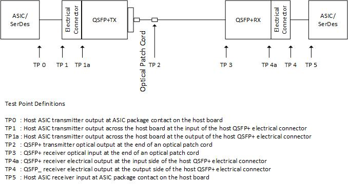
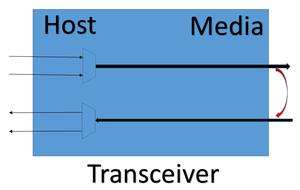
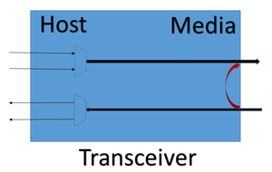
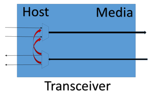
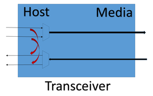

# SONiC CMIS 4.0 Diagnostic Support

## High Level Design Document

### Rev 0.5

# Table of Contents

* [List of Tables](#list-of-tables)
  * [Revision](#revision)
  * [About This Manual](#about-this-manual)
  * [Scope](#scope)
  * [Definition/Abbreviation](#definition-abbreviation)
  * [Requirements](#1-Requirements-Overview)
  * [Functionality](#2-Functionality)
  * [Design](#3-Design)
  * [Flow Diagrams](#4-Flow-Diagrams)
  * [Serviceability and Debug](#5-Serviceability-and-Debug)
  * [Warm Boot Support](#6-Warm-Boot-Support)
  * [Scalability](#7-Scalability)
  * [Unit Test](#8-Unit-Test)

# List of Tables

[Table 1: References](#table-1-references)<br>
[Table 2: Abbreviations](#table-2-abbreviations)

# Revision

| Rev |     Date    |       Author       | Change Description                |
|:---:|:-----------:|:------------------:|:-----------------------------------|
| 0.5 | 12/21/2020 | Dante (Kuo-Jung) Su | 1. Drop the dependency to the SONiC community pull request for the enhanced media support<br>2. Migrate the database from APPL_DB to CONFIG_DB<br>3. Added PRBS support<br>4. Updated the command syntax
| 0.4 | 08/05/2020 | William Schwartz | 1. Updated CLI command structure<br>2. Removed references to modifying admin state of the port<br> 3. Updated PORT_TABLE to reflect new change when port is places in diagnostic mode |
| 0.3 | 07/23/2020 | William Schwartz | 1. Updated yang models<br> 2. Updated TRANSCEIVER_DOM_SENSOR table entries to reflect proper values <br> 3. Removed non-supported CMIS CLI commands<br> 4. Resolved multiple review comments. |
| 0.2 | 06/25/2020 | William Schwartz | 1. Removed pattern generation / checker references.<br> 2. Corrected link to CMIS 4.0 specification<br> 3. Updated loopback test CLI mode to remove the individual lane enablement (that will be a future advanced feature enhancement)<br>4. Added loopback test Yang Model |
| 0.1 | 05/15/2020 | William Schwartz | Initial version |

# About this Manual

This document provides functional requirements and high-level design for providing CMIS 4.0 diagnostic support in SONiC.

#  References

##  Table 1: References

| **Document** | **Location** |
| ------------ | -------------- |
| QSFPDD CMIS 4.0 | http://www.qsfp-dd.com/wp-content/uploads/2019/05/QSFP-DD-CMIS-rev4p0.pdf |
| SONiC Management Framework | https://github.com/Azure/SONiC/blob/master/doc/mgmt/Management%20Framework.md |

# Scope

This document describes the high level design of CMIS 4.0 diagnostic support in SONiC.

# Definition/Abbreviation

## Table 2: Abbreviations

| **Term**     | **Meaning**                                                  |
| ------------ | ------------------------------------------------------------ |
| CMIS         | Common Management Interface Specification                    |
| CDB          | Common Data Block                                            |
| BER          | Bit Error Rate                                               |
| SNR          | Signal to Noise Ratio                                        |
| system -side | Refers to the internal connection between the switching silicon (MAC) and the transceiver |
| line-side    | Refers to the external connection between the transceiver and the remote connected device |
| FEC          | Forward Error Correction                                     |
| EPL          | Extended Payload Length                                      |
| COR          | Clear on Read                                                |
| CDR          | Clock and Data Recovery                                      |
| PRBS         | Pseudo Random Binary Sequence                                |

# 1 Requirements Overview

The Common Management Interface Specification (CMIS) version 4.0 (CMIS) was
finalized in May of 2019 and provides a variety of features and support for
different transceiver form factors.  From a software perspective, one of these
new features is the addition of diagnostic support to standardize transceiver
diagnostic implementation.

From a SONiC perspective, the addition of this diagnostic feature will enhance
platform development, user deployment, platform support, and serviceability.
Features such as system-side/line-side loopback testing at the transceiver
layer can quickly be tested by a remote user to diagnose either system-side or
line-side issues and help isolate failing hardware at various test-points.



## 1.1 Functional Requirements

The functional requirements for adding CMIS 4.0 diagnostic support in SONiC are:

1. Display loopback capabilities.
2. Display general pattern capabilities.
3. Display diagnostic reporting capabilities.
4. Display pattern generation and checking capabilities.
5. Display error information (e.g. SNR, BER)
6. Ability to configure / enable the transceiver loopback modes
7. Ability to configure / enable the transceiver pattern generation and checking


## 1.2 Configuration and Management Requirements

1. The CMIS 4.0 diagnostic support has to be managed using the SONiC management infrastructure.
2. The CMIS 4.0 diagnostic loopback should be disabled by default but persistent across reboot. Traffic can be run across the port while in diagnostic mode.


# 2 Functionality

## 2.1 Target Deployment Use Cases

CMIS 4.0 diagnostic support would be idea for initial switch deployment, diagnosing link/connection failures within the network topology, and ensuring link quality.


# 3 Design
## 3.1 Overview

CMIS 4.0 diagnostic support can be divided into the following components:

### 3.1.1 Transceiver Daemon

The transceiver daemon (**xcvrd**) is part of the SONIC platform monitor(**pmon**), and it is responsible for posting/deleting the transceiver information upon transceiver insertion/removal, and it will be furtherly enhanced for CMIS 4.0 diagnostic support with the per port parameters in **CONFIG_DB** and **STATE_DB**.

### 3.1.2 SONiC Management Framework
Management framework is a SONiC application which is responsible for providing various common North Bound Interfaces (NBIs) for the purposes of managing configuration and status on SONiC switches. The application manages coordination of NBI’s to provide a coherent way to validate, apply and show configuration. And the CMIS 4.0 diagnostic support will only be availble in this user interface.

## 3.2 Database

### 3.2.1 CONFIG_DB

The **TRANSCEIVER_DIAG** table will be newly introduced into CONFIG_DB for the diagnostic loopback configurations.
```
        "TRANSCEIVER_DIAG|Ethernet0": {
            "type": "hash",
            "value": {
                "lb_host_input_enabled": "True" | "False",
                "lb_host_output_enabled": "True" | "False",
                "lb_media_input_enabled": "True" | "False",
                "lb_media_output_enabled": "True" | "False",
                "prbs_generator_enabled": "True" | "False",
                "prbs_generator_mode": "Host" | "Media",
                "prbs_generator_pattern": [0, 15],
                "prbs_checker_enabled": "True" | "False",
                "prbs_checker_mode": "Host" | "Media",
                "prbs_checker_pattern": [0, 15],
            }
        },
```


### 3.2.2 STATE_DB

The **TRANSCEIVER_DIAG_INFO** table will have the following additional entries if the transceiver inserted is CMIS 4.0 compliant:
```
    "TRANSCEIVER_DIAG_INFO|Ethernet0": {
        "type": "hash",
        "value": {
            "cap_loopback_simultaneous_host_media": "True" | "False",
            "cap_loopback_per_lane_media": "True" | "False",
            "cap_loopback_per_lane_host": "True" | "False",
            "cap_loopback_host_input": "True" | "False",
            "cap_loopback_host_output": "True" | "False",
            "cap_loopback_media_input": "True" | "False",
            "cap_loopback_media_output": "True" | "False",
            "cap_prbs_auto_restart": "True" | "False",
            "cap_prbs_gating": "True" | "False",
            "cap_prbs_gating_per_lane": "True" | "False",
            "cap_prbs_latched_error_info": "True" | "False",
            "cap_prbs_realtime_ber": "True" | "False",
            "cap_prbs_fec_media": "True" | "False",
            "cap_prbs_fec_host": "True" | "False",
            "cap_prbs_snr_media": "True" | "False",
            "cap_prbs_snr_host": "True" | "False",
            "cap_prbs_input_peak_media": "True" | "False",
            "cap_prbs_input_peak_host": "True" | "False",
            "cap_prbs_ber": "True" | "False",
            "cap_prbs_ber_register": "True" | "False",
            }
```


## 3.3 Data Model

### 3.4.1 openconfig-platform-ext.yang

There is currently no yang model defined for transceiver diagnostics. Therefore, the openconfig-platform/transceiver will be augmented. 

The YANG tree will look as below:
```
module: openconfig-platform
  +--rw components
     +--rw oc-transceiver:transceiver
        |  +--rw oc-transceiver:config
        |  |  +--rw oc-pf-ext:lb-media-output-enabled?            boolean
        |  |  +--rw oc-pf-ext:lb-media-input-enabled?             boolean
        |  |  +--rw oc-pf-ext:lb-host-output-enabled?             boolean
        |  |  +--rw oc-pf-ext:lb-host-input-enabled?              boolean
        |  |  +--rw oc-pf-ext:prbs-generator-enabled?             boolean
        |  |  +--rw oc-pf-ext:prbs-generator-mode?                string
        |  |  +--rw oc-pf-ext:prbs-generator-pattern?             int
        |  |  +--rw oc-pf-ext:prbs-checker-enabled?               boolean
        |  |  +--rw oc-pf-ext:prbs-checker-mode?                  string
        |  |  +--rw oc-pf-ext:prbs-checker-pattern?               int
        |  +--ro oc-transceiver:state
        |  |  +--ro oc-pf-ext:cap-lb-media-output?                boolean
        |  |  +--ro oc-pf-ext:cap-lb-media-input?                 boolean
        |  |  +--ro oc-pf-ext:cap-lb-host-output?                 boolean
        |  |  +--ro oc-pf-ext:cap-lb-host-input?                  boolean
        |  |  +--ro oc-pf-ext:cap-lb-per-lane-host?               boolean
        |  |  +--ro oc-pf-ext:cap-lb-per-lane-media?              boolean
        |  |  +--ro oc-pf-ext:cap-lb-simul-host-media?            boolean
        |  |  +--ro oc-pf-ext:lb-media-output-enabled?            boolean
        |  |  +--ro oc-pf-ext:lb-media-input-enabled?             boolean
        |  |  +--ro oc-pf-ext:lb-host-output-enabled?             boolean
        |  |  +--ro oc-pf-ext:lb-host-input-enabled?              boolean
        |  |  +--ro oc-pf-ext:prbs-generator-enabled?             boolean
        |  |  +--ro oc-pf-ext:prbs-generator-mode?                string
        |  |  +--ro oc-pf-ext:prbs-generator-pattern?             int
        |  |  +--ro oc-pf-ext:prbs-checker-enabled?               boolean
        |  |  +--ro oc-pf-ext:prbs-checker-mode?                  string
        |  |  +--ro oc-pf-ext:prbs-checker-pattern?               int
```

### 3.5.3 Configuration Commands

The config commands uses Klish framework. It requires Klish to be in configuration mode (configure terminal).

#### Configure Loopback Controls

```
[no] interface transceiver diagnostics loopback {media-side-input|media-side-output|host-side-input|host-side-output} Ethernet <1|2..N>
```

This command enables the the loopback test mode of the transceiver.

|Loopback Type             |Illustraction                                 |
|--------------------------|----------------------------------------------|
|Media Side Output Loopback||
|Media Side Input Loopback |  |
|Host Side Output Loopback |  |
|Host Side Input Loopback  |    |

Use no form of the command to disable:

```
sonic-cli(config)# interface transceiver diagnostics loopback media-side-input Ethernet 112
sonic-cli(config)# no interface transceiver diagnostics loopback media-side-input Ethernet 112
```

#### Configure Pattern Generation and Checking Controls

```
[no] interface transceiver diagnostics prbs <generator|checker> <host|media> pattern <0|1..15> Ethernet <1|2..N>
```

This command enables the pattern generation and checking mode.

Use no form of the command to disable:

```
sonic-cli(config)# interface transceiver diagnostics prbs generator media pattern 0 Ethernet 112
sonic-cli(config)# no interface transceiver diagnostics prbs generator Ethernet 112
```

### 3.5.4 CLI Show Commands

#### Show Loopback Capability

```
show interface transceiver diagnostics capability Ethernet <1|2|..N>
```

This command shows diagnostics capability of the transceiver. If no specific transceiver is provided, all CMIS diagnostic supported transceivers are displayed with associated loopback capabilities.

Example output:

```
    sonic# show interface transceiver diagnostics capability Ethernet 112

    Ethernet112
    ----------------------------------------------------------
    Loopback Capabilities:
        Media Side Input Loopback                 Supported
        Media Side Output Loopback                Not Supported
        Host Side Input Loopback                  Supported
        Host Side Output Loopback                 Not Supported
        Per-lane Host Side Loopback               Not Supported
        Per-lane Media Side Loopback              Not Supported
        Simultaneous Host/Media Side Loopback     Not Supported

    Pattern Generation and Checking Capabilities:
        Auto Restart                              Supported
        Gating                                    Supported
        Per-Lane Gating                           Not Supported
        Latched Error Information                 Supported
        Realtime BER Polling                      Not Supported
        FEC: Media Side                           Not Supported
        FEC: Host Side                            Not Supported
        SNR: Media Side                           Supported
        SNR: Host Side                            Supported
        Input Peak: Media Side                    Not Supported
        Input Peak: Host Side                     Not Supported
        BER: Error Count/Total Bits               Supported
        BER: Register                             Not Supported
```

#### Show Diagnostics Control Status

```
show interface transceiver diagnostics status Ethernet <1|2|..N>
```

This command shows the loopback diagnostic controls of the transceiver. If no specific transceiver is provided, all CMIS diagnostic supported transceivers are displayed with associated control settings.

Example output:

```
sonic# show interface transceiver diagnostics status Ethernet 112

Ethernet112
Control Status                                  
--------------------------------------------------------
Loopback:
    Host Side Input                         Disabled
    Host Side Output                        Disabled
    Media Side Input                        Disabled
    Media Side Output                       Disabled

Pattern Generation and Checking:
    PRBS Generator                          Disabled
    PRBS Generator Mode                     Media(Tx)
    PRBS Generator Pattern                  0(PRBS-31Q)
    PRBS Checker                            Disabled
    PRBS Checker Mode                       Host(Rx)
    PRBS Checker Pattern                    0(PRBS-31Q)

Error Information:
    BER - Host Side                         0
    BER - Media Side                        0
    Input Peak - Host Side                  0
    Input Peak - Media Side                 0
    SNR - Host Side                         0
    SNR - Media Side                        0
```

  ### 3.5.4 Debug Commands

  No debug commands are planned for at this time.

  ### 3.5.5 REST API Support

  This is supported by default with the new management framework.

  # 4 Flow Diagrams

None


  # 5 Serviceability and Debug

The CMIS 4.0 diagnostic feature and does not require serviceability or debug capability.

  # 6 Warm Boot Support

The CMIS 4.0 diagnostic feature does not impact warm boot.

  # 7 Scalability

The CMIS 4.0 diagnostic feature is fully scalable on a SONiC platform and is supported on any port / transceiver which supports the CMIS 4.0 diagnostic features described in this specification.

# 8 Unit Test

The following is the list of unit test cases:
* Verify CMIS diagnostics CLI config commands.
* Verify CMIS diagnostics CLI show commands.
* Verify that CMIS diagnostics is disabled by default after installation.
* Verify CMIS 4.0 transceiver which supports loopback test works properly when configured in loopback mode.

# 9 Internal Design Information
There are no internal design changes relative to the CMIS 4.0 diagnostic support in SONiC.  Design architecture is in accordance with the SONiC design framework.