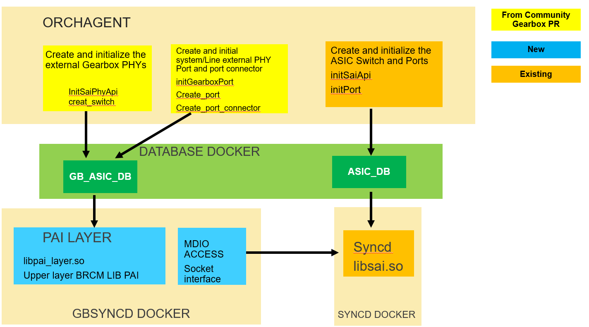

## Feature Name
**BRCM external PHY Gearbox Solution**

## High Level Design Document
**Rev 0.1**

## Table of Contents
 * [Revision](#revision)
 * [About This Manual](#about-this-manual)
 * [Scope](#scope)
 * [Requirements Overview](#requirements-overview)
    * [Functional Requirements](#functional-requirements)
 * [Supported Platforms](#supported-platforms)
 * [Design Detail](#design-overview)
 * [Serviceability and DEBUG](#serviceability-and-debug)
    * [Syslogs](#syslogs)
    * [Debug](#debug)
 * [Unit Test](#unit-test)

# Revision
| Rev |     Date    |       Author       | Change Description                |
|:---:|:-----------:|:------------------:|-----------------------------------|
| 0.1 | 04/18/2021  | Geans Pin          | Initial version

# About this Manual
We base on the existing gearbox framework to integrate and bring up the BRCM external PHY in the SONIC and propose an extra PAI Layer to compatible the BRCM LIB PAI and Gearbox framework. Also, we fix some issues in the gearbox framework.

# Scope
This document gives the details of Broadcom External PHY Supported Platforms implementation based on Gearbox framework

## 1 Requirements Overview
### 1.1	Functional Requirements
The functional requirements include :
- Create the Gearbox related JSONs for BRCM platform with external PHY 

- Implement an extra PAI Layer to resolve the compatible and multiple instances issue between Gearbox  framework with BRCM PAI LIB
   
- Fix the Gearbox issue found in SWSS and SAIREDIS.

## 2 Supported Platforms
Ideally the implement can apply for all of BRCM platforms with BRCM external PHY.  So far we choose the AS5835-54T with BCM84898 EXTERNAL PHY to be first implementation reference platform. 

## 3 Design Detail
The implementation is based on the current Gearbox [PR](https://github.com/Azure/SONiC/blob/master/doc/gearbox/gearbox_mgr_design.md) and add an extra Layer on top of the BRCM PAI lib to compatible with the gearbox and BRCM LIB PAI.  We link the extra layer in the "lib_name" of the gearbox_config.json to provide the flexibility. Here are the main design details :

1. Create the Gearbox related JSONs for BRCM platform with external PHY  : We follow the sonic gearbox PR reference to construct the gearbox_config.json, context_config.json, and phy_config.json.  In gearbiox_config.json, we link extra Layer libpai_layer.so into the "lib_name" , external phy  bcm84894_config.bcm into the "sai_init_config_file" and constuct the 48 interfaces with line_lanes, and system_lanes list. In the context_json,   we create the context "guid" : 0 for generic swith, and "guid" : 1 for the external phy and asign the "dbAsic" : GB_ASIC_DB to it. The mdio address information are provided in the phy_config.json.  All of the create/set switch, port, attributes and commands are sending to GB_ASIC_DB from SWSS orchagent  and consume by GBSYNCD container to process with extra PAI Layer and PAI LIB in low level.  

2. Implement an extra PAI Layer to resolve the compatible and multiple instances issue between Gearbox  framework with BRCM PAI LIB : The existing PAI LIB can't be directly used by GB-SYNCD in the Gearbox framework due to the specific 5-steps create_switch sequence.  Also, in the current LIB PAI on the AS5835 external PHY design, it requires one creat_switch per one PHY port. So, there will 48 create_switch. Applying  to the gearbox framework, it requires 48 context GBSYNC instances which will not be an acceptable design and will have huge system resource impact. So, we create an extra abstraction layer in the GB-SYNCD for resolving the compatible and multiple instance issue. The abstraction layer in GB-SYNCD will work for consuming the REDIS request from SWSS Orchagent and call to the PHY API in the existing BRCM PAI LIB.  There is one single global switch instance in the global PHY context to talk with the PAI LIB in which has many switch instances as it treats each PHY port as an instance.
In the new PAI layer, it will provide the standard SAI interface for PHY, e.g. - sai_api_initialize(), sai_api_uninitialize() and sai_api_query(). The GB-SYNCD retrieves sai_switch_api_t and sai_port_api_t functions using the PAI layer’s sai_api_query(). PAI layer retrieves the underneath functions using PAI library’s sai_api_query(). The sai_switch_api_t functions in the PAI layer will process all PHY instances, e.g. create_switch(), remove_switch(), set_switch_attribute() and etc. The phy_config.json will be used to determine how many PHY instance needed to be maintained. The SAI_SWITCH_ATTR_SWITCH_HARDWARE_INFO will be different for each PHY instance. The values are from the mdio address in the phy_config.json and are maintained internally in the PAI layer. The sai_port_api_t functions in the PAI layer will replace the switch_id before calling the corresponding functions in PAI library, e.g. create_port(), remove_port(), set_port_attribute() and etc. Each internal switch_id used in sai_port_api_t functions of PAI layer is created internally when ceate_switch() is called. External side only have one global single switch_id. 

