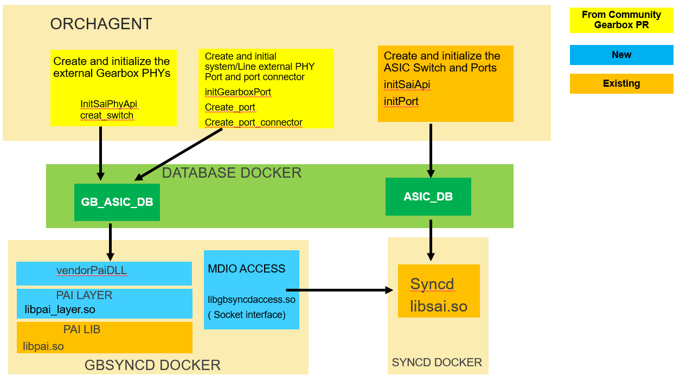

## Feature Name
**BRCM external PHY Gearbox Solution**

## High Level Design Document
**Rev 0.1**

## Table of Contents
 * [Revision](#revision)
 * [About This Manual](#about-this-manual)
 * [Scope](#scope)
 * [Requirements Overview](#requirements-overview)
    * [Functional Requirements](#functional-requirements)
 * [Supported Platforms](#supported-platforms)
 * [Design Detail](#design-overview)
 * [Serviceability and DEBUG](#serviceability-and-debug)
    * [Syslogs](#syslogs)
    * [Debug](#debug)
 * [Unit Test](#unit-test)

# Revision
| Rev |     Date    |       Author       | Change Description                |
|:---:|:-----------:|:------------------:|-----------------------------------|
| 0.1 | 04/18/2021  | Geans Pin          | Initial version

# About this Manual
We  propose an extra PAI layer within the existing Gearbox framework to integrate and bring up the BRCM external PHY in the SONIC. The proposed PAI layer is compatible with both the BRCM PAI library and the Gearbox framework. Also, we fix some issues in the Gearbox framework.

# Scope
This document gives the details of Broadcom External PHY Supported Platforms implementation based on the Gearbox framework

## 1 Requirements Overview
### 1.1	Functional Requirements
The functional requirements include :
- Create the Gearbox related JSONs for BRCM platform with external PHY 

- Implement an extra PAI Layer to resolve the compatible and multiple instances issue between Gearbox  framework with BRCM PAI LIB
  
- Fix the Gearbox issue found in SWSS and SAIREDIS.

## 2 Supported Platforms
Ideally the implement can be applied for all of BRCM platforms with BRCM external PHY.  So far we choose the AS5835-54T with BCM84898 EXTERNAL PHY to be first implementation reference platform. 

## 3 Design Detail
The implementation is based on the current Gearbox [PR](https://github.com/Azure/SONiC/blob/master/doc/gearbox/gearbox_mgr_design.md) and an extra layer is added as an library on top of the BRCM PAI library. The new libaray is compatible with the gearbox and PAI API.  We specify the extra layer library name in the "lib_name" of the gearbox_config.json to provide the flexibility. Here are the main design details :

1. Create the Gearbox related JSONs for BRCM platform with external PHY  : We follow the sonic gearbox PR reference to construct the gearbox_config.json, context_config.json, and phy_config.json.  In gearbiox_config.json, we link extra Layer libpai_layer.so into the "lib_name" , external phy  bcm84894_config.bcm into the "sai_init_config_file" and constuct the 48 interfaces with line_lanes, and system_lanes list. In the context_json,   we create the context "guid" : 0 for generic swith, and "guid" : 1 for the external phy and asign the "dbAsic" : GB_ASIC_DB to it. The mdio address information are provided in the phy_config.json.  All of the create/set switch, port, attributes and commands are sending to GB_ASIC_DB from SWSS orchagent  and consume by GBSYNCD container to process with extra PAI Layer and PAI LIB in low level.  

2. Implement an extra PAI Layer to resolve the compatibility issue and scalibilty issue of multiple instances in Gearbox  framework with BRCM PAI LIB. The existing PAI LIB used by GB-SYNCD in the Gearbox framework breaks the create_switch sequence into multiple steps due to the fact that only one time of PHY firmware download is needed for a group of PHYs on the same MDIO bus.  Also, the current LIB PAI treats each PHY as inividual switch. Actually each PHY is defined as what uses a distinguish MDIO address. For the particular platform of AS5835-48t, it has 12 quad-PHYs but 48 distinguish MDIO addresses and it requires one creat_switch per one PHY port. So, there will be 48 switches created. Applying  to the gearbox framework, it requires 48 context GBSYNC instances which will not scale well and will have huge system resource impact. So, we create an extra abstraction layer in the GB-SYNCD for resolving the compatible and multiple instance issue. The abstraction layer in GB-SYNCD will work for consuming the REDIS request from SWSS Orchagent and call to the PHY API in the existing BRCM PAI LIB.  There is one single global switch instance in the global PHY context to talk with the PAI LIB in which has many switch instances as it treats each PHY port as an instance.
  In the new PAI layer, it will provide the standard SAI interface for PHY, e.g. - sai_api_initialize(), sai_api_uninitialize() and sai_api_query(). The GB-SYNCD retrieves sai_switch_api_t and sai_port_api_t functions using the PAI layerís sai_api_query(). PAI layer retrieves the underneath functions using PAI libraryís sai_api_query(). The sai_switch_api_t functions in the PAI layer will process all PHY instances, e.g. create_switch(), remove_switch(), set_switch_attribute() and etc. Bothe the gearbox_config.json and phy_config.json will be used to determine how many PHY instance needed to be maintained. 

  - The "lanes" section in "phy_config.json" is parsed for index, the MDIO addresses, system side or port side. Because PHY address is only 5 bits, the MDIO address above beyond 5 bits is related to the MDIO bus number. Unique PHY address and unique bus number are extracted and maintained.
  - The "interfaces" section of "gearbox_config.json" is parsed for the lists of system lanes and line lanes. By correlating the lane index to the index in lanes section, we can get the PHY address of each interface. 
  - The "ports" section in "phy_config.json" is parsed for line advertised speed list.

  For the underneath BRCM LIB PAI, each PHY with an unique MDIO address is a switch. When the switch is created, the attribute SAI_SWITCH_ATTR_SWITCH_HARDWARE_INFO with the MDIO address as the attribute vlaue will be passed for each PHY instance. The values are from the mdio address in the phy_config.json and are maintained internally in the PAI layer. The created switch oid for the underneath BRCM LIB PAI are maintained internally. sai_port_api_t functions in the PAI layer will replace the switch oid before calling the corresponding functions in PAI library, e.g. create_port(), remove_port(), set_port_attribute() and etc. The attribute SAI_PORT_ATTR_HW_LANE_LIST is required when create port. The lane list of the attribute SAI_PORT_ATTR_HW_LANE_LIST value is used to find the internal maintained swith oid. Each internal switch_id used in sai_port_api_t functions of PAI layer is created internally when ceate_switch() is called. External side only have one global single switch_id. 

3. Fix the Gearbox issue found in SWSS and SAIREDIS : Since there is an attribute SAI_PORT_ATTR_INTERFACE_TYPE missing in the call of initGearboxPort from the SWSS, we add a new key system_intf_type in the gearsyncd. If user doesn't provide this key in the gearbox_config.json, in the gearsyncd system_intf_type will be set to XFI by default. 