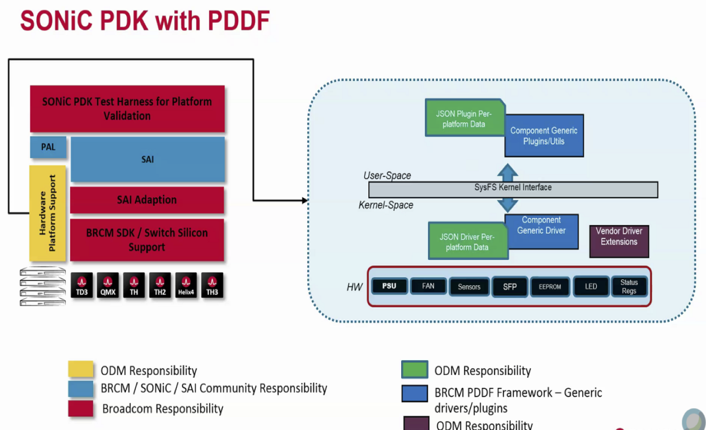
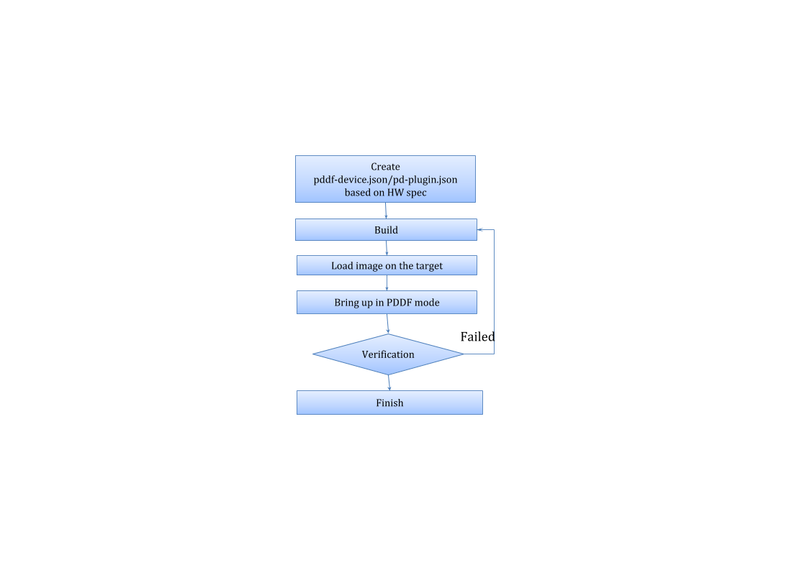
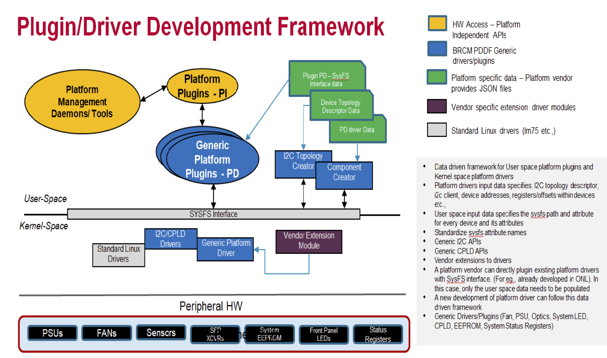
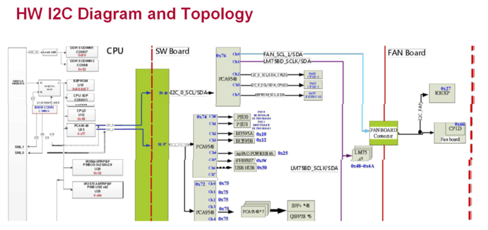

## Document Name
Platform Driver Development Framework (PDDF) Developer Guide

## User Guide
**Rev 0.1**

## Table of Contents
 * [Reviews and Revision History](#reviews-and-revision-history)
 * [Introduction](#introduction)
	 * [Abbreviations](#abbreviations)
	 * [PDDF Components](#pddf-components)
	 * [PDDF SONiC Platform Bringup Process](#pddf-sonic-platform-bring-up-process)
* [PDDF SONiC Platform Bring Up Development](#pddf-sonic-platform-bring-up-development)
* [PDDF Design](#pddf-design)
	* [JSON Descriptor Files](#json-descriptor-files)
	* [Custom Vendor Driver Extensions](#custom-vendor-driver-extensions)
	* [Custom Vendor Driver](#custom-vendor-driver)
	* [Supporting Files](#supporting-files)
* [PDDF Code Organisation](#pddf-code-organisation)
	* [JSON Descriptor Files and Schema Files](#json-descriptor-files-and-schema-files)
	* [Generic Platform Drivers](#generic-platform-drivers)
	* [Generic User Space Python Plugins](#generic-user-space-python-plugins)
	* [Custom Vendor Driver Extension Code](#custom-vendor-driver-extension-code)
	* [Generic PDDF Utilities](#generic-pddf-utilities)
	* [PDDF Scripts](#pddf-scripts)
* [Building and Packaging](#building-and-packaging)
	* [Build Broadcom SONiC Image](#build-broadcom-sonic-image)
	* [Build PDDF Debian Packages](#build-pddf-debian-packages)
* [Image Installation](#image-installation)
	* [Install Image in ONIE](#install-image-in-onie)
	* [Install Image in Switch](#install-image-in-switch)
	* [Install PDDF Debian Packages in Switch](#install-pddf-debian-packages-in-switch)
* [Bring up in PDDF mode](#bring-up-in-pddf-mode)
* [Verification](#verification)
* [Debug](#debug)


# Reviews and Revision History
| Rev |     Date    |       Author       | Change Description                |
|:---:|:-----------:|:------------------:|-----------------------------------|
| 0.1 | 08/14/2019  |  Systems Infra Team     | Initial version                   |

# Introduction
Platform Driver Development Framework (PDDF) is a data driven framework which enables platform vendors to rapidly develop the device specific custom drivers and SONiC user space python plugins, to manage platform devices like Fan, PSUs, LEDs, Optics, System EEPROM, etc., and quickly validate a platform on SONiC. The PDDF consists of generic device drivers and user space platform API plugins which use the per platform specific data in the JSON descriptor files. This document describes how developers can use PDDF generic framework for drivers and plugins and develop custom device drivers rapidly to accelerate development and validation of platforms in SONiC environment.

## Abbreviations
| **Term**                 		| **Meaning**                         |
|-------------------------------|-------------------------------------|
| ODM                      		| Original Design Manufacturer        |
| OEM                      		| Original Equipment Manufacturer       |
| PDDF                     		| Platform Driver Development Framework |
| SAI                      		| Switch Abstraction Interface |
| PSU                      		| Power Supply Unit |
| I2C Topology             		| Representation of the I2C bus and the inter connection of I2C devicesTo enable I2C client instantiation and access using kernel I2C interface |
| Platform Access Data Attributes   | Attributes which are platform specific, and helps access device attributes CPLD registers/ offsets/ masks, etc., |
| Device Data Attributes   			| Attributes which are used to monitor and manage devices. For eg., Fan attributes – Presence, Fan speed, fan direction, etc., Temp sensor attributes - temp value, etc., PSU attributes - PSU status, presence etc., |
| Standard Linux Driver Data  		| List of standard linux drivers to be loaded before PDDF drivers are loaded Platform specific options for each driver |
| Component Plugin Data				| Per component attribute SysFS Path Per component attribute manipulation data |


## PDDF Components


Typically, each platform vendor needs to write their own drivers and plugins to bring up SONiC platform. For each new platform bringing up, a vendor writes new drivers and plugins again and goes through building, installing and validating cycles. The process usually takes weeks to finish. PDDF is designed to avoid repetitively writing similar drivers and plugins by providing a data driven, generic drivers and plugins development framework. Vendors only need to fill JSON descriptor files from the HW spec with minimum coding without writing drivers and plugins. If there are any vendor specific driver requirements, PDDF also allows vendor-specific drivers to be loaded. This makes the development and testing much simpler. Any change in the platform data can be made on the target in the JSON files and validated instantly. This helps improve the productivity of the platform developers significantly down to hours. In Arlo release, only I2C based HWs are supported by PDDF.

PDDF consists of the following components:
-   JSON descriptor files
ODM vendors need to provide JSON descriptor files. The list of information provided by the files is below
	- Platform Inventory Info, number of fans and psus etc.
	-   Device Parsing Information
	-   I2C Topology Information
	-   Device Access Information
	-   Value Mapping Information for various device-data Attributes etc.

-   Generic platform drivers for managing the following components
	-   FAN
	-   PSU (Power supply units)
	-   System EEPROM
	-   Optic Transceivers (SFP, QSFP)
	- Temp Sensors
	- CPLD
	- System Status Registers
	- System LED

 -   Generic user space python plugins to get/set various attributes for the following devices
	 -   FAN
	 - PSU (Power supply units)
	 - System EEPROM
	 - Optic Transceivers (SFP, QSFP)
	 - Temp Sensors
	 - System Status Registers
	 - System LED

-   Custom vendor driver extensions for customization and extensibility for following components
	- FAN
	- PSU
	- Optic Transceivers

## PDDF SONiC Platform Bring Up Process
This diagram shows the high level platform bring up process using PDDF. The detail description of each step will be documented in the later sections.


# PDDF SONiC Platform Bring up Development
This section provides details about new platform bring up development using PDDF.

# PDDF Design


SONiC PDDF supports the following HW devices on a given platform: Fan/PSU/System EEPROM/ CPLD/ Optic Transceivers/ System LED control via CPLD, System Status Registers in CPLD/ Temp Sensors. High level architecture of the PDDF consists of the following:
-   JSON Descriptor files
-   Generic Platform Drivers and Scripts
-   Generic Platform Python Plugins for various devices implementing the Platform APIs
-   Custom Vendor Driver Extensions
-   SONiC PDDF Utilities to set/get devices

## JSON Descriptor Files
For a new platform bringing up, vendors need to create a new directory to store two platform-specific JSON files, pddf-device.json and pd-plugin.json.

```
-   Create sonic-buildimage/device/<vender_name>/<platform>/pddf/ directory
-   Create pddf-device.json
-   Create pd-plugin.json file
```

### pddf-device.json
The pddf-device,json file is configured with three types of data to represent the following information for a given platform
- I2C Topology Data
	- Representation of the I2C bus and the inter connection of I2C devices.
	- To enable I2C client instantiation and access using kernel I2C interface
	- Description of I2C to reach to a particular device starting from CPU root
	- The I2C topology information is documented in the platform HW spec.
- Device Data
	- Representation of device-data SysFS attributes exposed by standard device drivers. For example: lm75 exposes temp1_max, temp1_max_hyst etc.
	- Information that is specific to the device e.g. index, virtual bus number etc.
- Platform Access Data
	- Each device exposes a set of data attributes to read and write
	- Access devices/registers/offset/bit masks etc are platform dependent and differ for each data-attribute
	- The information is documented in the platform HW spec.
	- SysFS attributes are created under /sys/kernel/pddf/devices/\<component\>/

Naming Convention in pddf-device.json file is as follows,
-   **device_type**: PDDF predefines the list of dev_type.
CPU, MUX, CPLD, SMBUS, FAN, SYSSTAT, SFP, SFP28, QSFP, QSFP28, EEPROM, TEMP_SENSOR, PSU, PSU-PMBUS, PSU-EEPROM, LED
-   **device_name**: PDDF predefines the list of system LED
LOC_LED, DIAG_LED, PSU_LED, FAN_LED, SYS_LED,

Other than LED names, usually **device_name** is same as the name of the JSON object representing the device, e.g. CPLD1, CPLD2, MUX1, PSU2, TEMPCPU, etc.

Mentioned below are the configuration examples for various device_types based on the topology diagram,


#### MUX Configuration Example
Generally platforms use switches to multiplex the bus. There is a support for PCA954* muxes in PDDF. A typical mux JSON object is shown below,
```
"SYSTEM":
{
	"dev_info": {"device_type":"CPU", "device_name":"ROOT_COMPLEX", "device_parent":null},
	"i2c":
	{
		"CONTROLLER":
		[
			{ "dev_name":"i2c-1", "dev":"SMBUS1" },
			{ "dev_name":"i2c-0", "dev":"SMBUS0" }
		]
	}
},
"SMBUS1":
{
	"dev_info": {"device_type": "SMBUS", "device_name": "SMBUS1", "device_parent": "SYSTEM"},
	"i2c":
	{
		"topo_info": {"dev_addr": "0x0"},
		"DEVICES":
		[
			{"dev": "EEPROM1"},
			{"dev": "MUX2"},
			{"dev": "MUX3"},
			{"dev": "MUX4"},
			{"dev": "MUX5"},
			{"dev": "MUX6"}
		]
	}
},
"MUX2":
{
	"dev_info": { "device_type":"MUX", "device_name":"MUX2",
	"device_parent":"SMBUS0"},
	"i2c":
	{
		"topo_info": { "parent_bus":"0x0", "dev_addr":"0x74", "dev_type":"pca9548"},
		"dev_attr": { "virt_bus":"0x20"},
		"channel":
		[
			{ "chn":"0", "dev":"PSU0" },
			{ "chn":"1", "dev":"PSU1" }
		]
	}
},
```
Description of some keys in the JSON object is given below,

**device_type**: This mentions the generic device type. It can be either of these, PSU, FAN, CPLD, MUX, EEPROM, SFP, etc. This is a mandatory field.

**device_name**: This is the name of the device in the I2C topology. There can be a number or a substring appended to uniquely identify the device. e.g. FAN-CPLD, PSU1, PSU2, PORT1, MUX2 etc. This is a mandatory field.

**device_parent**: This gives the name of the parent device in the topology. It is also a mandatory field.

**i2c** object is put to differentiate with other mode of access such as PCI or BMC etc. **topo_info** gives the info to generate the I2C client. All the fields inside topo_info are mandatory.

**parent_bus**: This denotes the bus number to which device is connected.

**dev_addr**: This denotes the I2C address in the range of <0x0-0xff>.

**dev_type**: This denotes the chip-name/type of device. This should match with the dev_id of the device inside the supporting driver.

**dev_attr** object for a MUX has only one element, viz. **virt_bus**. This denotes the base bus number for various channels of the mux. e.g. if **virt_bus** for a mux is 0x10, then channel i of that mux would be numbered (0x10+i).

**channel**: This array gives info about the child devices for a mux. It mentions **chn** denoting the channel number, and **dev** denoting the device_name connected to this channel.

The names of the sub-objects/keys in any JSON object are fixed. For example, **dev_info**, **i2c**, **topo_info**, **DEVICES**, **channel** and **controllers** etc.

#### PSU Device Configuration Example
```
"MUX2":
{
	"dev_info": { "device_type":"MUX", "device_name":"MUX2", "device_parent":"SMBUS0"},
	"i2c":
	{
		"topo_info": { "parent_bus":"0x0", "dev_addr":"0x74", "dev_type":"pca9548"},
		"dev_attr": { "virt_bus":"0x20"},
		"channel":
		[
			{ "chn":"0", "dev":"PSU0" },
			{ "chn":"1", "dev":"PSU1" }
		]
	}
},
```
PSUs are connected to PCA9548 mux which is connected to SMBUS1. MUX2 denotes the PC9548 where PSUs are connected. Since it is directly connected to system bus 1, SMBUS1 is mentioned as the **device_parent**.
```
"PSU1":
{
	"dev_info": { "device_type":"PSU", "device_name":"PSU1", "device_parent":"MUX2"},
	"dev_attr": { "dev_idx":"1", "num_psu_fans": "1"},
	"i2c":
	{
		"interface":
		[
			{ "itf":"pmbus", "dev":"PSU1-PMBUS" }
		]
	},
	"bmc":
	{
		"attr_list":[]
	}
},
```
In the JSON object for PSU, say PSU1, please note that the **device_parent** is mentioned as MUX2.
List down the applicable (or required) interfaces under **interface** array. For the above platform, even though ‘eeprom’ interface exists, we are not retrieving any information from it. All the HW information can be accessed via ‘pmbus’ interface, hence only pmbus is mentioned. **dev_attr** field, is specific to the device level information. Hence **dev_idx** and **no_psu_fans** are mentioned here.

Since all the device data attributes are being read from pmbus interface, related information is provided in ‘PSU1-PMBUS’ JSON object.
```
"PSU1-PMBUS":
{
	"dev_info": { "device_type":"PSU-PMBUS", "device_name":"PSU1-PMBUS", "device_parent":"MUX2", "virt_parent":"PSU1"},
	"i2c":
	{
		"topo_info":{ "parent_bus":"0x21", "dev_addr":"0x5b", "dev_type":"psu_pmbus"},
		"attr_list":
		[
				{ "attr_name":"psu_present", "attr_devaddr":"0x60", "attr_devtype":"cpld", "attr_offset":"0x2", "attr_mask":"0x2", "attr_cmpval":"0x0", "attr_len":"1"},
				{ "attr_name":"psu_model_name", "attr_devaddr":"0x5b", "attr_devtype":"pmbus", "attr_offset":"0x9a", "attr_mask":"0x0", "attr_cmpval":"0xff", "attr_len":"9" },
				{ "attr_name":"psu_power_good", "attr_devaddr":"0x60", "attr_devtype":"cpld", "attr_offset":"0x2", "attr_mask":"0x28", "attr_cmpval":"0x28", "attr_len":"1"},
				{ "attr_name":"psu_mfr_id", "attr_devaddr":"0x5b", "attr_devtype":"pmbus", "attr_offset":"0X99", "attr_mask":"0x0", "attr_cmpval":"0xff", "attr_len":"10" },
				{ "attr_name":"psu_serial_num", "attr_devaddr":"0x5b", "attr_devtype":"pmbus", "attr_offset":"0x9e", "attr_mask":"0x0", "attr_cmpval":"0xff", "attr_len":"20" },
				{ "attr_name":"psu_fan_dir", "attr_devaddr":"0x5b", "attr_devtype":"pmbus", "attr_offset":"0xc3", "attr_mask":"0x0", "attr_cmpval":"0xff", "attr_len":"5"},
				{ "attr_name":"psu_v_out", "attr_devaddr":"0x5b", "attr_devtype":"pmbus", "attr_offset":"0x8b", "attr_mask":"0x0", "attr_cmpval":"0xff", "attr_len":"2"},
				{ "attr_name":"psu_i_out", "attr_devaddr":"0x5b", "attr_devtype":"pmbus", "attr_offset":"0x8c", "attr_mask":"0x0", "attr_cmpval":"0xff", "attr_len":"2"},
				{ "attr_name":"psu_p_out", "attr_devaddr":"0x5b", "attr_devtype":"pmbus", "attr_offset":"0x96", "attr_mask":"0x0", "attr_cmpval":"0xff", "attr_len":"2"},
				{ "attr_name":"psu_fan1_speed_rpm", "attr_devaddr":"0x5b", "attr_devtype":"pmbus", "attr_offset":"0x90", "attr_mask":"0x0", "attr_cmpval":"0xff", "attr_len":"2"}
		]
	}
},
```
**virt_parent** field donetes the device who’s sub-interface is PSU1-PMBUS object, i.e. PSU1. Brief description of the keys under **attr_list** is mentioned below,

**attr_name**: This field denotes the name of SysFS attribute associated with this device I2C client. It is a mandatory field.

**attr_devaddr**: This denotes the I2C address of device from where this SysFS attribute value is to be read. e.g if psu_present is the SysFS attribute, and it needs to be read from a CPLD, the I2C address of that CPLD is to be mentioned here.

**attr_devtype**: Source device type of the value of SysFS attribute.

**attr_offset**: Register offset of the SysFS attribute.

**attr_mask**: Mask to be applied to read value.

**attr_cmpval**: Expected reg value after applying the mask. This is used to provide a Boolean value to the attribute. e.g attr_val = ((reg_val & attr_mask) == attr_cmpval) .

**attr_len**: Length of the SysFS attribute in bytes.

PDDF generic driver for PSU can have chip name (mentioned as dev_type in JSON object) psu_pmbus or psu_eeprom. It supports a limited set of device data attributes, with fixed names, listed below.
* psu_present
* psu_model_name
* psu_power_good
* psu_mfr_id
* psu_serial_num
* psu_fan_dir
* psu_v_out
* psu_i_out
* psu_p_out
* psu_fan1_speed_rpm

Based on the JSON configuration file, the parser, pddfparse.py, can generate sysfs path automatically instead of hard coded in the plugin code.

I2C Topology Data:
>SMBus1->MUX(0x71)->Ch0->PSU2(0x5b) SMBUS Device

Device Data SysFs Attributes:
>/sys/bus/i2c/devices/i2c-0/i2c-33/33-005b/psu_present
>
>/sys/bus/i2c/devices/i2c-0/i2c-33/33-005b/psu_model_name
>
>/sys/bus/i2c/devices/i2c-0/i2c-33/33-005b/psu_power_good
>
>/sys/bus/i2c/devices/i2c-0/i2c-33/33-005b/psu_mfr_id
>
>/sys/bus/i2c/devices/i2c-0/i2c-33/33-005b/psu_serial_num
>
>/sys/bus/i2c/devices/i2c-0/i2c-33/33-005b/psu_fan_dir
>
>/sys/bus/i2c/devices/i2c-0/i2c-33/33-005b/psu_v_out
>
>/sys/bus/i2c/devices/i2c-0/i2c-33/33-005b/psu_i_out
>
>/sys/bus/i2c/devices/i2c-0/i2c-33/33-005b/psu_p_out
>
>/sys/bus/i2c/devices/i2c-0/i2c-33/33-005b/psu_fan1_speed_rpm

Platform Access Data SysFs Attributes:
>admin@sonic:/sys/kernel/pddf/devices/psu/i2c$ ls
>
>attr_cmpval attr_len attr_offset dev_ops i2c_name psu_fans
>
>attr_devaddr attr_mask attr_ops dev_type i2c_type psu_idx
>
>attr_devtype attr_name dev_addr error parent_bus


#### FAN controller Configuration Example
FAN controller for the above platform is a CPLD. It is connected to PCA9548 (MUX1) as shown in the JSON object below.
```
"MUX1":
{
	"dev_info": { "device_type":"MUX", "device_name":"MUX1", "device_parent":"SMBUS0"},
	"i2c":
	{
		"topo_info": { "parent_bus":"0x0", "dev_addr":"0x76", "dev_type":"pca9548"},
		"dev_attr": { "virt_bus":"0x10"},
		"channel":
		[
			{ "chn":"0", "dev":"FAN-CTRL" },
			{ "chn":"1", "dev":"TEMP1" },
			{ "chn":"1", "dev":"TEMP2" },
			{ "chn":"1", "dev":"TEMP3" },
			{ "chn":"1", "dev":"TEMP4" },
			{ "chn":"2", "dev":"CPLD1" },
			{ "chn":"3", "dev":"CPLD2" },
			{ "chn":"4", "dev":"CPLD3" }
		]
	}
},
```
SMBUS0 is shown as the **device_parent** for MUX1. FAN controller (FAN-CTRL) is connected to channel 0 of the mux.
Currently, the PDDF generic plugins and JSON descriptor file support only one fan controller which would be named (FAN-CTRL). In future versions of PDDF, there is a plan to add support for multiple controllers viz. FAN-CTRL1, FAN-CTRL2 etc.

FAN-CTRL JSON object is mentioned below,
```
"FAN-CTRL":
{
	"dev_info": { "device_type":"FAN", "device_name":"FAN-CTRL", "device_parent":"MUX1"},
	"i2c":
	{
		"topo_info": { "parent_bus":"0x10", "dev_addr":"0x66", "dev_type":"fan_ctrl"},
		"dev_attr": { "num_fan":"6"},
		"attr_list":
		[
			{ "attr_name":"fan1_present", "attr_devtype":"FAN-CTRL", "attr_offset":"0x0F", "attr_mask":"0x1", "attr_cmpval":"0x0", "attr_len":"1"},
			{ "attr_name":"fan2_present", "attr_devtype":"FAN-CTRL", "attr_offset":"0x0F", "attr_mask":"0x2", "attr_cmpval":"0x0", "attr_len":"1"},
			{ "attr_name":"fan3_present", "attr_devtype":"FAN-CTRL", "attr_offset":"0x0F", "attr_mask":"0x4", "attr_cmpval":"0x0", "attr_len":"1"},
			{ "attr_name":"fan4_present", "attr_devtype":"FAN-CTRL", "attr_offset":"0x0F", "attr_mask":"0x8", "attr_cmpval":"0x0", "attr_len":"1"},
			{ "attr_name":"fan5_present", "attr_devtype":"FAN-CTRL", "attr_offset":"0x0F", "attr_mask":"0x10", "attr_cmpval":"0x0", "attr_len":"1"},
			{ "attr_name":"fan6_present", "attr_devtype":"FAN-CTRL", "attr_offset":"0x0F", "attr_mask":"0x20", "attr_cmpval":"0x0", "attr_len":"1"},
			{ "attr_name":"fan1_direction", "attr_devtype":"FAN-CTRL", "attr_offset":"0x10", "attr_mask":"0x1", "attr_cmpval":"0x1", "attr_len":"1"},
			{ "attr_name":"fan2_direction", "attr_devtype":"FAN-CTRL", "attr_offset":"0x10", "attr_mask":"0x2", "attr_cmpval":"0x2", "attr_len":"1"},
			{ "attr_name":"fan3_direction", "attr_devtype":"FAN-CTRL", "attr_offset":"0x10", "attr_mask":"0x4", "attr_cmpval":"0x4", "attr_len":"1"},
			{ "attr_name":"fan4_direction", "attr_devtype":"FAN-CTRL", "attr_offset":"0x10", "attr_mask":"0x8", "attr_cmpval":"0x8", "attr_len":"1"},
			{ "attr_name":"fan5_direction", "attr_devtype":"FAN-CTRL", "attr_offset":"0x10", "attr_mask":"0x10", "attr_cmpval":"0x10", "attr_len":"1"},
			{ "attr_name":"fan6_direction", "attr_devtype":"FAN-CTRL", "attr_offset":"0x10", "attr_mask":"0x20", "attr_cmpval":"0x20", "attr_len":"1"},
			{ "attr_name":"fan1_front_rpm", "attr_devtype":"FAN-CTRL", "attr_offset":"0x12", "attr_mask":"0xFF", "attr_len":"1", "attr_mult":"100", "attr_is_divisor":0},
			{ "attr_name":"fan2_front_rpm", "attr_devtype":"FAN-CTRL", "attr_offset":"0x13", "attr_mask":"0xFF", "attr_len":"1", "attr_mult":"100", "attr_is_divisor":0},
			{ "attr_name":"fan3_front_rpm", "attr_devtype":"FAN-CTRL", "attr_offset":"0x14", "attr_mask":"0xFF", "attr_len":"1", "attr_mult":"100", "attr_is_divisor":0},
			{ "attr_name":"fan4_front_rpm", "attr_devtype":"FAN-CTRL", "attr_offset":"0x15", "attr_mask":"0xFF", "attr_len":"1", "attr_mult":"100", "attr_is_divisor":0},
			{ "attr_name":"fan5_front_rpm", "attr_devtype":"FAN-CTRL", "attr_offset":"0x16", "attr_mask":"0xFF", "attr_len":"1", "attr_mult":"100", "attr_is_divisor":0},
			{ "attr_name":"fan6_front_rpm", "attr_devtype":"FAN-CTRL", "attr_offset":"0x17", "attr_mask":"0xFF", "attr_len":"1", "attr_mult":"100", "attr_is_divisor":0},
			{ "attr_name":"fan1_rear_rpm", "attr_devtype":"FAN-CTRL", "attr_offset":"0x22", "attr_mask":"0xFF", "attr_len":"1", "attr_mult":"100" , "attr_is_divisor":0},
			{ "attr_name":"fan2_rear_rpm", "attr_devtype":"FAN-CTRL", "attr_offset":"0x23", "attr_mask":"0xFF", "attr_len":"1", "attr_mult":"100" , "attr_is_divisor":0},
			{ "attr_name":"fan3_rear_rpm", "attr_devtype":"FAN-CTRL", "attr_offset":"0x24", "attr_mask":"0xFF", "attr_len":"1", "attr_mult":"100" , "attr_is_divisor":0},
			{ "attr_name":"fan4_rear_rpm", "attr_devtype":"FAN-CTRL", "attr_offset":"0x25", "attr_mask":"0xFF", "attr_len":"1", "attr_mult":"100" , "attr_is_divisor":0},
			{ "attr_name":"fan5_rear_rpm", "attr_devtype":"FAN-CTRL", "attr_offset":"0x26", "attr_mask":"0xFF", "attr_len":"1", "attr_mult":"100" , "attr_is_divisor":0},
			{ "attr_name":"fan6_rear_rpm", "attr_devtype":"FAN-CTRL", "attr_offset":"0x27", "attr_mask":"0xFF", "attr_len":"1", "attr_mult":"100" , "attr_is_divisor":0},
			{ "attr_name":"fan1_pwm", "attr_devtype":"FAN-CTRL", "attr_offset":"0x11", "attr_mask":"0x0F", "attr_len":"1" },
			{ "attr_name":"fan2_pwm", "attr_devtype":"FAN-CTRL", "attr_offset":"0x11", "attr_mask":"0x0F", "attr_len":"1" },
			{ "attr_name":"fan3_pwm", "attr_devtype":"FAN-CTRL", "attr_offset":"0x11", "attr_mask":"0x0F", "attr_len":"1" },
			{ "attr_name":"fan4_pwm", "attr_devtype":"FAN-CTRL", "attr_offset":"0x11", "attr_mask":"0x0F", "attr_len":"1" },
			{ "attr_name":"fan5_pwm", "attr_devtype":"FAN-CTRL", "attr_offset":"0x11", "attr_mask":"0x0F", "attr_len":"1" },
			{ "attr_name":"fan6_pwm", "attr_devtype":"FAN-CTRL", "attr_offset":"0x11", "attr_mask":"0x0F", "attr_len":"1" }
		]
	}
},
```

Only one **dev_attr** is defined for FAN and it is **num_fan**. Description of some of the new keys are given below,

**attr_mult**: Multiplication factor to the value to get the FAN RPM.

**attr_is_divisor**: If the register value is a divisor to the multiplication factor to get the FAN RPM.

PDDF generic fan controller driver supports chip name <fan_ctrl>. The supported device data attributes are,
* fan\<idx\>\_present
* fan\<idx\>\_direction
* fan\<idx\>\_front_rpm
* fan\<idx\>\_rear_rpm
* fan\<idx\>\_pwm
* fan\<idx\>\_fault

where idx represents the Fan index [1..6]

#### System LED Configuration Example
```
"SMBUS0":
{
	"dev_info": {"device_type": "SMBUS", "device_name": "SMBUS0", "device_parent": "SYSTEM"},
	"i2c":
	{
		"topo_info": {"dev_addr": "0x0"},
		"DEVICES":
		[
			{"dev": "MUX1"}
		]
	}
},
"MUX1":
{
	"dev_info": { "device_type":"MUX", "device_name":"MUX1", "device_parent":"SMBUS1"},
	"i2c":
	{
		"topo_info": { "parent_bus":"0x1", "dev_addr":"0x76", "dev_type":"pca9548"},
		"dev_attr": { "virt_bus":"0x10"},
		"channel":
		[
			{ "chn":"0", "dev":"FAN-CTRL" },
			{ "chn":"1", "dev":"TEMP1" },
			{ "chn":"1", "dev":"TEMP2" },
			{ "chn":"1", "dev":"TEMP3" },
			{ "chn":"1", "dev":"TEMP4" },
			{ "chn":"2", "dev":"CPLD1" },
			{ "chn":"3", "dev":"CPLD2" },
			{ "chn":"4", "dev":"CPLD3" }
		]
	}
},
"DIAG_LED":
{
	"dev_info": { "device_type":"LED", "device_name":"DIAG_LED"},
	"dev_attr": { "index":"0"},
	"i2c" : {
		"attr_list":
		[
			{"attr_name":"on", "bits" : "1:0", "color" : "Green", "value" : "0x2",
"swpld_addr" : "0x60", "swpld_addr_offset" : "0x41"},
			{"attr_name":"faulty", "bits" : "1:0", "color" : "Red", "value" : "0x1",
"swpld_addr" : "0x60", "swpld_addr_offset" : "0x41"},
			{"attr_name":"off", "bits" : "1:0", "color" : "Off", "value" : "0x3",
"swpld_addr" : "0x60", "swpld_addr_offset" : "0x41"}
		]
	}
}
```
swpld offset 0x41 System-LED-1 (Read&Write)

| **Bit** | **Name** | **R/W** | **Rest Value** | **Description** 	         |
|---------|----------|---------|----------------|----------------------------|
| 1       | DIAG_R   | R/W     | 1              | 1: Diag Red LED off, 0: Diag Red LED on |
| 0       | DIAG_G   | R/W     | 0              | 1: Diag Green LED off, 0: Diag Green LED on |


I2C Topology Data:
>SMBus0->MUX(0x76)->Ch2->CPLD1(0x60)

Platform Access Data SysFs Attributes:
>root@sonic:/sys/kernel/pddf/devices/led# ls
>
>blink device_name faulty off swpld_addr
>
>cur_state dev_ops index on swpld_addr_offset

#### Optics Configuration Example
Define the i2c hierarchy from CPU SMBUS interface
```
"SMBUS0":
{
	"dev_info": {"device_type": "SMBUS", "device_name": "SMBUS0", "device_parent":"SYSTEM"},
	"i2c":
	{
		"topo_info": {"dev_addr": "0x0"},
		"DEVICES":
		[
			{"dev": "EEPROM1"},
			{"dev": "MUX2"},
			{"dev": "MUX3"},
			{"dev": "MUX4"},
			{"dev": "MUX5"},
			{"dev": "MUX6"}
		]
	}
},
```

PCA9548 bus connected as MUX3, that interconnects optic/port interfaces.
```
"MUX3":
{
	"dev_info": { "device_type":"MUX", "device_name":"MUX3", "device_parent":"SMBUS0"},
	"i2c":
	{
		"topo_info": { "parent_bus":"0x0", "dev_addr":"0x72", "dev_type":"pca9548"},
		"dev_attr": { "virt_bus":"0x30"},
		"channel":
		[
			{ "chn":"0", "dev":"PORT9" },
			{ "chn":"1", "dev":"PORT10" },
			{ "chn":"2", "dev":"PORT11" },
			{ "chn":"3", "dev":"PORT12" },
			{ "chn":"4", "dev":"PORT1" },
			{ "chn":"5", "dev":"PORT2" },
			{ "chn":"6", "dev":"PORT3" },
			{ "chn":"7", "dev":"PORT4" }
		]
	}
},
```
Each port interface format follows the convention **PORT\<num\>** that defines its subinterfaces, which is device eeprom access and device cpld control as defined below:
```
"PORT1":
{
	"dev_info": { "device_type":"QSFP", "device_name":"PORT1", "device_parent":"MUX3"},
	"dev_attr": { "dev_idx":"1"},
	"i2c":
	{
		"interface":
		[
			{ "itf":"eeprom", "dev":"PORT1-EEPROM" },
			{ "itf":"control", "dev":"PORT1-CTRL" }
		]
	},
	"bmc":
	{
		"attr_list":
		[ ]
	}
},
```
Use “optoe1” as the dev_type for QSFP interfaces. For SFP devices, it requires 2-wire interface and dev_type should be “optoe2”.
```
"PORT1-EEPROM":
{
	"dev_info": { "device_type":"", "device_name":"PORT1-EEPROM", "device_parent":"MUX3", "virt_parent":"PORT1"},
	"i2c":
	{
		"topo_info": { "parent_bus":"0x34", "dev_addr":"0x50", "dev_type":"optoe1"},
		"attr_list":
		[
			{ "attr_name":"eeprom"}
		]
	}
},
```
The CPLD device control attributes for SFP are mapped under the same i2c device-path as eeprom device but with new device address(0x53).
```
"PORT1-CTRL":
{
	"dev_info": { "device_type":"", "device_name":"PORT1-CTRL", "device_parent":"MUX3", "virt_parent":"PORT1"},
	"i2c":
	{
		"topo_info": { "parent_bus":"0x34", "dev_addr":"0x53", "dev_type":"pddf_xcvr"},
		"attr_list":
		[
			{ "attr_name":"xcvr_present", "attr_devaddr":"0x60", "attr_devtype":"cpld", "attr_offset":"0x30", "attr_mask":"0x0", "attr_cmpval":"0x0", "attr_len":"1"},
			{ "attr_name":"xcvr_reset", "attr_devaddr":"0x60", "attr_devtype":"cpld", "attr_offset":"0x04", "attr_mask":"0x0", "attr_cmpval":"0x0", "attr_len":"1"},
			{ "attr_name":"xcvr_intr_status", "attr_devaddr":"0x60", "attr_devtype":"cpld", "attr_offset":"0x10", "attr_mask":"0x0", "attr_cmpval":"0x0", "attr_len":"1" }
		]
	}
},
```

### pd-plugin.json
The pd-plugin.json provides the following information:
- Define Value Map for some attributes of devices in a platform
- Each device or a platform can represent values to be interpreted in a different way. For example, on some platforms “1” can represent “Port Side Intake” airflow for FAN/PSU, whereas on another platform it could be “0”. This map provides how to interpret the values.
```
{
	"PSU": {
		"psu_present": {
			"valmap": { "1":true, "0":false }
		},
		"psu_power_good": {
			"valmap": { "1": true, "0":false }
		},
		"psu_fan_dir": {
			"valmap": { "F2B":"INTAKE", "B2F":"EXHAUST" }
		}
	},
	"FAN" : {
		"direction": {
			"valmap": {"1":"INTAKE", "0":"EXHAUST"}
		},
		"present": {
			"valmap": {"1":true, "0":false}
		},
		"duty_cycle_to_pwm": "lambda dc: ((dc*100)/625 - 1)"
	}
}
```
-   This file can also represent any platform-dependent information which might be used by pddf generic plugins. E.g. In a FAN controller, duty_cycle to pwm conversion is platform and fan-controller dependent. The mathematical formula can be represented in the JSON file as shown above.

## Custom Vendor Driver Extensions
PDDF drivers are generic but it is literally impossible to have a generic implementation for any device driver which can cover all the HW platform vendors. Keeping this in mind, PDDF also provides a mechanism for HW vendors to define custom implementation for some of the key functions and hook them with PDDF. Currently the custom vendor extension driver extension is available for FAN, PSU and Optics components.

The hooks are provided as ‘pre’ and ‘post’ functions. Consider an example below,
```
struct pddf_ops_t pddf_fan_ops = {
	.pre_init = NULL,
	.post_init = NULL,
	.pre_probe = NULL,
	.post_probe = pddf_fan_post_probe_default,
	.pre_remove = NULL,
	.post_remove = NULL,
	.pre_exit = NULL,
	.post_exit = NULL,
};
EXPORT_SYMBOL(pddf_fan_ops);

static int pddf_fan_probe(struct i2c_client *client,

const struct i2c_device_id *dev_id)
{
…
/* Add a support for pre probe function */
if (pddf_fan_ops.pre_probe)
{
	status = (pddf_fan_ops.pre_probe)(client, dev_id);
	if (status != 0)
		goto exit;
}
…
…
…
/* Add a support for post probe function */
if (pddf_fan_ops.post_probe)
{
	status = (pddf_fan_ops.post_probe)(client, dev_id);
	if (status != 0)
		goto exit_remove;
}
…
}

int pddf_fan_post_probe_default(struct i2c_client *client, const struct i2c_device_id *dev_id)
{
	/*Dummy func for now - check the respective vendor’s platform modules */
	return 0;
}
```

Inside the vendor per platform modules folder, vendors need to provide the custom implementation of this function,

File :

>sonic-buildimage/platform/broadcom/\<vendor-specific-folder\>/\<platform\>/modules/
>
>platform_pddf_fan.c

```
int pddf_fan_post_probe(struct i2c_client *client, const struct i2c_device_id *dev_id);
extern struct pddf_ops_t pddf_fan_ops;
…
…
int pddf_fan_post_probe(struct i2c_client *client, const struct i2c_device_id *dev_id)
{
	...
	...
}
static int __init ***_pddf_fan_init(void)
{
	pddf_fan_ops.post_probe = pddf_fan_post_probe;
	/*printk(KERN_ERR "*** pddf init\n");*/
	return 0;
}
static void __exit ***_pddf_fan_exit(void)
{
	/*printk(KERN_ERR "<vname> pddf exit\n");*/
	return;
}
```
where \<vname\> is the vendor’s name.

On the similar lines, there is a provision for providing the custom implementations for ‘pre_get’, ‘do_get’, ‘post_get, ‘pre_set’, ‘do_set’ and ‘post_set’ for applicable device-data attributes.
```
typedef struct PSU_SYSFS_ATTR_DATA
{
	int index;
	unsigned short mode;
	ssize_t (*show)(struct device *dev, struct device_attribute *da, char *buf);
	int (*pre_get)(void *client, PSU_DATA_ATTR *adata, void *data);
	int (*do_get)(void *client, PSU_DATA_ATTR *adata, void *data);
	int (*post_get)(void *client, PSU_DATA_ATTR *adata, void *data);
	ssize_t (*store)(struct device *dev, struct device_attribute *da, const char *buf, size_t count);
	int (*pre_set)(void *client, PSU_DATA_ATTR *adata, void *data);
	int (*do_set)(void *client, PSU_DATA_ATTR *adata, void *data);
	int (*post_set)(void *client, PSU_DATA_ATTR *adata, void *data);
	void *data;
} PSU_SYSFS_ATTR_DATA;

PSU_SYSFS_ATTR_DATA access_psu_power_good = {PSU_POWER_GOOD, S_IRUGO, psu_show_default, NULL, sonic_i2c_get_psu_power_good_default, NULL, NULL, NULL, NULL, NULL};
EXPORT_SYMBOL(access_psu_power_good);
```

## Custom Vendor Driver
If PDDF generic driver (even after extensions) is not applicable to any device, or vendor wants to use a non-pddf standard/custom driver, then that support is also available in PDDF.

A device using this standard/custom driver still appears in the JSON descriptor file. All the key values for the JSON object needs to be filled by the user. Consider an example of temp sensors using ‘lm75’, a standard linux driver.
```
"TEMP1" :
{
	"dev_info": { "device_type":"TEMP_SENSOR", "device_name":"TEMP1", "device_parent":"MUX1"},
	"i2c":
	{
		"topo_info": { "parent_bus":"0x11", "dev_addr":"0x48", "dev_type":"lm75"},
		"attr_list":
		[
			{ "attr_name": "temp1_max"},
			{ "attr_name": "temp1_max_hyst"},
			{ "attr_name": "temp1_input"}
		]
	}
},
```
Following are the important points to be kept in mind while using any custom driver in PDDF.
-   Vendor should provide the driver and make sure that it is loaded before the PDDF systemd service is launched.
-   The chip name or device id (as mentioned in the custom driver) should be filled in dev_type
-   Only the names of device data attributes supported by the standard/custom driver should be mentioned under attr_list array. As it is shown for the lm75 device JSON object.
-   However, if such driver uses different name for an attribute than the fixed attribute name under PDDF, then it is incumbent that the attribute-name used by the driver is also mentioned. It should be mentioned under drv_attr_name.

For example, consider a custom driver ‘xyz’ is used for a temperature sensor ‘tempnew’ connected in the same hierarchy as TEMP1. The driver ‘xyz’ denotes the measured temperature by an attribute named ‘temp’. In PDDF we denote this temperature by temp1_input, therefore the JSON object for such temp sensor device would look like below,
```
"TEMPNEW" :
{
	"dev_info": { "device_type":"TEMP_SENSOR", "device_name":"TEMPNEW", "device_parent":"MUX1"},
	"i2c":
	{
		"topo_info": { "parent_bus":"0x11", "dev_addr":"0x49", "dev_type":"xyz"},
		"attr_list":
		[
			{ "attr_name": "temp1_max"},
			{ "attr_name": "temp1_max_hyst"},
			{ "attr_name": "temp1_input", "drv_attr_name": "temp"}
		]
	}
},
```

## Supporting Files
There are a couple of supporting files which is required for bringing up the platform with PDDF drivers and plugins.
* pddf_swtich_svc.py
	* This script is was created to provide a switching mechanism between PDDF mode (devices up with generic drivers and plugins) and non-PDDF mode (devices are up with platform specific drivers and plugins). However, if the platform is being developed using PDDF only, then there is no switching required.
	* This script is required only because there is a hard dependency of pddf_util.py script on the presence of this switch service script. On the switch, this file should be present in the same folder as pddf_util.py script, i.e. /usr/local/bin/.
	* Vendor needs to provide pddf_swtich_svc.py as an empty python module. e.g.
		```
		# cat pddf_switch_svc.py
		#!/usr/bin/env python
		#
		if __name__ == "__main__":
		#
		```
* pddf_support
	* This file is just an indicator to show that PDDF is supported on this platform. It is an empty file. i.e. it can be created by,
		> \# touch pddf_support

# PDDF Code Organisation
This section describes PDDF file directory in the sonic-buildimage repository.

## JSON Descriptor Files and Schema Files
Code Paths:
>sonic-buildimage/device/\<vender_name\>/\<platform\>/pddf/
>
>pddf-device.json
>
>pd-plugin.json

These schema files are used in SpyTest UT test cases to validate the pddf-device.json file.
>sonic-buildimage/platform/pddf/i2c/utils/schema/
>
>CPLD.schema CPU.schema EEPROM.schema FAN.schema LED.schema MUX.schema PSU
>
>PMBUS.schema PSU.schema QSFP.schema SMBUS.schema SYSSTAT.schema TEMP
>
>SENSOR.schema

## Generic Platform Drivers
Code Paths:
>sonic-buildimage/platform/pddf/i2c/
>
>debian/ Makefile modules/ service/ setup.py* utils/

>./debian:
>
>changelog* compat control* files rules*
>
>
>
>./modules:
>
>client/ cpld/ fan/ include/ led/ Makefile mux/ psu/ sysstatus/ xcvr/
>
>./modules/client:
>
>Makefile pddf_client_module.c
>
>./modules/cpld:
>
>driver/ Makefile pddf_cpld_module.c
>
>./modules/cpld/driver:
>
>Makefile pddf_cpld_driver.c*
>
>./modules/fan:
>
>driver/ Makefile pddf_fan_module.c
>
>
>./modules/fan/driver:
>
>Makefile pddf_fan_api.c pddf_fan_driver.c
>
>
>./modules/include:
>
>pddf_client_defs.h  pddf_fan_api.h  pddf_fan_driver.h  pddf_mux_defs.h pddf_psu_defs.h
>
>pddf_sysstatus_defs.h pddf_xcvr_defs.h  pddf_cpld_defs.h pddf_fan_defs.h  pddf_led_defs.h
>
>pddf_psu_api.c pddf_psu_driver.h  pddf_xcvr_api.h
>
>
>./modules/led:
>
>Makefile pddf_led_module.c
>
>
>./modules/mux:
>
>Makefile pddf_mux_module.c
>
>
>./modules/psu:
>
>driver/ Makefile pddf_psu_module.c
>
>
>./modules/psu/driver:
>
>Makefile pddf_psu_api.c pddf_psu_driver.c
>
>
>./modules/sysstatus:
>
>Makefile pddf_sysstatus_module.c
>
>
>./modules/xcvr:
>
>driver/ Makefile pddf_xcvr_module.c
>
>
>./modules/xcvr/driver:
>
>Makefile pddf_xcvr_api.c pddf_xcvr_driver.c
>
>
>./utils/schema:
>
>CPLD.schema CPU.schema EEPROM.schema FAN.schema LED.schema MUX.schema
>
>PSU-PMBUS.schema PSU.schema QSFP.schema SMBUS.schema SYSSTAT.schema
>
>TEMP-SENSOR.schema

## Generic User Space Python Plugins
Code Paths:
>sonic-buildimage/device/common/pddf/plugins/
>
>eeprom.py fanutil.py ledutil.py psuutil.py sfputil.py sysstatutil.py thermalutil.py

## Custom Vendor Driver Extension Code
Code Paths:
>sonic-buildimage/platform/broadcom/\<vendor-specific-folder\>/\<platform\>/modules/:
>
>platform_pddf_fan.c platform_pddf_psu.c

## Generic PDDF Utilities
Code Paths:
>sonic-buildimage/src/sonic-utilities/
>
>
>pddf_fanutil/
>
>\_\_init__.py main.py
>
>
>pddf_ledutil/
>
>\_\_init__.py main.py
>
>
>pddf_psuutil/
>
>\_\_init__.py main.py
>
>
>pddf_thermalutil/
>
>\_\_init__.py main.py

## PDDF Scripts
Code Paths:
>sonic-buildimage/platform/pddf/i2c/
>
>
>./service:
>
>pddf-platform-init.service
>
>
>./utils:
>
>pddfparse.py
>
>pddf_util.py

## PDDF Supporting Files
Code Paths:
* pddf_swtich_svc.py
	>sonic-buildimage/platform/broadcom/\<vendor-specific-folder\>/\<platform\>/utils/
	>
	>pddf_switch_svc.py

* pddf_support
	>sonic-buildimage/device/\<vender_name\>/\<platform\>/pddf_support


# Build and Packaging
This section describes the steps of building an entire SONiC image or building only the pddf related debian packages.

## Build Broadcom SONiC Image
This section describes the steps of building a sonic-broadcom.bin image.
* sonic-buildimage/target/sonic-broadcom.bin
* Build Steps:
	* \# bb make init
	* \# bb make configure PLATFORM=Broadcom
	* \# bb make target/sonic-broadcom.bin
* Build Log File
	* target/sonic-broadcom.bin.log

* Clean the entire sonic-buildimage/target/sonic-broadcom.bin build
	* Clean steps:
		* #cd sonic-buildimage
		* #make clean
		* #rm –f target/python-debs/*

## Build PDDF Debian Packages
This section describes the steps of building a specific package.
-   PDDF package is sonic-buildimage/target/debs/stretch/sonic-platform-pddf_1.1_amd64.deb
-   Make changes in
sonic-buildimage/platform/pddf/
-   Build Steps:
	- \# cd sonic-buildimage/
	- \# make target/debs/stretch/sonic-platform-pal_1.1_amd64.deb-clean
	- \# make target/debs/stretch/sonic-platform-pal_1.1_amd64.deb
-   Build Log File
target/debs/stretch/sonic-platform-pal_1.1_amd64.deb.log
-   Other package which contains PDDF generic plugins and JSON descriptor file is sonic-buildimage/target/debs/stretch/sonic-device-data_1.0-1_all.deb
-   Make changes in
sonic-buildimage/device/\<vendor-name\>/\<platform-name\>/pddf/
-   Build Steps:
	- \# cd sonic-buildimage/
	- \# make target/debs/stretch/sonic-device-data_1.0-1_all.deb-clean
	- \# make target/debs/stretch/sonic-device-data_1.0-1_all.deb
-   Build Log File
target/debs/stretch/sonic-device-data_1.0-1_all.deb

# Image Installation
This section describes the ways of installing a SONiC image or replacing only the pddf debian package in a switch.

## Install Image in ONIE
A SONiC Image can be installed in ONIE Rescue mode from a http server or an image mount directory.

>ONIE:/ \# onie-nos-install http://\<server\>/sonic-broadcom.bin
>ONIE:/ \# onie-nos-install /\<mount directory\>/sonic-broadcom.bin

## Install Image in Switch
A SONiC image can be installed directly in switch.
> admin@sonic:~$ sudo sonic_installer install \<sonic-broadcom.bin path\>

## Install PDDF Debian Packages in Switch
During the development phase, often developers need to make code changes and retest in the target. Loading only needed Debian packages can speed up the development time. There are two PDDF related Debian packages.
>sonic-buildimage/target/debs/stretch/sonic-platform-pddf_1.1_amd64.deb: PDDF Platform Generic Drivers and Scripts
>sonic-buildimage/target/debs/stretch/sonic-device-data_1.0-1_all.deb: Platform Specific Data

Loading packages in the existing location in switch and rebooting the switch, the switch will pick up the new packages.

# Bring up in PDDF Mode
By default, sonic-broadcom image would have PDDF module installed. pddf-platform-init.service would be launched during bootup. Developers need to provide the pddf_switch_svc.py file for PDDF service to launch properly.

PDDF Mode Verification:
```
admin@sonic:~$ sudo lsmod | grep pddf
pddf_sysstatus_module  20480 0
pddf_led_module 20480 0
pddf_fan_module 28672 0
pddf_fan_driver_module  28672 2 pddf_fan_module,accton_pddf_fan_api
pddf_psu_module 20480 0
pddf_psu_driver_module 24576 1 pddf_psu_module
pddf_xcvr_driver_module 16384 0
pddf_cpld_driver 16384 4 pddf_xcvr_driver_module,pddf_psu_driver_module,
pddf_led_module,pddf_sysstatus_module
pddf_mux_module 16384 0
pddf_xcvr_module 16384 0
pddf_cpld_module 16384 0
pddf_client_module 16384 7 pddf_psu_module,pddf_fan_module,
pddf_xcvr_module, pddf_mux_module, pddf_led_module,
pddf_cpld_module,pddf_sysstatus_module
```

# Verification
There is a list of CLI that users can run to validate the platform bring up.
SONiC existing CLIs:

Run as root only
-   root@sonic:/# psuutil
-   root@sonic:/# sfputil
-   root@sonic:/# decode-syseeprom

Run as admin or root
-   admin@sonic:~$ show interface status
-   admin@sonic:~$ show interface transceiver eeprom
-   admin@sonic:~$ show interface transceiver presence
-   admin@sonic:~$ show reboot-cause
-   admin@sonic:~$ show platform summary
-   admin@sonic:~$ show environment

In addition, the following CLI utilities are added in Broadcom PDDF image.
Run as root only
-   root@sonic:/# pddf_psuutil
-   root@sonic:/# pddf_fanutil
-   root@sonic:/# pddf_ledutil
