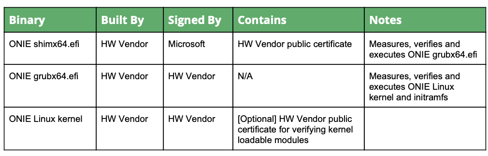
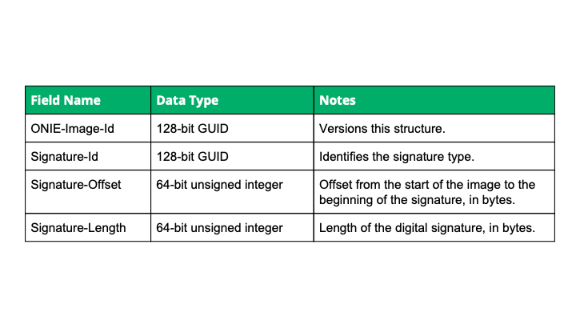

# Broadcom Secure Boot

## High Level Design Document
**Rev 1.0**

## Table of Contents

* [List of Tables](#list-of-tables)
* [Revision](#revision)
* [About This Manual](#about-this-manual)
* [Scope](#scope)
* [Definition/Abbreviation](#definitionabbreviation)
* [Feature Overview](#feature-overview)
  * [Functional Requirements](#functional-requirements)
* [Design](#design)
  * [Onie and Secure Boot](#onie-and-secure-boot)
  * [Signed ONIE Installable NOS Image Format](#signed-onie-installable-nos-image-format)
    * [Image Information Block](#image-information-block)
* [CLI](#cli)
  * [onie-nos-install](#onie-nos-install)
  * [sonic-installer](#sonic-installer)
* [Unit Test](#unit-test)
* [Internal Design Information](#internal-design)
  * [Signed Images](#signed-images)
  * [Tools and Scripts](#tools-and-scripts)


# Revision

Rev   |   Date   |    Author   | Change Description
:---: | :-----:  | :---------: | :---------
1.0   | 06/29/21 | Fuzail Khan | Initial version


# About this Manual

This document describes the Secure Boot feature enabled in Broadcom SONiC Network Operating System (NOS). It deals with process of extending the chain of trust to
the Broadcom SONiC NOS image and how different components are combined to fetch a full scale secure boot solution.

# Scope

Secure boot is enabled at the very basic level of BIOS/UEFI. This component serves as the root of trust (RoT). This trust is extended to various stages of booting i.e. from BIOS/UEFI to ONIE to NOS.
This document covers the process of extending the chain of trust to Broadcom SONiC installer image. Here HW supplier and ONIE software suppliers are assumed to be the same
and the platform comes with secure boot enabled ONIE already loaded on it.

# Definition/Abbreviation
There are a lot of security related terminologies and jargon. Below is a small list to help better understand the document.

### Table 1: Abbreviations

| **Term**     |  **Meaning**                                                    |
|:-------------|:----------------------------------------------------------------|
| NOS          | Network Operating System                                        |
| UEFI         | Unified Extensible Firmware Interface                           |
| BIOS         | Basic Input Output System                                       |
| ROT          | Root of trust                                                   |
| TPM          | Trusted Platform Module                                         |
| PCR          | Platform Configuration Register, within TPM                     |
| MOK          | Machine Owner Key                                               |
| DER          | DER is the binary format for data structures described by ASN.1 |
| GUID         | Globally Unique Identifier                                      |
| IIB          | Image Information Block, part of ONIE installation image format |
| PEM          | A base64 ASCII representation of DER                            |

# Feature Overview 

In ONIE enabled computing environment, end user put their trust in 
 - Various HW components such as FPGA, CLPDs, Boot firmware etc.
 - Software e.g. ONIE, NOS installers and NOS

Root of trust (RoT) generally is such a core component which can be trusted explicitly. Usually this RoT is UEFI or BIOS. Trust is then propagated throughout the components
of the boot process. Chain of trust is formed where one component of the boot process meausures, verfies and execute the next component. If verification fails at any one stage, the boot
process is aborted.
ONIE provides support for secure boot by including various applications, keys and certificates management. To apply the secure boot concept to SONiC installer image, we must
provide the NOS image in way suitable for secure boot applications. Components of the NOS image such as grub and linux kernel should be signed. These components should also support verification of the next component in the chain. Finally, the full NOS image should be signed and formatted in a way so that it supports verfication and execution from ONIE environment. Since the NOS image can be
loaded via sonic_installer command as well, an infra similar to ONIE nos intaller must be present to validate the new NOS image.

## Functional Requirements

Functional requirements includes

 - Only a trusted NOS image should be able to load on the machine from ONIE environment
 - Signing the Broadcom SONiC NOS executable image with a given key and create an image in 'Signed ONIE Installable Image Format'
 - Signing the Broadcom SONiC NOS grub and linux kernel with a given key so as to support secure boot
 - In case of failure in verification, image load/install process should be aborted and ONIE mode should be enabled
 - Only a trusted SONiC-NOS image should be loaded on the machine from SONiC environment
 - Secure boot support should be enabled/disabled via ONIE

# Design

## ONIE and Secure Boot

ONIE is linux based install environment which is widely used for installing other NOS, Diagnostic OS and firmware upgradation images. Opensource project 'shim' is commonly accepted method for booting linux in a UEFI secure boot environment. Same shim based model is also applied to ONIE. shim utilizes two EFI applications mentioned below,
 - shimx64.efi
 - MokManager.efi

UEFI maintains two databases 'db' (Valid keys and certificates) and 'dbx' (revoked keys and certificates). UEFI firmware loads the first stage loader (here, its shim) only iff,
 - db contains a matching cryptographic hash of the image, or a public certificate which can validate the signed image
 and
 - Hash or the certificate should not be part of the 'revoked key database' dbx

shim is a very light weight EFI application who's job is to measure, verify and then load the next bootloader component. It is signed by a private key who\'s public key is available in UEFI database db. It also contains public key certificate of key which is used to sign the next stage loader. If shim is unableto verify the next stage loader, grub, it defaults to launching the MokManager.efi allowing machine owner to enroll its public keys for verification.

Machine Owner Key (MoK) is the key from machine's owner and used to sign the EFI binaries, linux kernel and bootloaders. MokManager.efi is EFI application to manage the MoK in a secure manner. It is signed by the same key who's public certificate is embedded in shim. It maintains two databases 'mok' and 'mokx' for valid and revoked keys respectively. MokManager.efi provides an interface to add and delete a key into mok or mokx and reset the MOK databases. A typical boot sequence is mentioned in the diagram below,


As the HW vendor and ONIE provider are same, additional components would also be provided by the platform vendor. The table below explains it.


## Signed ONIE Installable NOS Image Format

It is desirable to use signed NOS installable image. Since the NOS image is intalled via ONIE, it needs to be in an specified format. The new format consist of 3 sections.
 - Executible Installer Data (EID)
 - Digital signature of EID
 - Image Information Block (IIB)

Executible Installer Data is the actual NOS executible image which ONIE discovery mechanism finds and executes. To understand better, this is the NOS binary image had the secure boot not been enabled. As secure boot is enabled now, we need a Digital Signature to cover this EID.

### Image Information Block

Image information block is a packed c-style structure consisting of


The ONIE image discovery mechanism would easily identify the 'signed ONIE installable image' by attempting to read the ONIE-image-id from the end of the image. The ONIE image id is fixed for this structure and it is defined as
```
ONIE-Image-Id := 216e9675-be17-46c7-aa71-e525eac83bd2
```

Signature Id too, is a fixed GUID. As currently supported signature type is PKCS#7, which is also identified as UEFI GUID EFI_CERT_TYPE_PKCS7_GUID, below is the signature id,
```
EFI_CERT_TYPE_PKCS7_GUID := 4aafd29d-68df-49ee-8aa9-347d375665a7
```

Signature offset and signature length are self explanatory. Here is a typical example of the IIB,
|  Field Name       |   Value
| :---------------: | :---------------
|  ONIE-Image-Id    | 216e9675-be17-46c7-aa71-e525eac83bd2
|  Signature-Id     | 4aafd29d-68df-49ee-8aa9-347d375665a7
|  Signature-Offset | 157286400
|  Signature-Length | 1675

Current ONIE opensource code does not have the support to read, verify and execute the signed NOS installer. It needs the script enhancements to verify the signed NOS installer and execute it. Since ONIE vendor and HW vendors are same, we would enhance the scripts for testing purpose only.

# CLI

This feature does not introduce any new CLIs. However, some of the existing CLIs behaviour would be changing.

## onie-nos-install

onie-nos-install is not exactly a SONiC CLI. Its ONIE script to download and install the NOS intaller. It can be run from ONIE-RESCUE mode. In ONIE-INSTALL mode, similar steps are run as that of onie-nos-install after the image search is complete. Here are the proposed changes to the behaviour,

```
ONIE:/ # onie-nos-install http://10.59.132.240:9009/projects/csg_sonic/sonic_bui
lds/daily/4.0.0/broadcom/sonic_4.0.0_daily_210726_0230_102/sonic-broadcom-enterp
rise-advanced.bin
discover: Rescue mode detected. No discover stopped.
Info: Fetching http://10.59.132.240:9009/projects/csg_sonic/sonic_builds/daily/4.0.0/broadcom/sonic_4.0.0_daily_210726_0230_102/sonic-broadcom-enterprise-advanced.bin ...
Connecting to 10.59.132.240:9009 (10.59.132.240:9009)
installer              3% |                               | 75630k  0:00:30 ETA
installer             53% |****************               |  1255M  0:00:10 ETA
installer            100% |*******************************|  2328M  0:00:00 ETA
ONIE: Executing installer: http://10.59.132.240:9009/projects/csg_sonic/sonic_builds/daily/4.0.0/broadcom/sonic_4.0.0_daily_210726_0230_102/sonic-broadcom-enterprise-advanced.bin
**Secure boot is enabled ...**
**Verifying the signature on the installer ... OK**
Verifying image checksum ...
```

```
ONIE: OS Install Mode ...
Platform  : x86_64-accton_as7816_64x-r0
Version   : 2018.05.00.08
Build Date: 2018-08-27T09:21+0800
Info: Mounting kernel filesystems... done.
Info: Mounting ONIE-BOOT on /mnt/onie-boot ...
Info: Mounting EFI System on /boot/efi ...
Info: BIOS mode: UEFI
Info: Making NOS install boot mode persistent.
Info: Using eth0 MAC address: b8:6a:97:fd:66:56
Info: Using eth1 MAC address: b8:6a:97:fd:66:57
Info: eth0:  Checking link... up.
Info: Trying DHCPv4 on interface: eth0
ONIE: Using DHCPv4 addr: eth0: 10.193.93.234 / 255.255.240.0
Info: eth1:  Checking link... down.
ONIE: eth1: link down.  Skipping configuration.
ONIE: Failed to configure eth1 interface
Starting: klogd... done.
Starting: dropbear ssh daemon... done.
Starting: telnetd... done.
discover: installer mode detected.  Running installer.
Starting: discover... done.

Please press Enter to activate this console. Info: eth0:  Checking link... up.
Info: Trying DHCPv4 on interface: eth0
ONIE: Using DHCPv4 addr: eth0: 10.193.93.234 / 255.255.240.0
Info: eth1:  Checking link... down.
ONIE: eth1: link down.  Skipping configuration.
ONIE: Failed to configure eth1 interface
ONIE: Starting ONIE Service Discovery
EXT4-fs (sda3): couldn't mount as ext3 due to feature incompatibilities
Info: Attempting file://dev/sda3/onie-installer-x86_64-accton_as7816_64x-r0 ...
Info: Attempting file://dev/sda3/onie-installer-x86_64-accton_as7816_64x-r0.bin ...
Info: Attempting file://dev/sda3/onie-installer-x86_64-accton_as7816_64x ...
Info: Attempting file://dev/sda3/onie-installer-x86_64-accton_as7816_64x.bin ...
Info: Attempting file://dev/sda3/onie-installer-accton_as7816_64x ...
Info: Attempting file://dev/sda3/onie-installer-accton_as7816_64x.bin ...
Info: Attempting file://dev/sda3/onie-installer-x86_64-bcm ...
Info: Attempting file://dev/sda3/onie-installer-x86_64-bcm.bin ...
Info: Attempting file://dev/sda3/onie-installer-x86_64 ...
EXT4-fs (sda3): couldn't mount as ext3 due to feature incompatibilities
ONIE: Executing installer: file://dev/sda3/onie-installer-x86_64
**Secure boot is enabled ...**
**Verifying the signature on the installer ... OK**
Verifying image checksum ... OK.
Preparing image archive ... OK.
Installing SONiC in ONIE
ONIE Installer: platform: x86_64-broadcom-r0
onie_platform: x86_64-accton_as7816_64x-r0
```

In case of failure, ONIE-RESCUE prompt is back.

```
ONIE:/ # onie-nos-install http://10.59.132.240:9009/projects/csg_sonic/sonic_bui
lds/daily/4.0.0/broadcom/sonic_4.0.0_daily_210726_0230_102/sonic-broadcom-enterp
rise-advanced.bin
discover: Rescue mode detected. No discover stopped.
Info: Fetching http://10.59.132.240:9009/projects/csg_sonic/sonic_builds/daily/4.0.0/broadcom/sonic_4.0.0_daily_210726_0230_102/sonic-broadcom-enterprise-advanced.bin ...
Connecting to 10.59.132.240:9009 (10.59.132.240:9009)
installer              3% |                               | 75630k  0:00:30 ETA
installer             53% |****************               |  1255M  0:00:10 ETA
installer            100% |*******************************|  2328M  0:00:00 ETA
ONIE: Executing installer: http://10.59.132.240:9009/projects/csg_sonic/sonic_builds/daily/4.0.0/broadcom/sonic_4.0.0_daily_210726_0230_102/sonic-broadcom-enterprise-advanced.bin
**Secure boot is enabled ...**
**Verifying the signature on the installer ... FAILED**
**Aborting ...**
ONIE:/ #
```

## sonic-installer

Sonic installer CLI downloads and installs the NOS image on another partition. Procedure is pretty much the same. In case of secure boot enabled systems, sonic-installer first validates the signature on the NOS installer image and loads it. In case of failure the process is aborted.
```
root@sonic:/home/admin# sonic-installer install http://10.59.132.240:9009/projects/csg_sonic/sonic_builds/daily/4.0.0/broadcom/sonic_4.0.0_daily_210726_0800_103/sonic-broadcom-enterprise-advanced.bin
New image will be installed, continue? [y/N]: y
Downloading image...
...14%, 341 MB, 26906 KB/s, 75 seconds left...
...99%, 2321 MB, 27322 KB/s, 0 seconds left...
Image Install initiation
Command: /tmp/sonic_image
**Secure boot is enabled ...**
**Verifying the signature on the installer ... OK**
Verifying image checksum ... OK.
Preparing image archive ... OK.
Installing SONiC in SONiC
ONIE Installer: platform: x86_64-broadcom-r0
```

In case of failure in the verification, the install process is aborted. The current image would still exist.

```
root@sonic:/home/admin# sonic-installer install http://10.59.132.240:9009/projects/csg_sonic/sonic_builds/daily/4.0.0/broadcom/sonic_4.0.0_daily_210726_0800_103/sonic-broadcom-enterprise-advanced.bin
New image will be installed, continue? [y/N]: y
Downloading image...
...14%, 341 MB, 26906 KB/s, 75 seconds left...
...99%, 2321 MB, 27322 KB/s, 0 seconds left...
Image Install initiation
Command: /tmp/sonic_image
**Secure boot is enabled ...**
**Verifying the signature on the installer ... FAILED**
Aborting ...
```

# Unit Test 

Following units tests should pass to mark secure boot success.
 - NOS installer loads successfully if the verification is successful
 - NOS installer load should fail if the verification fails
 - If the NOS grub is not signed or signed with wrong key, then bootup should fail
 - If the NOS kernel image is not signed or signed with wrong key, then bootup should fail
 - In case the bootup fails, the system should go back to ONIE rescue or ONIE install mode
 - System should boot up successfully in case the verification succeeds at every stage
 - In case an unsigned NOS installer is loaded when secure boot is enabled, the load should fail

# Internal Design Information:

## Signed Images

Secure boot process involve signed images and modules to verify the other signed images. First of all a secure boot enabled ONIE needs to be generated for the required platform. Steps are outlined [here](https://opencomputeproject.github.io/onie/design-spec/x86_uefi.html#uefi-x86-secure-boot).

Some of the important points which are useful for SONiC secure boot as well are listed here,
 - Trusted software supplier's public certificate db_cert.der/db_cert.pem (or Microsoft's CA ceritficate) is assumed to be embedded inside the BIOS/UEFI DB
 - ONIE software vendor's public key certificate (ONIE_VENDOR_CERT_DER/ONIE_VENDOR_CERT_PEM) is embedded inside the shim
 - Such shim is then signed with a trusted software supplier's **db** private key (or Microsoft key). Lets call it db.key
 - Grub and Linux kernel are signed with either ONIE_VENDOR_SECRET_KEY or db.key so that shim can verify them before executing
 - Standard linux signing tool e.g. 'sbsign' can be used to sign the images
 - NOS installer image should be signed with a nos.key and the public key certificarte of this nos.key should be present in ONIE for verification purpose
> NOTE: DER and PEM are X509 public key certificate format. DER is 'binary' where as PEM is 'ascii' format. The content of the certificate is the same in either case, just the data format differs.

In SONiC there is a need to minimize the build time changes for Secure Boot. Hence the plan is to use the ONIE config SECURE_BOOT_ENABLE in the SONiC. This flag is available in SONiC in ONIE config file.
```
SECURE_BOOT_ENABLE = yes
```
This flag would be used in SONiC to enable the support for verification modules and code.

## Tools and Scripts

Main purpose of tools and various scripts are,
 - Extract the Broadcom SONiC binary image
 - Sign the grub and linux kernel image using the given private key i.e. ONIE_VENDOR_SECRET_KEY or db.key
 - Combine the signed components to generate the full binary
 - Sign the full binary using nos.key and create a detached signature
 - Generate the Image Information Block mentioned in the section above
 - Format the executible binary, signature and IIB to form a ONIE readable image

These tools are separate and not included in the SONiC repo. Below is an example of the tool used to prepare the signed NOS installer

```
# prepare-signed-nos IMAGE=<unsigned-nos-installer-path> KEY=<db-key-path-to-sign-grub-and-Linux-kernel> <OPTIONS>
Extracting image ...
Signing the grub and linux kernel ...
Packaging the signed image ...
Completed !
#
```


## Supported Platforms

This feature is not platform specific. It needs to be enabled from ONIE and the customer needs to use the Broadcom provided tools to create a secureboot enabled image.


