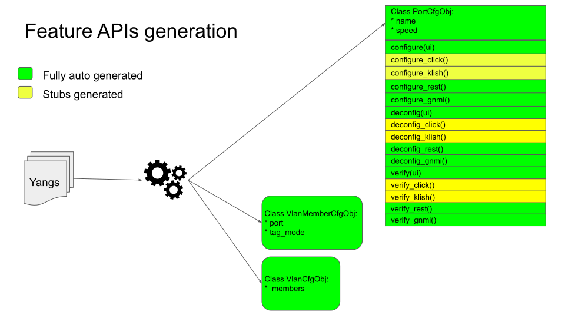
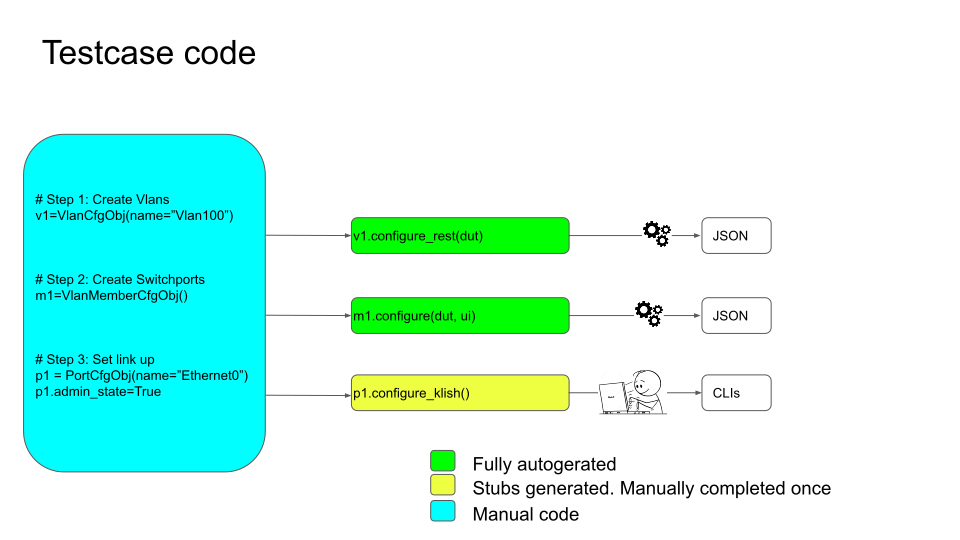
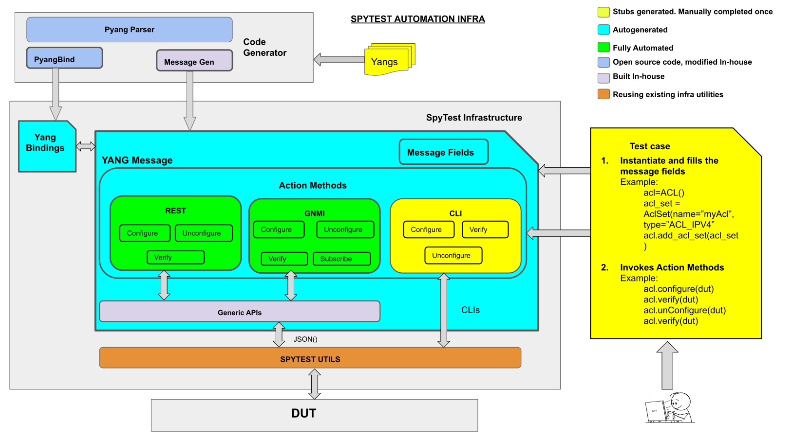

# Feature Name

SpytTest - Data driven test development

# High Level Design Document

#### Rev 0.2

# Table of Contents
  - [Revision](#revision)
  - [About This Manual](#about-this-manual)
  - [Scope](#scope)
  - [1 Feature Overview](#1-feature-overview)
  - [2 Requirements](#2-requirements)
  - [3 Design Overview](#3-design-overview)
    - [3.1 Design Components](#31-design-components)
     - [3.1.1 Code Generator](#311-code-generator)
     - [3.1.2 Message](#312-message)
     - [3.1.3 Generic APIs](#313-generic-apis)
      - [3.1.3.1 Configuration API](#3141-configuration-api)
      - [3.1.3.2 Verification API](#3142-verification-api)
      - [3.1.3.3 Subscription API](#3143-subscription-class)
      - [3.1.3.4 RPC API](#3143-rpc-api)
      - [3.1.3.5 GNOI API](#3143-gnoi-api)
     - [3.1.4 SpyTest Utils](#314-spytest-utils)
  - [4 Functionality](#4-functionality)
    - [4.1 Code Generation](#41-code-generation)
    - [4.2 Subscription Support](#42-subscription-support)
      - [4.2.1 Connection Management](#421-connection-management)
      - [4.2.2 Creating Subscription](#422-creating-subscription)
      - [4.2.3 Verifying Notifications](#423-verifying-notifications)
    - [4.3 GNOI Support](#43-gnoi-support)
    - [4.4 RPC Support](#43-rpc-support)
  - [5 Developer Steps](#5-developer-steps) 
    - [5.1 Message Generation](#51-message-generation) 
    - [5.2 Yang Binding Generation](#52-yang-binding-generation) 
    - [5.3 Testcase Sample For Configuration](#53-testcase-sample-for-configuration)
    - [5.4 Testcase Sample For Verification](#53-testcase-sample-for-verification)
    - [5.5 Testcase Sample For RPC](#53-testcase-sample-for-rpc)
    - [5.6 Testcase Sample For Subscription](#53-testcase-sample-for-subscription)
    - [5.7 Testcase Sample For GNOI](#53-testcase-sample-for-gnoi)
  
# Revision

| Rev |     Date    |       Author       | Change Description                |
|:---:|:-----------:|:------------------:|-----------------------------------|
| 0.1 | 09/29/2021  |   Mohammed Faraaz  | Initial version                   |
| 0.2 | 09/30/2021  | Sachin Holla       | Add subscription test details     |

# About this Manual

This document provides general information about the data driven testing mechanism using the generated message classes.

# Scope

This document only describes the high level design of data driven testing mechanism using the message classes.
Describing the Spytest and the topics related to the data driven testing in general are beyond the scope of this document.

# 1 Feature Overview

The data driven testing mechanism can be achieved in SpyTest using the message classes. The message classes are generated from the YANG models.
The message class can be imagined as a feature representation containing knobs(fields) and the APIs to configure, deconfigure and verify these knobs.

***Below diagram describes a message and its generation.***


***Below diagram describes the usage of the message in the testcase.***


# 2 Requirements

## 2.1 Functional Requirements

1. The Message class should be auto-generated.
2. The Message class should expose knobs and APIs for configuration, deconfiguration and verification.
3. The Message class should fully automate the testing of REST and GNMI Northbounds
4. The Message class should contain stubs for Klish.
5. The Message class should be customizable i.e. developers can add non yang fields(knobs) and custom APIs.
6. The Custom names for messages and knobs(attributes) should be allowed.

# 3 Design Overview



## 3.1 Design Components

## 3.1.1 Code Generator

- At the heart of automation is the code generator which generates the message class from the YANG model. The featue uses an open source YANG Parser called Pyang for parsing YANG model.
Once the YANG model are parsed, it uses a custom built pyang plugin to generate a message class.

- Along with Message classes. The YANG bindings are also generated from YANG using a pyangbind plugin.

## 3.1.2 Message

Messages are python classes containing attributes which are mapped to YANG Leaf/Leaf-list.
Along with attributes the messages also contain below Action methods
- Configure - This method will allow the configuration of a full message or a specific attribute in a message.
- UnConfigure - This method will allow the deconfiguration of a full message or a specific attribute in a message.
- Verify - This method will allow the verification of a full message or a specific attribute in a message.
- Helper methods - These methods will be used in the above action methods to generate payload, path etc.

## 3.1.3 Generic APIs

Generic APIs are not part of message class, they sit outside the message class. They are part of spytest infrastructure. 
The role of generic APIs is to service the request from Action methods. Below are the some of task Generic APIs perform
- Building a configuration, deconfiguration, subscription and a verification request specific to the UI type.
- Executing the request and validating the response.

Following are some of the Generic APIs

### 3.1.3.1 Configuration API

This is a generic method which will be invoked by the Action API inside the message class, this API is added to the spytest infrastructure, this method does the below things

- Generates payload for configuration request
- Builds URIs for configuration request
- Executes the request

For KLISH, it invokes the corresponding obj.configure_klish(...), which may have been implemented by the feature owner in the derived class of obj’s base class.

### 3.1.3.2 Verification API

Bala/Arun - Please fill

### 3.1.3.3 Subscription API

Subscription test APIs will use the existing gNMI request and verification APIs defined
in `apis/yang/utils/gnmi.py` module.

### 3.1.3.4 RPC API

Arun - Please fill

### 3.1.3.4 GNOI API

Arun - Please fill

## 3.1.4 SpyTest Utils

These are existing SpyTest utilties such rest_get, rest_put, compare_payloads, etc which Generic APIs will use to service the message.

# 4 Functionality

## 4.1 Code generation

The code generator generates the following types of classes for YANG data nodes.

Two sets of classes are generated for each data node
- Base class - These classes contain actual attributes, their setter and getter methods. These classes ***SHOULD NOT BE MODIFIED or INSTANTIATED inside a test case***. 
- Derived class - These classes contain stub methods for Klish, along with operational methods such as configure, unconfigure, and verify. Developers are required to fill the stub portion of this class such as *_klish. Also, Users can edit this class to add custom attributes and methods. Once the derived classes are generated, they will not be re-generated/over-written, so as to preserve the users’ edits. ***These are the classes users will be using in their test case for writing business logic.***

The default location to place the messages is shown below
```text
    apis/yang/autogen/messages
    |
    |_<module> Example:acl, contains all Derived classes
        |_Acl.py
        |_AclSet.py    
        |_Base (directory containing Base classes)
          |_Acl.py
```

### 4.1.1 Rules

### 4.1.1.1 Generic Rules

- Only YANG models which have data nodes will be considered for auto-generation. YANG with submodules are ignored as the nodes under them will be considered as part of the main module’s generation. This is in line with other YANG tools such as the OpenAPI spec generator.
- Subtree which has no lists in it will be converted into one class. The name of the class will be the container name. If the name is not unique it will be the parent container + container name. Example for acl/.../acl-sets/acl-set/.../acl-entries/acl-entry. AclEntry will be the first choice for the class name but if it is not unique its parent container i.e. acl-set can be used to generate the name as AclSetAclEntry.  The same logic will be used for naming leafs and leaf-lists.
- Leafs with python keywords as names will be converted to a special name. For example, if the leaf name is type then it can be converted to type_ in message classes.
- Class, modules, and attributes can have custom names. Codegen will provide a JSON file under apis/yang/codegen/config.json to accept such customization.

Lets see an example of the simplified version of ACL yang with subtrees

**Sample-1**
```diff
module: openconfig-acl
+ +--rw acl
     +--rw config
     |  +--rw oc-acl-ext:counter-capability?   identityref
     +--ro state
     |  +--ro counter-capability?   identityref
     +--rw acl-sets
+    |  +--rw acl-set* [name type]
     |     +--rw name           -> ../config/name
     |     +--rw type           -> ../config/type
     |     +-- <SNIP>
     |     +--rw acl-entries
+    |        +--rw acl-entry* [sequence-id]
     |           +--rw sequence-id    -> ../config/sequence-id
     |           +-- <SNIP>
     +--rw interfaces
+    |  +--rw interface* [id]
     |     +--rw id                  -> ../config/id
     |     +-- <SNIP>
     |     +--rw ingress-acl-sets
+    |     |  +--rw ingress-acl-set* [set-name type]
     |     |     +--rw set-name       -> ../config/set-name
     |     |     +--rw type           -> ../config/type
     |     |     +-- <SNIP>
     |     +--rw egress-acl-sets
+    |     |  +--rw egress-acl-set* [set-name type]
     |     |     +--rw set-name       -> ../config/set-name
     |     |     +--rw type           -> ../config/type
     |     |     +-- <SNIP>
```

**Sample-2**
```diff
module: ietf-ptp
  +--rw ptp
+    +--rw instance-list* [instance-number]
        +--rw instance-number       uint32
        +--rw default-ds
        |  +--rw two-step-flag?     boolean
        |  +--ro clock-identity?
```

**Note** Class will be generated for all elements highlighted in Green
  
### 4.1.1.2 Base class Rules

- For all leaf and leaf-list, a private class member will be generated and for all leaf and leaf-lists along with private members, a property class decorated with special methods will also be generated.
- The subtree which has a list in it will be converted to a dict with the same key as that of the yang. If yang has multiple keys then a tuple will be used as a key. Class will expose a message to add/delete a list instance to the parent message instance.
- Each class will have a generate_bind method to generate Pyang bind object. This method will be invoked by Action APIs (REST/GNMI’s configure(), etc).
- get_bind() will be generated, which will return the binding specifically to the class instance.
```python
  get_bind(target_attr=None,
    target_path=None,
   content=["config","nonconfig","all"]
)
```

**target_path** and **target_attr** are mutually exclusive
 
If target_attr and target_path are None(default) - Full binding obj for the class is returned. 
If target_attr is an attribute name, then the object-specific to that class will be returned. for the attributes mapped to leaf/leaf-list, their corresponding value will be returned.
If target_path contains the path to leaf, the value will be returned. If it contains the path to a container like 'config', the binding for config Is returned. The Path needs to be a relative path i.e. specific to the class instance.
 
**Example**
```text
 aclSet.get_bind() => Full binding for the class aclSet
 aclSet.get_bind(target_attr="configDescription") ==> return binding specific to the attribute configDescription (/acl/acl-sets/acl-set/config/description)
```

- get_path(ui=”rest”) will be generated, which will return a Paths in a specified UI format. 

The Path will only be returned if all parent hierarchies are established, otherwise, None will be returned. Using one of the following ways
 
**Using constructor**

```python
x = acl_entry(acl_set=acl_set(name="ONE"), seq_id=10)
x.unconfigure(targetAttr=x.name)
```

**Using add_* method**

```python
y = acl_set(name="ONE")
x = acl_entry(seq_id=10)
y.add(x)
x.unconfigure()
```

### 4.1.1.1.2.1 Sample Base Class

Below class is generated for XPATH ***/openconfig-acl:acl***

```python
##############################################################
##############################################################
##### THIS IS AN AUTO-GENERATED FILE PLEASE DO NOT EDIT ######
##############################################################
##############################################################

from apis.yang.codegen.base import Base
from collections import OrderedDict
from apis.yang.codegen.bindings import openconfig_acl

class AclBase(Base):
    """
    Top level enclosing container for ACL model config
and operational state data
    """
    def __init__(self,  ConfigCounterCapability, StateCounterCapability):
        super(AclBase, self).__init__()
        
        # Corresponding YANG Path
        self.__yang_path = "/openconfig-acl:acl"
        
        # Corresponding YANG Path in RESTCONF format
        self.__yang_path_rest = "/openconfig-acl:acl"
        self.__yang_path_rest_dict = OrderedDict()
        
        # Corresponding YANG Path in GNMI format
        self.__yang_path_gnmi = "/openconfig-acl:acl"
        self.__yang_path_gnmi_dict = OrderedDict()

        # Invokes setter for leafs/leaf-lists

        # ConfigCounterCapability
        self.ConfigCounterCapability = ConfigCounterCapability
        self.__yang_path = "/openconfig-acl:acl/config/openconfig-acl-ext:counter-capability"
        self.__yang_path_rest_dict["ConfigCounterCapability"] = "/openconfig-acl:acl/config/openconfig-acl-ext:counter-capability"
        self.__yang_path_gnmi_dict["ConfigCounterCapability"] = "/openconfig-acl:acl/config/openconfig-acl-ext:counter-capability"

        # StateCounterCapability
        self.StateCounterCapability = StateCounterCapability
        self.__yang_path = "/openconfig-acl:acl/state/counter-capability"
        self.__yang_path_rest_dict["StateCounterCapability"] = "/openconfig-acl:acl/state/counter-capability"
        self.__yang_path_gnmi_dict["StateCounterCapability"] = "/openconfig-acl:acl/state/counter-capability"

        # Dict for child lists
        self.AclSet_dict = OrderedDict()
        self.Interface_dict = OrderedDict()
        self.ObjectGroup_dict = OrderedDict()
        self.GlobalIngressAclSetsIngressAclSet_dict = OrderedDict()
        self.GlobalEgressAclSetsEgressAclSet_dict = OrderedDict()
        self.ControlPlaneIngressAclSetsIngressAclSet_dict = OrderedDict()


    # Getters/Setters for attributes

    # ConfigCounterCapability
    @property
    def ConfigCounterCapability(self):
        """ /openconfig-acl:acl/config/openconfig-acl-ext:counter-capability
        System reported indication of how ACL counters are reported by the target
        """
        return self.__ConfigCounterCapability
    
    @ConfigCounterCapability.setter
    def ConfigCounterCapability(self, ConfigCounterCapability=None):
        """ /openconfig-acl:acl/config/openconfig-acl-ext:counter-capability
        System reported indication of how ACL counters are reported by the target
        """        
        self.__ConfigCounterCapability = ConfigCounterCapability        

    # StateCounterCapability
    @property
    def StateCounterCapability(self):
        """ /openconfig-acl:acl/state/counter-capability
        System reported indication of how ACL counters are reported
by the target
        """
        return self.__StateCounterCapability
    
    @StateCounterCapability.setter
    def StateCounterCapability(self, StateCounterCapability=None):
        """ /openconfig-acl:acl/state/counter-capability
        System reported indication of how ACL counters are reported
by the target
        """        
        self.__StateCounterCapability = StateCounterCapability        


    def add_AclSet(self, AclSet):
        """ Adds AclSet(/openconfig-acl:acl/acl-sets/acl-set) instance inside AclBase (/openconfig-acl:acl)"""
        self.AclSet_dict[(AclSet.AclSetName, AclSet.AclSetType)] = AclSet
        AclSet.Acl = self
    
    def del_AclSet(self, AclSet):
        """ Deletes AclSet(/openconfig-acl:acl/acl-sets/acl-set) instance from AclBase (/openconfig-acl:acl)"""
        del(self.AclSet_dict[(AclSet.AclSetName, AclSet.AclSetType)])
        AclSet.Acl = None

    def add_Interface(self, Interface):
        """ Adds Interface(/openconfig-acl:acl/interfaces/interface) instance inside AclBase (/openconfig-acl:acl)"""
        self.Interface_dict[(Interface.InterfaceId)] = Interface
        Interface.Acl = self
    
    def del_Interface(self, Interface):
        """ Deletes Interface(/openconfig-acl:acl/interfaces/interface) instance from AclBase (/openconfig-acl:acl)"""
        del(self.Interface_dict[(Interface.InterfaceId)])
        Interface.Acl = None

    def add_ObjectGroup(self, ObjectGroup):
        """ Adds ObjectGroup(/openconfig-acl:acl/openconfig-acl-ext:object-groups/object-group) instance inside AclBase (/openconfig-acl:acl)"""
        self.ObjectGroup_dict[(ObjectGroup.ObjectGroupName)] = ObjectGroup
        ObjectGroup.Acl = self
    
    def del_ObjectGroup(self, ObjectGroup):
        """ Deletes ObjectGroup(/openconfig-acl:acl/openconfig-acl-ext:object-groups/object-group) instance from AclBase (/openconfig-acl:acl)"""
        del(self.ObjectGroup_dict[(ObjectGroup.ObjectGroupName)])
        ObjectGroup.Acl = None

    def add_GlobalIngressAclSetsIngressAclSet(self, GlobalIngressAclSetsIngressAclSet):
        """ Adds GlobalIngressAclSetsIngressAclSet(/openconfig-acl:acl/openconfig-acl-ext:global/ingress-acl-sets/ingress-acl-set) instance inside AclBase (/openconfig-acl:acl)"""
        self.GlobalIngressAclSetsIngressAclSet_dict[(GlobalIngressAclSetsIngressAclSet.IngressAclSetSetName, GlobalIngressAclSetsIngressAclSet.IngressAclSetType)] = GlobalIngressAclSetsIngressAclSet
        GlobalIngressAclSetsIngressAclSet.Acl = self
    
    def del_GlobalIngressAclSetsIngressAclSet(self, GlobalIngressAclSetsIngressAclSet):
        """ Deletes GlobalIngressAclSetsIngressAclSet(/openconfig-acl:acl/openconfig-acl-ext:global/ingress-acl-sets/ingress-acl-set) instance from AclBase (/openconfig-acl:acl)"""
        del(self.GlobalIngressAclSetsIngressAclSet_dict[(GlobalIngressAclSetsIngressAclSet.IngressAclSetSetName, GlobalIngressAclSetsIngressAclSet.IngressAclSetType)])
        GlobalIngressAclSetsIngressAclSet.Acl = None

    def add_GlobalEgressAclSetsEgressAclSet(self, GlobalEgressAclSetsEgressAclSet):
        """ Adds GlobalEgressAclSetsEgressAclSet(/openconfig-acl:acl/openconfig-acl-ext:global/egress-acl-sets/egress-acl-set) instance inside AclBase (/openconfig-acl:acl)"""
        self.GlobalEgressAclSetsEgressAclSet_dict[(GlobalEgressAclSetsEgressAclSet.EgressAclSetSetName, GlobalEgressAclSetsEgressAclSet.EgressAclSetType)] = GlobalEgressAclSetsEgressAclSet
        GlobalEgressAclSetsEgressAclSet.Acl = self
    
    def del_GlobalEgressAclSetsEgressAclSet(self, GlobalEgressAclSetsEgressAclSet):
        """ Deletes GlobalEgressAclSetsEgressAclSet(/openconfig-acl:acl/openconfig-acl-ext:global/egress-acl-sets/egress-acl-set) instance from AclBase (/openconfig-acl:acl)"""
        del(self.GlobalEgressAclSetsEgressAclSet_dict[(GlobalEgressAclSetsEgressAclSet.EgressAclSetSetName, GlobalEgressAclSetsEgressAclSet.EgressAclSetType)])
        GlobalEgressAclSetsEgressAclSet.Acl = None

    def add_ControlPlaneIngressAclSetsIngressAclSet(self, ControlPlaneIngressAclSetsIngressAclSet):
        """ Adds ControlPlaneIngressAclSetsIngressAclSet(/openconfig-acl:acl/openconfig-acl-ext:control-plane/ingress-acl-sets/ingress-acl-set) instance inside AclBase (/openconfig-acl:acl)"""
        self.ControlPlaneIngressAclSetsIngressAclSet_dict[(ControlPlaneIngressAclSetsIngressAclSet.IngressAclSetSetName, ControlPlaneIngressAclSetsIngressAclSet.IngressAclSetType)] = ControlPlaneIngressAclSetsIngressAclSet
        ControlPlaneIngressAclSetsIngressAclSet.Acl = self
    
    def del_ControlPlaneIngressAclSetsIngressAclSet(self, ControlPlaneIngressAclSetsIngressAclSet):
        """ Deletes ControlPlaneIngressAclSetsIngressAclSet(/openconfig-acl:acl/openconfig-acl-ext:control-plane/ingress-acl-sets/ingress-acl-set) instance from AclBase (/openconfig-acl:acl)"""
        del(self.ControlPlaneIngressAclSetsIngressAclSet_dict[(ControlPlaneIngressAclSetsIngressAclSet.IngressAclSetSetName, ControlPlaneIngressAclSetsIngressAclSet.IngressAclSetType)])
        ControlPlaneIngressAclSetsIngressAclSet.Acl = None

    def _generate_bind(self, content="all", target_attr=None, parent=None):
        """
        Generate pyangbindings for the spytest message
        """
        if content not in ["all", "config", "state"]:
            raise ValueError("Invalid content type - {}".format(content))
        acl = openconfig_acl().acl
        
        # ConfigCounterCapability
        if self.ConfigCounterCapability is not None:
            if content == "config" or content == "all":
                acl.config.counter_capability = self.ConfigCounterCapability
        if target_attr == "ConfigCounterCapability":
            return acl.config.counter_capability
        # StateCounterCapability
        if self.StateCounterCapability is not None:
            if content == "state" or content == "all":
                acl.state._set_counter_capability(self.StateCounterCapability)
        if target_attr == "StateCounterCapability":
            return acl.state.counter_capability

        if content == "all" or content == "config":
            for key in self.AclSet_dict:
                self.AclSet_dict[key]._generate_bind(content=content, parent=acl)
        if content == "all" or content == "config":
            for key in self.Interface_dict:
                self.Interface_dict[key]._generate_bind(content=content, parent=acl)
        if content == "all" or content == "state":
            for key in self.ObjectGroup_dict:
                self.ObjectGroup_dict[key]._generate_bind(content=content, parent=acl)
        if content == "all" or content == "config":
            for key in self.GlobalIngressAclSetsIngressAclSet_dict:
                self.GlobalIngressAclSetsIngressAclSet_dict[key]._generate_bind(content=content, parent=acl)
        if content == "all" or content == "config":
            for key in self.GlobalEgressAclSetsEgressAclSet_dict:
                self.GlobalEgressAclSetsEgressAclSet_dict[key]._generate_bind(content=content, parent=acl)
        if content == "all" or content == "config":
            for key in self.ControlPlaneIngressAclSetsIngressAclSet_dict:
                self.ControlPlaneIngressAclSetsIngressAclSet_dict[key]._generate_bind(content=content, parent=acl)
        
        if target_attr is not None:
            return None
        return acl
    

    def get_path(self, target_attr=None, ui="rest"):
        if target_attr is None:
            rest_template = self.__yang_path_rest
            gnmi_template = self.__yang_path_gnmi
        else:
            rest_template = self.__yang_path_rest_dict[target_attr]
            gnmi_template = self.__yang_path_gnmi_dict[target_attr]

        if ui == "rest":
            return rest_template
        else:
            return gnmi_template
```

### 4.1.1.1.2.2 Sample Base Class

Below class is generated for XPATH ***/openconfig-acl:acl/acl-sets/acl-set***

```python
##############################################################
##############################################################
##### THIS IS AN AUTO-GENERATED FILE PLEASE DO NOT EDIT ######
##############################################################
##############################################################

from apis.yang.codegen.base import Base
from collections import OrderedDict
from apis.yang.codegen.bindings.acl.acl_sets import acl_sets

class AclSetBase(Base):
    """
    List of ACL sets, each comprising of a list of ACL
entries
    """
    def __init__(self,  AclSetName, AclSetType, ConfigName, ConfigType, ConfigDescription, StateName, StateType, StateDescription, Source, Acl):
        super(AclSetBase, self).__init__()
        
        # Corresponding YANG Path
        self.__yang_path = "/openconfig-acl:acl/acl-sets/acl-set"
        
        # Corresponding YANG Path in RESTCONF format
        self.__yang_path_rest = "/openconfig-acl:acl/acl-sets/acl-set={},{}"
        self.__yang_path_rest_dict = OrderedDict()
        
        # Corresponding YANG Path in GNMI format
        self.__yang_path_gnmi = "/openconfig-acl:acl/acl-sets/acl-set[name={}][type={}]"
        self.__yang_path_gnmi_dict = OrderedDict()

        # Invokes setter for leafs/leaf-lists

        # AclSetName
        self.AclSetName = AclSetName
        self.__yang_path = "/openconfig-acl:acl/acl-sets/acl-set/name"
        self.__yang_path_rest_dict["AclSetName"] = "/openconfig-acl:acl/acl-sets/acl-set={},{}/name"
        self.__yang_path_gnmi_dict["AclSetName"] = "/openconfig-acl:acl/acl-sets/acl-set[name={}][type={}]/name"

        # AclSetType
        self.AclSetType = AclSetType
        self.__yang_path = "/openconfig-acl:acl/acl-sets/acl-set/type"
        self.__yang_path_rest_dict["AclSetType"] = "/openconfig-acl:acl/acl-sets/acl-set={},{}/type"
        self.__yang_path_gnmi_dict["AclSetType"] = "/openconfig-acl:acl/acl-sets/acl-set[name={}][type={}]/type"

        # ConfigName
        self.ConfigName = ConfigName
        self.__yang_path = "/openconfig-acl:acl/acl-sets/acl-set/config/name"
        self.__yang_path_rest_dict["ConfigName"] = "/openconfig-acl:acl/acl-sets/acl-set={},{}/config/name"
        self.__yang_path_gnmi_dict["ConfigName"] = "/openconfig-acl:acl/acl-sets/acl-set[name={}][type={}]/config/name"

        # ConfigType
        self.ConfigType = ConfigType
        self.__yang_path = "/openconfig-acl:acl/acl-sets/acl-set/config/type"
        self.__yang_path_rest_dict["ConfigType"] = "/openconfig-acl:acl/acl-sets/acl-set={},{}/config/type"
        self.__yang_path_gnmi_dict["ConfigType"] = "/openconfig-acl:acl/acl-sets/acl-set[name={}][type={}]/config/type"

        # ConfigDescription
        self.ConfigDescription = ConfigDescription
        self.__yang_path = "/openconfig-acl:acl/acl-sets/acl-set/config/description"
        self.__yang_path_rest_dict["ConfigDescription"] = "/openconfig-acl:acl/acl-sets/acl-set={},{}/config/description"
        self.__yang_path_gnmi_dict["ConfigDescription"] = "/openconfig-acl:acl/acl-sets/acl-set[name={}][type={}]/config/description"

        # StateName
        self.StateName = StateName
        self.__yang_path = "/openconfig-acl:acl/acl-sets/acl-set/state/name"
        self.__yang_path_rest_dict["StateName"] = "/openconfig-acl:acl/acl-sets/acl-set={},{}/state/name"
        self.__yang_path_gnmi_dict["StateName"] = "/openconfig-acl:acl/acl-sets/acl-set[name={}][type={}]/state/name"

        # StateType
        self.StateType = StateType
        self.__yang_path = "/openconfig-acl:acl/acl-sets/acl-set/state/type"
        self.__yang_path_rest_dict["StateType"] = "/openconfig-acl:acl/acl-sets/acl-set={},{}/state/type"
        self.__yang_path_gnmi_dict["StateType"] = "/openconfig-acl:acl/acl-sets/acl-set[name={}][type={}]/state/type"

        # StateDescription
        self.StateDescription = StateDescription
        self.__yang_path = "/openconfig-acl:acl/acl-sets/acl-set/state/description"
        self.__yang_path_rest_dict["StateDescription"] = "/openconfig-acl:acl/acl-sets/acl-set={},{}/state/description"
        self.__yang_path_gnmi_dict["StateDescription"] = "/openconfig-acl:acl/acl-sets/acl-set[name={}][type={}]/state/description"

        # Source
        self.Source = Source
        self.__yang_path = "/openconfig-acl:acl/acl-sets/acl-set/state/openconfig-acl-ext:source"
        self.__yang_path_rest_dict["Source"] = "/openconfig-acl:acl/acl-sets/acl-set={},{}/state/openconfig-acl-ext:source"
        self.__yang_path_gnmi_dict["Source"] = "/openconfig-acl:acl/acl-sets/acl-set[name={}][type={}]/state/openconfig-acl-ext:source"

        # Dict for child lists
        self.AclSetAclEntriesAclEntry_dict = OrderedDict()

        # Parent's ref
        self.Acl = Acl

    def __hash__(self):
        return hash((self.AclSetName, self.AclSetType))

    # Getters/Setters for attributes

    # AclSetName
    @property
    def AclSetName(self):
        """ /openconfig-acl:acl/acl-sets/acl-set/name
        Reference to the name list key
        """
        return self.__AclSetName
    
    @AclSetName.setter
    def AclSetName(self, AclSetName=None):
        """ /openconfig-acl:acl/acl-sets/acl-set/name
        Reference to the name list key
        """        
        self.__AclSetName = AclSetName        

    # AclSetType
    @property
    def AclSetType(self):
        """ /openconfig-acl:acl/acl-sets/acl-set/type
        Reference to the type list key
        """
        return self.__AclSetType
    
    @AclSetType.setter
    def AclSetType(self, AclSetType=None):
        """ /openconfig-acl:acl/acl-sets/acl-set/type
        Reference to the type list key
        """        
        self.__AclSetType = AclSetType        

    # ConfigName
    @property
    def ConfigName(self):
        """ /openconfig-acl:acl/acl-sets/acl-set/config/name
        The name of the access-list set
        """
        return self.__ConfigName
    
    @ConfigName.setter
    def ConfigName(self, ConfigName=None):
        """ /openconfig-acl:acl/acl-sets/acl-set/config/name
        The name of the access-list set
        """        
        self.__ConfigName = ConfigName        

    # ConfigType
    @property
    def ConfigType(self):
        """ /openconfig-acl:acl/acl-sets/acl-set/config/type
        The type determines the fields allowed in the ACL entries
belonging to the ACL set (e.g., IPv4, IPv6, etc.)
        """
        return self.__ConfigType
    
    @ConfigType.setter
    def ConfigType(self, ConfigType=None):
        """ /openconfig-acl:acl/acl-sets/acl-set/config/type
        The type determines the fields allowed in the ACL entries
belonging to the ACL set (e.g., IPv4, IPv6, etc.)
        """        
        self.__ConfigType = ConfigType        

    # ConfigDescription
    @property
    def ConfigDescription(self):
        """ /openconfig-acl:acl/acl-sets/acl-set/config/description
        Description, or comment, for the ACL set
        """
        return self.__ConfigDescription
    
    @ConfigDescription.setter
    def ConfigDescription(self, ConfigDescription=None):
        """ /openconfig-acl:acl/acl-sets/acl-set/config/description
        Description, or comment, for the ACL set
        """        
        self.__ConfigDescription = ConfigDescription        

    # StateName
    @property
    def StateName(self):
        """ /openconfig-acl:acl/acl-sets/acl-set/state/name
        The name of the access-list set
        """
        return self.__StateName
    
    @StateName.setter
    def StateName(self, StateName=None):
        """ /openconfig-acl:acl/acl-sets/acl-set/state/name
        The name of the access-list set
        """        
        self.__StateName = StateName        

    # StateType
    @property
    def StateType(self):
        """ /openconfig-acl:acl/acl-sets/acl-set/state/type
        The type determines the fields allowed in the ACL entries
belonging to the ACL set (e.g., IPv4, IPv6, etc.)
        """
        return self.__StateType
    
    @StateType.setter
    def StateType(self, StateType=None):
        """ /openconfig-acl:acl/acl-sets/acl-set/state/type
        The type determines the fields allowed in the ACL entries
belonging to the ACL set (e.g., IPv4, IPv6, etc.)
        """        
        self.__StateType = StateType        

    # StateDescription
    @property
    def StateDescription(self):
        """ /openconfig-acl:acl/acl-sets/acl-set/state/description
        Description, or comment, for the ACL set
        """
        return self.__StateDescription
    
    @StateDescription.setter
    def StateDescription(self, StateDescription=None):
        """ /openconfig-acl:acl/acl-sets/acl-set/state/description
        Description, or comment, for the ACL set
        """        
        self.__StateDescription = StateDescription        

    # Source
    @property
    def Source(self):
        """ /openconfig-acl:acl/acl-sets/acl-set/state/openconfig-acl-ext:source
        Source of the ACL mentions whether it is created by user
or port-authentication control(PAC).
        """
        return self.__Source
    
    @Source.setter
    def Source(self, Source=None):
        """ /openconfig-acl:acl/acl-sets/acl-set/state/openconfig-acl-ext:source
        Source of the ACL mentions whether it is created by user
or port-authentication control(PAC).
        """        
        self.__Source = Source        


    def add_AclSetAclEntriesAclEntry(self, AclSetAclEntriesAclEntry):
        """ Adds AclSetAclEntriesAclEntry(/openconfig-acl:acl/acl-sets/acl-set/acl-entries/acl-entry) instance inside AclSetBase (/openconfig-acl:acl/acl-sets/acl-set)"""
        self.AclSetAclEntriesAclEntry_dict[(AclSetAclEntriesAclEntry.AclEntrySequenceId)] = AclSetAclEntriesAclEntry
        AclSetAclEntriesAclEntry.AclSet = self
    
    def del_AclSetAclEntriesAclEntry(self, AclSetAclEntriesAclEntry):
        """ Deletes AclSetAclEntriesAclEntry(/openconfig-acl:acl/acl-sets/acl-set/acl-entries/acl-entry) instance from AclSetBase (/openconfig-acl:acl/acl-sets/acl-set)"""
        del(self.AclSetAclEntriesAclEntry_dict[(AclSetAclEntriesAclEntry.AclEntrySequenceId)])
        AclSetAclEntriesAclEntry.AclSet = None

    def _generate_bind(self, content="all", target_attr=None, parent=None):
        """
        Generate pyangbindings for the spytest message
        """
        if content not in ["all", "config", "state"]:
            raise ValueError("Invalid content type - {}".format(content))
        if parent is None:
            acl_set = acl_sets().acl_set.add("{} {}".format(self.AclSetName, self.AclSetType))
        else:
            acl_set = parent.acl_sets.acl_set.add("{} {}".format(self.AclSetName, self.AclSetType))
        
        # ConfigName
        if self.ConfigName is not None:
            if content == "config" or content == "all":
                acl_set.config.name = self.ConfigName
        if target_attr == "ConfigName":
            return acl_set.config.name
        # ConfigType
        if self.ConfigType is not None:
            if content == "config" or content == "all":
                acl_set.config.type = self.ConfigType
        if target_attr == "ConfigType":
            return acl_set.config.type
        # ConfigDescription
        if self.ConfigDescription is not None:
            if content == "config" or content == "all":
                acl_set.config.description = self.ConfigDescription
        if target_attr == "ConfigDescription":
            return acl_set.config.description
        # StateName
        if self.StateName is not None:
            if content == "state" or content == "all":
                acl_set.state._set_name(self.StateName)
        if target_attr == "StateName":
            return acl_set.state.name
        # StateType
        if self.StateType is not None:
            if content == "state" or content == "all":
                acl_set.state._set_type(self.StateType)
        if target_attr == "StateType":
            return acl_set.state.type
        # StateDescription
        if self.StateDescription is not None:
            if content == "state" or content == "all":
                acl_set.state._set_description(self.StateDescription)
        if target_attr == "StateDescription":
            return acl_set.state.description
        # Source
        if self.Source is not None:
            if content == "state" or content == "all":
                acl_set.state._set_source(self.Source)
        if target_attr == "Source":
            return acl_set.state.source

        if content == "all" or content == "config":
            for key in self.AclSetAclEntriesAclEntry_dict:
                self.AclSetAclEntriesAclEntry_dict[key]._generate_bind(content=content, parent=acl_set)
        
        if target_attr is not None:
            return None
        return acl_set
    
    def get_keys(self):
        return (str(self.AclSetName), str(self.AclSetType))

    def get_path(self, target_attr=None, ui="rest"):
        if target_attr is None:
            rest_template = self.__yang_path_rest
            gnmi_template = self.__yang_path_gnmi
        else:
            rest_template = self.__yang_path_rest_dict[target_attr]
            gnmi_template = self.__yang_path_gnmi_dict[target_attr]

        if ui == "rest":
            return rest_template.format(*self.get_keys())
        else:
            return gnmi_template.format(*self.get_keys())
```

### 4.1.1.2 Derived class Rules
- Derived classes will be generated for all base classes. The derived class is an editable class, this is the class the test case needs to be imported and used. 
- Constructor will be generated with all leafs initialized to None (only for non-key leafs). This will invoke base class constructor.

### 4.1.1.2.1 Sample Derived Class

Below class is generated for XPATH ***/openconfig-acl:acl***

```python
from apis.yang.codegen.messages.acl.Base.Acl import AclBase

class Acl(AclBase):
    def __init__(self,  ConfigCounterCapability=None, StateCounterCapability=None):
        super(Acl, self).__init__( ConfigCounterCapability, StateCounterCapability)

    def configure_klish(self, dut, target_attr=None, operation="update", success=True, ignore_error=False, **kwargs):
        ''' Developers will implement this '''
        print("I am Klish Configure")
        status = True
        return status

    def unConfigure_klish(self, dut, target=None, success=True, ignore_error=False, **kwargs):
        ''' Developers will implement this '''
        print("I am Klish unConfigure")
        status = True
        return status

    def verify_klish(self, dut, target=None, success=True, ignore_error=False, **kwargs):
        ''' Users required to write code for klish '''
        status = True
        return status
```

## 4.2 Subscription Support

Message classes will support gNMI subscription test cases similar to the existing APIs provided by
the `apis/yang/utils/gnmi` module.
Existing APIs operate on path and JSON payload.
Message classes will provide a thin wrapper around them so that developer can use only the
message classes in his test code.
This should cover simple one-path subscription cases.
Developer should directly use APIs from `apis/yang/utils/gnmi.py` for multi-path subscriptions
and other advanced test cases.

Note that all the APIs discussed in this section automatically use "gnmi" UI.

### 4.2.1 Connection Management

Will be same as gNMI get/set operations.
**TODO: revisit**

### 4.2.2 Creating Subscription

Every message base class will have a `subscribe()` method which can be used to create a subscription.
This method will accept the subscription mode, optional property name and other optional subscription
parameters as shown below.

```python
def subscribe(self, dut, mode, target_attr=None, timeout=None, target=None, origin=None,
              updates_only=False, suppress_redundant=False, sample_interaval=None):
    """Creates gNMI subscription for path self.get_path(ui="gnmi", target_attr=target_attr).
    Returns a RpcContext object which can be used for validating the notification messages.

    Parameters:
    dut             DUT name
    mode            Subscription mode -- should be one of "on_change", "sample", "target_defined",
                    "poll" or "once". Values are case insensitive.
    target_attr     An optional property name of this message class. Used to derive the subpath.
    timeout         Hard timeout for test case; in seconds. Used to break verification loop when
                    expected notifications are not received. It is recommended that developers pass
                    an appropriate timeout value based on the verification steps in the test case.
    target          A string value to be used as 'target' property of request path prefix.
    origin          A string value to be used as 'origin' property of request path prefix.
    updates_only    Boolean value for the 'updates_only' property in the request.
    suppress_redundant
                    Boolean value for the 'suppress_redundant' property in the request. Used only
                    when mode is 'sample' or 'target_defined'.
    sample_interval Number of seconds for the 'sample_interval' property in the request. Used only
                    when mode is 'sample' or 'target_defined'.
    """
```

### 4.2.3 Verifying Notifications

The RpcContext class will provide `verify_notifications` method to verify whether the notification
messages contained expected values or not.
They are wrappers for the existing `verify_notifications` function in `apis/yang/utils/gnmi` module.
Refer to the `verify_notifications` documentation for more details on the verification logic.

```python
class Notification(ABC):
    """Abstract base class to express expected notification data"""

class UpdateNotification(Notification):
    def __init__(self, data, prefix=None, target_path=None, iterations=1, interval=20):
        """Expected update notification data.
        Parameters:
        data        A message class containing the expected notification data.
                    if this message class a parent message in the class hierarchy, the parent
                    context should be filled either in this message instance itself; or
                    can be separately passed as the prefix.
        prefix      Optional message class that defines the parent context for data.
        target_path Property name indicating the subpath inside the data class.
        iterations  Expected number of notification messages containing the values in data class. 
        interval    Number of seconds between notifications when iterations > 1.
        """

class DeleteNotification(Notification):
    def __init__(self, data, target_path=None):
        """Expecteds delete notification path.
        Parameters:
        data        A message class or string path indicating the expected delete path.
        target_path Property name indicating the subpath inside the data class.
        """

def RpcContext:
    def verify_notifications(data, sync=False):
        """Verify expected notification values are received. Blocks till expected values
        are received or the timeout (specified in the subscribe API) and returns True.
        Returns False as soon as it encounters an unexpected notification data.

        Parameters:
        data        A Notification object or a list of Notification objects indicating the
                    expected notification data.
        sync        Indicates whether a sync message is expected. When True, this function
                    waits for a sync message after expected notification data is received.
                    It is an error if sync message is received when it is not expected or
                    all expected notification data are not received yet.
        """
```

## 4.3 GNOI Support

Arun- Please fill

## 4.4 RPC Support

Bala - Please fill

# 5 Developer Steps

Yang models will be placed under ***brcm-spytest/apis/yang/models***
When developer modifies the YANG contents or rebases with newer versions, they are required to regenerate Messages and Bindings using below steps. Once the Messages and Bindings are regenerated, they need to be committed along with the YANG changes.

## 5.1 Message Generation

- Use **brcm-spytest/apis/yang/codegen/tools/generate_msg_class.sh** script to generate the message class

**Usage**

```text
generate_msg_class.sh [--over-write-derived-class] <YANG-1> ... <YANG-N>               
```

**Example**

```text
brcm-spytest/apis/yang/codegen/tools/generate_msg_class.sh openconfig-acl.yang extensions/openconfig-acl-ext.yang
```

***NOTE:*** Messages will be generated under brcm-spytest/apis/yang/codegen/messages

## 5.2 Yang Binding Generation

Script **brcm-spytest/apis/yang/codegen/tools/generate_bindings.sh** will generate the pyangbind
bindings for the required YANG files.
It will be automatically triggered by the *generate_msg_class.sh* script.
Runs the pyangbind generator in "split-class-dir" mode, which generates a separate python module
directory for every container and list nodes.
All binding artifacts will be generated under **brcm-spytest/apis/yang/codegen/bindings** directory.
Developer must commit these generated files to the spytest repo as-is.

Usage:

```text
generate_bindings.sh <YANG-1> ... <YANG-N>
```

## 5.3 Testcase Sample For Configuration

Sample test logic which Adds ACL and Rule

```python

from apis.yang.codegen.messages.acl.Acl import Acl
from apis.yang.codegen.messages.acl.AclSet import AclSet
from apis.yang.codegen.messages.acl.AclSetAclEntriesAclEntry import AclSetAclEntriesAclEntry

dut = None
acl=Acl(ConfigCounterCapability="INTERFACE_ONLY", StateCounterCapability="INTERFACE_ONLY")
aclSet1 = AclSet(AclSetName="MYACL1", AclSetType="ACL_IPV4")

aclSet1.configDescription = "sample"
aclSet2 = AclSet(AclSetName="MYACL2", AclSetType="ACL_IPV4", ConfigDescription="faraaz2")
acl_entry = AclSetAclEntriesAclEntry(AclEntrySequenceId=1, ConfigDescription="cool")
aclSet1.add_AclSetAclEntriesAclEntry(acl_entry)
acl.add_AclSet(aclSet1)
acl.add_AclSet(aclSet2)

acl.configure(dut, ui="rest", target_path="/acl-sets/acl-set")
acl.configure_rest(dut, target_path="/acl-sets/acl-set")
acl_entry.unconfigure()
acl.unconfigure(dut, ui="gnmi")

```

## 5.4 Testcase Sample For Verification

Bala - Please fill

## 5.5 Testcase Sample For RPC

Arun- Please fill

## 5.6 Testcase Sample For Subscription

```python
def test_onchange_acl_description():
    # Subscribe ON_CHANGE of ACL description
    aclPattern = AclSet(Name="*", Type="*")
    rpc = aclPattern.subscribe(dut, mode="on_change", timeout=10)
    # There should not be any sync updates -- description is not configured yet
    if not rpc.verify_notifications(None, sync=True):
         st.report_fail("msg", "Not expecting any sync update")
    # Create an ACL
    acl1 = AclSet(Name="ONE", Type="ACL_IPV4", Description="Hello, world!")
    acl1.configure(dut)
    # Look for the update notification...
    if not rpc.verify_notifications(UpdateNotification(acl1)):
        st.report_fail("msg", "Invalid notification after ACL description change")
    # Delete the ACL
    acl1.unconfigure(dut)
    # Look for the delete notification...
    if not rpc.verify_notifications(DeleteNotification(acl1)):
        st.report_fail("msg", "Invalid notification after ACL delete")
```

## 5.7 Testcase Sample For GNOI

Arun- Please fill


